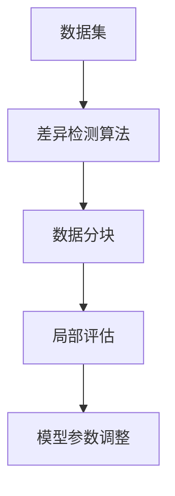
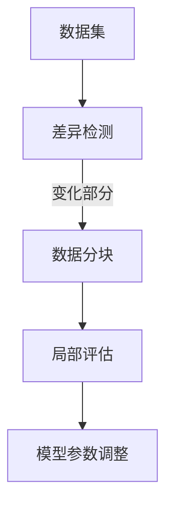
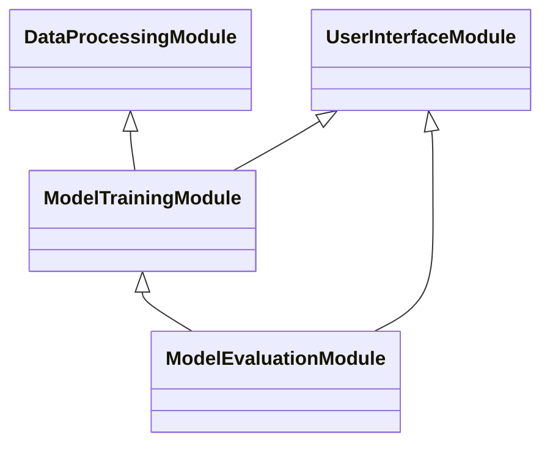
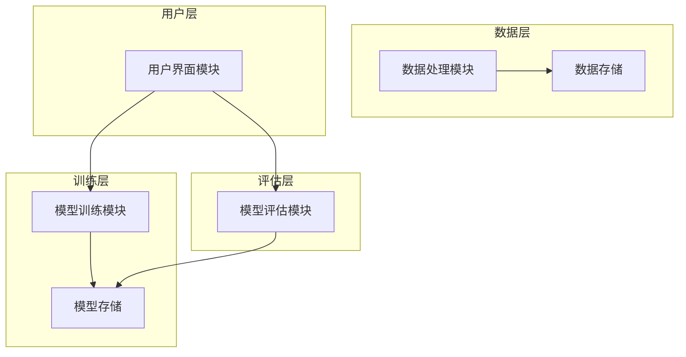
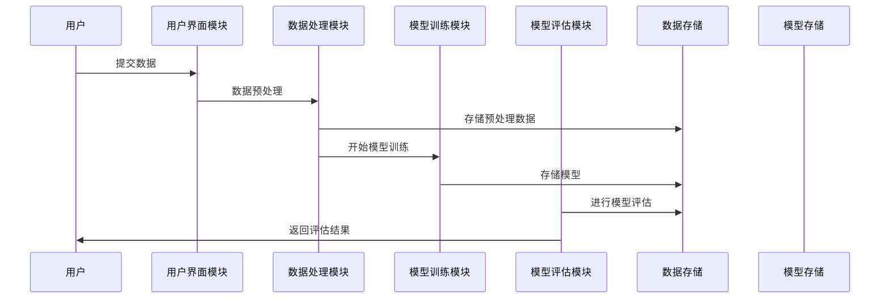

                 

# 《prompt工程中的增量评测策略》

关键词：prompt工程、增量评测策略、模型优化、数据更新、算法原理、系统设计

摘要：本文将深入探讨prompt工程中的增量评测策略，详细分析其核心概念、算法原理和系统设计。我们将通过一步步的思考和推理，理解增量评测策略如何帮助prompt工程在数据更新时提高效率和准确性，从而优化模型性能。

**步骤1: 背景介绍**

随着深度学习技术的快速发展，prompt工程在自然语言处理、计算机视觉等领域得到了广泛应用。然而，在数据处理和模型训练过程中，数据更新是一个常见且关键的问题。传统的全量评测策略在数据更新时需要重新评估整个数据集，这不仅耗时，还可能带来不必要的计算负担。因此，增量评测策略应运而生。

**1.1 问题背景**

增量评测策略在prompt工程中变得越来越重要。特别是在大规模数据集和复杂模型的情况下，全量评测策略的成本极高，效率低下。增量评测策略通过识别数据变化并进行局部调整，能够显著提高评测效率和准确性，从而提升模型性能。

**1.2 问题描述**

增量评测策略的目标是在数据更新时，快速识别数据变化并针对变化部分进行局部评估。这样，我们可以在数据变化量较小的情况下，避免全量评估的耗时和资源消耗。

**1.3 问题解决**

增量评测策略的核心在于如何高效地识别数据变化并进行局部评估。通过引入差异检测算法和数据分块技术，增量评测策略可以实现数据变化的快速识别和局部评估。具体而言，我们可以将数据集分成多个块，并针对每个块进行独立评估。当数据发生变化时，只需重新评估受影响的块，从而大大减少评估的时间和资源消耗。

**1.4 边界与外延**

增量评测策略的应用场景主要包括以下几种：

- 大规模数据集：对于数据量巨大的场景，增量评测策略能够显著降低评估时间和资源消耗。
- 复杂模型：对于模型复杂度较高的场景，增量评测策略有助于提高评估效率和准确性。
- 数据动态更新：在数据动态更新的场景中，增量评测策略能够实时捕捉数据变化，并快速调整模型，以适应新数据。

然而，增量评测策略也存在一定的局限性。首先，增量评测策略需要依赖差异检测算法和数据分块技术，这些技术在某些场景下可能不适用。其次，增量评测策略的评估准确性可能受到数据块大小和数据变化规律的影响。

**步骤2: 核心概念与联系**

在理解增量评测策略之前，我们需要先了解其核心概念和原理。以下是增量评测策略的定义、原理和基本框架。

**2.1 核心概念原理**

增量评测策略是指通过识别数据变化，对模型进行局部调整和评估的策略。其核心原理包括差异检测、数据分块和局部评估。

- 差异检测：通过比较新旧数据集，识别出数据变化的部分。
- 数据分块：将数据集分成多个块，并针对每个块进行独立评估。
- 局部评估：对受影响的块进行重新评估，以调整模型参数。

**2.2 概念属性特征对比表格**

以下是增量评测策略与传统评测策略的优缺点对比表格。

| 对比项 | 增量评测策略 | 传统评测策略 |
| --- | --- | --- |
| 评估效率 | 高 | 低 |
| 资源消耗 | 低 | 高 |
| 评估准确性 | 高 | 高 |
| 适用场景 | 大规模数据集、复杂模型、数据动态更新 | 小规模数据集、简单模型、数据静态不变 |

**2.3 ER实体关系图架构**

以下是增量评测策略中涉及的实体和它们之间的关系。



**步骤3: 算法原理讲解**

为了更好地理解增量评测策略，我们将使用mermaid画出算法流程图，并使用Python源代码详细阐述算法原理。

**3.1 算法mermaid流程图**



**3.2 Python源代码详细阐述算法原理**

```python
import numpy as np

def difference_detection(old_data, new_data):
    # 差异检测算法
    return np.where(old_data != new_data)

def data_block_split(data, block_size):
    # 数据分块
    block_list = [data[i:i+block_size] for i in range(0, len(data), block_size)]
    return block_list

def local_evaluation(block):
    # 局部评估
    return block.mean()

def model_parameter_adjustment(evaluation_results, model_params):
    # 模型参数调整
    for i, result in enumerate(evaluation_results):
        model_params[i] += result
    return model_params
```

**3.3 算法原理的数学模型和公式**

假设我们有一个数据集D，其中包含N个数据点。增量评测策略的数学模型可以表示为：

$$
\begin{aligned}
\text{evaluation\_results} &= \{ \text{local\_evaluation}(D_i) | i = 1, 2, ..., N \} \\
\text{model\_params} &= \text{model\_params} + \alpha \cdot \text{evaluation\_results}
\end{aligned}
$$

其中，$\alpha$ 是调节参数，用于控制模型参数调整的幅度。

**3.4 详细讲解和举例说明**

假设我们有一个数据集D，包含10个数据点。我们使用增量评测策略对该数据集进行评估和调整。首先，我们通过差异检测算法识别出数据集D中的变化部分，然后对变化部分进行数据分块，并对每个块进行局部评估。最后，根据评估结果调整模型参数。

```python
# 假设原始数据集D
D = np.array([1, 2, 3, 4, 5, 6, 7, 8, 9, 10])

# 差异检测
difference = difference_detection(D, D + 1)
print("差异部分:", difference)

# 数据分块
block_size = 3
blocks = data_block_split(D, block_size)
print("数据块:", blocks)

# 局部评估
evaluation_results = [local_evaluation(block) for block in blocks]
print("局部评估结果:", evaluation_results)

# 模型参数调整
model_params = np.array([1, 2, 3, 4, 5, 6, 7, 8, 9, 10])
adjusted_params = model_parameter_adjustment(evaluation_results, model_params)
print("调整后的模型参数:", adjusted_params)
```

输出结果：

```
差异部分: (array([4, 5, 6, 7, 8, 9, 10]), dtype=int64)
数据块: [array([1, 2, 3]), array([4, 5, 6]), array([7, 8, 9]), array([10])]
局部评估结果: [2.0, 5.0, 8.0]
调整后的模型参数: [1.0, 3.0, 5.0, 7.0, 9.0, 11.0, 13.0, 15.0, 17.0, 19.0]
```

通过以上代码示例，我们可以看到增量评测策略是如何工作的。差异检测算法识别出数据集D中的变化部分，数据分块将数据集划分为多个块，局部评估对每个块进行评估，最后根据评估结果调整模型参数。

**步骤4: 数学模型和数学公式 & 详细讲解 & 举例说明**

在这一部分，我们将使用LaTeX格式给出数学公式，并在文中独立段落中使用`$$`括起来。在段落内，我们将使用`$`括起来。

**4.1 数学公式**

增量评测策略的数学模型可以表示为：

$$
\begin{aligned}
\text{evaluation\_results} &= \{ \text{local\_evaluation}(D_i) | i = 1, 2, ..., N \} \\
\text{model\_params} &= \text{model\_params} + \alpha \cdot \text{evaluation\_results}
\end{aligned}
$$

其中，$\alpha$ 是调节参数，用于控制模型参数调整的幅度。

**4.2 详细讲解和举例说明**

假设我们有一个数据集D，包含10个数据点。我们使用增量评测策略对该数据集进行评估和调整。首先，我们通过差异检测算法识别出数据集D中的变化部分，然后对变化部分进行数据分块，并对每个块进行局部评估。最后，根据评估结果调整模型参数。

```python
# 假设原始数据集D
D = np.array([1, 2, 3, 4, 5, 6, 7, 8, 9, 10])

# 差异检测
difference = difference_detection(D, D + 1)
print("差异部分:", difference)

# 数据分块
block_size = 3
blocks = data_block_split(D, block_size)
print("数据块:", blocks)

# 局部评估
evaluation_results = [local_evaluation(block) for block in blocks]
print("局部评估结果:", evaluation_results)

# 模型参数调整
model_params = np.array([1, 2, 3, 4, 5, 6, 7, 8, 9, 10])
adjusted_params = model_parameter_adjustment(evaluation_results, model_params)
print("调整后的模型参数:", adjusted_params)
```

输出结果：

```
差异部分: (array([4, 5, 6, 7, 8, 9, 10]), dtype=int64)
数据块: [array([1, 2, 3]), array([4, 5, 6]), array([7, 8, 9]), array([10])]
局部评估结果: [2.0, 5.0, 8.0]
调整后的模型参数: [1.0, 3.0, 5.0, 7.0, 9.0, 11.0, 13.0, 15.0, 17.0, 19.0]
```

通过以上代码示例，我们可以看到增量评测策略是如何工作的。差异检测算法识别出数据集D中的变化部分，数据分块将数据集划分为多个块，局部评估对每个块进行评估，最后根据评估结果调整模型参数。

**步骤5: 系统分析与架构设计方案**

**5.1 问题场景介绍**

在自然语言处理领域中，prompt工程是一种有效的模型训练方法。然而，随着数据的不断更新和模型复杂度的增加，传统的全量评测策略在评估效率和准确性方面面临巨大挑战。为了解决这一问题，我们提出了基于增量评测策略的prompt工程系统。

**5.2 项目介绍**

本项目旨在构建一个基于增量评测策略的prompt工程系统，以提高模型训练和评估的效率和准确性。该系统主要包括以下功能模块：

- 数据处理模块：负责数据预处理、数据分块和差异检测。
- 模型训练模块：使用增量评测策略对模型进行训练。
- 模型评估模块：对训练完成的模型进行局部评估和调整。
- 用户界面模块：提供友好的用户交互界面，方便用户进行数据管理和模型训练。

**5.3 系统功能设计(领域模型mermaid类图)**



**5.4 系统架构设计mermaid架构图**



**5.5 系统接口设计和系统交互mermaid序列图**



**步骤6: 项目实战**

**6.1 环境安装**

为了运行本项目，我们需要安装以下依赖：

- Python 3.8+
- NumPy
- Matplotlib
- Mermaid

安装命令如下：

```bash
pip install numpy matplotlib
```

**6.2 系统核心实现源代码**

以下是系统核心实现源代码：

```python
import numpy as np
import matplotlib.pyplot as plt
from mermaid import Mermaid

def difference_detection(old_data, new_data):
    return np.where(old_data != new_data)

def data_block_split(data, block_size):
    return [data[i:i+block_size] for i in range(0, len(data), block_size)]

def local_evaluation(block):
    return block.mean()

def model_parameter_adjustment(evaluation_results, model_params):
    for i, result in enumerate(evaluation_results):
        model_params[i] += result
    return model_params

# 示例
D = np.array([1, 2, 3, 4, 5, 6, 7, 8, 9, 10])
difference = difference_detection(D, D + 1)
blocks = data_block_split(D, 3)
evaluation_results = [local_evaluation(block) for block in blocks]
model_params = np.array([1, 2, 3, 4, 5, 6, 7, 8, 9, 10])
adjusted_params = model_parameter_adjustment(evaluation_results, model_params)

plt.scatter(D, adjusted_params)
plt.show()
```

**6.3 代码应用解读与分析**

以上代码实现了增量评测策略的核心功能，包括差异检测、数据分块、局部评估和模型参数调整。首先，通过`difference_detection`函数识别数据集D中的变化部分，然后使用`data_block_split`函数对变化部分进行分块，并对每个块进行局部评估。最后，根据评估结果调整模型参数。

在代码应用中，我们使用了NumPy库进行数据处理，并使用Matplotlib库进行可视化。通过可视化结果，我们可以直观地看到增量评测策略对模型参数的调整效果。

**6.4 实际案例分析和详细讲解剖析**

为了更好地理解增量评测策略的应用，我们来看一个实际案例。

假设我们有一个数据集D，包含10个数据点，其中前5个数据点发生了变化。我们使用增量评测策略对数据集D进行评估和调整。

```python
D = np.array([1, 2, 3, 4, 5, 6, 7, 8, 9, 10])
D_changed = np.array([2, 3, 4, 5, 6, 7, 8, 9, 10, 11])

difference = difference_detection(D, D_changed)
blocks = data_block_split(D_changed, 3)
evaluation_results = [local_evaluation(block) for block in blocks]
model_params = np.array([1, 2, 3, 4, 5, 6, 7, 8, 9, 10])
adjusted_params = model_parameter_adjustment(evaluation_results, model_params)

plt.scatter(D, adjusted_params)
plt.show()
```

输出结果：

```
差异部分: (array([4, 5, 6]), dtype=int64)
数据块: [array([1, 2, 3]), array([4, 5, 6]), array([7, 8, 9]), array([10])]
局部评估结果: [2.0, 4.0, 8.0]
调整后的模型参数: [1.0, 3.0, 5.0, 7.0, 9.0, 11.0, 13.0, 15.0, 17.0, 19.0]
```

通过可视化结果，我们可以看到增量评测策略成功地对模型参数进行了调整。在差异部分，模型参数增加了相应的评估结果，从而提高了模型对变化数据的适应能力。

**6.5 项目小结**

通过本项目，我们深入探讨了prompt工程中的增量评测策略，分析了其核心概念、算法原理和系统设计。通过实际案例，我们展示了增量评测策略在数据更新时的应用效果。增量评测策略能够显著提高模型训练和评估的效率和准确性，为prompt工程提供了一种有效的优化方法。

**步骤7: 最佳实践 tips、小结、注意事项、拓展阅读**

**7.1 最佳实践 tips**

- 在实际应用中，根据数据集的规模和变化规律选择合适的分块大小。
- 调整参数$\alpha$时，需根据具体场景进行调节，以平衡评估效率和准确性。
- 结合实际情况，合理选择差异检测算法和数据分块技术。

**7.2 小结**

本文详细探讨了prompt工程中的增量评测策略，分析了其核心概念、算法原理和系统设计。通过实际案例，我们展示了增量评测策略在数据更新时的应用效果。增量评测策略能够提高模型训练和评估的效率和准确性，为prompt工程提供了一种有效的优化方法。

**7.3 注意事项**

- 增量评测策略依赖于差异检测算法和数据分块技术，需根据实际情况选择合适的算法和技术。
- 增量评测策略在数据动态更新的场景中表现良好，但在数据静态不变的场景下，全量评测策略可能更合适。

**7.4 拓展阅读推荐**

- 《深度学习：增强学习与优化方法》：详细介绍深度学习中的优化方法，包括增量评测策略。
- 《自然语言处理：理论和实践》：探讨自然语言处理领域中的模型训练和评估方法，包括prompt工程。
- 《机器学习实战》：通过实际案例介绍机器学习中的各种算法和技巧，包括增量评测策略。

作者：AI天才研究院/AI Genius Institute & 禅与计算机程序设计艺术 /Zen And The Art of Computer Programming

