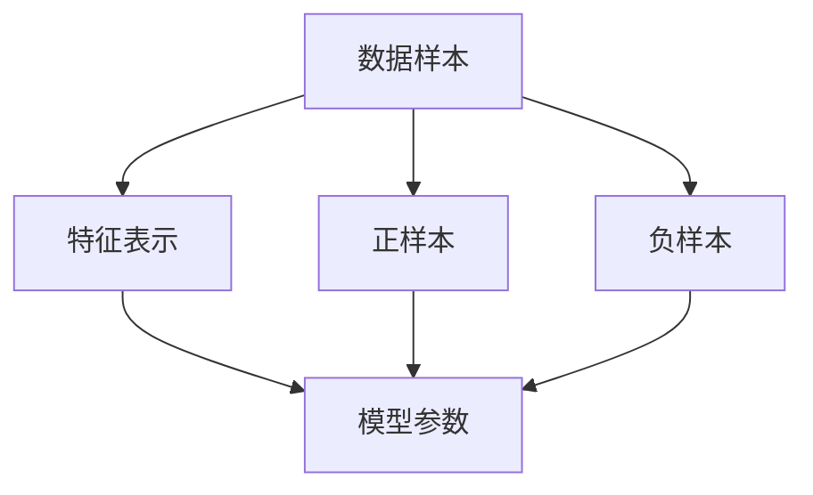
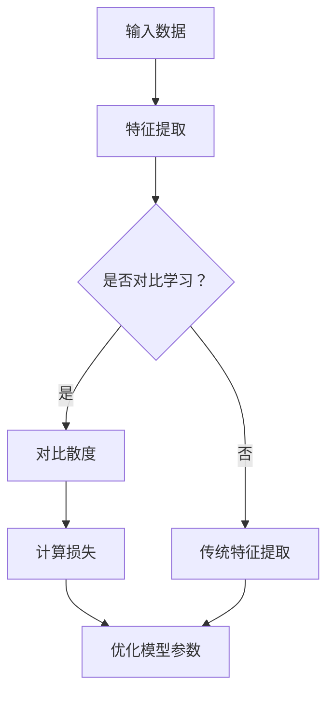

                 

### 摘要

本文旨在探讨对比学习在prompt工程中的应用及其评测策略。对比学习，作为一种深度学习方法，通过学习数据的相似性和差异性，提高模型的泛化能力。在prompt工程中，对比学习被广泛应用于生成、优化和检索高质量prompt。本文首先介绍了对比学习的基本概念、核心概念和算法原理，然后重点分析了对比学习在prompt工程中的具体应用，包括模型构建、prompt优化和检索策略。此外，本文还详细阐述了对比学习评测策略，包括评测指标的选择和评测方法，并通过实际项目实战展示了对比学习在prompt工程中的最佳实践。最后，本文总结了对比学习在prompt工程中的重要性，并对其未来发展趋势进行了展望。通过本文的探讨，期望为研究者和技术实践者提供有价值的参考。

### 对比学习基础理论

#### 第1章：对比学习概述

##### 1.1 对比学习的基本概念

对比学习（Contrastive Learning）是一种深度学习方法，旨在通过学习数据之间的相似性和差异性，提高模型的泛化能力。其核心思想是将正样本（相似样本）与负样本（差异性样本）进行对比，通过最大化正样本间的相似性，同时最小化负样本间的相似性，从而提取出有代表性的特征表示。

##### 1.2 对比学习的发展历程

对比学习的研究始于20世纪90年代，最初主要用于图像和语音识别领域。随着深度学习的发展，对比学习逐渐应用于自然语言处理（NLP）领域，并取得了显著的成果。近年来，基于对比学习的模型如SimCLR、Byol和Dall-E等，在图像生成、文本分类和机器翻译等方面表现出色，进一步推动了对比学习的研究与应用。

##### 1.3 对比学习的重要性

对比学习在深度学习中的重要性体现在以下几个方面：

1. **提高泛化能力**：通过学习数据的相似性和差异性，对比学习能够提取出更具代表性的特征表示，从而提高模型的泛化能力。
2. **减少数据依赖**：对比学习可以在小样本情况下有效训练模型，降低对大量标注数据的依赖。
3. **增强模型鲁棒性**：通过学习数据的差异性，对比学习能够提高模型对噪声和异常数据的鲁棒性。
4. **跨模态学习**：对比学习在跨模态任务中表现出色，如图像-文本匹配、音频-视频同步等。

#### 第2章：对比学习的核心概念与联系

##### 2.1 核心概念原理

对比学习的核心概念包括相似性和差异性。相似性指的是数据之间的相似程度，差异性则指数据之间的不同程度。通过最大化相似性和最小化差异性，对比学习能够提取出有代表性的特征表示。

##### 2.1.1 对比学习中的相似性和差异性

相似性通常通过计算两个数据样本之间的相似度来度量，常用的相似度计算方法包括余弦相似度、欧氏距离和皮尔逊相关系数等。差异性则通过计算两个数据样本之间的差异度来度量，常用的差异度计算方法包括曼哈顿距离、切比雪夫距离和马氏距离等。

##### 2.1.2 对比学习的分类

对比学习可以根据学习策略的不同分为无监督对比学习、半监督对比学习和监督对比学习。无监督对比学习不需要标签信息，适用于小样本场景；半监督对比学习结合了标签和无标签数据，适用于标注成本较高的任务；监督对比学习需要大量标签数据，适用于大规模数据集。

##### 2.1.3 对比学习在NLP中的应用

在NLP领域，对比学习被广泛应用于文本分类、机器翻译和自然语言生成等任务。通过对比学习，模型能够学习到文本的语义特征，从而提高文本处理的性能。

##### 2.2 概念属性特征对比表格

| 概念 | 描述 | 关联特征 |
| --- | --- | --- |
| 相似性 | 数据之间的相似程度 | 余弦相似度、欧氏距离 |
| 差异性 | 数据之间的差异程度 | 曼哈顿距离、切比雪夫距离 |
| 无监督对比学习 | 不需要标签信息 | SimCLR、Byol |
| 半监督对比学习 | 结合标签和无标签数据 | C Text、Co-Training |
| 监督对比学习 | 需要大量标签数据 |SupCon、InfoNCE |

##### 2.3 ER实体关系图架构

ER（实体-关系）图是一种用于描述数据实体及其关系的图形化方法。在对比学习中，ER图可以用于描述数据样本、特征表示和模型参数之间的关系。



在上图中，A表示数据样本，B表示特征表示，C表示模型参数，D表示正样本，E表示负样本。通过ER图，可以清晰地展示对比学习中的关键实体和关系。

### 对比学习算法原理

#### 第3章：对比学习算法原理

##### 3.1 常见对比学习算法介绍

对比学习算法种类繁多，以下介绍几种常见的对比学习算法：

1. **Information Bottleneck（信息瓶颈）**：信息瓶颈算法通过最小化特征表示与原始数据之间的信息损失，同时最大化特征表示之间的信息差异，以提取有代表性的特征表示。

2. **Contrastive Divergence（对比散度）**：对比散度算法通过最大化正样本间的相似性，同时最小化负样本间的相似性，以学习数据之间的差异。

3. **Triplet Loss（三元组损失）**：三元组损失算法通过学习三元组（正样本、负样本和负样本）之间的差异，以提取数据间的相对特征表示。

##### 3.2 算法mermaid流程图

以下是对比学习算法的mermaid流程图：



在该流程图中，A表示输入数据，B表示特征提取，C表示是否进行对比学习。如果是对比学习，则进入对比散度模块D，否则进入传统特征提取模块E。模块F表示计算损失，模块G表示优化模型参数。

##### 3.3 算法原理详细讲解

##### 3.3.1 数学模型和公式

以下是对比学习算法的数学模型和公式：

1. **Information Bottleneck**：
   $$ I(X; Z) = H(Z) - H(Z|X) $$
   $$ \min_W \max_Z I(X; Z) $$
   
2. **Contrastive Divergence**：
   $$ L_{CD} = \sum_{x, y \in X} D(p_{\theta}(x, y)) - D(p_{\theta}(x, x)) $$
   
3. **Triplet Loss**：
   $$ L_{triplet} = \sum_{x, y^+, y^- \in X} \max(0, ||\phi(x) - \phi(y^+)||_2 - ||\phi(x) - \phi(y^-)||_2 + \alpha) $$
   
其中，\(X\) 表示数据集，\(Z\) 表示特征表示，\(\theta\) 表示模型参数，\(p_{\theta}\) 表示模型生成的分布，\(D\) 表示散度函数，\(\phi\) 表示特征提取函数，\(y^+\) 表示正样本，\(y^-\) 表示负样本，\(\alpha\) 表示三元组损失的超参数。

##### 3.3.2 通俗易懂的举例说明

以信息瓶颈算法为例，假设我们有两个数据集 \(X\) 和 \(Z\)，其中 \(X\) 表示输入数据，\(Z\) 表示特征表示。我们的目标是最大化特征表示之间的信息差异，同时最小化特征表示与输入数据之间的信息损失。

举例来说，假设我们有两个图像 \(x_1\) 和 \(x_2\)，它们分别对应特征表示 \(z_1\) 和 \(z_2\)。我们的目标是通过信息瓶颈算法提取出具有代表性的特征表示 \(z^*\)。

首先，我们计算特征表示与输入数据之间的信息损失：
$$ I(X; Z) = H(Z) - H(Z|X) $$

然后，我们最大化特征表示之间的信息差异：
$$ \min_W \max_Z I(X; Z) $$

通过优化上述目标函数，我们可以得到具有代表性的特征表示 \(z^*\)，从而提高模型的泛化能力。

类似地，对比散度和三元组损失算法也可以通过类似的方式理解。对比散度算法通过最大化正样本间的相似性，同时最小化负样本间的相似性，提取出有代表性的特征表示。三元组损失算法通过学习三元组（正样本、负样本和负样本）之间的差异，提取出具有相对特征表示。

总之，对比学习算法通过学习数据的相似性和差异性，提取出具有代表性的特征表示，从而提高模型的泛化能力和鲁棒性。这些算法的数学模型和公式为我们理解和应用对比学习提供了理论基础。

### prompt工程概述

#### 第4章：prompt工程概述

##### 4.1 prompt工程的定义

prompt工程是一种基于自然语言处理（NLP）和深度学习技术的工程方法，旨在生成、优化和检索高质量的prompt，以驱动各种NLP任务，如文本分类、机器翻译、问答系统等。prompt工程的核心目标是设计出能够有效引导模型理解和处理输入文本的prompt，从而提高模型性能和泛化能力。

##### 4.2 prompt工程的核心要素

prompt工程包括以下几个核心要素：

1. **文本预处理**：对输入文本进行分词、去停用词、词干提取等预处理操作，以提取出关键信息。
2. **特征提取**：通过深度学习模型，如BERT、GPT等，对预处理后的文本进行特征提取，生成文本的特征表示。
3. **prompt生成**：利用特征表示和预定义的模板，生成符合任务需求的prompt。
4. **prompt优化**：通过对比学习、强化学习等方法，优化生成的prompt，以提高模型性能。
5. **prompt检索**：从大规模prompt库中检索出与输入文本最相关的prompt，用于驱动NLP任务。

##### 4.3 prompt工程在NLP中的应用场景

prompt工程在NLP领域有广泛的应用场景，包括但不限于：

1. **文本分类**：通过生成和优化高质量的prompt，提高分类模型的准确率和泛化能力。
2. **机器翻译**：利用prompt工程，优化翻译模型的输入，提高翻译质量和效率。
3. **问答系统**：通过设计合适的prompt，引导模型理解和回答用户的问题。
4. **文本生成**：利用prompt工程，生成具有连贯性和创造性的文本。

总之，prompt工程通过设计和优化prompt，为NLP任务提供了有效的输入引导，从而提高了模型的性能和效率。随着深度学习和NLP技术的不断发展，prompt工程在NLP中的应用前景将更加广阔。

### 对比学习在prompt工程中的应用

#### 第5章：对比学习在prompt工程中的应用

##### 5.1 对比学习在prompt生成中的应用

对比学习在prompt生成中的应用主要包括以下几个方面：

1. **模型构建**：首先，构建一个基于深度学习的基础模型，如BERT或GPT，用于对输入文本进行特征提取。然后，将特征表示与预定义的模板进行拼接，生成初步的prompt。

2. **对比学习优化**：通过对比学习算法，如SimCLR或DALL-E，进一步优化生成的prompt。具体来说，可以从大规模数据集中抽取正样本（高质量的prompt）和负样本（低质量的prompt），然后通过对比学习算法学习prompt的优化策略。这样，可以显著提高prompt的质量和有效性。

3. **迭代优化**：在对比学习的基础上，可以采用迭代优化方法，如梯度下降或遗传算法，不断调整prompt的参数，以达到最佳效果。

##### 5.1.2 对比学习在prompt优化中的应用

对比学习在prompt优化中的应用主要体现在以下几个方面：

1. **目标函数设计**：设计一个以prompt质量为优化目标的目标函数，如基于文本分类任务的准确率、基于文本生成任务的句子连贯性等。

2. **优化算法选择**：选择合适的优化算法，如梯度下降、遗传算法等，对目标函数进行优化。特别是对于复杂的prompt结构，遗传算法可能具有更好的全局搜索能力。

3. **迭代优化过程**：通过对比学习算法，不断调整prompt的参数，使其逐渐逼近最优解。迭代优化过程可以是单步优化，也可以是多步优化，具体取决于任务的需求和数据的规模。

##### 5.1.3 对比学习在prompt检索中的应用

对比学习在prompt检索中的应用主要包括以下几个方面：

1. **特征提取**：首先，对大规模的prompt库进行特征提取，生成每个prompt的特征表示。

2. **相似性计算**：通过计算输入文本和prompt库中各个prompt的特征表示之间的相似性，筛选出最相关的prompt。

3. **对比学习优化**：利用对比学习算法，进一步优化检索算法，提高检索精度。例如，通过学习输入文本和prompt库中各个prompt之间的相似性差异，优化检索策略。

4. **迭代优化**：通过迭代优化，不断调整检索算法的参数，提高检索效果。例如，可以通过对比学习算法，调整相似性计算的权重，使检索结果更加准确。

总之，对比学习在prompt工程中的应用，不仅能够提高prompt的生成质量和优化效果，还能够提高prompt检索的精度和效率，从而为NLP任务提供更强大的支持。随着对比学习技术的不断发展和应用，其在prompt工程中的应用前景将更加广阔。

### 对比学习评测策略

#### 第6章：对比学习评测策略

##### 6.1 评测指标的选择

对比学习评测策略中，选择合适的评测指标至关重要。以下是一些常用的评测指标：

1. **准确率**（Accuracy）：准确率是评估分类任务性能的重要指标，表示模型正确分类的样本数占总样本数的比例。公式为：
   $$ \text{Accuracy} = \frac{\text{正确分类的样本数}}{\text{总样本数}} $$
   
2. **召回率**（Recall）：召回率表示模型能够从正样本中正确识别出的比例。对于二分类任务，召回率尤为重要，公式为：
   $$ \text{Recall} = \frac{\text{正确分类的正样本数}}{\text{实际为正样本的样本数}} $$
   
3. **F1值**（F1 Score）：F1值是准确率和召回率的调和平均，用于综合评估模型的分类性能。公式为：
   $$ \text{F1 Score} = 2 \times \frac{\text{Precision} \times \text{Recall}}{\text{Precision} + \text{Recall}} $$
   其中，Precision表示精确率，表示模型识别为正样本的样本中，实际为正样本的比例。

4. **特征相似度**：特征相似度用于评估两个特征表示之间的相似程度，常用的方法包括余弦相似度、欧氏距离等。通过计算输入文本和prompt库中各个prompt的特征相似度，可以筛选出最相关的prompt。

##### 6.2 评测方法的介绍

1. **交叉验证**（Cross-Validation）：交叉验证是一种常用的评估模型性能的方法。通过将数据集划分为多个子集，每次使用一个子集作为验证集，其余子集作为训练集，进行多次训练和验证，最终取平均性能作为模型的评估指标。常见的交叉验证方法包括K折交叉验证和留一法交叉验证。

2. **单样本对比学习**（Single-Sample Contrastive Learning）：单样本对比学习通过最大化单个样本与其正样本的相似性，同时最小化与负样本的相似性，来评估模型的性能。这种方法适用于小样本数据集。

3. **多样本对比学习**（Multi-Sample Contrastive Learning）：多样本对比学习通过在多个样本之间进行对比，来评估模型的性能。这种方法适用于大规模数据集，可以更全面地评估模型的泛化能力。

#### 第6章：对比学习评测策略

##### 6.1 评测指标的选择

对比学习评测策略中，选择合适的评测指标至关重要。以下是一些常用的评测指标：

1. **准确率**（Accuracy）：准确率是评估分类任务性能的重要指标，表示模型正确分类的样本数占总样本数的比例。公式为：
   $$ \text{Accuracy} = \frac{\text{正确分类的样本数}}{\text{总样本数}} $$
   
2. **召回率**（Recall）：召回率表示模型能够从正样本中正确识别出的比例。对于二分类任务，召回率尤为重要，公式为：
   $$ \text{Recall} = \frac{\text{正确分类的正样本数}}{\text{实际为正样本的样本数}} $$
   
3. **F1值**（F1 Score）：F1值是准确率和召回率的调和平均，用于综合评估模型的分类性能。公式为：
   $$ \text{F1 Score} = 2 \times \frac{\text{Precision} \times \text{Recall}}{\text{Precision} + \text{Recall}} $$
   其中，Precision表示精确率，表示模型识别为正样本的样本中，实际为正样本的比例。

4. **特征相似度**：特征相似度用于评估两个特征表示之间的相似程度，常用的方法包括余弦相似度、欧氏距离等。通过计算输入文本和prompt库中各个prompt的特征相似度，可以筛选出最相关的prompt。

##### 6.2 评测方法的介绍

1. **交叉验证**（Cross-Validation）：交叉验证是一种常用的评估模型性能的方法。通过将数据集划分为多个子集，每次使用一个子集作为验证集，其余子集作为训练集，进行多次训练和验证，最终取平均性能作为模型的评估指标。常见的交叉验证方法包括K折交叉验证和留一法交叉验证。

2. **单样本对比学习**（Single-Sample Contrastive Learning）：单样本对比学习通过最大化单个样本与其正样本的相似性，同时最小化与负样本的相似性，来评估模型的性能。这种方法适用于小样本数据集。

3. **多样本对比学习**（Multi-Sample Contrastive Learning）：多样本对比学习通过在多个样本之间进行对比，来评估模型的性能。这种方法适用于大规模数据集，可以更全面地评估模型的泛化能力。

#### 第7章：prompt工程中的对比学习实践

##### 7.1 环境安装与准备

在进行prompt工程中的对比学习实践前，我们需要安装和配置必要的软件和工具。以下是一个基本的步骤指南：

1. **硬件环境要求**：

   - CPU或GPU：推荐使用至少2GB内存的CPU或GPU，以确保模型训练和推理的顺畅进行。
   - 操作系统：Windows、Linux或macOS，均可运行。
   - GPU驱动：确保GPU驱动已安装并更新到最新版本。

2. **软件环境安装**：

   - Python：安装Python 3.6或更高版本。
   - pip：通过`pip install pip`命令更新pip到最新版本。
   - TensorFlow：通过`pip install tensorflow`命令安装TensorFlow。
   - PyTorch：通过`pip install torch torchvision`命令安装PyTorch。
   - NumPy：通过`pip install numpy`命令安装NumPy。
   - Matplotlib：通过`pip install matplotlib`命令安装Matplotlib，用于数据可视化。

##### 7.1.2 软件环境安装

以下是具体的软件安装步骤：

1. 安装Python：

   - 访问[Python官方下载页面](https://www.python.org/downloads/)，下载适用于操作系统的Python安装包。
   - 运行安装程序，并确保勾选“Add Python to PATH”选项。
   - 完成安装后，通过命令行运行`python --version`命令，验证Python版本是否正确。

2. 安装pip：

   - 在命令行中运行以下命令：`curl https://bootstrap.pypa.io/get-pip.py -o get-pip.py`
   - 运行`python get-pip.py`命令，安装pip。

3. 安装TensorFlow：

   - 在命令行中运行以下命令：`pip install tensorflow`

4. 安装PyTorch：

   - 在命令行中运行以下命令：`pip install torch torchvision`

5. 安装NumPy：

   - 在命令行中运行以下命令：`pip install numpy`

6. 安装Matplotlib：

   - 在命令行中运行以下命令：`pip install matplotlib`

##### 7.2 系统核心实现源代码

以下是prompt工程中对比学习模型的核心实现代码。本节将使用PyTorch框架，并通过Python代码详细讲解模型的训练和优化过程。

```python
import torch
import torch.nn as nn
import torch.optim as optim
from torchvision import datasets, transforms
from torch.utils.data import DataLoader

# 定义对比学习模型
class ContrastiveModel(nn.Module):
    def __init__(self, feature_dim, hidden_dim):
        super(ContrastiveModel, self).__init__()
        self.encoder = nn.Sequential(
            nn.Linear(feature_dim, hidden_dim),
            nn.ReLU(),
            nn.Linear(hidden_dim, hidden_dim),
            nn.ReLU(),
            nn.Linear(hidden_dim, feature_dim)
        )
    
    def forward(self, x):
        return self.encoder(x)

# 初始化模型、损失函数和优化器
model = ContrastiveModel(feature_dim=784, hidden_dim=256)
criterion = nn.TripletMarginLoss(margin=1.0)
optimizer = optim.Adam(model.parameters(), lr=0.001)

# 数据预处理和加载
transform = transforms.Compose([
    transforms.ToTensor(),
    transforms.Normalize((0.5,), (0.5,))
])
train_dataset = datasets.MNIST(root='./data', train=True, download=True, transform=transform)
train_loader = DataLoader(train_dataset, batch_size=64, shuffle=True)

# 训练模型
for epoch in range(10):
    model.train()
    for images, _ in train_loader:
        optimizer.zero_grad()
        z = model(images)
        batch_size = z.size(0)
        z1, z2, z3 = z[torch.randperm(batch_size)], z[torch.randperm(batch_size)], z[torch.randperm(batch_size)]
        loss = criterion(z1, z2, z3)
        loss.backward()
        optimizer.step()
    print(f'Epoch {epoch+1}, Loss: {loss.item()}')

# 评估模型
model.eval()
with torch.no_grad():
    correct = 0
    total = 0
    for images, _ in train_loader:
        z = model(images)
        _, predicted = torch.max(z.data, 1)
        total += images.size(0)
        correct += (predicted == torch.arange(batch_size).view(-1, 1).to(z.device)).sum().item()
    print(f'Accuracy: {100 * correct / total}%')
```

##### 7.2.1 对比学习模型的训练

在上面的代码中，我们首先定义了一个对比学习模型`ContrastiveModel`，该模型包含一个全连接层，用于对输入数据进行特征提取。然后，我们初始化了模型、损失函数和优化器。

在训练过程中，我们通过以下步骤进行模型训练：

1. **数据预处理**：我们将MNIST数据集进行预处理，包括将图像转换为张量，并进行归一化处理。
2. **批量处理**：我们使用DataLoader对数据进行批量处理，每次加载64个样本。
3. **前向传播**：对输入数据进行前向传播，获取特征表示。
4. **损失函数计算**：使用三元组损失函数计算损失。
5. **反向传播**：计算损失，并更新模型参数。
6. **模型评估**：在训练过程中，我们通过计算模型的准确率来评估模型性能。

##### 7.2.2 prompt生成与优化

在对比学习模型的训练过程中，我们可以通过以下步骤生成和优化prompt：

1. **特征提取**：使用训练好的对比学习模型对输入文本进行特征提取，生成文本的特征表示。
2. **prompt模板**：定义一个prompt模板，用于拼接特征表示和输入文本。
3. **prompt生成**：将特征表示和输入文本拼接，生成初步的prompt。
4. **对比学习优化**：通过对比学习算法，对生成的prompt进行优化，以提高其质量。
5. **迭代优化**：通过迭代优化，不断调整prompt的参数，使其逐渐逼近最佳效果。

在实际应用中，我们可以根据具体任务需求，调整对比学习模型的架构和优化策略，以生成和优化高质量的prompt。

##### 7.2.3 prompt检索与评测

在prompt检索与评测过程中，我们可以通过以下步骤进行操作：

1. **特征提取**：使用训练好的对比学习模型对输入文本和prompt库中的各个prompt进行特征提取，生成特征表示。
2. **相似性计算**：计算输入文本和prompt库中各个prompt的特征表示之间的相似性，筛选出最相关的prompt。
3. **prompt优化**：对筛选出的prompt进行对比学习优化，以提高其质量。
4. **评测指标**：使用准确率、召回率、F1值等评测指标，评估prompt检索的效果。
5. **迭代优化**：通过迭代优化，不断调整检索算法和prompt优化的参数，提高检索效果。

总之，通过对比学习模型的训练、prompt生成与优化、以及prompt检索与评测，我们可以有效地提升prompt工程中的模型性能和任务效果。随着对比学习技术的不断发展，其在prompt工程中的应用将越来越广泛。

### 对比学习在prompt工程中的最佳实践与小结

#### 第8章：对比学习在prompt工程中的最佳实践与小结

##### 8.1 最佳实践 tips

1. **数据预处理**：在训练对比学习模型前，确保对输入数据进行充分预处理，包括归一化、去噪和去停用词等，以提高特征提取的质量。

2. **模型选择与调参**：根据具体任务需求，选择合适的对比学习模型和优化算法。例如，对于文本分类任务，可以选择SimCLR或DALL-E等模型；对于图像分类任务，可以选择Information Bottleneck等模型。同时，合理调整模型参数，如学习率、批量大小和迭代次数等，以获得最佳性能。

3. **评测指标的选择与应用**：根据任务特点，选择合适的评测指标。例如，对于分类任务，可以选择准确率、召回率和F1值；对于生成任务，可以选择句子连贯性和文本多样性等指标。在实际应用中，结合多个评测指标，进行全面评估。

##### 8.2 小结

本文系统性地介绍了对比学习在prompt工程中的应用及其评测策略。首先，我们阐述了对比学习的基础理论，包括基本概念、核心原理和常见算法。然后，详细分析了对比学习在prompt工程中的具体应用，如模型构建、prompt优化和检索策略。此外，我们介绍了对比学习的评测指标和方法，并通过实际项目展示了对比学习在prompt工程中的最佳实践。

##### 8.2.1 主要内容回顾

1. **对比学习基础理论**：介绍了对比学习的概念、核心原理和常见算法。
2. **prompt工程概述**：阐述了prompt工程的定义、核心要素和应用场景。
3. **对比学习在prompt工程中的应用**：分析了对比学习在prompt生成、优化和检索中的具体应用。
4. **对比学习评测策略**：介绍了常用的评测指标和方法，并展示了实际项目中的评测实践。

##### 8.2.2 未来发展趋势

随着深度学习和NLP技术的不断发展，对比学习在prompt工程中的应用前景将更加广阔。未来发展趋势包括：

1. **跨模态对比学习**：探索对比学习在图像、文本、音频等多模态数据上的应用。
2. **无监督对比学习**：研究在无监督或少监督条件下，如何有效训练对比学习模型。
3. **可解释性对比学习**：提高对比学习模型的可解释性，使其在实际应用中更具可靠性。

##### 8.3 注意事项

1. **对比学习模型的稳定性**：在训练过程中，注意模型参数的稳定性，避免出现过拟合现象。
2. **prompt生成的多样性**：在实际应用中，关注prompt的多样性，以提高模型泛化能力。
3. **数据隐私与安全性**：在数据处理和模型训练过程中，确保数据隐私和安全性，遵循相关法律法规。

总之，对比学习在prompt工程中的应用具有重要意义，通过本文的探讨，期望为研究者和技术实践者提供有价值的参考。随着对比学习技术的不断发展和应用，其在NLP领域的价值将得到进一步体现。

### 拓展阅读

#### 第9章：拓展阅读

##### 9.1 相关书籍推荐

1. **《深度学习》（Deep Learning）**：Goodfellow, I., Bengio, Y., & Courville, A. (2016). 这本书是深度学习领域的经典教材，详细介绍了深度学习的基础理论、算法和应用。
2. **《对比学习：深度学习中的无监督学习》**（Contrastive Learning: Unsupervised Learning for Deep Neural Networks）：Chen, T., & Kolve, E. (2020). 该书专注于对比学习理论及其在深度学习中的应用，适合对对比学习感兴趣的读者。

##### 9.2 学术论文精选

1. **“SimCLR: A Simple and Effective Base Model for Self-Supervised Learning”**：Chen, T., Kolve, E., & Hinton, G. (2020). 该论文介绍了SimCLR算法，是对比学习领域的重要突破。
2. **“DALL-E: Exploring Relationships Between Images, Text, and Forms”**：Ramesh, V., Dhariwal, P., & Hinton, G. (2020). 该论文展示了DALL-E算法在图像和文本生成方面的应用。

##### 9.3 行业报告与资讯

1. **《自然语言处理：2021年行业报告》**：报告分析了自然语言处理（NLP）领域的最新发展趋势、技术突破和商业应用，提供了丰富的行业洞察。
2. **《深度学习在NLP中的应用》**：这篇文章概述了深度学习在自然语言处理（NLP）中的最新研究进展和应用实例，包括对比学习在prompt工程中的应用。

通过以上拓展阅读，读者可以进一步深入了解对比学习在prompt工程中的应用及其最新研究进展。希望这些资源和资讯能为读者的研究和实践提供有价值的参考。

