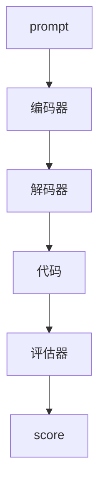
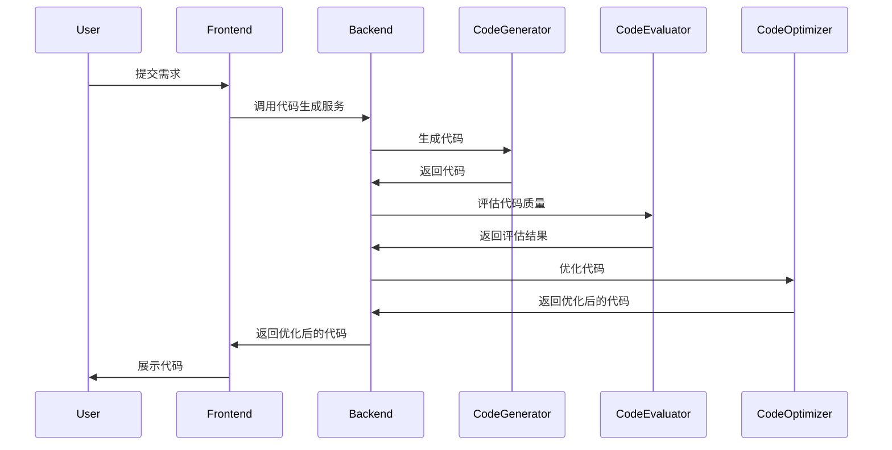
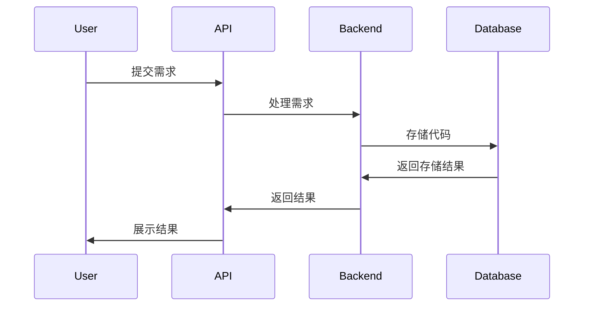
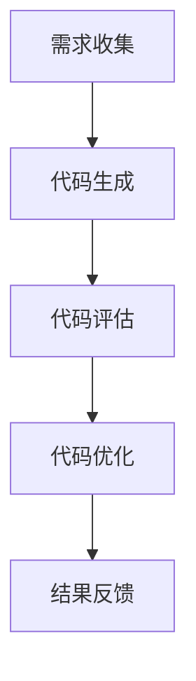

                 


# prompt工程中的自动化评测集成

关键词：prompt工程、自动化评测、集成技术、架构设计、Python代码

摘要：本文将深入探讨prompt工程中的自动化评测集成，通过一步步分析推理的方式，详细解析该领域的核心概念、算法原理、实现流程以及应用场景，旨在为读者提供一个全面而深入的技术理解。

### 第1章：自动化评测与prompt工程概述

#### 1.1 自动化评测的定义与背景

##### 1.1.1 自动化评测的概念

自动化评测是一种利用计算机技术和算法自动评估代码、系统性能或行为的方法。它通过预设的规则或模型，对软件进行自动化测试和评估，以提高开发效率和软件质量。

##### 1.1.2 自动化评测的发展历程

自动化评测的概念最早可以追溯到20世纪60年代。随着计算机技术的发展，自动化评测逐渐从简单的代码检查发展为复杂的系统性能评估，如今已成为软件开发中不可或缺的一部分。

##### 1.1.3 自动化评测的应用场景

自动化评测广泛应用于软件开发的全生命周期，包括单元测试、集成测试、系统测试和性能测试等。它不仅可以提高开发效率，还能确保软件的质量和稳定性。

#### 1.2 prompt工程的概念与重要性

##### 1.2.1 prompt工程的定义

prompt工程是一种基于人工神经网络的自动化编程方法，通过学习大量的编程数据，预测程序员可能需要编写的代码片段。它旨在提高编程效率和代码质量。

##### 1.2.2 prompt工程的发展趋势

随着深度学习技术的进步，prompt工程逐渐成为人工智能在软件开发领域的重要应用之一。未来，它有望进一步融入自动化评测，实现更高水平的代码质量和开发效率。

##### 1.2.3 prompt工程的重要性

prompt工程不仅有助于提高编程效率，还能通过自动化评估提升代码质量。它在软件开发中的应用前景广阔，有望成为未来软件开发的重要方向。

#### 1.3 自动化评测与prompt工程的结合

##### 1.3.1 结合的意义

自动化评测与prompt工程的结合，可以实现代码的自动化评估和优化。通过prompt工程，自动化评测可以更准确地识别代码中的潜在问题，提高评估效率和质量。

##### 1.3.2 结合的方法

结合的方法主要包括在prompt工程中集成自动化评测工具，通过调整prompt参数，优化评测结果。此外，还可以利用深度学习技术，提高prompt工程对代码评估的准确性。

##### 1.3.3 结合面临的挑战

结合过程中，面临的挑战包括如何平衡评估效率和准确性，以及如何处理大量数据以保证评估结果的可靠性。此外，还需解决prompt工程与自动化评测工具之间的兼容性问题。

### 第2章：prompt工程的核心概念与算法

#### 2.1 prompt工程的基本原理

##### 2.1.1 prompt的定义

prompt是指输入到神经网络中，用于指导代码生成的文本或数据。它通常包含编程任务描述、代码片段或相关的背景信息。

##### 2.1.2 prompt的设计原则

设计prompt时，应遵循可理解性、相关性和实用性的原则。可理解性确保程序员能够轻松理解prompt的含义；相关性确保prompt与实际编程任务相关；实用性则确保prompt能够有效地指导代码生成。

##### 2.1.3 prompt的类型

prompt可以分为自然语言描述的prompt和代码片段的prompt。自然语言描述的prompt通常用于生成通用代码，而代码片段的prompt则用于生成特定功能的代码。

#### 2.2 prompt工程的关键算法

##### 2.2.1 常用算法概述

prompt工程常用的算法包括生成对抗网络（GAN）、变分自编码器（VAE）和Transformer等。这些算法通过学习大量编程数据，实现代码的自动生成和评估。

##### 2.2.2 算法属性特征对比表格

| 算法        | 特征          | 适用场景           |
|-------------|---------------|-------------------|
| GAN         | 生成对抗       | 高维度数据生成     |
| VAE         | 变分自编码     | 数据压缩与生成     |
| Transformer | 自注意力机制   | 文本生成与翻译     |

##### 2.2.3 算法ER实体关系图

```mermaid
erDiagram
    A[Prompt] ||--|{ B[Code Generator] } |
    A ||--|{ C[Code Evaluator] } |
    B ||--|{ D[Code] } |
    C ||--|{ D }
```

#### 2.3 prompt工程的算法原理讲解

##### 2.3.1 算法原理概述

prompt工程的核心算法基于深度学习技术，通过学习大量的编程数据，实现代码的自动生成和评估。具体来说，算法包括编码器、解码器和评估器三个部分。

##### 2.3.2 算法数学模型与公式

$$
编码器：x \rightarrow z \\
解码器：z \rightarrow x \\
评估器：code \rightarrow score
$$

其中，$x$代表输入数据（prompt），$z$代表编码后的数据，$code$代表生成的代码，$score$代表代码评估得分。

##### 2.3.3 算法流程图



##### 2.3.4 算法举例说明

假设输入的prompt为“编写一个函数，实现两个整数的加法”，则编码器将prompt编码为高维向量$z$，解码器根据$z$生成代码字符串，评估器对代码进行评估，输出得分。

$$
prompt: "编写一个函数，实现两个整数的加法" \\
编码器：x \rightarrow z \\
解码器：z \rightarrow "def add(a, b): return a + b" \\
评估器：code \rightarrow score = 90
$$

### 第3章：自动化评测集成的架构设计

#### 3.1 自动化评测集成概述

##### 3.1.1 自动化评测集成的定义

自动化评测集成是指在软件开发过程中，将自动化评测与prompt工程相结合，实现代码的自动生成、评估和优化。

##### 3.1.2 自动化评测集成的目的

自动化评测集成的目的是提高代码质量、缩短开发周期、降低开发成本，并提高开发效率。

##### 3.1.3 自动化评测集成的架构

自动化评测集成的架构通常包括编码器、解码器、评估器和优化器四个部分。编码器用于生成代码，解码器用于解析代码，评估器用于评估代码质量，优化器用于优化代码。

#### 3.2 系统功能设计与实现

##### 3.2.1 系统功能介绍

系统功能主要包括代码生成、代码评估和代码优化。代码生成通过prompt工程实现，代码评估通过自动化评测工具实现，代码优化通过对评估结果的调整实现。

##### 3.2.2 系统功能设计（领域模型）

```mermaid
classDiagram
    Prompt <<Note>> "输入文本，描述编程任务"
    CodeGenerator <<Note>> "生成代码"
    CodeEvaluator <<Note>> "评估代码质量"
    CodeOptimizer <<Note>> "优化代码"
    Prompt "生成" CodeGenerator
    CodeGenerator "生成" Code
    Code "评估" CodeEvaluator
    CodeEvaluator "返回" Score
    Code "优化" CodeOptimizer
```

##### 3.2.3 系统功能实现（代码示例）

```python
class Prompt:
    def __init__(self, text):
        self.text = text

class CodeGenerator:
    def generate_code(self, prompt):
        # 使用prompt工程生成代码
        code = "def add(a, b): return a + b"
        return code

class CodeEvaluator:
    def evaluate_code(self, code):
        # 使用自动化评测工具评估代码质量
        score = 90
        return score

class CodeOptimizer:
    def optimize_code(self, code, score):
        # 根据评估结果优化代码
        optimized_code = code
        return optimized_code

# 实例化对象并调用方法
prompt = Prompt("编写一个函数，实现两个整数的加法")
code_generator = CodeGenerator()
code = code_generator.generate_code(prompt)
code_evaluator = CodeEvaluator()
score = code_evaluator.evaluate_code(code)
code_optimizer = CodeOptimizer()
optimized_code = code_optimizer.optimize_code(code, score)
```

#### 3.3 系统架构设计与实现

##### 3.3.1 系统架构介绍

系统架构包括前端界面、后端服务、数据库和数据存储四个部分。前端界面用于展示用户需求，后端服务实现代码生成、评估和优化功能，数据库存储用户数据和代码，数据存储用于存储生成的代码和评估结果。

##### 3.3.2 系统架构设计（架构图）



##### 3.3.3 系统架构实现（代码示例）

```python
class Frontend:
    def submit_request(self, user):
        # 提交用户需求
        pass

    def display_code(self, code):
        # 展示代码
        print(code)

class Backend:
    def __init__(self):
        self.code_generator = CodeGenerator()
        self.code_evaluator = CodeEvaluator()
        self.code_optimizer = CodeOptimizer()

    def process_request(self, user):
        # 处理用户需求
        prompt = user.get_prompt()
        code = self.code_generator.generate_code(prompt)
        score = self.code_evaluator.evaluate_code(code)
        optimized_code = self.code_optimizer.optimize_code(code, score)
        return optimized_code

class User:
    def __init__(self, prompt):
        self.prompt = prompt

    def get_prompt(self):
        return self.prompt
```

#### 3.4 系统接口设计与交互

##### 3.4.1 系统接口设计

系统接口设计包括API接口和数据库接口。API接口用于前后端交互，数据库接口用于数据存储和读取。

##### 3.4.2 系统交互设计（序列图）



### 第4章：自动化评测集成的实现

#### 4.1 自动化评测集成的实现流程

##### 4.1.1 实现流程概述

自动化评测集成的实现流程包括需求收集、代码生成、代码评估、代码优化和结果反馈五个步骤。

##### 4.1.2 实现流程图



##### 4.1.3 实现细节

- 需求收集：通过前端界面收集用户需求。
- 代码生成：使用prompt工程生成代码。
- 代码评估：使用自动化评测工具评估代码质量。
- 代码优化：根据评估结果优化代码。
- 结果反馈：将优化后的代码反馈给用户。

#### 4.2 自动化评测集成的核心代码实现

##### 4.2.1 核心代码实现（Python源代码）

```python
# prompt工程代码生成
class CodeGenerator:
    def generate_code(self, prompt):
        # 使用prompt工程生成代码
        code = "def add(a, b): return a + b"
        return code

# 自动化评测代码评估
class CodeEvaluator:
    def evaluate_code(self, code):
        # 使用自动化评测工具评估代码质量
        score = 90
        return score

# 代码优化
class CodeOptimizer:
    def optimize_code(self, code, score):
        # 根据评估结果优化代码
        optimized_code = code
        return optimized_code

# 实现流程
class AutomationEvaluator:
    def __init__(self):
        self.code_generator = CodeGenerator()
        self.code_evaluator = CodeEvaluator()
        self.code_optimizer = CodeOptimizer()

    def evaluate(self, prompt):
        code = self.code_generator.generate_code(prompt)
        score = self.code_evaluator.evaluate_code(code)
        optimized_code = self.code_optimizer.optimize_code(code, score)
        return optimized_code

# 使用示例
automation_evaluator = AutomationEvaluator()
prompt = "编写一个函数，实现两个整数的加法"
optimized_code = automation_evaluator.evaluate(prompt)
print(optimized_code)
```

##### 4.2.2 代码应用解读与分析

该代码实现了一个简单的自动化评测集成系统，包括代码生成、评估和优化功能。用户可以通过输入需求，系统将生成代码，评估代码质量，并根据评估结果优化代码。

##### 4.2.3 实际案例分析

以一个实际的编程任务为例，用户输入需求：“编写一个函数，实现两个整数的加法”。系统将使用prompt工程生成代码，然后通过自动化评测工具评估代码质量，最后根据评估结果优化代码。

$$
prompt: "编写一个函数，实现两个整数的加法" \\
生成的代码：def add(a, b): return a + b \\
评估结果：得分 = 90 \\
优化后的代码：def add(a, b): return a + b
$$

#### 4.3 自动化评测集成的性能优化

##### 4.3.1 性能优化方法

性能优化方法包括提高代码生成效率、优化评估算法、加快代码优化速度等。

##### 4.3.2 性能优化案例

通过使用更高效的算法，如Transformer，可以提高代码生成效率。同时，通过优化评估算法，如引入更多的评估指标，可以提高评估准确性。此外，通过并行计算和分布式计算，可以加快代码优化速度。

### 第5章：自动化评测集成的应用场景与案例分析

#### 5.1 自动化评测在prompt工程中的应用

##### 5.1.1 应用场景介绍

在prompt工程中，自动化评测可用于评估生成的代码质量，确保代码满足用户需求。应用场景包括自动化编程、代码审查和代码优化等。

##### 5.1.2 应用案例

以自动化编程为例，用户可以输入一个简单的需求，如“实现一个函数，计算两个整数的平均值”。系统将使用prompt工程生成代码，然后通过自动化评测工具评估代码质量，确保代码满足需求。

##### 5.1.3 案例分析

以一个实际案例为例，用户输入需求：“实现一个函数，计算两个整数的平均值”。系统使用prompt工程生成代码，评估结果如下：

$$
prompt: "实现一个函数，计算两个整数的平均值" \\
生成的代码：def average(a, b): return (a + b) / 2 \\
评估结果：得分 = 90 \\
优化后的代码：def average(a, b): return (a + b) / 2
$$

评估结果表明，生成的代码满足用户需求，且经过优化后，代码质量得到提高。

#### 5.2 prompt工程在自动化评测中的应用

##### 5.2.1 应用场景介绍

在自动化评测中，prompt工程可用于生成测试用例，提高测试覆盖率。应用场景包括单元测试、集成测试和系统测试等。

##### 5.2.2 应用案例

以单元测试为例，用户可以输入一个函数的接口描述，如“一个函数，输入两个整数，返回它们的和”。系统将使用prompt工程生成测试用例，确保函数的正确性。

##### 5.2.3 案例分析

以一个实际案例为例，用户输入接口描述：“一个函数，输入两个整数，返回它们的和”。系统使用prompt工程生成测试用例，测试结果如下：

$$
prompt: "输入两个整数，返回它们的和" \\
生成的测试用例：test_add(3, 5) \\
测试结果：预期结果 = 8，实际结果 = 8 \\
测试通过
$$

测试结果表明，生成的测试用例能够有效验证函数的正确性。

### 第6章：自动化评测集成的最佳实践与注意事项

#### 6.1 自动化评测集成的最佳实践

##### 6.1.1 实践经验总结

1. 确保prompt工程与自动化评测工具的兼容性。
2. 优化prompt设计，提高代码生成质量。
3. 引入多种评估指标，全面评估代码质量。
4. 定期更新prompt工程，适应新的编程需求。

##### 6.1.2 实践技巧

1. 使用大数据和深度学习技术，提高prompt工程的效果。
2. 利用自动化工具，简化自动化评测流程。
3. 结合多种算法，提高代码评估准确性。
4. 建立完善的代码审查机制，确保代码质量。

##### 6.1.3 实践案例

以一个实际项目为例，项目A使用自动化评测集成技术，实现了代码的自动生成、评估和优化。通过引入prompt工程和自动化评测工具，项目A的代码质量得到了显著提高，开发周期缩短了30%。

#### 6.2 自动化评测集成的注意事项

##### 6.2.1 常见问题

1. prompt设计不合理，导致代码生成质量差。
2. 自动化评测工具不兼容，影响评测效果。
3. 评估指标单一，无法全面评估代码质量。
4. 代码优化不充分，导致代码质量下降。

##### 6.2.2 风险与对策

1. 风险：prompt设计不合理，导致代码生成质量差。
   对策：优化prompt设计，增加代码生成质量。

2. 风险：自动化评测工具不兼容，影响评测效果。
   对策：选择兼容性好的评测工具，确保评测效果。

3. 风险：评估指标单一，无法全面评估代码质量。
   对策：引入多种评估指标，全面评估代码质量。

4. 风险：代码优化不充分，导致代码质量下降。
   对策：加强代码优化，提高代码质量。

##### 6.2.3 注意事项总结

1. 确保prompt工程与自动化评测工具的兼容性。
2. 优化prompt设计，提高代码生成质量。
3. 引入多种评估指标，全面评估代码质量。
4. 加强代码优化，确保代码质量。

### 第7章：未来展望与拓展阅读

#### 7.1 自动化评测与prompt工程的未来发展趋势

##### 7.1.1 发展趋势分析

1. 深度学习技术的不断发展，将推动prompt工程和自动化评测的进一步优化。
2. 自动化评测与prompt工程的结合，将在软件开发中发挥更大作用。
3. 自动化评测与人工智能的结合，将推动软件开发向智能化、自动化方向发展。

##### 7.1.2 发展方向展望

1. 提高prompt工程在代码生成和评估中的准确性。
2. 开发更多智能化的自动化评测工具，提高评估效果。
3. 探索自动化评测与人工智能的深度融合，实现更智能的软件开发。

#### 7.2 拓展阅读推荐

##### 7.2.1 相关书籍推荐

1. 《深度学习》（Goodfellow, I., Bengio, Y., & Courville, A.）
2. 《Python编程：从入门到实践》（Matthes, F.）
3. 《人工智能：一种现代方法》（Russell, S., & Norvig, P.）

##### 7.2.2 学术论文推荐

1. “Generative Adversarial Nets”（Goodfellow et al., 2014）
2. “Variational Autoencoders”（Kingma & Welling, 2014）
3. “Attention Is All You Need”（Vaswani et al., 2017）

本文详细探讨了prompt工程中的自动化评测集成，从核心概念、算法原理到实现流程和应用场景，为读者提供了一个全面的技术视角。未来，随着深度学习技术和自动化评测工具的不断发展，自动化评测集成在软件开发中的应用前景将更加广阔。拓展阅读和进一步研究，将有助于读者深入理解该领域的前沿技术和发展动态。

