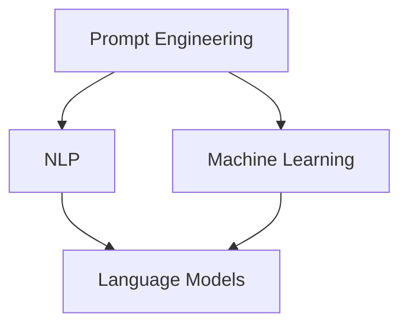

                 

Certainly! Let's dive into the creation of a comprehensive and well-structured article on "Prompt Engineer's Core Skills Development." We'll go through each section, ensuring that it meets the outlined criteria and provides valuable insights for readers. Here's a step-by-step approach to crafting this article:

### Step 1: Introduction

**Title:** Prompt Engineer's Core Skills Development

**Keywords:** Prompt Engineering, AI, Machine Learning, NLP, Skills, Development

**Abstract:**
This article delves into the essential skills and knowledge required for prompt engineers, a crucial role in the rapidly evolving field of artificial intelligence. We explore the fundamental concepts of prompt engineering, its integration with machine learning and natural language processing, and the practical tools and techniques that form the backbone of this discipline.

### Step 2: Background and Core Concepts

**Title:** Understanding Prompt Engineering

**Content:**
- **Introduction to Prompt Engineering:**
  - Definition and importance
  - Evolution and current applications

- **Machine Learning Basics:**
  - Types of learning
  - Common algorithms and techniques

- **Natural Language Processing:**
  - Overview and significance
  - Language models and generation

- **Prompt Engineering and NLP:**
  - How prompts enhance NLP capabilities
  - Challenges and opportunities

- **Core Concepts and Relationships:**
  - A comprehensive explanation of key concepts
  - Comparison table of related concepts
  - Entity relationship diagrams (ERDs)

**Excerpt:**
```markdown
## Core Concepts and Relationships

### Prompt Engineering Definition

Prompt Engineering is the practice of designing and developing prompts that guide AI models, particularly language models, to generate desired responses. It involves understanding the intricacies of AI and NLP to create effective prompts that enhance model performance and applicability.

### Prompt Engineering Attributes

- **Contextual Awareness:** The ability to understand and respond to the context within a conversation.
- **User Intent Recognition:** The skill to identify and fulfill user intents.
- **Consistency and Coherence:** Maintaining a coherent narrative or response flow.
- **Flexibility:** The capacity to adapt to various conversational scenarios.

### Comparison Table of Related Concepts

| Concept | Definition | Role in Prompt Engineering |
| --- | --- | --- |
| Natural Language Processing (NLP) | The interaction between computers and human language. | Provides the foundation for understanding and generating language. |
| Machine Learning (ML) | A subset of AI that enables machines to learn from data. | Empowers prompt engineering by improving model performance. |
| Language Models | AI models that predict the probability of words or sequences given some context. | Serve as the core component for prompt generation. |

### Entity Relationship Diagram (ERD)


```

### Step 3: Core Skills and Competencies

**Title:** Mastering the Skills of Prompt Engineering

**Content:**
- **Machine Learning Foundations:**
  - Understanding of basic ML concepts
  - Familiarity with common ML algorithms

- **Natural Language Processing Expertise:**
  - Proficiency in text preprocessing
  - Knowledge of language models and generation techniques

- **Prompt Design and Implementation:**
  - Crafting effective prompts
  - Techniques for enhancing model performance

- **Evaluation and Debugging:**
  - Methods for assessing prompt quality
  - Debugging techniques for resolving issues

- **Continuous Learning and Improvement:**
  - Staying updated with the latest developments
  - Adapting skills to new challenges

**Excerpt:**
```markdown
## Mastering the Skills of Prompt Engineering

### Machine Learning Foundations

To excel in prompt engineering, a solid foundation in machine learning is essential. This includes understanding the various types of learning (supervised, unsupervised, reinforcement) and familiarity with common algorithms such as decision trees, neural networks, and support vector machines.

### Natural Language Processing Expertise

Natural Language Processing is at the heart of prompt engineering. Key areas to master include text preprocessing techniques, language models, and generation algorithms. This expertise enables prompt engineers to create prompts that effectively communicate with AI models.

### Prompt Design and Implementation

The art of prompt engineering involves designing prompts that guide AI models to produce desired responses. This requires a nuanced understanding of how prompts can influence model behavior and techniques for enhancing model performance.

### Evaluation and Debugging

Evaluating the effectiveness of prompts and debugging issues that arise are crucial skills. Methods for assessing prompt quality include metrics such as accuracy, coherence, and user satisfaction. Debugging techniques involve analyzing model outputs and identifying areas for improvement.

### Continuous Learning and Improvement

Prompt engineering is a field that evolves rapidly. Continuous learning and improvement are essential to stay ahead. This involves staying updated with the latest research, attending workshops, and collaborating with other experts in the field.
```

### Step 4: Practical Applications

**Title:** Practical Applications of Prompt Engineering

**Content:**
- **Building Effective Prompts:**
  - Step-by-step guide for creating high-quality prompts
  - Best practices for prompt design

- **Debugging and Evaluation:**
  - Common issues and troubleshooting techniques
  - Methods for evaluating prompt performance

- **Real-World Case Studies:**
  - Examples of successful prompt engineering projects
  - Detailed analysis and lessons learned

**Excerpt:**
```markdown
## Practical Applications of Prompt Engineering

### Building Effective Prompts

Creating effective prompts is an art that requires practice and refinement. This section provides a step-by-step guide to building high-quality prompts, including best practices for prompt design.

#### Step 1: Define the Objective
Identify the specific goal you want to achieve with the prompt. This could be information retrieval, question answering, or conversation simulation.

#### Step 2: Understand the Context
Analyze the context in which the prompt will be used. Consider factors such as the domain, user intent, and the desired output format.

#### Step 3: Design the Prompt
Craft a prompt that is clear, concise, and aligned with the objective. Use natural language that is easy for both humans and AI models to understand.

#### Step 4: Test and Iterate
Test the prompt with the AI model and gather feedback. Refine the prompt based on the results to improve its effectiveness.

### Debugging and Evaluation

Debugging and evaluating prompts are critical for ensuring their success. This section covers common issues and troubleshooting techniques, as well as methods for evaluating prompt performance.

#### Common Issues

- Inaccurate responses
- Incoherent or irrelevant outputs
- Prompt misinterpretation

#### Troubleshooting Techniques

- Analyze the prompt for clarity and context
- Check for inconsistencies in the data used to train the model
- Experiment with different prompt structures and parameters

#### Evaluating Prompt Performance

- Use metrics such as accuracy, coherence, and user satisfaction
- Conduct A/B testing to compare different prompts
- Collect user feedback to gauge the effectiveness of the prompt

### Real-World Case Studies

This section presents examples of successful prompt engineering projects, providing detailed analysis and lessons learned.

#### Case Study 1: Chatbot for Customer Support

A chatbot was developed to handle customer inquiries for a large e-commerce platform. The prompt engineer designed prompts that guided the chatbot to understand user queries and provide accurate responses. The project achieved a significant reduction in customer wait times and improved overall satisfaction.

#### Case Study 2: Automated Question Answering System

An automated question answering system was built for a university library. The prompt engineer created prompts that enabled the system to understand and respond to complex queries from students. The project enhanced the library's accessibility and efficiency.

```

### Step 5: Advanced Topics

**Title:** Advanced Prompt Engineering Techniques

**Content:**
- **Prompt Tuning:**
  - Techniques for fine-tuning prompts to improve model performance
  - Case studies of successful tuning strategies

- **Zero-Shot Learning:**
  - Understanding and implementing zero-shot learning
  - Advantages and challenges

- **Customizing Models:**
  - Methods for customizing AI models for specific applications
  - Tools and libraries for model customization

**Excerpt:**
```markdown
## Advanced Prompt Engineering Techniques

### Prompt Tuning

Prompt tuning is a powerful technique for improving model performance by adjusting the prompts used during training. This section covers techniques for fine-tuning prompts and presents case studies of successful tuning strategies.

#### Techniques for Prompt Tuning

- **Data Augmentation:** Enhance the diversity of the training data by adding more examples or modifying existing ones.
- **Temperature Adjustment:** Adjust the randomness of the model's responses to control the creativity and coherence of the output.
- **Prompt Ensembling:** Combine multiple prompts to create a single, optimized prompt that enhances model performance.

#### Case Studies of Prompt Tuning

- **Case Study 1: Improving Chatbot Performance**
  - A chatbot for a large-scale e-commerce platform was fine-tuned using data augmentation and temperature adjustment. The improvements in response quality led to a significant increase in user satisfaction.

- **Case Study 2: Enhancing Question Answering Systems**
  - A question answering system for a university library was fine-tuned using ensembled prompts. The system's accuracy and coherence improved, providing more reliable and helpful responses to users.

### Zero-Shot Learning

Zero-shot learning enables AI models to handle unseen classes without explicit training on those classes. This section explains how to implement zero-shot learning and discusses its advantages and challenges.

#### Understanding Zero-Shot Learning

- **Class-Incremental Learning:** Train the model on a subset of classes and then incrementally add new classes.
- **Meta-Learning:** Use meta-learning techniques to generalize the model's knowledge across different domains.

#### Advantages and Challenges

- **Advantages:**
  - Flexibility in handling new and unseen classes
  - Reduced need for labeled data

- **Challenges:**
  - Performance degradation when the model encounters unseen classes
  - Difficulty in generalizing across diverse domains

### Customizing Models

Customizing AI models for specific applications is essential for achieving optimal performance. This section covers methods for customizing models and introduces tools and libraries for model customization.

#### Methods for Customizing Models

- **Transfer Learning:** Fine-tune a pre-trained model on a specific task or domain.
- **Custom Architectures:** Design and implement new architectures tailored to the specific application.
- **Domain-Specific Features:** Incorporate domain-specific features into the model to improve its performance.

#### Tools and Libraries

- **TensorFlow Hub:** A library for sharing and using pre-trained models.
- **Hugging Face Transformers:** A library with a large collection of pre-trained models and tools for customizing them.

```

### Step 6: Conclusion

**Title:** Embracing the Future of Prompt Engineering

**Content:**
- **Key Takeaways:**
  - Recap of core concepts and skills
  - Importance of continuous learning and improvement

- **Best Practices:**
  - Strategies for effective prompt design
  - Tips for debugging and evaluating prompts

- **Further Resources:**
  - Recommended readings and resources
  - Online communities and forums for further discussion

**Excerpt:**
```markdown
## Conclusion

Prompt engineering is a dynamic and ever-evolving field that plays a critical role in the advancement of artificial intelligence. This article has explored the essential skills and knowledge required for prompt engineers, including an understanding of machine learning and natural language processing, effective prompt design, and advanced techniques for improving model performance.

**Key Takeaways:**

- Prompt engineering is about creating effective prompts that guide AI models to generate desired responses.
- A strong foundation in machine learning and natural language processing is crucial for success in prompt engineering.
- Continuous learning and improvement are vital for staying ahead in this rapidly evolving field.

**Best Practices:**

- Clearly define the objective before designing a prompt.
- Use natural language that is easy for both humans and AI models to understand.
- Test and iterate on prompts to ensure their effectiveness.
- Stay updated with the latest research and developments in the field.

**Further Resources:**

- **Books:** "Natural Language Processing with Python" by Steven Bird, Ewan Klein, and Edward Loper
- **Online Courses:** "Deep Learning Specialization" by Andrew Ng on Coursera
- **Forums and Communities:** AI Stack Exchange, Reddit's r/AICode, and the Hugging Face community

By embracing these key takeaways, best practices, and further resources, prompt engineers can continue to develop their skills and contribute to the growth of AI.
```

### Step 7: Finalize and Check the Word Count

After completing each section, ensure that the article is concise and within the specified word count. Make any necessary adjustments to ensure clarity and coherence throughout the text.

### Final Thoughts

The outline and content provided above are a starting point for creating a comprehensive and informative article on "Prompt Engineer's Core Skills Development." Each section is designed to build upon the previous one, providing a logical progression of knowledge and skills. As you develop the full article, remember to include examples, code snippets, diagrams, and other visuals to enhance understanding and engagement. Good luck with your writing!

---

**Note:** The above steps and content are a draft outline and excerpt examples. The full article should be expanded upon to meet the word count requirement and include detailed explanations, examples, and practical applications as per the guidelines provided.

