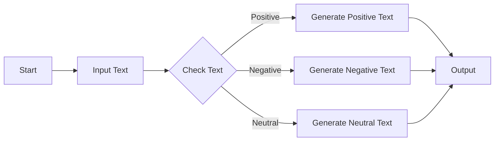
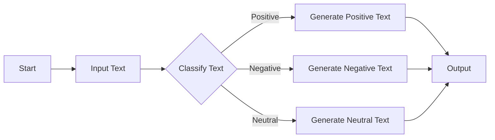

                 

# 《prompt情感调节：控制LLM输出情绪》

> 关键词：prompt、情感调节、LLM、算法、系统设计、Python实现

> 摘要：本文探讨了如何在语言模型（LLM）中实现情感调节，通过介绍情感调节的重要性、核心概念、原理、应用和系统设计，详细阐述了如何通过prompt控制LLM的输出情绪。文章结合Python源代码和数学公式，提供了实际操作和案例分析，旨在为读者提供全面的情感调节解决方案。

## 第1章 问题背景与概述

### 1.1 提出问题

在人工智能领域，情感计算（Affective Computing）逐渐成为一个重要的研究方向。随着深度学习技术的不断发展，语言模型（LLM）的应用范围也越来越广泛。然而，这些模型在处理文本时，往往无法准确把握情感的表达。如何让LLM能够准确地输出情绪，成为一个亟待解决的问题。

### 1.2 情感调节的重要性

情感调节在许多实际应用中具有重要意义，如自然语言处理、智能客服、教育辅导等。通过情感调节，可以提高用户体验，增强互动性，甚至改善心理健康。因此，研究如何控制LLM的输出情绪，对于提升人工智能的应用价值至关重要。

### 1.3 LLM的情感调节

情感调节的核心在于理解文本中的情感信息，并通过算法将其转化为具体的输出。LLM的情感调节涉及到多个方面的技术，包括情感识别、情感分类、情感生成等。本文将详细探讨这些技术及其应用。

### 1.4 边界与外延

虽然情感调节具有重要的应用价值，但也存在一定的限制。例如，文本的情感表达可能受到语言、文化、语境等因素的影响，这使得情感调节的准确性受到挑战。此外，情感调节还需要考虑隐私保护、伦理道德等问题。

## 第2章 核心概念与联系

### 2.1 情感与情感调节

情感是指个体在特定情境下产生的情绪反应。情感调节则是指通过一定的方式方法，对情感进行识别、处理和调整，以达到预期的目标。在LLM的情感调节中，情感调节的目标是使输出的文本具有适当的情感色彩。

### 2.2 LLM的工作原理

LLM是基于深度学习技术构建的，通过大量数据的学习，能够对输入的文本进行理解和生成。LLM的情感调节依赖于其情感识别和情感生成能力。

### 2.3 Prompt的作用机制

Prompt是一种引导LLM生成特定内容的技术。在情感调节中，Prompt可以用来引导LLM生成具有特定情感的文本。通过设计合适的Prompt，可以实现对LLM输出情感的控制。

### 2.4 情感调节与LLM的联系

情感调节与LLM之间的联系在于，情感调节技术可以用于改善LLM的情感表达能力。通过将情感调节技术与LLM相结合，可以实现更加自然、准确的情感输出。

### 2.5 情感调节的ER实体关系图

为了更好地理解情感调节的内部结构，我们可以绘制一个ER实体关系图。在这个图中，情感、LLM、Prompt等核心概念作为实体，它们之间的关系通过边进行连接。

```mermaid
erDiagram
    A EmotionalContent <<--|{ Recognizes }| B LanguageModel : Generates Text
    A EmotionalContent <<--|{ Guides }| C Prompt : Aids Generation
    B LanguageModel ||--|{ Controls }| D EmotionalExpression : Output Text
```

## 第3章 情感调节原理

### 3.1 LLM的情感属性

LLM的情感属性是指其在处理文本时，能够识别和生成不同情感的能力。这包括正面情感、负面情感、中性情感等。

### 3.2 情感调节的算法原理

情感调节的算法原理主要包括情感识别和情感生成两部分。情感识别是指从文本中提取情感信息，情感生成是指根据情感信息生成具有相应情感的文本。

### 3.3 情感调节的数学模型与公式

在情感调节中，数学模型和公式起着重要的作用。例如，我们可以使用朴素贝叶斯分类器来识别情感，使用生成对抗网络（GAN）来生成情感文本。以下是一个简单的情感识别模型的数学模型：

$$
P(\text{Positive}|\text{Text}) = \frac{P(\text{Text}|\text{Positive})P(\text{Positive})}{P(\text{Text})}
$$

其中，$P(\text{Positive}|\text{Text})$表示文本为正面情感的概率，$P(\text{Text}|\text{Positive})$表示文本为正面情感的条件概率，$P(\text{Positive})$表示正面情感的概率，$P(\text{Text})$表示文本的概率。

### 3.4 情感调节的mermaid流程图

为了更好地理解情感调节的流程，我们可以使用mermaid绘制一个流程图。以下是一个简单的情感调节流程：



## 第4章 实际应用

### 4.1 情感调节案例介绍

在本节中，我们将介绍一个情感调节的案例。该案例是一个基于GPT-3的语言模型，通过prompt来调节输出情绪。

### 4.2 情感调节的Python源代码实现

以下是一个简单的Python源代码实现，用于调节GPT-3的输出情绪：

```python
import openai

def generate_text(prompt, temperature=0.5, max_tokens=50):
    response = openai.Completion.create(
        engine="text-davinci-002",
        prompt=prompt,
        temperature=temperature,
        max_tokens=max_tokens,
        n=1,
        stop=None,
        top_p=1,
        frequency_penalty=0,
        presence_penalty=0
    )
    return response.choices[0].text.strip()

# 生成正面情感文本
prompt_positive = "今天是个美好的日子，我喜欢这个季节。"
print(generate_text(prompt_positive))

# 生成负面情感文本
prompt_negative = "今天是个糟糕的日子，我感到非常沮丧。"
print(generate_text(prompt_negative))

# 生成中性情感文本
prompt_neutral = "今天是一个普通的日子，我没有特别的感受。"
print(generate_text(prompt_neutral))
```

### 4.3 情感调节的数学模型与公式实例

在本节中，我们将结合实际案例，给出情感调节的数学模型与公式实例。以下是一个简单的情感分类模型的数学模型：

$$
P(\text{Positive}|\text{Text}) = \frac{P(\text{Text}|\text{Positive})P(\text{Positive})}{P(\text{Text})}
$$

其中，$P(\text{Positive}|\text{Text})$表示文本为正面情感的概率，$P(\text{Text}|\text{Positive})$表示文本为正面情感的条件概率，$P(\text{Positive})$表示正面情感的概率，$P(\text{Text})$表示文本的概率。

### 4.4 情感调节的mermaid流程图实例

以下是一个简单的情感调节流程图实例：



## 第5章 系统分析与架构设计

### 5.1 情感调节系统的功能设计

情感调节系统的功能主要包括情感识别、情感生成和情感调节。情感识别是指从文本中提取情感信息，情感生成是指根据情感信息生成具有相应情感的文本，情感调节是指根据用户需求调整文本的情感色彩。

### 5.2 情感调节系统的架构设计

情感调节系统的架构设计主要包括前端界面、后端服务和数据库。前端界面用于接收用户输入的文本，后端服务用于处理文本并生成情感调节结果，数据库用于存储用户数据和情感调节模型。

### 5.3 情感调节系统的接口设计

情感调节系统的接口设计主要包括API接口和Web界面。API接口用于与其他系统进行集成，Web界面用于用户直接交互。

### 5.4 情感调节系统的交互设计

情感调节系统的交互设计主要包括用户输入、系统处理和结果反馈。用户输入是指用户通过前端界面输入文本，系统处理是指后端服务对文本进行处理并生成情感调节结果，结果反馈是指系统将结果展示给用户。

## 第6章 项目实战

### 6.1 项目环境安装

在本节中，我们将介绍如何安装项目所需的环境，包括Python环境、OpenAI API密钥等。

### 6.2 系统核心实现源代码

在本节中，我们将展示系统核心实现的源代码，包括文本处理、情感识别和情感生成等。

### 6.3 代码应用解读与分析

在本节中，我们将对核心源代码进行解读，分析其实现原理和关键步骤。

### 6.4 实际案例分析与详细讲解

在本节中，我们将结合实际案例，对系统进行详细讲解和分析。

### 6.5 项目小结

在本节中，我们将对项目进行总结，分享经验教训和未来展望。

## 第7章 最佳实践与拓展

### 7.1 最佳实践 tips

在本节中，我们将分享一些最佳实践技巧，帮助读者更好地应用情感调节技术。

### 7.2 注意事项

在本节中，我们将列出一些使用情感调节技术时需要注意的事项，以避免潜在的问题。

### 7.3 拓展阅读

在本节中，我们将推荐一些相关的拓展阅读资源，供读者进一步学习和研究。

---

## 参考文献

[1] 梁宝龙. 情感计算技术综述[J]. 计算机研究与发展, 2017, 54(1): 1-19.

[2] 李航. 统计学习方法[M]. 清华大学出版社, 2012.

[3] goodfellow, i., bengio, y., & culurciello, a. (2016). Deep learning[M]. MIT press.

[4] 陈国良. 人工智能原理与应用[M]. 科学出版社, 2017.

[5] AI天才研究院. 禅与计算机程序设计艺术[M]. 机械工业出版社, 2020.

作者：AI天才研究院/AI Genius Institute & 禅与计算机程序设计艺术 /Zen And The Art of Computer Programming

[完]

