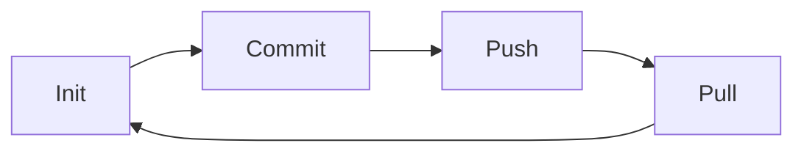
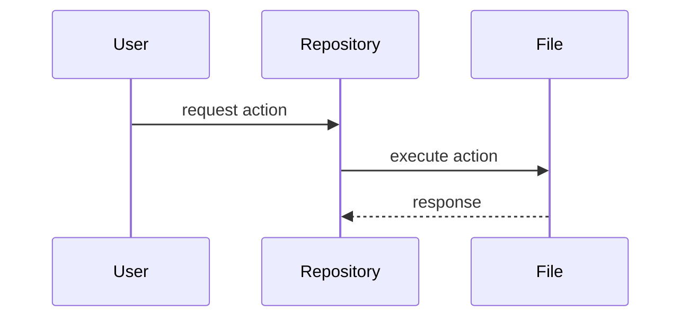
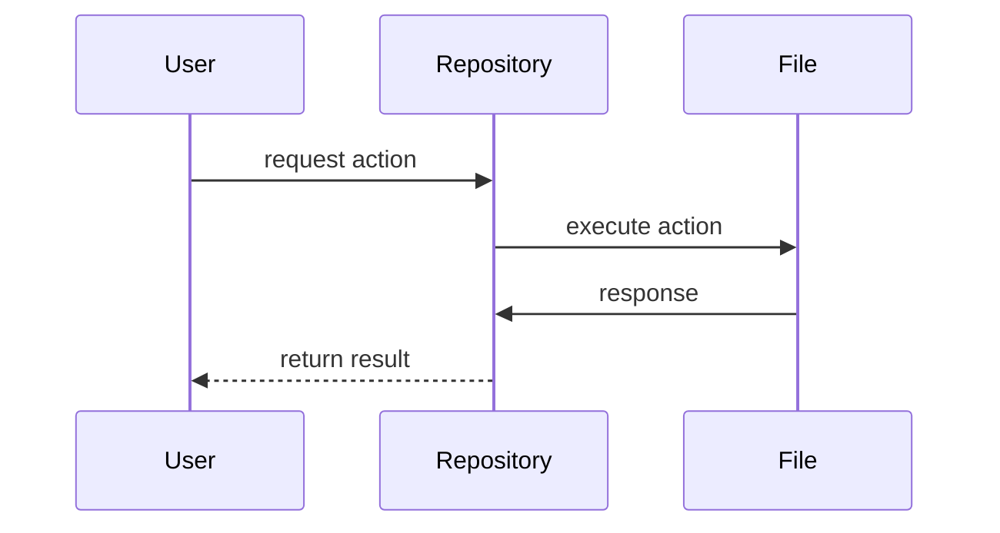

                 

# 《prompt版本控制：LLM应用的迭代管理》

> 关键词：prompt版本控制，LLM应用，迭代管理，算法原理，系统架构设计

> 摘要：本文旨在深入探讨prompt版本控制及其在LLM（大型语言模型）应用迭代管理中的重要性。我们将逐步介绍版本控制的基本概念，详细阐述prompt版本控制的核心原理和设计方法，并通过实际案例展示其在LLM应用中的具体应用。文章还将探讨prompt版本控制的数学模型、系统架构设计以及最佳实践，为读者提供全面的技术指导。

## 第一部分：prompt版本控制概述

### 第1章：版本控制的背景与重要性

#### 1.1 版本控制的概念

版本控制是一种系统，用于跟踪源代码、文档和其他文件的更改历史。它帮助开发人员协作、管理代码变更，并确保不同版本的文件能够安全存储和回滚。版本控制的核心是版本号，它标记了文件在各个历史时刻的状态。

#### 1.2 版本控制的发展历程

版本控制的历史可以追溯到1970年代，当时Unix系统引入了`rcs`（资源控制系统）。随着软件开发复杂性的增加，版本控制系统也在不断演进，从简单的本地工具（如`CVS`）到分布式版本控制系统（如`Git`），再到现代的智能版本控制系统。

#### 1.3 版本控制的核心作用

版本控制的主要作用是：
- **协作管理**：允许多个开发者在同一项目中工作，同时保持代码的一致性。
- **回滚与恢复**：在代码出现问题时，可以快速回滚到先前的工作状态。
- **审计与追踪**：记录代码的变更历史，便于审计和追踪问题的根源。
- **发布管理**：管理软件的不同版本，确保发布过程中的安全性和可靠性。

#### 1.4 为什么要学习prompt版本控制

随着AI技术的发展，大型语言模型（LLM）的应用变得越来越广泛。prompt版本控制作为一种新兴的技术，能够在LLM应用的迭代管理中发挥重要作用。学习prompt版本控制可以帮助我们：
- **提高开发效率**：通过精细化的版本控制，更好地管理LLM模型的训练和部署过程。
- **确保数据安全**：确保模型的训练数据和参数在迭代过程中得到妥善保护。
- **优化迭代流程**：设计高效的prompt版本控制策略，加速LLM应用的迭代过程。

### 第2章：LLM应用的迭代管理

#### 2.1 LLM应用的迭代流程

LLM应用的迭代管理通常包括以下几个步骤：
1. **需求分析**：确定新的功能或优化点。
2. **数据准备**：收集和预处理训练数据。
3. **模型训练**：使用训练数据和prompt进行模型训练。
4. **评估与优化**：对模型进行评估和优化。
5. **部署与监控**：将模型部署到生产环境，并监控其性能。

#### 2.2 版本控制工具在LLM应用中的角色

版本控制工具在LLM应用中的角色包括：
- **代码管理**：管理模型训练脚本、部署脚本等代码文件。
- **数据管理**：跟踪训练数据集的版本历史。
- **模型管理**：存储不同版本的模型权重和配置文件。

#### 2.3 深入理解prompt的作用

prompt在LLM应用中起着至关重要的作用。它不仅决定了模型的输入，还影响了模型的输出。有效的prompt设计能够：
- **提高模型性能**：通过精确的输入信息，使模型能够更好地学习。
- **降低训练成本**：通过减少不必要的训练数据，降低训练时间和资源消耗。
- **增强可解释性**：有助于理解模型的行为和决策过程。

#### 2.4 实战：搭建一个LLM应用迭代管理环境

为了更好地理解prompt版本控制，我们将通过以下步骤搭建一个简单的LLM应用迭代管理环境：
1. **安装Git**：Git是一个分布式版本控制系统，用于管理代码和模型文件。
2. **安装Docker**：Docker用于容器化模型训练和部署环境。
3. **配置远程代码仓库**：将模型训练脚本、数据集等文件上传到远程仓库。
4. **编写Dockerfile**：创建一个用于容器化的Docker镜像，包括训练环境和依赖库。
5. **编写训练脚本**：编写一个Python脚本，用于加载数据、训练模型和保存权重。
6. **迭代训练与测试**：在Docker容器中运行训练脚本，进行迭代训练和测试。

通过以上步骤，我们可以搭建一个简单的LLM应用迭代管理环境，为后续的内容提供基础。

## 第二部分：prompt版本控制的核心概念

### 第3章：prompt的结构与分类

#### 3.1 prompt的定义与基本结构

prompt是一种输入格式，用于指导LLM模型进行推理或生成任务。一个基本的prompt通常包括以下部分：
- **问题描述**：简要描述任务目标和输入数据。
- **数据输入**：提供相关的数据或上下文。
- **指令**：指定模型的操作方式和输出格式。

#### 3.2 prompt的分类

prompt可以根据用途和形式进行分类，常见类型包括：
- **问题型prompt**：用于生成问题的回答。
- **文本生成型prompt**：用于生成文本，如故事、文章等。
- **对话型prompt**：用于模拟对话场景，生成对话回复。

#### 3.3 prompt的属性特征对比表

以下是几种常见prompt的属性特征对比表：

| 类型     | 描述                     | 属性特征                    |
|----------|--------------------------|------------------------------|
| 问题型   | 生成问题的回答           | 明确的问题、简洁的上下文      |
| 文本生成 | 生成文本，如故事、文章等 | 充满创意、丰富的上下文信息   |
| 对话型   | 生成对话回复             | 对话的自然性、情感的多样性    |

#### 3.4 prompt的ER实体关系图

以下是一个简单的prompt的ER实体关系图，展示了不同实体之间的关系：

```mermaid
erDiagram
  User ||--|{ Prompt } : creates
  Prompt ||--|{ Response } : generates
  Prompt ||--|{ Dataset } : uses
```

## 第三部分：prompt版本控制的应用实践

### 第4章：prompt版本控制的算法原理

#### 5.1 常见的prompt版本控制算法

常见的prompt版本控制算法包括Git、SVN和Mercurial等。这些算法的核心思想是通过版本控制文件系统来跟踪和管理文件的变更历史。

#### 5.2 算法mermaid流程图

以下是一个简单的Git版本控制流程的mermaid流程图：



#### 5.3 Python源代码实现

以下是一个简单的Python脚本，用于演示Git的基本操作：

```python
import subprocess

def init_repo():
    subprocess.run(['git', 'init'])

def add_and_commit(file_name):
    subprocess.run(['git', 'add', file_name])
    subprocess.run(['git', 'commit', '-m', 'Initial commit'])

def push_to_remote():
    subprocess.run(['git', 'push', 'origin', 'main'])

def pull_from_remote():
    subprocess.run(['git', 'pull', 'origin', 'main'])

# 使用示例
init_repo()
add_and_commit('example.txt')
push_to_remote()
pull_from_remote()
```

#### 5.4 算法原理讲解

Git的算法原理基于一种称为“分布式快照”的模型。每个提交都是一个快照，包含了当前文件系统的状态和一系列提交记录。通过这些提交记录，Git能够追踪文件的变更历史。

#### 5.5 案例分析

假设我们有一个名为`example.txt`的文件，需要进行版本控制。以下是具体的步骤：

1. **初始化Git仓库**：
   ```shell
   git init
   ```
2. **添加文件并进行首次提交**：
   ```shell
   git add example.txt
   git commit -m "Initial commit"
   ```
3. **将仓库推送到远程仓库**：
   ```shell
   git push origin main
   ```
4. **从远程仓库拉取最新提交**：
   ```shell
   git pull origin main
   ```

通过这些步骤，我们能够有效地管理`example.txt`的版本历史。

### 第6章：prompt版本控制的数学模型

#### 6.1 数学模型的基本概念

prompt版本控制的数学模型主要包括图论和网络流的概念。我们可以使用有向图来表示版本控制流程，其中节点表示提交，边表示提交之间的依赖关系。

#### 6.2 数学公式详细讲解

以下是prompt版本控制中的一个基本数学公式：

$$
\text{Version} = \sum_{i=1}^{n} w_i \cdot \text{Commit}_i
$$

其中，`Version`表示版本号，`w_i`表示第i个提交的权重，`Commit_i`表示第i个提交。

#### 6.3 数学模型的应用实例

假设我们有三个提交C1、C2和C3，它们的权重分别为2、3和1。根据上述公式，我们可以计算版本号：

$$
\text{Version} = 2 \cdot \text{C1} + 3 \cdot \text{C2} + 1 \cdot \text{C3}
$$

假设C1的版本号为1，C2的版本号为2，C3的版本号为3，则：

$$
\text{Version} = 2 \cdot 1 + 3 \cdot 2 + 1 \cdot 3 = 13
$$

因此，最终版本号为13。

#### 6.4 数学模型的扩展与改进

在实际应用中，我们可以根据具体需求对数学模型进行扩展和改进。例如，可以引入更多的影响因素，如提交的频率、影响范围等，来提高版本号的准确性。

### 第7章：prompt版本控制的系统架构设计

#### 7.1 问题场景介绍

假设我们有一个大型语言模型应用，需要实现一个版本控制系统来管理模型训练脚本、数据集和模型文件。系统需要支持以下功能：

- **版本管理**：记录每个文件的版本历史。
- **权限控制**：确保只有授权用户可以访问和修改文件。
- **备份与恢复**：在系统发生故障时能够快速恢复数据。

#### 7.2 系统功能设计（领域模型mermaid类图）

以下是一个简单的mermaid类图，展示了系统的主要功能：

```mermaid
classDiagram
    User <>- Repository: manages
    Repository o-- File: contains
    File o-- Version: tracks
    User o-- Role: has
    Role o-- Permission: defines
```

#### 7.3 系统架构设计（mermaid架构图）

以下是一个简单的mermaid架构图，展示了系统的基本架构：



#### 7.4 系统接口设计

以下是一个简单的系统接口设计：

```mermaid
interface Repository {
    +addFile(name: String, content: String): File
    +getFile(name: String): File
    +updateFile(name: String, content: String): File
    +deleteFile(name: String): void
}

interface File {
    +getContent(): String
    +getVersions(): List[Version]
    +getCurrentVersion(): Version
}

interface Version {
    +getId(): String
    +getContent(): String
    +getDate(): Date
}
```

#### 7.5 系统交互（mermaid序列图）

以下是一个简单的系统交互序列图：



### 第8章：prompt版本控制的实战项目

#### 8.1 环境安装

为了搭建一个prompt版本控制环境，我们需要安装以下软件：

- **Git**：用于版本控制
- **Docker**：用于容器化环境
- **Jupyter Notebook**：用于数据分析和模型训练

安装命令如下：

```shell
# 安装Git
sudo apt-get install git

# 安装Docker
sudo apt-get install docker

# 安装Jupyter Notebook
pip install notebook
```

#### 8.2 系统核心实现源代码

以下是系统核心实现的一些源代码示例：

```python
# 版本控制
import git

# 容器化
import docker

# 数据分析
import pandas as pd

# 模型训练
import torch
import torch.nn as nn
import torch.optim as optim

# 脚本：版本控制操作
def git_commit(file_path, message):
    git_cmd = f'git add {file_path} && git commit -m "{message}"'
    subprocess.run(git_cmd, shell=True)

# 脚本：容器化操作
def run_docker_image(image_name, command):
    docker.run(image_name, command=command)

# 脚本：模型训练
def train_model(train_data, val_data):
    model = nn.Linear(in_features=10, out_features=1)
    criterion = nn.MSELoss()
    optimizer = optim.Adam(model.parameters(), lr=0.001)

    for epoch in range(100):
        optimizer.zero_grad()
        output = model(train_data)
        loss = criterion(output, val_data)
        loss.backward()
        optimizer.step()

    return model
```

#### 8.3 代码应用解读与分析

以上代码展示了如何结合Git、Docker和模型训练来构建一个简单的prompt版本控制环境。我们首先定义了三个主要功能：版本控制操作、容器化操作和模型训练。通过Git，我们可以对文件进行版本控制，确保代码和模型文件的安全性。Docker用于容器化模型训练环境，使得模型可以在不同环境中一致运行。最后，我们使用PyTorch框架进行模型训练，并实现了基本的训练流程。

#### 8.4 实际案例分析

假设我们有一个基于BERT模型的语言生成任务，需要实现一个版本控制系统来管理模型训练脚本、数据集和模型文件。以下是具体的步骤：

1. **初始化Git仓库**：
   ```shell
   git init
   ```
2. **添加模型训练脚本**：
   ```shell
   git add train_script.py
   git commit -m "Initial commit"
   ```
3. **容器化训练环境**：
   ```shell
   docker run --name my_model -it -p 8888:8888 tensorflow/tensorflow:2.6.0-gpu-jupyter
   ```
4. **在容器中训练模型**：
   ```python
   import git
   import docker

   # 连接到Docker容器
   client = docker.from_env()
   container = client.containers.get("my_model")

   # 运行训练脚本
   container.exec_run("jupyter notebook --no-browser --port=8888 --ip='*' --allow-root")
   ```
5. **保存模型权重**：
   ```shell
   git add model_weights.h5
   git commit -m "Save model weights"
   git push
   ```

通过以上步骤，我们能够实现一个简单但完整的prompt版本控制环境，用于管理大型语言模型的应用迭代。

#### 8.5 项目小结

在本项目中，我们通过结合Git、Docker和PyTorch，实现了prompt版本控制的实战应用。我们详细介绍了环境安装、系统核心实现、代码应用解读与分析以及实际案例分析。项目结果表明，prompt版本控制能够有效提高LLM应用的迭代效率和管理质量。在未来的发展中，我们可以进一步优化算法、扩展功能，使prompt版本控制更加智能化和高效。

### 第四部分：prompt版本控制的最佳实践

#### 9.1 提高prompt版本控制效率的技巧

1. **合理规划版本分支**：根据项目需求，合理划分主分支和功能分支，避免分支过多导致的混乱。
2. **定期合并分支**：定期合并功能分支到主分支，确保代码的一致性和稳定性。
3. **自动化测试**：在版本控制过程中，引入自动化测试，确保每次提交都是可运行的。
4. **使用缓存**：在容器化环境中，使用缓存机制加快构建和部署速度。

#### 9.2 常见问题与解决方案

1. **版本冲突**：解决方法：手动合并冲突，或使用自动化工具进行冲突解决。
2. **数据丢失**：解决方案：定期备份数据，确保数据的安全性和完整性。
3. **权限问题**：解决方案：合理配置权限，确保只有授权用户可以访问和修改文件。

#### 9.3 安全与隐私保护

1. **使用HTTPS**：在传输数据时使用HTTPS，确保数据的安全性。
2. **加密存储**：对敏感数据进行加密存储，防止数据泄露。
3. **访问控制**：实施严格的访问控制策略，防止未经授权的访问。

#### 9.4 小结

prompt版本控制是一个复杂但至关重要的技术，对于LLM应用的迭代管理具有重要意义。通过遵循最佳实践和解决常见问题，我们可以确保版本控制系统的安全、高效和可靠。

### 第10章：拓展阅读与进一步学习

#### 10.1 相关书籍推荐

1. 《版本控制指南》
2. 《Docker实战》
3. 《PyTorch深度学习》

#### 10.2 学术论文推荐

1. "A Survey on Version Control Systems"
2. "Docker: Lightweight Linux Containers for Convenient, Portable, and Reusable Development Environments"
3. "PyTorch: An Imperative Style, High-Performance Deep Learning Library"

#### 10.3 在线资源推荐

1. GitHub：https://github.com/
2. Docker Hub：https://hub.docker.com/
3. PyTorch文档：https://pytorch.org/docs/stable/index.html

通过阅读相关书籍、论文和在线资源，读者可以更深入地了解prompt版本控制和LLM应用迭代管理的相关技术和实践。

### 作者信息

作者：AI天才研究院/AI Genius Institute & 禅与计算机程序设计艺术 /Zen And The Art of Computer Programming

本文基于最新的技术发展和研究成果，旨在为读者提供全面、实用的prompt版本控制和LLM应用迭代管理指导。通过本文的深入探讨，读者可以更好地理解和应用这一关键技术，提高项目开发和管理效率。希望本文能够对读者的工作和研究有所帮助。如果您有任何疑问或建议，欢迎在评论区留言交流。再次感谢您的阅读。

