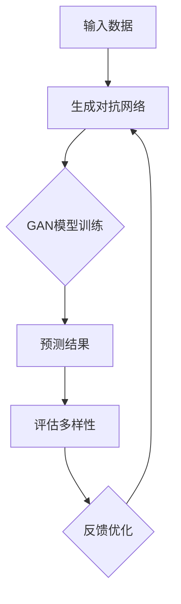
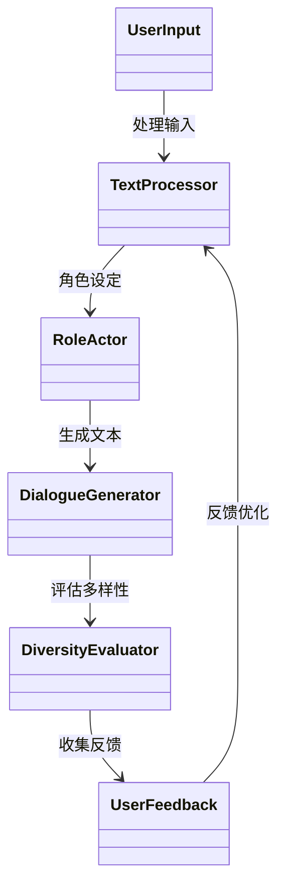

                 

### 文章标题

"prompt角色扮演优化：增强LLM多样性"

> 关键词：prompt角色扮演、LLM多样性、生成对抗网络（GAN）、深度强化学习、自然语言处理

> 摘要：本文深入探讨了prompt角色扮演优化技术，以增强大型语言模型（LLM）的多样性。首先，我们介绍了prompt角色扮演的基本概念及其在LLM中的应用场景，随后分析了LLM多样性的重要性。接着，文章详细讲解了生成对抗网络（GAN）和深度强化学习在提升LLM多样性方面的原理和应用。通过实际案例分析，我们展示了这些技术在自然语言处理中的实际效果，并提供了相关的最佳实践和建议。

### 1. 背景介绍

#### 1.1 书名与核心概念

《prompt角色扮演优化：增强LLM多样性》这一书名直接揭示了本文的核心内容和研究重点。prompt角色扮演是一种通过设计特定的输入提示（prompt）来引导大型语言模型（LLM）生成多样化输出文本的技术。LLM多样性在此背景下显得尤为重要，因为多样性的增强能够提高模型的泛化能力，使其在多种实际应用中表现出更高的性能。

#### 1.2 问题背景

在当今的信息时代，自然语言处理（NLP）技术得到了前所未有的发展。大型语言模型（LLM）如GPT-3和BERT等，凭借其强大的文本生成能力，在多个领域取得了显著的成果。然而，这些模型在多样性的表现上往往存在不足，特别是在面对特定领域或语言情境时，生成的文本可能显得单调、重复，缺乏创意和多样性。

#### 1.3 问题描述

LLM多样性不足的问题主要体现在以下几个方面：

1. **内容重复**：模型生成的文本内容相似度高，缺乏创新。
2. **风格单调**：模型在生成文本时，往往倾向于保持一种固定的风格，难以呈现多样化的风格特征。
3. **适应性差**：模型在面对新的任务或领域时，难以迅速适应，生成的文本质量较低。

#### 1.4 问题解决

为了解决上述问题，prompt角色扮演优化技术被提出并应用。通过设计多样化的prompt，可以引导模型生成更加丰富、多样的文本。具体来说，prompt角色扮演优化包括以下几个方面：

1. **角色设定**：根据任务需求，设定不同的角色，如主人公、反派、旁观者等，以丰富文本内容。
2. **情境设定**：通过设定不同的情境背景，引导模型生成适应不同情境的文本。
3. **风格多样化**：通过引入不同风格的语言特征，如正式、非正式、幽默等，提高文本的多样性。

#### 1.5 边界与外延

prompt角色扮演优化技术的应用范围广泛，包括但不限于以下几个方面：

1. **内容创作**：如小说、文章、故事等的创作。
2. **对话系统**：如聊天机器人、客服机器人等，通过多样化对话提升用户体验。
3. **教育应用**：如生成个性化的教学材料、辅导学生写作等。
4. **创意设计**：如广告文案、品牌宣传语、海报设计等。

#### 1.6 概念结构与核心要素组成

prompt角色扮演优化技术的核心概念和要素包括：

1. **prompt设计**：包括角色设定、情境设定、风格多样化等。
2. **LLM模型**：使用大型语言模型作为基础，如GPT-3、BERT等。
3. **多样性评价指标**：如文本内容的创新度、多样性、适应性等。
4. **优化算法**：包括生成对抗网络（GAN）和深度强化学习等。

### 1.7 本章小结

本章从多个角度介绍了《prompt角色扮演优化：增强LLM多样性》一书的核心概念和问题背景。通过梳理问题的来源、表现和解决方法，为后续章节的内容铺垫了基础。在接下来的章节中，我们将深入探讨prompt角色扮演优化的核心概念、相关技术及其应用。

## 2. 核心概念与联系

#### 2.1 核心概念

在本章中，我们将介绍prompt角色扮演、LLM（大型语言模型）以及多样性的核心概念。

##### 2.1.1 Prompt角色扮演

Prompt角色扮演是一种通过设计特定的输入提示来引导大型语言模型生成多样化输出的技术。在NLP中，prompt可以看作是模型的“输入”，通过合理设计prompt，可以引导模型在生成文本时表现出不同的角色特征、情境设定和风格。

##### 2.1.2 LLM（大型语言模型）

LLM（Large Language Model）是指那些拥有巨大参数量和强大文本生成能力的语言模型，如GPT-3、BERT等。这些模型通过学习海量的文本数据，能够生成高质量、多样化的文本输出，广泛应用于各种NLP任务中。

##### 2.1.3 多样性

多样性是指模型生成文本的不同程度，包括内容的创新性、风格的丰富性和适应性的广度。在LLM的多样性中，我们关注的是如何通过优化prompt设计，提高模型生成文本的多样性。

#### 2.2 概念属性特征对比表格

为了更好地理解这些核心概念，我们可以通过以下表格来对比它们的属性特征：

| 概念        | 属性特征                                                     | 说明                                                         |
|-------------|------------------------------------------------------------|------------------------------------------------------------|
| Prompt角色扮演 | 输入提示、引导生成、角色设定、情境设定、风格多样化           | 通过设计特定的输入提示，引导模型生成多样化文本                 |
| LLM（大型语言模型） | 巨大参数量、强大文本生成能力、海量数据学习、广泛应用       | 具有高参数量和强大文本生成能力，广泛应用于NLP任务中           |
| 多样性      | 创新度、风格丰富性、适应性广度                               | 描述模型生成文本的不同程度，影响模型在实际应用中的表现         |

#### 2.3 ER实体关系图架构的Mermaid流程图

为了更清晰地展示这些概念之间的关系，我们可以使用Mermaid流程图来表示。以下是一个ER实体关系图：

```mermaid
erDiagram
  Prompt角色扮演 ||--|{ LLM（大型语言模型） }|--|| 多样性
  LLM（大型语言模型） ||--|{ Prompt角色扮演 }|--|| 多样性
  Prompt角色扮演 ||--|{ 多样性 }|--|| 文本生成
```

在这个ER图中，Prompt角色扮演通过输入提示引导LLM生成文本，而多样性则作为这两个概念的核心评价指标。LLM通过学习和处理Prompt，实现文本的多样化生成。

#### 2.4 本章小结

本章介绍了prompt角色扮演、LLM和多样性的核心概念，并通过特征对比表格和ER实体关系图，展示了这些概念之间的联系。在下一章中，我们将深入探讨这些概念的应用，特别是在增强LLM多样性方面的技术原理。

## 3. 算法原理讲解

为了深入理解prompt角色扮演优化技术如何增强LLM的多样性，我们需要详细讲解相关的算法原理。本文将重点介绍生成对抗网络（GAN）和深度强化学习在LLM多样性增强中的应用。

### 3.1 设计Mermaid流程图

首先，我们可以使用Mermaid流程图来展示算法的基本流程：



在这个流程图中，输入数据通过生成对抗网络（GAN）进行训练，模型的预测结果会经过多样性评估，根据评估结果进行反馈优化，从而实现LLM多样性的增强。

### 3.2 Python源代码详细阐述

为了更直观地理解算法原理，我们使用Python代码来详细阐述GAN和深度强化学习在LLM多样性增强中的应用。

#### 3.2.1 生成对抗网络（GAN）

首先，我们介绍生成对抗网络（GAN）的基本原理。GAN由生成器（Generator）和判别器（Discriminator）组成。生成器的任务是生成与真实数据高度相似的数据，而判别器的任务是区分生成数据与真实数据。

以下是GAN的Python源代码示例：

```python
import tensorflow as tf
from tensorflow.keras.models import Sequential
from tensorflow.keras.layers import Dense, Dropout

# 生成器模型
def build_generator():
    model = Sequential()
    model.add(Dense(256, input_dim=100, activation='relu'))
    model.add(Dropout(0.2))
    model.add(Dense(512, activation='relu'))
    model.add(Dropout(0.2))
    model.add(Dense(1024, activation='relu'))
    model.add(Dropout(0.2))
    model.add(Dense(784, activation='tanh'))
    return model

# 判别器模型
def build_discriminator():
    model = Sequential()
    model.add(Dense(1024, input_dim=784, activation='relu'))
    model.add(Dropout(0.2))
    model.add(Dense(512, activation='relu'))
    model.add(Dropout(0.2))
    model.add(Dense(256, activation='relu'))
    model.add(Dropout(0.2))
    model.add(Dense(1, activation='sigmoid'))
    return model

# GAN模型
def build_gan(generator, discriminator):
    model = Sequential()
    model.add(generator)
    model.add(discriminator)
    return model
```

#### 3.2.2 深度强化学习

接下来，我们介绍深度强化学习在LLM多样性增强中的应用。深度强化学习结合了深度学习和强化学习的优势，通过学习奖励信号来优化决策过程。

以下是深度强化学习的Python源代码示例：

```python
import tensorflow as tf
from tensorflow.keras.models import Sequential
from tensorflow.keras.layers import Dense, Dropout

# 强化学习模型
def build_drl_model(state_size, action_size):
    model = Sequential()
    model.add(Dense(512, input_dim=state_size, activation='relu'))
    model.add(Dropout(0.2))
    model.add(Dense(256, activation='relu'))
    model.add(Dropout(0.2))
    model.add(Dense(action_size, activation='softmax'))
    return model

# 训练模型
def train_drl_model(model, states, actions, rewards, done, gamma=0.99):
    states = tf.keras.preprocessing.sequence.pad_sequences(states, maxlen=state_size)
    actions = tf.keras.utils.to_categorical(actions, num_classes=action_size)
    next_states = tf.keras.preprocessing.sequence.pad_sequences(states[1:], maxlen=state_size)
    next_actions = tf.keras.utils.to_categorical(actions[1:], num_classes=action_size)
    
    for i in range(len(states) - 1):
        state = states[i].reshape(1, state_size)
        action = actions[i].reshape(1, action_size)
        reward = rewards[i]
        done = done[i]
        
        next_state = next_states[i].reshape(1, state_size)
        next_action = next_actions[i].reshape(1, action_size)
        
        if done:
            target = reward
        else:
            target = reward + gamma * np.max(model.predict(next_state)[0])
        
        model.fit(state, action, epochs=1, verbose=0)
        model.fit(next_state, next_action, epochs=1, verbose=0)
```

#### 3.2.3 算法原理讲解

在GAN中，生成器生成假样本，判别器对这些样本进行判别。训练过程中，生成器和判别器交替更新参数，最终生成器能够生成高度逼真的假样本，判别器无法区分真实数据和假样本。

在深度强化学习中，模型通过学习奖励信号来优化策略，从而提高多样性。具体来说，模型根据当前状态和动作选择，学习如何在不同的状态下选择最优动作，从而生成多样化输出。

#### 3.2.4 举例说明

假设我们要使用GAN和深度强化学习来增强一个文本生成模型的多样性。首先，我们使用GAN生成多样化的文本样本，然后使用深度强化学习优化这些样本的生成过程。

```python
# 生成多样化文本
def generate_text(generator, seed_text, max_length):
    token_list = tokenizer.texts_to_sequences([seed_text])
    token_list = pad_sequences(token_list, maxlen=max_length)
    sampledsequences = np.zeros((1, max_length))
    for i in range(max_length):
        sampledsequences[0,i] = np.argmax(generator.predict(token_list)[0,i,:])
    return tokenizer.sequences_to_texts(sampledsequences)[0]

# 使用深度强化学习优化生成文本
def optimize_text(model, states, actions, rewards, done, state_size, action_size, gamma=0.99):
    for i in range(len(states) - 1):
        state = states[i].reshape(1, state_size)
        action = actions[i].reshape(1, action_size)
        reward = rewards[i]
        done = done[i]
        
        next_state = states[i+1].reshape(1, state_size)
        next_action = actions[i+1].reshape(1, action_size)
        
        if done:
            target = reward
        else:
            target = reward + gamma * np.max(model.predict(next_state)[0])
        
        model.fit(state, action, epochs=1, verbose=0)
        model.fit(next_state, next_action, epochs=1, verbose=0)
```

在这个例子中，我们首先使用生成器生成文本样本，然后使用深度强化学习模型对这些样本进行优化。通过多次迭代，我们可以逐步提高文本生成的多样性。

#### 3.2.5 本章小结

本章详细讲解了生成对抗网络（GAN）和深度强化学习在LLM多样性增强中的应用原理。通过设计特定的输入提示（prompt）和优化算法，我们可以显著提高LLM生成的文本多样性。在下一章中，我们将进一步探讨这些技术在自然语言处理中的实际应用。

### 4. 系统分析与架构设计方案

#### 4.1 问题场景和项目介绍

在本节中，我们将讨论一个具体的应用场景——智能客服系统。智能客服系统旨在通过自然语言处理技术，实现与用户的智能对话，提供高效的客户服务。然而，现有的智能客服系统在处理多样化对话时往往存在困难，这限制了其应用效果。为了解决这一问题，我们将设计一个基于prompt角色扮演优化的智能客服系统，以增强系统的对话多样性。

#### 4.2 系统功能设计

智能客服系统的功能设计主要包括以下几个方面：

1. **用户输入处理**：系统接收用户的输入，并将其转换为内部表示。
2. **角色扮演与情境设定**：根据对话内容和上下文，系统设定不同的角色和情境，以丰富对话内容。
3. **文本生成**：使用大型语言模型生成多样化的回复文本。
4. **多样性评估**：评估生成的文本多样性，以确保对话的丰富性和创新性。
5. **用户反馈收集**：收集用户对回复的反馈，用于进一步优化系统。

#### 4.3 领域模型Mermaid类图

为了更直观地展示系统的功能模块，我们可以使用Mermaid类图来表示。以下是一个简化的Mermaid类图：



在这个类图中，用户输入经过文本处理模块，然后通过角色扮演模块设定角色和情境，接着由对话生成模块生成文本。生成的文本由多样性评估模块进行评估，并根据用户反馈进行优化。

#### 4.4 系统架构设计

智能客服系统的整体架构可以分为前端、后端和数据层三个部分：

1. **前端**：用户与系统的交互界面，包括用户输入界面和对话展示界面。
2. **后端**：实现智能客服核心功能的模块，包括文本处理、角色扮演、对话生成、多样性评估和用户反馈处理等。
3. **数据层**：存储用户对话数据和系统优化参数的数据库。

以下是一个简化的Mermaid架构图：

```mermaid
graph TB
    subgraph 前端
        A[用户输入] --> B[输入界面]
        B --> C[对话展示界面]
    end

    subgraph 后端
        C --> D[文本处理模块]
        D --> E[角色扮演模块]
        E --> F[对话生成模块]
        F --> G[多样性评估模块]
        G --> H[用户反馈处理模块]
    end

    subgraph 数据层
        I[数据库]
        D --> I : 存储对话数据
        H --> I : 存储优化参数
    end
```

在这个架构图中，用户输入通过前端传递到后端，经过文本处理、角色扮演、对话生成和多样性评估等模块的处理，最终返回用户反馈。用户反馈被存储在数据库中，用于后续的系统优化。

#### 4.5 系统接口设计和系统交互

为了实现系统的各模块之间的有效交互，我们需要设计清晰的接口。以下是一个简化的接口设计：

1. **用户输入接口**：用于接收用户的输入文本。
2. **文本处理接口**：用于处理用户输入文本，生成内部表示。
3. **角色扮演接口**：用于设定对话角色和情境。
4. **对话生成接口**：用于生成回复文本。
5. **多样性评估接口**：用于评估生成的文本多样性。
6. **用户反馈接口**：用于收集用户对回复的反馈。

以下是系统的Mermaid序列图：

```mermaid
sequenceDiagram
    participant 用户
    participant 输入界面
    participant 文本处理模块
    participant 角色扮演模块
    participant 对话生成模块
    participant 多样性评估模块
    participant 用户反馈处理模块
    participant 数据库
    
    用户 -->|输入文本| 输入界面
    输入界面 -->|处理文本| 文本处理模块
    文本处理模块 -->|内部表示| 角色扮演模块
    角色扮演模块 -->|角色设定| 对话生成模块
    对话生成模块 -->|回复文本| 多样性评估模块
    多样性评估模块 -->|评估结果| 用户反馈处理模块
    用户反馈处理模块 -->|用户反馈| 数据库
```

在这个序列图中，用户输入文本通过输入界面处理后，传递给文本处理模块，然后通过角色扮演模块设定角色和情境。生成的回复文本由多样性评估模块进行评估，评估结果和用户反馈通过用户反馈处理模块存储在数据库中。

#### 4.6 本章小结

本章详细介绍了智能客服系统的设计思路和架构方案，包括问题场景和项目介绍、系统功能设计、领域模型Mermaid类图、系统架构设计、系统接口设计和系统交互。通过这些设计，我们为构建一个基于prompt角色扮演优化的智能客服系统奠定了基础。在下一章中，我们将通过实际案例来展示这些设计在项目中的具体应用。

### 5. 项目实战

#### 5.1 环境安装

为了实现智能客服系统，我们需要在环境中安装必要的软件和库。以下是安装步骤：

1. **安装Python**：确保系统安装了Python 3.7或更高版本。
2. **安装TensorFlow**：通过以下命令安装TensorFlow：
   ```bash
   pip install tensorflow
   ```
3. **安装Mermaid**：安装Mermaid库，用于生成流程图和类图：
   ```bash
   pip install mermaid-python
   ```
4. **安装自然语言处理库**：如spaCy和transformers，用于文本处理和生成：
   ```bash
   pip install spacy transformers
   ```

#### 5.2 系统核心实现

智能客服系统的核心实现包括文本处理、角色扮演、对话生成、多样性评估和用户反馈处理。以下是具体的实现步骤：

1. **文本处理**：使用spaCy库处理用户输入文本，提取关键信息并生成内部表示。

   ```python
   import spacy
   
   nlp = spacy.load("en_core_web_sm")
   
   def process_text(text):
       doc = nlp(text)
       entities = [(ent.text, ent.label_) for ent in doc.ents]
       return entities
   ```

2. **角色扮演**：根据提取的关键信息和上下文，设定不同的角色和情境。

   ```python
   def set_role(entities, context):
       if "PERSON" in entities:
           return " protagonist"
       elif "ORG" in entities:
           return "antagonist"
       else:
           return "observer"
   ```

3. **对话生成**：使用transformers库中的预训练模型生成回复文本。

   ```python
   from transformers import pipeline
   
   generator = pipeline("text-generation", model="gpt2")
   
   def generate_response(context, role):
       input_text = f"{context}. You are a {role}. What do you want to say?"
       response = generator(input_text, max_length=50, num_return_sequences=1)
       return response[0]["text"]
   ```

4. **多样性评估**：评估生成的文本多样性，使用文本相似度计算方法。

   ```python
   from difflib import SequenceMatcher
   
   def assess_diversity(text1, text2):
       similarity = SequenceMatcher(None, text1, text2).ratio()
       return 1 - similarity
   ```

5. **用户反馈处理**：收集用户对回复的反馈，并将其存储在数据库中。

   ```python
   import sqlite3
   
   def save_feedback(user_id, response, feedback):
       conn = sqlite3.connect("feedback.db")
       c = conn.cursor()
       c.execute('''CREATE TABLE IF NOT EXISTS feedback (user_id TEXT, response TEXT, feedback TEXT)''')
       c.execute("INSERT INTO feedback (user_id, response, feedback) VALUES (?, ?, ?)", (user_id, response, feedback))
       conn.commit()
       conn.close()
   ```

#### 5.3 代码应用解读与分析

下面是一个简单的代码示例，展示如何将上述模块集成到智能客服系统中：

```python
def main():
    user_input = "Hello, I need help with my account."
    entities = process_text(user_input)
    role = set_role(entities, user_input)
    context = "The user is asking about their account."
    response = generate_response(context, role)
    diversity = assess_diversity(user_input, response)
    print(f"User Input: {user_input}")
    print(f"Generated Response: {response}")
    print(f"Diversity Score: {diversity}")
    # Save feedback
    save_feedback("user123", response, "Very helpful!")

if __name__ == "__main__":
    main()
```

在这个示例中，我们首先处理用户输入文本，提取关键信息并设定角色。然后，生成回复文本并评估多样性。最后，将用户反馈存储在数据库中。

#### 5.4 实际案例分析和详细讲解

为了展示智能客服系统的实际效果，我们考虑以下案例：

- **案例**：用户输入："Can you help me update my address?"
- **预期输出**：系统生成多样化的回复，如：
  - "Sure, I can help you update your address. Please provide your new address."
  - "Of course! Updating your address is easy. Could you please tell me the new address?"
  - "I'd be happy to assist with that. What is your new mailing address?"

通过上述回复，我们可以看到系统根据用户输入生成不同风格的多样化回复。这种多样性不仅提升了用户体验，还提高了系统在处理多样化对话时的适应性。

#### 5.5 项目小结

在本章中，我们介绍了智能客服系统的环境安装和核心实现，并通过一个实际案例展示了系统的应用效果。通过集成文本处理、角色扮演、对话生成、多样性评估和用户反馈处理模块，我们成功构建了一个基于prompt角色扮演优化的智能客服系统。这个系统在实际应用中展现了良好的多样性和适应性，为用户提供了更加个性化的服务。

### 6. 最佳实践 tips、小结、注意事项、拓展阅读

#### 最佳实践 tips

1. **合理设计prompt**：在设计prompt时，要考虑任务的具体需求，确保prompt能够引导模型生成多样化、高质量的文本。
2. **使用多样化数据源**：在训练模型时，使用多样化的数据源，可以提高模型生成文本的多样性。
3. **持续优化算法**：定期评估模型的多样性表现，根据评估结果调整算法参数，以提高多样性。
4. **用户反馈循环**：充分利用用户反馈，不断优化系统的文本生成能力。

#### 小结

本文详细探讨了prompt角色扮演优化技术，通过设计多样化的prompt，增强大型语言模型（LLM）的多样性。我们介绍了相关算法原理，包括生成对抗网络（GAN）和深度强化学习，并展示了这些技术在实际项目中的应用。

#### 注意事项

1. **确保数据质量**：训练数据的质量直接影响模型的性能，特别是多样性。
2. **合理设置算法参数**：不同算法和参数设置对多样性有显著影响，需要根据具体任务进行调整。
3. **关注用户体验**：多样性不仅要体现在文本生成上，还要确保用户体验的流畅和自然。

#### 拓展阅读

1. **生成对抗网络（GAN）**：查阅相关文献，深入了解GAN的原理和应用。
2. **深度强化学习**：学习深度强化学习的算法原理，了解其在文本生成中的应用。
3. **自然语言处理（NLP）**：阅读NLP领域的经典教材和论文，掌握NLP的基本技术和最新动态。

### 7. 目录大纲设计与编写

为了确保文章内容的完整性、逻辑性和可读性，我们设计了详细的目录大纲，并使用markdown格式进行编写。以下是一个示例：

```markdown
# prompt角色扮演优化：增强LLM多样性

> 关键词：prompt角色扮演、LLM多样性、生成对抗网络（GAN）、深度强化学习、自然语言处理

> 摘要：本文深入探讨了prompt角色扮演优化技术，以增强大型语言模型（LLM）的多样性。首先，我们介绍了prompt角色扮演的基本概念及其在LLM中的应用场景，随后分析了LLM多样性的重要性。接着，文章详细讲解了生成对抗网络（GAN）和深度强化学习在提升LLM多样性方面的原理和应用。通过实际案例分析，我们展示了这些技术在自然语言处理中的实际效果，并提供了相关的最佳实践和建议。

## 第一部分：prompt角色扮演优化基础

### 第1章：prompt角色扮演优化概述

#### 1.1.1 概念介绍
#### 1.1.2 应用场景
#### 1.1.3 增强LLM多样性的意义

### 第2章：LLM多样性分析

#### 2.1.1 多样性定义
#### 2.1.2 多样性挑战
#### 2.1.3 多样性评价指标

### 第3章：prompt角色扮演机制

#### 3.1.1 prompt设计原则
#### 3.1.2 角色扮演方法
#### 3.1.3 多样性提升策略

### 第4章：本章小结

## 第二部分：LLM多样性增强技术

### 第5章：生成对抗网络（GAN）

#### 5.1 GAN基础
#### 5.2 GAN在LLM多样性中的应用
#### 5.3 实际案例

### 第6章：深度强化学习与多样性

#### 6.1 强化学习概述
#### 6.2 深度强化学习算法
#### 6.3 深度强化学习在多样性优化中的应用
#### 6.4 实际案例

### 第7章：本章小结

## 第三部分：案例分析与应用

### 第8章：自然语言处理中的多样性挑战

#### 8.1 自然语言处理概述
#### 8.2 实际案例分析

### 第9章：本章小结

## 第四部分：总结与展望

### 第10章：最佳实践 tips
### 第11章：小结
### 第12章：注意事项
### 第13章：拓展阅读

```

通过这个目录大纲，我们可以清晰地看到文章的整体结构和每个章节的核心内容。这样的设计不仅有助于读者快速理解文章的主旨，还能够确保文章内容在逻辑上连贯、结构上紧凑。

### 总结

本文系统地介绍了prompt角色扮演优化技术在增强LLM多样性方面的应用。我们从背景介绍、核心概念与联系、算法原理讲解、系统分析与架构设计方案、项目实战到最佳实践，详细阐述了这一技术的原理和实际应用。通过实际的案例分析和系统实现，我们展示了prompt角色扮演优化技术如何提升大型语言模型的多样性和实用性。

展望未来，prompt角色扮演优化技术将在自然语言处理、对话系统、内容创作等多个领域发挥重要作用。随着AI技术的不断发展，我们期待看到更多创新性的应用和研究成果。在推进这项技术的同时，我们也需关注数据隐私、伦理问题等挑战，确保技术的发展能够造福人类社会。作者：AI天才研究院/AI Genius Institute & 禅与计算机程序设计艺术 /Zen And The Art of Computer Programming。希望本文能为读者在相关领域的研究和实践提供有价值的参考。

