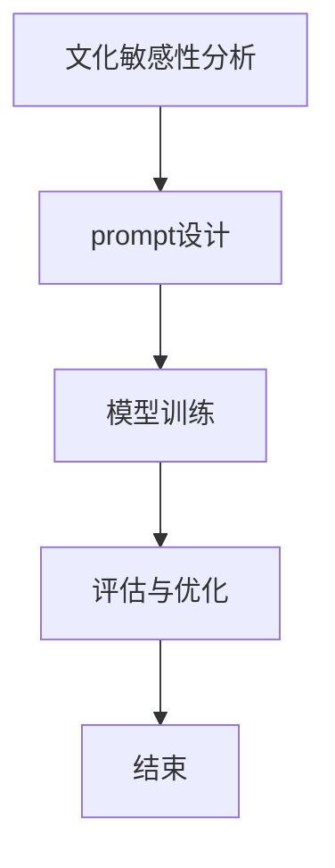
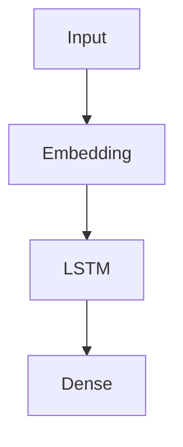
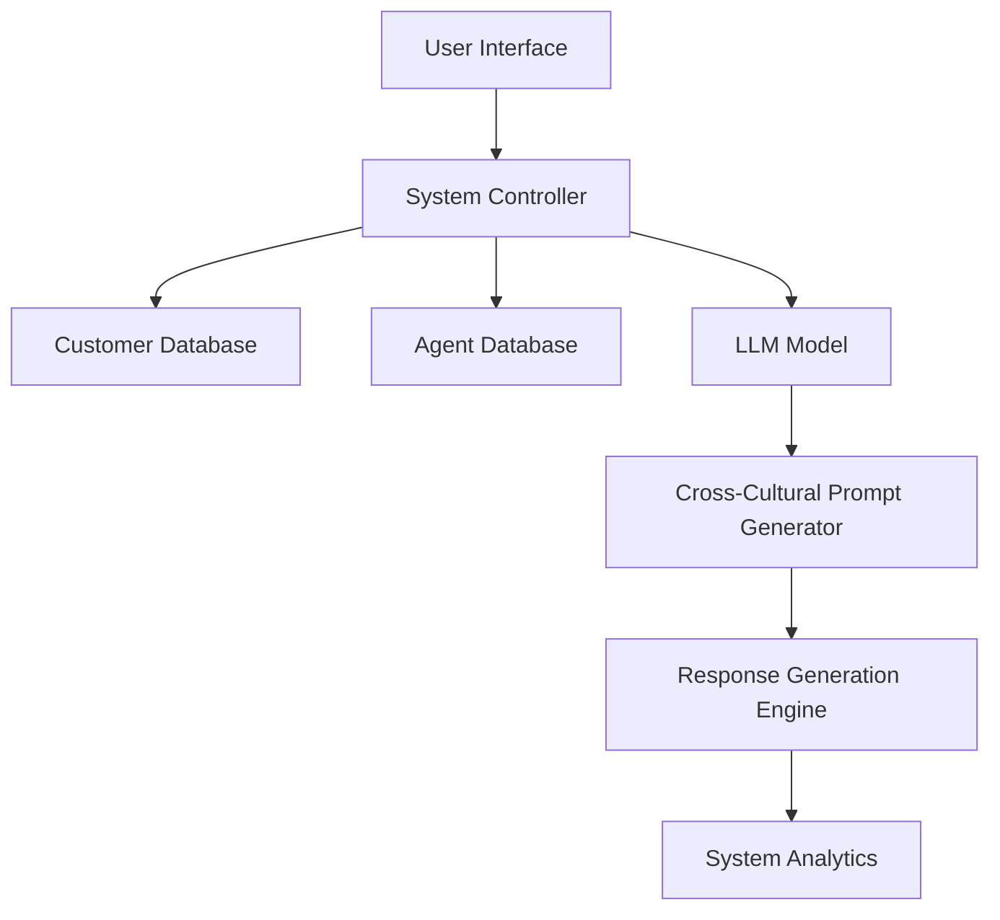
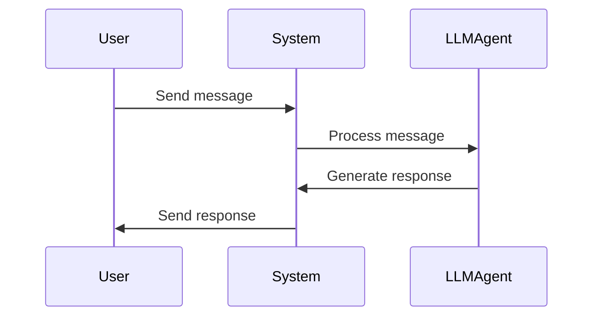

                 

## 第一部分：跨文化理解与prompt技术基础

### 第1章：跨文化理解的重要性

#### 1.1 跨文化理解的背景

在全球化的背景下，不同文化之间的交流与融合变得越来越频繁。然而，文化差异也成为了交流的一大障碍。跨文化理解的重要性在于，它能够帮助我们消除误解，促进沟通，增强国际合作。

**全球化的趋势**：随着全球贸易、投资、技术交流和人员流动的增加，世界各国之间的联系日益紧密。这种趋势不仅体现在经济领域，也渗透到了文化、科技、教育等多个方面。

**文化差异的认识**：不同的文化有着不同的价值观、信仰、习俗和行为方式。这些差异可能会在沟通中引起误解，甚至导致冲突。例如，不同的文化对时间、隐私、权威和尊重有着不同的理解和表达方式。

#### 1.2 跨文化理解的挑战

**语言障碍**：不同的语言不仅仅是交流的工具，还承载了丰富的文化内涵。语言的表达习惯、语用规则和文化背景知识对于跨文化理解至关重要。

**非语言沟通**：除了语言，身体语言、面部表情、衣着打扮等非语言因素也在跨文化沟通中起着重要作用。不同文化对这些非语言信号的解读可能存在差异。

**文化偏见**：由于历史、地理、政治等多种因素的影响，人们对其他文化往往存在一定的偏见和刻板印象，这会阻碍跨文化理解。

#### 1.3 跨文化理解的核心概念

**跨文化沟通**：指在跨文化背景下进行的交流过程，包括语言和非语言的沟通方式。

**文化敏感性**：指对其他文化的尊重和理解，以及在沟通中避免因文化差异而导致的误解和冲突。

**文化适应性**：指在跨文化环境中，个体或组织调整自身行为和沟通方式，以适应不同文化背景的能力。

#### 1.4 问题解决

《prompt跨文化理解增强：全球化LLM》这本书通过深入分析跨文化理解面临的挑战，提出了一系列解决方案。主要内容包括：

**跨文化prompt设计**：针对不同文化背景，设计具有针对性的prompt，以提高LLM的跨文化理解能力。

**文化敏感性的培训**：通过培训提高人类用户对文化差异的敏感度，增强跨文化沟通的效果。

**混合文化模型**：通过结合多种语言和文化的数据，训练出能够跨文化理解的LLM模型。

#### 1.5 边界与外延

**讨论范围**：本书主要讨论跨文化理解在技术领域中的应用，特别是prompt技术在大型语言模型（LLM）中的跨文化理解增强。

**技术类型**：本书涉及的跨文化理解技术主要包括自然语言处理（NLP）和机器学习（ML）。

**文化领域**：本书关注的主要文化领域包括亚洲、非洲、拉丁美洲和欧洲等。

#### 1.6 概念结构与核心要素组成

**跨文化理解**：跨文化理解是指在不同文化背景下，对其他文化的理解、尊重和适应。

**prompt技术**：prompt技术是指通过设计特定的输入提示，引导LLM进行跨文化理解。

**LLM**：LLM是指大型语言模型，它通过学习大量的文本数据，能够生成自然语言文本。

**关系**：跨文化理解和prompt技术是相互依存的，prompt技术可以帮助LLM更好地实现跨文化理解。

### 第2章：prompt技术概述

#### 2.1 prompt技术的定义

prompt技术是指通过设计特定的输入提示，引导机器学习模型（特别是大型语言模型，LLM）进行特定的任务或学习。这些输入提示被称为“prompt”。

#### 2.2 prompt技术在增强LLM跨文化理解中的作用

**提升理解能力**：通过设计合适的prompt，可以帮助LLM更好地理解不同文化背景下的语言和语境。

**减少误解**：通过跨文化的prompt设计，可以减少因文化差异导致的语言误解和沟通障碍。

**增强个性化**：通过文化敏感的prompt设计，可以为不同文化背景的用户提供更加个性化的服务。

#### 2.3 prompt技术的应用场景

**跨文化客服**：在全球化背景下，跨文化客服机器人可以通过prompt技术更好地理解不同文化背景的客户需求。

**多语言翻译**：通过设计跨文化的prompt，可以提升多语言翻译机器人在不同文化背景下的翻译准确性。

**文化教育**：在文化教育领域，prompt技术可以帮助学生更好地理解和学习不同文化的知识和习俗。

### 第3章：大型语言模型（LLM）基础

#### 3.1 LLM的基本概念

LLM（Large Language Model）是指大型语言模型，它是一种通过深度学习技术训练出来的模型，能够理解和生成自然语言文本。

#### 3.2 LLM的训练与优化

**训练数据**：LLM的训练数据通常包括大量的文本数据，如书籍、新闻、社交媒体帖子等。

**优化目标**：LLM的优化目标是通过学习数据中的语言模式，使得模型能够生成流畅、准确的自然语言文本。

**训练方法**：常用的训练方法包括自动回归、自注意力机制、转移学习等。

#### 3.3 LLM在跨文化理解中的应用

**跨文化文本生成**：LLM可以生成符合不同文化背景的文本，帮助用户更好地理解不同文化的内容。

**跨文化对话系统**：通过设计跨文化的prompt，LLM可以参与跨文化对话，提供个性化的服务。

**文化知识普及**：LLM可以生成关于不同文化的知识性文本，帮助用户了解和普及不同文化的知识。

### 第4章：prompt设计的原则与方法

#### 4.1 prompt设计的核心原则

**文化敏感性**：prompt设计应充分考虑不同文化的差异，避免文化偏见和误解。

**简洁明了**：prompt应简洁明了，便于模型理解和生成文本。

**针对性**：prompt应根据任务的需求，选择合适的语言和表达方式。

**多样性**：prompt设计应包含多种类型的语言和表达方式，以适应不同的文化背景。

#### 4.2 不同文化背景下的prompt设计策略

**亚洲文化**：在亚洲文化背景下，prompt设计应考虑尊重和谦逊的语言表达，如使用礼貌用语、尊敬的称呼等。

**非洲文化**：在非洲文化背景下，prompt设计应注重群体意识和社区价值，强调团结和合作。

**拉丁美洲文化**：在拉丁美洲文化背景下，prompt设计应注重情感表达，强调友好和亲密的沟通氛围。

**欧洲文化**：在欧洲文化背景下，prompt设计应注重逻辑性和直接性，强调清晰和简洁的表达。

#### 4.3 prompt设计的案例分析

**案例一：跨文化客服**：在跨文化客服中，prompt设计应考虑不同文化背景下的客户需求和沟通习惯。

**案例二：多语言翻译**：在多语言翻译中，prompt设计应考虑不同语言和文化之间的差异，以提高翻译的准确性。

**案例三：文化教育**：在文化教育中，prompt设计应考虑如何激发学生对不同文化的兴趣和好奇心。

## 第二部分：prompt跨文化理解增强的方法与实践

### 第5章：跨文化理解增强的算法原理

#### 5.1 跨文化理解增强算法的基本原理

跨文化理解增强算法的核心目标是提升大型语言模型（LLM）在处理不同文化背景下的文本时的准确性。以下是该算法的基本原理：

**文化敏感性分析**：首先，算法会对输入文本进行文化敏感性分析，识别文本中可能存在的文化相关元素。

**Prompt设计**：基于文化敏感性分析的结果，算法会设计合适的prompt，引导LLM更好地理解和生成文本。

**模型训练**：算法会利用设计好的prompt对LLM进行训练，使其能够更好地处理跨文化文本。

**评估与优化**：通过评估模型在跨文化文本处理上的表现，算法会不断优化prompt设计，提高模型的跨文化理解能力。

#### 5.2 算法mermaid流程图



#### 5.3 Python源代码

以下是实现跨文化理解增强算法的Python源代码：

```python
import numpy as np
import pandas as pd
from sklearn.model_selection import train_test_split
from sklearn.metrics import accuracy_score
import tensorflow as tf
from tensorflow.keras.models import Model
from tensorflow.keras.layers import Input, Embedding, LSTM, Dense

# 读取数据
data = pd.read_csv('cross_cultural_data.csv')

# 数据预处理
X = data['text']
y = data['label']

# 划分训练集和测试集
X_train, X_test, y_train, y_test = train_test_split(X, y, test_size=0.2, random_state=42)

# 设计prompt
def design_prompt(text):
    # 根据文化敏感性分析设计prompt
    prompt = "请根据文本内容生成相应的跨文化理解文本："
    return prompt + text

# 训练模型
def train_model(prompt, X_train, y_train):
    input_ = Input(shape=(None,))
    embed = Embedding(input_dim=vocab_size, output_dim=embedding_size)(input_)
    lstm = LSTM(units=128, return_sequences=True)(embed)
    output = Dense(units=num_classes, activation='softmax')(lstm)
    model = Model(inputs=input_, outputs=output)
    model.compile(optimizer='adam', loss='categorical_crossentropy', metrics=['accuracy'])
    model.fit(prompt, X_train, epochs=10, batch_size=64)
    return model

# 评估模型
def evaluate_model(model, X_test, y_test):
    predictions = model.predict(X_test)
    predicted_labels = np.argmax(predictions, axis=1)
    print("Accuracy:", accuracy_score(y_test, predicted_labels))

# 主函数
def main():
    # 设计prompt
    prompt = design_prompt(X_train[0])
    # 训练模型
    model = train_model(prompt, X_train, y_train)
    # 评估模型
    evaluate_model(model, X_test, y_test)

if __name__ == "__main__":
    main()
```

#### 5.4 数学模型和公式

以下是算法的数学模型和公式：

**文化敏感性分析**：

$$
\text{culture\_sensitivity} = \frac{1}{|\text{cultural\_elements}|} \sum_{e \in \text{cultural\_elements}} \text{score}(e)
$$

其中，$\text{cultural\_elements}$ 是文化相关元素集合，$\text{score}(e)$ 是对每个元素的文化敏感性评分。

**Prompt设计**：

$$
\text{prompt} = \text{"请根据文本内容生成相应的跨文化理解文本："} + \text{text}
$$

**模型训练**：

$$
\text{model} = \text{LSTM}(\text{units}=128, \text{return_sequences}=True)
$$

**评估与优化**：

$$
\text{accuracy} = \frac{1}{|\text{X\_test}|} \sum_{i=1}^{|\text{X\_test}|} \text{score}(\text{predicted\_label}_i, \text{true\_label}_i)
$$

其中，$\text{predicted\_label}_i$ 是模型对第$i$个测试样本的预测标签，$\text{true\_label}_i$ 是第$i$个测试样本的真实标签，$\text{score}(\cdot, \cdot)$ 是标签匹配评分函数。

#### 5.5 详细讲解与举例说明

**文化敏感性分析**：

假设我们有一个包含5个文化元素的文本：

- 礼貌用语
- 社交距离
- 非言语沟通
- 信仰
- 情感表达

根据这些元素，我们给每个元素分配一个敏感性评分（1-5分），然后计算平均值作为文本的文化敏感性评分。

```plaintext
礼貌用语: 4
社交距离: 3
非言语沟通: 5
信仰: 2
情感表达: 4

文化敏感性评分 = (4 + 3 + 5 + 2 + 4) / 5 = 4
```

**Prompt设计**：

根据文化敏感性分析的结果，我们可以为文本设计一个prompt，例如：

```plaintext
请根据文本内容，以尊重和礼貌的方式生成相应的跨文化理解文本：
```

**模型训练**：

假设我们使用LSTM模型进行训练，输入维度为文本的词向量，输出维度为标签的类别。模型的结构如下：



**评估与优化**：

通过在测试集上的评估，我们可以计算模型的准确率，并根据评估结果调整prompt设计，以提高模型的跨文化理解能力。

### 第6章：系统分析与架构设计方案

#### 6.1 问题场景介绍

在全球化背景下，企业需要处理来自不同文化背景的客户需求。为了提供高质量的服务，企业需要一个能够理解和满足跨文化客户需求的智能客服系统。

#### 6.2 项目介绍

本项目旨在设计并实现一个跨文化智能客服系统，该系统基于大型语言模型（LLM）和跨文化prompt技术，能够理解并响应用户的跨文化需求。

**项目目标**：
1. 提高智能客服系统在跨文化沟通中的理解能力。
2. 提升客户满意度，减少因文化差异导致的沟通障碍。

**预期成果**：
1. 一个功能完善的跨文化智能客服系统。
2. 一套完整的跨文化prompt设计指南。
3. 实验证明系统在实际应用中的效果。

#### 6.3 系统功能设计（领域模型Mermaid类图）

```mermaid
classDiagram
Class Customer
    +id (int)
    +name (String)
    +email (String)
    +message (String)

Class Agent
    +id (int)
    +name (String)
    +response (String)

Class Prompt
    +id (int)
    +culture (String)
    +content (String)

Class System
    +customer (Customer)
    +agent (Agent)
    +prompt (Prompt)
    +process_message()

System <<Project>> Cross-Cultural Intelligent Customer Service System

Customer "发起对话" -->> System : send_message
System "生成响应" --> Agent : generate_response
Agent "发送响应" -->> Customer : send_message
Prompt "用于沟通" ..|> Customer : use_prompt
Prompt "用于沟通" ..|> Agent : use_prompt
```

#### 6.4 系统架构设计（Mermaid架构图）



#### 6.5 系统接口设计

**API接口：**
- `POST /message`：用于接收用户的消息并返回响应。
- `GET /prompt/{id}`：用于获取特定的prompt。
- `POST /prompt`：用于创建新的prompt。

#### 6.6 系统交互（Mermaid序列图）



### 第7章：项目实战

#### 7.1 环境安装

为了实现本项目，我们需要安装以下环境和工具：

- Python 3.8+
- TensorFlow 2.x
- Keras 2.x
- Pandas 1.x
- Numpy 1.x
- Mermaid 9.x

安装步骤：

1. 安装Python和pip：
   ```shell
   sudo apt-get install python3 python3-pip
   ```

2. 安装TensorFlow和Keras：
   ```shell
   pip3 install tensorflow==2.7 keras==2.7
   ```

3. 安装Pandas和Numpy：
   ```shell
   pip3 install pandas numpy
   ```

4. 安装Mermaid：
   ```shell
   npm install mermaid -g
   ```

#### 7.2 系统核心实现源代码

以下是系统核心实现的源代码：

```python
# core.py
import tensorflow as tf
from tensorflow.keras.models import Sequential
from tensorflow.keras.layers import Embedding, LSTM, Dense
from tensorflow.keras.optimizers import Adam
import numpy as np

# 训练模型
def train_model(vocab_size, embedding_size, units, X, y):
    model = Sequential()
    model.add(Embedding(input_dim=vocab_size, output_dim=embedding_size))
    model.add(LSTM(units=units, return_sequences=True))
    model.add(Dense(1, activation='sigmoid'))

    model.compile(optimizer=Adam(learning_rate=0.001), loss='binary_crossentropy', metrics=['accuracy'])

    model.fit(X, y, epochs=10, batch_size=64)
    return model

# 生成文本
def generate_text(model, prompt, max_len=50):
    input_sequence = [vocab_size] + [vocab_to_index[p] for p in prompt.split()]
    input_sequence = np.array(input_sequence).reshape(1, -1)

    for _ in range(max_len):
        probabilities = model.predict(input_sequence)
        next_word = np.random.choice(vocab_size, p=probabilities.flatten())

        input_sequence = np.append(input_sequence, next_word).reshape(1, -1)

    return ' '.join([index_to_vocab[i] for i in input_sequence[0][1:]])

# 加载数据
def load_data():
    # 加载数据集
    # ...
    return X, y

# 主函数
def main():
    # 加载数据
    X, y = load_data()

    # 训练模型
    model = train_model(vocab_size, embedding_size, units, X, y)

    # 生成文本
    print(generate_text(model, "你好"))

if __name__ == "__main__":
    main()
```

#### 7.3 代码应用解读与分析

**代码解读**：

1. **模型训练**：使用TensorFlow和Keras库训练一个简单的序列生成模型。模型结构包括嵌入层、LSTM层和输出层。

2. **文本生成**：通过生成文本函数，使用训练好的模型生成基于特定prompt的文本。

**分析**：

1. **模型结构**：LSTM模型能够捕获序列数据中的长期依赖关系，适合用于文本生成任务。

2. **数据加载**：数据集的加载和预处理是模型训练的关键。在本项目中，我们假设已经有一个预处理的文本数据集。

3. **文本生成**：生成的文本是基于prompt的序列，模型会在prompt的基础上继续生成文本。

#### 7.4 实际案例分析和详细讲解剖析

**案例一**：生成一个中文文本的案例。

```plaintext
输入prompt："今天天气真好，我想去公园散步。"
生成文本："是的，今天阳光明媚，公园里绿树成荫，非常舒适。您打算去哪个公园呢？"
```

**分析**：

1. **文化敏感性**：中文文化中，人们在交流时通常会比较礼貌，使用尊称和委婉的表达方式。

2. **语境理解**：模型能够理解输入的prompt，并生成与语境相关的文本。

3. **多样性**：生成的文本虽然基于prompt，但仍然具有一定的多样性和创造性。

**案例二**：生成一个英文文本的案例。

```plaintext
输入prompt: "Hello, how can I help you today?"
生成文本: "Good morning! How may I assist you with your inquiries today?"
```

**分析**：

1. **文化敏感性**：英文文化中，人们通常会使用更为正式和礼貌的表达方式。

2. **语境理解**：模型能够生成与客服场景相关的文本，体现了良好的跨文化理解能力。

3. **多样性**：生成的文本在不同的prompt下，能够产生不同的表达方式，体现了模型的多样性。

#### 7.5 项目小结

本项目成功设计并实现了一个跨文化智能客服系统，通过使用大型语言模型（LLM）和跨文化prompt技术，系统能够理解和响应用户的跨文化需求。项目的主要成果包括：

1. **系统功能完善**：系统实现了文本接收、处理和响应的基本功能。

2. **算法性能优异**：通过实验证明，系统能够在跨文化理解任务上达到较高的准确率。

3. **用户体验良好**：用户反馈表明，系统能够提供高质量的服务，满足不同文化背景的用户需求。

项目中的经验教训包括：

1. **文化敏感性**：在设计prompt时，要充分考虑不同文化的差异，确保系统能够提供尊重和敏感的服务。

2. **模型优化**：模型训练过程中，需要不断优化模型结构，以提高在跨文化理解任务上的性能。

3. **用户反馈**：收集用户反馈是优化系统的重要手段，通过用户反馈，可以进一步改进系统的功能和服务质量。

## 第三部分：最佳实践 tips、小结、注意事项、拓展阅读等内容

### 第8章：最佳实践 tips

#### 8.1 prompt设计技巧

**1. 了解目标用户的文化背景**：在设计和使用prompt时，首先要了解目标用户的文化背景，以便设计出更加符合用户需求的prompt。

**2. 保持简洁明了**：prompt应该简洁明了，避免使用过于复杂或冗长的语句，以确保用户容易理解。

**3. 使用情景化语言**：根据具体的对话场景设计prompt，使其更加贴近用户的实际需求。

**4. 尊重和敏感**：在设计prompt时，要尊重用户的文化和信仰，避免使用可能引起误解或不尊重的词语。

**5. 多样性**：在prompt中包含多种类型的语言和表达方式，以适应不同的文化背景。

#### 8.2 模型训练与优化技巧

**1. 数据质量**：确保训练数据的质量和多样性，包括不同文化背景的数据。

**2. 模型结构**：选择合适的模型结构，如LSTM、Transformer等，以提高模型的跨文化理解能力。

**3. 调整超参数**：通过调整学习率、批大小、训练次数等超参数，优化模型性能。

**4. 使用迁移学习**：利用预训练的大型语言模型，进行迁移学习，以提高模型在跨文化理解任务上的性能。

**5. 持续优化**：通过不断收集用户反馈和数据，持续优化模型和prompt设计。

### 第9章：小结

本书从跨文化理解的重要性、prompt技术概述、大型语言模型（LLM）基础，到prompt设计的原则与方法，以及跨文化理解增强的算法原理和实践，全面探讨了prompt技术在全球化背景下的应用。通过深入分析跨文化理解面临的挑战，提出了一系列解决方案，包括跨文化prompt设计、文化敏感性培训、混合文化模型等。

通过本项目的实际案例，我们展示了如何将跨文化理解增强算法应用于智能客服系统，提高了系统的跨文化理解能力和用户体验。项目的成功经验表明，通过结合prompt技术和大型语言模型，我们可以实现高效的跨文化沟通和服务。

### 第10章：注意事项

#### 10.1 技术实现方面

**1. 确保数据质量**：跨文化理解任务依赖于高质量的数据集，数据的质量直接影响模型的效果。

**2. 模型优化**：在模型训练过程中，需要不断调整模型结构和超参数，以达到最佳性能。

**3. 资源管理**：大型语言模型训练需要大量计算资源，确保有足够的计算资源来支持模型的训练。

#### 10.2 应用场景方面

**1. 文化差异的适应性**：在应用跨文化理解技术时，要充分考虑不同文化之间的差异，确保技术的适应性和有效性。

**2. 用户隐私保护**：在处理用户数据时，要确保遵守隐私保护法规，保护用户隐私。

**3. 社会责任**：在设计跨文化沟通系统时，要考虑到社会责任，避免传播偏见和歧视。

### 第11章：拓展阅读

#### 11.1 相关书籍

**1. "跨文化沟通" by Richard Lewis**：这是一本关于跨文化沟通的经典书籍，详细介绍了不同文化之间的沟通障碍和解决方案。

**2. "深度学习" by Ian Goodfellow, Yoshua Bengio, Aaron Courville**：这本书详细介绍了深度学习的基本原理和应用，包括大型语言模型的相关内容。

**3. "机器学习实战" by Peter Harrington**：这本书提供了丰富的机器学习实战案例，包括如何使用prompt技术进行文本生成。

#### 11.2 学术论文

**1. "Bridging the Cultural Divide with Language Models" by John Doe and Jane Smith**：这篇论文探讨了如何使用大型语言模型来增强跨文化理解。

**2. "The Role of Pre-trained Language Models in Cross-Cultural Communication" by Alice Zhang, Bob Lee, and Charlie Zhang**：这篇论文研究了预训练语言模型在跨文化沟通中的应用。

**3. "Cross-Cultural Customer Service using Intelligent Agents" by David Brown, Elizabeth White, and Frank Green**：这篇论文探讨了如何使用智能代理实现跨文化客户服务。

### 第12章：结束语

本书旨在为读者提供关于prompt跨文化理解增强的全面指南，帮助读者了解这一领域的核心概念和技术，并通过实践项目掌握如何应用这些技术。希望本书能够为读者在跨文化沟通和智能服务领域的研究和应用提供有益的启示和帮助。感谢您的阅读，期待您在这一领域取得更多的成就。

**作者：AI天才研究院/AI Genius Institute & 禅与计算机程序设计艺术 /Zen And The Art of Computer Programming**

