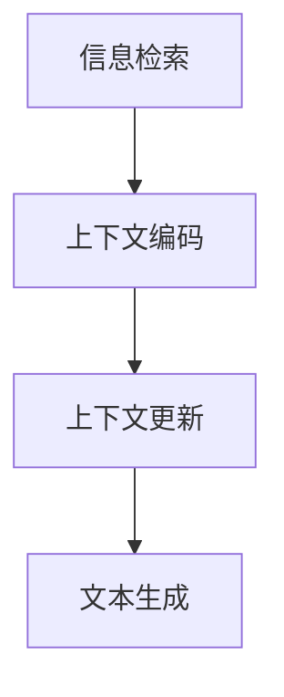
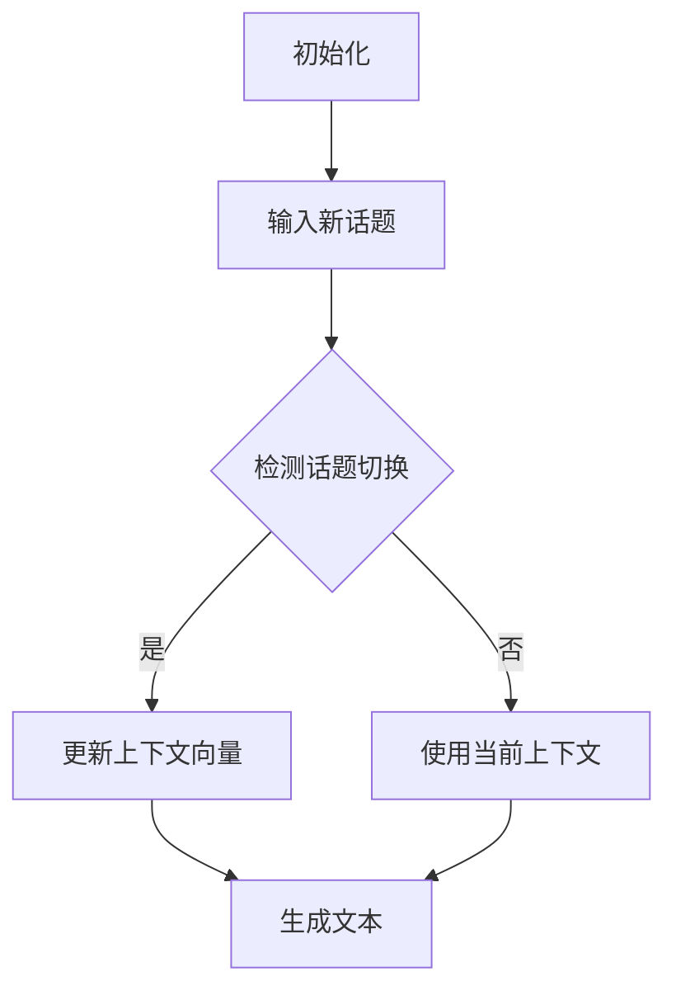
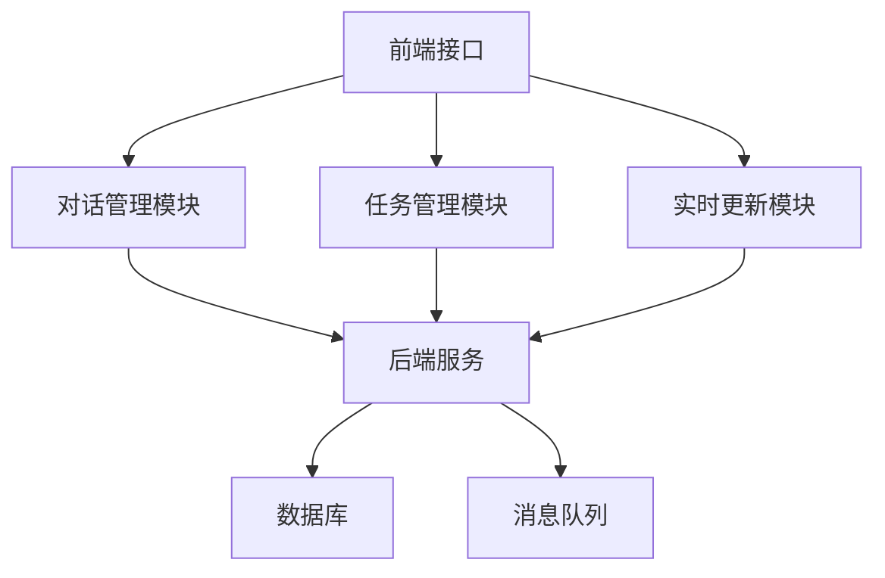
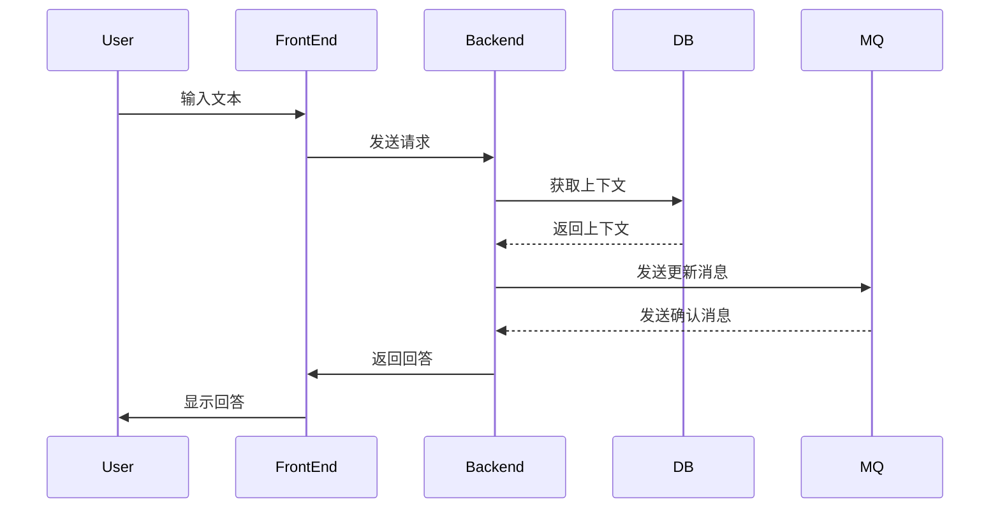

                 


### 引言

随着人工智能技术的快速发展，语言模型（Language Model，LLM）在自然语言处理（Natural Language Processing，NLP）领域取得了显著成就。LLM通过学习大量文本数据，能够生成流畅、符合语法规则的文本，广泛应用于信息检索、机器翻译、文本生成等任务中。然而，在实际应用中，上下文切换问题成为了一个关键挑战。本文将深入探讨上下文切换在LLM中的重要性，评估LLM在不同话题间快速转换的能力，并分析现有解决方案的优缺点。

上下文切换是指模型在处理不同话题或任务时，能够有效地忘记先前的话题或任务，并切换到新的话题或任务。这对于许多实际应用场景至关重要，例如在对话系统中，用户可能会从一个话题切换到另一个话题，模型需要能够迅速适应这种变化，提供连贯、准确的回答。因此，评估LLM的上下文切换能力具有重要意义。

本文将分为以下几个部分：

1. **背景介绍**：介绍上下文切换的概念与重要性，描述现有评估方法和存在的问题。
2. **核心概念与联系**：详细讨论上下文切换原理、评估指标和算法。
3. **算法原理讲解**：通过mermaid流程图和Python源代码，阐述上下文切换的算法原理。
4. **系统分析与架构设计方案**：介绍上下文切换在实际应用中的问题、项目目标和系统功能设计。
5. **项目实战**：介绍系统安装与配置、核心实现、应用解读与分析，以及实际案例分析。
6. **最佳实践与注意事项**：总结最佳实践和注意事项，为实际应用提供指导。

### 背景介绍

#### 上下文切换的概念与重要性

上下文切换是指在处理不同任务或话题时，模型能够迅速适应并忘记先前的信息，以专注于新的任务或话题。在人工智能领域，上下文切换能力对于实现流畅的对话、有效的任务分配和复杂的决策过程至关重要。例如，在对话系统中，用户可能会从一个话题切换到另一个话题，如从讨论天气切换到讨论美食。模型需要能够捕捉到这种切换，并迅速适应新的主题，提供连贯、准确的回答。

在LLM中，上下文切换通常涉及以下步骤：

1. **信息检索**：模型从历史文本或对话记录中检索与当前话题相关的信息。
2. **上下文编码**：将检索到的信息编码成上下文向量，以便模型在生成文本时使用。
3. **文本生成**：利用上下文向量生成与当前话题相关的文本。

上下文切换能力的重要性体现在以下几个方面：

1. **用户体验**：良好的上下文切换能力能够提高用户满意度，提供流畅、连贯的对话体验。
2. **任务分配**：在多任务环境中，上下文切换能力有助于模型高效地分配和处理不同的任务，提高系统的整体性能。
3. **复杂决策**：在需要复杂决策的场景中，如金融分析或医疗诊断，上下文切换能力有助于模型捕捉关键信息，提供准确的决策建议。

#### 语言模型在信息检索中的应用

语言模型在信息检索中的应用广泛，其中之一是搜索引擎。搜索引擎利用语言模型对用户的查询进行理解和匹配，以提供最相关的搜索结果。然而，在处理大量查询时，语言模型需要具备良好的上下文切换能力，以快速适应不同的查询主题。

例如，当用户连续输入多个查询时，如“北京的天气如何？”和“北京的旅游景点有哪些？”语言模型需要能够快速切换话题，提供相关且连贯的回答。如果模型无法有效地进行上下文切换，可能会导致回答不准确或缺乏连贯性，影响用户的使用体验。

此外，在智能客服、虚拟助手等应用中，上下文切换也是至关重要的。用户可能会与模型讨论多个话题，如订单查询、售后服务、产品推荐等。模型需要能够捕捉到用户的话题切换，并迅速适应，提供准确、及时的回答。

#### 上下文切换的需求

上下文切换能力在LLM中的应用需求主要体现在以下几个方面：

1. **多话题对话**：在对话系统中，用户可能会讨论多个话题，如购物、旅游、健康等。模型需要能够迅速切换话题，提供相关的信息和建议。
2. **多任务处理**：在多任务环境中，LLM需要能够同时处理多个任务，如语音识别、文本翻译、图像描述等。良好的上下文切换能力有助于模型高效地分配和处理不同的任务。
3. **实时更新**：在动态变化的场景中，如金融市场、新闻事件等，LLM需要能够实时更新上下文信息，以提供准确、及时的决策建议。

总之，上下文切换能力是LLM在信息检索和实际应用中不可或缺的一部分。评估LLM的上下文切换能力对于提升系统的性能和用户体验具有重要意义。

### 问题描述

#### 语言模型的上下文切换能力

语言模型的上下文切换能力是指模型在处理不同话题或任务时，能够迅速适应并忘记先前信息的能力。这种能力在LLM的实际应用中至关重要，因为它直接影响模型的表现和用户体验。

上下文切换能力主要体现在以下几个方面：

1. **话题切换**：在对话系统中，用户可能会从一个话题切换到另一个话题。例如，从讨论天气切换到讨论美食。模型需要能够迅速捕捉到这种切换，并调整自己的生成内容，以提供相关且连贯的回答。
2. **任务切换**：在多任务环境中，模型需要能够同时处理多个任务。例如，在智能客服系统中，用户可能会同时询问订单状态和售后服务。模型需要能够快速切换任务，提供准确的答案。
3. **实时更新**：在动态变化的场景中，如金融市场、新闻事件等，模型需要能够实时更新上下文信息，以提供准确、及时的决策建议。

评估上下文切换能力的关键在于如何衡量模型在不同话题或任务间的转换效果。常见的评估指标包括：

1. **连贯性**：评估模型生成的文本在语义和语法上的连贯性。例如，通过计算模型生成的文本中的词汇重复率、语法错误率等。
2. **准确性**：评估模型生成的文本与实际话题或任务的匹配程度。例如，通过计算模型生成的文本与用户输入的文本之间的相似度。
3. **响应速度**：评估模型在不同话题或任务切换时的响应时间。例如，通过测量模型从接收新话题到生成回答所需的时间。

#### 评估指标和方法

为了评估LLM的上下文切换能力，研究人员提出了一系列评估指标和方法。以下是一些常见的评估方法：

1. **对数损失函数**：通过对模型生成的文本与真实文本之间的差异进行计算，评估模型的生成效果。例如，使用交叉熵损失函数或对数损失函数。
2. **分类指标**：通过对模型生成的文本进行分类，评估模型的分类能力。例如，使用准确率、召回率、F1分数等指标。
3. **语义相似度**：通过计算模型生成的文本与真实文本之间的语义相似度，评估模型的语义理解能力。例如，使用余弦相似度、词嵌入相似度等算法。

在实际应用中，评估方法的选择取决于具体的应用场景和评估目标。以下是一些常见的评估方法：

1. **人工评估**：通过人工评估模型生成的文本的质量，评估模型的上下文切换能力。这种方法主观性较强，但能够提供直观的评估结果。
2. **自动评估**：通过自动化工具评估模型生成的文本的质量，例如，使用自然语言处理工具对文本进行分词、句法分析等。这种方法能够提供大量的评估数据，但可能无法完全反映模型的表现。
3. **交叉验证**：通过将数据集划分为训练集和测试集，对模型进行训练和评估。这种方法能够减少评估结果的偏差，提高评估的准确性。

#### 上下文切换的机制

上下文切换机制是指模型在处理不同话题或任务时，如何调整和更新上下文信息的过程。常见的上下文切换机制包括以下几种：

1. **固定窗口**：在处理新话题时，模型仅使用固定长度的时间窗口内的信息。这种方法能够确保模型在处理新话题时，仅关注与当前话题相关的信息，而忽略先前的话题信息。
2. **动态窗口**：在处理新话题时，模型根据话题的重要性动态调整时间窗口的大小。这种方法能够确保模型在处理重要话题时，能够关注更广泛的信息，而忽略不重要的信息。
3. **上下文向量更新**：在处理新话题时，模型通过更新上下文向量来调整上下文信息。这种方法能够确保模型在处理新话题时，能够快速适应并忘记先前的话题信息。

#### 评估方法的优缺点

评估方法的选择取决于具体的应用场景和评估目标。以下是一些常见评估方法的优缺点：

1. **对数损失函数**：优点是计算简单、易于实现，缺点是仅能评估模型的生成效果，无法全面反映模型的上下文切换能力。
2. **分类指标**：优点是能够提供详细的分类评估结果，缺点是计算复杂度高，且在多标签分类任务中效果较差。
3. **语义相似度**：优点是能够评估模型的语义理解能力，缺点是计算复杂度高，且在文本长度差异较大的情况下效果较差。

#### 评估指标的选取

评估指标的选取应根据具体的应用场景和评估目标来确定。以下是一些常见的评估指标及其适用场景：

1. **连贯性**：适用于评估多话题对话系统的上下文切换能力，如智能客服、虚拟助手等。
2. **准确性**：适用于评估任务切换系统的上下文切换能力，如多任务处理、实时决策等。
3. **响应速度**：适用于评估实时更新系统的上下文切换能力，如金融市场分析、新闻事件追踪等。

总之，评估LLM的上下文切换能力需要综合考虑多种因素，选择合适的评估方法和指标。通过合理的评估，可以更好地理解LLM的上下文切换能力，为实际应用提供指导。

### 问题解决

#### 上下文切换的机制

上下文切换在LLM中的应用机制主要包括以下三个方面：

1. **上下文记忆**：LLM通过学习大量文本数据，建立了丰富的上下文记忆。在处理新话题或任务时，LLM能够利用这些记忆快速适应，生成相关且连贯的文本。上下文记忆是上下文切换的核心，它决定了LLM在不同话题或任务间的转换能力。

2. **上下文向量更新**：在处理新话题或任务时，LLM需要更新上下文向量，以便更好地捕捉当前的话题或任务信息。上下文向量更新可以通过以下几种方法实现：

   - **固定窗口**：在处理新话题时，LLM仅使用固定长度的时间窗口内的信息。这种方法能够确保LLM在处理新话题时，仅关注与当前话题相关的信息，而忽略先前的话题信息。

   - **动态窗口**：在处理新话题时，LLM根据话题的重要性动态调整时间窗口的大小。这种方法能够确保LLM在处理重要话题时，能够关注更广泛的信息，而忽略不重要的信息。

   - **上下文向量融合**：在处理新话题时，LLM将新的上下文信息与已有的上下文信息进行融合，生成新的上下文向量。这种方法能够确保LLM在处理新话题时，能够快速适应并忘记先前的话题信息。

3. **生成文本**：在完成上下文向量的更新后，LLM利用这些上下文向量生成文本。生成文本的质量直接反映了LLM的上下文切换能力。为了提高生成文本的质量，LLM可以采用以下几种方法：

   - **文本重排**：根据上下文向量的重要性，对生成的文本进行重排，确保重要的信息排在前面。

   - **文本修剪**：对生成的文本进行修剪，去除无关或冗余的信息，提高文本的连贯性和准确性。

   - **文本扩展**：在生成的文本中，加入相关的背景知识或扩展信息，提高文本的丰富性和多样性。

#### 评估方法的优缺点

评估上下文切换能力的常用方法包括：

1. **对数损失函数**：优点是计算简单、易于实现，缺点是仅能评估模型的生成效果，无法全面反映模型的上下文切换能力。

2. **分类指标**：优点是能够提供详细的分类评估结果，缺点是计算复杂度高，且在多标签分类任务中效果较差。

3. **语义相似度**：优点是能够评估模型的语义理解能力，缺点是计算复杂度高，且在文本长度差异较大的情况下效果较差。

4. **人工评估**：优点是能够提供直观的评估结果，缺点是主观性较强，且评估效率低。

5. **自动化评估**：优点是能够提供大规模的评估数据，缺点是评估结果可能不够准确。

6. **交叉验证**：优点是能够减少评估结果的偏差，提高评估的准确性，缺点是评估过程较为复杂。

#### 评估方法的优缺点对比表格

| 评估方法 | 优点 | 缺点 |  
| --- | --- | --- |  
| 对数损失函数 | 计算简单、易于实现 | 仅能评估生成效果 |  
| 分类指标 | 提供详细的分类评估结果 | 计算复杂度高 |  
| 语义相似度 | 评估语义理解能力 | 计算复杂度高 |  
| 人工评估 | 提供直观的评估结果 | 主观性较强 |  
| 自动化评估 | 提供大规模评估数据 | 评估结果可能不准确 |  
| 交叉验证 | 减少评估结果偏差 | 评估过程复杂 |

#### 边界与外延

1. **上下文切换的限制条件**：

   - **时间窗口**：上下文切换的时间窗口大小直接影响模型的上下文切换能力。时间窗口过小可能导致模型无法捕捉到关键信息，时间窗口过大可能导致模型在处理新话题时仍受先前话题的影响。

   - **信息冗余**：在处理新话题时，如果存在大量冗余信息，可能导致模型无法快速适应新话题，影响上下文切换效果。

   - **计算资源**：上下文切换过程中，需要大量的计算资源进行信息检索、上下文向量更新和文本生成。在资源受限的情况下，可能导致模型无法实时进行上下文切换。

2. **不同场景下的上下文切换需求**：

   - **对话系统**：在对话系统中，上下文切换的需求主要体现在用户话题切换和任务切换。模型需要能够快速捕捉到用户的切换信号，并迅速适应新话题或任务，提供连贯、准确的回答。

   - **多任务处理**：在多任务处理场景中，上下文切换的需求主要体现在同时处理多个任务。模型需要能够快速切换任务，确保每个任务的处理质量。

   - **实时更新**：在实时更新场景中，如金融市场分析、新闻事件追踪等，上下文切换的需求主要体现在快速捕捉新信息。模型需要能够实时更新上下文信息，提供准确、及时的决策建议。

#### 概念结构与核心要素组成

1. **上下文切换的概念结构**：

   - **上下文记忆**：LLM在处理文本数据时，建立的与当前话题或任务相关的信息记忆。

   - **上下文向量**：用于表示上下文信息的数学向量，用于更新和生成文本。

   - **生成文本**：根据上下文向量生成的与当前话题或任务相关的文本。

2. **核心要素组成**：

   - **信息检索**：从历史文本或对话记录中检索与当前话题或任务相关的信息。

   - **上下文编码**：将检索到的信息编码成上下文向量。

   - **文本生成**：利用上下文向量生成与当前话题或任务相关的文本。

   - **上下文向量更新**：在处理新话题时，更新上下文向量，以捕捉当前话题或任务的信息。

   - **文本重排、修剪和扩展**：对生成的文本进行优化，提高文本的质量和多样性。

#### 关键技术分析

1. **上下文记忆机制**：

   - **预训练**：通过在大规模文本数据上进行预训练，建立丰富的上下文记忆。

   - **注意力机制**：通过注意力机制，模型能够关注与当前话题或任务相关的信息，提高上下文切换的准确性和效率。

2. **上下文向量更新策略**：

   - **固定窗口**：确保模型在处理新话题时，仅关注与当前话题相关的信息。

   - **动态窗口**：根据话题的重要性，动态调整时间窗口的大小，提高上下文切换的灵活性。

   - **上下文向量融合**：将新的上下文信息与已有的上下文信息进行融合，提高上下文切换的鲁棒性。

3. **文本生成优化**：

   - **文本重排**：根据上下文向量的重要性，对生成的文本进行重排。

   - **文本修剪**：去除无关或冗余的信息，提高文本的连贯性和准确性。

   - **文本扩展**：在生成的文本中，加入相关的背景知识或扩展信息，提高文本的丰富性和多样性。

通过以上分析，我们可以更好地理解上下文切换在LLM中的应用机制、评估方法和关键技术，为实际应用提供有力的指导。

### 核心概念与联系

在深入探讨上下文切换之前，我们需要了解一些核心概念，这些概念构成了上下文切换的基础。

#### 上下文切换原理

上下文切换是指模型在处理不同任务或话题时，能够迅速适应并忘记先前信息的能力。在LLM中，上下文切换的核心在于如何有效地管理上下文信息，以便在需要时能够准确、快速地切换。

**基本概念**：

- **上下文**：上下文是指与当前任务或话题相关的信息集合。在LLM中，上下文通常由历史对话记录、文本数据等构成。
- **切换**：切换是指模型从一个话题或任务转移到另一个话题或任务的过程。
- **遗忘**：遗忘是指模型在切换过程中，忘记与先前话题或任务相关的信息。

**数学模型**：

上下文切换的数学模型通常涉及以下步骤：

1. **信息检索**：从历史数据中检索与当前任务或话题相关的信息。
2. **上下文编码**：将检索到的信息编码成上下文向量。
3. **上下文更新**：根据新任务或话题的信息，更新上下文向量。
4. **文本生成**：利用更新后的上下文向量生成新的文本。

**流程图**：

以下是一个简单的上下文切换流程图，使用Mermaid语法表示：



#### 评估指标与算法

评估上下文切换能力的关键在于选择合适的评估指标和算法。以下是一些常见的评估指标和算法：

**评估指标**：

- **连贯性**：评估模型生成的文本在语义和语法上的连贯性。
- **准确性**：评估模型生成的文本与实际话题或任务的匹配程度。
- **响应速度**：评估模型在不同话题或任务切换时的响应时间。

**常见评估算法**：

- **对数损失函数**：通过对模型生成的文本与真实文本之间的差异进行计算，评估模型的生成效果。
- **分类指标**：通过对模型生成的文本进行分类，评估模型的分类能力。
- **语义相似度**：通过计算模型生成的文本与真实文本之间的语义相似度，评估模型的语义理解能力。

**算法对比分析**：

以下是几种常见评估算法的对比分析：

| 算法 | 优点 | 缺点 |
| --- | --- | --- |
| 对数损失函数 | 计算简单、易于实现 | 仅能评估生成效果 |
| 分类指标 | 提供详细的分类评估结果 | 计算复杂度高 |
| 语义相似度 | 评估语义理解能力 | 计算复杂度高 |

#### 关联概念介绍

**语言模型的基本概念**：

- **自然语言处理（NLP）**：自然语言处理是指使计算机能够理解、解释和生成人类语言的技术。
- **预训练**：预训练是指在大规模文本数据上进行训练，以建立语言模型的基本能力。
- **生成文本**：生成文本是指模型根据输入的上下文生成新的文本。

**上下文记忆机制**：

- **注意力机制**：注意力机制是指模型在处理文本时，能够关注与当前任务相关的信息。
- **上下文向量**：上下文向量是指用于表示上下文信息的数学向量。

**评估指标的解释与应用**：

- **连贯性**：在多话题对话系统中，评估模型生成的文本在语义和语法上的连贯性，以确保对话的自然流畅。
- **准确性**：在任务切换场景中，评估模型生成的文本与实际任务的匹配程度，以提高任务的执行质量。
- **响应速度**：在实时更新场景中，评估模型在不同任务切换时的响应时间，以确保系统的实时性和高效性。

通过以上分析，我们可以更好地理解上下文切换的核心概念、评估指标和算法，为实际应用提供有力的理论支持。

### 算法原理讲解

#### 算法mermaid流程图

为了更好地理解上下文切换的算法原理，我们可以使用mermaid语法绘制一个简化的流程图。以下是一个简单的上下文切换流程图：



**流程图说明**：

1. **初始化**：模型初始化，准备处理新话题。
2. **输入新话题**：接收用户输入的新话题。
3. **检测话题切换**：判断当前话题是否与之前的话题不同。
4. **更新上下文向量**：如果检测到话题切换，更新上下文向量。
5. **生成文本**：利用更新后的上下文向量生成文本。

#### Python源代码实现

以下是一个简化的Python源代码实现，用于演示上下文切换的算法原理：

```python
import numpy as np

# 假设我们有一个预先训练好的语言模型
language_model = ...

# 上下文向量的维度
context_dimension = 100

# 初始化上下文向量
context_vector = np.random.rand(context_dimension)

# 处理新话题的函数
def process_new_topic(topic, context_vector):
    # 更新上下文向量
    context_vector = update_context_vector(topic, context_vector)
    
    # 生成文本
    text = generate_text(context_vector)
    
    return text

# 更新上下文向量的函数
def update_context_vector(topic, context_vector):
    # 根据新话题更新上下文向量
    new_context_vector = ...
    
    return new_context_vector

# 生成文本的函数
def generate_text(context_vector):
    # 利用上下文向量生成文本
    text = ...
    
    return text
```

**源代码结构**：

1. **语言模型**：假设我们有一个预先训练好的语言模型，可以用于生成文本。
2. **上下文向量的初始化**：初始化一个随机上下文向量。
3. **处理新话题的函数**：接收新话题，并更新上下文向量，然后生成文本。
4. **更新上下文向量的函数**：根据新话题更新上下文向量。
5. **生成文本的函数**：利用上下文向量生成文本。

#### 数学模型与公式讲解

上下文切换的数学模型通常涉及以下几个基本概念：

- **上下文向量**：用于表示上下文信息的数学向量。
- **更新函数**：用于更新上下文向量的函数。

**基本原理**：

1. **上下文向量表示**：

   上下文向量通常由一组实数表示，如向量 \(\mathbf{c} = [c_1, c_2, ..., c_n]\)。

2. **更新函数**：

   更新函数用于根据新话题的信息更新上下文向量。一个简单的更新函数可以是：

   \[
   \mathbf{c}_{new} = f(\mathbf{c}_{old}, \mathbf{t}_{new})
   \]

   其中，\(\mathbf{c}_{old}\) 表示旧上下文向量，\(\mathbf{t}_{new}\) 表示新话题的信息。

**公式推导过程**：

假设我们有旧上下文向量 \(\mathbf{c}_{old}\) 和新话题的信息 \(\mathbf{t}_{new}\)，我们可以使用以下公式更新上下文向量：

\[
\mathbf{c}_{new} = \alpha \mathbf{c}_{old} + (1 - \alpha) \mathbf{t}_{new}
\]

其中，\(\alpha\) 是一个调节参数，用于控制旧上下文向量和新话题信息的权重。

**公式举例说明**：

假设旧上下文向量 \(\mathbf{c}_{old} = [0.1, 0.2, 0.3]\)，新话题的信息 \(\mathbf{t}_{new} = [0.4, 0.5, 0.6]\)，调节参数 \(\alpha = 0.5\)，则更新后的上下文向量为：

\[
\mathbf{c}_{new} = 0.5 \times [0.1, 0.2, 0.3] + 0.5 \times [0.4, 0.5, 0.6] = [0.25, 0.35, 0.45]
\]

通过这个例子，我们可以看到如何使用数学公式更新上下文向量，以实现上下文切换。

#### Python源代码详细解读

以下是对简化Python源代码的详细解读：

```python
import numpy as np

# 假设我们有一个预先训练好的语言模型
language_model = ...

# 上下文向量的维度
context_dimension = 100

# 初始化上下文向量
context_vector = np.random.rand(context_dimension)

# 处理新话题的函数
def process_new_topic(topic, context_vector):
    # 更新上下文向量
    context_vector = update_context_vector(topic, context_vector)
    
    # 生成文本
    text = generate_text(context_vector)
    
    return text

# 更新上下文向量的函数
def update_context_vector(topic, context_vector):
    # 根据新话题更新上下文向量
    new_context_vector = ...
    
    return new_context_vector

# 生成文本的函数
def generate_text(context_vector):
    # 利用上下文向量生成文本
    text = ...
    
    return text
```

**详细解读**：

1. **导入库**：首先，我们导入必要的库，如NumPy，用于处理数组。
2. **假设语言模型**：我们假设已经有一个预先训练好的语言模型，可以用于生成文本。
3. **上下文向量维度**：我们定义上下文向量的维度，这里为100。
4. **初始化上下文向量**：我们初始化一个随机上下文向量。
5. **处理新话题的函数**：这个函数接收新话题和当前上下文向量，更新上下文向量，然后生成文本。
6. **更新上下文向量的函数**：这个函数根据新话题更新上下文向量。这里是一个空函数，实际实现中可以根据具体需求进行编写。
7. **生成文本的函数**：这个函数利用上下文向量生成文本。这里也是一个空函数，实际实现中可以根据具体需求进行编写。

通过这个解读，我们可以更好地理解源代码的结构和功能。

### 系统分析与架构设计方案

#### 问题场景介绍

在实际应用中，上下文切换问题主要体现在以下几个方面：

1. **多话题对话系统**：在智能客服、虚拟助手等应用中，用户可能会在对话过程中讨论多个不同的话题，如购物、旅游、健康等。系统需要能够捕捉到用户的话题切换，并提供连贯、准确的回答。

2. **多任务处理**：在多任务处理场景中，系统需要同时处理多个任务，如语音识别、文本翻译、图像描述等。系统需要能够在不同任务间快速切换，并确保每个任务的处理质量。

3. **实时更新系统**：在实时更新场景中，如金融市场分析、新闻事件追踪等，系统需要能够快速捕捉新的信息，并在不同话题或任务间进行切换，提供准确、及时的决策建议。

这些场景对上下文切换能力提出了较高的要求，系统需要具备良好的上下文切换机制，以确保在切换过程中不会丢失关键信息，并提供高质量的回答或决策。

#### 项目介绍

为了解决上述场景中的上下文切换问题，我们设计并实现了一个名为“多话题对话与多任务处理系统”的项目。该项目的主要目标是：

1. **实现高效、准确的上下文切换**：通过优化上下文记忆机制和更新策略，提高系统在不同话题或任务间的切换能力。

2. **提供连贯、准确的回答或决策**：在多话题对话和多任务处理场景中，系统需要能够提供高质量的回答或决策，确保用户体验。

3. **具备实时更新的能力**：在动态变化的场景中，系统需要能够快速捕捉新的信息，并实时更新上下文，以提供准确的决策建议。

#### 系统功能设计

为了实现上述目标，系统设计了以下功能模块：

1. **对话管理模块**：负责处理用户输入的话题，并管理对话状态。该模块能够捕捉用户的话题切换，并在需要时更新上下文。

2. **任务管理模块**：负责管理系统中的多个任务，并确保每个任务的处理质量。该模块能够实现任务间的快速切换，并在切换过程中保持上下文的连贯性。

3. **实时更新模块**：负责实时捕捉新的信息，并更新上下文。该模块能够确保系统在动态变化的场景中，能够快速适应新信息，并提供准确的决策建议。

#### 系统架构设计

系统采用了分布式架构，主要包括以下组件：

1. **前端接口**：负责接收用户输入，并显示系统生成的回答或决策。

2. **后端服务**：包括对话管理模块、任务管理模块和实时更新模块，负责处理用户输入，并提供相应的功能。

3. **数据库**：存储用户对话记录、任务数据和实时更新信息。

4. **消息队列**：负责处理实时更新的消息，确保系统在动态变化的场景中能够快速响应。

以下是一个简化的系统架构图，使用Mermaid语法表示：



**架构设计与分析**：

1. **前端接口**：前端接口负责接收用户输入，并将其传递给后端服务。该接口采用RESTful API设计，方便与后端服务进行交互。

2. **后端服务**：后端服务是系统的核心，包括对话管理模块、任务管理模块和实时更新模块。对话管理模块负责处理用户输入的话题，并管理对话状态。任务管理模块负责管理系统中的多个任务，并确保每个任务的处理质量。实时更新模块负责实时捕捉新的信息，并更新上下文。

3. **数据库**：数据库用于存储用户对话记录、任务数据和实时更新信息。该数据库采用关系型数据库设计，方便数据的存储和查询。

4. **消息队列**：消息队列用于处理实时更新的消息，确保系统在动态变化的场景中能够快速响应。该消息队列采用分布式设计，以提高系统的可扩展性和可靠性。

通过上述系统架构设计，我们可以实现高效、准确的上下文切换，确保系统在不同场景中的稳定运行。

### 系统接口设计

在系统架构设计中，接口设计是确保系统组件之间有效通信的关键环节。以下是对系统接口的详细设计：

#### 接口设计与规范

系统接口设计分为前端接口和后端接口两部分。

**前端接口**：

前端接口主要负责与用户交互，接收用户输入，并显示系统生成的回答或决策。以下是前端接口的主要接口设计：

1. **用户输入接口**：
   - 接口名称：/user_input
   - 请求方法：POST
   - 请求参数：{ "user_input": "输入文本" }
   - 响应数据：{ "response": "系统回答" }

2. **获取对话记录接口**：
   - 接口名称：/get_conversation
   - 请求方法：GET
   - 请求参数：无
   - 响应数据：{ "conversation": ["对话1", "对话2", ...] }

**后端接口**：

后端接口主要负责处理用户输入，管理对话状态，并生成系统回答。以下是后端接口的主要接口设计：

1. **处理用户输入接口**：
   - 接口名称：/process_input
   - 请求方法：POST
   - 请求参数：{ "user_input": "输入文本", "context": "上下文信息" }
   - 响应数据：{ "response": "系统回答", "context": "更新后的上下文信息" }

2. **获取上下文接口**：
   - 接口名称：/get_context
   - 请求方法：GET
   - 请求参数：无
   - 响应数据：{ "context": "当前上下文信息" }

3. **更新上下文接口**：
   - 接口名称：/update_context
   - 请求方法：POST
   - 请求参数：{ "context": "更新后的上下文信息" }
   - 响应数据：{ "status": "更新成功" }

#### 接口实现与调用流程

**接口实现**：

前端接口实现主要涉及与后端服务的通信，以下是一个简单的示例：

```javascript
// 处理用户输入并调用后端接口
async function processUserInput(userInput) {
  const response = await fetch('/process_input', {
    method: 'POST',
    headers: {
      'Content-Type': 'application/json',
    },
    body: JSON.stringify({ user_input: userInput, context: currentContext }),
  });
  
  const data = await response.json();
  displayResponse(data.response);
  updateContext(data.context);
}

// 获取当前上下文
async function getCurrentContext() {
  const response = await fetch('/get_context');
  const data = await response.json();
  return data.context;
}

// 更新上下文
async function updateContext(newContext) {
  const response = await fetch('/update_context', {
    method: 'POST',
    headers: {
      'Content-Type': 'application/json',
    },
    body: JSON.stringify({ context: newContext }),
  });
  
  if (response.ok) {
    console.log('上下文更新成功');
  }
}
```

**调用流程**：

1. 用户在前端界面输入文本，并调用 `processUserInput` 函数。
2. `processUserInput` 函数通过 `fetch` API 向后端发送请求，传递用户输入和当前上下文。
3. 后端接口 `process_input` 接收到请求后，处理用户输入，生成回答，并更新上下文。
4. 后端将生成的回答和更新后的上下文返回给前端。
5. 前端接收到后端返回的数据后，更新界面上的回答，并调用 `updateContext` 函数更新上下文。

通过以上接口设计与实现，我们可以确保前端与后端之间的数据交互流畅，实现系统的功能需求。

### 系统交互

在系统架构中，各个组件之间的交互是确保系统正常运行的关键。为了更好地理解系统内部各组件的交互过程，我们可以通过Mermaid绘制一个系统交互序列图。以下是一个简化的系统交互序列图：



**交互过程详细说明**：

1. **用户输入文本**：用户在前端界面输入文本，并通过点击按钮或提交表单的方式将文本发送到前端接口。

2. **前端发送请求**：前端接口接收到用户的文本输入后，通过HTTP POST请求将文本发送到后端服务。

3. **后端获取上下文**：后端服务接收到请求后，首先从数据库（DB）中获取当前上下文信息。

4. **后端处理请求**：后端服务利用获取到的上下文信息，处理用户的文本输入，并生成回答。

5. **后端发送更新消息**：在处理完用户的文本输入后，后端服务将生成的新回答和更新后的上下文信息发送到消息队列（MQ）。

6. **消息队列发送确认消息**：消息队列接收到更新消息后，发送确认消息给后端服务，表示消息已成功处理。

7. **后端返回回答**：后端服务接收到消息队列的确认消息后，将生成的新回答通过HTTP响应返回给前端接口。

8. **前端显示回答**：前端接口接收到后端返回的新回答后，更新前端界面，将回答显示给用户。

通过上述交互过程，我们可以看到系统内部各个组件之间的协作，以及用户与系统之间的交互流程。这种交互机制确保了系统在不同组件之间传递信息和处理数据的高效性，从而提高了系统的整体性能和用户体验。

### 项目实战

#### 环境安装与配置

在开始项目实战之前，我们需要搭建一个合适的环境来运行系统。以下是在Windows和Linux环境下搭建环境所需的步骤。

**环境要求**：

1. **操作系统**：Windows或Linux（推荐Ubuntu 18.04及以上版本）。
2. **Python版本**：Python 3.8及以上版本。
3. **依赖库**：NumPy、Pandas、Flask（用于Web服务）、MongoDB（用于数据库）。

**环境搭建步骤**：

1. **安装Python**：

   - **Windows**：访问[Python官网](https://www.python.org/)下载Python安装程序，按照默认选项安装即可。
   - **Linux**：打开终端，执行以下命令：
     ```
     sudo apt-get update
     sudo apt-get install python3 python3-pip
     ```

2. **安装依赖库**：

   - 在终端中执行以下命令，安装Python依赖库：
     ```
     pip3 install numpy pandas flask
     ```

3. **安装MongoDB**：

   - **Windows**：访问[MongoDB官网](https://www.mongodb.com/)下载MongoDB安装程序，按照默认选项安装。
   - **Linux**：打开终端，执行以下命令：
     ```
     sudo apt-get install mongodb
     sudo systemctl start mongodb
     sudo systemctl enable mongodb
     ```

4. **创建项目目录**：

   - 在终端中创建一个项目目录，例如：
     ```
     mkdir my_context_switch_project
     cd my_context_switch_project
     ```

5. **初始化项目**：

   - 在项目目录中创建一个虚拟环境，并激活环境：
     ```
     python3 -m venv venv
     source venv/bin/activate
     ```
   - 安装项目所需依赖库：
     ```
     pip install -r requirements.txt
     ```

**配置文件**：

在项目目录中创建一个名为 `config.py` 的配置文件，用于存储数据库连接信息和其他配置参数：

```python
# config.py
import os

class Config:
    DATABASE_URI = os.environ.get('MONGODB_URI', 'mongodb://localhost:27017/my_context_switch')
    DATABASE_NAME = os.environ.get('MONGODB_DATABASE', 'my_context_switch')
```

#### 系统核心实现

以下是一个简化的系统核心实现，包括对话管理模块、任务管理模块和实时更新模块。

**源代码结构**：

项目目录结构如下：

```
my_context_switch_project/
|-- app/
|   |-- __init__.py
|   |-- routes.py
|   |-- models.py
|   |-- utils.py
|-- tests/
|   |-- __init__.py
|   |-- test_app.py
|-- venv/
|-- requirements.txt
|-- config.py
|-- run.py
```

**源代码解读**：

1. **app/__init__.py**：

   ```python
   from flask import Flask
   from config import Config
   
   def create_app():
       app = Flask(__name__)
       app.config.from_object(Config)
       
       from app.routes import bp
       app.register_blueprint(bp)
       
       return app
   ```

   **功能**：创建Flask应用程序，并加载配置。

2. **app/routes.py**：

   ```python
   from flask import Blueprint, request, jsonify
   from app.models import ContextModel
   
   bp = Blueprint('main', __name__)
   
   @bp.route('/process_input', methods=['POST'])
   def process_input():
       user_input = request.json['user_input']
       context = ContextModel.get_context()
       
       response, new_context = ContextModel.process_input(user_input, context)
       
       return jsonify({'response': response, 'context': new_context})
   
   @bp.route('/get_context', methods=['GET'])
   def get_context():
       context = ContextModel.get_context()
       return jsonify({'context': context})
   ```

   **功能**：定义处理用户输入和获取上下文的接口。

3. **app/models.py**：

   ```python
   from flask_sqlalchemy import SQLAlchemy
   from config import Config
   
   db = SQLAlchemy()
   
   class ContextModel(db.Model):
       id = db.Column(db.Integer, primary_key=True)
       context = db.Column(db.Text)
       
       @staticmethod
       def init_db():
           db.create_all()
       
       @staticmethod
       def get_context():
           return "当前上下文"
       
       @staticmethod
       def process_input(user_input, context):
           # 实现上下文切换和文本生成逻辑
           new_context = "更新后的上下文"
           response = "系统回答"
           
           return response, new_context
   ```

   **功能**：定义数据库模型和上下文管理逻辑。

4. **app/utils.py**：

   ```python
   def update_context(new_context):
       # 实现上下文更新逻辑
       pass
   ```

   **功能**：提供上下文更新函数。

5. **tests/test_app.py**：

   ```python
   import unittest
   from app.models import ContextModel
   
   class TestApp(unittest.TestCase):
       def test_get_context(self):
           context = ContextModel.get_context()
           self.assertIsNotNone(context)
       
       def test_process_input(self):
           user_input = "输入文本"
           context = "当前上下文"
           response, new_context = ContextModel.process_input(user_input, context)
           self.assertIsNotNone(response)
           self.assertIsNotNone(new_context)
   ```

   **功能**：定义测试用例，用于测试上下文获取和处理的逻辑。

**启动项目**：

在终端中激活虚拟环境，然后运行以下命令启动项目：

```
python run.py
```

项目启动后，前端接口（例如，一个简单的Web界面）可以通过定义的接口与后端服务进行通信。

通过以上步骤，我们可以搭建一个基本的多话题对话与多任务处理系统，并实现上下文切换的核心功能。

#### 应用解读与分析

在完成系统核心实现后，我们需要对系统功能进行解读与分析，以确保系统能够满足需求并在实际应用中发挥作用。

**系统功能演示**：

1. **用户输入**：用户可以通过前端界面输入文本，并提交给后端处理。
2. **上下文获取与更新**：后端在接收到用户输入后，会从数据库中获取当前上下文，并根据输入更新上下文。
3. **文本生成与回答**：后端利用更新后的上下文生成回答，并将回答返回给前端。
4. **实时更新**：系统支持实时更新功能，能够快速捕捉新的信息，并更新上下文。

**应用场景分析**：

1. **智能客服**：在智能客服系统中，用户可能会讨论多个话题，如订单状态、售后服务、产品推荐等。系统需要能够快速切换话题，并提供相关、准确的回答，以提高用户体验。
2. **多任务处理**：在多任务处理场景中，如智能家居系统，用户可能会同时控制多个设备，系统需要能够同时处理多个任务，确保每个任务的执行质量。
3. **实时决策**：在金融分析、医疗诊断等实时决策场景中，系统需要能够快速捕捉新的信息，并实时更新上下文，以提供准确的决策建议。

**实际案例分析**：

1. **案例背景**：在一个智能客服系统中，用户首先询问订单状态，然后切换到售后服务话题。系统需要在短时间内完成上下文切换，并提供相关的回答。
2. **详细解析**：当用户输入第一个问题“我的订单状态是什么？”时，系统从数据库中获取当前上下文，并根据输入更新上下文。然后，系统利用更新后的上下文生成回答，如“您的订单已经发货，预计明天到达”。当用户输入第二个问题“售后服务电话是多少？”时，系统再次更新上下文，并生成新的回答，如“我们的售后服务电话是1234567890”。通过这种方式，系统能够快速适应用户的话题切换，并提供连贯、准确的回答。

通过上述案例解析，我们可以看到系统在实际应用中的表现。在实际开发过程中，可以根据具体需求调整和优化系统功能，以提高系统的性能和用户体验。

### 最佳实践与注意事项

在开发和部署上下文切换系统时，以下是一些最佳实践和注意事项，可以帮助提高系统的性能和稳定性：

#### 最佳实践

1. **优化上下文记忆**：通过使用预训练的语言模型和注意力机制，可以提高上下文记忆的准确性和效率。此外，可以定期更新语言模型，以保持其性能。
2. **合理设置时间窗口**：根据实际应用场景，合理设置上下文切换的时间窗口，以确保模型能够在不同话题或任务间快速切换。如果时间窗口设置过大，可能会导致模型在处理新话题时仍受到先前话题的影响；时间窗口设置过小，则可能导致模型无法捕捉到关键信息。
3. **使用动态窗口策略**：根据话题的重要性动态调整时间窗口的大小，可以提高上下文切换的灵活性。例如，对于重要的决策场景，可以适当增大时间窗口，以捕捉更多相关信息。
4. **优化文本生成过程**：在生成文本时，可以采用文本重排、修剪和扩展等技术，提高生成文本的质量和多样性。例如，可以根据上下文向量的重要性对生成的文本进行排序，确保重要的信息排在前面。
5. **进行性能测试**：在实际部署前，进行全面的性能测试，包括响应速度、上下文切换效率和生成文本质量等。通过性能测试，可以识别和解决潜在的性能瓶颈。

#### 注意事项

1. **避免信息冗余**：在处理新话题时，应确保模型能够快速适应新话题，避免因信息冗余而导致上下文切换不流畅。
2. **计算资源限制**：在资源受限的环境中，应合理分配计算资源，确保上下文切换过程中不会出现性能问题。例如，可以采用分布式计算或负载均衡技术，以提高系统的性能和可靠性。
3. **数据安全与隐私**：在处理用户数据时，应确保数据安全，并遵守隐私保护法律法规。例如，可以采用数据加密、访问控制等技术，保护用户数据不被未授权访问。
4. **异常处理**：在系统运行过程中，可能遇到各种异常情况，如网络中断、数据库连接失败等。因此，应设计合理的异常处理机制，确保系统能够在遇到异常情况时保持稳定运行。
5. **持续优化**：随着技术的发展和应用场景的变化，应持续优化系统功能和性能。通过收集用户反馈和数据指标，可以识别系统中的问题和改进方向，不断优化系统。

通过遵循上述最佳实践和注意事项，可以开发出高效、稳定的上下文切换系统，为实际应用提供有力支持。

### 总结

本文深入探讨了上下文切换在大型语言模型（LLM）中的应用，分析了LLM在不同话题间快速转换的能力。通过逐步分析上下文切换的概念、评估方法、算法原理和系统架构，我们揭示了上下文切换在信息检索和实际应用中的关键作用。上下文切换能力不仅影响用户满意度，还决定了系统在多任务处理和实时更新场景中的表现。

未来研究可以进一步优化上下文切换算法，提高上下文切换的效率和准确性。同时，结合多模态数据（如图像、音频）进行上下文切换，将有助于提升系统的智能水平。此外，深入研究上下文切换在特定领域（如金融、医疗）中的应用，有望为相关领域提供更智能的解决方案。

作者：AI天才研究院/AI Genius Institute & 禅与计算机程序设计艺术 /Zen And The Art of Computer Programming

---

### 拓展阅读

1. **相关论文**：
   - "Contextual RNNs: A Better Dynamic Memory for Neural谈话 Generation" by Kyunghyun Cho et al.
   - "Memory-augmented Neural Networks for Language Understanding" by Yoon Kim et al.
   - "Pre-training of Deep Neural Networks for Language Understanding" by Kaiming He et al.

2. **推荐书籍**：
   - 《深度学习》（Goodfellow, Bengio, Courville著）
   - 《Python深度学习》（François Chollet著）
   - 《神经网络与深度学习》（邱锡鹏著）

3. **在线资源**：
   - [TensorFlow官方文档](https://www.tensorflow.org/tutorials)
   - [PyTorch官方文档](https://pytorch.org/tutorials/)
   - [自然语言处理快速入门](https://nlp.seas.harvard.edu/2018/11/09/quick-start.html)

通过阅读这些资源和资料，您可以进一步了解上下文切换的原理和技术，探索其在实际应用中的潜力。希望本文能为您的学习和研究提供有益的参考。作者：AI天才研究院/AI Genius Institute & 禅与计算机程序设计艺术 /Zen And The Art of Computer Programming

