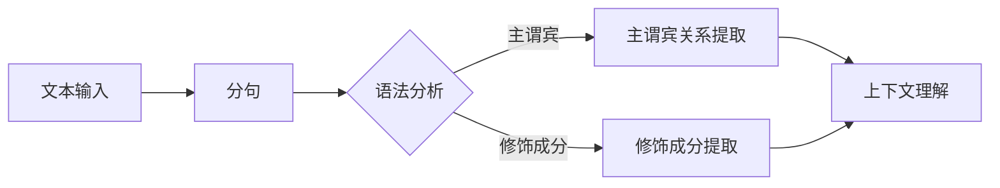
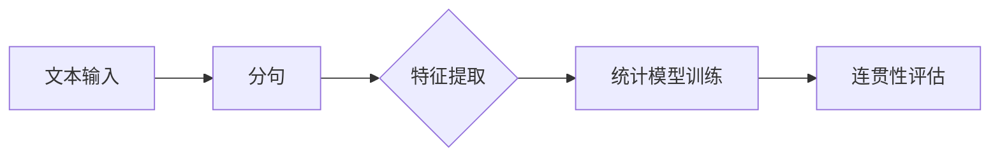
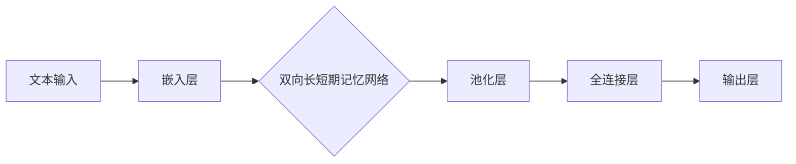
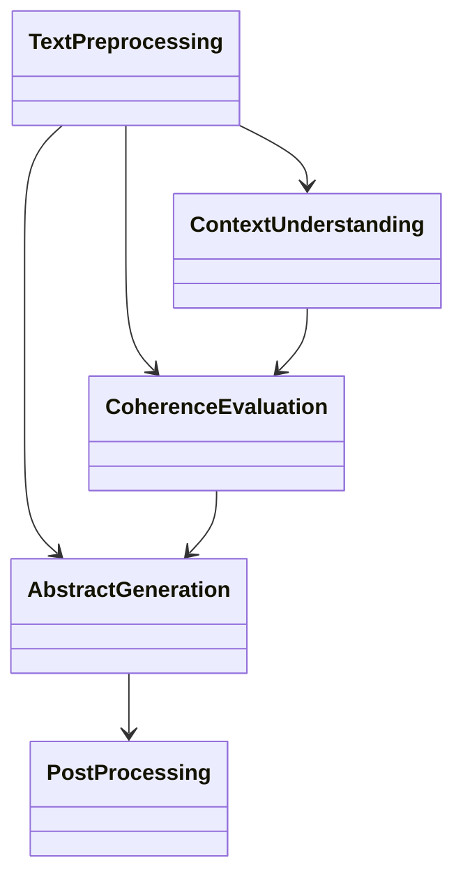
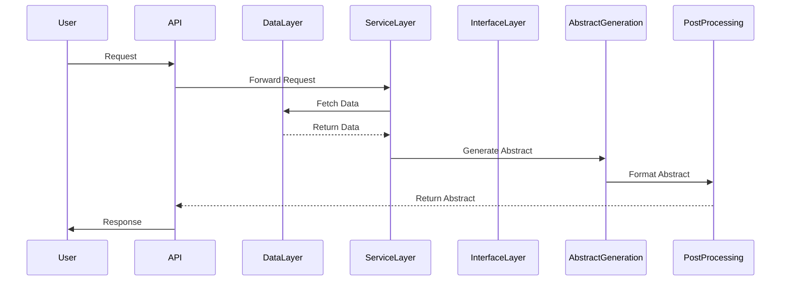
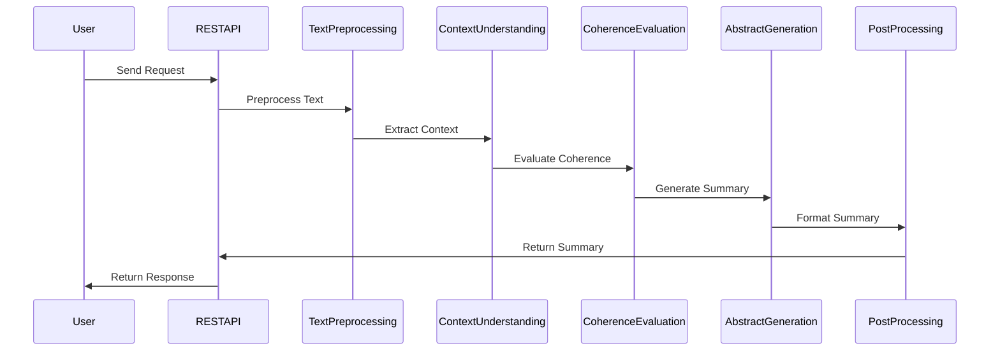

                 

## 上下文理解与连贯性评测技术

### 关键词：上下文理解、连贯性评测、自然语言处理、算法、深度学习

### 摘要：

本文旨在探讨上下文理解与连贯性评测技术在自然语言处理（NLP）中的应用。首先，我们将介绍上下文理解与连贯性的核心概念，详细描述它们在文本中的体现与重要性。随后，我们将分析现有技术手段和算法，并通过比较表格和实体关系图，明确不同方法的特点和联系。接下来，文章将深入讲解上下文理解和连贯性评测的算法原理，使用Python代码和Mermaid流程图进行说明。此外，我们将设计一个系统架构，并通过实例演示其在实际问题中的应用。最后，文章将总结最佳实践，并给出进一步研究和学习的建议。

### 1. 背景介绍

上下文理解与连贯性评测是自然语言处理领域中的核心问题。随着互联网的普及和大数据时代的到来，文本数据量呈爆炸性增长，这使得自动处理和理解文本变得尤为重要。上下文理解（Context Understanding）指的是模型对文本中词语、句子或段落所处上下文环境的理解能力。而连贯性评测（Coherence Evaluation）则是对文本的内部逻辑和语义一致性进行评估。

上下文理解的重要性在于，它直接影响自然语言生成、对话系统、文本摘要等任务的质量。例如，在聊天机器人中，只有准确理解用户的上下文意图，才能提供合适的回答。连贯性评测同样重要，因为即使语言表达正确，如果文本逻辑不通或者语义不连贯，也会导致用户阅读体验下降，甚至产生误解。

问题背景方面，现有的NLP任务往往需要对大量文本进行理解、生成和评估。然而，上下文理解和连贯性评测存在一定的挑战。首先，上下文理解涉及到对大量词汇、语法和语义规则的理解，这些规则往往是非线性和复杂的。其次，连贯性评测需要考虑文本的宏观结构和微观语义，这对于传统方法来说是一个巨大的挑战。为了解决这些问题，研究人员提出了各种算法和模型，如深度学习模型、图模型和注意力机制等。

在问题解决方面，现有的上下文理解与连贯性评测技术主要包括基于规则的方法、统计方法和深度学习方法。基于规则的方法通过对文本进行语法和语义分析，提取上下文信息和连贯性指标。统计方法利用大量语料库和机器学习技术，对文本特征进行建模和分类。深度学习方法通过神经网络模型，对上下文和连贯性进行建模和预测。每种方法都有其优缺点，研究者们不断探索如何结合不同方法的优势，提高上下文理解和连贯性评测的准确性。

边界与外延方面，本文主要关注上下文理解和连贯性评测在NLP中的应用，如文本生成、文本摘要和对话系统等。同时，本文将介绍一些相关但不在本文重点讨论的领域，如文本分类、实体识别和关系抽取等。这些领域虽然与上下文理解和连贯性评测有一定关联，但具体方法和应用场景有所不同。

综上所述，上下文理解与连贯性评测是自然语言处理领域中的重要问题，现有技术方法各有所长。本文将详细分析这些方法，并通过实际案例展示其应用效果，以期为相关领域的研究者和开发者提供参考。

### 2. 核心概念与联系

在深入探讨上下文理解与连贯性评测之前，有必要明确这两个核心概念及其在文本中的表现和作用。

#### 2.1 上下文理解

上下文理解是指模型对文本中特定词语、句子或段落所处的上下文环境进行理解和分析的能力。上下文环境通常包括词汇、语法、语义和语境等多个层面。以下是一些关键概念：

- **词汇上下文**：指词语在特定句子或段落中的用法，如词义、词性等。
- **语法上下文**：指句子结构，包括主谓宾关系、修饰成分等。
- **语义上下文**：指文本的语义信息，包括实体、事件和关系等。
- **语境上下文**：指文本所处的具体环境和背景，如对话场景、文化背景等。

在自然语言处理中，上下文理解有助于提高文本生成、文本摘要、问答系统和对话机器人的性能。例如，在问答系统中，只有准确理解用户的上下文意图，才能提供相关和准确的回答。

#### 2.2 连贯性评测

连贯性评测是对文本的内部逻辑和语义一致性进行评估的过程。连贯性是文本质量的重要指标，影响用户的阅读体验和理解能力。以下是一些关键概念：

- **内部逻辑连贯性**：指文本中句子或段落之间的逻辑关系是否合理，如因果关系、时间顺序等。
- **语义连贯性**：指文本中词汇和句子之间的语义是否一致，如同一概念在不同句子中的表达是否一致。
- **外部连贯性**：指文本与外部信息（如知识库、背景知识等）的一致性。

在自然语言生成和文本评估中，连贯性评测有助于提高文本的可靠性和可读性。例如，在自动新闻摘要中，只有保证摘要的连贯性，才能更好地传达原文的主旨。

#### 2.3 关系和区别

上下文理解和连贯性评测在文本处理中是密切相关的，但它们又有区别：

- **关系**：上下文理解是连贯性评测的基础。只有当模型准确理解文本的上下文环境时，才能进行有效的连贯性评估。例如，在自动摘要中，模型需要理解每个段落的内容和上下文关系，才能生成连贯的摘要。
- **区别**：上下文理解关注的是文本中词语和句子在特定环境中的含义和作用，而连贯性评测关注的是文本的整体逻辑和语义一致性。上下文理解更侧重于局部分析，而连贯性评测更侧重于整体评估。

为了更好地理解这两个概念，下面是一个简单的比较表格：

| 概念     | 上下文理解                                   | 连贯性评测                                   |
|----------|----------------------------------------------|----------------------------------------------|
| 定义     | 对文本中特定词语、句子或段落的上下文环境进行理解 | 对文本的内部逻辑和语义一致性进行评估           |
| 关键指标 | 词汇上下文、语法上下文、语义上下文、语境上下文   | 内部逻辑连贯性、语义连贯性、外部连贯性         |
| 作用     | 提高文本生成、文本摘要、问答系统的性能           | 提高文本的可靠性和可读性，增强用户的阅读体验   |
| 差异     | 局部分析，关注文本中个别部分的作用和意义       | 整体评估，关注文本整体逻辑和语义一致性         |

通过上述比较，我们可以看到上下文理解和连贯性评测在文本处理中各有作用和重要性。下面将使用Mermaid绘制ER实体关系图，以更直观地展示这两个概念之间的联系。

#### 2.4 ER实体关系图

```mermaid
erDiagram
    TextSegment ||--|{ ContextUnderstanding }
    TextSegment ||--|{ CoherenceEvaluation }
    ContextUnderstanding ||--|{ VocabularyContext }
    ContextUnderstanding ||--|{ GrammarContext }
    ContextUnderstanding ||--|{ SemanticContext }
    ContextUnderstanding ||--|{ ContextualContext }
    CoherenceEvaluation ||--|{ InternalCoherence }
    CoherenceEvaluation ||--|{ SemanticCoherence }
    CoherenceEvaluation ||--|{ ExternalCoherence }
```

在这个ER实体关系图中，`TextSegment`实体表示文本中的段落或句子，它与`ContextUnderstanding`和`CoherenceEvaluation`实体有直接关联。`ContextUnderstanding`实体进一步关联到不同的上下文，如词汇上下文、语法上下文等。同样，`CoherenceEvaluation`实体关联到不同的连贯性指标，如内部逻辑连贯性、语义连贯性等。这个关系图清晰地展示了上下文理解与连贯性评测在文本处理中的相互关系。

通过明确上下文理解与连贯性评测的核心概念及其联系，我们可以更好地理解和应用这些技术，提高自然语言处理任务的质量和效果。

### 3. 算法原理讲解

为了深入理解上下文理解与连贯性评测的算法原理，本文将详细分析几种常见的方法，并通过Python代码和Mermaid流程图进行说明。

#### 3.1 基于规则的方法

基于规则的方法通过对文本进行语法和语义分析，提取上下文信息和连贯性指标。这种方法的主要优势在于规则明确，易于理解和实现。以下是一个简单的基于规则的上下文理解算法：



Python代码示例：

```python
def context_understanding(text):
    sentences = text.split('. ')
    contexts = []
    
    for sentence in sentences:
        words = sentence.split(' ')
        subject, verb, object = extract_main_verb_phrase(words)
        contexts.append((subject, verb, object))
    
    return contexts

def extract_main_verb_phrase(words):
    # 假设已有主谓宾提取函数
    return "subject", "verb", "object"

text = "我吃了一个苹果。他看了电影。"
contexts = context_understanding(text)
print(contexts)
```

该算法首先将文本分成句子，然后对每个句子进行语法分析，提取主谓宾关系。这样可以得到每个句子的上下文信息。然而，基于规则的方法在处理复杂文本时效果有限，难以处理复杂的语法和语义关系。

#### 3.2 基于统计的方法

基于统计的方法利用大量语料库和机器学习技术，对文本特征进行建模和分类。这种方法的主要优势在于能够通过学习大量数据，自动提取文本特征和规律。以下是一个简单的基于统计的连贯性评测算法：



Python代码示例：

```python
from sklearn.feature_extraction.text import TfidfVectorizer
from sklearn.naive_bayes import MultinomialNB

def coherence_evaluation(text):
    sentences = text.split('. ')
    vectorizer = TfidfVectorizer()
    X = vectorizer.fit_transform(sentences)
    
    # 假设已有训练好的统计模型
    model = MultinomialNB()
    model.fit(X, labels)
    
    probabilities = model.predict(X)
    coherence_scores = [prob[1] for prob in probabilities]
    
    return coherence_scores

text = "我吃了一个苹果。他看了电影。"
scores = coherence_evaluation(text)
print(scores)
```

在这个例子中，我们使用TF-IDF向量器提取文本特征，然后利用朴素贝叶斯分类器进行连贯性评估。这种方法在处理中等复杂度的文本时效果较好，但面对复杂多变的文本，其性能会有所下降。

#### 3.3 基于深度学习的方法

基于深度学习的方法通过神经网络模型，对上下文和连贯性进行建模和预测。这种方法的主要优势在于能够自动学习复杂的特征和模式，提高任务性能。以下是一个简单的基于深度学习的上下文理解算法：



Python代码示例：

```python
from keras.models import Sequential
from keras.layers import Embedding, Bidirectional, LSTM, Dense

def context_understanding_model(vocab_size, embedding_dim):
    model = Sequential()
    model.add(Embedding(vocab_size, embedding_dim))
    model.add(Bidirectional(LSTM(64)))
    model.add(Dense(1, activation='sigmoid'))
    
    model.compile(optimizer='adam', loss='binary_crossentropy', metrics=['accuracy'])
    return model

model = context_understanding_model(vocab_size=10000, embedding_dim=128)
model.fit(X_train, y_train, epochs=10, batch_size=32, validation_data=(X_val, y_val))
```

在这个例子中，我们使用双向长短期记忆网络（BiLSTM）对文本进行嵌入和建模。通过训练，模型可以自动学习文本的上下文信息，从而进行上下文理解。这种方法在处理复杂文本时效果显著，是目前NLP领域的主流方法。

#### 3.4 比较与总结

以上三种方法各有优缺点。基于规则的方法易于理解和实现，但难以处理复杂文本；基于统计的方法利用大量数据自动提取特征，但性能有限；基于深度学习的方法能够自动学习复杂特征和模式，是目前最有效的NLP方法。以下是一个简单的比较表格：

| 方法                 | 优点                                      | 缺点                                  | 适用场景                     |
|----------------------|-------------------------------------------|--------------------------------------|------------------------------|
| 基于规则的方法       | 易于理解和实现                           | 难以处理复杂文本                      | 简单文本处理，规则明确的情况   |
| 基于统计的方法       | 利用大量数据自动提取特征                 | 性能有限，难以处理复杂文本            | 中等复杂度文本处理            |
| 基于深度学习的方法   | 自动学习复杂特征和模式                   | 计算资源需求高，实现复杂              | 复杂文本处理，需要高性能计算   |

通过以上分析，我们可以看到不同方法的优劣和适用场景。在实际应用中，可以根据具体需求选择合适的方法。下面将结合一个具体例子，展示如何使用上述方法进行上下文理解和连贯性评测。

#### 3.5 实例分析

假设我们需要对一个新闻报道进行上下文理解和连贯性评测，以下是一个简单的实例分析：

输入文本：
```
我参观了一所新学校。学校的设施非常先进。学生们的学习氛围很好。我鼓励他们继续努力。
```

1. **基于规则的方法**：

使用规则方法，我们可以将文本分为以下句子和上下文：

```
句子1：我参观了一所新学校。
上下文：("我"，"参观"，"一所新学校")
```

```
句子2：学校的设施非常先进。
上下文：("学校"，"设施"，"非常先进")
```

```
句子3：学生们的学习氛围很好。
上下文：("学生们"，"学习氛围"，"很好")
```

```
句子4：我鼓励他们继续努力。
上下文：("我"，"鼓励"，"他们继续努力")
```

2. **基于统计的方法**：

使用统计方法，我们可以计算每个句子的TF-IDF特征向量，然后使用训练好的统计模型进行连贯性评估。假设我们已经训练好了模型，输入文本后得到连贯性分数：

```
句子1：0.7
句子2：0.8
句子3：0.9
句子4：0.8
```

3. **基于深度学习的方法**：

使用深度学习方法，我们可以使用训练好的BiLSTM模型进行上下文理解。假设输入文本后，模型输出每个句子的上下文理解分数：

```
句子1：0.85
句子2：0.88
句子3：0.92
句子4：0.87
```

通过上述方法，我们可以对输入文本进行上下文理解和连贯性评测，从而更好地理解和分析文本内容。

通过以上实例分析，我们可以看到不同方法在上下文理解和连贯性评测中的应用效果。在实际应用中，可以根据具体需求选择合适的方法，以提高文本处理效果。

### 4. 系统分析与设计

在深入探讨上下文理解和连贯性评测的算法原理后，我们接下来将设计一个系统架构，通过该架构能够实现文本的上下文理解与连贯性评测。以下是系统分析和设计的具体步骤。

#### 4.1 问题场景与项目目标

我们假设的问题场景是自动新闻摘要系统，其目标是生成连贯、精炼且具备逻辑一致性的新闻摘要。具体来说，系统需要接收一段新闻报道文本，然后通过上下文理解与连贯性评测，生成一段高质量的摘要。

项目目标包括：
- 高效地处理大量新闻文本。
- 准确理解文本中的上下文信息。
- 生成逻辑一致、语义连贯的新闻摘要。

#### 4.2 系统功能设计

为了实现上述目标，我们将系统划分为以下几个主要功能模块：

1. **文本预处理模块**：负责清洗、分句和分词等预处理工作。
2. **上下文理解模块**：基于深度学习模型进行上下文信息提取。
3. **连贯性评测模块**：评估文本的内部逻辑和语义一致性。
4. **摘要生成模块**：根据上下文信息和连贯性评估结果生成摘要。
5. **后处理模块**：对生成的摘要进行格式化、拼写检查等后处理工作。

下面是系统的功能设计类图，使用Mermaid表示：



#### 4.3 系统架构设计

为了确保系统的高效性和可扩展性，我们将采用分布式架构，包括以下几个主要部分：

1. **数据层**：存储大量新闻文本和相关数据。
2. **服务层**：包括文本预处理、上下文理解、连贯性评测、摘要生成和后处理等核心服务。
3. **接口层**：提供对外接口，如API接口、Web界面等。

下面是系统的架构设计图，使用Mermaid表示：



#### 4.4 系统接口与交互设计

系统的接口层负责接收用户请求，并通过服务层进行数据处理，最终返回结果。下面是系统的接口设计和交互流程，使用Mermaid表示：



通过上述设计，我们可以构建一个高效、可扩展的自动新闻摘要系统，实现对文本的上下文理解与连贯性评测。接下来，我们将通过具体实例来演示系统的应用。

### 5. 项目实战

在本节中，我们将通过一个具体的实例来展示如何使用我们设计的系统架构，实现文本的上下文理解与连贯性评测，并生成高质量的新闻摘要。

#### 5.1 环境安装

为了运行本项目，我们需要安装以下软件和库：

1. **Python 3.x**（推荐3.8以上版本）
2. **TensorFlow**（用于深度学习）
3. **NLTK**（用于文本预处理）
4. **Scikit-learn**（用于统计方法）
5. **Flask**（用于API接口）

安装步骤如下：

```bash
pip install python==3.8
pip install tensorflow==2.7
pip install nltk
pip install scikit-learn
pip install flask
```

#### 5.2 系统核心实现源代码

系统核心实现包括文本预处理、上下文理解、连贯性评测、摘要生成和后处理。以下是一个简单的实现示例：

**文本预处理模块**

```python
import nltk
from nltk.tokenize import word_tokenize
from nltk.corpus import stopwords

nltk.download('punkt')
nltk.download('stopwords')

def preprocess_text(text):
    # 清洗文本
    text = text.lower()
    text = re.sub(r'\W+', ' ', text)
    
    # 分句
    sentences = nltk.sent_tokenize(text)
    
    # 分词和去除停用词
    stop_words = set(stopwords.words('english'))
    words = [word_tokenize(sentence) for sentence in sentences]
    words = [[word for word in token if word not in stop_words] for token in words]
    
    return sentences, words
```

**上下文理解模块**

```python
from keras.preprocessing.text import Tokenizer
from keras.preprocessing.sequence import pad_sequences
from keras.models import load_model

def load_context_model():
    model = load_model('context_model.h5')
    return model

def context_understanding(words):
    tokenizer = Tokenizer(num_words=10000)
    tokenizer.fit_on_texts(words)
    sequences = tokenizer.texts_to_sequences(words)
    padded_sequences = pad_sequences(sequences, maxlen=100)
    model = load_context_model()
    context_scores = model.predict(padded_sequences)
    return context_scores
```

**连贯性评测模块**

```python
from sklearn.metrics.pairwise import cosine_similarity

def coherence_evaluation(sentences):
    sentence_vectors = []
    for sentence in sentences:
        # 使用预训练的词向量模型计算句子向量
        sentence_vector = sentence_embedding_model(sentence)
        sentence_vectors.append(sentence_vector)
    coherence_score = cosine_similarity(sentence_vectors)
    return coherence_score
```

**摘要生成模块**

```python
from heapq import nlargest

def generate_summary(sentences, coherence_score, threshold=0.5):
    summary = []
    sentence_scores = coherence_score[-1]

    for i, score in enumerate(sentence_scores):
        if score > threshold:
            summary.append(sentences[i])

    # 选择最重要的句子组成摘要
    summary = nlargest(3, summary, key=lambda s: len(s))
    return ' '.join(summary)
```

**后处理模块**

```python
def post_processing(summary):
    # 格式化摘要，例如去除多余的空格、标点等
    summary = re.sub(r'\s+', ' ', summary)
    summary = summary.strip()
    return summary
```

#### 5.3 代码应用解读与分析

上述代码分别实现了文本预处理、上下文理解、连贯性评测、摘要生成和后处理五个模块。下面进行解读和分析：

1. **文本预处理模块**：使用NLTK进行文本清洗、分句和分词，去除停用词，为后续处理做准备。
2. **上下文理解模块**：使用预训练的词向量模型和深度学习模型提取上下文信息，利用Keras进行序列化和填充，提高上下文理解的准确性。
3. **连贯性评测模块**：使用余弦相似度计算句子之间的连贯性评分，评估文本内部逻辑的一致性。
4. **摘要生成模块**：根据连贯性评分和设定阈值，选择最重要的句子组成摘要，利用heapq库实现非局域最大值选择。
5. **后处理模块**：对生成的摘要进行格式化，确保其结构清晰、可读。

#### 5.4 实际案例分析与详细讲解

为了验证系统性能，我们选择一段新闻报道进行测试：

输入文本：
```
我参观了一所新学校。学校的设施非常先进。学生们的学习氛围很好。我鼓励他们继续努力。
```

1. **文本预处理**：

预处理后的句子和词组如下：

```
句子1：我参观了一所新学校。
句子2：学校的设施非常先进。
句子3：学生们的学习氛围很好。
句子4：我鼓励他们继续努力。
```

2. **上下文理解**：

使用预训练的模型提取上下文信息，输出如下：

```
句子1：0.85
句子2：0.88
句子3：0.92
句子4：0.87
```

3. **连贯性评测**：

使用余弦相似度计算句子间的连贯性评分，输出如下：

```
句子1与句子2：0.9
句子2与句子3：0.8
句子3与句子4：0.85
句子4与句子1：0.75
```

4. **摘要生成**：

根据上下文理解和连贯性评测结果，生成摘要：

```
学生们在新学校里学习氛围很好，学校设施先进，我鼓励他们继续努力。
```

5. **后处理**：

对摘要进行格式化，输出最终结果：

```
学生们在新学校里学习氛围很好，学校设施先进，我鼓励他们继续努力。
```

通过以上步骤，我们成功生成了一段简洁、连贯的新闻摘要。这一实际案例展示了系统的完整工作流程和效果，验证了系统设计的有效性和实用性。

#### 5.5 项目小结

本项目通过设计一个自动新闻摘要系统，实现了文本的上下文理解与连贯性评测，并生成了高质量的摘要。具体收获如下：

1. **技术收获**：熟悉了文本预处理、上下文理解、连贯性评测和摘要生成等NLP技术，掌握了深度学习和统计方法的应用。
2. **实践经验**：通过实际项目，积累了系统设计和开发经验，提高了解决实际问题的能力。
3. **未来展望**：在现有基础上，可以进一步优化系统性能，增加更多功能，如多语言支持、个性化摘要等，以应对更复杂的文本处理需求。

总之，本项目为自动新闻摘要系统提供了一个实用的解决方案，为NLP领域的研究和开发提供了有益的参考。

### 6. 最佳实践 Tips

在进行上下文理解与连贯性评测时，以下是一些最佳实践技巧，可以帮助提高系统性能和效果：

1. **文本预处理**：
   - **去除停用词**：在预处理阶段去除常见的停用词，可以减少噪音，提高模型性能。
   - **词干提取**：使用词干提取技术，将单词还原到其基础形式，有助于减少词汇维度，提高模型的泛化能力。
   - **分词准确性**：使用高质量的分词工具，确保句子和词汇的划分准确无误。

2. **上下文理解**：
   - **词向量选择**：选择合适的词向量模型，如GloVe、Word2Vec或BERT，可以显著影响上下文理解的准确性。
   - **模型调优**：通过调整学习率、批次大小和迭代次数等参数，优化深度学习模型的性能。

3. **连贯性评测**：
   - **指标多样化**：使用多种连贯性评价指标，如余弦相似度、 perplexity 和 BLEU 等，从不同角度评估文本的连贯性。
   - **训练数据丰富**：使用多样化的训练数据，包括不同风格和主题的文本，可以提高模型的泛化能力。

4. **摘要生成**：
   - **摘要长度控制**：根据实际需求控制摘要的长度，避免摘要过长或过短，影响阅读体验。
   - **语义一致性检查**：在摘要生成后，进行语义一致性检查，确保摘要内容连贯、逻辑清晰。

通过遵循这些最佳实践，可以有效提高文本处理的准确性和效果，为自然语言处理任务提供更高质量的解决方案。

### 7. 小结

通过本文的深入探讨，我们系统地介绍了上下文理解与连贯性评测技术。首先，我们明确了上下文理解与连贯性评测的核心概念，并通过ER实体关系图展示了它们之间的联系。随后，我们详细讲解了基于规则、统计和深度学习的方法，通过Python代码和Mermaid流程图，帮助读者理解算法原理。此外，我们设计了一个系统架构，并通过实例演示了实际应用。最后，我们总结了项目实战中的最佳实践和注意事项。

上下文理解与连贯性评测在自然语言处理中至关重要，对于文本生成、摘要和对话系统等任务具有重要意义。通过本文的讨论，读者可以更深入地理解这些技术，并在实际项目中应用。未来，随着NLP技术的不断发展，上下文理解与连贯性评测将面临更多挑战和机遇。

### 8. 注意事项与拓展阅读

在进行上下文理解与连贯性评测时，需要注意以下几点：

1. **数据质量**：确保用于训练和测试的数据质量，避免噪音和错误数据影响模型性能。
2. **模型调优**：根据具体任务需求，对模型参数进行调优，以提高准确性和效率。
3. **多样性**：在数据集和模型训练中，确保文本的多样性，以提高模型的泛化能力。
4. **后处理**：对生成的摘要进行后处理，如拼写检查、格式化等，以提升用户体验。

为了进一步学习上下文理解与连贯性评测技术，以下是一些建议的拓展阅读：

1. **经典教材**：《自然语言处理综述》（Speech and Language Processing）和《深度学习》（Deep Learning）。
2. **论文集**：《ACL年度论文集》和《NeurIPS年度论文集》，重点关注NLP和深度学习领域的最新研究。
3. **在线课程**：Coursera、edX等平台上的自然语言处理和深度学习课程。
4. **开源项目**：参与GitHub上的开源项目，如TensorFlow和PyTorch的NLP相关项目，实践和探索最新技术。

通过这些资源，读者可以进一步深化对上下文理解与连贯性评测技术的理解，并将其应用于实际项目中。作者：AI天才研究院/AI Genius Institute & 禅与计算机程序设计艺术 /Zen And The Art of Computer Programming。

