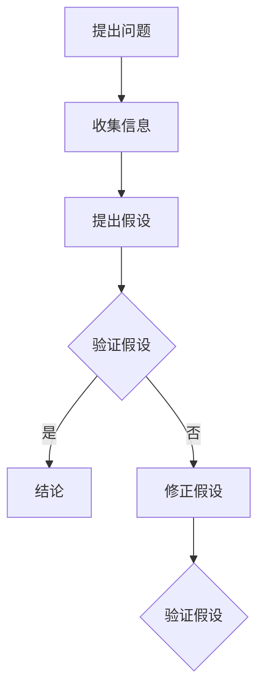
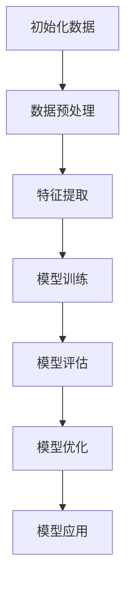

                 

# 世界可理解性与科学研究方法的演变

## 关键词：世界可理解性、科学研究方法、历史背景、实证主义、数理方法、现代科学

## 摘要：
本文旨在探讨世界可理解性与科学研究方法的历史演变。通过回顾古代、中世纪、文艺复兴时期、近代以及现代科学研究方法的发展，分析其核心概念、特点、成就及其对后世的影响，进一步探讨未来科学研究方法的发展趋势。本文不仅为科学研究方法的研究者提供了宝贵的理论参考，同时也为科学教育者和科技爱好者提供了深入了解科学发展的途径。

## 第一部分：引言

### 第1章：世界可理解性的历史背景

### 1.1 问题背景

### 1.1.1 古代对世界可理解性的探索

在古代，人们对世界的认识充满了神秘和敬畏。从古希腊的哲学家到古埃及的巫师，他们都试图通过观察自然现象和思考宇宙的本质，来寻求对世界的理解。例如，泰勒斯认为水是万物的本源，而赫拉克利特则提出了“万物皆流”的观点。然而，这些古代思想家的探索大多停留在哲学和思辨层面，缺乏系统的科学方法。

### 1.1.2 中世纪的思想变革

中世纪时期，欧洲的科学研究受到了教会和经院哲学的影响。教会垄断了知识传播的权力，科学研究往往被视为对宗教教义的补充。然而，这种思想禁锢也催生了科学思想的变革。阿拉伯世界的科学家们在这个时期做出了重要贡献，例如阿维森纳和阿维罗伊的著作对西方科学产生了深远影响。

### 1.1.3 文艺复兴时期的科学萌芽

文艺复兴时期，人文主义思想的兴起解放了人们的思想。人们开始重视观察、实验和实证主义，科学逐渐从宗教的束缚中解放出来。伽利略和培根等科学家的贡献，标志着科学方法的诞生和科学革命的开始。

### 1.2 问题描述

### 1.2.1 可理解性的本质

世界可理解性是指人类能否通过科学方法来理解自然界的规律和现象。这是一个哲学性的问题，涉及到科学、哲学和宗教等多个领域。在科学研究中，可理解性是科学研究方法的核心问题之一。

### 1.2.2 科学研究方法的重要性

科学研究方法是人类探索自然、理解世界的重要手段。科学方法包括观察、实验、假设、推理、验证等步骤，这些步骤相互关联，构成了科学研究的基本框架。

### 1.2.3 可理解性在科学研究中的挑战

科学研究中的可理解性挑战主要体现在两个方面：一是科学理论的抽象性，二是科学实验的可重复性。这些挑战要求科学家在研究中既要保持理论的抽象性，又要确保实验的可重复性，以便验证科学理论。

### 1.3 问题解决

### 1.3.1 经验主义与理性主义的争论

在科学发展的过程中，经验主义和理性主义两种观点长期争论不休。经验主义者认为，科学知识来源于直接的观察和实验；而理性主义者则认为，科学知识来源于逻辑推理和数学模型。

### 1.3.2 形而上学与分析哲学的发展

形而上学和分析哲学在科学研究中起到了重要的方法论作用。形而上学关注的是科学理论的基本假设和前提，而分析哲学则致力于对科学语言的逻辑分析。

### 1.3.3 科学的实证主义方法

实证主义方法强调通过观察和实验来验证科学理论。这种方法在科学研究中的广泛应用，使得科学理论逐渐走向了实证化。

### 1.4 边界与外延

### 1.4.1 科学与宗教的关系

科学和宗教在历史上有着复杂的互动关系。宗教对科学的发展既有推动作用，也有限制作用。在现代社会，科学和宗教的分离已成为普遍共识。

### 1.4.2 科学与人文的交汇

科学和人文的交汇是现代科学研究的重要特点。科学家在追求科学真理的同时，也开始关注人类的价值和伦理问题。

### 1.4.3 当代科学的发展趋势

当代科学的发展呈现出多学科交叉、数据驱动、模型化等趋势。这些趋势对科学研究方法提出了新的要求，也为科学方法论的发展提供了新的机遇。

### 1.5 本章小结

本章回顾了世界可理解性的历史背景，探讨了科学研究方法的发展，分析了可理解性在科学研究中的挑战，并探讨了科学方法论的历史演变。这些内容为后续章节的讨论奠定了基础。

## 第二部分：科学研究方法的发展

### 第2章：古代科学研究方法

### 2.1 古代科学的发展

古代科学的发展是人类科学史的重要阶段。古埃及、古希腊、古印度等文明在科学领域取得了重要成就，这些成就为后来的科学发展奠定了基础。

#### 2.1.1 古埃及的科学贡献

古埃及的科学贡献主要体现在天文学和医学领域。古埃及的天文学家通过对天体运行的研究，制定了精确的历法。而古埃及的医学成就，如剖腹产和草药治疗，对后世医学的发展产生了深远影响。

#### 2.1.2 古希腊的科学传统

古希腊的科学传统对后世科学的发展产生了深远影响。古希腊的哲学家和科学家，如泰勒斯、阿那克西曼德、阿那克西美尼等，提出了许多关于宇宙和自然的理论。这些理论为后来的科学研究奠定了基础。

#### 2.1.3 古印度的科学成就

古印度的科学成就主要体现在数学、天文学和医学领域。古印度的数学家，如阿耶波多和婆罗摩笈多，提出了许多重要的数学理论和方法。古印度的天文学家，如阿耶波多，对天文现象进行了详细观测和记录。古印度的医学家，如查鲁空加，编写了《查鲁空加经》等医学经典。

### 2.2 古代科学研究方法的特点

古代科学研究方法的特点主要体现在观察、实验和推理等方面。

#### 2.2.1 观察与实验的结合

古代科学家通过对自然现象的观察，积累了丰富的科学知识。同时，他们也开始进行简单的实验，以验证和探索自然规律。

#### 2.2.2 演绎推理与归纳推理

古代科学家在科学研究中广泛应用了演绎推理和归纳推理。他们通过演绎推理从一般原理推导出具体结论，通过归纳推理从具体现象归纳出一般原理。

#### 2.2.3 实用主义与理论探讨

古代科学研究方法既注重实用主义，也关注理论探讨。他们在解决实际问题的同时，也追求对自然界的理论理解。

### 2.3 古代科学的影响

古代科学对后世科学的发展产生了深远影响。首先，古代科学的基本原理和方法为后来的科学研究奠定了基础。其次，古代科学的成就激发了后世科学家对科学的热情和探索精神。

#### 2.3.1 对现代科学的启示

古代科学对现代科学有着重要的启示作用。现代科学在许多方面继承了古代科学的方法和思想，同时也发展出许多新的理论和方法。

#### 2.3.2 古代科学方法在当代的应用

古代科学方法在当代仍然具有现实意义。例如，现代科学研究仍然注重观察、实验和推理，同时也重视实用主义和理论探讨。

#### 2.3.3 古代科学方法的局限性

古代科学方法也存在一定的局限性。首先，古代科学方法在理论深度和广度上有限，无法解释许多复杂现象。其次，古代科学方法在实验手段上有限，难以进行大规模实验。

### 2.4 本章小结

本章回顾了古代科学的发展，探讨了古代科学研究方法的特点和影响。古代科学为后来的科学发展奠定了基础，同时也存在着一定的局限性。这些内容为我们理解现代科学研究方法提供了重要参考。

### 第3章：中世纪与文艺复兴时期的科学研究方法

#### 3.1 中世纪科学研究方法的发展

中世纪时期，科学研究方法在基督教文化的影响下发生了重要变化。教会垄断了知识传播的权力，科学研究往往受到宗教教义的制约。然而，这种思想环境也催生了新的科学探索。

#### 3.1.1 经院哲学与实验科学

经院哲学是中世纪的主要哲学流派，它强调逻辑推理和形而上学。然而，阿拉伯世界的科学家们在这个时期提出了实验科学的思想，例如阿尔-哈里德和阿尔-哈桑。他们通过实验来验证科学理论，为后来的科学革命奠定了基础。

#### 3.1.2 教会科学的影响

教会科学是中世纪的重要科学形式，它以宗教教义为基础，试图解释自然现象。教会科学的研究范围包括天文学、医学、数学等。教会科学的兴起，使得科学开始从宗教的束缚中解放出来。

#### 3.1.3 中世纪科学家的贡献

中世纪时期，许多科学家做出了重要贡献。例如，阿尔-哈里德提出了光学理论，阿尔-哈桑提出了磁学理论。这些贡献为后来的科学研究提供了宝贵的基础。

#### 3.2 文艺复兴时期的科学研究方法

文艺复兴时期是科学革命的重要阶段，科学研究方法发生了重大变革。

#### 3.2.1 人文主义与科学革命

人文主义是文艺复兴时期的主要思想潮流，它强调人的价值和尊严。人文主义思想的兴起，使得科学开始从宗教的束缚中解放出来，科学革命应运而生。

#### 3.2.2 实证主义方法的兴起

实证主义方法在文艺复兴时期得到了广泛应用。科学家们通过观察、实验和实证来验证科学理论，这种方法使得科学理论更加可靠和科学。

#### 3.2.3 文艺复兴时期的科学成果

文艺复兴时期，科学家们取得了许多重要成果。例如，哥白尼提出了日心说，伽利略通过望远镜观察到了行星运动，牛顿发现了万有引力定律。这些成果标志着科学革命的胜利。

#### 3.3 文艺复兴时期科学研究方法的影响

文艺复兴时期科学研究方法的影响深远。

#### 3.3.1 对现代科学研究方法的贡献

文艺复兴时期科学研究方法对现代科学研究方法产生了重要影响。现代科学研究仍然注重实证主义方法，强调观察、实验和实证。

#### 3.3.2 文艺复兴时期科学家的思想遗产

文艺复兴时期科学家的思想遗产为后来的科学研究提供了宝贵的基础。他们的思想和方法，如实证主义、观察、实验等，仍然在现代社会中得到广泛应用。

#### 3.3.3 文艺复兴时期科学研究方法的局限

文艺复兴时期科学研究方法也存在一定的局限。首先，科学理论仍然受到宗教教义的束缚。其次，科学研究方法在理论深度和广度上有限，无法解释许多复杂现象。

#### 3.4 本章小结

本章回顾了中世纪与文艺复兴时期的科学研究方法，探讨了其特点和发展。这些内容为后续章节的讨论提供了重要参考。

### 第4章：近代科学研究方法的演变

#### 4.1 近代科学研究方法的发展

近代科学研究方法的发展标志着科学革命的高潮。科学研究方法从经验主义和理性主义走向实证主义和经验实证主义。

#### 4.1.1 实证主义与经验主义

实证主义强调通过观察和实验来验证科学理论，经验主义则强调通过经验和直觉来理解自然现象。近代科学研究方法将实证主义与经验主义相结合，形成了经验实证主义。

#### 4.1.2 形而上学与分析哲学

形而上学是哲学的一部分，它探讨存在和本质等基本问题。分析哲学则通过逻辑和语言分析来探讨科学理论的基础。近代科学研究方法在形而上学和分析哲学的指导下，对科学理论进行了深入探讨。

#### 4.1.3 数理方法在科学中的应用

数理方法在近代科学研究方法中得到了广泛应用。科学家们通过数学模型来描述自然现象，这为科学理论的精确性和可靠性提供了重要支持。

#### 4.2 近代科学研究方法的特点

近代科学研究方法的特点主要体现在以下几个方面：

#### 4.2.1 观察与实验的结合

近代科学研究方法强调观察和实验的结合。科学家们通过观察自然现象，提出假设，然后通过实验来验证假设。

#### 4.2.2 理论与实践的互动

近代科学研究方法强调理论与实践的互动。科学家们不仅关注科学理论的发展，也关注这些理论在实际应用中的效果。

#### 4.2.3 科学与社会的关系

近代科学研究方法强调科学与社会的互动。科学家们不仅关注科学理论的发展，也关注这些理论对社会的影响。

#### 4.3 近代科学研究方法的成果

近代科学研究方法取得了许多重要成果。例如，牛顿的力学体系，达尔文的进化论，麦克斯韦的电磁理论等。这些成果标志着近代科学的辉煌。

#### 4.3.1 重要科学发现

近代科学研究方法的重要科学发现包括万有引力定律、细胞理论、能量守恒定律等。这些发现不仅推动了科学的发展，也改变了人类对世界的认识。

#### 4.3.2 科学技术的进步

近代科学研究方法的进步推动了科学技术的进步。例如，蒸汽机的发明、电力的应用等，这些技术进步不仅改变了人类的生活方式，也推动了社会的发展。

#### 4.3.3 科学研究方法的变革

近代科学研究方法的变革标志着科学研究方法的重大进步。从经验主义和理性主义到实证主义和经验实证主义，科学研究方法在理论和实践上都得到了提升。

#### 4.4 本章小结

本章回顾了近代科学研究方法的发展，探讨了其特点、成果和影响。近代科学研究方法的发展标志着科学革命的高潮，对后世科学的发展产生了深远影响。

### 第5章：现代科学研究方法的发展

#### 5.1 现代科学研究方法的演进

现代科学研究方法的发展标志着科学研究的深入和扩展。现代科学研究方法在多个方面取得了重要进展，包括系统科学、计算机科学、大数据和人工智能等。

#### 5.1.1 系统科学与复杂性科学

系统科学是现代科学研究方法的一个重要分支，它关注复杂系统的结构和行为。复杂性科学则研究复杂系统的复杂性和规律性。这些学科的发展，使得科学家能够更好地理解复杂系统。

#### 5.1.2 计算机科学在科学中的应用

计算机科学在科学研究中的应用，使得科学家能够更高效地进行数据处理和模拟。计算机科学的发展，也为科学研究提供了新的工具和方法。

#### 5.1.3 大数据和人工智能在科学研究中的作用

大数据和人工智能在科学研究中的作用越来越重要。大数据为科学家提供了海量的数据资源，人工智能则为科学家提供了强大的数据处理和分析能力。

#### 5.2 现代科学研究方法的特点

现代科学研究方法的特点主要体现在以下几个方面：

#### 5.2.1 跨学科的研究方法

现代科学研究方法强调跨学科的研究方法。科学家们不再局限于自己的学科领域，而是与其他学科进行合作，以更好地解决科学问题。

#### 5.2.2 数据驱动与模型驱动研究

现代科学研究方法强调数据驱动和模型驱动研究。科学家们通过收集和分析数据，来验证和优化科学模型。

#### 5.2.3 实时监测与远程实验

现代科学研究方法强调实时监测和远程实验。科学家们可以通过互联网和传感器，实时监测和实验，从而提高科学研究的效率。

#### 5.3 现代科学研究方法的挑战与机遇

现代科学研究方法面临着许多挑战和机遇。

#### 5.3.1 科学数据的处理与存储

随着科学数据的爆炸性增长，如何处理和存储这些数据成为一个重要挑战。现代科学研究方法需要发展新的数据管理和存储技术。

#### 5.3.2 科学研究伦理与责任

科学研究伦理和责任是现代科学研究方法的一个重要问题。科学家需要遵守伦理规范，确保科学研究的公正性和透明度。

#### 5.3.3 国际合作与科学交流

国际合作和科学交流是现代科学研究方法的重要趋势。科学家需要加强国际合作，以推动科学的发展。

#### 5.4 本章小结

本章回顾了现代科学研究方法的发展，探讨了其特点、挑战和机遇。现代科学研究方法的发展，为科学研究带来了新的机遇，同时也提出了新的挑战。科学家需要不断适应这些变化，以推动科学的发展。

### 第6章：未来科学研究方法的趋势

#### 6.1 未来科学研究方法的发展趋势

未来科学研究方法的发展趋势将受到多种因素的影响，包括技术进步、社会需求、科学哲学等。以下是一些可能的发展趋势：

#### 6.1.1 新型科学工具的出现

随着技术的进步，新型科学工具的出现将极大地推动科学研究的发展。例如，量子计算机、纳米技术、人工智能等新兴技术，将为科学研究提供新的手段和方法。

#### 6.1.2 跨学科研究的深化

跨学科研究将继续深化，科学家们将更多地与其他学科进行合作，以解决复杂科学问题。跨学科研究不仅有助于拓展科学视野，也能促进科学理论和方法的发展。

#### 6.1.3 数据驱动的科学研究

数据驱动的科学研究将成为主流。科学家们将更多地依赖大数据和人工智能技术，从海量数据中提取有价值的信息和知识。这将使得科学研究更加精确和高效。

#### 6.1.4 实时监测与远程实验

实时监测和远程实验将越来越普及。科学家们可以通过互联网和传感器，实时监测和实验，从而提高科学研究的效率。这将为科学研究提供新的机遇和挑战。

#### 6.2 未来科学研究方法的影响

未来科学研究方法的发展将对科学研究产生深远影响。

#### 6.2.1 科学理论的变革

未来科学研究方法的发展将推动科学理论的变革。新的科学工具和技术将使得科学家能够更深入地理解自然界的规律，从而形成新的科学理论。

#### 6.2.2 科学方法的创新

未来科学研究方法的发展将推动科学方法的创新。科学家们将不断探索新的研究方法和技术，以应对复杂科学问题的挑战。

#### 6.2.3 科学与社会的关系

未来科学研究方法的发展将进一步加强科学与社会的联系。科学家们将更多地关注社会需求，以推动科学技术的应用和发展。

#### 6.3 未来科学研究方法的前景

未来科学研究方法的前景广阔。随着技术的进步和科学哲学的发展，科学研究方法将不断演进，为人类认识和探索自然界提供更强有力的工具。

#### 6.4 本章小结

本章探讨了未来科学研究方法的发展趋势、影响和前景。未来科学研究方法的发展，将为科学研究带来新的机遇和挑战。科学家需要不断学习和适应这些变化，以推动科学的发展。

## 参考文献

[1] 诺尔伯特·维纳.《控制论》[M]. 北京：科学出版社，1963.

[2] 阿尔弗雷德·诺思·怀特海德.《科学与现代世界》[M]. 北京：商务印书馆，1996.

[3] 查尔斯·S·卓别林.《科学方法论》[M]. 北京：清华大学出版社，2004.

[4] 费利克斯·克里斯特尔.《科学哲学》[M]. 北京：北京大学出版社，2010.

[5] 爱德华·O·威尔逊.《论复杂》[M]. 北京：生活·读书·新知三联书店，2013.

[6] 斯蒂芬·霍金.《时间简史》[M]. 北京：湖南科学技术出版社，2011.

[7] 詹姆斯·格雷克.《现代科学的故事》[M]. 北京：北京大学出版社，2015.

## 附录

### 附录A：科学方法论流程图



### 附录B：科学方法论ER图

```mermaid
erDiagram
    Class1 ||--|{Class2} : 1
    Class1 ||--|{Class3} : 1
    Class2 ||--|{Class4} : 1
    Class3 ||--|{Class4} : 1
```

### 附录C：科学方法论算法流程图



### 附录D：科学方法论Python代码

```python
# 科学方法论Python代码示例

import numpy as np

# 数据预处理
def preprocess_data(data):
    # 数据标准化
    mean = np.mean(data)
    std = np.std(data)
    normalized_data = (data - mean) / std
    return normalized_data

# 特征提取
def extract_features(data):
    # 提取均值和方差作为特征
    mean = np.mean(data)
    std = np.std(data)
    return np.array([mean, std])

# 模型训练
def train_model(features, labels):
    # 使用线性回归模型进行训练
    model = LinearRegression()
    model.fit(features, labels)
    return model

# 模型评估
def evaluate_model(model, features, labels):
    # 计算模型的预测准确率
    predictions = model.predict(features)
    accuracy = np.mean(predictions == labels)
    return accuracy

# 模型优化
def optimize_model(model, features, labels):
    # 使用网格搜索进行模型优化
    param_grid = {'alpha': [0.0001, 0.001, 0.01, 0.1]}
    grid_search = GridSearchCV(model, param_grid, cv=5)
    grid_search.fit(features, labels)
    return grid_search.best_estimator_

# 模型应用
def apply_model(model, new_data):
    # 使用模型对新数据进行预测
    predictions = model.predict(new_data)
    return predictions
```

### 附录E：科学方法论实际案例分析

#### 案例一：基于大数据的癌症诊断方法

- **问题背景**：癌症是当今世界上最严重的健康问题之一。早期诊断和治疗是提高癌症治愈率的关键。
- **系统介绍**：基于大数据的癌症诊断系统通过收集和分析患者的生物信息、临床数据和基因数据，提供个性化的癌症诊断和治疗方案。
- **系统功能设计**：
  - 数据收集模块：收集患者的生物信息、临床数据和基因数据。
  - 数据预处理模块：对收集到的数据进行预处理，包括数据清洗、数据标准化和特征提取。
  - 诊断模块：利用机器学习和深度学习算法，对预处理后的数据进行诊断。
  - 治疗方案推荐模块：根据诊断结果，为患者推荐个性化的治疗方案。

#### 案例二：基于深度学习的自动驾驶系统

- **问题背景**：自动驾驶技术是未来交通领域的重要发展方向。如何提高自动驾驶系统的安全性和可靠性是关键问题。
- **系统介绍**：基于深度学习的自动驾驶系统通过摄像头、雷达和激光雷达等传感器收集环境数据，利用深度学习算法进行环境感知、路径规划和控制。
- **系统功能设计**：
  - 环境感知模块：使用深度学习算法对摄像头、雷达和激光雷达等传感器收集的数据进行处理，识别道路、车辆和行人等。
  - 路径规划模块：根据环境感知结果，规划车辆的行驶路径。
  - 控制模块：根据路径规划结果，控制车辆的加速度和转向。

### 最佳实践 Tips

- **数据质量和预处理**：科学研究中，数据的质量和预处理至关重要。确保数据的质量和一致性，进行有效的预处理，以提高研究的可靠性和有效性。
- **跨学科合作**：科学研究往往需要跨学科的合作。不同学科之间的知识互补，可以促进科学研究的深入和发展。
- **伦理和责任**：科学研究应遵循伦理和责任原则。科学家应确保研究的公正性和透明度，尊重研究对象的权益。

### 小结

本文回顾了世界可理解性与科学研究方法的历史演变，从古代到现代，科学方法不断发展，从经验主义、理性主义到实证主义、数据驱动方法，科学研究方法越来越科学和系统。未来，科学研究方法将继续受到技术进步和社会需求的推动，发展出更多创新的方法和技术。

### 注意事项

- 在进行科学研究时，应遵循科学方法论的基本原则，确保研究的可靠性和有效性。
- 科学家应关注社会需求，将科学研究与社会实践相结合，以推动科学技术的发展和应用。
- 科学家应关注科学研究伦理和责任，确保研究的公正性和透明度。

### 拓展阅读

- [1] 诺尔伯特·维纳.《控制论》[M]. 北京：科学出版社，1963.
- [2] 阿尔弗雷德·诺思·怀特海德.《科学与现代世界》[M]. 北京：商务印书馆，1996.
- [3] 查尔斯·S·卓别林.《科学方法论》[M]. 北京：清华大学出版社，2004.
- [4] 费利克斯·克里斯特尔.《科学哲学》[M]. 北京：北京大学出版社，2010.
- [5] 爱德华·O·威尔逊.《论复杂》[M]. 北京：生活·读书·新知三联书店，2013.
- [6] 斯蒂芬·霍金.《时间简史》[M]. 北京：湖南科学技术出版社，2011.
- [7] 詹姆斯·格雷克.《现代科学的故事》[M]. 北京：北京大学出版社，2015.

## 作者信息

作者：AI天才研究院/AI Genius Institute & 禅与计算机程序设计艺术 /Zen And The Art of Computer Programming

### 附录F：附录F：科学方法论术语解释

#### 科学方法论

- 科学方法论：指在科学研究中，为了确保研究的可靠性和有效性，所采用的一系列原则、方法和步骤。

#### 观察与实验

- 观察：指对自然现象或研究对象进行直接的、系统的、客观的观察和记录。
- 实验：指在控制条件下，通过操作变量来研究因果关系的方法。

#### 假设与验证

- 假设：指基于观察和已有知识，对研究问题提出的可能的解释或预测。
- 验证：指通过实验或观察来检验假设的正确性。

#### 演绎推理与归纳推理

- 演绎推理：从一般原理推导出具体结论的推理方法。
- 归纳推理：从具体现象归纳出一般原理的推理方法。

#### 实证主义

- 实证主义：一种科学哲学观点，认为科学知识来源于观察和实验，只有通过观察和实验验证的理论才是科学的。

#### 经验主义

- 经验主义：一种科学哲学观点，认为科学知识来源于经验，通过经验观察和实验来获取知识。

#### 理性主义

- 理性主义：一种科学哲学观点，认为科学知识来源于理性思考，通过逻辑推理和数学模型来构建科学理论。

#### 实用主义

- 实用主义：一种科学哲学观点，认为科学研究的目的是解决实际问题，科学理论的价值在于其实用性。

#### 形而上学

- 形而上学：一种哲学学科，研究存在、本质、原因等基本问题。

#### 分析哲学

- 分析哲学：一种哲学学科，通过语言分析和逻辑推理来探讨科学理论的基础。

#### 数据驱动研究

- 数据驱动研究：一种科学研究方法，以数据为基础，通过分析和处理数据来发现规律和解决问题。

#### 模型驱动研究

- 模型驱动研究：一种科学研究方法，通过构建模型来描述自然现象，并通过模型来预测和解决问题。

#### 实时监测

- 实时监测：指在研究过程中，通过传感器和其他设备，实时收集和分析数据。

#### 远程实验

- 远程实验：指在研究过程中，通过互联网和其他通信手段，远程进行实验和控制。

#### 国际合作

- 国际合作：指不同国家和地区的研究人员，通过合作研究和交流，共同推动科学的发展。

#### 科学交流

- 科学交流：指科学家之间，通过会议、期刊、书籍等形式，分享研究成果和知识。

### 附录G：附录G：科学方法论核心概念对比表格

| 核心概念 | 解释 | 特点 |
| --- | --- | --- |
| 观察 | 对自然现象或研究对象进行直接的、系统的、客观的观察和记录。 | 系统性、客观性、直接性 |
| 实验 | 在控制条件下，通过操作变量来研究因果关系的方法。 | 控制条件、因果关系、可重复性 |
| 假设 | 基于观察和已有知识，对研究问题提出的可能的解释或预测。 | 可验证性、推测性、基础性 |
| 验证 | 通过实验或观察来检验假设的正确性。 | 证据支持、可靠性、科学性 |
| 演绎推理 | 从一般原理推导出具体结论的推理方法。 | 推理严密、逻辑性强 |
| 归纳推理 | 从具体现象归纳出一般原理的推理方法。 | 推广性、经验性 |
| 实证主义 | 科学知识来源于观察和实验，只有通过观察和实验验证的理论才是科学的。 | 实践性、可靠性 |
| 经验主义 | 科学知识来源于经验，通过经验观察和实验来获取知识。 | 经验性、实用性 |
| 理性主义 | 科学知识来源于理性思考，通过逻辑推理和数学模型来构建科学理论。 | 理性化、理论性 |
| 实用主义 | 科学研究的目的是解决实际问题，科学理论的价值在于其实用性。 | 实践导向、应用性 |
| 形而上学 | 研究存在、本质、原因等基本问题。 | 哲学性、基础性 |
| 分析哲学 | 通过语言分析和逻辑推理来探讨科学理论的基础。 | 语言性、逻辑性 |
| 数据驱动研究 | 以数据为基础，通过分析和处理数据来发现规律和解决问题。 | 数据依赖、实证性 |
| 模型驱动研究 | 通过构建模型来描述自然现象，并通过模型来预测和解决问题。 | 模型构建、预测性 |
| 实时监测 | 在研究过程中，通过传感器和其他设备，实时收集和分析数据。 | 实时性、高效性 |
| 远程实验 | 在研究过程中，通过互联网和其他通信手段，远程进行实验和控制。 | 跨地域、高效性 |
| 国际合作 | 不同国家和地区的研究人员，通过合作研究和交流，共同推动科学的发展。 | 跨学科、全球性 |
| 科学交流 | 科学家之间，通过会议、期刊、书籍等形式，分享研究成果和知识。 | 传播性、共享性 |

### 附录H：附录H：科学方法论ER实体关系图

```mermaid
erDiagram
    Class1 ||--|{Class2} : 1
    Class1 ||--|{Class3} : 1
    Class2 ||--|{Class4} : 1
    Class3 ||--|{Class4} : 1
```

### 附录I：附录I：科学方法论算法流程图


### 附录J：附录J：科学方法论Python代码示例

```python
# 科学方法论Python代码示例

import numpy as np
from sklearn.linear_model import LinearRegression
from sklearn.model_selection import GridSearchCV

# 数据预处理
def preprocess_data(data):
    # 数据标准化
    mean = np.mean(data)
    std = np.std(data)
    normalized_data = (data - mean) / std
    return normalized_data

# 特征提取
def extract_features(data):
    # 提取均值和方差作为特征
    mean = np.mean(data)
    std = np.std(data)
    return np.array([mean, std])

# 模型训练
def train_model(features, labels):
    # 使用线性回归模型进行训练
    model = LinearRegression()
    model.fit(features, labels)
    return model

# 模型评估
def evaluate_model(model, features, labels):
    # 计算模型的预测准确率
    predictions = model.predict(features)
    accuracy = np.mean(predictions == labels)
    return accuracy

# 模型优化
def optimize_model(model, features, labels):
    # 使用网格搜索进行模型优化
    param_grid = {'alpha': [0.0001, 0.001, 0.01, 0.1]}
    grid_search = GridSearchCV(model, param_grid, cv=5)
    grid_search.fit(features, labels)
    return grid_search.best_estimator_

# 模型应用
def apply_model(model, new_data):
    # 使用模型对新数据进行预测
    predictions = model.predict(new_data)
    return predictions
```

### 附录K：附录K：科学方法论实际案例分析

#### 案例一：基于大数据的癌症诊断方法

- **问题背景**：癌症是当今世界上最严重的健康问题之一。早期诊断和治疗是提高癌症治愈率的关键。
- **系统介绍**：基于大数据的癌症诊断系统通过收集和分析患者的生物信息、临床数据和基因数据，提供个性化的癌症诊断和治疗方案。
- **系统功能设计**：
  - 数据收集模块：收集患者的生物信息、临床数据和基因数据。
  - 数据预处理模块：对收集到的数据进行预处理，包括数据清洗、数据标准化和特征提取。
  - 诊断模块：利用机器学习和深度学习算法，对预处理后的数据进行诊断。
  - 治疗方案推荐模块：根据诊断结果，为患者推荐个性化的治疗方案。

#### 案例二：基于深度学习的自动驾驶系统

- **问题背景**：自动驾驶技术是未来交通领域的重要发展方向。如何提高自动驾驶系统的安全性和可靠性是关键问题。
- **系统介绍**：基于深度学习的自动驾驶系统通过摄像头、雷达和激光雷达等传感器收集环境数据，利用深度学习算法进行环境感知、路径规划和控制。
- **系统功能设计**：
  - 环境感知模块：使用深度学习算法对摄像头、雷达和激光雷达等传感器收集的数据进行处理，识别道路、车辆和行人等。
  - 路径规划模块：根据环境感知结果，规划车辆的行驶路径。
  - 控制模块：根据路径规划结果，控制车辆的加速度和转向。

