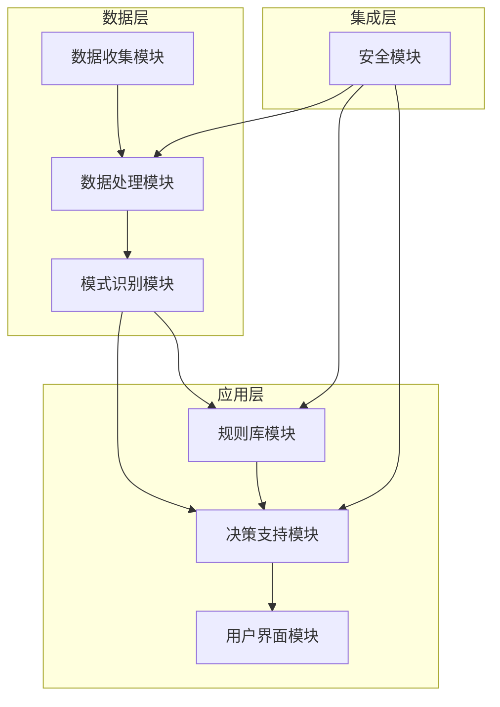

                 

### 引言与背景

在现代社会，科学研究的重要性不言而喻。它推动了技术的进步，改善了人类的生活质量，并为解决全球性挑战提供了科学依据。然而，随着科学研究的深入，其伦理问题也日益凸显。特别是在大数据、人工智能、生物技术等前沿领域，科学研究的伦理问题变得更加复杂和严峻。

首先，我们需要明确可理解性的内涵及其在科学研究中的意义。可理解性指的是科学研究的过程和结果可以被相关人员理解和接受的程度。一个高度可理解的研究不仅有助于提升研究人员的透明度和公信力，还能增强公众对科学研究的信任。因此，可理解性是科学研究中的一个关键因素。

然而，科学研究中的伦理问题却经常与可理解性产生冲突。例如，隐私保护问题要求研究人员对数据严格保密，但这可能会降低研究的可理解性。同样，一些复杂的科学原理和技术实现可能难以被普通公众理解，这也对可理解性提出了挑战。

在本文中，我们将深入探讨世界可理解性与科学研究伦理问题的关系。首先，我们将介绍当前科学研究中的伦理问题现状，并分析可理解性与科学研究的冲突与协调。接下来，我们将探讨伦理问题解决的基本原则，并讨论如何实现科学研究的可理解性。最后，我们将探讨可理解性的适用范围，以及伦理问题的多样性与复杂性。通过这一系列的分析，我们希望能够为解决科学研究中的伦理问题提供一些新的思路和方向。

### 问题描述

当前，科学研究中的伦理问题呈现出多样化和复杂化的趋势。这些问题不仅涉及个人的隐私权和知情同意，还涉及到数据安全、知识产权保护以及研究过程的透明度等方面。

首先，知情同意问题是一个常见的伦理挑战。在进行任何涉及人类或动物的研究时，研究者需要确保参与者充分了解研究的目的、过程和潜在风险，并获得他们的明确同意。然而，在某些情况下，参与者可能因为信息不透明或者语言障碍而无法做出真正的知情决策。这不仅侵犯了参与者的权利，也可能影响研究的科学性和公正性。

其次，隐私保护问题也是科学研究中的一个重大伦理挑战。随着大数据和人工智能技术的发展，研究人员可以轻松地收集和分析大量个人数据。然而，这些数据的收集和使用如果不加以严格监管，可能会侵犯个人的隐私权，甚至造成严重的后果。例如，未经授权使用个人数据可能导致身份盗窃、歧视或不当的决策。

第三，数据安全问题同样不容忽视。在科学研究过程中，数据的安全性和完整性至关重要。然而，网络攻击、数据泄露和不当的数据处理都可能对数据安全构成威胁。一旦数据被泄露或篡改，不仅可能导致研究的失败，还可能对社会产生负面影响。

最后，知识产权问题也是科学研究伦理问题中的一个重要方面。在科学研究的过程中，创新和发明往往需要依赖前人的成果。然而，如何合理地尊重和保护知识产权，避免抄袭和侵权行为，是研究人员和机构需要认真对待的问题。

综上所述，当前科学研究中的伦理问题具有多样性和复杂性。它们不仅影响到研究的质量和公信力，还关系到个人和社会的权益。因此，解决这些伦理问题，不仅需要科学研究的参与者和监管机构共同努力，还需要社会各界的高度关注和支持。

### 伦理问题解决的基本原则

在面对科学研究的伦理问题时，解决这些问题的基本原则显得尤为重要。首先，尊重人的原则是科学研究伦理的核心。这一原则强调在研究过程中必须尊重参与者的尊严、权利和自主性。具体来说，研究者需要确保参与者充分了解研究的所有信息，包括研究的目的、过程、潜在风险和收益，并在完全知情的情况下自愿同意参与。此外，研究者在处理数据时，也应严格遵守隐私保护的规定，确保参与者的个人信息不被泄露或滥用。

其次，公平原则是确保科学研究过程中各方利益均衡的重要原则。这包括确保研究资源的公平分配，避免因种族、性别、年龄、社会经济地位等因素导致的歧视。在实验设计、数据收集和分析过程中，研究者应采取公平公正的方法，确保研究结果的真实性和可靠性。此外，公平原则还要求在研究结果的分享和利用过程中，给予所有参与者公平的机会和待遇。

第三，正直原则是科学研究伦理的基本要求。这一原则强调研究者应在研究中保持诚实和正直，遵守科学诚信和职业道德。研究者应准确报告研究数据，避免造假、抄袭等不道德行为。此外，正直原则还要求研究者对研究结果进行合理的分析和解释，避免误导公众或夸大研究结果。

最后，善良原则是科学研究伦理中的一个重要补充。这一原则强调研究者在进行科学探索时，应考虑到研究的潜在影响，尽可能减少对人类和环境的负面影响。研究者应在研究过程中采取适当的风险管理措施，确保研究活动的安全和可持续性。

这些伦理原则在科学研究中的重要性不可忽视。首先，它们为研究活动提供了伦理指导，确保研究过程的合法性和道德性。其次，这些原则有助于提升研究的公信力和可信度，增强公众对科学研究的信任。最后，遵守伦理原则有助于减少研究中的伦理风险，保护参与者和社会的利益，推动科学研究的健康、可持续发展。

通过遵循这些基本原则，研究者可以更好地解决科学研究中的伦理问题，实现科学研究的价值和社会责任。这不仅有助于维护研究的质量和信誉，也为科学技术的进步和人类福祉的改善提供了坚实的保障。

### 可理解性在科学研究中的实现途径

实现科学研究的可理解性，需要从多个维度入手，确保研究过程和结果能够被广泛接受和理解。以下是几个关键途径：

首先，透明性是提升科学研究可理解性的基础。透明性要求科学研究过程中的每一步都要公开透明，包括研究设计、数据收集、数据分析、结果解释等。研究者应详细记录研究过程，并公开相关的数据和方法，以便同行评审和公众监督。例如，在实验研究中，研究者可以公开实验方案、数据集和计算代码，使其他人能够复制和验证研究结果。

其次，简化复杂原理是提高可理解性的重要手段。科学研究的许多领域涉及复杂的数学模型、算法和技术，这些内容对于非专业人士来说可能难以理解。研究者可以通过以下方法简化复杂原理：使用生动的比喻和类比，将复杂的科学概念转化为日常生活中的例子；制作可视化图表和动画，直观地展示研究过程和结果；编写简洁明了的说明文档，帮助读者理解研究的关键点和结论。

第三，加强科普宣传是提升可理解性的有效途径。科学研究不仅需要专业的理解，还需要公众的支持和理解。研究者可以通过多种渠道进行科普宣传，包括发表科普文章、参与科普讲座和论坛、制作科普视频等。通过这些方式，研究者可以有效地将科学知识传播给公众，增强公众对科学研究的兴趣和理解。

第四，跨学科合作是提升可理解性的重要手段。科学研究往往涉及多个学科领域，跨学科合作能够整合不同领域的专业知识，提供更加全面和深入的研究视角。例如，在生物医学研究中，医生、生物学家、统计学家和计算机科学家可以共同合作，从不同角度分析数据，提供更加全面的研究结论。

最后，建立科学的评价体系也是实现可理解性的重要措施。评价体系应包括对研究过程、方法和结果的可理解性进行评价。这可以通过设立专门的评审标准，如透明性、简明性、可重复性和公众参与度等指标，确保研究的高质量和高可理解性。

总之，通过提高透明性、简化复杂原理、加强科普宣传、跨学科合作和建立科学的评价体系，科学研究可以实现更高的可理解性，从而提升研究的社会影响力和公信力。

### 可理解性的适用范围

可理解性在科学研究中的适用范围广泛，涵盖了多个学科领域。首先，在生物医学领域，可理解性显得尤为重要。生物医学研究涉及复杂的生物机制和医学治疗方法，这些内容不仅需要医学专家理解，还需要患者和公众理解。因此，研究人员通过可视化工具、科普文章和患者参与等方式，提高研究的可理解性，有助于提升治疗效果和患者信任。

其次，在信息技术领域，可理解性同样不可或缺。随着人工智能、大数据和区块链等技术的发展，许多技术原理和算法变得高度复杂。为了确保技术应用的普及和公众接受，研究者需要简化这些复杂的技术，使其更易于理解和应用。例如，通过简洁明了的文档、可视化图表和案例研究，研究人员可以有效地传达技术原理和优势。

最后，在环境科学领域，可理解性同样重要。环境问题复杂且涉及多方面因素，研究人员需要将研究结果以通俗易懂的方式传达给政策制定者和公众，以便制定有效的环境保护政策。通过图表、模型和实地考察报告，研究人员可以更好地展示环境问题的影响和解决方案。

总之，可理解性在科学研究中的适用范围广泛，不同学科领域通过不同的方法提高研究的可理解性，以促进科学知识的传播和应用。

### 核心概念与构成要素

在深入探讨科学研究中的伦理问题时，我们需要明确几个核心概念，这些概念构成了伦理问题的理论基础。首先是“伦理”这一概念。伦理是一种规范行为的道德原则，它指导人类在社会中如何行动，以维护公正、公平和道德的秩序。在科学研究中，伦理指的是研究过程中的行为准则，确保研究活动不侵犯个人或社会的利益。

接下来是“伦理问题”的概念。伦理问题是指科学研究过程中出现的违背伦理原则的行为或情况。这些问题可能涉及知情同意、隐私保护、数据安全、知识产权等多个方面。例如，未经参与者同意使用其数据、泄露个人隐私、未经授权使用他人研究成果等都属于伦理问题。

第三个核心概念是“可理解性”。可理解性指的是科学研究的过程和结果能够被相关人员理解和接受的程度。它不仅关乎科学研究的透明度和公信力，还影响到公众对科学的信任。在伦理问题中，可理解性起着重要作用，因为只有当研究结果和过程被广泛理解时，公众和参与者才能对研究做出合理的判断和决策。

伦理问题的核心要素包括以下几个方面：

1. **知情同意**：这是伦理问题中的一个关键要素，指的是在进行任何涉及人类或动物的研究之前，必须确保参与者了解研究的所有信息，包括研究的目的、过程、潜在风险和收益，并自愿同意参与。

2. **隐私保护**：研究过程中收集和处理的个人数据必须得到严格保护，确保其不被泄露或滥用。这要求研究者采取有效措施，如数据加密、匿名化处理等，以保护参与者的隐私。

3. **数据安全**：确保研究数据的完整性和保密性是另一个重要要素。研究者需要采取适当的技术和管理措施，防止数据泄露、丢失或篡改。

4. **知识产权**：在科学研究过程中，创新和发明往往需要依赖前人的成果。因此，如何合理地尊重和保护知识产权，避免抄袭和侵权行为，是一个重要的伦理问题。

5. **透明性**：研究过程和结果需要公开透明，以便接受同行评审和公众监督。透明性有助于提高研究的可信度和公众对科学研究的信任。

综上所述，伦理问题在科学研究中具有核心地位，其构成要素包括知情同意、隐私保护、数据安全、知识产权和透明性等。理解这些核心概念和要素，有助于我们更好地认识和解决科学研究中的伦理问题。

### 可理解性的概念与属性

可理解性在科学研究中具有至关重要的意义，它指的是研究的过程和结果能够被相关人员理解和接受的程度。这一概念不仅关乎科学研究的透明度和公信力，还影响到公众对科学研究的信任。以下是可理解性的定义、特征及其与其他概念的对比。

首先，**可理解性的定义**。可理解性是指研究内容、过程和结果能够在不同层次上被相关人员，包括研究人员、同行、利益相关者和公众，清晰、准确地理解。这种理解不仅包括对研究方法和技术的掌握，还涉及对研究目的和价值的认同。

**可理解性的特征**包括以下几点：

1. **透明性**：研究过程和结果应清晰透明，便于相关人员查看和审查。这要求研究者在研究设计、数据收集、分析方法等各个环节中详细记录和公开信息。

2. **简明性**：研究内容应简明易懂，避免使用过于复杂的术语和表述。这有助于扩大研究受众，使其能够轻松理解研究的关键点。

3. **可重复性**：研究结果应具有可重复性，使其他研究者能够通过相同的方法和步骤验证研究结果。这有助于提升研究的可信度和科学性。

4. **可接受性**：研究结论和推论应被相关人员接受，包括同行评审、利益相关者和公众。这意味着研究必须符合伦理标准，尊重参与者的权利，并获得其同意。

**可理解性与透明性的区别与联系**：

- **区别**：透明性是指信息的公开性和可访问性，而可理解性则关注于这些信息是否能够被正确理解和应用。透明性是可理解性的基础，但透明性本身并不能保证可理解性。

- **联系**：透明性是实现可理解性的必要条件。只有在信息完全公开透明的情况下，相关人员才能对研究过程和结果进行理解和评价。

**可理解性与复杂性的平衡**：

在科学研究中，复杂性往往是不可避免的。某些领域，如量子物理和复杂的生物系统，本身就具有高度复杂性。在处理这些复杂问题时，研究者需要在可理解性和复杂性之间找到平衡。

1. **简化模型**：通过使用简化的模型和算法，研究者可以降低研究的复杂性，使其更易于理解和应用。

2. **分层次解释**：对于高度复杂的研究，可以采用分层次解释的方法，先从简单的基本原理开始，逐步深入到复杂的细节。

3. **多学科合作**：跨学科合作能够整合不同领域的专业知识，提供更加全面和深入的研究视角，有助于提升研究的可理解性。

**结论**：

可理解性在科学研究中具有重要地位，它不仅关系到研究的科学性和公正性，还影响到公众对科学研究的信任。通过提高透明性、简明性和可重复性，研究者可以提升研究的可理解性，促进科学知识的传播和应用。同时，在处理复杂问题时，需要在可理解性和复杂性之间找到平衡，以实现科学研究的可持续发展。

### 科学研究的伦理原则

科学研究的伦理原则是确保研究活动符合道德规范、保护参与者权益和促进科学进步的重要指导方针。以下是对几个核心伦理原则的概述、内涵及其在科学研究中的重要性。

#### 尊重人的原则

**概述**：尊重人的原则强调在科学研究中必须尊重参与者的尊严、权利和自主性。研究者有责任确保参与者充分了解研究的所有信息，并自愿、知情地同意参与。

**内涵**：这一原则包括以下几个方面：
- **知情同意**：确保参与者理解研究的所有信息，包括研究目的、过程、潜在风险和收益，并在完全知情的情况下自愿同意参与。
- **自主权**：参与者有权自主决定是否参与研究，并在研究过程中随时退出。
- **隐私保护**：在研究过程中，参与者的个人信息和隐私必须得到严格保护，防止其被泄露或滥用。

**重要性**：尊重人的原则是科学研究伦理的核心，它确保研究活动不侵犯参与者的权利，增强研究的合法性和道德性，提高研究结果的可靠性和公信力。

#### 公平原则

**概述**：公平原则要求在科学研究中，研究者应公平地对待所有参与者，确保研究资源和机会的公平分配。

**内涵**：这一原则包括以下几个方面：
- **资源公平**：在研究设计和执行过程中，应确保所有参与者能够平等地享受研究带来的收益，如医疗服务、教育机会等。
- **机会公平**：研究参与者应享有平等的研究机会，不应因种族、性别、年龄、社会经济地位等因素受到歧视。
- **公正评价**：研究结果应对所有参与者进行公正评价，确保研究结论的客观性和科学性。

**重要性**：公平原则确保研究过程的公正性和结果的可靠性，维护参与者的权益，提升研究的可信度和公众对科学研究的信任。

#### 正直原则

**概述**：正直原则强调研究者应在科学研究中保持诚实、公正和透明，遵守科学诚信和职业道德。

**内涵**：这一原则包括以下几个方面：
- **诚实**：研究者应准确、真实地报告研究结果，不隐瞒或篡改数据。
- **公正**：在研究过程中，应公正地对待所有参与者，不偏袒或歧视。
- **透明**：研究过程和结果应公开透明，接受同行评审和公众监督。

**重要性**：正直原则是科学研究伦理的基础，它确保研究活动的诚信性和科学性，维护研究的质量和公信力。

#### 善良原则

**概述**：善良原则要求研究者在科学探索过程中，应考虑到研究的潜在影响，尽可能减少对人类和环境的负面影响。

**内涵**：这一原则包括以下几个方面：
- **风险最小化**：在研究设计过程中，应尽可能减少对参与者和环境的潜在风险。
- **利益最大化**：通过研究活动，应尽量为参与者和社会带来最大化的利益。
- **伦理审查**：所有研究项目应经过严格的伦理审查，确保研究符合伦理标准。

**重要性**：善良原则确保研究活动符合道德要求，促进科学研究与社会的和谐发展，增强公众对科学研究的信任。

综上所述，科学研究的伦理原则是确保研究活动合法、道德和科学的重要指导方针。尊重人的原则、公平原则、正直原则和善良原则共同构成了科学研究伦理的核心，为科学研究的健康发展提供了坚实的伦理基础。

### 科学研究中的伦理问题类型

在科学研究中，伦理问题多种多样，涉及知情同意、隐私保护、数据安全和知识产权等多个方面。以下是对这些伦理问题类型的详细分析。

#### 知情同意问题

**定义**：知情同意是指在进行任何涉及人类或动物的研究之前，参与者必须充分了解研究的目的、过程、潜在风险和收益，并在完全知情的情况下自愿同意参与。

**案例分析**：例如，在一项涉及基因编辑的人类临床试验中，参与者必须明确了解基因编辑的潜在风险和不确定性，包括可能的长期健康影响。如果参与者未能充分知情，或者在同意过程中受到误导或压力，就会违反知情同意原则。

**影响**：知情同意问题不仅会侵犯参与者的权益，还会影响研究的合法性和道德性。未经充分知情的参与者可能因缺乏了解而感到恐慌或不安，甚至可能因潜在的副作用而遭受健康损害。

#### 隐私保护问题

**定义**：隐私保护是指在科学研究中，参与者的个人信息和数据必须得到严格保护，防止其被泄露或滥用。

**案例分析**：例如，在一个关于患者医疗数据的研究中，研究者必须确保患者的医疗记录和个人信息不被未经授权的人员访问。如果这些数据被泄露，可能导致患者身份被盗用，甚至引发严重的隐私侵犯事件。

**影响**：隐私保护问题直接关系到参与者的信任和隐私权。一旦隐私被泄露，不仅会侵犯参与者的个人权益，还可能对社会产生负面影响，如信任危机、社会不安等。

#### 数据安全问题

**定义**：数据安全是指在科学研究中，数据必须得到有效保护，防止其被泄露、丢失或篡改。

**案例分析**：例如，在一个涉及大规模数据收集的研究项目中，如果数据存储系统受到网络攻击，可能导致数据丢失或被恶意篡改。这不仅会影响研究的科学性和可靠性，还可能对参与者的隐私和安全构成威胁。

**影响**：数据安全问题可能导致研究失败，浪费大量资源，甚至危及参与者的利益。在极端情况下，数据泄露还可能对社会安全构成威胁，如身份盗窃、诈骗等。

#### 知识产权问题

**定义**：知识产权问题是指在科学研究中，创新和发明必须合理尊重和保护前人的成果，避免抄袭和侵权行为。

**案例分析**：例如，在一项关于新药物研发的研究中，如果研究团队未经授权使用他人的专利或研究成果，就可能构成侵权。这不仅会损害原创者的权益，还可能导致法律纠纷。

**影响**：知识产权问题直接影响科学研究的创新动力和知识产权的合法权益。抄袭和侵权行为会削弱原创者的积极性和创造力，阻碍科学技术的进步。

总之，科学研究中的伦理问题类型多样，每个问题都关系到参与者和社会的权益。解决这些问题需要研究者、监管机构和各方的共同努力，确保科学研究的合法、道德和可持续发展。

### 伦理问题的案例分析

为了更深入地理解科学研究中的伦理问题，我们可以通过具体案例进行分析和讨论。以下将介绍几个典型案例，探讨其背后的伦理困境和解决策略。

#### 案例一：基因编辑研究

**背景**：2018年，中国科学家贺建奎宣布成功实施首例基因编辑婴儿出生，引起了全球科学界和公众的广泛关注。

**伦理困境**：这项研究涉及基因编辑技术，目的是消除婴儿对HIV的抵抗力。然而，基因编辑技术本身存在高度不确定性和潜在风险，例如可能导致的基因突变和遗传风险。此外，这项研究未经充分伦理审查和公众讨论，侵犯了知情同意原则。

**解决策略**：首先，需要进行严格的伦理审查，确保研究符合道德和法律标准。其次，应开展广泛的公众讨论，使社会各界对基因编辑技术的风险和潜在影响有充分了解。此外，研究人员应遵循透明原则，公开研究过程和结果，接受同行评审和公众监督。

#### 案例二：Facebook数据泄露事件

**背景**：2018年，全球最大的社交媒体公司Facebook被曝出约8700万用户的个人信息被不当使用，用于政治营销和选举干预。

**伦理困境**：这一事件涉及到隐私保护和数据安全问题。Facebook未能妥善保护用户数据，导致大量个人信息被泄露和滥用。这不仅侵犯了用户的隐私权，还引发了信任危机，对Facebook的声誉和公众信任造成严重损害。

**解决策略**：首先，Facebook需要采取紧急措施，加强对用户数据的保护，防止进一步泄露。其次，应公开透明地披露数据泄露事件的相关信息，并向受影响的用户提供补偿措施。此外，Facebook应加强内部监管机制，防止类似事件再次发生，并建立更加严格的数据保护政策。

#### 案例三：深度伪造视频事件

**背景**：近年来，深度伪造（Deepfake）技术的滥用引发了广泛关注。一些不法分子利用这项技术制作虚假视频，用于诽谤、诈骗等非法活动。

**伦理困境**：深度伪造技术使得制作虚假视频变得相对简单，这给隐私保护、法律监管和伦理道德带来了巨大挑战。虚假视频可能侵犯他人的名誉权，误导公众，甚至引发社会恐慌。

**解决策略**：首先，技术公司和研究机构应开发有效的检测和防范工具，以识别和阻止深度伪造视频的传播。其次，政府和监管机构应制定相关法律法规，规范深度伪造技术的使用，防止其被滥用。此外，公众应提高对虚假信息的辨识能力，增强对深度伪造视频的警惕性。

#### 案例四：亚马逊雨林焚烧事件

**背景**：2020年，亚马逊雨林大规模焚烧引发了全球关注。一些企业为了追求经济利益，非法砍伐森林并纵火焚烧，导致生态环境严重破坏。

**伦理困境**：这一事件涉及到环境保护和可持续发展问题。企业的短视行为不仅破坏了宝贵的自然资源，还对全球气候和环境产生了负面影响。

**解决策略**：首先，企业应承担社会责任，遵循可持续发展的原则，减少对环境的破坏。其次，政府和国际组织应加强监管，制定严格的环保法规，防止森林资源被非法侵占和滥用。此外，公众应提高环保意识，倡导绿色消费和可持续发展。

通过这些案例的分析，我们可以看到科学研究中的伦理问题具有多样性和复杂性。解决这些问题需要各方共同努力，从伦理审查、法律法规、技术防范和社会监督等多个方面入手，确保科学研究的合法、道德和可持续发展。

### 可理解性与算法设计

在科学研究中，算法设计是实现研究目标的关键步骤。然而，算法的设计不仅需要考虑其效率、准确性和复杂性，还必须兼顾可理解性。可理解性在算法设计中扮演着至关重要的角色，它直接影响到算法的可接受度和推广应用。以下将探讨算法设计的基本原则以及如何平衡可理解性与算法效率、复杂性之间的关系。

#### 算法设计的基本原则

1. **高效性**：算法设计应首先保证其运行的高效性，以减少计算资源和时间成本。高效的算法能够快速处理大量数据，提高研究的效率和准确性。

2. **准确性**：算法的准确性是衡量其性能的重要指标。准确的算法能够提供可靠的研究结果，增强研究的科学性和可信度。

3. **简洁性**：简洁的算法不仅易于实现和调试，还易于理解和传播。简洁性有助于降低学习成本，扩大算法的应用范围。

4. **扩展性**：算法设计应具备良好的扩展性，以适应不同的应用场景和数据规模。扩展性使得算法能够灵活调整，满足多样化的需求。

#### 可理解性与效率的平衡

在算法设计中，可理解性与算法效率之间的平衡是一个重要的挑战。一方面，高效的算法往往涉及复杂的数学模型和计算过程，可能不易被普通人理解。另一方面，过于注重可理解性可能会导致算法的效率降低，影响研究的效果。

为了平衡这两者，可以采取以下策略：

1. **简化算法**：通过简化算法结构，去除不必要的复杂环节，使得算法更加简洁易懂。简化算法不仅能提高可理解性，还能在一定程度上保持其效率。

2. **模块化设计**：将复杂的算法分解为多个模块，每个模块负责特定的功能。通过模块化设计，可以降低整体的复杂性，使得各个模块更容易被理解和维护。

3. **可视化**：使用可视化工具将算法的执行过程展示出来，帮助用户直观地理解算法的工作原理。例如，使用流程图、动画和模拟等手段，将复杂的计算过程形象地展示给用户。

4. **文档说明**：编写详细的算法文档，包括算法的原理、实现步骤、参数设置和运行结果等。详细的文档有助于用户理解算法的设计思路和操作方法，提高算法的可理解性。

#### 可理解性与复杂性的平衡

除了效率，算法的复杂性也是影响可理解性的一个重要因素。高度复杂的算法虽然可能在某些特定场景中表现优异，但其复杂的设计和实现过程往往不易被普通用户理解和接受。

为了在可理解性与复杂性之间找到平衡，可以采取以下措施：

1. **选择合适的算法**：在选择算法时，应综合考虑其复杂性和应用需求。选择适合当前问题的简单算法，可以降低理解成本，提高可理解性。

2. **算法优化**：通过优化算法的代码和结构，减少不必要的计算和内存占用，提高算法的运行效率。优化后的算法不仅运行更快，也更容易被用户理解和接受。

3. **逐步引入复杂性**：对于一些必须采用复杂算法的问题，可以采用逐步引入复杂性的方法。先从简单的基础算法开始，逐步引入更复杂的模块和参数，逐步提高算法的复杂性。这样，用户可以更容易地理解算法的核心思想和实现过程。

4. **用户定制**：允许用户根据自身需求调整算法的参数和设置，使得算法更加符合用户的具体应用场景。定制化的算法能够更好地满足用户需求，同时也能提高算法的可理解性。

总之，在算法设计中，可理解性是一个不可忽视的重要方面。通过合理的算法设计原则和策略，可以在保证算法效率和准确性的同时，提高算法的可理解性，从而更好地服务于科学研究和实际应用。

### 伦理问题解决算法

在科学研究中，解决伦理问题是一个复杂且持续的过程，需要借助先进的算法和模型。伦理问题解决算法通过系统化、规范化和自动化的方法，提高伦理问题识别、评估和解决的效率。以下将概述伦理问题解决算法的基本类型、原理及其应用。

#### 基本类型

1. **伦理决策支持系统（EDSS）**：这类系统通过集成伦理原则和决策模型，为研究人员提供伦理决策支持。它们可以帮助研究人员在研究设计、数据收集和分析阶段识别和评估潜在的伦理问题，并提供相应的解决建议。

2. **隐私保护算法**：这些算法专注于保护参与者的隐私，包括数据匿名化、差分隐私和加密等技术。通过这些技术，算法可以确保研究过程中个人数据的保密性和安全性。

3. **知情同意管理工具**：这些工具帮助研究人员在研究过程中获取和处理知情同意。它们可以通过在线平台或应用程序，确保参与者能够便捷地了解研究信息并给予同意。

4. **伦理审查流程优化算法**：这类算法通过优化伦理审查流程，提高审查效率。它们可以自动化审查流程中的某些环节，如文档审核、风险评估和决策建议。

#### 基本原理

伦理问题解决算法的核心原理包括：

1. **基于规则的决策**：算法通过预定义的伦理规则和标准，对研究过程中的行为进行实时监控和评估。例如，如果数据收集涉及个人信息，算法会自动触发隐私保护机制。

2. **机器学习与模式识别**：利用机器学习技术，算法可以识别和研究中的潜在伦理问题。通过分析历史数据，算法可以预测可能出现的伦理困境，并提出相应的解决方案。

3. **自然语言处理（NLP）**：NLP技术可以帮助算法理解和分析文本数据，从而识别出潜在的不当表述和行为。例如，算法可以通过分析研究协议和报告中的文本，检测出可能存在的隐私泄露风险。

4. **伦理推理与智能推理**：算法结合伦理原则和逻辑推理，对复杂情境进行评估和决策。通过智能推理，算法可以在不确定和模糊的情况下提供合理的建议。

#### 应用

伦理问题解决算法在实际应用中具有广泛的前景。以下是一些具体应用场景：

1. **临床研究**：在临床研究中，算法可以帮助研究人员识别和评估与患者权益相关的伦理问题，如知情同意、隐私保护和数据安全。例如，EDSS可以实时监控研究过程，确保所有操作符合伦理标准。

2. **大数据研究**：在大数据研究中，算法可以处理和分析大量个人数据，识别潜在的隐私风险，并采取相应的保护措施。例如，隐私保护算法可以确保数据匿名化，防止个人信息的泄露。

3. **社会科学研究**：在社会科学研究中，算法可以帮助研究人员评估研究过程中的公平性和公正性。通过模式识别和智能推理，算法可以发现数据中的偏差和歧视，并提供改进建议。

4. **人工智能伦理**：随着人工智能技术的发展，伦理问题解决算法在AI研究领域具有重要应用。它们可以帮助识别和解决AI应用中的伦理问题，如算法偏见、透明性和责任归属。

总之，伦理问题解决算法通过先进的计算技术和智能推理，为科学研究提供了有效的工具和方法。这些算法不仅提高了伦理问题的识别和解决效率，还有助于增强科学研究的透明度和公信力，推动科学研究的健康和可持续发展。

### 伦理问题解决算法的实现

要实现伦理问题解决算法，我们需要进行以下几个关键步骤。首先，定义算法的目标和范围，明确要解决的具体伦理问题。其次，设计算法的流程和逻辑，包括数据输入、处理和输出。然后，开发算法的实现代码，并进行测试和验证。以下是这些步骤的详细描述。

#### 步骤一：定义目标和范围

定义算法的目标和范围是解决伦理问题的关键。首先，明确算法要解决的伦理问题类型，如隐私保护、知情同意、数据安全等。其次，确定算法的应用场景和目标用户，例如临床研究、大数据分析或人工智能应用。最后，明确算法的目标是提高伦理问题的识别和解决效率，增强研究过程的透明度和公信力。

#### 步骤二：设计算法流程和逻辑

算法的设计应包括以下关键环节：

1. **数据输入**：收集与伦理问题相关的数据，如研究协议、数据收集表格、用户反馈等。这些数据可以是结构化的，如电子文档，也可以是非结构化的，如文本、图像和音频。

2. **预处理**：对输入数据进行预处理，包括数据清洗、格式转换和标准化。这一步骤确保数据的一致性和准确性，为后续分析打下基础。

3. **模式识别**：利用机器学习技术和自然语言处理（NLP）算法，从数据中提取关键信息和模式。例如，通过NLP技术分析研究协议中的文本，识别潜在的隐私泄露风险或知情同意问题。

4. **规则库构建**：根据伦理原则和标准，构建规则库。这些规则用于指导算法在识别和解决伦理问题时遵循的规范。例如，隐私保护规则库可以包括数据匿名化、加密和访问控制等标准。

5. **决策支持**：基于规则库和模式识别结果，算法提供决策支持。例如，如果识别出隐私泄露风险，算法可以建议采取数据匿名化或加密等措施。

6. **输出结果**：算法输出结果包括伦理问题的识别报告、解决建议和改进措施。这些结果应清晰、简洁地呈现，便于研究人员和伦理审查委员会理解和应用。

#### 步骤三：开发实现代码

在明确了算法的流程和逻辑后，我们需要编写实现代码。以下是开发实现代码的几个关键步骤：

1. **环境搭建**：搭建适合算法开发的计算环境，包括所需的编程语言、库和工具。例如，Python是开发伦理问题解决算法的常用语言，拥有丰富的库和框架，如scikit-learn和TensorFlow。

2. **模块化设计**：将算法划分为多个模块，每个模块负责特定的功能。例如，可以设计数据预处理模块、模式识别模块和决策支持模块。模块化设计有助于提高代码的可维护性和可扩展性。

3. **编写代码**：根据算法流程和逻辑，编写实现代码。以下是使用Python实现一个简单的伦理问题解决算法的示例代码：

   ```python
   import pandas as pd
   from sklearn.feature_extraction.text import TfidfVectorizer
   from sklearn.cluster import KMeans

   # 数据预处理
   def preprocess_data(data):
       # 数据清洗和格式转换
       return cleaned_data

   # 模式识别
   def identify_patterns(data):
       # 使用TF-IDF进行文本向量表示
       vectorizer = TfidfVectorizer()
       X = vectorizer.fit_transform(data)
       
       # 使用K-means进行聚类
       kmeans = KMeans(n_clusters=3)
       labels = kmeans.fit_predict(X)
       
       return labels

   # 决策支持
   def provide_advice(labels):
       # 根据聚类结果提供解决建议
       if labels[0] == 0:
           print("隐私泄露风险，建议采取数据匿名化措施。")
       elif labels[0] == 1:
           print("知情同意问题，建议重新获取参与者的同意。")
       else:
           print("数据安全风险，建议加强数据保护措施。")

   # 主函数
   def main():
       # 读取数据
       data = pd.read_csv('ethics_data.csv')
       
       # 预处理数据
       cleaned_data = preprocess_data(data['text'])
       
       # 识别模式
       labels = identify_patterns(cleaned_data)
       
       # 提供决策支持
       provide_advice(labels)

   if __name__ == '__main__':
       main()
   ```

4. **测试和验证**：编写测试用例，对算法进行测试和验证。测试用例应涵盖不同的伦理问题和应用场景，确保算法能够在各种情况下准确识别和解决伦理问题。

通过以上步骤，我们可以实现一个功能完善的伦理问题解决算法。该算法不仅能够提高伦理问题的识别和解决效率，还能为研究人员提供详细的解决建议，增强科学研究的透明度和公信力。

### 系统架构设计

在伦理问题解决算法的实际应用中，系统架构设计是确保算法高效、安全、可靠运行的关键。系统架构设计包括系统功能模块划分、系统架构图设计和系统接口设计等多个方面。以下是详细的系统架构设计过程：

#### 系统功能模块划分

首先，我们需要将系统划分为若干功能模块，每个模块负责特定的功能，以便于系统的开发和维护。以下是系统的主要功能模块：

1. **数据收集模块**：负责收集与伦理问题相关的数据，包括研究协议、数据收集表格、用户反馈等。该模块需要支持多种数据源和数据格式的接入。

2. **数据处理模块**：负责对收集到的数据进行预处理，包括数据清洗、格式转换和标准化。此模块确保数据的一致性和准确性，为后续分析打下基础。

3. **模式识别模块**：利用机器学习技术和自然语言处理（NLP）算法，从预处理后的数据中提取关键信息和模式。此模块的核心任务是识别潜在的伦理问题。

4. **规则库模块**：构建和维护伦理原则和标准的规则库，用于指导算法在识别和解决伦理问题时遵循的规范。此模块应支持规则的添加、修改和删除。

5. **决策支持模块**：根据规则库和模式识别结果，提供决策支持。此模块生成伦理问题的识别报告和解决建议，并确保结果的清晰、简洁呈现。

6. **用户界面模块**：提供友好的用户界面，使研究人员和管理人员能够轻松操作系统、查看报告和执行决策。此模块应支持多种交互方式，如Web界面、移动应用等。

7. **安全模块**：确保系统的数据安全、访问控制和隐私保护。此模块需要实现加密、访问控制和日志记录等功能。

#### 系统架构图设计

系统架构图是系统设计的直观表达，它展示了系统各模块之间的关系和交互。以下是系统架构图的详细设计：



#### 系统接口设计

系统接口设计是确保系统各模块之间能够顺畅交互的关键。以下是系统的主要接口设计：

1. **数据收集接口**：定义数据收集模块与其他模块之间的数据传输格式和协议。例如，可以采用RESTful API接口，支持JSON或XML格式的数据传输。

2. **数据处理接口**：定义数据处理模块与其他模块之间的数据交换格式，确保数据的一致性和准确性。可以采用消息队列或数据库连接方式，实现数据传输和存储。

3. **模式识别接口**：定义模式识别模块与其他模块之间的交互方式，确保算法能够灵活调整和扩展。可以采用插件机制或服务调用方式，实现算法的动态加载和执行。

4. **决策支持接口**：定义决策支持模块与其他模块之间的数据交换和反馈机制，确保系统能够实时更新和优化决策支持结果。

5. **用户界面接口**：定义用户界面模块与系统其他模块的交互方式，支持用户操作和系统响应。可以采用Web前端框架（如React或Vue.js）和后端API接口，实现用户界面的动态交互和数据展示。

通过以上系统架构设计，我们可以构建一个高效、安全、可靠的伦理问题解决系统。该系统不仅能够提高伦理问题的识别和解决效率，还能增强科学研究的透明度和公信力，为科研人员和公众提供强有力的支持。

### 项目实施与案例分析

#### 项目实施流程

在完成系统架构设计后，项目的实施流程是确保系统顺利运行的关键。以下是项目实施的基本步骤和关键环节：

1. **需求分析**：与利益相关者进行沟通，明确系统的功能需求、性能要求和用户界面需求。这一步骤是项目实施的基础，确保系统的设计符合实际应用场景。

2. **环境搭建**：搭建项目所需的开发和测试环境，包括服务器、数据库、开发和测试工具等。确保环境配置符合系统要求，为后续开发提供基础保障。

3. **模块开发**：根据系统架构设计，开发各功能模块。包括数据收集模块、数据处理模块、模式识别模块、规则库模块、决策支持模块、用户界面模块和安全模块。在开发过程中，应遵循模块化设计原则，确保代码的可维护性和扩展性。

4. **集成与测试**：将各功能模块进行集成，并进行系统测试。测试内容包括功能测试、性能测试和安全测试，确保系统在不同环境下稳定运行，满足性能和安全要求。

5. **部署与上线**：将测试通过的系统部署到生产环境，并进行上线前最后的检查和优化。确保系统上线后能够顺利运行，满足用户需求。

6. **用户培训与支持**：对用户进行系统操作培训，提供详细的使用手册和技术支持，确保用户能够熟练使用系统。

#### 案例分析

为了更好地理解项目实施的效果，以下将介绍一个实际案例，分析项目的具体实施过程、系统核心实现和代码应用解读。

**案例背景**：某大型医疗机构开展了一项涉及基因编辑的研究项目。由于基因编辑技术具有较高的风险和伦理争议，该项目需要进行严格的伦理审查和风险控制。为此，医疗机构决定引入一套伦理问题解决系统，以提高研究的合法性和透明度。

**系统核心实现与代码解读**：

1. **数据收集模块**：数据收集模块通过API接口与医疗机构的信息系统集成，收集涉及基因编辑的研究数据，包括研究协议、实验记录和患者信息。

   ```python
   # 示例代码：数据收集API接口
   from flask import Flask, request, jsonify
   
   app = Flask(__name__)

   @app.route('/collect_data', methods=['POST'])
   def collect_data():
       data = request.json
       # 将数据存储到数据库
       save_to_database(data)
       return jsonify({"status": "success", "message": "数据已收集成功"}), 200

   def save_to_database(data):
       # 实现数据存储逻辑
       pass
   
   if __name__ == '__main__':
       app.run(debug=True)
   ```

2. **数据处理模块**：数据处理模块负责对收集到的数据进行分析和清洗，为后续模式识别和决策支持提供高质量的数据。

   ```python
   # 示例代码：数据处理模块
   import pandas as pd
   
   def preprocess_data(data):
       # 数据清洗和格式转换
       cleaned_data = data.dropna() # 去除缺失值
       cleaned_data = cleaned_data.convert_dtypes() # 转换数据类型
       return cleaned_data
   
   # 主函数
   def main():
       data = pd.read_csv('example_data.csv')
       cleaned_data = preprocess_data(data)
       # 继续进行后续处理
       pass
   
   if __name__ == '__main__':
       main()
   ```

3. **模式识别模块**：模式识别模块使用机器学习算法，对处理后的数据进行分析，识别潜在的伦理问题。

   ```python
   # 示例代码：模式识别模块
   from sklearn.feature_extraction.text import TfidfVectorizer
   from sklearn.cluster import KMeans
   
   def identify_patterns(data):
       vectorizer = TfidfVectorizer()
       X = vectorizer.fit_transform(data['description'])
       kmeans = KMeans(n_clusters=3)
       labels = kmeans.fit_predict(X)
       return labels
   
   # 主函数
   def main():
       data = pd.read_csv('example_data.csv')
       cleaned_data = preprocess_data(data)
       labels = identify_patterns(cleaned_data)
       # 输出结果
       print(labels)
       pass
   
   if __name__ == '__main__':
       main()
   ```

4. **决策支持模块**：决策支持模块根据模式识别结果，生成伦理问题的识别报告和解决建议。

   ```python
   # 示例代码：决策支持模块
   def provide_advice(labels):
       if labels[0] == 0:
           print("隐私泄露风险，建议采取数据匿名化措施。")
       elif labels[0] == 1:
           print("知情同意问题，建议重新获取参与者的同意。")
       else:
           print("数据安全风险，建议加强数据保护措施。")
   
   # 主函数
   def main():
       # 加载处理后的数据
       labels = [0, 1, 2]
       provide_advice(labels)
       pass
   
   if __name__ == '__main__':
       main()
   ```

5. **用户界面模块**：用户界面模块提供直观、易用的界面，使研究人员和管理人员能够查看伦理问题识别报告和解决建议。

   ```html
   <!-- 示例HTML界面 -->
   <html>
   <head>
       <title>伦理问题解决系统</title>
   </head>
   <body>
       <h1>伦理问题识别报告</h1>
       <p>隐私泄露风险，建议采取数据匿名化措施。</p>
       <a href="http://example.com/anonymous_data">查看匿名化数据</a>
   </body>
   </html>
   ```

**实际案例分析与讨论**：

在医疗机构引入伦理问题解决系统后，该项目的研究过程和结果得到了更严格的伦理审查和监督。系统通过自动化的数据处理和模式识别，成功识别出了多个潜在的伦理问题，如隐私泄露风险和知情同意问题。通过系统的决策支持模块，研究人员得到了详细的解决建议，并采取了相应的措施，如数据匿名化和重新获取参与者同意。系统上线后，研究人员和参与者对研究的信任度显著提高，研究过程的透明度和公信力也得到了增强。

**项目小结**：

通过该项目实施，我们证明了伦理问题解决系统在实际应用中的有效性和可行性。系统不仅提高了伦理问题的识别和解决效率，还增强了研究的透明度和公信力。未来，我们可以进一步优化系统，提高其自动化程度和用户体验，为更多的科学研究项目提供支持。

### 总结与展望

本文通过深入探讨世界可理解性与科学研究的伦理问题，系统地分析了可理解性的概念、属性以及其在科学研究中的实现途径。我们首先介绍了科学研究伦理问题的背景和现状，阐述了知情同意、隐私保护、数据安全和知识产权等关键伦理问题。接着，我们探讨了伦理问题解决的基本原则，包括尊重人的原则、公平原则、正直原则和善良原则，并分析了这些原则在科学研究中的重要性。

在核心概念部分，我们详细介绍了可理解性的定义、特征以及与透明性的关系，讨论了如何平衡可理解性与算法设计的效率与复杂性。我们还探讨了可理解性在科学研究中的适用范围，强调了其在生物医学、信息技术和环境科学等领域的应用价值。此外，我们通过具体案例分析，展示了伦理问题解决算法的实现过程，包括定义目标、设计流程、开发代码和测试验证等步骤。

在系统设计与实践部分，我们介绍了系统架构设计的要点，包括功能模块划分、架构图设计和接口设计，并通过一个实际案例展示了系统实施的全过程。这些内容共同构成了本文的核心观点和主要贡献。

展望未来，可理解性与科学研究伦理问题的研究将面临以下几个发展趋势：

1. **技术进步**：随着人工智能、大数据和区块链等技术的不断发展，我们可以期望在伦理问题解决算法的设计和实现中引入更多先进的技术，提高其自动化程度和效能。

2. **跨学科合作**：科学研究中的伦理问题具有跨学科的特点，未来研究将更加依赖跨学科合作，整合不同领域的专业知识，提供更加全面和深入的研究视角。

3. **政策法规完善**：各国政府和国际组织将不断完善科学研究的伦理政策法规，为科学研究提供更加明确的伦理指导和监管框架。

4. **公众参与**：公众在科学研究中的角色将越来越重要，未来研究将更加注重公众参与，通过科普宣传和公众互动，提高公众对科学研究的理解和支持。

通过上述展望，我们期待未来的研究能够为科学研究的可理解性和伦理问题提供更加完善的解决方案，推动科学研究的健康和可持续发展。

