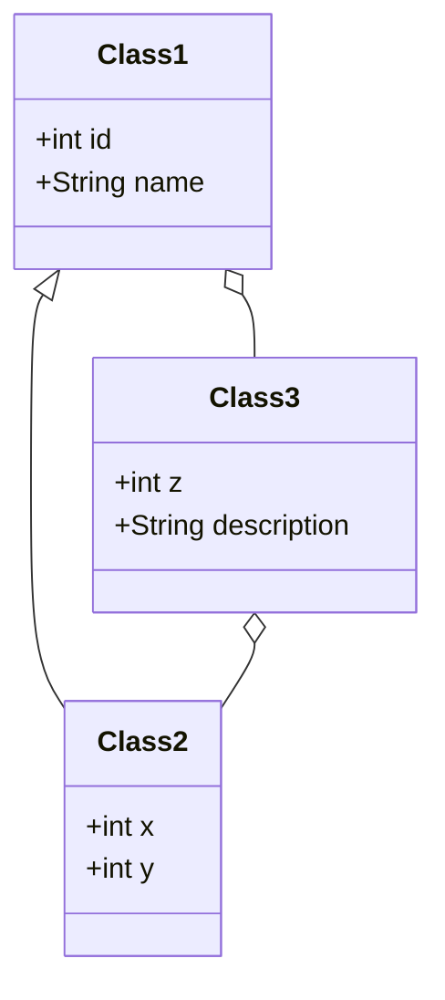
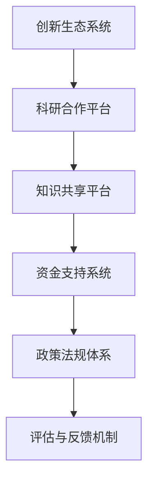
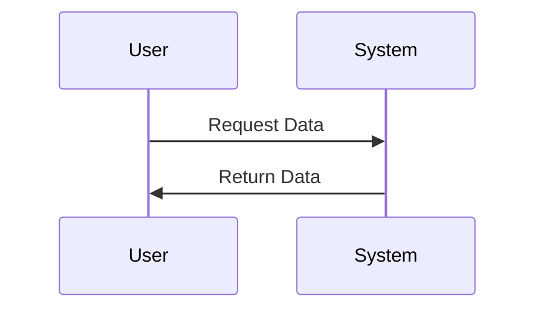
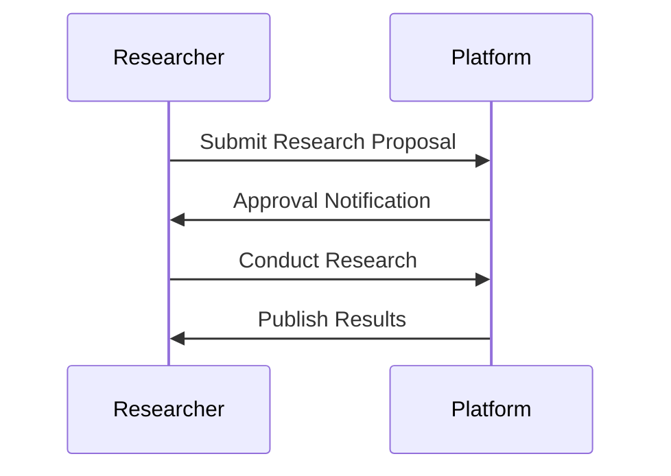
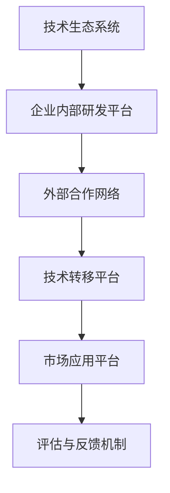
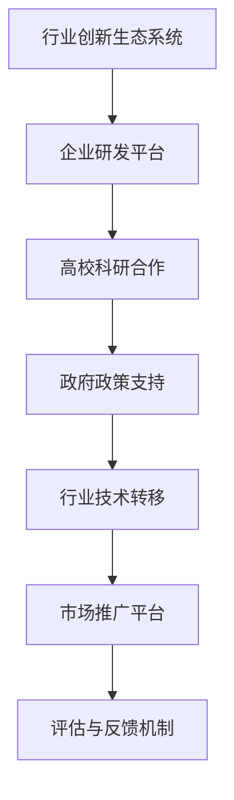
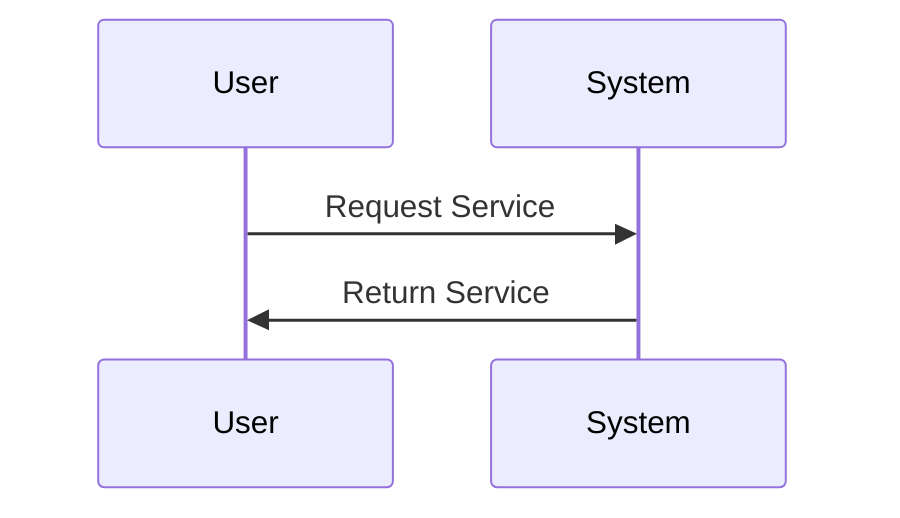
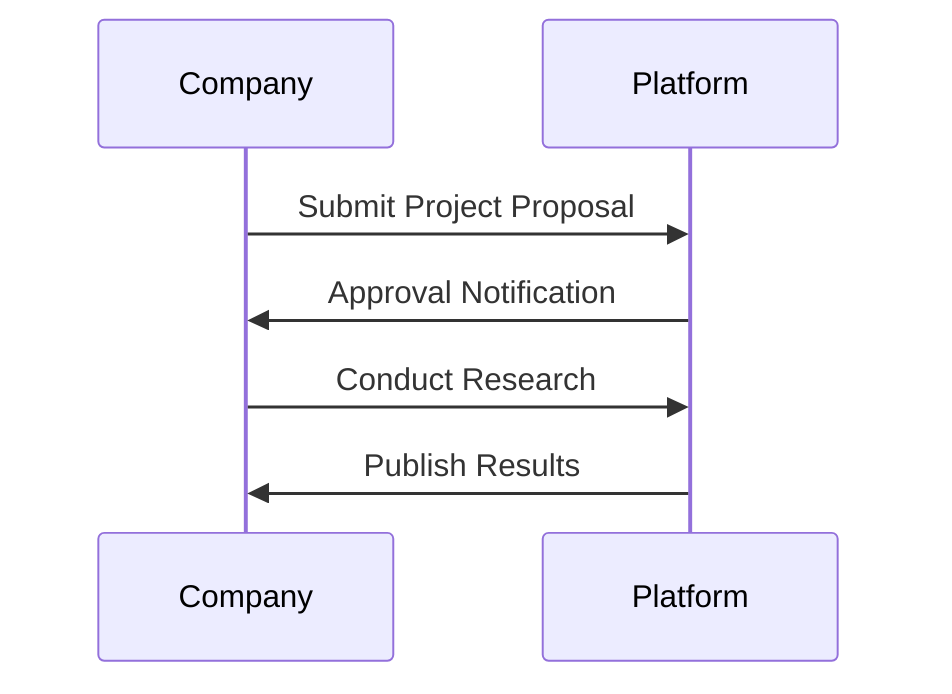

                 

### 第1章：世界可理解性与科学研究的挑战

#### 1.1 问题背景

世界可理解性（World Understandability）是指人类对于自然界和社会现象的认知程度。这个概念源自哲学领域，强调人类能否通过科学方法和理性思考来揭示世界的本质。在科学研究中，可理解性意味着科学理论能够被人类理解和应用。然而，随着科学领域的不断扩展和深入，许多复杂的现象变得越来越难以理解。

**关键概念术语说明：**

- **世界可理解性**：指人类对于自然界和社会现象的理解程度。
- **科学理论**：描述自然界和社会现象的假设和解释。
- **复杂性**：指系统的组成部分多且相互关系复杂。

**问题背景：**

现代科学研究面临着前所未有的挑战。一方面，科学技术的飞速发展使得我们能够探索更广泛的领域，如量子力学、宇宙学等；另一方面，这些领域的复杂性也使得传统的科学方法难以奏效。例如，量子力学中的许多概念，如“量子叠加态”和“量子纠缠”，对于普通大众而言难以理解。

**问题描述：**

科学研究中的不可预测性和复杂性导致了以下几个问题：

1. **科研难度增加**：复杂现象的研究需要更多的时间和资源。
2. **知识传播受限**：难以理解的科学理论限制了科学知识的普及。
3. **科研资源浪费**：在难以理解的领域中，科研人员可能投入大量资源却无法取得实质性进展。

**问题解决：**

为了解决这些问题，科学研究需要转向创新性的生态系统，这个生态系统能够促进跨学科合作、知识共享和资源的优化配置。创新生态系统不仅包括科学研究机构，还涵盖政府、企业、非营利组织等多个利益相关者。

**边界与外延：**

世界可理解性的边界在于我们当前的技术水平、认知能力以及科学理论的局限性。外延则包括随着科学技术的进步，人类对于世界的理解不断扩展。

#### 1.2 科学研究中的现状与困境

**现状：**

现代科学研究呈现出以下几个特点：

1. **高度专业化**：科研人员专注于特定的领域，导致跨学科交流不足。
2. **资源分散**：科研资源分布在各个机构和项目，缺乏整合。
3. **科研评价体系单一**：以发表论文数量和影响因子为主要评价标准，导致科研追求短期成果而忽视长期价值。

**困境：**

科学研究面临的困境主要包括：

1. **科研资金不足**：科研项目的资金来源有限，难以满足大规模复杂研究的需要。
2. **科研人员压力大**：科研人员面临巨大的工作压力，影响创新能力的发挥。
3. **科研评价体系不完善**：单一的科研评价体系不能全面反映科研人员的贡献。

#### 1.3 创新生态系统的必要性

**创新生态系统的概念：**

创新生态系统是指由多个利益相关者共同构成的复杂网络，旨在推动科学研究和技术的创新与发展。这个生态系统包括科研机构、企业、政府、非营利组织等，它们通过合作和协同创新，实现资源的共享和优化。

**创新生态系统的优势：**

1. **促进跨学科合作**：创新生态系统鼓励不同学科之间的交流与合作，有助于解决复杂问题。
2. **资源整合**：通过整合政府、企业等资源，可以提供更充足的科研资金和支持。
3. **知识共享**：创新生态系统中的知识共享机制可以加速科学技术的传播和应用。

**构建创新生态系统的必要性：**

1. **应对科学研究中的复杂性**：创新生态系统能够整合各方资源，共同应对科学研究的复杂性。
2. **提升科研效率**：通过协同创新，可以优化科研流程，提升科研效率。
3. **推动科技进步**：创新生态系统有助于促进科学技术的创新与应用，推动社会进步。

### 第2章：核心概念与理论框架

#### 2.1 世界可理解性的定义

**定义：**

世界可理解性是指人类通过科学方法和理性思考来揭示自然界和社会现象的本质的能力。它强调人类认知与客观世界的对应关系。

**内涵：**

- **科学方法**：指基于观察、实验和理论推理的方法。
- **理性思考**：指基于逻辑和证据的思考过程。
- **认知与客观世界的对应关系**：指人类认知能够反映客观世界的真实状态。

**测量方法：**

世界可理解性的测量方法主要包括：

1. **理论评估法**：通过评估科学理论的可理解性和适用性来衡量。
2. **实证研究法**：通过问卷调查、实验等方法来评估人类对科学现象的理解程度。
3. **指标体系法**：建立一套包含可理解性相关指标的体系，综合评估世界可理解性。

#### 2.2 科学研究的本质与目标

**本质：**

科学研究的本质是探索未知、揭示规律、解释现象和提出假设。它通过科学方法来验证或推翻现有的理论，不断推进人类对世界的认识。

**目标：**

科学研究的核心目标包括：

1. **理解自然规律**：揭示自然界的基本规律和机制。
2. **解决实际问题**：利用科学知识解决社会和生活中的问题。
3. **推动科技进步**：通过科学研究推动技术的创新和应用。

#### 2.3 创新生态系统的概念与结构

**概念：**

创新生态系统是指由多个利益相关者（如科研机构、企业、政府、非营利组织等）共同构成的复杂网络，旨在推动科学研究和技术的创新与发展。

**结构：**

创新生态系统的结构主要包括以下几个部分：

1. **知识共享平台**：促进信息交流和知识共享。
2. **科研合作网络**：鼓励跨学科和跨机构的合作。
3. **资金支持系统**：提供充足的科研资金和资源。
4. **政策法规体系**：为创新提供良好的政策和法律环境。
5. **评估与反馈机制**：对创新过程进行评估和反馈，优化创新生态系统。

### 第3章：概念属性特征对比

#### 3.1 可理解性与不可理解性

**对比：**

可理解性与不可理解性是两种相对的概念。可理解性强调人类能够通过科学方法和理性思考来理解现象，而不可理解性则指现象过于复杂，人类难以理解。

**属性特征：**

1. **可理解性**：
   - **特征**：现象相对简单，逻辑清晰，可通过科学方法解释。
   - **程度**：可以从低到高，如基础科学理论的可理解性通常较高。
2. **不可理解性**：
   - **特征**：现象复杂，逻辑不清晰，难以通过现有科学方法解释。
   - **程度**：可以从低到高，如量子力学中的某些概念可理解性较低。

**关系：**

可理解性与不可理解性是动态变化的。随着科学技术的进步，原本不可理解的现象可能会变得可理解，反之亦然。

#### 3.2 传统科研模式与创新生态系统的比较

**传统科研模式：**

传统科研模式以单个研究者或研究小组为核心，侧重于独立研究和发表论文。其特点包括：

1. **独立性**：研究者独立进行科学研究，较少与其他机构合作。
2. **竞争性**：科研资源有限，研究者之间存在竞争。
3. **封闭性**：研究成果往往仅限于学术界内部传播。

**创新生态系统：**

创新生态系统强调多方合作和资源整合，其特点包括：

1. **合作性**：鼓励跨学科、跨机构的合作，共同解决复杂问题。
2. **开放性**：研究成果公开透明，促进知识共享。
3. **系统性**：通过政策法规、资金支持等机制，为创新提供全方位的支持。

**比较：**

1. **研究方式**：传统科研模式以个体研究为主，创新生态系统强调团队合作。
2. **资源利用**：传统科研模式资源分散，创新生态系统实现资源优化配置。
3. **知识传播**：传统科研模式知识传播有限，创新生态系统促进知识共享。

#### 3.3 创新生态系统中的关键要素

**关键要素：**

创新生态系统中的关键要素包括：

1. **人才**：创新的核心驱动力，包括科研人员、工程师和技术专家。
2. **知识**：创新的基石，包括科学理论、技术专利和专业知识。
3. **资金**：创新的保障，包括政府资金、企业投资和社会捐赠。
4. **政策**：创新的推动力，包括政策法规、税收优惠和知识产权保护。
5. **合作**：创新的协同效应，包括跨学科、跨机构的合作网络。

**要素关系：**

关键要素相互依赖、相互促进。例如，人才需要知识作为支持，知识需要资金进行转化，资金需要政策保障，政策需要合作实现效果。

### 第4章：概念联系与扩展

#### 4.1 可理解性在科学研究中的应用

**应用领域：**

可理解性在科学研究中的应用广泛，如：

1. **基础科学研究**：提高科学理论的解释性和应用性。
2. **工程技术研究**：设计更易于理解和操作的技术系统。
3. **医学研究**：提高医疗技术和治疗方案的可理解性。

**具体应用：**

1. **简化科学模型**：通过简化复杂模型，提高其可理解性。
2. **科普宣传**：通过科普活动，提高公众对科学现象的理解。
3. **教学设计**：改进教学方法，提高学生的学习效果。

#### 4.2 创新生态系统与科技进步

**关系：**

创新生态系统是科技进步的重要推动力。通过整合资源、促进合作，创新生态系统可以加速科学技术的创新与应用。

**作用：**

1. **推动技术进步**：创新生态系统为技术发展提供充足的资源和支持。
2. **加速知识传播**：创新生态系统促进科学技术的传播和应用。
3. **提升创新能力**：创新生态系统中的合作与竞争机制，激发科研人员的创新活力。

#### 4.3 可理解性与社会影响

**影响：**

可理解性对社会有着深远的影响，如：

1. **科技普及**：提高公众的科学素养，促进科技创新的社会化。
2. **政策制定**：基于科学证据的政策制定，提高决策的科学性。
3. **经济发展**：科技创新推动经济发展，提高国家竞争力。

**具体表现：**

1. **科技教育与培训**：通过教育提高公众对科学技术的理解。
2. **科技政策**：制定科学合理的科技政策，推动科技创新。
3. **企业创新**：企业通过科技创新提高市场竞争力。

### 第5章：边界与外延

#### 5.1 世界可理解性的边界探讨

**边界探讨：**

世界可理解性的边界涉及以下几个层面：

1. **认知能力**：人类的认知能力有限，难以理解过于复杂的自然现象。
2. **科学方法**：科学方法的局限性，某些现象可能无法通过现有方法解释。
3. **技术发展**：技术的进步推动人类认知的边界扩展。

**结论：**

世界可理解性的边界是动态变化的，随着认知能力、科学方法和技术的不断进步，人类对世界的理解将不断扩展。

#### 5.2 科学研究的边界拓展

**边界拓展：**

科学研究通过以下方式拓展其边界：

1. **跨学科研究**：通过整合不同学科的知识，拓展研究范围。
2. **新技术应用**：利用新兴技术，如人工智能、大数据等，提升研究能力。
3. **国际合作**：通过国际合作，共享资源和知识，拓展研究视野。

**展望：**

未来科学研究将继续向更加复杂和前沿的领域拓展，推动人类对世界的认知不断深化。

#### 5.3 创新生态系统的未来发展趋势

**发展趋势：**

创新生态系统的未来发展趋势包括：

1. **数字化转型**：利用数字技术提升创新效率和效果。
2. **全球化合作**：加强国际间的科研合作，推动全球创新。
3. **可持续发展**：在创新过程中注重可持续性，减少环境影响。

**展望：**

创新生态系统将不断进化，成为推动科技进步和社会发展的重要力量。

## 第二部分：科学研究的创新生态系统构建

### 第6章：构建创新生态系统的原则与方法

#### 6.1 创新生态系统的构建原则

**原则：**

1. **合作共享**：鼓励多方合作，实现资源共享。
2. **开放透明**：保障信息的公开透明，促进知识共享。
3. **激励机制**：建立有效的激励机制，鼓励创新行为。
4. **风险管理**：建立风险管理体系，降低创新风险。
5. **可持续发展**：注重生态系统的长期可持续发展。

**解释：**

- **合作共享**：创新生态系统强调各方合作，通过共享资源、知识和技术，提升整体创新能力。
- **开放透明**：公开透明有助于信息共享，促进科学研究的合作和进步。
- **激励机制**：有效的激励机制可以激发科研人员的创新动力，推动创新生态系统的良性发展。
- **风险管理**：创新过程中不可避免地会面临风险，建立完善的风险管理体系有助于降低风险。
- **可持续发展**：创新生态系统的构建应考虑长远发展，确保其持续、稳定地推动科技进步。

#### 6.2 创新生态系统的构建方法

**方法：**

1. **政策引导**：通过制定政策法规，为创新生态系统提供制度保障。
2. **资金支持**：提供充足的科研资金和资源，保障创新生态系统的运行。
3. **平台建设**：建设创新平台，促进科研资源的整合和共享。
4. **人才培养**：培养高素质的创新人才，为创新生态系统提供人力支持。
5. **国际合作**：加强国际合作，引进先进技术和理念，提升创新能力。

**解释：**

- **政策引导**：政策是创新生态系统建设的重要保障，通过制定相关政策和法规，可以规范创新行为，提供政策支持。
- **资金支持**：资金是创新生态系统的关键资源，政府和企业应提供充足的资金支持，保障科研项目的顺利实施。
- **平台建设**：创新平台是创新生态系统的重要组成部分，通过建设各类创新平台，可以实现科研资源的整合和共享。
- **人才培养**：人才是创新的根本驱动力，通过培养和引进高素质的创新人才，可以为创新生态系统提供强大的智力支持。
- **国际合作**：国际合作可以引进先进技术和理念，促进全球科技创新的交流与合作，提升整体的创新能力。

#### 6.3 创新生态系统的实施步骤

**步骤：**

1. **需求分析**：明确创新生态系统的目标和需求，为后续建设提供指导。
2. **规划方案**：制定详细的创新生态系统建设方案，包括政策、资金、平台、人才等各个方面。
3. **平台搭建**：建设各类创新平台，如科研平台、技术转移平台、创业孵化平台等。
4. **资源整合**：整合各类科研资源，包括资金、设备、数据等，实现资源共享。
5. **人才引进**：通过多种方式引进和培养创新人才，为创新生态系统提供人力支持。
6. **政策落实**：落实相关政策法规，为创新生态系统提供制度保障。
7. **监测与评估**：对创新生态系统进行持续监测和评估，优化生态系统建设。

**解释：**

- **需求分析**：在建设创新生态系统之前，需要明确其目标和需求，为后续的建设提供指导。
- **规划方案**：制定详细的创新生态系统建设方案，确保各方面协调一致，有序推进。
- **平台搭建**：创新平台是创新生态系统的重要支撑，通过搭建各类平台，可以提升创新生态系统的整体效能。
- **资源整合**：通过整合各类资源，实现资源的最大化利用，提高创新生态系统的运行效率。
- **人才引进**：人才是创新的核心驱动力，通过多种方式引进和培养创新人才，可以为创新生态系统提供强大的人力支持。
- **政策落实**：政策是创新生态系统建设的重要保障，通过落实相关政策法规，可以为创新生态系统提供良好的发展环境。
- **监测与评估**：对创新生态系统进行持续监测和评估，可以及时发现和解决问题，优化生态系统建设。

## 第7章：创新生态系统的关键要素

### 7.1 人才与知识

**重要性：**

人才与知识是创新生态系统的核心要素，对于创新生态系统的建设和发展至关重要。

**人才：**

- **定义**：人才是指具备创新能力和专业知识，能够在科研和技术领域做出突出贡献的个人。
- **类型**：包括科研人员、工程师、技术人员、企业家等。
- **作用**：人才是创新的主要驱动力，通过他们的创新思维和专业知识，可以推动科学研究和技术进步。

**知识：**

- **定义**：知识是指经过验证的真知，包括科学理论、技术专利、实践经验等。
- **类型**：包括科学知识、技术知识、管理知识等。
- **作用**：知识是创新的基础，通过知识的积累和传播，可以提升创新生态系统的整体创新能力。

**关系：**

人才与知识相互依赖、相互促进。人才通过掌握知识，提升创新能力；而知识的积累和传播，则为人才提供了更多的创新机会。

### 7.2 资源与资金

**重要性：**

资源与资金是创新生态系统的重要保障，对于创新生态系统的建设和运行至关重要。

**资源：**

- **定义**：资源是指用于创新活动的一切物质和非物质要素，包括资金、设备、数据、技术等。
- **类型**：包括资金资源、设备资源、人力资源、技术资源等。
- **作用**：资源是创新活动的基础，通过资源的整合和优化，可以提高创新生态系统的运行效率。

**资金：**

- **定义**：资金是指用于创新活动的货币资源，包括政府资金、企业投资、社会捐赠等。
- **类型**：包括政府资金、企业资金、个人资金等。
- **作用**：资金是创新活动的重要保障，通过资金的投入，可以支持创新项目的实施和科研成果的转化。

**关系：**

资源与资金相互依赖、相互促进。资金可以购买和整合资源，而资源的有效利用又可以吸引更多的资金投入。

### 7.3 合作与协同创新

**重要性：**

合作与协同创新是创新生态系统的重要特征，对于提升创新生态系统的整体创新能力至关重要。

**合作：**

- **定义**：合作是指不同个体或组织之间的协作与互助。
- **类型**：包括内部合作、跨机构合作、国际合作等。
- **作用**：合作可以整合各方资源，提升创新效率，减少竞争压力。

**协同创新：**

- **定义**：协同创新是指通过合作，实现不同个体或组织之间的知识共享和协同工作。
- **类型**：包括技术协同创新、管理协同创新、文化协同创新等。
- **作用**：协同创新可以提升创新效果，促进知识的传播和应用，推动科学技术的进步。

**关系：**

合作与协同创新相互促进、相互依赖。合作是实现协同创新的基础，而协同创新可以进一步深化合作，提升整体创新能力。

## 第8章：创新生态系统的管理与维护

### 8.1 创新生态系统的管理机制

**管理机制的重要性：**

创新生态系统的管理机制是确保创新活动顺利进行、资源有效利用和创新能力持续提升的关键。

**机制构成：**

1. **目标管理**：明确创新生态系统的发展目标，制定具体的实施计划。
2. **资源配置**：合理配置资源，确保各类资源得到最大化利用。
3. **绩效评估**：建立绩效评估体系，对创新活动进行定期评估，优化创新过程。
4. **风险控制**：建立风险控制机制，预防和应对创新过程中的风险。

**实施方法：**

1. **目标管理**：通过制定明确的目标和实施计划，确保创新活动有方向、有步骤地推进。
2. **资源配置**：通过科学的资源配置方法，如优化预算分配、资源调配等，确保资源高效利用。
3. **绩效评估**：通过建立绩效评估体系，定期对创新活动进行评估，发现问题并及时调整。
4. **风险控制**：通过风险识别、风险评估和风险应对措施，降低创新过程中的风险。

### 8.2 创新生态系统的风险与挑战

**风险类型：**

1. **技术风险**：创新过程中可能面临技术难题，如关键技术突破失败、技术方案不可行等。
2. **市场风险**：创新产品或服务可能面临市场不接受、竞争激烈等问题。
3. **法律风险**：涉及知识产权、合同履行等方面的法律问题。
4. **资金风险**：资金不足或资金使用不当可能导致创新活动无法继续。

**挑战：**

1. **创新能力不足**：创新生态系统中的部分机构或个人可能缺乏创新能力，难以推动创新活动。
2. **资源分配不均**：资源分配不均可能导致部分机构或个人创新能力受到限制。
3. **合作障碍**：跨机构、跨学科的合作可能面临沟通不畅、利益冲突等问题。

### 8.3 创新生态系统的可持续性

**可持续性意义：**

创新生态系统的可持续性是指其长期稳定发展，确保创新活动能够持续进行，为科技进步和社会发展提供持续动力。

**保障措施：**

1. **政策支持**：通过制定和实施相关政策，为创新生态系统提供制度保障。
2. **资金保障**：确保充足的资金投入，为创新活动提供资金支持。
3. **人才培养**：通过人才培养和引进，提升创新生态系统的整体创新能力。
4. **国际合作**：加强国际合作，引进先进技术和理念，提升创新能力。
5. **文化营造**：营造创新文化，鼓励创新思维，激发创新活力。

**可持续性评估：**

通过建立可持续性评估体系，定期对创新生态系统的运行状况进行评估，包括创新能力、资源利用、合作水平等方面，确保创新生态系统能够持续、稳定地发展。

### 第9章：案例分析

#### 9.1 案例一：科学领域的创新生态系统

**背景介绍：**

**科学领域创新生态系统**是指以科学研究和科技创新为核心，通过构建合作、共享、开放的科研环境，推动科学技术的创新与发展。该案例以某国的国家重点实验室为背景，展示了创新生态系统的构建与运作。

**项目介绍：**

- **项目目标**：提高科学研究的创新能力，推动关键技术的突破。
- **项目内容**：建立跨学科、跨机构的合作平台，整合国内外优质科研资源，开展高水平研究项目。

**系统功能设计（领域模型类图）:**

**系统架构设计（架构图）:**

**系统接口设计（接口设计）:**

**系统交互（序列图）:**

#### 案例分析

**优势：**

1. **跨学科合作**：通过构建跨学科合作平台，促进了不同学科之间的交流和合作，提高了科学研究的整体水平。
2. **知识共享**：知识共享平台实现了科研数据的开放和共享，为科研人员提供了丰富的资源，提高了科研效率。
3. **资金支持**：政府和企业提供了充足的资金支持，为科研项目提供了有力保障。
4. **政策法规**：完善的政策法规体系为创新生态系统提供了良好的制度环境。

**挑战：**

1. **资源整合**：尽管建立了合作平台，但资源整合效果仍有待提升，部分资源未能得到充分利用。
2. **合作障碍**：跨机构、跨学科的合作可能面临沟通不畅、利益冲突等问题。
3. **创新能力**：部分科研机构和人员的创新能力有待提高，影响创新生态系统的整体水平。

#### 项目小结

**科学领域的创新生态系统**通过构建合作、共享、开放的科研环境，促进了科学技术的创新与发展。尽管面临一定挑战，但其优势明显，为其他领域的创新生态系统建设提供了有益借鉴。

## 案例二：技术领域的创新生态系统

**背景介绍：**

**技术领域的创新生态系统**是指围绕技术研究和应用，构建一个合作、共享、开放的科研和应用环境，以推动技术的创新与发展。本案例以某高科技企业的技术创新生态系统为例，展示其构建与应用。

**项目介绍：**

- **项目目标**：提升企业技术创新能力，加快技术成果的转化与应用。
- **项目内容**：建立企业内部的技术研发平台，与外部科研机构、高校合作，构建开放的创新网络。

**系统功能设计（领域模型类图）:**

**系统架构设计（架构图）:**

**系统接口设计（接口设计）:**

**系统交互（序列图）:**

#### 案例分析

**优势：**

1. **内部研发平台**：企业内部研发平台为企业提供了强大的技术支持，加快了技术成果的转化。
2. **外部合作网络**：与外部科研机构、高校的合作，为企业引入了先进的科研资源和人才。
3. **技术转移平台**：技术转移平台帮助企业将技术成果迅速应用于实际生产，提高了市场竞争力。
4. **市场应用平台**：市场应用平台为企业提供了广阔的市场渠道，促进了技术的市场化。

**挑战：**

1. **资源整合**：尽管建立了合作网络，但资源整合效果仍有待提升，部分资源未能得到充分利用。
2. **合作深度**：外部合作网络的深度和广度仍有待加强，合作内容需进一步丰富。
3. **创新能力**：部分研发人员的创新能力有待提高，影响整体技术创新水平。

#### 项目小结

**技术领域的创新生态系统**通过构建合作、共享、开放的科研和应用环境，提升了企业的技术创新能力，加快了技术成果的转化与应用。尽管面临一定挑战，但其优势明显，为其他技术领域提供了有益借鉴。

### 案例三：行业领域的创新生态系统

**背景介绍：**

**行业领域的创新生态系统**是指围绕特定行业，构建一个合作、共享、开放的科研和应用环境，以推动行业的创新与发展。本案例以某制造业领域的创新生态系统为例，展示其构建与应用。

**项目介绍：**

- **项目目标**：提升行业整体创新能力，推动产业结构优化升级。
- **项目内容**：建立行业内的创新平台，促进企业、高校、科研机构之间的合作，推动技术创新与产业应用。

**系统功能设计（领域模型类图）:**

**系统架构设计（架构图）:**

**系统接口设计（接口设计）:**

**系统交互（序列图）:**

#### 案例分析

**优势：**

1. **企业研发平台**：企业研发平台为企业提供了强大的技术支持，促进了技术创新。
2. **高校科研合作**：与高校的合作，为企业引入了先进的科研资源和人才。
3. **政府政策支持**：政府的政策支持为创新生态系统提供了良好的发展环境。
4. **行业技术转移**：技术转移平台促进了技术成果的产业化应用，提升了行业整体技术水平。
5. **市场推广平台**：市场推广平台为企业提供了广阔的市场渠道，提高了产品的市场竞争力。

**挑战：**

1. **合作深度**：企业、高校、科研机构之间的合作深度和广度仍有待加强。
2. **资源整合**：创新生态系统中资源的整合效果仍有待提升。
3. **创新能力**：部分企业和机构的创新能力有待提高，影响整体行业创新能力。

#### 项目小结

**行业领域的创新生态系统**通过构建合作、共享、开放的科研和应用环境，提升了行业整体创新能力，推动了产业结构优化升级。尽管面临一定挑战，但其优势明显，为其他行业提供了有益借鉴。

## 第10章：创新生态系统的应用领域

### 10.1 生物科学与医疗

**应用领域：**

创新生态系统在生物科学与医疗领域的应用主要体现在以下几个方面：

1. **基因编辑技术**：创新生态系统为基因编辑技术的研究提供了强大的支持，如CRISPR-Cas9技术的突破性发展。
2. **精准医疗**：通过大数据和人工智能技术，创新生态系统推动了精准医疗的发展，为个性化治疗方案提供了支持。
3. **生物药物研发**：创新生态系统促进了生物药物的研发，如抗癌药物的研发和临床试验。

**具体应用：**

1. **基因编辑技术在癌症治疗中的应用**：基因编辑技术被用于修复癌症患者的基因缺陷，提高治疗效果。
2. **精准医疗在个性化诊断中的应用**：通过大数据分析，为患者提供个性化的诊断和治疗方案。
3. **生物药物研发中的合作与创新**：企业、高校和科研机构之间的合作，加速了生物药物的研发进程。

### 10.2 环境科学与可持续性

**应用领域：**

创新生态系统在环境科学与可持续性领域的应用主要体现在以下几个方面：

1. **可再生能源技术**：创新生态系统促进了可再生能源技术的研究和应用，如太阳能、风能等。
2. **污染控制技术**：创新生态系统推动了污染控制技术的发展，如废水处理、废气治理等。
3. **生态修复技术**：创新生态系统支持了生态修复技术的研究和应用，如沙漠绿化、湿地恢复等。

**具体应用：**

1. **可再生能源技术在能源结构调整中的应用**：通过技术创新，推动了能源结构的优化，减少了对传统能源的依赖。
2. **污染控制技术在环境保护中的应用**：通过污染控制技术的应用，提高了环境质量，保障了人类的健康。
3. **生态修复技术在生态系统修复中的应用**：通过生态修复技术的实施，恢复了受损的生态系统，提高了生态系统的稳定性。

### 10.3 经济与社会科学

**应用领域：**

创新生态系统在经济与社会科学领域的应用主要体现在以下几个方面：

1. **数字经济**：创新生态系统推动了数字经济的发展，如电子商务、共享经济等。
2. **社会服务**：创新生态系统支持了社会服务的发展，如智慧城市建设、在线教育等。
3. **社会治理**：创新生态系统促进了社会治理的创新，如大数据分析在公共安全管理中的应用。

**具体应用：**

1. **数字经济在商业模式创新中的应用**：创新生态系统促进了数字经济的发展，推动了传统商业模式的转型。
2. **社会服务在公共管理中的应用**：通过创新服务模式，提高了公共服务水平，增强了民众的满意度。
3. **社会治理在公共安全中的应用**：通过大数据分析和人工智能技术，提升了公共安全管理的能力，保障了社会的稳定。

## 第11章：创新生态系统的影响评估

### 11.1 影响评估的方法与指标

**影响评估方法：**

1. **定量评估**：通过统计数据、经济指标等，定量评估创新生态系统对经济社会发展的影响。
2. **定性评估**：通过专家访谈、案例研究等，定性分析创新生态系统的实际效果和问题。

**指标体系：**

1. **创新产出**：包括专利数量、学术论文发表量、技术成果转化率等。
2. **经济效益**：包括GDP增长率、就业人数、企业利润等。
3. **社会效益**：包括教育水平提高、公共服务质量提升、社会稳定性增强等。
4. **环境效益**：包括碳排放量减少、资源利用率提高、生态系统恢复等。

### 11.2 创新生态系统对社会的影响

**积极影响：**

1. **经济发展**：创新生态系统促进了新技术和新产业的发展，推动了经济的持续增长。
2. **社会进步**：创新生态系统提升了社会的科技水平，改善了民众的生活质量。
3. **环境保护**：创新生态系统推动了绿色技术的发展，提高了资源利用效率，保护了生态环境。

**负面影响：**

1. **资源紧张**：创新生态系统的发展可能导致资源过度消耗，加剧资源紧张。
2. **社会不公**：创新生态系统的快速发展可能加剧社会不平等，导致资源分配不均。
3. **环境风险**：新技术和新产业的发展可能带来环境风险，如污染、生态破坏等。

### 11.3 创新生态系统对科研创新的影响

**积极影响：**

1. **科研效率提升**：创新生态系统促进了科研资源的整合和共享，提高了科研效率。
2. **创新成果转化**：创新生态系统推动了科研创新成果的转化和应用，提升了科研成果的经济价值。
3. **跨学科合作**：创新生态系统鼓励跨学科合作，促进了科学领域的综合发展。

**负面影响：**

1. **科研竞争加剧**：创新生态系统中竞争压力增加，可能导致科研人员过度竞争，影响创新能力。
2. **科研伦理问题**：创新生态系统中的快速发展和竞争可能引发科研伦理问题，如数据造假、抄袭等。
3. **科研资金分配不均**：创新生态系统中科研资金的分配可能存在不均衡，影响部分科研机构的创新能力。

## 第12章：未来展望与挑战

### 12.1 创新生态系统的未来趋势

**趋势：**

1. **数字化转型**：随着数字技术的快速发展，创新生态系统将越来越依赖于数字化工具和平台。
2. **全球化合作**：全球化趋势将推动创新生态系统的国际间合作，促进全球科技协同创新。
3. **可持续发展**：创新生态系统将更加注重可持续发展，推动绿色技术和环保产业的发展。

### 12.2 创新生态系统的挑战与应对

**挑战：**

1. **资源分配不均**：创新生态系统中的资源分配可能存在不均衡，影响部分机构的创新能力。
2. **跨学科合作难度大**：跨学科合作需要协调不同领域的知识和技术，难度较大。
3. **知识产权保护**：创新生态系统中的知识产权保护问题亟待解决，防止技术创新成果被侵权。

**应对策略：**

1. **优化资源分配**：通过政策引导和市场机制，优化创新生态系统中资源的分配。
2. **加强跨学科合作**：建立跨学科合作平台，促进不同领域之间的交流与合作。
3. **完善知识产权保护**：加强知识产权法律法规的建设，提高知识产权保护力度。

### 12.3 创新生态系统的国际比较与发展战略

**国际比较：**

1. **美国**：美国拥有全球领先的创新生态系统，以硅谷为代表，具有强大的科技实力和创业氛围。
2. **欧洲**：欧洲的创新生态系统以欧盟为核心，注重科技创新与可持续发展的结合。
3. **中国**：中国的创新生态系统近年来发展迅速，政府和企业共同推动科技创新，取得了显著成效。

**发展战略：**

1. **加强科技创新**：提高科技创新能力，推动核心技术的自主研发。
2. **优化政策环境**：完善科技创新政策，提供良好的创新环境。
3. **推动国际合作**：积极参与全球创新网络，加强国际间的科技合作。

## 总结与展望

### 13.1 本书核心观点的总结

本文从世界可理解性、科学研究挑战、创新生态系统构建、关键要素、管理维护、应用领域等方面，系统地探讨了创新生态系统在推动科学研究和技术进步中的重要性。核心观点包括：

1. **世界可理解性**：人类认知与客观世界的对应关系，影响科学研究的深入程度。
2. **科学研究挑战**：复杂性、高度专业化等现状与困境，促使创新生态系统的出现。
3. **创新生态系统**：通过合作、共享、开放的方式，提升科研效率和创新能力。
4. **关键要素**：人才、知识、资源、合作等，是创新生态系统的重要组成部分。
5. **管理维护**：通过有效的管理机制和风险控制，确保创新生态系统的可持续性。
6. **应用领域**：创新生态系统在生物科学、环境科学、经济与社会等领域的广泛应用。

### 13.2 创新生态系统的理论与实践意义

**理论意义：**

1. **完善科技创新理论**：创新生态系统提供了新的科技创新模式，丰富了科技创新理论。
2. **跨学科研究理论**：创新生态系统强调跨学科合作，促进了跨学科研究理论的完善。
3. **可持续发展理论**：创新生态系统注重可持续发展，为可持续发展理论提供了实践案例。

**实践意义：**

1. **提升科技创新能力**：创新生态系统通过整合资源、促进合作，提升了科研机构的创新能力。
2. **推动技术进步**：创新生态系统促进了技术的创新与应用，推动了技术的快速进步。
3. **促进社会进步**：创新生态系统的发展，提高了社会的科技水平，改善了民众的生活质量。

### 13.3 对未来研究的展望

未来研究可以从以下几个方面展开：

1. **数字化转型**：深入探讨数字化转型对创新生态系统的影响，优化数字化工具和平台。
2. **全球合作**：加强国际间的创新合作，推动全球科技协同创新。
3. **知识产权保护**：完善知识产权保护机制，提高创新成果的保护力度。
4. **可持续发展**：研究创新生态系统在可持续发展中的应用，推动绿色技术和环保产业的发展。

### 13.4 拓展阅读与思考

**拓展阅读：**

1. **《创新生态系统：构建科技强国的新引擎》**：探讨创新生态系统的构建与运行机制。
2. **《科技创新与经济发展》**：分析科技创新对经济发展的影响。
3. **《绿色创新与可持续发展》**：研究创新生态系统在可持续发展中的作用。

**思考问题：**

1. **创新生态系统如何适应数字化转型？**
2. **全球化背景下，如何优化创新生态系统的国际合作？**
3. **如何保障创新生态系统的知识产权保护，促进创新成果的转化和应用？**
4. **创新生态系统如何推动绿色技术和环保产业的发展？**

### 作者信息

**作者：** AI天才研究院/AI Genius Institute & 禅与计算机程序设计艺术 /Zen And The Art of Computer Programming

本文由AI天才研究院（AI Genius Institute）和禅与计算机程序设计艺术（Zen And The Art of Computer Programming）联合撰写，旨在深入探讨创新生态系统在科学研究和技术进步中的重要性。作者拥有丰富的科研和技术实践经验，对科技创新有着深刻的理解和独到的见解。希望本文能为读者提供有价值的参考和启示。

