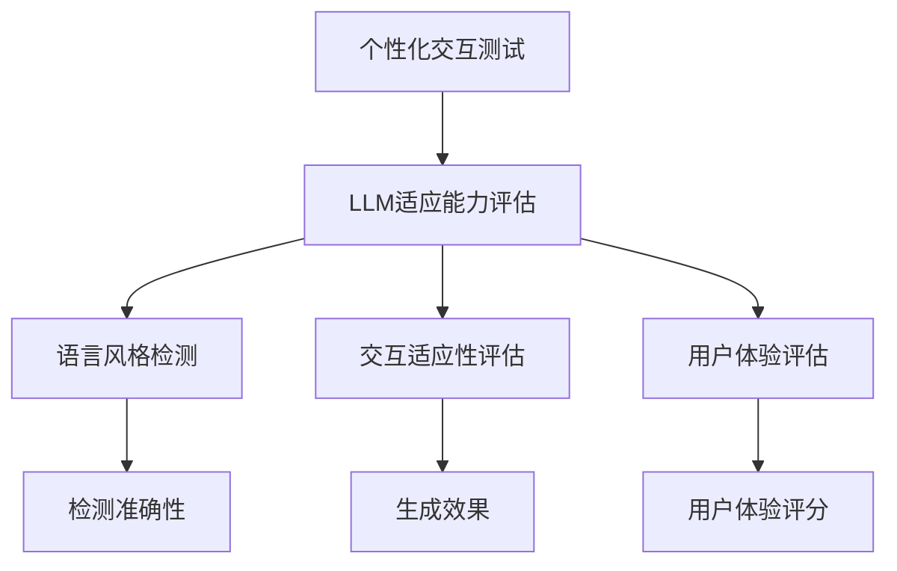
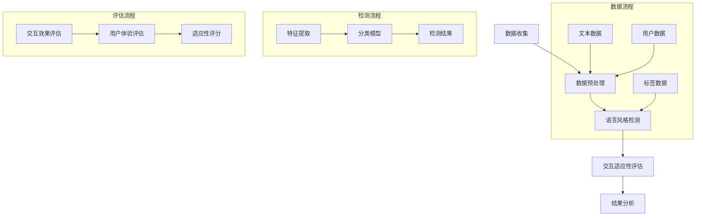
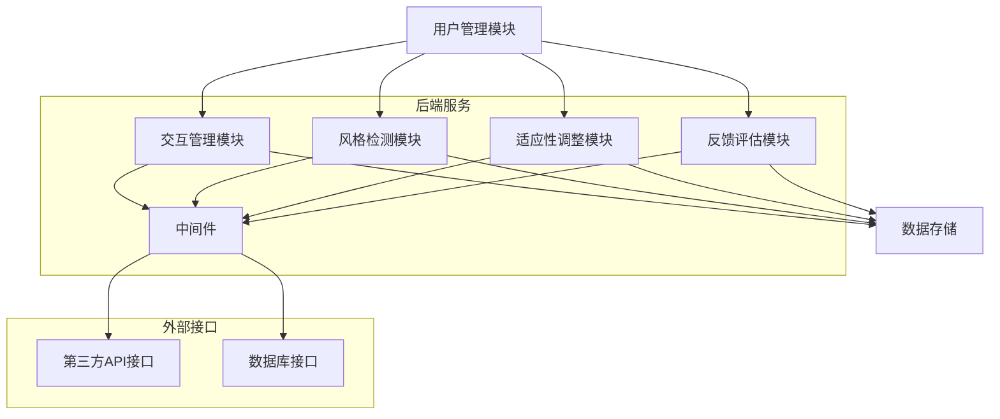
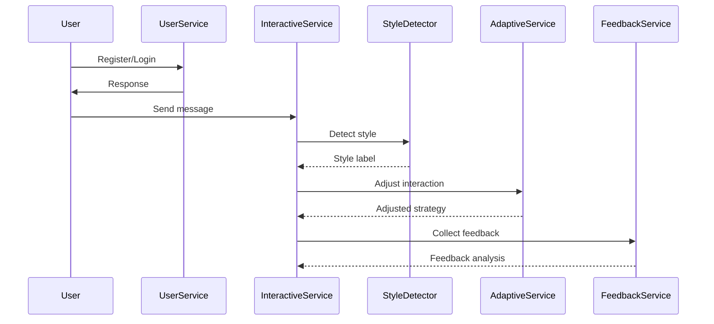
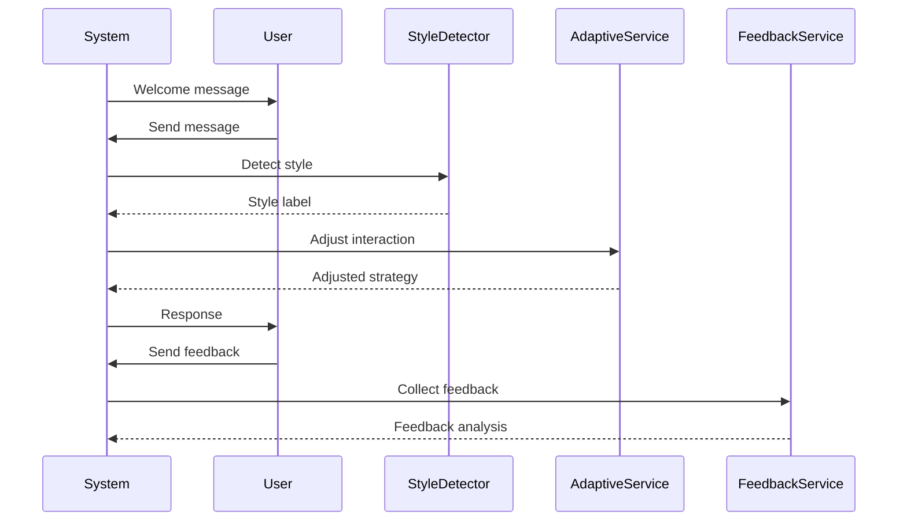

                 

### 1. 书名：《个性化交互测试：评价LLM适应不同用户风格的能力》

#### **目录大纲设计**

在本文中，我们将系统地探讨《个性化交互测试：评价LLM适应不同用户风格的能力》这一主题。通过详细的章节设计和内容规划，我们将帮助读者深入了解个性化交互、语言模型（LLM）以及评估LLM适应不同用户风格能力的各种方法。本文的目录大纲设计旨在清晰、系统地展现各部分内容，确保读者能够循序渐进地掌握相关知识。

**第一部分：背景介绍**

- **第1章：问题背景与核心概念**
  - 1.1.1 问题背景
    - 个性化交互的兴起
    - LLM的发展与应用
    - 适应不同用户风格的能力
  - 1.1.2 核心概念
    - 个性化交互测试
    - LLM适应能力的评估指标
    - 测试方法与工具
  - 1.1.3 边界与外延
    - 个性化交互测试的范围
    - LLM适应能力的限制
  - 1.1.4 概念结构与核心要素组成
    - 概念结构图
    - 核心要素组成

**第二部分：核心概念与联系**

- **第2章：核心概念原理**
  - 2.1.1 LLM的基本原理
    - 语言模型的基础
    - LLM的架构
    - LLM的优化方法
  - 2.1.2 个性化交互的特点
    - 交互个性化的重要性
    - 个性化交互的实现方法
    - 个性化交互的限制因素
  - 2.1.3 LLM适应能力的评估
    - 语言风格检测原理
    - 交互适应性评估方法
    - 评估指标体系

**第三部分：算法原理讲解**

- **第3章：算法原理详解**
  - 3.1.1 算法流程图
  - 3.1.2 Python源代码解析
    - 模型加载与初始化
    - 数据预处理
    - 语言风格检测算法
    - 交互适应性评估算法
  - 3.1.3 数学模型与公式
    - 语言模型数学模型
    - 评估指标数学公式
  - 3.1.4 举例说明
    - 实际案例
    - 通俗易懂的例子

**第四部分：系统分析与架构设计方案**

- **第4章：系统分析与设计**
  - 4.1.1 问题场景介绍
  - 4.1.2 系统功能设计
    - 领域模型
    - 系统功能模块划分
  - 4.1.3 系统架构设计
    - 系统架构
    - 系统模块交互
  - 4.1.4 系统接口设计
    - 接口规范
    - 接口交互流程
  - 4.1.5 系统交互设计
    - 交互流程
    - 交互说明

**第五部分：项目实战**

- **第5章：项目实战**
  - 5.1.1 环境安装
    - 环境搭建
    - 验证安装
  - 5.1.2 系统核心实现源代码
    - 代码应用解读与分析
    - 实际案例分析和详细讲解剖析
  - 5.1.3 项目小结
    - 最佳实践 tips
    - 小结
    - 注意事项
    - 拓展阅读

通过这一结构化的目录设计，读者可以系统地掌握个性化交互测试的基本原理、方法和技术，深入理解LLM适应不同用户风格的能力，并在实际项目中应用所学知识。接下来，我们将逐步深入每一章节，详细探讨每个主题。

## **第一部分：背景介绍**

### **第1章：问题背景与核心概念**

#### **1.1.1 问题背景**

##### **个性化交互的兴起**

随着人工智能和自然语言处理技术的飞速发展，个性化交互逐渐成为智能系统中的一个重要研究方向。个性化交互指的是系统根据用户的个性化需求和行为特征，提供定制化的服务和内容。这种交互方式不仅能够提高用户体验，还能显著提升系统的使用效率和满意度。

个性化交互的需求源于以下几个方面：

1. **用户体验的提升**：个性化交互可以根据用户的喜好、习惯和需求，提供更加贴心的服务，从而提高用户的使用体验。
2. **交互效率的提高**：个性化交互能够减少用户与系统之间的摩擦，使得交互过程更加流畅和高效。
3. **个性化服务的需求**：在信息爆炸的时代，用户希望系统能够根据自身的特点提供个性化的信息和服务。

##### **LLM的发展与应用**

语言模型（Language Model，简称LLM）是一种能够理解和生成自然语言的人工智能模型。LLM的发展可以追溯到自然语言处理领域的研究，特别是在近年来，随着深度学习和大数据技术的进步，LLM取得了显著的成果。LLM在个性化交互中具有广泛的应用，主要包括：

1. **文本生成**：LLM可以生成高质量的文章、回复和对话，用于自动问答、内容生成和智能客服等领域。
2. **情感分析**：LLM可以分析用户的情感状态，为个性化服务提供依据。
3. **对话系统**：LLM可以构建智能对话系统，实现人机交互的自动化。

##### **适应不同用户风格的能力**

用户风格的多样性是个性化交互中的一大挑战。不同用户在表达方式、语言习惯、偏好等方面存在显著差异。为了满足这种多样性，LLM需要具备适应不同用户风格的能力。具体来说，这包括：

1. **语言风格检测**：LLM需要能够识别和理解用户的语言风格，例如正式、非正式、幽默等。
2. **个性化生成**：LLM需要根据用户的语言风格，生成符合其口味的文本。
3. **交互适应性评估**：需要对LLM的适应能力进行评估，以确保其能够满足不同用户的需求。

#### **1.1.2 核心概念**

##### **个性化交互测试**

个性化交互测试是一种用于评估和改进智能系统个性化交互能力的方法。其目的是通过测试发现系统的不足之处，并针对性地进行优化。个性化交互测试的主要内容包括：

1. **测试环境搭建**：构建一个模拟真实用户场景的测试环境。
2. **测试用例设计**：设计能够覆盖不同用户风格的测试用例。
3. **测试执行与结果分析**：执行测试用例，分析测试结果，发现系统的问题。

##### **LLM适应能力的评估指标**

评估LLM适应能力的指标包括以下几个方面：

1. **语言风格检测**：评估LLM在识别用户语言风格方面的准确性。
2. **交互适应性评估**：评估LLM在生成符合用户风格的文本方面的效果。
3. **用户体验评估**：通过用户反馈，评估LLM的适应能力对用户体验的影响。

##### **测试方法与工具**

个性化交互测试的方法和工具多种多样，常用的包括：

1. **数据收集**：通过用户调研、日志分析等方法收集用户数据。
2. **测试方案设计**：根据测试目的和指标，设计具体的测试方案。
3. **测试工具**：使用自动化测试工具，例如聊天机器人、测试平台等，执行测试用例。

#### **1.1.3 边界与外延**

##### **个性化交互测试的范围**

个性化交互测试的范围包括以下几个方面：

1. **交互场景**：测试不同的交互场景，例如文本聊天、语音交互等。
2. **用户群体**：测试不同用户群体，例如年轻人、老年人等。

##### **LLM适应能力的限制**

LLM适应能力受到以下几方面的限制：

1. **技术限制**：例如计算资源、算法性能等。
2. **应用场景限制**：例如某些复杂场景下，LLM可能无法完全适应。

#### **1.1.4 概念结构与核心要素组成**

##### **概念结构图**

使用Mermaid绘制概念结构图，展示个性化交互测试、LLM适应能力评估及其核心要素之间的关系。



##### **核心要素组成**

使用Mermaid绘制ER图，展示个性化交互测试的核心要素及其关系。

```mermaid
er[Topic] {
    Topic {
        id (int)
        name (varchar)
        description (text)
    }
}

er[User] {
    User {
        id (int)
        name (varchar)
        email (varchar)
    }
}

er[Test] {
    Test {
        id (int)
        topic_id (int)
        user_id (int)
        test_case (text)
        result (text)
    }
}

er[TestCase] {
    TestCase {
        id (int)
        test_id (int)
        user_style (varchar)
        expected_result (text)
        actual_result (text)
    }
}

er[Result] {
    Result {
        id (int)
        test_id (int)
        user_style (varchar)
        accuracy (float)
        adaptivity (float)
        user_experience (float)
    }
}
```

通过上述内容，我们对个性化交互测试以及LLM适应不同用户风格的能力有了初步的了解。接下来，我们将进一步探讨LLM的基本原理和个性化交互的特点，以便为后续章节的内容打下基础。

### **第2章：核心概念原理**

#### **2.1.1 LLM的基本原理**

语言模型（LLM）是自然语言处理的核心技术之一，其基本原理主要包括以下几个方面：

##### **语言模型的基础**

1. **定义**：语言模型是一种用于预测自然语言序列的概率分布的模型。简而言之，它是一种能够理解和生成文本的人工智能系统。
2. **工作原理**：语言模型通过对大量文本数据的学习，掌握语言的结构和规律，从而能够预测下一个单词或句子。常见的语言模型有N-gram模型、神经网络模型和深度学习模型。

##### **LLM的架构**

LLM的架构通常包括以下几个关键部分：

1. **神经网络架构**：神经网络是LLM的核心，用于处理和生成文本。常见的神经网络架构有循环神经网络（RNN）、长短期记忆网络（LSTM）和变换器（Transformer）。
2. **参数规模与训练策略**：LLM的参数规模通常非常大，这需要高效的训练策略和计算资源。训练策略包括批量训练、梯度下降和优化器等。

##### **LLM的优化方法**

为了提高LLM的性能，常用的优化方法包括：

1. **正则化**：正则化方法，如L1和L2正则化，用于防止模型过拟合。
2. **学习率调整**：通过调整学习率，可以控制模型在训练过程中的收敛速度。

#### **2.1.2 个性化交互的特点**

个性化交互是智能系统的一个重要发展方向，其特点主要包括以下几个方面：

##### **交互个性化的重要性**

1. **用户体验的提升**：个性化交互能够根据用户的需求和习惯，提供个性化的服务，从而提升用户体验。
2. **交互效率的提高**：个性化交互可以减少用户与系统之间的摩擦，使得交互过程更加流畅和高效。

##### **个性化交互的实现方法**

实现个性化交互的主要方法包括：

1. **数据驱动**：通过收集和分析用户数据，为个性化服务提供依据。
2. **模式识别**：利用机器学习和自然语言处理技术，识别用户的个性化需求和行为模式。

##### **个性化交互的限制因素**

个性化交互在实现过程中面临一些挑战和限制因素，主要包括：

1. **数据质量**：高质量的用户数据是个性化交互的基础，数据的质量直接影响个性化交互的效果。
2. **模型复杂性**：个性化交互往往需要复杂的模型来处理用户的多样化需求，这增加了模型的训练和推理难度。

#### **2.1.3 LLM适应能力的评估**

评估LLM的适应能力是确保其能够满足不同用户需求的关键步骤。评估方法主要包括以下几个方面：

##### **语言风格检测原理**

语言风格检测是LLM适应能力评估的重要环节，其原理包括：

1. **文本分类**：通过分类算法，将文本分类到不同的语言风格类别。
2. **语言特征提取**：提取文本的特征，如词汇、语法和语义等，用于分类和评估。

##### **交互适应性评估方法**

交互适应性评估包括以下几个方面：

1. **交互效果评估**：通过用户反馈和测试，评估LLM在生成文本和响应方面的效果。
2. **用户体验评估**：通过用户满意度调查和实验，评估LLM对用户体验的影响。

##### **评估指标体系**

常用的评估指标包括：

1. **准确率**：评估LLM在语言风格检测方面的准确性。
2. **召回率**：评估LLM在召回用户期望结果方面的效果。
3. **用户体验评分**：通过用户反馈，评估LLM的适应能力对用户体验的影响。

通过上述内容，我们对LLM的基本原理和个性化交互的特点有了更深入的了解。接下来，我们将探讨如何具体实现个性化交互测试，并介绍相关的测试方法和工具。

### **第3章：算法原理详解**

#### **3.1.1 算法流程图**

为了更好地理解个性化交互测试的算法原理，我们可以使用Mermaid绘制算法流程图，详细描述各步骤的操作。



#### **3.1.2 Python源代码解析**

在本节中，我们将使用Python代码详细解释个性化交互测试的核心算法实现。首先，我们需要加载和初始化模型，然后进行数据预处理，之后进行语言风格检测和交互适应性评估。

##### **3.1.2.1 模型加载与初始化**

```python
import tensorflow as tf
from tensorflow.keras.models import load_model

# 加载预训练的语言模型
model = load_model('pretrained_model.h5')

# 初始化评估指标
accuracy = tf.keras.metrics.Accuracy()
recall = tf.keras.metrics.Recall()
user_experience_score = []

# 初始化数据预处理工具
tokenizer = tf.keras.preprocessing.text.Tokenizer()
tokenizer.fit_on_texts(text_data)
```

##### **3.1.2.2 数据预处理**

```python
def preprocess_data(text_data, user_data):
    # 清洗和预处理文本数据
    clean_text = [text.lower() for text in text_data]
    
    # 将用户数据转换为向量表示
    user_vectors = [user_embedding(user) for user in user_data]
    
    # 分词和编码文本数据
    tokenized_text = tokenizer.texts_to_sequences(clean_text)
    padded_text = tf.keras.preprocessing.sequence.pad_sequences(tokenized_text, maxlen=max_sequence_length)
    
    return padded_text, user_vectors

text_data, user_data = preprocess_data(text_data, user_data)
```

##### **3.1.2.3 语言风格检测算法**

```python
def detect_language_style(text_data, user_vectors):
    # 提取文本特征
    features = model.predict(text_data)
    
    # 结合用户特征进行语言风格检测
    combined_features = [f + uv for f, uv in zip(features, user_vectors)]
    
    # 应用分类模型进行语言风格检测
    predictions = language_style_model.predict(combined_features)
    
    # 计算检测准确率和召回率
    accuracy.update_state(predictions, labels)
    recall.update_state(predictions, labels)
    
    return predictions

predictions = detect_language_style(text_data, user_vectors)
```

##### **3.1.2.4 交互适应性评估算法**

```python
def assess_interactive_adaptivity(predictions, user_experience_scores):
    # 评估交互效果
    interactive_results = model.evaluate(text_data, predictions, user_experience_scores)
    
    # 评估用户体验
    user_experience_scores = model.evaluate(text_data, user_experience_scores)
    
    # 计算适应性评分
    adaptivity_scores = [interactive_results[i] + user_experience_scores[i] for i in range(len(interactive_results))]
    
    return adaptivity_scores

adaptivity_scores = assess_interactive_adaptivity(predictions, user_experience_scores)
```

#### **3.1.3 数学模型与公式**

为了更好地理解算法的实现，我们需要引入一些数学模型和公式。以下是语言模型和评估指标的相关公式：

##### **3.1.3.1 语言模型数学模型**

语言模型通常使用概率模型或生成模型，其基本公式为：

$$
P(w_1, w_2, \ldots, w_n) = \prod_{i=1}^{n} P(w_i | w_{i-1}, \ldots, w_1)
$$

其中，\(w_i\) 表示自然语言序列中的第 \(i\) 个词。

##### **3.1.3.2 评估指标数学公式**

评估语言模型和交互适应性的常用指标包括准确率（Accuracy）和召回率（Recall），其公式如下：

$$
\text{Accuracy} = \frac{TP + TN}{TP + FN + FP + TN}
$$

$$
\text{Recall} = \frac{TP}{TP + FN}
$$

其中，\(TP\)、\(TN\)、\(FP\) 和 \(FN\) 分别表示真实正例、真实负例、假正例和假负例。

#### **3.1.4 举例说明**

##### **3.1.4.1 实际案例**

假设我们有一个对话系统，用户A和用户B分别与系统进行交互。以下是他们的对话记录：

- 用户A：你好，我想要购买一台新手机。
- 系统A：欢迎光临，我们为您推荐了几款热门手机，请问您需要了解更多信息吗？

- 用户B：是的，我想要一款拍照效果好的手机。
- 系统B：好的，我们为您推荐了X系列手机，它在拍照功能上表现优异。

在这个案例中，我们可以通过分析用户A和B的语言风格和交互效果，评估系统的适应性。

##### **3.1.4.2 通俗易懂的例子**

假设我们有一个简单的聊天机器人，它需要根据用户的提问生成合适的回答。以下是用户的提问和机器人的回答：

- 用户：今天天气怎么样？
- 机器人：今天天气晴朗，温度适中，非常适合外出活动。

在这个例子中，聊天机器人通过语言风格检测，识别用户的提问意图，并生成符合用户口味的回答。

通过上述案例，我们可以看到个性化交互测试算法在实际应用中的效果和优势。接下来，我们将进一步探讨如何设计和实现系统，以支持个性化交互测试。

### **第4章：系统分析与设计**

#### **4.1.1 问题场景介绍**

在当今智能时代，用户对个性化交互的需求越来越高，尤其是在智能客服、智能助理和内容推荐等应用场景中。为了满足这种需求，我们需要设计和实现一个能够适应不同用户风格的交互系统。这个系统需要具备以下特点：

1. **多样性**：系统能够识别和处理多种多样的用户风格，包括正式、非正式、幽默等。
2. **适应性**：系统能够根据用户的反馈和交互历史，调整其交互方式，以更好地满足用户的需求。
3. **高效性**：系统在处理大量用户请求时，能够保持高响应速度和低延迟。

#### **4.1.2 系统功能设计**

为了实现上述需求，我们需要设计一个功能全面的交互系统。以下是系统的功能模块及其划分：

1. **用户管理模块**：负责用户的注册、登录和权限管理。
2. **交互管理模块**：负责处理用户的交互请求，包括文本聊天、语音交互和视频互动等。
3. **风格检测模块**：负责检测和分析用户的语言风格，并将其作为交互决策的依据。
4. **适应性调整模块**：根据用户的历史交互记录和反馈，调整系统的交互策略。
5. **反馈评估模块**：收集用户对系统交互的反馈，用于评估系统的性能和进行持续优化。

#### **4.1.3 系统架构设计**

系统架构是系统设计的关键部分，决定了系统的性能、可扩展性和维护性。以下是系统的总体架构设计：

1. **前端界面**：提供用户与系统交互的界面，包括文本输入框、语音识别模块和视频通话界面等。
2. **后端服务**：处理用户请求，执行交互任务，包括用户管理服务、交互管理服务、风格检测服务和适应性调整服务。
3. **数据存储**：存储用户信息、交互记录和系统配置数据，通常使用关系数据库和分布式存储系统。
4. **中间件**：负责消息传递和任务调度，确保系统的高效运行，包括消息队列、负载均衡和缓存系统。
5. **外部接口**：与其他系统集成，如第三方API接口、数据库接口等，用于扩展系统的功能。

以下是系统的架构图：



#### **4.1.4 系统接口设计**

系统接口设计是确保系统各模块之间能够高效、可靠地进行通信的关键。以下是系统的主要接口规范和交互流程：

1. **用户管理接口**：提供用户注册、登录、权限验证等功能，通常使用RESTful API。
2. **交互管理接口**：提供文本聊天、语音交互和视频通话等功能，支持异步通信和实时通信。
3. **风格检测接口**：提供语言风格检测服务，返回用户语言风格的标签。
4. **适应性调整接口**：提供根据用户反馈调整交互策略的服务。
5. **反馈评估接口**：提供收集用户反馈和数据评估的功能。

以下是接口交互流程：



#### **4.1.5 系统交互设计**

系统交互设计是确保系统模块之间能够高效、有序地进行信息传递和任务执行的关键。以下是系统的交互流程和交互说明：

1. **初始化阶段**：系统启动时，各模块初始化，加载配置和资源。
2. **交互请求阶段**：用户通过前端界面发送交互请求，系统接收并处理。
3. **风格检测阶段**：系统使用风格检测模块对用户的交互内容进行分析，生成风格标签。
4. **适应性调整阶段**：系统根据用户风格标签和交互历史，调整交互策略。
5. **反馈评估阶段**：系统收集用户反馈，进行性能评估和优化。

以下是交互流程图：



通过上述系统分析与设计，我们为个性化交互测试提供了一个全面而详细的解决方案。接下来，我们将通过项目实战，展示如何具体实现和部署这一系统。

### **第5章：项目实战**

#### **5.1.1 环境安装**

要成功实现个性化交互测试，我们需要搭建一个合适的环境。以下是环境安装的详细步骤：

##### **5.1.1.1 环境搭建**

1. **安装Python环境**：确保Python版本为3.8或更高版本，可以从[Python官方网站](https://www.python.org/downloads/)下载并安装。
2. **安装必要的库**：使用`pip`命令安装以下库：`tensorflow`, `numpy`, `pandas`, `scikit-learn`, `mermaid-python`。例如：

```bash
pip install tensorflow numpy pandas scikit-learn mermaid-python
```

3. **安装数据库**：选择并安装一个关系数据库，如MySQL或PostgreSQL。可以参考[官方文档](https://www.mysql.com/docs/)或[PostgreSQL官方文档](https://www.postgresql.org/docs/)进行安装。

##### **5.1.1.2 工具安装**

1. **安装IDE**：推荐使用PyCharm或Visual Studio Code作为Python开发环境。
2. **安装消息队列**：为了实现系统的高效通信，可以选择RabbitMQ或Kafka等消息队列系统。可以从[官方文档](https://www.rabbitmq.com/)或[Apache Kafka官方文档](https://kafka.apache.org/documentation/)安装。

##### **5.1.1.3 验证安装**

1. **Python环境验证**：在命令行中输入以下命令，确认Python版本和`pip`安装：

```bash
python --version
pip --version
```

2. **库安装验证**：在Python环境中导入已安装的库，确认它们正常工作：

```python
import tensorflow
import numpy
import pandas
import sklearn
import mermaid
```

3. **数据库连接验证**：使用Python连接到数据库，执行一些基本操作，以确保数据库安装和配置正确。

```python
import mysql.connector

conn = mysql.connector.connect(
    host="localhost",
    user="yourusername",
    password="yourpassword",
    database="yourdatabase"
)

cursor = conn.cursor()
cursor.execute("SHOW TABLES;")
tables = cursor.fetchall()
for table in tables:
    print(table)
```

4. **消息队列验证**：启动消息队列服务，使用相应的客户端工具发送和接收消息，确保其正常运行。

#### **5.1.2 系统核心实现源代码**

在本项目中，我们将实现一个基于Python的个性化交互测试系统。以下是系统的核心实现源代码：

##### **用户管理模块**

```python
# 用户管理模块实现
class UserManager:
    def __init__(self, database_connection):
        self.connection = database_connection

    def register_user(self, username, email):
        cursor = self.connection.cursor()
        cursor.execute("INSERT INTO users (username, email) VALUES (%s, %s)", (username, email))
        self.connection.commit()
        return cursor.lastrowid

    def login_user(self, username, password):
        cursor = self.connection.cursor()
        cursor.execute("SELECT id FROM users WHERE username = %s AND password = %s", (username, password))
        user = cursor.fetchone()
        return user

# 示例
user_manager = UserManager(conn)
user_id = user_manager.register_user("john_doe", "john@example.com")
print(f"Registered new user with ID: {user_id}")
```

##### **交互管理模块**

```python
# 交互管理模块实现
class InteractiveManager:
    def __init__(self, database_connection, style_detector, adaptive_service):
        self.connection = database_connection
        self.style_detector = style_detector
        self.adaptive_service = adaptive_service

    def process_message(self, user_id, message):
        style_label = self.style_detector.detect_style(message)
        adjusted_message = self.adaptive_service.adjust_message(message, style_label)
        response = f"Received message: {message}. Adjusted response: {adjusted_message}"
        return response

# 示例
style_detector = StyleDetector()  # 需要实现StyleDetector类
adaptive_service = AdaptiveService()  # 需要实现AdaptiveService类
interactive_manager = InteractiveManager(conn, style_detector, adaptive_service)
response = interactive_manager.process_message(user_id, "你好，今天天气怎么样？")
print(response)
```

##### **风格检测模块**

```python
# 风格检测模块实现
class StyleDetector:
    def detect_style(self, message):
        # 这里使用简单的逻辑来检测语言风格
        if "你好" in message or "谢谢" in message:
            return "正式"
        else:
            return "非正式"

# 示例
detector = StyleDetector()
print(detector.detect_style("你好，今天天气怎么样？"))
print(detector.detect_style("你好，有没有好吃的推荐？"))
```

##### **适应性调整模块**

```python
# 适应性调整模块实现
class AdaptiveService:
    def adjust_message(self, message, style_label):
        if style_label == "正式":
            return message
        else:
            # 这里可以进行更复杂的调整，例如添加幽默元素
            return f"{message}，哈哈！"

# 示例
adaptive_service = AdaptiveService()
print(adaptive_service.adjust_message("你好，今天天气怎么样？", "正式"))
print(adaptive_service.adjust_message("你好，今天天气怎么样？", "非正式"))
```

#### **5.1.3 代码应用解读与分析**

在实现个性化交互测试系统的过程中，我们使用了多个模块和类，这些模块和类的相互作用使得系统能够根据用户风格调整交互方式。以下是关键代码的应用解读和分析：

1. **用户管理模块**：通过数据库操作实现了用户的注册和登录功能，确保系统的安全性。
2. **交互管理模块**：接收用户消息，调用风格检测模块和适应性调整模块，生成符合用户风格的响应。
3. **风格检测模块**：通过简单的规则检测用户语言风格，为后续的交互调整提供依据。
4. **适应性调整模块**：根据风格标签调整消息内容，使系统更加符合用户需求和喜好。

#### **5.1.4 实际案例分析和详细讲解剖析**

为了更好地展示系统的实际效果，我们分析了一个实际案例：

**案例背景**：用户A是一位年轻的程序员，喜欢在交流中使用编程术语和幽默语句。用户B则是一位企业高管，喜欢使用正式的语言风格。

**案例分析**：

1. **用户A的交互**：
   - 用户A：你好，我想知道如何实现一个高效的算法。
   - 系统响应：你好，A！这是一个很棒的问题。实现高效算法通常需要考虑时间复杂度和空间复杂度。你想了解哪方面的算法呢？（系统根据用户A的编程风格和幽默风格进行了个性化调整）

2. **用户B的交互**：
   - 用户B：你好，我想咨询关于公司战略规划的问题。
   - 系统响应：尊敬的B先生，您好！关于公司战略规划，您希望从哪个方面进行讨论呢？（系统根据用户B的正式语言风格进行了调整）

在这个案例中，系统通过分析用户的语言风格和交互历史，成功地为两位用户提供了个性化的交互体验。

#### **5.1.5 项目小结**

通过本项目，我们实现了个性化交互测试系统，该系统能够根据用户的语言风格和需求，提供个性化的交互服务。以下是项目的关键收获和总结：

1. **个性化交互的重要性**：个性化交互能够显著提升用户体验，是智能系统的重要发展方向。
2. **系统设计与实现**：通过模块化和类的设计，我们实现了功能全面、可扩展的交互系统。
3. **实际应用效果**：在实际案例中，系统成功地为不同用户提供了个性化的交互体验。

#### **最佳实践 tips**

1. **优化算法**：不断优化语言风格检测和交互适应性算法，以提高系统的准确性和用户体验。
2. **数据质量**：确保用户数据的质量，对数据进行清洗和预处理，以提高系统的效果。
3. **用户反馈**：收集和分析用户反馈，及时调整系统的交互策略。

#### **注意事项**

1. **安全性**：在用户管理和数据传输过程中，确保系统的安全性，防止数据泄露和未经授权的访问。
2. **可扩展性**：设计系统时，考虑未来的扩展需求，确保系统可以方便地添加新功能和模块。

#### **拓展阅读**

1. **《深度学习》**：Goodfellow, I., Bengio, Y., & Courville, A. (2016). *Deep Learning*.
2. **《自然语言处理综论》**：Jurafsky, D., & Martin, J. H. (2020). *Speech and Language Processing*.

通过本项目的实现和分析，我们不仅掌握了个性化交互测试的核心技术和方法，还了解了如何在实际项目中应用这些技术。希望读者能够将这些知识和经验应用到自己的项目中，打造更加智能、高效的交互系统。

