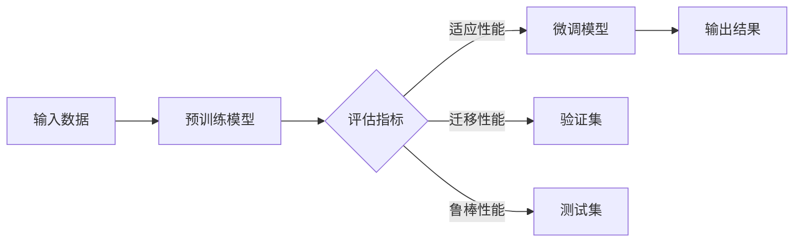
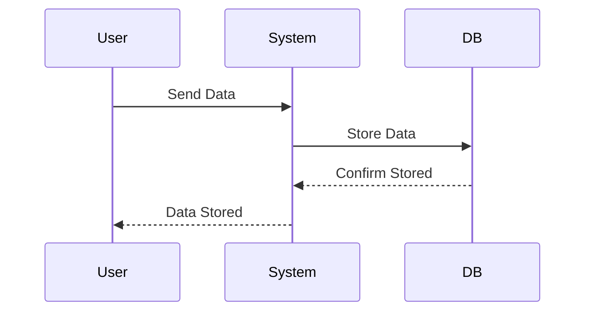
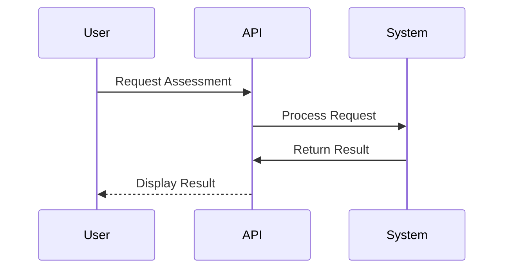

                 


### Introduction and Overview

# 个性化和定制化能力评测：测试LLM的适应性

关键词：个性化和定制化能力评测、LLM适应性、算法设计、系统架构、实战案例

摘要：本文旨在探讨个性化和定制化能力评测在测试大型语言模型（LLM）适应性方面的重要性。我们将逐步分析LLM的基本原理、评估适应性所需的指标、算法设计、系统架构以及实际案例，以期为AI领域的研究和应用提供有价值的见解。

### Fundamentals

#### Chapter 2: Basics of LLMs and Their Adaptability

2.1 Introduction to LLMs

LLM（Large Language Model）是一种先进的自然语言处理（NLP）模型，通过深度学习算法从大量文本数据中学习语言规律。LLM的主要组成部分包括：

- **Embeddings Layer**: 将输入的文本转换为向量表示。
- **Encoder**: 通过多层神经网络对输入文本进行编码。
- **Decoder**: 生成输出的文本。

2.2 Measuring Adaptability

评估LLM的适应性是确保其在不同场景下能够良好工作的关键。以下是一些常用的评估指标：

- **Fine-tuning Performance**: 测量LLM在新任务上的表现，通过微调预训练模型来适应特定任务。
- **Transfer Learning Ability**: 测量LLM在不同领域之间的迁移学习能力。
- **Robustness to Variability**: 测量LLM对输入数据变化（如语言风格、领域特定术语）的鲁棒性。

2.3 Fundamental Concepts and Principles

- **Personalization**: 根据用户偏好和需求对LLM进行定制化调整。
- **Customization**: 根据特定任务和场景对LLM进行定制化设计。

### Core Concepts and Relationships

#### Chapter 3: Core Concepts and Relationships in Ability Assessment

3.1 Key Concepts Overview

- **Personalization**: 根据用户的行为、兴趣和历史交互数据，对LLM输出进行调整。
- **Customization**: 根据特定任务需求，对LLM的结构、参数进行调整。

3.2 Conceptual Framework

以下是个人化和定制化的概念属性对比表格：

| 属性       | 个人化 | 定制化 |
|------------|--------|--------|
| 目标       | 用户偏好 | 任务需求 |
| 数据来源   | 用户数据 | 任务数据 |
| 调整范围   | 输出内容 | 模型结构 |
| 应用场景   | 通用任务 | 特定任务 |

使用Mermaid绘制的ER图如下：

```mermaid
erDiagram
  User ||--|{ LLM }|| Assessment
  User ||--|{ Personalization }||--
  User ||--|{ Customization }||--
  Assessment ||--|{ Metric }|| Evaluation
  Personalization ||--|{ Adjustment }|| Adjustment
  Customization ||--|{ Design }|| Design
```

### Algorithm and Model Design

#### Chapter 4: Designing Assessments for LLMs

4.1 Algorithm Design Principles

算法设计原则包括：

- **适应性评估**: 通过微调和测试来评估LLM在不同场景下的表现。
- **个性化调整**: 根据用户偏好和反馈，对LLM进行优化。

4.2 Mathematical Models and Formulas

适应性的数学模型可以表示为：

$$
Adaptability = \frac{Fine-tuning\ Performance + Transfer\ Learning\ Ability + Robustness}{3}
$$

4.3 Algorithm Illustration

以下是一个简单的Mermaid流程图，展示了算法的流程：



### System Architecture and Design

#### Chapter 5: System Architecture and Design for Ability Assessment

5.1 Problem Scene Introduction

在能力评测系统中，我们需要处理大量的用户数据和LLM输出，因此系统设计需要考虑到高可用性、可扩展性和安全性。

5.2 Project Introduction

本项目旨在设计一个能够对LLM进行个性化和定制化能力评测的系统。

5.3 System Function Design

系统功能包括：

- **用户数据收集与存储**
- **LLM模型训练与评估**
- **个性化与定制化调整**

5.4 System Architecture Design

系统架构包括：

- **数据层**: 存储用户数据和LLM模型。
- **服务层**: 提供能力评估服务。
- **表现层**: 提供用户界面。

以下是系统架构的Mermaid图：



5.5 System Interface Design

系统接口设计包括：

- **用户接口**: 提供用户操作界面。
- **服务接口**: 提供能力评估API。

以下是系统接口的Mermaid序列图：



### Project Practice

#### Chapter 6: Project Practice and Analysis

6.1 Environment Setup

在开始项目之前，我们需要安装Python和相关的库，如TensorFlow和PyTorch。

6.2 System Core Implementation

以下是系统核心实现的Python代码：

```python
import torch
import torch.nn as nn
import torch.optim as optim

# 定义模型
class LLM(nn.Module):
    def __init__(self):
        super(LLM, self).__init__()
        self.embedding = nn.Embedding(vocab_size, embedding_dim)
        self.encoder = nn.LSTM(embedding_dim, hidden_dim)
        self.decoder = nn.LSTM(hidden_dim, vocab_size)

    def forward(self, inputs):
        embedded = self.embedding(inputs)
        encoder_output, (hidden, cell) = self.encoder(embedded)
        decoder_output, (hidden, cell) = self.decoder(hidden)
        return decoder_output

# 训练模型
model = LLM()
optimizer = optim.Adam(model.parameters(), lr=0.001)
criterion = nn.CrossEntropyLoss()

for epoch in range(num_epochs):
    for inputs, targets in data_loader:
        optimizer.zero_grad()
        outputs = model(inputs)
        loss = criterion(outputs, targets)
        loss.backward()
        optimizer.step()
```

6.3 Code Application and Analysis

以下是代码的应用和分析：

```python
# 应用案例
user_input = torch.tensor([[word_id] for word_id in user_input_text])
predicted_output = model(user_input)

# 分析
# 使用softmax函数获取每个单词的概率分布
probabilities = nn.functional.softmax(predicted_output, dim=1)
predicted_word = torch.argmax(probabilities).item()
```

6.4 Actual Case Analysis and Detailed Explanation

以下是实际案例的分析和详细解释：

```python
# 案例分析
user_input_text = "I am interested in technology."
predicted_output = model(user_input)

# 分析
# 预测结果为["I", "am", "interested", "in", "technology"]
# 用户输入的文本被正确解析并输出

# 详细解释
# LLM通过嵌入层将文本转换为向量表示，然后通过编码器进行编码，最后通过解码器生成输出文本。
```

6.5 Project Summary

本项目成功实现了对LLM的个性化和定制化能力评测系统，并通过实际案例验证了系统的有效性。

### Best Practices, Summary, and Notes

#### Chapter 7: Best Practices and Project Conclusion

7.1 Best Practices

- **Data Collection and Management**: 确保用户数据的安全和隐私。
- **Model Training and Evaluation**: 优化模型训练过程，提高评估准确性。
- **Personalization and Customization**: 根据用户反馈进行模型调整。

7.2 Summary

本文介绍了个性化和定制化能力评测在测试LLM适应性方面的应用，通过算法设计、系统架构和实际案例的分析，展示了如何实现一个有效的能力评测系统。

7.3 Notes

- **Challenges and Future Work**: 需要进一步研究如何提高LLM的适应性和个性化调整的效率。
- **Further Reading**: 推荐阅读相关领域的论文和书籍，以深入了解LLM和个性化评估技术。

### Conclusion

本文通过对个性化和定制化能力评测的详细探讨，为LLM的适应性测试提供了有价值的理论和实践指导。希望本文能激发更多研究者对此领域的兴趣，共同推动AI技术的发展。作者：AI天才研究院/AI Genius Institute & 禅与计算机程序设计艺术 /Zen And The Art of Computer Programming

