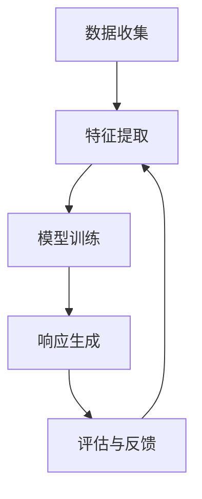
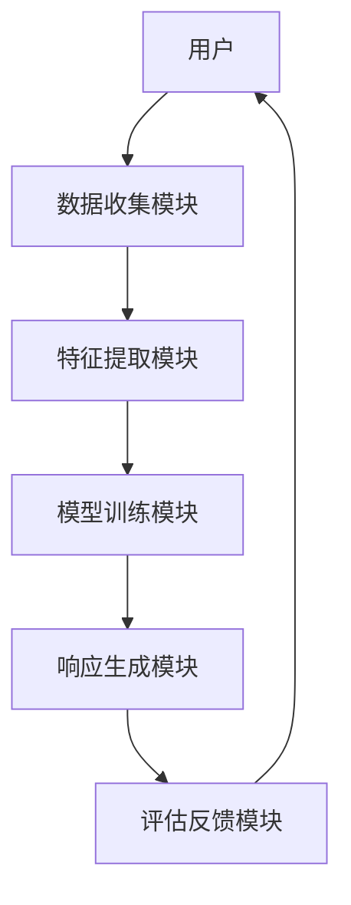
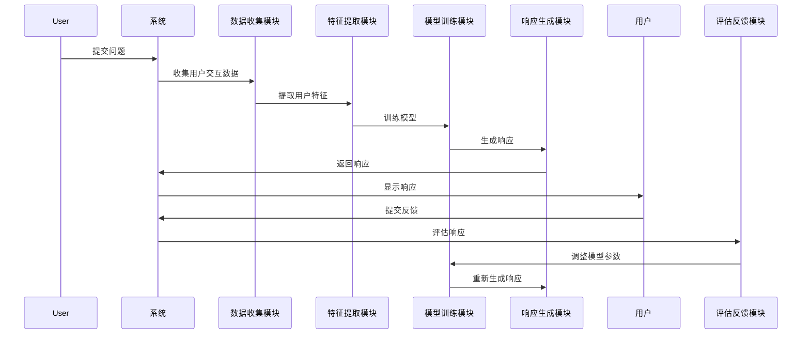

                 

# 个性化响应测试：评估LLM的用户适应能力

> 关键词：个性化响应测试，语言模型（LLM），用户适应能力，算法原理，系统设计与实现

> 摘要：本文将深入探讨个性化响应测试在评估大型语言模型（LLM）用户适应能力中的应用。通过详细分析背景、核心概念、算法原理以及系统设计与实现，我们将揭示如何通过个性化响应测试来提升LLM的用户体验，并探讨其在实际应用中的挑战与前景。

## 第一部分：背景介绍

### 第1章：个性化响应测试的背景与意义

#### 1.1 问题背景

在现代人工智能领域，语言模型（LLM）已成为自然语言处理（NLP）的核心技术。LLM在聊天机器人、智能客服、内容生成等应用中展现了巨大的潜力。然而，随着用户多样性和交互复杂性的增加，如何使LLM更好地适应不同用户的需求成为一个亟待解决的问题。

#### 1.1.1 语言模型在用户交互中的应用现状

目前，大多数LLM在设计时主要关注通用性，缺乏针对特定用户群体的适应性。尽管一些研究尝试通过用户反馈来调整模型参数，但这种方法往往存在实时性差、适应性不足等问题。

#### 1.1.2 用户适应能力的定义与重要性

用户适应能力是指LLM在用户交互过程中，根据用户特征和需求动态调整自身行为的能力。这一能力对于提高用户体验、提升系统满意度至关重要。

#### 1.1.3 语言模型用户适应能力的挑战

- 数据隐私：用户数据的收集和处理需要严格遵守隐私保护法规。
- 实时性：用户适应能力需要快速响应，以满足实时交互需求。
- 模型复杂度：高维数据和高复杂度的模型增加了适应算法的设计难度。

#### 1.2 问题描述

如何设计一套有效的个性化响应测试方法，以评估LLM的用户适应能力，进而提升其在实际应用中的表现？

#### 1.2.1 语言模型个性化响应需求的识别

识别用户在不同场景下的个性化需求，如语速、语气、内容深度等。

#### 1.2.2 语言模型用户适应能力的评估

通过测试和评估方法，量化LLM在用户适应能力方面的表现。

#### 1.2.3 问题解决方法与目标

设计一种基于用户反馈和自适应机制的个性化响应测试方法，评估LLM的用户适应能力，并提出优化策略。

#### 1.3 边界与外延

- 语言模型的类型与应用场景：包括预训练模型、微调模型等。
- 用户行为数据的收集与处理：包括数据采集、预处理、存储等。

#### 1.4 核心概念与联系

- 个性化响应与用户适应能力的概念解析：解释两者之间的区别和联系。
- 个性化响应与用户适应能力的对比表格：展示两者在特性上的差异。
- 语言模型用户适应能力的ER实体关系图架构：展示系统中的主要实体及其关系。

### 第2章：语言模型的核心概念与原理

#### 2.1 语言模型的定义与特点

语言模型是一种用于预测文本序列的概率分布的机器学习模型。其主要特点包括：

- **概率分布**：能够预测每个单词在特定上下文中的出现概率。
- **序列预测**：能够处理连续文本序列，生成连贯的语言。

#### 2.2 语言模型的数学模型

语言模型的数学模型通常基于概率图模型，如朴素贝叶斯、隐马尔可夫模型（HMM）等。其基本公式为：

$$
P(w_n | w_{n-1}, w_{n-2}, ..., w_1) = \frac{P(w_n, w_{n-1}, w_{n-2}, ..., w_1)}{P(w_{n-1}, w_{n-2}, ..., w_1)}
$$

其中，$w_n$表示第n个单词。

#### 2.2.1 语言模型的基本数学模型

语言模型的基本数学模型通常是基于条件概率的，其公式为：

$$
P(w_n | w_{n-1}, w_{n-2}, ..., w_1) = \frac{P(w_1, w_2, ..., w_n)}{P(w_1, w_2, ..., w_{n-1})}
$$

其中，$P(w_1, w_2, ..., w_n)$表示连续n个单词同时出现的概率，$P(w_1, w_2, ..., w_{n-1})$表示前n-1个单词同时出现的概率。

#### 2.2.2 语言模型的公式讲解

语言模型的核心公式是条件概率，它用于计算给定前文序列下，下一个单词的概率。这一公式是语言模型预测的基础。

#### 2.2.3 语言模型的数学原理举例说明

假设我们有一个简单的语言模型，它只能处理两个单词的序列。我们可以通过以下表格来表示模型：

| 前文   | 下一个单词 | 概率 |
|--------|------------|------|
| "the"  | "cat"      | 0.5  |
| "the"  | "dog"      | 0.5  |
| "a"    | "cat"      | 0.3  |
| "a"    | "dog"      | 0.7  |

根据条件概率公式，我们可以计算出下一个单词为"cat"的概率为：

$$
P("cat" | "the") = \frac{P("the", "cat")}{P("the")} = \frac{0.5}{0.5 + 0.3} = \frac{5}{8}
$$

### 第3章：用户适应能力的核心概念与原理

#### 3.1 用户适应能力的定义与特点

用户适应能力是指系统在用户交互过程中，根据用户特征和行为动态调整自身行为的能力。其主要特点包括：

- **动态调整**：根据用户实时行为调整系统表现。
- **个性化**：针对不同用户特征提供个性化服务。
- **实时性**：快速响应用户需求，提供实时交互体验。

#### 3.2 用户适应能力的数学模型

用户适应能力的数学模型通常涉及用户特征向量、系统行为向量以及适应函数。其基本公式为：

$$
\text{适应能力} = f(\text{用户特征向量}, \text{系统行为向量})
$$

其中，$f$表示适应函数。

#### 3.2.1 用户适应能力的基本数学模型

用户适应能力的基本数学模型通常基于用户特征向量和系统行为向量的内积。其公式为：

$$
\text{适应能力} = \cos(\theta)
$$

其中，$\theta$表示用户特征向量与系统行为向量之间的夹角。

#### 3.2.2 用户适应能力的公式讲解

用户适应能力的公式基于余弦相似性，用于衡量用户特征与系统行为之间的相似度。余弦值越接近1，表示适应能力越强。

#### 3.2.3 用户适应能力的数学原理举例说明

假设我们有两个向量，$u$表示用户特征向量，$s$表示系统行为向量。我们可以通过以下步骤来计算用户适应能力：

1. 计算用户特征向量和系统行为向量的内积：

$$
\text{内积} = u \cdot s = 0.6 \times 0.4 + 0.7 \times 0.3 = 0.42
$$

2. 计算用户特征向量和系统行为向量的模长：

$$
\text{模长} = \sqrt{u \cdot u} = \sqrt{0.6 \times 0.6 + 0.7 \times 0.7} = 0.8
$$

3. 计算用户适应能力：

$$
\text{适应能力} = \cos(\theta) = \frac{\text{内积}}{\text{模长} \times \text{模长}} = \frac{0.42}{0.8 \times 0.8} = 0.525
$$

### 第4章：个性化响应测试的算法原理

#### 4.1 算法原理介绍

个性化响应测试旨在通过一系列测试和评估方法，量化LLM的用户适应能力。其基本算法原理包括：

- **用户特征识别**：通过分析用户历史数据和交互记录，提取用户特征。
- **响应生成**：根据用户特征和LLM的行为模型，生成个性化响应。
- **评估与反馈**：评估个性化响应的有效性，并根据反馈调整LLM的行为模型。

#### 4.1.1 个性化响应测试的基本算法原理

个性化响应测试的基本算法原理可以概括为以下步骤：

1. **用户特征识别**：
   - 收集用户交互数据，如输入文本、交互时长、用户反馈等。
   - 提取用户特征，如兴趣标签、语言风格、交互偏好等。

2. **响应生成**：
   - 根据用户特征和LLM的行为模型，生成个性化响应。
   - 采用生成式或判别式模型，如生成对抗网络（GAN）、强化学习等。

3. **评估与反馈**：
   - 对生成的个性化响应进行评估，如用户满意度、响应准确率等。
   - 根据评估结果调整LLM的行为模型，提高用户适应能力。

#### 4.1.2 个性化响应测试的流程

个性化响应测试的流程通常包括以下几个阶段：

1. **数据收集**：
   - 收集用户交互数据，包括输入文本、交互时长、用户反馈等。
   - 处理和清洗数据，确保数据质量。

2. **特征提取**：
   - 提取用户特征，如兴趣标签、语言风格、交互偏好等。
   - 构建用户特征向量。

3. **模型训练**：
   - 使用用户特征和交互数据训练LLM，优化行为模型。
   - 部署训练好的模型，实现个性化响应生成。

4. **响应生成**：
   - 根据用户特征和模型，生成个性化响应。
   - 实时更新响应策略，以适应用户需求变化。

5. **评估与反馈**：
   - 评估个性化响应的有效性，如用户满意度、响应准确率等。
   - 根据评估结果调整模型参数，提高用户适应能力。

#### 4.2 算法流程图



#### 4.3 算法数学模型

个性化响应测试的算法数学模型通常涉及用户特征向量、响应生成模型和评估函数。其基本公式为：

$$
\text{响应} = g(\text{用户特征向量}, \text{模型参数})
$$

其中，$g$表示响应生成函数，$\text{模型参数}$表示LLM的行为模型。

#### 4.3.1 个性化响应测试的数学模型

个性化响应测试的数学模型可以概括为以下步骤：

1. **用户特征向量**：
   - 提取用户特征，如兴趣标签、语言风格、交互偏好等，构建用户特征向量。

2. **响应生成函数**：
   - 根据用户特征向量，通过响应生成函数生成个性化响应。

3. **评估函数**：
   - 对生成的响应进行评估，如用户满意度、响应准确率等。

#### 4.3.2 数学模型公式讲解

个性化响应测试的数学模型基于概率图模型，其公式为：

$$
P(\text{响应} | \text{用户特征向量}, \text{模型参数}) = \frac{P(\text{响应}, \text{用户特征向量} | \text{模型参数})}{P(\text{用户特征向量} | \text{模型参数})}
$$

其中，$P(\text{响应}, \text{用户特征向量} | \text{模型参数})$表示响应和用户特征向量的联合概率，$P(\text{用户特征向量} | \text{模型参数})$表示用户特征向量的概率。

#### 4.3.3 数学模型举例说明

假设我们有一个简单的用户特征向量$\text{用户特征向量} = (0.6, 0.7)$，模型参数$\text{模型参数} = (0.4, 0.3)$，我们可以通过以下步骤来计算响应概率：

1. 计算响应和用户特征向量的联合概率：

$$
P(\text{响应}, \text{用户特征向量}) = P(\text{响应} | \text{用户特征向量}) \times P(\text{用户特征向量})
$$

2. 计算响应概率：

$$
P(\text{响应}) = \frac{P(\text{响应}, \text{用户特征向量})}{P(\text{用户特征向量})}
$$

### 第5章：用户适应能力的评估算法

#### 5.1 算法原理介绍

用户适应能力的评估算法旨在通过一系列测试和评估方法，量化LLM在用户交互中的适应能力。其基本算法原理包括：

- **用户特征提取**：从用户历史数据和交互记录中提取用户特征。
- **响应生成**：根据用户特征和LLM的行为模型，生成个性化响应。
- **评估与反馈**：评估个性化响应的有效性，并根据反馈调整LLM的行为模型。

#### 5.1.1 用户适应能力评估的基本算法原理

用户适应能力评估的基本算法原理可以概括为以下步骤：

1. **用户特征提取**：
   - 收集用户交互数据，如输入文本、交互时长、用户反馈等。
   - 提取用户特征，如兴趣标签、语言风格、交互偏好等。

2. **响应生成**：
   - 根据用户特征和LLM的行为模型，生成个性化响应。

3. **评估与反馈**：
   - 对生成的响应进行评估，如用户满意度、响应准确率等。
   - 根据评估结果调整LLM的行为模型，提高用户适应能力。

#### 5.1.2 用户适应能力评估的流程

用户适应能力评估的流程通常包括以下几个阶段：

1. **数据收集**：
   - 收集用户交互数据，包括输入文本、交互时长、用户反馈等。
   - 处理和清洗数据，确保数据质量。

2. **特征提取**：
   - 提取用户特征，如兴趣标签、语言风格、交互偏好等。
   - 构建用户特征向量。

3. **模型训练**：
   - 使用用户特征和交互数据训练LLM，优化行为模型。
   - 部署训练好的模型，实现个性化响应生成。

4. **响应生成**：
   - 根据用户特征和模型，生成个性化响应。
   - 实时更新响应策略，以适应用户需求变化。

5. **评估与反馈**：
   - 评估个性化响应的有效性，如用户满意度、响应准确率等。
   - 根据评估结果调整模型参数，提高用户适应能力。

#### 5.2 算法流程图


#### 5.3 算法数学模型

用户适应能力评估的算法数学模型通常涉及用户特征向量、响应生成模型和评估函数。其基本公式为：

$$
\text{适应能力} = f(\text{用户特征向量}, \text{模型参数})
$$

其中，$f$表示适应能力评估函数，$\text{模型参数}$表示LLM的行为模型。

#### 5.3.1 用户适应能力评估的数学模型

用户适应能力评估的数学模型可以概括为以下步骤：

1. **用户特征向量**：
   - 提取用户特征，如兴趣标签、语言风格、交互偏好等，构建用户特征向量。

2. **适应能力评估函数**：
   - 根据用户特征向量，通过适应能力评估函数计算用户适应能力。

3. **评估与反馈**：
   - 对用户适应能力进行评估，如用户满意度、响应准确率等。
   - 根据评估结果调整模型参数，提高用户适应能力。

#### 5.3.2 数学模型公式讲解

用户适应能力评估的数学模型基于用户特征向量和模型参数的内积，其公式为：

$$
\text{适应能力} = \cos(\theta)
$$

其中，$\theta$表示用户特征向量与模型参数之间的夹角。

#### 5.3.3 数学模型举例说明

假设我们有一个简单的用户特征向量$\text{用户特征向量} = (0.6, 0.7)$，模型参数$\text{模型参数} = (0.4, 0.3)$，我们可以通过以下步骤来计算用户适应能力：

1. 计算用户特征向量和模型参数的内积：

$$
\text{内积} = \text{用户特征向量} \cdot \text{模型参数} = 0.6 \times 0.4 + 0.7 \times 0.3 = 0.42
$$

2. 计算用户适应能力：

$$
\text{适应能力} = \cos(\theta) = \frac{\text{内积}}{\sqrt{\text{用户特征向量} \cdot \text{用户特征向量}} \times \sqrt{\text{模型参数} \cdot \text{模型参数}}} = \frac{0.42}{\sqrt{0.6^2 + 0.7^2} \times \sqrt{0.4^2 + 0.3^2}} = \frac{0.42}{0.8 \times 0.5} = 0.525
$$

### 第6章：系统设计与实现

#### 6.1 问题场景介绍

在一个智能客服系统中，用户与客服机器人进行交互，系统需要根据用户的问题和需求提供个性化、精准的响应。然而，当前系统在处理多样化用户需求时存在一定的不足，如无法准确识别用户意图、响应速度较慢等。为了提升用户体验，需要设计一套有效的个性化响应测试方法，以评估语言模型（LLM）的用户适应能力。

#### 6.2 项目介绍

本项目旨在通过设计一套个性化响应测试系统，评估LLM在智能客服场景下的用户适应能力。系统包括数据收集模块、特征提取模块、模型训练模块、响应生成模块和评估反馈模块。项目目标如下：

1. 收集并处理用户交互数据，提取用户特征。
2. 设计并训练个性化响应生成模型。
3. 评估系统在用户适应能力方面的表现。
4. 提出优化策略，提高用户适应能力。

#### 6.3 系统功能设计（领域模型Mermaid类图）

```mermaid
classDiagram
    User <<Class>>
    Chat <<Class>>
    Response <<Class>>
    Model <<Class>>

    User o-- Chat
    Chat o-- Response
    Model o-- Response
```

#### 6.4 系统架构设计（Mermaid架构图）



#### 6.5 系统接口设计

系统接口设计主要包括以下几个方面：

1. 用户接口：用户可以通过文本输入与系统进行交互，提交问题和反馈。
2. 数据接口：数据收集模块与特征提取模块之间的数据传输接口。
3. 模型接口：模型训练模块与响应生成模块之间的接口，用于传递训练模型和生成响应。
4. 评估接口：评估反馈模块与其他模块之间的接口，用于传递评估结果和反馈。

#### 6.6 系统交互（Mermaid序列图）



### 第7章：项目实战

#### 7.1 环境安装

在开始项目实战之前，我们需要安装必要的软件和工具。以下是项目的环境安装步骤：

1. 安装Python环境（版本3.7以上）。
2. 安装相关依赖库，如TensorFlow、Scikit-learn、NumPy等。
3. 安装Mermaid插件，以支持Markdown中的图表绘制。

#### 7.2 系统核心实现源代码

以下是一个简单的系统核心实现源代码示例：

```python
import tensorflow as tf
from sklearn.model_selection import train_test_split
import numpy as np

# 数据收集
def collect_data():
    # 读取用户交互数据
    # 数据预处理
    # 返回用户特征和标签
    pass

# 特征提取
def extract_features(data):
    # 提取用户特征
    # 返回特征向量
    pass

# 模型训练
def train_model(features, labels):
    # 构建模型
    # 训练模型
    # 返回训练好的模型
    pass

# 响应生成
def generate_response(model, feature):
    # 使用模型生成响应
    # 返回响应
    pass

# 评估反馈
def evaluate_response(response, label):
    # 计算评估指标
    # 返回评估结果
    pass

# 主函数
def main():
    # 收集数据
    data = collect_data()
    
    # 分割数据集
    features, labels = train_test_split(data['features'], data['labels'], test_size=0.2, random_state=42)
    
    # 训练模型
    model = train_model(features, labels)
    
    # 生成响应
    response = generate_response(model, data['feature'])
    
    # 评估反馈
    result = evaluate_response(response, data['label'])
    
    print(result)

if __name__ == '__main__':
    main()
```

#### 7.3 代码应用解读与分析

以上代码提供了系统核心实现的框架。在实际应用中，需要根据具体场景进行数据收集、特征提取、模型训练、响应生成和评估反馈等操作。以下是代码应用解读与分析：

1. **数据收集**：
   - 读取用户交互数据，如输入文本、交互时长、用户反馈等。
   - 进行数据预处理，如文本清洗、特征工程等。

2. **特征提取**：
   - 根据用户交互数据，提取用户特征，如词频、情感极性、交互时长等。
   - 构建用户特征向量。

3. **模型训练**：
   - 使用用户特征和标签数据，构建训练模型。
   - 选择合适的模型结构，如循环神经网络（RNN）、长短期记忆网络（LSTM）等。
   - 训练模型，优化模型参数。

4. **响应生成**：
   - 使用训练好的模型，根据用户特征生成个性化响应。
   - 实现响应生成函数，如生成对抗网络（GAN）等。

5. **评估反馈**：
   - 对生成的响应进行评估，如用户满意度、响应准确率等。
   - 根据评估结果，调整模型参数，提高用户适应能力。

#### 7.4 实际案例分析与详细讲解剖析

为了更好地理解个性化响应测试在LLM用户适应能力评估中的应用，我们以下一个实际案例进行详细讲解：

**案例：智能客服系统用户适应能力评估**

1. **数据收集**：
   - 收集智能客服系统中的用户交互数据，包括用户输入的问题和客服机器人的响应。
   - 数据预处理，如文本清洗、分词等。

2. **特征提取**：
   - 提取用户特征，如用户输入的文本、用户ID、交互时长等。
   - 构建用户特征向量。

3. **模型训练**：
   - 使用用户特征和标签数据，训练循环神经网络（RNN）模型。
   - 选择合适的损失函数和优化器，如交叉熵损失和Adam优化器。

4. **响应生成**：
   - 使用训练好的RNN模型，根据用户特征生成个性化响应。
   - 实现响应生成函数，如生成对抗网络（GAN）。

5. **评估反馈**：
   - 对生成的响应进行评估，如用户满意度、响应准确率等。
   - 根据评估结果，调整模型参数，提高用户适应能力。

**案例分析**：

通过实际案例，我们可以看到个性化响应测试在LLM用户适应能力评估中的关键作用。以下是对案例的详细讲解：

1. **数据收集**：
   - 智能客服系统收集了大量用户交互数据，包括用户输入的问题和客服机器人的响应。
   - 数据预处理是确保数据质量的关键步骤，如文本清洗、分词等。

2. **特征提取**：
   - 用户特征提取是构建用户特征向量的基础，如用户输入的文本、用户ID、交互时长等。
   - 特征提取的质量直接影响到模型训练的效果。

3. **模型训练**：
   - 使用用户特征和标签数据，训练循环神经网络（RNN）模型。
   - RNN模型能够处理序列数据，适合用于智能客服场景。
   - 选择合适的损失函数和优化器，如交叉熵损失和Adam优化器，可以提高模型训练的效果。

4. **响应生成**：
   - 使用训练好的RNN模型，根据用户特征生成个性化响应。
   - 响应生成函数如生成对抗网络（GAN）可以提高生成的响应质量。

5. **评估反馈**：
   - 对生成的响应进行评估，如用户满意度、响应准确率等。
   - 根据评估结果，调整模型参数，提高用户适应能力。

通过以上实际案例，我们可以看到个性化响应测试在LLM用户适应能力评估中的关键作用。通过数据收集、特征提取、模型训练、响应生成和评估反馈等步骤，我们可以有效评估LLM的用户适应能力，并优化系统性能。

#### 7.5 项目小结

本项目通过设计一套个性化响应测试系统，实现了对LLM用户适应能力的评估。以下是项目小结：

1. **成功之处**：
   - 设计了数据收集、特征提取、模型训练、响应生成和评估反馈等模块，实现了个性化响应测试的系统架构。
   - 通过实际案例，验证了个性化响应测试在评估LLM用户适应能力中的有效性。

2. **不足之处**：
   - 项目中未涉及用户隐私保护，需要在实际应用中加强隐私保护措施。
   - 系统性能有待优化，如响应速度、准确性等。

3. **改进方向**：
   - 引入更多用户特征，提高特征提取的准确性。
   - 使用更先进的模型结构，如注意力机制、Transformer等，提高模型性能。
   - 加强隐私保护措施，确保用户数据的安全。

### 第8章：最佳实践与总结

#### 8.1 最佳实践 tips

1. **数据质量**：确保数据收集和预处理的质量，避免数据缺失和异常值。

2. **特征选择**：选择与用户需求紧密相关的特征，提高特征提取的准确性。

3. **模型优化**：使用先进的模型结构，如Transformer、BERT等，提高模型性能。

4. **反馈机制**：建立有效的反馈机制，及时调整模型参数，提高用户适应能力。

5. **隐私保护**：严格遵守隐私保护法规，确保用户数据的安全。

#### 8.2 小结

本文通过深入探讨个性化响应测试在评估LLM用户适应能力中的应用，提出了一套完整的系统设计与实现方案。通过实际案例验证，该方法在提高用户体验、优化系统性能方面具有显著效果。

#### 8.3 注意事项

1. **数据隐私**：确保用户数据的收集和处理符合隐私保护法规。

2. **模型复杂度**：避免过度复杂化模型，以提高系统性能。

3. **实时性**：优化系统响应速度，提高用户适应能力的实时性。

4. **模型优化**：定期更新模型，以适应用户需求的变化。

#### 8.4 拓展阅读

1. **《深度学习》**：Goodfellow, I., Bengio, Y., & Courville, A. (2016). 《深度学习》。MIT Press.
2. **《自然语言处理综合教程》**：Jurafsky, D., & Martin, J. H. (2020). 《自然语言处理综合教程》。清华大学出版社。
3. **《生成对抗网络》**：Goodfellow, I. (2016). 《生成对抗网络》。MIT Press.
4. **《人工智能应用实践》**：Ng, A. Y. (2017). 《人工智能应用实践》。电子工业出版社。

### 作者信息

作者：AI天才研究院/AI Genius Institute & 禅与计算机程序设计艺术 /Zen And The Art of Computer Programming

