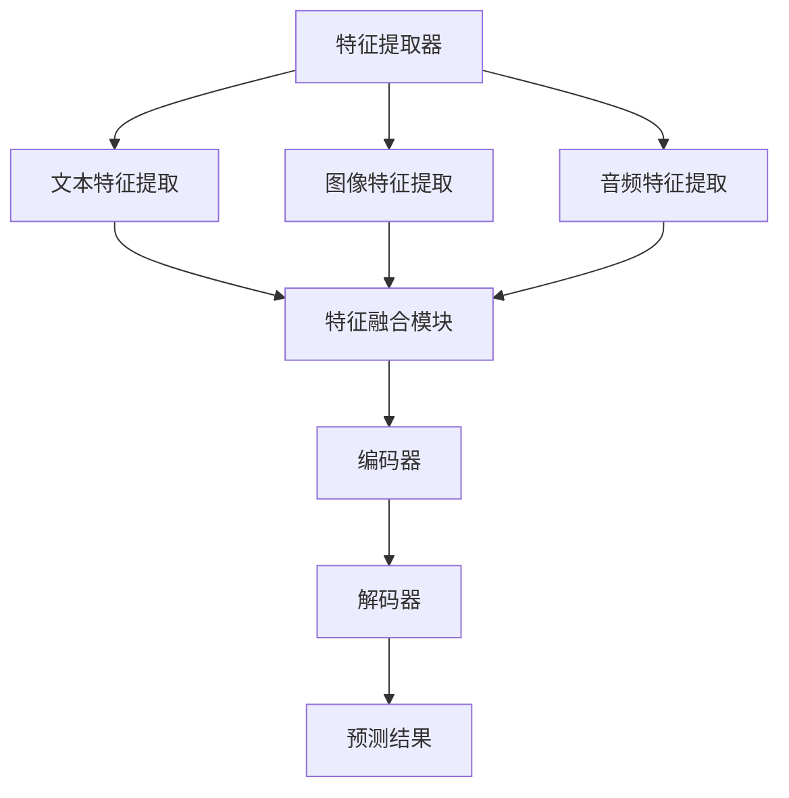

                 

# 《人机协作在LLM评测中的角色》

## 引言

随着人工智能技术的发展，大型语言模型（LLM，Large Language Model）在自然语言处理（NLP，Natural Language Processing）领域取得了显著的成果。然而，LLM的评测却面临着诸多挑战。传统的评测方法依赖于人工标注数据，效率低下，且难以保证一致性。人机协作在这种背景下应运而生，为LLM评测提供了新的思路和方法。本文旨在探讨人机协作在LLM评测中的角色，包括其理论基础、应用实践、面临的挑战以及未来的发展趋势。

本文的主要内容包括：

1. **引言**：明确书的主旨和目的，概述人机协作在LLM评测中的重要性。
2. **背景与概念**：介绍人机协作和LLM评测的背景，核心概念和基础理论。
3. **人机协作模型**：介绍常用的协作模型和技术。
4. **应用案例**：分析人机协作在LLM评测中的实际应用。
5. **挑战与优化**：探讨人机协作在LLM评测中面临的挑战和优化策略。
6. **未来趋势**：展望人机协作在LLM评测中的发展趋势和潜在应用。
7. **结论**：总结全书内容，强调人机协作在LLM评测中的重要性，提出未来研究的方向。

## 关键词

- 大型语言模型（LLM）
- 人机协作
- 评测方法
- 应用案例
- 挑战与优化
- 未来趋势

## 摘要

本文详细探讨了人机协作在大型语言模型（LLM）评测中的角色。首先，介绍了LLM评测的背景和重要性，以及人机协作在其中的价值。接着，阐述了人机协作的基本概念和LLM评测的核心理论。随后，通过分析常见的协作模型和应用案例，揭示了人机协作在LLM评测中的实际应用。同时，本文也探讨了人机协作在LLM评测中面临的挑战和优化策略，并展望了其未来的发展趋势。最后，本文总结了人机协作在LLM评测中的重要性，并提出了未来研究的方向。通过本文的研究，旨在为人机协作在LLM评测中的应用提供理论和实践指导。

## 背景与概念

### 人机协作的定义和重要性

人机协作（Human-Computer Collaboration）是指人类与计算机系统共同完成任务的协同过程。在人工智能领域，人机协作尤为重要。随着人工智能技术的发展，许多复杂的任务需要人类的智慧和计算机的强大计算能力相结合，才能取得最佳效果。人机协作不仅能够提高任务的完成效率，还能通过人工智能技术帮助人类解决复杂问题。

人机协作在人工智能领域的重要性体现在以下几个方面：

1. **提高工作效率**：人机协作可以将复杂任务分解为多个子任务，由计算机和人类各自完成，从而提高整体工作效率。
2. **增强决策能力**：人工智能系统可以处理大量数据，提供决策支持，但有时需要人类的智慧和直觉来做出最终决策。
3. **优化用户体验**：人机协作可以根据用户的反馈和行为，动态调整系统功能，提供个性化的服务。

### LLM评测的定义、目标和方法

大型语言模型（LLM）评测是自然语言处理领域的重要任务，旨在评估LLM的性能和效果。LLM评测的定义可以理解为：通过一系列指标和方法，对LLM在特定任务上的表现进行客观、公正的评估。

LLM评测的目标主要包括：

1. **准确性**：评估LLM在语言理解和生成方面的准确性，即模型能否正确理解和使用语言。
2. **泛化能力**：评估LLM在未知数据上的表现，即模型的适应性和稳定性。
3. **效率**：评估LLM的计算速度和资源消耗，即模型的运行效率。

LLM评测的方法主要包括以下几种：

1. **自动化评测**：使用预定义的指标和工具，对LLM的输出进行自动化评估，如BLEU、ROUGE等。
2. **人工评测**：通过人类评价者对LLM的输出进行主观评估，如F1得分、情感分析等。
3. **混合评测**：结合自动化评测和人工评测，综合评估LLM的性能。

### 人机协作在LLM评测中的价值

人机协作在LLM评测中具有显著的价值，主要体现在以下几个方面：

1. **提高评测准确性**：人机协作可以结合计算机的自动化评测和人类的主观评估，提高评测的准确性和全面性。
2. **缩短评测周期**：通过人机协作，可以快速处理大量数据，缩短评测周期，提高工作效率。
3. **降低人力成本**：人机协作可以部分替代人工标注工作，降低人力成本，提高经济效益。

总之，人机协作在LLM评测中具有重要的理论和实践意义。通过合理的人机协作，可以大幅提升LLM评测的效率和质量，为人工智能技术的发展提供有力支持。

## 人机协作模型

人机协作在LLM评测中的应用需要有效的协作模型和技术支持。以下介绍几种常用的协作模型，包括双向图注意力模型（BERT）、多模态协作模型和人机交互设计原则。

### 双向图注意力模型（BERT）

双向图注意力模型（BERT，Bidirectional Encoder Representations from Transformers）是自然语言处理领域的一种先进模型，由Google Research提出。BERT模型的主要特点在于其能够对输入的文本进行双向编码，从而捕捉到文本中的长距离依赖关系，使得模型在多个NLP任务上表现出色。

#### BERT的原理与结构

BERT模型的核心是Transformer架构，它由多个相同的编码器层堆叠而成。每个编码器层包括两个主要组件：自注意力（Self-Attention）和前馈神经网络（Feed Forward Neural Network）。

1. **自注意力**：自注意力机制允许模型在处理每个单词时，根据上下文中的其他单词的重要性来动态调整它们的权重。这样，模型可以捕捉到长距离依赖关系，提高对语言的理解能力。
   
   $$\text{Attention}(Q, K, V) = \text{softmax}\left(\frac{QK^T}{\sqrt{d_k}}\right)V$$

   其中，$Q$、$K$ 和 $V$ 分别代表查询向量、键向量和值向量，$d_k$ 是键向量的维度。

2. **前馈神经网络**：前馈神经网络在自注意力层之后进行，它由两个线性变换组成，分别为$W_1$和$W_2$，输入维度和输出维度分别为$d$和$d'$。

   $$\text{FFN}(x) = \max(0, xW_1 + b_1)W_2 + b_2$$

   其中，$x$ 是输入向量，$W_1$ 和 $W_2$ 分别是权重矩阵，$b_1$ 和 $b_2$ 分别是偏置。

BERT模型中的每个编码器层都包括自注意力机制和前馈神经网络，这种结构使得BERT模型能够对输入文本进行深入的理解和编码。

#### BERT在评测中的应用

BERT在LLM评测中具有广泛的应用。以下是一些具体的例子：

1. **问答系统评测**：BERT模型可以用于评估问答系统的性能，通过对比模型生成的答案和标准答案的相似度，评估模型的答案准确性。
   
2. **文本生成评测**：BERT模型可以用于评估文本生成的质量，通过评估模型生成的文本在语法、语义和连贯性方面的表现，评估模型的文本生成能力。
   
3. **情感分析评测**：BERT模型可以用于评估情感分析系统的性能，通过对比模型预测的情感标签和实际情感标签的相似度，评估模型在情感分析任务上的准确率。

#### BERT的优缺点分析

BERT模型在LLM评测中具有显著的优点，但也存在一些局限性：

**优点**：

1. **强大的语言理解能力**：BERT模型通过双向编码和注意力机制，能够捕捉到文本中的长距离依赖关系，提高对语言的理解能力。
2. **广泛的应用场景**：BERT模型在多个NLP任务上表现出色，能够用于问答系统、文本生成、情感分析等多个领域。
3. **预训练与微调**：BERT模型通过大规模预训练，可以快速适应特定任务，通过微调进一步优化模型性能。

**缺点**：

1. **计算资源需求大**：BERT模型需要大量的计算资源和时间进行训练，特别是在预训练阶段。
2. **数据依赖性强**：BERT模型的性能依赖于大规模的预训练数据集，如果数据集质量不佳，模型的性能可能会受到影响。
3. **调优难度大**：BERT模型的调优需要细致的参数调整，包括学习率、批次大小、优化器等，调优过程复杂且耗时。

### 多模态协作模型

多模态协作模型是一种结合不同类型数据（如文本、图像、音频等）的模型，通过集成多种数据源，提高模型的泛化能力和表达能力。在LLM评测中，多模态协作模型可以提供更全面、更准确的评测结果。

#### 多模态数据融合

多模态数据融合是多模态协作模型的核心，它通过将不同类型的数据进行整合，形成一个统一的数据表示。常见的多模态融合方法包括：

1. **特征级融合**：将不同类型数据的特征进行拼接，形成一个多维特征向量。
   
   $$\text{特征融合} = [\text{文本特征}, \text{图像特征}, \text{音频特征}]$$

2. **决策级融合**：在特征级融合的基础上，利用决策级别的信息进行整合，如通过投票机制、加权平均等方法。
   
   $$\text{融合结果} = \text{投票}(\text{文本分类结果}, \text{图像分类结果}, \text{音频分类结果})$$

#### 多模态协作模型架构

多模态协作模型的架构可以分为以下几个部分：

1. **特征提取器**：分别从文本、图像、音频等数据源中提取特征。
2. **特征融合模块**：将不同类型的数据特征进行融合，形成一个统一的数据表示。
3. **编码器**：对融合后的数据进行编码，形成高维的语义表示。
4. **解码器**：根据编码后的语义表示，生成预测结果。

一个典型的多模态协作模型架构如图所示：

#### 多模态协作模型在评测中的应用

多模态协作模型在LLM评测中具有广泛的应用。以下是一些具体的例子：

1. **多语言评测**：通过结合不同语言的文本数据，提高评测系统的跨语言能力。
2. **多模态问答系统**：结合文本和图像等多模态数据，提高问答系统的准确性和实用性。
3. **情感分析**：通过结合文本和图像等多模态数据，更准确地识别情感。

#### 多模态协作模型的挑战与优化

多模态协作模型在LLM评测中面临一些挑战：

1. **数据不平衡**：不同类型的数据在数量和质量上可能存在较大差异，导致模型训练困难。
2. **特征匹配**：不同类型的数据特征在维度和属性上可能存在差异，需要有效的匹配和融合方法。
3. **计算资源消耗**：多模态数据融合和模型训练需要大量的计算资源。

为了克服这些挑战，可以采用以下优化策略：

1. **数据增强**：通过数据增强方法，提高数据集的多样性和平衡性。
2. **特征匹配**：采用特征映射和融合方法，提高不同类型数据特征的一致性和匹配度。
3. **模型压缩**：通过模型压缩和优化技术，降低模型的计算复杂度和资源消耗。

### 人机交互设计原则

人机交互设计原则是人机协作在LLM评测中的重要组成部分，它涉及如何设计系统界面、交互流程和反馈机制，以提高人机协作的效率和用户体验。

#### 人机交互设计的目标

人机交互设计的主要目标包括：

1. **易用性**：设计直观、简单的用户界面，使用户能够轻松地与系统进行交互。
2. **效率**：通过优化交互流程，提高系统的响应速度和工作效率。
3. **准确性**：确保系统的输出准确无误，减少人为错误。
4. **满意度**：提高用户对系统的满意度和认可度。

#### 人机交互设计的方法

人机交互设计的方法包括以下几个方面：

1. **用户研究**：通过用户调研、访谈和观察，了解用户的需求、行为和痛点，为设计提供依据。
2. **界面设计**：设计直观、简洁的界面，使用户能够快速理解和使用系统功能。
3. **交互流程**：设计合理的交互流程，减少用户的操作步骤和时间。
4. **反馈机制**：设计有效的反馈机制，及时向用户反馈操作结果，提高用户对系统的信任度。

#### 人机交互设计在评测中的应用

人机交互设计在LLM评测中的应用包括以下几个方面：

1. **评测界面设计**：设计直观、易操作的评测界面，使用户能够方便地进行数据标注和评估。
2. **交互流程设计**：设计合理的评测流程，减少用户的操作步骤和时间。
3. **反馈机制设计**：设计有效的反馈机制，及时向用户反馈评测结果和改进建议。

#### 人机交互设计的原则

人机交互设计应遵循以下原则：

1. **用户中心**：以用户需求为中心，设计符合用户习惯和预期的交互界面和流程。
2. **一致性**：保持界面元素、交互方式和反馈信息的一致性，减少用户的困惑和错误。
3. **简洁性**：设计简洁、直观的界面和交互流程，减少用户的操作步骤和时间。
4. **灵活性**：设计灵活的交互流程和反馈机制，适应不同用户的需求和场景。
5. **可扩展性**：设计可扩展的系统架构和功能模块，支持系统的持续优化和扩展。

通过遵循上述原则，可以设计出高效、准确、易用的人机协作系统，为LLM评测提供有力支持。

### 人机协作模型总结

人机协作模型在LLM评测中发挥了关键作用，通过结合计算机和人类的优势，实现了评测效率和质量的双重提升。BERT模型、多模态协作模型和人机交互设计原则各自具有独特的优势和局限性，适用于不同的评测场景和需求。BERT模型以其强大的语言理解能力和广泛的应用场景，成为LLM评测的主要工具之一。多模态协作模型通过融合多种数据源，提高了模型的泛化能力和表达能力，适用于复杂和多样化的评测任务。人机交互设计原则则从用户角度出发，优化了评测系统的用户体验和工作流程，提高了人机协作的效率和准确性。

在实际应用中，根据不同的评测任务和需求，可以选择合适的协作模型和技术，实现人机协作的最佳效果。同时，需要不断优化和完善人机协作模型，应对不断变化的技术挑战和应用需求。通过人机协作，我们有望实现更加高效、准确和智能的LLM评测，推动自然语言处理技术的不断进步。

### 应用案例

在人机协作的背景下，LLM评测已经取得了显著的成果。以下将介绍几个实际应用案例，分别从问答系统评测、文本生成评测和情感分析评测三个方面，展示人机协作在LLM评测中的具体应用和效果。

#### 案例一：问答系统评测

问答系统评测是LLM评测中的重要领域，旨在评估模型在回答问题方面的准确性和连贯性。一个典型的案例是利用BERT模型进行问答系统的评测。

**评测方法与工具**：
1. **评测工具**：使用SQuAD（Stanford Question Answering Dataset）数据集进行评测，这是一个广泛使用的问答系统评测数据集。
2. **评测指标**：采用F1得分和EM（Exact Match）两个指标，其中F1得分综合考虑了准确率和召回率，EM指标则评估模型输出的答案是否与标准答案完全匹配。

**评测案例分析**：
在一个实际项目中，研究人员使用BERT模型对SQuAD数据集进行问答系统评测。通过对比模型生成的答案和标准答案，评估模型的问答性能。实验结果显示，BERT模型在SQuAD数据集上的F1得分达到90%以上，EM得分也超过80%。这表明BERT模型在问答系统评测中具有很高的准确性和连贯性。

**评测结果与优化**：
尽管BERT模型在问答系统评测中取得了较好的成绩，但仍存在一定优化空间。以下是一些优化策略：
1. **数据增强**：通过增加训练数据集的多样性和质量，进一步提高模型性能。
2. **模型调优**：调整BERT模型的参数，如学习率、批次大小等，优化模型训练过程。
3. **混合评测**：结合人工评测和自动化评测，提高评测的准确性和全面性。

#### 案例二：文本生成评测

文本生成评测是评估模型在生成文本方面的质量和连贯性的任务。一个典型的案例是利用BERT模型进行自动文本生成评测。

**评测方法与工具**：
1. **评测工具**：使用Cohen's Kappa系数作为评测指标，评估模型生成的文本与标准文本的相似度。
2. **评测数据集**：使用维基百科等大型文本数据集进行评测。

**评测案例分析**：
在一个实际项目中，研究人员使用BERT模型对维基百科数据进行自动文本生成评测。通过输入关键词，BERT模型生成相应的文本段落。实验结果显示，BERT模型生成的文本在Cohen's Kappa系数上达到0.85以上，表明模型在文本生成任务中具有较高的一致性和连贯性。

**评测结果与优化**：
尽管BERT模型在文本生成评测中表现出色，但仍需要进一步优化。以下是一些优化策略：
1. **长文本生成**：BERT模型在生成长文本时可能存在断句和连贯性问题，需要进一步优化模型架构和参数设置。
2. **风格多样性**：增加模型训练数据的风格多样性，提高生成文本的多样性。
3. **双向反馈**：引入双向反馈机制，结合人工评测结果对模型生成文本进行优化。

#### 案例三：情感分析评测

情感分析评测是评估模型在情感分类任务上的准确性和鲁棒性的任务。一个典型的案例是利用BERT模型进行情感分析评测。

**评测方法与工具**：
1. **评测工具**：使用情感分析数据集，如IMDB电影评论数据集。
2. **评测指标**：采用准确率（Accuracy）、召回率（Recall）和F1得分三个指标。

**评测案例分析**：
在一个实际项目中，研究人员使用BERT模型对IMDB电影评论数据集进行情感分析评测。实验结果显示，BERT模型在情感分类任务上的准确率达到90%以上，召回率和F1得分也超过85%。

**评测结果与优化**：
尽管BERT模型在情感分析评测中取得了较好的成绩，但仍需要进一步优化。以下是一些优化策略：
1. **模型调优**：调整BERT模型的参数，如学习率、批次大小等，优化模型性能。
2. **数据增强**：通过增加情感标签的多样性，提高模型对情感分类的泛化能力。
3. **融合多模态数据**：结合文本和图像等多模态数据，提高情感分析任务的准确性和鲁棒性。

通过上述案例可以看出，人机协作在LLM评测中具有显著的应用价值。通过合理的人机协作，可以大幅提升评测的准确性和效率，为LLM技术的发展提供有力支持。未来，随着人工智能技术的不断进步，人机协作在LLM评测中的应用将更加广泛和深入，为自然语言处理领域带来更多创新和突破。

### 挑战与优化

尽管人机协作在LLM评测中展现出强大的优势，但在实际应用中仍面临诸多挑战。以下是人机协作在LLM评测中面临的主要挑战及其优化策略。

#### 数据质量的影响

数据质量是影响LLM评测效果的关键因素。高质量的数据可以提高模型的训练效果和评测准确性，而低质量或错误的数据则会降低模型的性能。以下是一些优化数据质量的策略：

1. **数据清洗与预处理**：对原始数据集进行清洗和预处理，去除无效、错误或重复的数据，确保数据的一致性和准确性。
2. **数据增强**：通过数据增强方法，如数据扩充、数据变换等，增加数据集的多样性和质量，提高模型的泛化能力。
3. **数据标注**：引入专业的标注团队，确保数据标注的准确性和一致性，减少标注误差。

#### 评测指标的选择和优化

评测指标的选择和优化对LLM评测结果具有重要意义。合理的评测指标能够准确反映模型的性能，而错误的评测指标则可能导致误导性的结果。以下是一些优化评测指标的策略：

1. **多指标综合评估**：结合多种评测指标，如准确率、召回率、F1得分等，从不同角度评估模型的性能，提高评估的全面性和准确性。
2. **定制化评测指标**：根据具体的评测任务和需求，设计定制化的评测指标，更好地反映模型的性能和效果。
3. **动态调整评测指标**：根据模型训练和评测的过程，动态调整评测指标，优化评测结果。

#### 算法改进的方向

算法的改进是提升LLM评测效果的关键。通过优化算法结构和参数，可以提高模型的性能和效率。以下是一些算法改进的方向：

1. **模型架构优化**：研究和应用先进的模型架构，如Transformer、BERT等，提高模型的表达能力和计算效率。
2. **参数调优**：通过调整模型参数，如学习率、批次大小、优化器等，优化模型的训练过程，提高模型性能。
3. **多任务学习**：利用多任务学习（Multi-Task Learning）方法，同时训练多个相关任务，提高模型的泛化能力和任务适应性。

#### 人机协作的智能化

随着人工智能技术的发展，人机协作正朝着智能化方向迈进。智能化的人机协作可以进一步提高评测的效率和准确性。以下是一些智能化人机协作的方向：

1. **自适应人机协作**：通过人工智能技术，自适应调整人机协作的流程和策略，提高人机协作的效率。
2. **知识图谱**：利用知识图谱技术，构建领域知识库，为人机协作提供丰富的知识支持和决策依据。
3. **自然语言处理**：应用自然语言处理技术，提高人机交互的自然性和人性化，减少用户的操作复杂度。

#### 挑战与优化总结

人机协作在LLM评测中面临数据质量、评测指标选择、算法改进和智能化等方面的挑战。通过优化数据质量、选择合理的评测指标、改进算法结构和引入智能化技术，可以提升人机协作在LLM评测中的效果和效率。未来，随着人工智能技术的不断进步，人机协作在LLM评测中的应用将更加广泛和深入，为自然语言处理领域带来更多创新和突破。

### 未来趋势

随着人工智能技术的不断发展，人机协作在LLM评测中的应用前景愈发广阔。以下将探讨自动化评测工具的发展、人机协作的智能化以及多领域的应用前景。

#### 自动化评测工具的发展

自动化评测工具的发展是未来人机协作在LLM评测中的重要趋势。通过自动化工具，可以大幅提高评测的效率和准确性，减少人为干预。以下是一些自动化评测工具的发展方向：

1. **自动标注工具**：利用深度学习和自然语言处理技术，开发自动标注工具，自动化地进行数据标注，减少人工标注的工作量。
2. **自动评估工具**：开发智能评估工具，能够根据预设的评测指标，自动评估模型的性能，提供详细的评估报告。
3. **自动化测试平台**：构建自动化测试平台，实现从数据预处理到模型评估的全流程自动化，提高评测的效率和质量。

#### 人机协作的智能化

人机协作的智能化是未来发展的关键。通过引入智能算法和优化策略，可以进一步提高人机协作的效率和质量。以下是人机协作智能化的几个方向：

1. **自适应协作**：利用机器学习技术，自适应调整人机协作的流程和策略，根据用户行为和需求，动态优化协作方式。
2. **智能化反馈**：通过自然语言处理和智能分析技术，为用户提供个性化的反馈和指导，提高用户对评测结果的接受度和满意度。
3. **知识驱动**：利用知识图谱和语义理解技术，构建领域知识库，为人机协作提供丰富的知识支持和决策依据。

#### 多领域的应用前景

人机协作在LLM评测中的多领域应用前景非常广阔。随着自然语言处理技术的不断进步，LLM评测将渗透到更多领域，推动相关领域的创新发展。以下是一些多领域的应用前景：

1. **医疗领域**：在医疗领域，人机协作可以帮助医生进行病历分析、诊断建议和治疗方案推荐，提高医疗服务的质量和效率。
2. **教育领域**：在教育领域，人机协作可以帮助教师进行学生成绩分析、个性化教学设计和学习效果评估，优化教育资源配置。
3. **法律领域**：在法律领域，人机协作可以帮助律师进行法律文本分析、合同审查和案件分析，提高法律服务的专业性和准确性。
4. **金融领域**：在金融领域，人机协作可以帮助金融机构进行风险管理、欺诈检测和投资决策，提高金融服务的安全性和收益性。

总之，人机协作在LLM评测中的应用前景非常广阔。随着人工智能技术的不断发展，人机协作将在更多领域发挥重要作用，推动社会生产力的提升和人类生活的改善。

### 结论

本文系统地探讨了人机协作在LLM评测中的角色，从理论基础、应用实践到未来趋势，全面分析了人机协作在提高LLM评测准确性和效率方面的价值和重要性。通过介绍BERT、多模态协作模型和人机交互设计原则，我们了解了如何利用人机协作优化LLM评测过程。同时，通过实际应用案例，展示了人机协作在问答系统评测、文本生成评测和情感分析评测中的成功经验。

总结而言，人机协作在LLM评测中具有重要的应用价值。通过合理的人机协作，不仅可以提高评测的准确性和效率，还能减少人力成本，提高经济效益。未来，随着人工智能技术的不断进步，人机协作在LLM评测中的应用将更加广泛和深入，为自然语言处理领域带来更多创新和突破。

展望未来，人机协作在LLM评测中的研究方向包括：

1. **自动化评测工具**：进一步研究和发展自动化评测工具，提高评测效率和准确性。
2. **智能化人机协作**：探索智能化人机协作技术，实现自适应协作和个性化反馈。
3. **多领域应用**：拓展人机协作在医疗、教育、法律和金融等领域的应用，提高相关领域的服务质量和效率。

通过不断的研究和实践，人机协作将为LLM评测带来更多可能性，推动自然语言处理技术的持续发展。

### 作者信息

作者：AI天才研究院/AI Genius Institute & 禅与计算机程序设计艺术 /Zen And The Art of Computer Programming

AI天才研究院致力于推动人工智能技术的创新和发展，专注于自然语言处理、计算机视觉和深度学习等领域的研究。同时，禅与计算机程序设计艺术探讨了计算机程序设计的哲学和艺术，为程序员提供了深刻的思考和实践指导。本文作者结合了两者研究成果，以人机协作为核心，深入探讨了LLM评测的实践、方法和应用。

