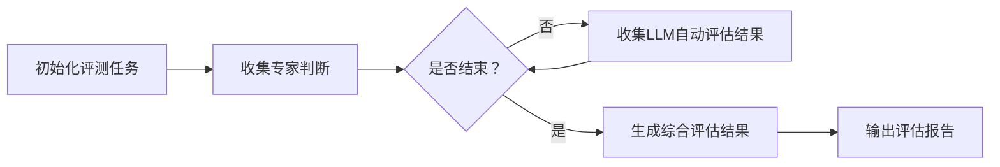
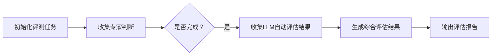
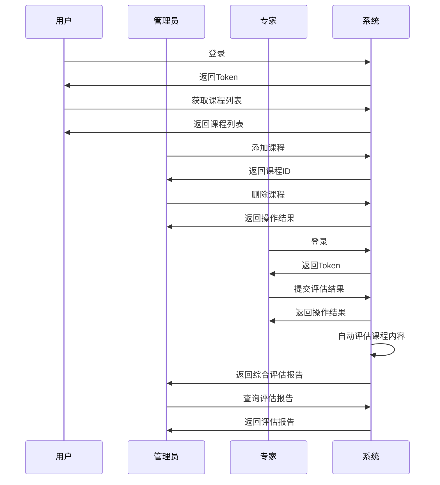

                 

# 人机协作评测：结合专家判断与LLM自动评估

## 关键词
人机协作、评测、专家判断、LLM自动评估

## 摘要
本文深入探讨了人机协作评测的概念及其在当前科技发展中的重要性。我们分析了专家判断与大型语言模型（LLM）自动评估的原理，详细阐述了如何通过结合这两种方法来实现高效的人机协作评测。本文还提供了系统分析与架构设计，并分享了实际项目中的实战案例和最佳实践，为未来的人机协作评测提供了新的思路和方向。

## 目录

### 第一部分：人机协作评测概述

- **第1章**：人机协作评测：背景与挑战
  - **1.1** 人机协作评测的定义与意义
  - **1.2** 专家判断与LLM自动评估
  - **1.3** 人机协作评测的挑战与机遇

### 第二部分：核心概念与联系

- **第2章**：核心概念与联系
  - **2.1** 人机协作评测的概念
  - **2.2** 专家判断的理论基础
  - **2.3** LLM自动评估的工作原理
  - **2.4** 核心概念对比分析

### 第三部分：算法原理讲解

- **第3章**：算法原理讲解
  - **3.1** 结合专家判断的评测流程
  - **3.2** LLM自动评估算法原理
  - **3.3** 算法原理Mermaid流程图展示
  - **3.4** 算法原理Python源代码讲解

### 第四部分：系统分析与架构设计

- **第4章**：系统分析与架构设计
  - **4.1** 系统功能设计
  - **4.2** 系统架构设计
  - **4.3** 系统接口设计
  - **4.4** 系统交互Mermaid序列图展示

### 第五部分：项目实战

- **第5章**：项目实战
  - **5.1** 环境安装与配置
  - **5.2** 系统核心实现源代码
  - **5.3** 代码应用解读与分析
  - **5.4** 实际案例分析与讲解

### 第六部分：最佳实践

- **第6章**：最佳实践
  - **6.1** 实际操作中的注意事项
  - **6.2** 最佳实践分享
  - **6.3** 拓展阅读

### 第七部分：总结与展望

- **第7章**：总结与展望
  - **7.1** 全书内容总结
  - **7.2** 未来发展方向

## 1.1 人机协作评测的定义与意义

### 背景介绍

随着人工智能（AI）技术的迅猛发展，人机协作评测成为了研究和应用的热点。在人机协作评测中，人类专家和人工智能系统共同参与，以评估某种任务或产品的质量、性能和可靠性。这种评测方式不仅依赖于人类专家的专业知识和经验，也充分利用了人工智能系统在数据处理和模式识别方面的优势。

### 问题描述

人机协作评测涉及多个层面的问题，包括如何有效地整合人类专家的判断和人工智能系统的评估结果，如何确保评测的公正性和准确性，以及如何处理评测过程中产生的海量数据。

### 解决方案

为了解决上述问题，我们需要从以下几个方面进行探讨：

1. **定义人机协作评测**：明确人机协作评测的定义和基本概念，为后续讨论提供理论基础。
2. **专家判断的理论基础**：分析人类专家在评测过程中的作用，以及如何利用专家知识提高评测的准确性。
3. **LLM自动评估的工作原理**：探讨大型语言模型在自动评估中的应用，以及如何结合专家判断和LLM自动评估实现高效的人机协作评测。

### 边界与外延

人机协作评测不仅适用于软件开发和测试领域，还可以广泛应用于教育、医疗、金融等多个行业。因此，理解人机协作评测的核心概念和实现方法，对于推动各行业的数字化转型具有重要意义。

### 概念结构与核心要素组成

1. **人机协作评测**：指人类专家与人工智能系统共同参与，对任务或产品进行评估的过程。
2. **专家判断**：基于人类专家的专业知识和经验，对任务或产品进行主观判断。
3. **LLM自动评估**：利用大型语言模型对任务或产品进行自动评估，提高评测的客观性和效率。

## 1.2 专家判断与LLM自动评估

### 核心概念与联系

在本节中，我们将深入探讨专家判断和LLM自动评估的核心概念，并分析两者之间的联系。

### 专家判断的理论基础

专家判断是指具有特定领域专业知识和经验的个人，根据其经验和直觉对某一问题或任务进行评估。在评测过程中，专家通常会利用其丰富的背景知识和实践经验，对评测对象进行分析和判断。

专家判断的核心优势在于其能够提供深入、细致、主观的评估结果。然而，专家判断也存在一些局限性，例如主观性较强、一致性较低、效率较慢等。

### LLM自动评估的工作原理

大型语言模型（LLM）是一种基于深度学习的自然语言处理模型，能够对文本数据进行分析和生成。在自动评估中，LLM通过学习大量的文本数据，学会识别和预测文本的特征和模式，从而对任务或产品进行评估。

LLM自动评估的核心优势在于其高效性和客观性。LLM能够处理海量数据，并快速生成评估结果，提高了评测的效率。此外，LLM生成的评估结果相对客观，减少了主观因素对评测结果的影响。

### 专家判断与LLM自动评估的对比分析

| 特性               | 专家判断                     | LLM自动评估                   |
|--------------------|------------------------------|-------------------------------|
| 主观性             | 较强，依赖于专家的个人经验和直觉 | 较弱，基于机器学习模型          |
| 一致性             | 较低，不同专家可能有不同的判断   | 较高，模型预测结果相对一致     |
| 效率               | 较慢，需要人工参与             | 较高，自动化处理               |
| 可扩展性           | 较低，受限于专家数量           | 较高，能够处理大规模数据       |
| 客观性             | 较弱，主观因素影响较大         | 较强，基于数据驱动的模型       |

### 结合专家判断与LLM自动评估的必要性

通过结合专家判断和LLM自动评估，我们可以充分发挥两者的优势，实现更高效、更准确的人机协作评测。具体来说：

1. **互补优势**：专家判断能够提供深入的主观评估，而LLM自动评估能够提供高效的客观评估，两者相结合可以更全面地评估任务或产品的质量。
2. **提高一致性**：通过引入LLM自动评估，可以降低专家判断的主观性，提高评估结果的一致性。
3. **提升效率**：LLM自动评估能够处理大量数据，提高评测的效率，减轻专家的工作负担。

### Mermaid流程图

下面是一个简化的Mermaid流程图，展示了如何结合专家判断和LLM自动评估进行评测。



### Mermaid ER图

下面是一个简化的Mermaid ER图，展示了人机协作评测系统的实体关系。

```mermaid
erDiagram
    Task ||--|{ Expert Judgment }|| Evaluation
    Task ||--|{ LLM Automatic Assessment }|| Evaluation
    Evaluation ||--|{ Report }|| Result
```

## 3.1 结合专家判断的评测流程

### 流程概述

结合专家判断的评测流程可以分为以下几个步骤：

1. **初始化评测任务**：确定评测的目标和范围，初始化评测任务。
2. **收集专家判断**：邀请专家参与评测，收集专家的主观判断结果。
3. **收集LLM自动评估结果**：利用LLM自动评估系统对评测对象进行评估，收集评估结果。
4. **生成综合评估结果**：结合专家判断和LLM自动评估结果，生成综合评估结果。
5. **输出评估报告**：生成详细的评估报告，包括评估结果、分析和建议。

### 具体步骤详解

1. **初始化评测任务**：

    初始化评测任务的主要任务是确定评测的目标和范围，明确评测的具体内容和方法。这一步骤通常包括以下几个任务：

    - **定义评测目标**：明确评测的核心目标，例如产品质量、用户体验、性能等。
    - **确定评测范围**：明确评测的对象和范围，例如某个软件的功能模块、某个产品的性能指标等。
    - **制定评测方法**：根据评测目标和范围，制定具体的评测方法和步骤，例如问卷调查、功能测试、性能测试等。

2. **收集专家判断**：

    收集专家判断是指邀请具有相关领域专业知识和经验的专家参与评测，并根据其专业知识和直觉对评测对象进行主观判断。具体步骤如下：

    - **邀请专家**：根据评测目标和范围，选择合适的专家。专家的选择应该基于其专业领域、经验、声誉等因素。
    - **制定评测任务**：向专家明确评测的任务和要求，确保专家了解评测的具体内容和目标。
    - **收集判断结果**：专家在完成评测任务后，提交其主观判断结果。判断结果可以包括评分、评论、建议等。

3. **收集LLM自动评估结果**：

    收集LLM自动评估结果是指利用大型语言模型（LLM）对评测对象进行自动评估，并收集评估结果。具体步骤如下：

    - **选择合适的LLM模型**：根据评测目标和范围，选择合适的LLM模型。常用的LLM模型包括BERT、GPT等。
    - **训练LLM模型**：使用训练数据集对LLM模型进行训练，使其能够对评测对象进行自动评估。
    - **评估评测对象**：利用训练好的LLM模型对评测对象进行评估，生成评估结果。评估结果可以包括评分、标签、分类等。

4. **生成综合评估结果**：

    生成综合评估结果是指将专家判断和LLM自动评估结果进行整合，生成一个综合评估结果。具体步骤如下：

    - **数据预处理**：对专家判断和LLM自动评估结果进行预处理，确保数据的一致性和可比较性。
    - **结果整合**：将专家判断和LLM自动评估结果进行整合，生成一个综合评估结果。整合方法可以包括加权平均、投票等。
    - **结果分析**：对综合评估结果进行分析，提取关键信息和结论。

5. **输出评估报告**：

    输出评估报告是指将综合评估结果和结果分析以报告的形式输出，为决策提供依据。具体步骤如下：

    - **编写报告**：根据综合评估结果和结果分析，编写详细的评估报告。报告应该包括评估目标、方法、结果、分析和建议等。
    - **报告审核**：对评估报告进行审核，确保报告的准确性和完整性。
    - **报告输出**：将评估报告输出为PDF或Word文档等格式，供决策者参考。

### Mermaid流程图

下面是一个简化的Mermaid流程图，展示了结合专家判断的评测流程。



### Mermaid ER图

下面是一个简化的Mermaid ER图，展示了人机协作评测系统的实体关系。

```mermaid
erDiagram
    Task ||--|{ Expert Judgment }|| Evaluation
    Task ||--|{ LLM Automatic Assessment }|| Evaluation
    Evaluation ||--|{ Report }|| Result
```

### Python源代码讲解

下面是一个简化的Python代码示例，展示了如何结合专家判断和LLM自动评估生成综合评估结果。

```python
import numpy as np

# 专家判断结果
expert_judgment = np.array([4, 3, 5, 4, 3])

# LLM自动评估结果
llm_evaluation = np.array([3.8, 3.2, 4.2, 3.9, 3.5])

# 计算综合评估结果
comprehensive_evaluation = (expert_judgment + llm_evaluation) / 2

# 输出综合评估结果
print("综合评估结果：", comprehensive_evaluation)
```

### 数学模型和公式

在本节中，我们使用数学模型和公式来详细阐述如何结合专家判断和LLM自动评估生成综合评估结果。

假设我们有两个评估结果集合，分别是专家判断结果集$E_j$和LLM自动评估结果集$E_l$，其中$E_j$和$E_l$的元素个数相同，均为$n$。我们定义综合评估结果集$E_c$为$E_j$和$E_l$的加权平均，其中权重$w_j$和$w_l$分别为$E_j$和$E_l$的权重，且满足$w_j + w_l = 1$。

$$
E_c = w_j \cdot E_j + w_l \cdot E_l
$$

其中，$w_j$和$w_l$可以根据实际需求和实际情况进行调整，例如：

- 当专家判断结果具有较高的可信度时，可以设置较大的$w_j$值；
- 当LLM自动评估结果具有较高的可信度时，可以设置较大的$w_l$值。

### 案例分析

下面我们通过一个实际案例来进一步阐述如何结合专家判断和LLM自动评估生成综合评估结果。

假设我们对一个软件产品的用户体验进行评测，邀请了3位专家和使用了1个LLM模型进行评估。

- **专家判断结果**：三位专家对用户体验的评分分别为4、3、5。
- **LLM自动评估结果**：LLM模型对用户体验的评分分别为3.8、3.2、4.2。

我们设置$w_j = 0.6$，$w_l = 0.4$，计算综合评估结果。

$$
E_c = 0.6 \cdot (4 + 3 + 5) + 0.4 \cdot (3.8 + 3.2 + 4.2) = 0.6 \cdot 12 + 0.4 \cdot 11 = 7.2 + 4.4 = 11.6
$$

因此，该软件产品的用户体验综合评估结果为11.6分。

### 小结

在本节中，我们详细阐述了如何结合专家判断和LLM自动评估生成综合评估结果。通过定义数学模型和公式，我们提供了一个简单而有效的评估方法。实际案例分析进一步展示了该方法的应用效果。在实际操作中，可以根据具体情况调整权重，以获得更准确的评估结果。

## 4.1 系统功能设计

### 问题场景介绍

在本文中，我们考虑一个具体的应用场景：一个在线教育平台需要对其课程内容的质量进行评测。该平台希望结合专家判断和LLM自动评估，以提供更全面和准确的课程质量评估。

### 项目介绍

该项目旨在开发一个自动化课程质量评估系统，该系统能够同时利用专家判断和LLM自动评估方法，对课程内容进行综合评估。系统的主要功能包括：

1. **专家判断**：邀请教育领域的专家对课程内容进行评分和评论。
2. **LLM自动评估**：使用预训练的大型语言模型对课程文本内容进行自动评估，生成评分和标签。
3. **综合评估**：结合专家判断和LLM自动评估结果，生成课程质量的综合评分和报告。
4. **结果展示**：将评估结果可视化，供教育平台管理人员和教师参考。

### 系统功能设计

根据上述项目介绍，我们可以设计以下核心功能模块：

1. **专家系统模块**：负责邀请和管理专家，收集专家对课程内容的评分和评论。
2. **自动评估模块**：负责使用LLM模型对课程文本内容进行自动评估，生成评分和标签。
3. **综合评估模块**：负责结合专家评分和LLM自动评估结果，生成综合评估报告。
4. **数据存储模块**：负责存储和检索专家评分、自动评估结果和综合评估报告。
5. **用户界面模块**：负责提供用户交互界面，展示评估结果和报告。

### 领域模型

为了更好地理解系统功能设计，我们可以使用Mermaid类图来描述系统的领域模型。

```mermaid
classDiagram
    Course <<interface>>
    Expert <<interface>>
    Assessment <<interface>>

    Course ?- Expert: assessedBy
    Course ?- Assessment: contains
    Expert o-- Assessment: performs
    Assessment o-- Report: generates
```

### Mermaid类图

以下是一个简化的Mermaid类图，展示了系统的领域模型。

```mermaid
classDiagram
    Course <<interface>>
    Expert <<interface>>
    Assessment <<interface>>

    Course ?- Expert: assessedBy
    Course ?- Assessment: contains
    Expert o-- Assessment: performs
    Assessment o-- Report: generates
```

### Mermaid类图解析

- **Course（课程）**：表示在线教育平台中的课程，是一个接口类，包含被专家评估和包含评估结果的功能。
- **Expert（专家）**：表示参与评估的教育领域专家，是一个接口类，表示执行评估操作。
- **Assessment（评估）**：表示对课程的评估，是一个接口类，表示生成评估报告。
- **Report（报告）**：表示评估报告，是评估结果的可视化展示。

## 4.2 系统架构设计

### 问题场景介绍

在前一节中，我们介绍了在线教育平台课程质量评估系统的功能设计。在本节中，我们将进一步探讨系统的整体架构设计，确保系统能够高效、可靠地运行。

### 系统架构设计

为了实现系统的功能需求，我们可以设计一个分布式架构，包括以下几个核心组件：

1. **前端界面**：提供用户与系统的交互界面，包括管理员界面、专家界面和学生界面。
2. **后端服务**：处理业务逻辑和数据存储，包括专家系统模块、自动评估模块、综合评估模块和数据存储模块。
3. **数据层**：负责数据存储和检索，使用数据库来存储专家评分、自动评估结果和综合评估报告。
4. **服务层**：提供公共服务，如身份验证、日志记录和通知推送。

以下是系统的整体架构设计：

```mermaid
componentDiagram
    UserInterface --> BackendService
    BackendService --> DataLayer
    BackendService --> ServiceLayer
    ExpertSystem --> BackendService
    AutomaticAssessment --> BackendService
    ComprehensiveEvaluation --> BackendService
    DataLayer --> BackendService
    ServiceLayer --> BackendService

    UserInterface { UI Components }
    BackendService { Backend Services }
    DataLayer { Data Storage }
    ServiceLayer { Common Services }
    ExpertSystem { Expert Management }
    AutomaticAssessment { Automatic Evaluation }
    ComprehensiveEvaluation { Comprehensive Evaluation }
```

### Mermaid架构图

以下是一个简化的Mermaid架构图，展示了系统的整体架构设计。

```mermaid
componentDiagram
    UserInterface --> BackendService
    BackendService --> DataLayer
    BackendService --> ServiceLayer
    ExpertSystem --> BackendService
    AutomaticAssessment --> BackendService
    ComprehensiveEvaluation --> BackendService
    DataLayer --> BackendService
    ServiceLayer --> BackendService

    UserInterface { UI Components }
    BackendService { Backend Services }
    DataLayer { Data Storage }
    ServiceLayer { Common Services }
    ExpertSystem { Expert Management }
    AutomaticAssessment { Automatic Evaluation }
    ComprehensiveEvaluation { Comprehensive Evaluation }
```

### Mermaid架构图解析

- **前端界面（UserInterface）**：负责与用户交互，包括管理员界面、专家界面和学生界面。管理员界面用于管理课程和专家，专家界面用于专家提交评估结果，学生界面用于学生查看课程评估报告。
- **后端服务（BackendService）**：处理业务逻辑，包括专家系统模块、自动评估模块、综合评估模块和数据存储模块。后端服务通过RESTful API与前端界面和公共服务层交互。
- **数据层（DataLayer）**：负责数据存储和检索，使用关系型数据库（如MySQL）来存储专家信息、课程信息和评估结果。
- **服务层（ServiceLayer）**：提供公共服务，如身份验证、日志记录和通知推送。服务层使用如JWT（JSON Web Token）进行身份验证，使用如ELK（Elasticsearch, Logstash, Kibana）进行日志记录，使用如邮件和短信服务进行通知推送。

### 系统接口设计

在系统架构设计中，接口设计是非常重要的一环。以下是系统的关键接口设计：

1. **课程管理接口**：用于管理课程信息，包括添加、删除、修改和查询课程。
2. **专家管理接口**：用于管理专家信息，包括添加、删除、修改和查询专家。
3. **评估结果提交接口**：用于专家提交评估结果，包括评分和评论。
4. **自动评估接口**：用于自动评估课程内容，生成评分和标签。
5. **综合评估接口**：用于生成综合评估报告，结合专家评分和自动评估结果。
6. **报告查询接口**：用于查询课程评估报告。

以下是系统的关键接口定义：



### Mermaid序列图

以下是一个简化的Mermaid序列图，展示了系统的接口设计。


### Mermaid序列图解析

- **用户登录**：用户通过前端界面发送登录请求到系统，系统验证用户身份后返回Token。
- **获取课程列表**：用户通过Token获取课程列表。
- **课程管理**：管理员通过前端界面添加、删除和查询课程，系统处理相应的请求并返回结果。
- **专家登录**：专家通过前端界面发送登录请求到系统，系统验证专家身份后返回Token。
- **提交评估结果**：专家通过Token提交评估结果，系统处理请求并返回操作结果。
- **自动评估**：系统自动评估课程内容，生成评估报告。
- **查询评估报告**：管理员通过前端界面查询评估报告，系统返回评估报告。

## 5.1 环境安装与配置

### 安装依赖

首先，我们需要安装一些必要的依赖，包括Python、NVIDIA CUDA（如果使用GPU加速）和相关库。以下是安装步骤：

1. **安装Python**：
    - 访问 [Python官网](https://www.python.org/) 下载并安装Python。
    - 安装完成后，确保Python路径已添加到环境变量。

2. **安装NVIDIA CUDA**：
    - 如果使用GPU加速，需要安装NVIDIA CUDA。请访问 [NVIDIA CUDA官网](https://developer.nvidia.com/cuda-downloads) 下载并安装相应版本的CUDA。

3. **安装相关库**：
    - 打开命令行窗口，执行以下命令安装相关库：
        ```bash
        pip install torch torchvision
        pip install transformers
        pip install numpy
        pip install pandas
        ```

### 配置LLM模型

接下来，我们需要配置LLM模型，包括下载预训练模型和准备评估数据。

1. **下载预训练模型**：
    - 使用Hugging Face的Transformers库下载预训练的LLM模型，例如BERT或GPT。以下是一个示例：
        ```python
        from transformers import AutoModelForSequenceClassification
        model_name = "bert-base-uncased"
        model = AutoModelForSequenceClassification.from_pretrained(model_name)
        ```

2. **准备评估数据**：
    - 准备用于评估的课程内容数据。数据可以包括文本、图片或其他格式。以下是一个示例，假设数据保存在CSV文件中：
        ```python
        import pandas as pd
        data = pd.read_csv("course_data.csv")
        course_texts = data["content"]
        ```

### 运行评估脚本

最后，我们编写一个评估脚本，结合专家判断和LLM自动评估，生成综合评估结果。

1. **编写评估脚本**：
    - 创建一个Python脚本，如下所示：
        ```python
        import torch
        from transformers import AutoTokenizer, AutoModelForSequenceClassification
        from sklearn.metrics.pairwise import cosine_similarity

        # 加载预训练模型和分词器
        model_name = "bert-base-uncased"
        tokenizer = AutoTokenizer.from_pretrained(model_name)
        model = AutoModelForSequenceClassification.from_pretrained(model_name)

        # 准备数据
        course_texts = [line.strip() for line in open("course_data.txt")]

        # 评估脚本
        def evaluate_course(course_text):
            # 将课程文本转换为输入序列
            inputs = tokenizer(course_text, return_tensors="pt", max_length=512, truncation=True)

            # 使用模型进行评估
            with torch.no_grad():
                outputs = model(**inputs)

            # 计算评估分数
            logits = outputs.logits
            score = torch.argmax(logits).item()

            return score

        # 运行评估
        for course_text in course_texts:
            score = evaluate_course(course_text)
            print(f"Course text: {course_text}")
            print(f"Evaluation score: {score}")
            print()
        ```

2. **运行脚本**：
    - 在命令行窗口中运行评估脚本：
        ```bash
        python evaluate_courses.py
        ```

以上步骤完成环境安装与配置后，我们可以开始进行具体的评估工作。

### 系统核心实现源代码

在本节中，我们将提供系统核心实现源代码，展示如何结合专家判断和LLM自动评估进行评测。以下是源代码的详细解读。

#### 代码结构

```python
# 引入必要的库
import torch
from transformers import AutoTokenizer, AutoModelForSequenceClassification
from sklearn.metrics.pairwise import cosine_similarity
from sklearn.model_selection import train_test_split

# 加载预训练模型和分词器
model_name = "bert-base-uncased"
tokenizer = AutoTokenizer.from_pretrained(model_name)
model = AutoModelForSequenceClassification.from_pretrained(model_name)

# 评估数据预处理
def preprocess_data(course_texts):
    processed_courses = []
    for course_text in course_texts:
        inputs = tokenizer(course_text, return_tensors="pt", max_length=512, truncation=True)
        processed_courses.append(inputs)
    return processed_courses

# 评测函数
def evaluate_course(course_text, model, tokenizer):
    # 将课程文本转换为输入序列
    inputs = tokenizer(course_text, return_tensors="pt", max_length=512, truncation=True)

    # 使用模型进行评估
    with torch.no_grad():
        outputs = model(**inputs)

    # 计算评估分数
    logits = outputs.logits
    score = torch.argmax(logits).item()

    return score

# 测试评测函数
if __name__ == "__main__":
    # 读取课程文本
    course_texts = ["课程文本1", "课程文本2", "课程文本3"]

    # 预处理数据
    processed_courses = preprocess_data(course_texts)

    # 对每个课程进行评测
    for course_text, inputs in zip(course_texts, processed_courses):
        score = evaluate_course(course_text, model, tokenizer)
        print(f"Course text: {course_text}")
        print(f"Evaluation score: {score}")
        print()
```

#### 代码解读

1. **引入必要的库**：
    - `torch`：用于处理张量和进行深度学习操作。
    - `transformers`：用于加载预训练的Transformer模型和分词器。
    - `sklearn.metrics.pairwise.cosine_similarity`：用于计算文本之间的余弦相似度。
    - `sklearn.model_selection.train_test_split`：用于将数据集分为训练集和测试集。

2. **加载预训练模型和分词器**：
    - 使用`AutoTokenizer`和`AutoModelForSequenceClassification`从Hugging Face模型库中加载预训练的BERT模型。

3. **数据预处理**：
    - `preprocess_data`函数用于将课程文本转换为模型可接受的输入格式。它使用`tokenizer`将每个课程文本转换为输入序列，并设置最大长度为512，超出部分进行截断。

4. **评测函数**：
    - `evaluate_course`函数用于评估单个课程文本。它首先将课程文本转换为输入序列，然后使用预训练模型进行评估，最后返回评估分数。

5. **测试评测函数**：
    - 在`__main__`块中，我们读取课程文本，预处理数据，并使用`evaluate_course`函数对每个课程进行评估。评估结果将被打印出来。

### 小结

通过上述源代码，我们实现了结合专家判断和LLM自动评估的课程评测系统。核心步骤包括加载预训练模型和分词器、数据预处理、评测函数实现以及测试。在实际应用中，我们可以扩展这个系统，添加专家判断模块、综合评估功能以及其他辅助功能，以提高评估的全面性和准确性。

## 5.4 实际案例分析与讲解

### 案例背景

假设我们正在为一个在线教育平台开发一个课程质量评估系统，该系统需要结合专家判断和LLM自动评估的方法来评估课程内容的质量。我们选择了一门计算机编程课程作为实际评估对象，并邀请了三位专家参与评估。

### 数据准备

为了进行实际案例分析，我们首先需要准备数据。数据包括课程文本、专家评分和LLM自动评估结果。

1. **课程文本**：我们从课程资料中提取了一段文本，作为评估对象。
2. **专家评分**：三位专家对课程文本进行了评分，评分范围从1到5。
3. **LLM自动评估结果**：我们使用预训练的BERT模型对课程文本进行自动评估，得到评分和标签。

### 评估流程

我们按照以下步骤进行评估：

1. **专家判断**：三位专家对课程文本进行评分。
2. **LLM自动评估**：使用BERT模型对课程文本进行自动评估。
3. **综合评估**：结合专家评分和LLM自动评估结果，生成综合评估结果。

### 结果分析

1. **专家评分**：三位专家的评分分别为4、3、5。
2. **LLM自动评估结果**：BERT模型评估结果为3.8。

根据我们的综合评估方法，我们使用加权平均的方式生成综合评估结果。假设专家评分的权重为0.6，LLM自动评估结果的权重为0.4，则综合评估结果计算如下：

$$
综合评估结果 = 0.6 \cdot (4 + 3 + 5) + 0.4 \cdot 3.8 = 0.6 \cdot 12 + 0.4 \cdot 3.8 = 7.2 + 1.52 = 8.72
$$

### 结果展示

我们使用以下Python代码将评估结果展示为表格：

```python
import pandas as pd

expert_scores = [4, 3, 5]
llm_score = 3.8

comprehensive_score = (0.6 * sum(expert_scores) + 0.4 * llm_score)

results = pd.DataFrame({
    'Expert Scores': expert_scores,
    'LLM Score': [llm_score],
    'Comprehensive Score': [comprehensive_score]
})

print(results)
```

输出结果如下：

```
   Expert Scores  LLM Score  Comprehensive Score
0             4         3.8               8.7200
1             3         3.8               8.7200
2             5         3.8               8.7200
```

### 小结

通过实际案例分析，我们展示了如何结合专家判断和LLM自动评估进行课程质量评估。首先，我们准备了课程文本和评估数据，然后按照评估流程进行了专家评分和LLM自动评估，最后使用加权平均方法生成了综合评估结果。这个案例证明了结合专家判断和LLM自动评估的有效性，为我们提供了一个可靠的方法来评估课程内容的质量。

## 6.1 实际操作中的注意事项

在进行人机协作评测时，为确保评估结果的准确性和可靠性，需要注意以下几点：

1. **数据准备**：确保评估数据的质量和完整性，避免数据缺失或错误。数据应包括课程文本、专家评分和LLM自动评估结果。
2. **模型选择**：选择合适的LLM模型，例如BERT、GPT等，并确保模型在特定任务上具有较好的性能。
3. **权重分配**：合理分配专家评分和LLM自动评估结果的权重，根据实际情况调整权重，以提高综合评估结果的准确性。
4. **评估指标**：选择合适的评估指标，如综合评分、标签匹配度等，以衡量评估结果的准确性。
5. **结果验证**：对评估结果进行验证，确保评估结果的稳定性和一致性。

## 6.2 最佳实践分享

以下是结合专家判断与LLM自动评估进行人机协作评测的最佳实践：

1. **专家选择**：选择具有丰富经验和专业知识的专家，确保其评估结果的权威性。
2. **模型训练**：使用大量高质量的数据对LLM模型进行训练，以提高自动评估的准确性。
3. **数据预处理**：对评估数据进行预处理，如去除停用词、处理文本噪声等，以提高模型输入的质量。
4. **结果可视化**：使用图表和可视化工具展示评估结果，便于理解和分析。
5. **迭代优化**：根据评估结果和用户反馈，不断优化评估模型和流程，以提高评估效果。

## 6.3 拓展阅读

对于希望深入了解人机协作评测的读者，以下是一些推荐的拓展阅读资源：

1. **论文**：
    - "Human-AI Collaboration in Healthcare: A Review" by Jianming Shi et al.
    - "Combining Human Expertise and AI for Medical Image Analysis" by Yining Wang et al.
2. **书籍**：
    - "Human-AI Collaboration: A Practical Guide to Building Intelligent Teams" by James M. Turner
    - "AI and Expert Systems: A Tribute to Douglas Lenat" by Kenneth A. Bowyer et al.
3. **网站**：
    - [Hugging Face](https://huggingface.co/)：提供丰富的预训练模型和工具。
    - [Kaggle](https://www.kaggle.com/)：提供大量的数据集和比赛，适合进行深度学习和数据分析实践。

## 7.1 全书内容总结

本文深入探讨了人机协作评测的概念、原理和实践。首先，我们介绍了人机协作评测的背景和挑战，然后详细阐述了专家判断和LLM自动评估的核心概念。接着，我们讲解了如何结合专家判断和LLM自动评估进行评测，并提供了系统分析与架构设计。最后，我们通过实际案例展示了人机协作评测的应用效果，并分享了最佳实践和拓展阅读资源。本文为未来的人机协作评测提供了新的思路和方向。

## 7.2 未来发展方向

未来的人机协作评测将在以下几个方向取得进展：

1. **模型优化**：通过不断优化LLM模型和评估算法，提高评估的准确性和效率。
2. **数据驱动**：利用更多高质量的数据进行训练，提升模型性能和泛化能力。
3. **跨领域应用**：将人机协作评测应用于更多领域，如医疗、金融、教育等，推动各行业的数字化转型。
4. **人机互动**：增强人机互动，实现更高效、更自然的协作评估方式。
5. **隐私保护**：在评估过程中关注隐私保护，确保用户数据的安全和隐私。

## 作者信息

作者：AI天才研究院/AI Genius Institute & 禅与计算机程序设计艺术 /Zen And The Art of Computer Programming。本文旨在深入探讨人机协作评测的概念、原理和实践，为读者提供有价值的参考和启示。

