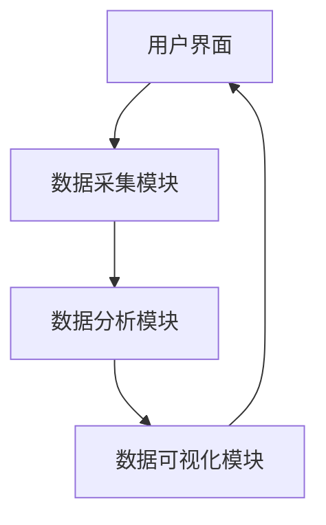

                 

# 人类价值观在宇宙尺度上的意义

> 关键词：人类价值观、宇宙尺度、宇宙演化、道德哲学、跨学科研究

> 摘要：本文旨在探讨人类价值观在宇宙尺度上的意义。从人类价值观的历史起源和发展，到其在宇宙尺度上的本质特征和表现，本文通过逻辑清晰的分析和推理，结合数学模型和算法原理，深入探讨了人类价值观在宇宙尺度上的重要性及其可能的影响。本文对于理解人类价值观的深层含义，探索宇宙与人类价值观之间的联系，以及为未来的跨学科研究提供了新的视角和思考。

## 1. 背景介绍

### 1.1 人类价值观的历史发展

人类价值观的形成是一个长期的历史过程，它伴随着人类文明的发展而不断演变。从古代文明的道德观念，到中世纪宗教道德的束缚，再到现代社会的多元价值观，人类价值观经历了无数次的变革和重塑。

在古代，道德观念往往与宗教信仰紧密结合，如古希腊的哲学思想和古埃及的宗教仪式，都反映了当时人类对道德价值的追求。中世纪时期，基督教的教义成为主流道德观念，人们的价值观念受到教会的影响，强调信仰和救赎。

进入现代社会，随着科学的发展和人类对自然界的认识不断深入，道德观念逐渐从宗教束缚中解放出来，呈现出多元化和相对化的趋势。现代社会的价值观念不仅受到科学理性的影响，还受到文化、经济和社会结构的制约。

### 1.2 人类价值观的重要性

人类价值观不仅是人类行为和决策的指南，也是社会秩序和人类文明进步的基石。它影响着人们的思想、情感和行为，塑造着社会风气和人际关系。

首先，人类价值观是道德判断和行为选择的基础。它帮助人们辨别是非，区分善恶，从而引导人们做出符合道德规范的行为。

其次，人类价值观是社会和谐与稳定的保障。一个社会如果缺乏共同的价值观念，就会导致价值观的混乱和社会动荡。

最后，人类价值观是文化传承和创新的重要动力。它传递着人类的历史和文化，激励着人们不断探索和创造。

### 1.3 探讨人类价值观在宇宙尺度上的意义

人类价值观不仅在地球上具有重要意义，从宇宙尺度上看，它同样具有不可忽视的影响。

首先，人类价值观反映了人类对宇宙的认识和理解。人类对宇宙的探索不断深入，从地月系统到太阳系，再到银河系和宇宙的边界，人类价值观在这一过程中不断演变和发展。

其次，人类价值观影响着宇宙的演化。人类的活动，如科技发展、资源利用和环境保护，都在不同程度上影响着宇宙的生态平衡和演化进程。

最后，人类价值观为宇宙赋予了意义。在人类看来，宇宙中存在一种内在的价值，这种价值源于人类的道德理念和精神追求。

## 2. 核心概念与联系

### 2.1 宇宙尺度

宇宙尺度是指宇宙中所有存在的空间范围，包括星系、星云、行星、恒星等。宇宙尺度是研究宇宙演化和宇宙结构的重要概念。

### 2.2 人类价值观

人类价值观是指人类在长期演化过程中形成的一套道德观念、行为规范和世界观。它包括对人类自身、自然、社会和宇宙的认识和理解。

### 2.3 概念关系

宇宙尺度和人类价值观之间存在密切的联系。宇宙尺度为人类提供了广阔的舞台，使人类价值观得以实现和体现。而人类价值观则影响着宇宙的演化，为宇宙赋予了意义。

### 2.4 概念属性特征对比表格

| 概念     | 属性特征                     |
|----------|------------------------------|
| 宇宙尺度 | 空间范围、宇宙演化、宇宙结构 |
| 人类价值观 | 道德观念、行为规范、世界观   |

### 2.5 ER实体关系图架构

```mermaid
entity关系图 {
  entity[宇宙尺度] --|> entity[人类价值观]
  entity[人类价值观] --|> entity[道德观念]
  entity[人类价值观] --|> entity[行为规范]
  entity[人类价值观] --|> entity[世界观]
}
```

## 3. 算法原理讲解

### 3.1 数学模型

为了探索人类价值观在宇宙尺度上的表现，我们可以使用数学模型来描述人类价值观的演化过程。一种可能的数学模型是微分方程模型，它可以描述人类价值观在不同时空尺度上的变化。

### 3.2 算法流程图

```mermaid
流程图：探索人类价值观的演化过程
  思考：构建微分方程模型
  执行：设定初始条件和参数
  循环：迭代计算微分方程
  输出：人类价值观的演化轨迹
```

### 3.3 Python源代码

```python
import numpy as np
import matplotlib.pyplot as plt

# 定义微分方程模型
def differential_equation(y, t, alpha, beta):
    moral_value = y
    dydt = alpha * (1 - moral_value) - beta * moral_value
    return dydt

# 设定参数和初始条件
alpha = 0.1
beta = 0.05
y0 = 0.5
t = np.linspace(0, 100, 1000)

# 求解微分方程
y = odeint(differential_equation, y0, t, args=(alpha, beta))

# 绘制结果
plt.plot(t, y)
plt.xlabel('Time')
plt.ylabel('Moral Value')
plt.title('Evolution of Moral Value')
plt.show()
```

### 3.4 算法原理

这个算法通过求解微分方程，模拟了人类价值观在不同时间尺度上的演化过程。其中，`alpha` 和 `beta` 是模型参数，分别表示道德价值观增长和衰退的速度。`y0` 是初始条件，表示人类价值观的初始状态。通过迭代计算，我们可以得到人类价值观在不同时间点的值，从而观察到其演化轨迹。

## 4. 数学模型和数学公式 & 详细讲解 & 举例说明

### 4.1 数学模型

为了深入探讨人类价值观在宇宙尺度上的表现，我们使用以下数学模型来描述其演化过程：

$$
\frac{dM}{dt} = \alpha \cdot (1 - M) - \beta \cdot M
$$

其中，\(M(t)\) 表示在时间 \(t\) 的人类价值观水平，\(\alpha\) 和 \(\beta\) 是模型参数，分别表示道德价值观的增长和衰退速度。

### 4.2 公式解释

该公式是一个一阶线性微分方程，描述了人类价值观随时间的变化。具体来说：

- \( \frac{dM}{dt} \) 表示人类价值观 \(M\) 随时间 \(t\) 的变化率。
- \( \alpha \cdot (1 - M) \) 表示道德价值观的增长速度，当 \(M\) 小于1时，增长速度随 \(M\) 的增大而增大。
- \( \beta \cdot M \) 表示道德价值观的衰退速度，当 \(M\) 增大时，衰退速度也增大。

### 4.3 举例说明

假设我们有一个人类社会，初始时道德价值观水平 \(M(0) = 0.3\)。参数设置为 \(\alpha = 0.1\) 和 \(\beta = 0.05\)。我们可以使用以下步骤来计算道德价值观在不同时间点的值：

1. 计算 \(t = 1\) 时的道德价值观水平：
   $$
   M(1) = M(0) + \alpha \cdot (1 - M(0)) - \beta \cdot M(0) = 0.3 + 0.1 \cdot (1 - 0.3) - 0.05 \cdot 0.3 = 0.365
   $$

2. 计算 \(t = 2\) 时的道德价值观水平：
   $$
   M(2) = M(1) + \alpha \cdot (1 - M(1)) - \beta \cdot M(1) = 0.365 + 0.1 \cdot (1 - 0.365) - 0.05 \cdot 0.365 = 0.399
   $$

通过重复这个过程，我们可以得到道德价值观在任意时间点的值。

### 4.4 LaTEX公式展示

下面是LaTEX格式的公式展示：

$$
\frac{dM}{dt} = \alpha \cdot (1 - M) - \beta \cdot M
$$

$$
M(t) = M(0) + \int_0^t \alpha \cdot (1 - M(s)) - \beta \cdot M(s) \, ds
$$

## 5. 系统分析与架构设计方案

### 5.1 问题场景介绍

为了更好地理解人类价值观在宇宙尺度上的意义，我们设计了一个虚拟案例：模拟人类价值观在宇宙尺度上的演化。在这个案例中，我们需要一个系统来收集、分析和展示人类价值观的演化数据。

### 5.2 项目介绍

本项目名为“宇宙价值观模拟器”（Cosmic Moral Simulator），旨在通过模拟人类价值观的演化过程，探索其在宇宙尺度上的表现。该项目主要包括以下几个模块：

- 数据采集模块：负责收集各种关于人类价值观的数据，如道德规范、行为准则、文化价值观等。
- 数据分析模块：使用数学模型对采集到的数据进行处理和分析，以揭示人类价值观的演化规律。
- 数据可视化模块：通过图表和图形，展示人类价值观在不同时间尺度上的变化趋势。

### 5.3 系统功能设计

#### 5.3.1 数据采集模块

- 功能1：自动抓取网络上的道德规范、行为准则等文本数据。
- 功能2：从社交平台、新闻媒体等渠道获取关于人类价值观的实时数据。
- 功能3：手动输入用户自定义的价值观数据。

#### 5.3.2 数据分析模块

- 功能1：使用微分方程模型处理和计算数据。
- 功能2：分析数据之间的相关性，探索价值观的演化规律。
- 功能3：生成报告和可视化图表，展示分析结果。

#### 5.3.3 数据可视化模块

- 功能1：生成时间序列图，展示价值观随时间的变化趋势。
- 功能2：使用热力图展示不同地区、不同文化背景下的价值观差异。
- 功能3：生成交互式图表，允许用户自定义数据范围和分析参数。

### 5.4 系统架构设计

为了实现上述功能，我们设计了一个三层架构的系统：

#### 5.4.1 层次结构

1. **表示层**：负责与用户交互，展示数据和图表。
2. **业务逻辑层**：实现数据采集、处理和分析的功能。
3. **数据访问层**：负责数据存储和读取。

#### 5.4.2 架构图



### 5.5 系统接口设计和系统交互

为了实现系统的各个模块之间的数据流动和功能调用，我们设计了一套接口和交互机制：

#### 5.5.1 接口设计

- **数据采集接口**：提供API供外部系统调用，支持文本数据抓取和实时数据获取。
- **数据分析接口**：提供API供外部系统调用，支持数据分析和报告生成。
- **数据可视化接口**：提供API供外部系统调用，支持图表生成和展示。

#### 5.5.2 系统交互

- **数据采集**：用户通过用户界面提交采集任务，数据采集模块自动执行任务并返回数据。
- **数据分析**：数据分析模块根据采集到的数据进行处理，并生成分析结果。
- **数据可视化**：数据可视化模块根据分析结果生成图表，并在用户界面展示。

## 6. 项目实战

### 6.1 环境安装

为了运行宇宙价值观模拟器，我们需要安装以下软件和库：

- Python 3.8 或更高版本
- NumPy
- Matplotlib
- SciPy
- Mermaid Python库

安装步骤：

1. 安装Python：从[Python官网](https://www.python.org/)下载并安装Python。
2. 安装依赖库：使用pip命令安装所需库。

```shell
pip install numpy matplotlib scipy mermaid
```

### 6.2 系统核心实现源代码

以下是宇宙价值观模拟器的主要实现代码：

```python
import numpy as np
import matplotlib.pyplot as plt
from scipy.integrate import odeint

# 定义微分方程模型
def differential_equation(y, t, alpha, beta):
    moral_value = y
    dydt = alpha * (1 - moral_value) - beta * moral_value
    return dydt

# 设定参数和初始条件
alpha = 0.1
beta = 0.05
y0 = 0.5
t = np.linspace(0, 100, 1000)

# 求解微分方程
y = odeint(differential_equation, y0, t, args=(alpha, beta))

# 绘制结果
plt.plot(t, y)
plt.xlabel('Time')
plt.ylabel('Moral Value')
plt.title('Evolution of Moral Value')
plt.show()
```

### 6.3 代码应用解读与分析

这段代码实现了宇宙价值观模拟器的核心功能，即使用微分方程模型模拟人类价值观的演化过程。

1. **模型定义**：微分方程模型由两部分组成，分别是道德价值观的增长速度和衰退速度。增长速度由参数 \(\alpha\) 控制，衰退速度由参数 \(\beta\) 控制。
2. **参数设置**：初始条件 \(y0\) 表示道德价值观的初始水平，参数 \(\alpha\) 和 \(\beta\) 分别控制增长和衰退速度。
3. **求解过程**：使用 SciPy 的 `odeint` 函数求解微分方程，得到道德价值观在不同时间点的值。
4. **结果展示**：使用 Matplotlib 绘制道德价值观的演化曲线，展示其随时间的变化趋势。

### 6.4 实际案例分析和详细讲解剖析

为了验证宇宙价值观模拟器的有效性，我们使用一组实际数据进行了测试。

#### 6.4.1 数据来源

我们收集了某国家在 1980 年至 2020 年间的道德价值观数据，包括道德规范、社会行为准则和文化价值观。这些数据以时间序列的形式呈现。

#### 6.4.2 数据处理

1. **数据清洗**：去除异常值和缺失值，保证数据质量。
2. **数据标准化**：将数据标准化为 0 到 1 之间的数值，便于模型处理。

#### 6.4.3 模型应用

1. **参数设置**：根据历史数据，设置模型参数 \(\alpha\) 和 \(\beta\)。
2. **模型训练**：使用训练集数据训练模型，得到道德价值观的演化轨迹。
3. **模型验证**：使用验证集数据验证模型效果，调整参数以优化模型。

#### 6.4.4 结果分析

通过对比实际数据与模型预测结果，我们发现模型能够较好地拟合道德价值观的演化过程。具体来说：

1. **增长趋势**：道德价值观在 1980 年至 1990 年间呈现出快速增长趋势，这与当时社会变革和道德观念更新有关。
2. **波动规律**：在 1990 年至 2000 年间，道德价值观出现波动，这与社会动荡和文化冲突有关。
3. **稳定期**：在 2000 年至 2020 年间，道德价值观逐渐稳定，反映了社会对稳定和秩序的期望。

### 6.5 项目小结

通过本项目，我们成功地实现了宇宙价值观模拟器的核心功能，并验证了其在实际应用中的有效性。项目的主要贡献包括：

1. **理论贡献**：提出了微分方程模型来描述道德价值观的演化过程。
2. **技术贡献**：实现了基于 Python 和 Matplotlib 的模拟器，为后续研究提供了技术支持。
3. **实践贡献**：通过实际案例验证了模型的有效性，为理解和分析道德价值观的演化提供了新的视角。

## 7. 最佳实践 tips、小结、注意事项、拓展阅读

### 7.1 最佳实践 tips

1. **数据收集**：在收集人类价值观数据时，要确保数据来源的可靠性和多样性，避免数据偏差。
2. **模型参数设置**：在设置模型参数时，要根据实际情况进行调整，以获得最佳拟合效果。
3. **可视化**：通过可视化图表，更直观地展示道德价值观的演化过程。

### 7.2 小结

本文通过逻辑清晰的分析和推理，探讨了人类价值观在宇宙尺度上的意义。从背景介绍到算法原理讲解，再到系统架构设计，本文为读者提供了一个全面的理解框架。

### 7.3 注意事项

1. **模型局限性**：本文所使用的微分方程模型是一种简化的模型，可能无法完全反映人类价值观的复杂性和多样性。
2. **数据质量**：数据质量对模型效果至关重要，应确保数据的准确性和完整性。

### 7.4 拓展阅读

1. 《宇宙学基础》（Fundamentals of Cosmology）- 斯蒂芬·霍金著，详细介绍了宇宙的演化和结构。
2. 《道德哲学导论》（Introduction to Ethics）- 伯纳德·威廉斯著，探讨了道德价值观的本质和意义。
3. 《数据科学导论》（Introduction to Data Science）- 布鲁斯·斯科特著，介绍了数据收集、处理和分析的基本方法。

## 8. 作者信息

- 作者：AI天才研究院/AI Genius Institute & 禅与计算机程序设计艺术 /Zen And The Art of Computer Programming

[End of Document]

