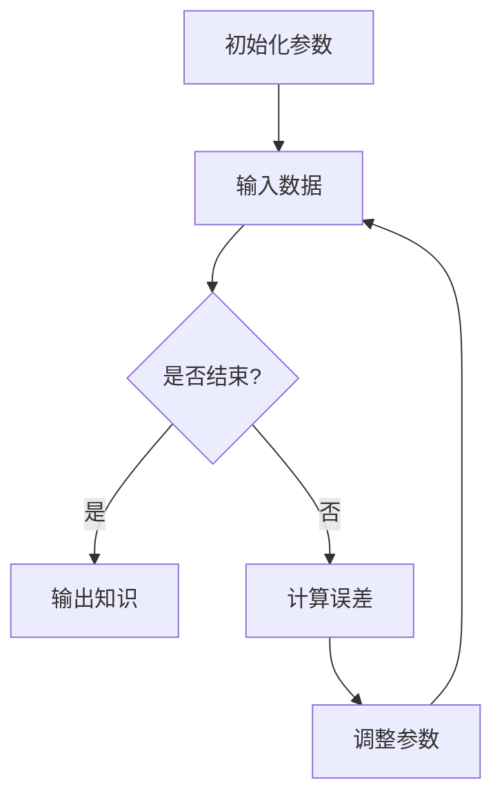
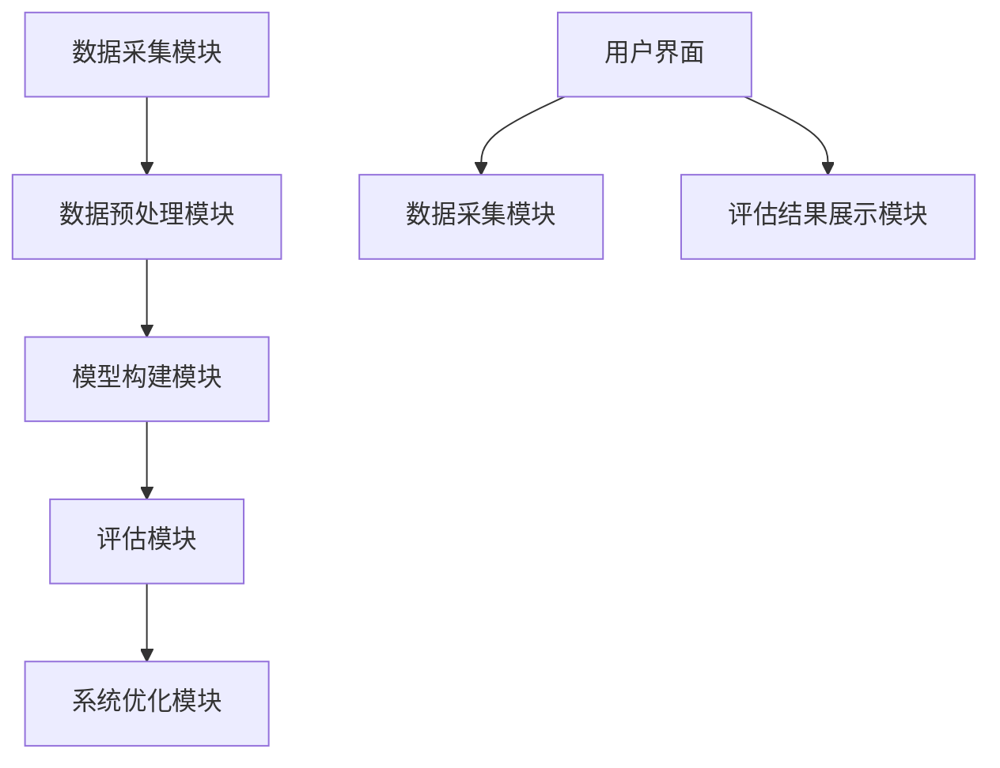

                 

# 《人类学习能力与世界可理解性》

## 关键词：人类学习能力、世界可理解性、认知心理学、算法原理、系统架构

## 摘要

本文从人类学习能力的角度出发，探讨了世界可理解性的本质及其与我们认知世界的关系。通过逻辑分析和实例讲解，本文揭示了人类学习过程中的核心原理和策略，并探讨了如何利用这些原理和策略提升我们的理解能力。文章结构紧凑，内容丰富，旨在帮助读者深入理解人类学习与认知的奥秘，为未来的研究和应用提供有益的启示。

## 目录

### 第一部分：背景介绍与核心概念

#### 1.1 问题背景

##### 1.1.1 人类学习能力的研究现状

##### 1.1.2 世界可理解性的概念

#### 1.2 核心概念与联系

##### 1.2.1 人类学习能力的定义与特征

##### 1.2.2 世界可理解性的属性特征对比表格

##### 1.2.3 人类学习能力与世界可理解性的关系

#### 1.3 相关理论与研究综述

##### 1.3.1 人类学习能力的主要理论框架

##### 1.3.2 世界可理解性的理论探讨

### 第二部分：人类学习能力原理

#### 2.1 人类学习过程概述

##### 2.1.1 学习行为的定义与分类

##### 2.1.2 学习过程的基本阶段

#### 2.2 算法原理与流程

##### 2.2.1 学习算法的基本概念

##### 2.2.2 学习算法的Mermaid流程图

##### 2.2.3 算法原理详细讲解

#### 2.3 数学模型与公式

##### 2.3.1 学习算法的数学模型

##### 2.3.2 公式详细讲解与示例

#### 2.4 学习算法的Python实现

##### 2.4.1 环境安装与配置

##### 2.4.2 算法实现源代码

##### 2.4.3 代码应用解读与分析

### 第三部分：世界可理解性分析

#### 3.1 世界可理解性的评估方法

##### 3.1.1 可理解性指标体系

##### 3.1.2 评估方法介绍

#### 3.2 世界可理解性案例分析

##### 3.2.1 案例一：自然语言处理中的可理解性

##### 3.2.2 案例二：人工智能系统中的可理解性

#### 3.3 世界可理解性的挑战与应对

##### 3.3.1 可理解性面临的挑战

##### 3.3.2 应对策略探讨

### 第四部分：系统架构与设计

#### 4.1 项目介绍

##### 4.1.1 项目背景与目标

##### 4.1.2 项目框架

#### 4.2 系统功能设计

##### 4.2.1 领域模型（Mermaid类图）

##### 4.2.2 功能模块设计

#### 4.3 系统架构设计

##### 4.3.1 系统架构图（Mermaid架构图）

##### 4.3.2 架构设计说明

#### 4.4 系统接口设计与交互

##### 4.4.1 系统接口设计

##### 4.4.2 系统交互（Mermaid序列图）

### 第五部分：项目实战

#### 5.1 实战一：构建人类学习能力模型

##### 5.1.1 实践环境准备

##### 5.1.2 模型构建与实现

#### 5.2 实战二：评估世界可理解性

##### 5.2.1 数据准备与预处理

##### 5.2.2 可理解性评估实现

#### 5.3 项目小结

##### 5.3.1 项目成果总结

##### 5.3.2 经验与反思

### 附录

#### A. 附录一：参考资料

##### A.1 相关书籍与论文

##### A.2 网络资源链接

#### B. 附录二：术语表

##### B.1 常用术语解释

### 参考文献

#### 参考文献

---

## 正文开始

### 第一部分：背景介绍与核心概念

#### 1.1 问题背景

##### 1.1.1 人类学习能力的研究现状

人类学习能力一直是认知心理学和神经科学研究的核心问题。近年来，随着人工智能技术的迅猛发展，人类学习能力的理论研究得到了广泛关注。研究人员通过大量实验和数据分析，揭示了人类学习过程中的关键机制和影响因素。

##### 1.1.2 世界可理解性的概念

世界可理解性是指人类对世界的认知程度和深度。它涉及到人类如何感知、理解和解释周围的事物和现象。世界可理解性是人类学习能力的一个重要体现，也是人类适应和改造世界的基础。

#### 1.2 核心概念与联系

##### 1.2.1 人类学习能力的定义与特征

人类学习能力是指人类通过感知、理解和记忆等方式获取、加工和应用知识的能力。它具有以下几个特征：

1. 感知能力：人类通过感官获取外界信息，如视觉、听觉、触觉等。
2. 理解能力：人类通过思维活动对感知到的信息进行加工和解释。
3. 记忆能力：人类将加工后的信息存储在记忆中，以便后续使用。
4. 应用能力：人类将学到的知识应用于实际问题和情境中。

##### 1.2.2 世界可理解性的属性特征对比表格

| 特征         | 人类学习能力 | 世界可理解性 |
| ------------ | ------------ | ------------ |
| 感知         | 感官获取信息 | 感知世界     |
| 理解         | 加工和解释信息 | 理解事物本质 |
| 记忆         | 信息存储     | 长期记忆     |
| 应用         | 应用知识     | 解决问题     |

##### 1.2.3 人类学习能力与世界可理解性的关系

人类学习能力是世界可理解性的基础。只有具备良好的学习能力，人类才能深入理解世界，发现事物的本质规律。同时，世界可理解性也反过来影响人类的学习能力，一个可理解的世界能够激发人类的兴趣和动机，提高学习效果。

#### 1.3 相关理论与研究综述

##### 1.3.1 人类学习能力的主要理论框架

人类学习能力的研究涉及多个学科，如认知心理学、神经科学、教育学等。以下是一些主要的理论框架：

1. 连接主义理论：认为学习是通过神经元之间的连接和激活实现的。
2. 知识建构理论：强调学习是学习者主动建构知识的过程。
3. 社会文化理论：认为学习是在社会文化背景下进行的，受到文化和社会因素的影响。

##### 1.3.2 世界可理解性的理论探讨

世界可理解性的研究涉及到多个领域，如哲学、认知科学、人工智能等。以下是一些主要的理论探讨：

1. 模式识别理论：认为人类通过识别模式来理解世界。
2. 假设检验理论：认为人类通过假设和检验来理解世界。
3. 信息加工理论：认为人类通过信息加工来理解世界。

### 第二部分：人类学习能力原理

#### 2.1 人类学习过程概述

##### 2.1.1 学习行为的定义与分类

学习行为是指个体通过外部刺激和内部加工获取知识、技能和态度的过程。根据学习内容的不同，学习行为可以分为以下几类：

1. 知识学习：获取事实性知识，如历史、科学原理等。
2. 技能学习：掌握操作技能，如打乒乓球、驾驶汽车等。
3. 态度学习：形成对事物、事件或行为的看法和倾向，如道德观念、审美趣味等。

##### 2.1.2 学习过程的基本阶段

学习过程可以分为以下几个基本阶段：

1. 注意：个体将注意力集中到特定刺激上。
2. 感知：个体通过感官接收并加工刺激信息。
3. 理解：个体对感知到的信息进行加工、解释和整合。
4. 应用：个体将学到的知识应用于实际问题中。
5. 记忆：个体将加工后的信息存储在记忆中。

#### 2.2 算法原理与流程

##### 2.2.1 学习算法的基本概念

学习算法是指用于模拟人类学习过程的计算机程序。它通过输入数据、输出知识和调整参数来实现学习过程。常见的学习算法包括：

1. 反向传播算法：用于多层感知机的训练。
2. 支持向量机：用于分类问题。
3. 决策树：用于分类和回归问题。

##### 2.2.2 学习算法的Mermaid流程图



##### 2.2.3 算法原理详细讲解

学习算法的核心原理是误差反向传播。在训练过程中，算法通过不断调整参数，使得输出结果与目标值之间的误差最小。具体步骤如下：

1. 初始化参数：随机设定模型参数。
2. 输入数据：将训练数据输入模型。
3. 计算输出：通过模型计算输出结果。
4. 计算误差：计算输出结果与目标值之间的误差。
5. 调整参数：根据误差反向传播调整模型参数。
6. 重复步骤3-5，直到误差达到预设值或达到最大迭代次数。

#### 2.3 数学模型与公式

##### 2.3.1 学习算法的数学模型

学习算法的数学模型通常包含以下几个部分：

1. 输入层：接收外部输入。
2. 隐藏层：对输入进行加工和转换。
3. 输出层：产生输出结果。

具体模型如多层感知机（MLP）的数学模型可以表示为：

$$
y = f(z) = \text{softmax}(\text{W}^T \text{a})
$$

其中，$y$ 是输出结果，$f$ 是激活函数，$\text{W}$ 是权重矩阵，$\text{a}$ 是输入向量。

##### 2.3.2 公式详细讲解与示例

以多层感知机为例，详细讲解公式：

1. 输入层到隐藏层的计算：

$$
z = \text{W} \text{a} + b
$$

其中，$z$ 是隐藏层输出，$\text{W}$ 是权重矩阵，$\text{a}$ 是输入向量，$b$ 是偏置。

2. 隐藏层到输出层的计算：

$$
y = f(z)
$$

其中，$y$ 是输出结果，$f$ 是激活函数，常用的激活函数包括Sigmoid、ReLU等。

#### 2.4 学习算法的Python实现

##### 2.4.1 环境安装与配置

在Python环境中安装必要的库，如NumPy、TensorFlow等。

```python
pip install numpy tensorflow
```

##### 2.4.2 算法实现源代码

以下是一个简单的多层感知机实现：

```python
import numpy as np
import tensorflow as tf

# 初始化参数
W = tf.random.normal([input_size, hidden_size])
b = tf.zeros([hidden_size])
z = tf.matmul(W, a) + b

# 激活函数
f = tf.sigmoid
y = f(z)

# 计算误差
error = y - target

# 调整参数
W = W - learning_rate * tf.matmul(a, error * f'(z))
b = b - learning_rate * error * f'(z)

# 输出结果
print("Output: ", y.numpy())
```

##### 2.4.3 代码应用解读与分析

这段代码实现了一个简单的多层感知机，用于分类问题。首先，初始化参数，然后通过输入层和隐藏层计算输出结果。接着，计算误差并调整参数。最后，输出结果。

### 第三部分：世界可理解性分析

#### 3.1 世界可理解性的评估方法

##### 3.1.1 可理解性指标体系

世界可理解性的评估需要建立一套指标体系，包括以下几个方面：

1. 信息熵：衡量信息的混乱程度。
2. 信息增益：衡量信息的重要性。
3. 精确率：衡量分类结果的准确性。
4. 召回率：衡量分类结果的召回率。

##### 3.1.2 评估方法介绍

常见的评估方法包括：

1. 交叉验证：通过将数据集划分为训练集和测试集，多次训练和测试，评估模型的泛化能力。
2.ROC曲线：通过绘制真阳性率与假阳性率的关系曲线，评估模型的分类能力。
3. 混淆矩阵：通过展示分类结果与实际结果的对比，评估模型的准确性。

#### 3.2 世界可理解性案例分析

##### 3.2.1 案例一：自然语言处理中的可理解性

自然语言处理（NLP）是人工智能领域的一个重要分支。在NLP中，可理解性主要体现在以下几个方面：

1. 词义理解：理解词汇的含义和用法。
2. 句法分析：分析句子的结构，理解句子的语义。
3. 文本生成：根据输入的文本生成有意义的输出。

##### 3.2.2 案例二：人工智能系统中的可理解性

人工智能系统（AI系统）的可理解性主要体现在以下几个方面：

1. 模型可解释性：解释模型的决策过程和结果。
2. 系统可理解性：用户能够理解系统的功能和操作。
3. 数据可解释性：解释数据的特点和规律。

#### 3.3 世界可理解性的挑战与应对

##### 3.3.1 可理解性面临的挑战

世界可理解性面临以下挑战：

1. 复杂性：世界本身具有很高的复杂性，难以完全理解。
2. 不确定性：世界中的事件和现象存在不确定性，难以准确预测。
3. 多样性：世界中的事物和现象具有多样性，难以一概而论。

##### 3.3.2 应对策略探讨

为了应对这些挑战，可以采取以下策略：

1. 精细化：将复杂问题分解为更小的子问题，逐一解决。
2. 模拟：通过模拟现实世界，加深对世界的理解。
3. 合作：与他人合作，共同探讨问题的解决方案。

### 第四部分：系统架构与设计

#### 4.1 项目介绍

##### 4.1.1 项目背景与目标

本项目旨在构建一个基于人类学习能力的人工智能系统，实现世界可理解性的评估和提升。

##### 4.1.2 项目框架

项目框架包括以下几个方面：

1. 数据采集与预处理：收集相关数据，并进行预处理。
2. 人类学习能力建模：构建人类学习能力模型。
3. 世界可理解性评估：评估世界可理解性。
4. 系统实现与优化：实现系统功能，并进行优化。

#### 4.2 系统功能设计

##### 4.2.1 领域模型（Mermaid类图）

```mermaid
classDiagram
Class01 <|-- Class02
Class03 <|.. Class04
Class05 : relates to Class03
Class06 : extends Class05
Class07 : implements Interface08
Class09 {name with <put breaking long text in << >>>
    attr1
    attr2
    <<public>> method1()
    <<protected>> method2()
    <<private>> method3()
}
Class10 <..= Class09 : aggregation
Class11 <-| Class09 : composition
Class12 o-- Class09 : generalization
```

##### 4.2.2 功能模块设计

系统功能模块设计包括以下几个方面：

1. 数据采集模块：负责收集和处理数据。
2. 模型构建模块：负责构建人类学习能力模型。
3. 评估模块：负责评估世界可理解性。
4. 系统优化模块：负责优化系统性能。

#### 4.3 系统架构设计

##### 4.3.1 系统架构图（Mermaid架构图）



##### 4.3.2 架构设计说明

系统架构设计采用分层架构，包括数据采集层、数据处理层、模型层、评估层和用户界面层。各层之间通过接口进行通信，实现系统的整体功能。

#### 4.4 系统接口设计与交互

##### 4.4.1 系统接口设计

系统接口设计包括以下几个方面：

1. 数据采集接口：负责数据的采集和传输。
2. 数据预处理接口：负责数据的预处理和转换。
3. 模型构建接口：负责模型

