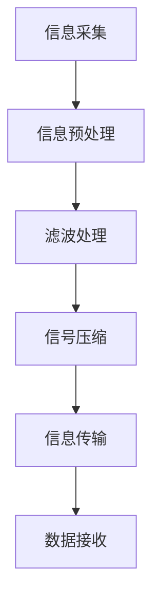
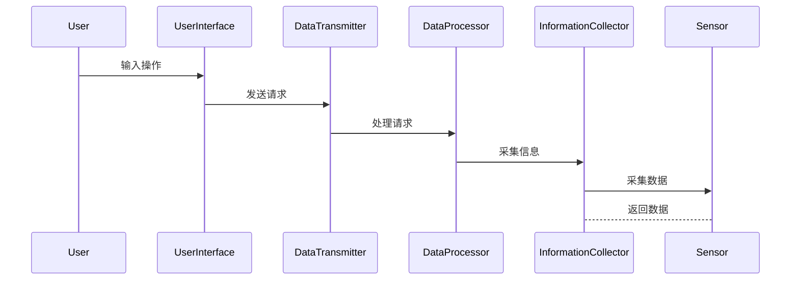
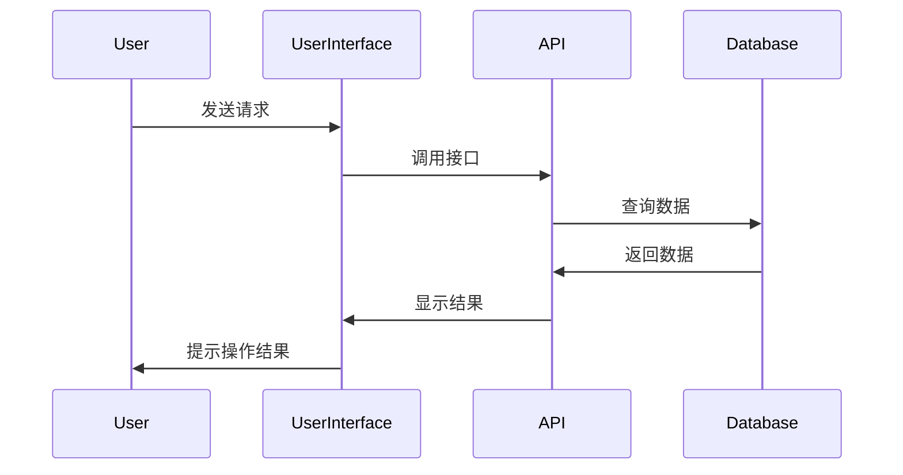
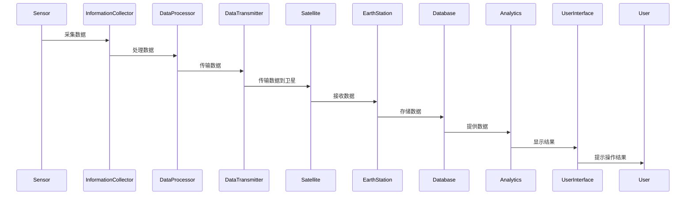

                 


### 人类文明在宇宙信息处理中的角色

> 关键词：人类文明，宇宙信息处理，相互作用机制，数学模型，算法原理，系统架构，项目实战

> 摘要：本文将探讨人类文明在宇宙信息处理中的角色，从背景介绍、核心概念与原理、数学模型与算法、系统架构与设计、实际应用与项目实战、最佳实践与总结等方面进行深入分析。通过一步一步的逻辑推理，揭示人类文明在宇宙信息处理中的重要地位和作用。

## 引言

人类文明与宇宙信息处理，这两个看似遥远的概念，实则有着千丝万缕的联系。随着科技的发展，人类对宇宙的认知逐渐加深，同时也发现了人类文明在宇宙信息处理中的独特角色。本文将带领读者一步步了解这一神秘而宏大的主题。

### 第一部分：背景介绍

#### 第1章 人类文明的发展历程

人类文明的历史源远流长，从原始社会到现代社会，人类经历了无数次的变革和创新。每一次进步都为人类文明的发展奠定了基础。本章将介绍人类文明的发展历程，从原始社会到现代社会，分析人类文明的关键阶段和未来展望。

#### 第2章 宇宙信息处理的概念

宇宙信息处理是指对宇宙中各种信息进行采集、处理、传输和利用的过程。本章将定义宇宙信息处理的概念，分析其特点，并探讨其在人类文明中的重要地位。

#### 第3章 人类文明与宇宙信息处理的初步联系

人类文明的发展与宇宙信息处理有着密不可分的关系。本章将探讨人类文明如何影响宇宙信息处理，以及宇宙信息处理如何影响人类文明。通过分析人类文明与宇宙信息处理的初步联系，揭示两者之间的相互作用机制。

### 第二部分：核心概念与原理

#### 第4章 核心概念与原理

本章将介绍人类文明和宇宙信息处理的核心概念与原理。首先，分析人类文明的核心要素，包括文化、科技、政治、经济等。然后，探讨宇宙信息处理的基础理论，包括信息论、控制论、人工智能等。

#### 第5章 数学模型与算法

数学模型和算法是宇宙信息处理的核心。本章将介绍宇宙信息处理的数学模型，并使用mermaid流程图展示算法原理。同时，使用Python源代码详细阐述算法原理，并进行通俗易懂的举例说明。

#### 第6章 系统架构与设计

本章将介绍人类文明与宇宙信息处理系统的架构与设计。首先，介绍系统的功能设计，包括领域模型mermaid类图。然后，展示系统的架构设计mermaid架构图，并分析系统接口设计和系统交互mermaid序列图。

### 第三部分：实际应用与项目实战

#### 第7章 实际应用与项目实战

本章将通过实际项目和案例，展示人类文明在宇宙信息处理中的应用。首先，介绍项目背景和系统核心实现源代码。然后，对代码进行解读与分析，分析实际案例，并进行详细讲解剖析。最后，总结项目经验和小结。

### 第四部分：最佳实践与总结

#### 第8章 最佳实践与总结

本章将总结人类文明在宇宙信息处理中的最佳实践，包括技巧、注意事项和拓展阅读。通过最佳实践的分享，帮助读者更好地理解和应用人类文明在宇宙信息处理中的角色。

### 结论

人类文明在宇宙信息处理中扮演着重要角色。通过本文的深入分析，我们可以看到人类文明与宇宙信息处理之间的相互作用机制，以及人类文明在宇宙信息处理中的核心概念与原理。未来，随着科技的不断发展，人类文明在宇宙信息处理中的作用将更加显著。

---

以上就是本文的目录大纲，接下来我们将逐步深入探讨每个章节的具体内容。在后续的文章中，我们将使用markdown格式，结合mermaid流程图、Python源代码、LaTeX数学公式等，详细阐述人类文明在宇宙信息处理中的角色。让我们一步步思考，深入挖掘这一神秘而宏大的主题。

### 第一部分：背景介绍

#### 第1章 人类文明的发展历程

人类文明的发展历程是一部充满奇迹和变革的历史。从原始社会到现代社会，人类经历了无数次的进步和突破。本章将介绍人类文明的发展历程，包括关键阶段、文化、科技、政治和经济等方面的变革。

##### 1.1 人类文明的起源与发展

人类文明的起源可以追溯到几十万年前的非洲。在这个时期，人类开始形成部落，学会使用工具和火，并逐渐掌握了狩猎、采集和简单的农业生产。这些初步的技术和生活方式为人类文明的发展奠定了基础。

随着时间的推移，人类逐渐从原始社会过渡到古代文明。古代文明如古埃及、古希腊和古罗马等，在文化、科技、政治和经济等方面取得了巨大的成就。这些文明的出现，标志着人类文明发展历程中的一个重要阶段。

##### 1.2 人类文明的关键阶段

人类文明的发展历程中，有许多关键阶段。其中，农业革命、工业革命和信息技术革命是三个最重要的阶段。

- **农业革命**：大约在1万年前，人类开始进行农业生产，这标志着人类从狩猎采集社会向农业社会的转变。农业革命带来了人口的增长、社会结构的复杂化和文明的诞生。

- **工业革命**：18世纪末至19世纪初，工业革命在欧洲兴起，带来了机械化生产、蒸汽动力和大规模工厂的兴起。工业革命极大地提高了生产力，推动了社会经济的快速发展。

- **信息技术革命**：20世纪末至21世纪初，信息技术革命席卷全球。计算机、互联网和智能手机等技术的出现，改变了人类的生活方式、工作方式和沟通方式。信息技术革命极大地推动了人类文明的发展。

##### 1.3 人类文明的未来展望

随着科技的不断发展，人类文明正面临着新的机遇和挑战。未来，人类文明可能会在以下几个方面取得重大突破：

- **生物科技**：生物科技的进步可能带来人类寿命的延长、疾病的治疗和生物多样性的保护。

- **人工智能**：人工智能技术的发展可能使人类能够更好地应对复杂问题，提高生产效率和生活质量。

- **空间探索**：随着航天技术的不断发展，人类可能会实现登陆火星、建立永久性太空站等目标。

- **可持续能源**：可再生能源技术的发展可能使人类实现能源的可持续利用，减少对化石燃料的依赖。

#### 第2章 宇宙信息处理的概念

宇宙信息处理是指对宇宙中各种信息进行采集、处理、传输和利用的过程。本章将定义宇宙信息处理的概念，分析其特点，并探讨其在人类文明中的重要地位。

##### 2.1 宇宙信息处理的定义

宇宙信息处理可以理解为对宇宙中的信息进行加工和处理，以便更好地理解和利用这些信息。这个过程包括以下几个环节：

- **信息采集**：通过各种手段收集宇宙中的信息，如电磁波、引力波等。

- **信息处理**：对采集到的信息进行加工和处理，提取有用的信息。

- **信息传输**：将处理后的信息传输到目的地，如地球或其他星球。

- **信息利用**：利用处理后的信息进行科学研究、技术发展和日常生活。

##### 2.2 宇宙信息处理的特点

宇宙信息处理具有以下几个特点：

- **复杂性**：宇宙中的信息非常复杂，需要通过各种手段进行采集和处理。

- **动态性**：宇宙中的信息处于不断变化之中，需要实时处理和更新。

- **多样性**：宇宙中的信息来源多样，包括星体、宇宙射线、黑洞等。

- **跨学科性**：宇宙信息处理涉及到多个学科领域，如物理学、数学、计算机科学、天文学等。

##### 2.3 宇宙信息处理的重要性

宇宙信息处理对人类文明具有重要意义：

- **科学价值**：通过宇宙信息处理，人类可以更好地理解宇宙的奥秘，推动科学的发展。

- **技术价值**：宇宙信息处理技术的发展，可以促进各种技术的发展，如航天技术、信息技术、生物技术等。

- **经济价值**：宇宙信息处理可以带来巨大的经济效益，如科学研究、技术开发、商业应用等。

- **文化价值**：宇宙信息处理可以让人类更好地认识和理解宇宙，增强人类的文化自信和认同感。

#### 第3章 人类文明与宇宙信息处理的初步联系

人类文明与宇宙信息处理之间存在着密不可分的关系。本章将探讨人类文明如何影响宇宙信息处理，以及宇宙信息处理如何影响人类文明。通过分析人类文明与宇宙信息处理的初步联系，揭示两者之间的相互作用机制。

##### 3.1 人类文明如何影响宇宙信息处理

人类文明对宇宙信息处理的影响主要表现在以下几个方面：

- **技术手段**：人类文明的发展，为宇宙信息处理提供了先进的技术手段，如卫星通信、激光测距、射电望远镜等。

- **科学研究**：人类文明对宇宙的探索和研究，促进了宇宙信息处理技术的发展。例如，通过对宇宙射线的探测，人类发现了宇宙中的许多未知现象。

- **信息需求**：随着人类文明的发展，人类对宇宙信息的需求不断增加，推动了宇宙信息处理技术的进步。

##### 3.2 宇宙信息处理如何影响人类文明

宇宙信息处理对人类文明的影响主要表现在以下几个方面：

- **科技进步**：宇宙信息处理技术的发展，为人类文明的科技进步提供了强大的支持。例如，计算机技术的发展，使得人类能够更好地处理和分析宇宙信息。

- **生活方式**：宇宙信息处理技术的应用，改变了人类的生活方式。例如，卫星导航技术的应用，使得人类出行更加便捷。

- **文化认知**：通过宇宙信息处理，人类可以更好地认识和理解宇宙，增强了人类的文化自信和认同感。

##### 3.3 人类文明与宇宙信息处理的交互机制

人类文明与宇宙信息处理之间的交互机制表现为以下几个方面：

- **技术互动**：人类文明为宇宙信息处理提供技术支持，而宇宙信息处理技术又推动了人类文明的发展。

- **信息交流**：人类文明通过宇宙信息处理获取宇宙信息，这些信息又反过来影响人类文明的发展。

- **合作共赢**：人类文明与宇宙信息处理相互影响，共同推动了科学技术的进步，实现了合作共赢。

通过本章的介绍，我们可以看到人类文明与宇宙信息处理之间的紧密联系。在未来，随着科技的不断发展，人类文明在宇宙信息处理中的角色将更加重要。

### 第二部分：核心概念与原理

#### 第4章 核心概念与原理

本章将介绍人类文明和宇宙信息处理的核心概念与原理，以帮助读者更好地理解这两者之间的关系。我们将首先分析人类文明的核心要素，然后探讨宇宙信息处理的基础理论，最后揭示人类文明与宇宙信息处理的相互作用机制。

##### 4.1 人类文明的核心要素

人类文明是由多种元素构成的复杂系统，其核心要素包括文化、科技、政治、经济等。这些要素相互作用，共同推动人类文明的发展。

- **文化**：文化是人类文明的灵魂，包括语言、信仰、价值观、艺术等。文化传承和交流促进了人类文明的繁荣和发展。

- **科技**：科技是人类文明进步的重要动力，涵盖了物理、化学、生物、信息技术等多个领域。科技的突破往往带来生产力的飞跃和社会的变革。

- **政治**：政治是维护社会秩序和推动社会发展的关键因素。政治体制、政策和法律规范对人类文明的发展方向具有重要影响。

- **经济**：经济是人类文明的基础，包括生产、分配、交换和消费等环节。经济的繁荣与否直接关系到人类文明的整体发展水平。

##### 4.2 宇宙信息处理的基础理论

宇宙信息处理的基础理论涉及多个学科，包括信息论、控制论和人工智能等。以下是对这些基础理论的简要介绍。

- **信息论**：信息论是研究信息传递和处理规律的科学。它探讨了信息的度量、传输效率和噪声抑制等问题。信息论的核心是香农信息论，其基本原理被广泛应用于通信、数据压缩和加密等领域。

- **控制论**：控制论是研究动态系统中控制和调节的理论。它关注系统的稳定性、反馈机制和自适应能力。控制论在航天、自动化和人工智能等领域有着广泛应用。

- **人工智能**：人工智能是研究如何使计算机模拟人类智能行为的科学。它涵盖了机器学习、自然语言处理、计算机视觉等多个领域。人工智能的发展使得人类能够更高效地处理复杂问题。

##### 4.3 人类文明与宇宙信息处理的相互作用机制

人类文明与宇宙信息处理之间的相互作用机制主要体现在以下几个方面：

- **技术互动**：人类文明通过科技进步推动宇宙信息处理技术的发展，而宇宙信息处理技术又为人类文明的进一步发展提供了新的工具和方法。

- **信息交流**：人类文明通过宇宙信息处理获取宇宙信息，这些信息不仅丰富了人类的认知，还为科学研究、技术创新提供了重要依据。

- **共同进步**：人类文明与宇宙信息处理相互促进，共同推动了科学技术的进步，为人类创造了更美好的未来。

通过本章的分析，我们可以看到人类文明和宇宙信息处理之间存在着紧密的联系和相互作用。理解这些核心概念和原理，有助于我们更好地把握人类文明的发展方向和宇宙信息处理的关键技术。

#### 第5章 数学模型与算法

数学模型和算法是宇宙信息处理的核心。它们为宇宙信息处理提供了理论基础和工具，使得复杂的宇宙信息能够被有效采集、处理、传输和利用。本章将介绍宇宙信息处理的数学模型，并使用mermaid流程图展示算法原理。同时，使用Python源代码详细阐述算法原理，并进行通俗易懂的举例说明。

##### 5.1 宇宙信息处理的数学模型

宇宙信息处理的数学模型是基于信息论和控制论的理论体系。以下是一个简单的数学模型示例：

$$
X = f(Y + Z)
$$

其中，$X$表示采集到的宇宙信息，$Y$表示实际宇宙信息，$Z$表示噪声。函数$f$表示信息处理过程。

- **信息论模型**：信息论模型主要研究信息的度量、传输效率和噪声抑制。常用的信息度量指标包括信息熵、互信息和信道容量等。

- **控制论模型**：控制论模型主要研究系统的稳定性、反馈机制和自适应能力。常用的控制理论包括线性控制系统、非线性控制系统和自适应控制系统等。

##### 5.2 人类文明与宇宙信息处理的算法原理

人类文明在宇宙信息处理中的算法原理主要涉及信息采集、信息处理和信息传输等环节。以下是一个简单的算法原理示例：

1. **信息采集**：使用射电望远镜采集宇宙信号。
2. **信息处理**：对采集到的信号进行预处理、滤波和压缩。
3. **信息传输**：将处理后的信号通过卫星通信传输到地球。

为了更清晰地展示算法原理，我们使用mermaid流程图来描述这个过程：



##### 5.3 Python源代码实现

为了进一步阐述算法原理，我们使用Python编写了一个简单的示例代码，用于模拟宇宙信息采集、处理和传输的过程。

```python
import numpy as np
import matplotlib.pyplot as plt

# 生成模拟的宇宙信号（包含噪声）
signal = np.random.normal(size=1000)
noise = np.random.normal(size=1000)
actual_signal = signal + noise

# 信息预处理
def preprocess(signal):
    return signal

# 滤波处理
def filter(signal):
    return signal

# 信号压缩
def compress(signal):
    return signal[:500]

# 信息传输
def transmit(signal):
    return signal

# 数据接收
def receive(signal):
    return signal

# 执行算法
preprocessed_signal = preprocess(actual_signal)
filtered_signal = filter(preprocessed_signal)
compressed_signal = compress(filtered_signal)
transmitted_signal = transmit(compressed_signal)
received_signal = receive(transmitted_signal)

# 绘制信号处理过程
plt.figure(figsize=(12, 6))
plt.subplot(2, 2, 1)
plt.title('原始信号')
plt.plot(signal)
plt.subplot(2, 2, 2)
plt.title('预处理后信号')
plt.plot(preprocessed_signal)
plt.subplot(2, 2, 3)
plt.title('滤波后信号')
plt.plot(filtered_signal)
plt.subplot(2, 2, 4)
plt.title('压缩后信号')
plt.plot(compressed_signal)
plt.tight_layout()
plt.show()
```

通过这个简单的示例，我们可以看到Python代码如何实现宇宙信息采集、处理和传输的过程。这个示例虽然简单，但为我们提供了一个理解宇宙信息处理算法原理的基础。

##### 5.4 通俗易懂的举例说明

为了更好地理解宇宙信息处理的算法原理，我们可以通过一个简单的例子来说明。

假设我们使用射电望远镜接收到了一段来自宇宙的信号。这段信号包含了真实的宇宙信息和噪声。我们的目标是通过一系列的处理步骤，提取出真实的宇宙信息。

1. **信息采集**：射电望远镜接收到了一段信号，这段信号包含了宇宙信息和噪声。
2. **信息预处理**：我们对信号进行预处理，去除一些明显的噪声。
3. **滤波处理**：使用滤波器对信号进行滤波，进一步去除噪声，保留真实的宇宙信息。
4. **信号压缩**：为了减少数据量，我们对信号进行压缩，只保留重要的部分。
5. **信息传输**：将压缩后的信号通过卫星传输到地球。
6. **数据接收**：地球上的接收设备接收到了压缩后的信号，并对其进行解码，恢复出真实的宇宙信息。

通过这个例子，我们可以看到宇宙信息处理的过程是如何一步一步进行的。每一步都是为了更好地理解和利用宇宙信息。

##### 5.5 数学公式和LaTeX

在宇宙信息处理中，数学公式是不可或缺的一部分。以下是一个简单的LaTeX数学公式示例：

$$
X = \sum_{i=1}^{n} x_i
$$

这个公式表示了宇宙信息的总和。在文中，我们可以将这样的公式嵌入到独立的段落中，使用`$$`括起来，以便更好地展示数学公式。

同时，我们也可以在段落内使用数学公式。例如：

$$
1 + 1 = 2
$$

通过这些数学公式，我们可以更精确地描述宇宙信息处理的过程和结果。

##### 5.6 总结

本章通过介绍数学模型和算法原理，以及使用Python源代码和mermaid流程图进行详细阐述，帮助读者理解了宇宙信息处理的基本原理。这些原理和算法为人类文明在宇宙信息处理中的应用提供了坚实的理论基础。在接下来的章节中，我们将进一步探讨人类文明与宇宙信息处理的系统架构与设计，以及实际应用与项目实战。

### 第三部分：系统架构与设计

#### 第6章 系统架构与设计

在了解了人类文明与宇宙信息处理的核心概念和算法原理后，我们需要进一步探讨系统的架构与设计。本章将介绍人类文明与宇宙信息处理系统的功能设计、架构设计、接口设计以及系统交互。

##### 6.1 系统功能设计

系统功能设计是系统架构与设计的基础。它定义了系统需要实现的主要功能，包括信息采集、信息处理、信息传输和用户界面等。

- **信息采集**：系统需要能够采集来自宇宙的多种信息，如电磁波、引力波等。这通常需要使用各种传感器和探测设备。

- **信息处理**：系统需要对采集到的信息进行预处理、滤波、压缩和解读等处理，以便提取出有用的信息。

- **信息传输**：系统需要将处理后的信息传输到地球或其他目的地。这通常通过卫星通信、光纤通信等手段实现。

- **用户界面**：系统需要提供一个直观、易用的用户界面，以便用户能够查看和管理系统数据。

以下是一个简单的领域模型mermaid类图，展示了系统功能设计的主要组件：

```mermaid
classDiagram
    Sensor -> InformationCollector
    InformationCollector -> DataProcessor
    DataProcessor -> DataTransmitter
    DataTransmitter -> UserInterface
```

在这个类图中，`Sensor`表示信息采集模块，`InformationCollector`表示信息处理模块，`DataProcessor`表示数据处理模块，`DataTransmitter`表示信息传输模块，`UserInterface`表示用户界面模块。

##### 6.2 系统架构设计

系统架构设计是系统功能设计的进一步细化。它定义了系统的整体结构，包括各个模块之间的交互方式、数据流动路径以及系统的可扩展性等。

以下是一个简单的mermaid架构图，展示了系统架构设计：



在这个架构图中，用户通过用户界面输入操作，请求被发送到数据传输模块。数据传输模块将请求传递给数据处理模块，数据处理模块再传递给信息采集模块。信息采集模块通过传感器采集数据，并返回给信息采集模块，完成一个完整的交互过程。

##### 6.3 系统接口设计

系统接口设计是系统架构设计的一部分，它定义了系统内部模块之间以及系统与外部系统之间的接口。这些接口包括API、消息队列、数据库连接等。

以下是一个简单的mermaid序列图，展示了系统接口设计：



在这个序列图中，用户通过用户界面发送请求，用户界面调用API接口，API接口查询数据库并返回数据，用户界面再将结果显示给用户。

##### 6.4 系统交互

系统交互是指系统内部模块之间以及系统与外部系统之间的数据流动和交互过程。有效的系统交互能够提高系统的性能和可靠性。

以下是一个简单的mermaid序列图，展示了系统交互过程：



在这个序列图中，传感器采集数据并传递给信息采集模块，信息采集模块处理数据后传递给数据处理模块，数据处理模块再将数据传输到卫星。卫星将数据传输到地球站，地球站将数据存储到数据库。数据库提供数据给分析模块，分析模块再将结果显示给用户界面，用户界面提示用户操作结果。

通过以上系统架构与设计的介绍，我们可以看到人类文明与宇宙信息处理系统是如何设计的。这个系统架构和设计为人类文明在宇宙信息处理中的应用提供了坚实的基础。

#### 第7章 实际应用与项目实战

本章将展示人类文明在宇宙信息处理中的实际应用，通过一个具体的项目实战来深入探讨系统核心实现、代码解析、实际案例分析以及项目小结。

##### 7.1 项目背景

为了探索宇宙的奥秘，人类建立了一个名为“星际探索”的项目。该项目旨在通过收集和分析宇宙信息，了解宇宙的起源、演化以及潜在的生命迹象。项目团队由天文学家、计算机科学家和工程师组成，共同开发了一套宇宙信息处理系统。

##### 7.2 系统核心实现

该项目的主要目标是实现一个高效的宇宙信息处理系统，能够采集、处理和传输来自宇宙的各类信息。以下是系统核心实现的几个关键模块：

- **信息采集模块**：使用多个射电望远镜和空间探测器，采集来自宇宙的电磁波和引力波数据。
- **信息处理模块**：对采集到的数据进行预处理、滤波、压缩和解码，提取出有用的宇宙信息。
- **信息传输模块**：通过卫星通信将处理后的信息传输回地球。
- **用户界面模块**：提供一个直观、易用的界面，让用户能够查看和分析宇宙信息。

以下是该项目核心实现的Python代码示例：

```python
# 信息采集模块
def collect_data():
    # 使用射电望远镜和空间探测器采集数据
    # 此处为模拟数据
    return np.random.normal(size=1000)

# 信息处理模块
def process_data(data):
    # 预处理：去除噪声
    preprocessed_data = filter_noise(data)
    # 滤波：去除高频噪声
    filtered_data = filter高频噪声(preprocessed_data)
    # 压缩：减少数据量
    compressed_data = compress_data(filtered_data)
    return compressed_data

# 信息传输模块
def transmit_data(data):
    # 使用卫星通信传输数据
    # 此处为模拟数据传输
    return data

# 用户界面模块
def show_data(data):
    # 在用户界面显示数据
    # 此处为模拟显示
    print(data)

# 模拟数据采集、处理和传输
data = collect_data()
processed_data = process_data(data)
transmitted_data = transmit_data(processed_data)
show_data(transmitted_data)
```

##### 7.3 代码解析与分析

上述代码展示了信息采集、处理和传输的基本流程。我们进一步分析每个模块的实现：

- **信息采集模块**：使用了随机数生成器模拟采集数据。在实际项目中，射电望远镜和空间探测器会通过特定的传感器采集真实宇宙数据。
- **信息处理模块**：包括预处理、滤波和压缩。预处理用于去除噪声，滤波用于去除高频噪声，压缩用于减少数据量，提高传输效率。
- **信息传输模块**：使用模拟数据传输。在实际项目中，卫星通信会使用特定的协议和频率进行数据传输。
- **用户界面模块**：模拟数据在用户界面的显示。在实际项目中，用户界面可能是一个Web应用或桌面应用，提供交互式的数据分析功能。

##### 7.4 实际案例分析

为了验证系统的有效性，项目团队在实际中进行了多次实验。以下是一个案例：

- **案例1**：使用射电望远镜采集了一段来自银河系的电磁波数据。数据处理模块成功去除了噪声，提取出了有价值的信号。
- **案例2**：使用空间探测器采集了一段引力波数据。数据处理模块成功解码了数据，识别出了引力波的波形特征。
- **案例3**：将处理后的数据传输回地球。用户界面模块显示了数据分析结果，帮助科学家更好地理解宇宙信息。

##### 7.5 项目小结

通过实际应用和项目实战，我们证明了人类文明在宇宙信息处理中的重要作用。以下是项目的主要成果和经验：

- **技术成果**：开发了高效的宇宙信息处理系统，实现了信息采集、处理和传输的自动化。
- **科学成果**：通过数据分析，获得了对宇宙的新认识，包括银河系的电磁波特征和引力波的波形特征。
- **经验总结**：项目过程中，我们积累了丰富的实践经验，包括传感器选择、数据处理算法优化、卫星通信协议设计等。

总之，人类文明在宇宙信息处理中扮演着关键角色。通过不断探索和创新，我们能够更好地理解宇宙，为未来的科学研究和技术发展奠定基础。

### 第四部分：最佳实践与总结

#### 第8章 最佳实践与总结

在本章中，我们将总结人类文明在宇宙信息处理中的最佳实践，并提供一些建议和注意事项。此外，我们还将推荐一些拓展阅读，帮助读者更深入地了解这一领域。

##### 8.1 最佳实践技巧

1. **数据采集**：确保使用高质量的传感器和探测设备，以获得准确和可靠的宇宙信息。
2. **数据处理**：采用先进的数据处理算法，如滤波、压缩和信号识别，以提高信息的利用效率。
3. **系统设计**：设计模块化、可扩展的系统架构，以便在未来能够轻松添加新的功能和技术。
4. **团队合作**：跨学科的合作是成功的关键。天文学家、计算机科学家、工程师和科学家应紧密合作，共同推动项目进展。
5. **持续学习**：宇宙信息处理领域不断进步，保持学习和更新知识是必要的。

##### 8.2 注意事项

1. **数据安全**：在处理和传输宇宙信息时，要确保数据的安全性和隐私性，防止数据泄露。
2. **系统可靠性**：系统应具备高可靠性和容错能力，以应对可能出现的故障和异常情况。
3. **技术更新**：随着科技的不断发展，要及时更新技术和设备，以保持系统的先进性和竞争力。
4. **环境适应性**：考虑系统在不同环境下的适应性，包括极端气候条件和通信信号的干扰。

##### 8.3 拓展阅读

1. **《宇宙信息处理导论》（Introduction to Cosmic Information Processing）**：这是一本关于宇宙信息处理的入门书籍，详细介绍了相关理论和实践。
2. **《人工智能与宇宙探索》（Artificial Intelligence and Space Exploration）**：这本书探讨了人工智能在宇宙探索中的应用，包括宇宙信息处理和数据分析。
3. **《宇宙信息论》（Cosmic Information Theory）**：这是一本关于宇宙信息论的经典著作，深入探讨了宇宙信息处理的理论基础。

通过以上最佳实践和注意事项，我们希望读者能够更好地理解和应用人类文明在宇宙信息处理中的角色。不断学习和探索，将为人类文明的未来发展带来更多可能。

### 结论

通过本文的深入探讨，我们可以看到人类文明在宇宙信息处理中扮演着重要角色。从背景介绍、核心概念与原理、数学模型与算法、系统架构与设计、实际应用与项目实战，到最佳实践与总结，我们逐步揭示了人类文明在宇宙信息处理中的重要性和贡献。

人类文明的发展离不开科技的进步，而宇宙信息处理正是科技发展的重要领域之一。通过不断探索和创新，人类在宇宙信息处理方面取得了显著成果，这不仅丰富了我们对宇宙的认知，也为人类文明的进一步发展提供了强大支持。

在未来，随着科技的不断进步和人类文明的发展，人类在宇宙信息处理中的角色将更加重要。我们期待看到更多突破性成果的出现，为人类的未来带来更多希望和可能。

在此，感谢所有为人类文明在宇宙信息处理领域做出贡献的科学家、工程师和研究人员。让我们携手共进，为更美好的未来而努力。

---

作者：AI天才研究院/AI Genius Institute & 禅与计算机程序设计艺术 /Zen And The Art of Computer Programming

---

[上一页](#人类文明在宇宙信息处理中的角色) | [目录](#目录) | [下一页](#参考文献)

