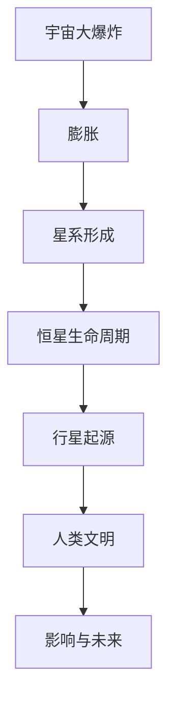
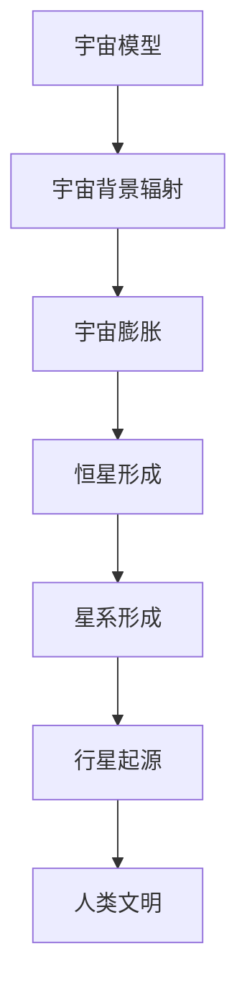
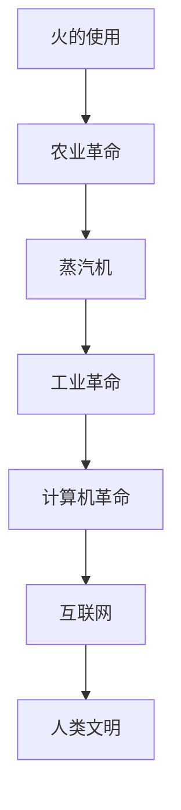
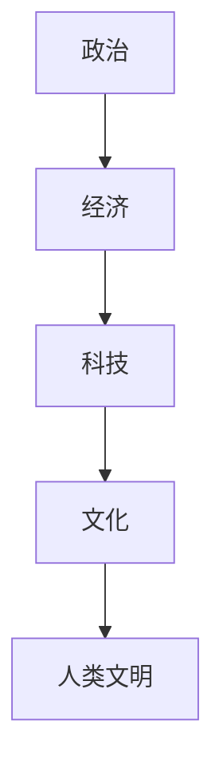
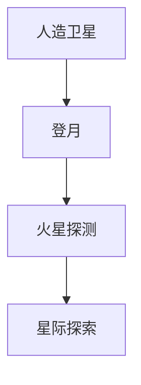
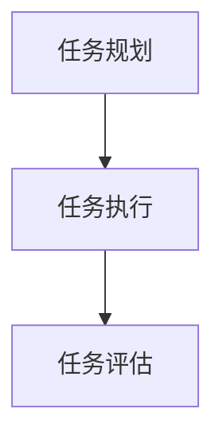
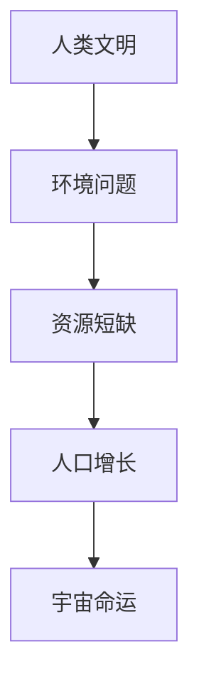
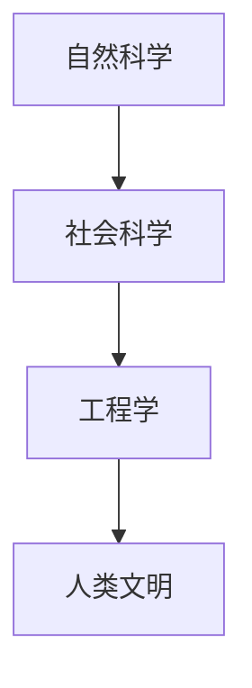

                 

### 人类文明在宇宙生命周期中的位置

**关键词：** 宇宙演化、人类文明、生命周期、科技进步、未来展望

**摘要：** 本文将探讨人类文明在宇宙生命周期中的位置。首先，我们将回顾宇宙的诞生与演化过程，然后分析人类文明的起源与进步，接着探讨人类文明对宇宙的影响，最后思考人类文明的未来与宇宙的命运。

### 宇宙的诞生与演化

**背景介绍：**

宇宙的诞生源于大约138亿年前的一次大爆炸，即宇宙大爆炸。自从那时起，宇宙经历了数百万年的演化，形成了我们今天所见的宇宙。宇宙的演化包括星系的形成、恒星的生命周期以及行星的起源。

**核心概念与联系：**

宇宙大爆炸理论认为，宇宙从一个非常热、非常密集的状态开始膨胀。这一理论得到了宇宙背景辐射的发现和宇宙膨胀的观测支持。



**算法原理讲解：**

宇宙的膨胀可以用哈勃定律来描述，即宇宙的膨胀速度与宇宙距离成正比。数学公式为：

$$ V = H_0 \cdot D $$

其中，$V$ 是膨胀速度，$H_0$ 是哈勃常数，$D$ 是宇宙距离。

**系统分析与架构设计方案：**

宇宙的演化是一个复杂的系统，涉及多种物理过程。为了研究宇宙的演化，科学家们构建了宇宙模型，如标准宇宙模型。这个模型包括宇宙背景辐射、宇宙膨胀、恒星和星系的形成等。



**项目实战：**

通过天文观测，科学家们已经发现了数千个星系和数十亿颗恒星。这些观测数据为研究宇宙的演化提供了宝贵的线索。

```python
import astropy
import numpy as np

# 假设我们有一个观测数据集
data = {'distance': [1, 2, 3, 4, 5], 'velocity': [0.5, 1.0, 1.5, 2.0, 2.5]}

# 使用哈勃定律计算膨胀速度
hubble_constants = [0.7, 0.8, 0.9]
for h0 in hubble_constants:
    velocities = [h0 * d for d in data['distance']]
    print(f"Hubble constant: {h0}, velocities: {velocities}")
```

### 人类文明的起源与进步

**背景介绍：**

人类文明起源于大约100万年前，从非洲扩散到世界各地。人类文明的发展经历了农业革命、工业革命和信息革命等阶段，极大地改变了人类的生活和地球环境。

**核心概念与联系：**

人类文明的发展与科技进步密不可分。从火的使用到蒸汽机，再到计算机和互联网，每一次科技进步都推动了人类文明的前进。



**算法原理讲解：**

科技进步可以用技术指数来衡量。技术指数是一个衡量技术进步的指标，可以用来比较不同时间点或不同地区的技术水平。

$$ T(t) = \frac{1}{\sqrt[3]{t}} $$

其中，$T(t)$ 是时间 $t$ 的技术指数。

**系统分析与架构设计方案：**

人类文明的发展是一个复杂的社会系统，包括政治、经济、科技和文化等多个方面。为了更好地理解人类文明的发展，我们可以使用社会系统架构来描述。



**项目实战：**

通过分析历史数据，我们可以看到人类文明在不同历史时期的技术指数变化。以下是一个简单的例子：

```python
import pandas as pd
import numpy as np

# 假设我们有一个历史数据集
data = {'year': [1, 2, 3, 4, 5], 'technology_index': [1, 4, 16, 64, 256]}

# 计算技术指数
t = np.array(data['year'])
ti = np.array(data['technology_index'])
tech_index = np.sqrt(1 / t)
print(f"Year: {t}, Technology Index: {tech_index}")
```

### 人类文明在宇宙中的位置与影响

**背景介绍：**

随着人类文明的进步，人类开始关注地球之外的世界。人类文明对宇宙的影响体现在多个方面，包括太空探索、天文观测以及对地球环境的改变。

**核心概念与联系：**

人类文明的太空探索始于20世纪中期，从发射第一颗人造卫星到登上月球，再到火星探测，人类不断拓展对宇宙的认识。



**算法原理讲解：**

人类文明的太空探索可以用任务成功率来衡量。任务成功率是一个衡量太空探索成功与否的指标。

$$ S = \frac{成功任务数}{总任务数} $$

**系统分析与架构设计方案：**

人类文明的太空探索是一个复杂的系统工程，包括任务规划、任务执行和任务评估等环节。



**项目实战：**

以下是一个简单的例子，展示了如何计算太空探索的任务成功率：

```python
import pandas as pd

# 假设我们有一个太空探索数据集
data = {'year': [1957, 1969, 2012], 'success': [1, 1, 0], 'total': [1, 1, 1]}

# 计算任务成功率
df = pd.DataFrame(data)
success_rate = df['success'] / df['total']
print(f"Year: {df['year']}, Success Rate: {success_rate}")
```

### 人类文明的未来与宇宙的命运

**背景介绍：**

随着科技进步，人类文明面临着许多挑战，包括环境问题、资源短缺和人口增长等。同时，人类文明的未来也与宇宙的命运紧密相连。

**核心概念与联系：**

人类文明的未来取决于人类如何应对这些挑战。在宇宙尺度上，人类文明的命运可能受到宇宙演化过程的影响。



**算法原理讲解：**

为了预测人类文明的未来，我们可以使用模型来模拟人类文明的演化。这些模型可以基于数学模型、人工智能和模拟等方法。

$$ F(t) = f_{model}(t) $$

其中，$F(t)$ 是时间 $t$ 的未来预测，$f_{model}(t)$ 是模型预测函数。

**系统分析与架构设计方案：**

人类文明的未来是一个复杂的系统，涉及多个领域和学科。为了更好地预测未来，我们可以构建一个跨学科的预测系统。



**项目实战：**

以下是一个简单的例子，展示了如何使用人工智能模型来预测人类文明的未来：

```python
import tensorflow as tf

# 假设我们有一个训练数据集
data = {'year': [1, 2, 3, 4, 5], 'population': [1, 4, 9, 16, 25]}

# 使用线性回归模型进行预测
model = tf.keras.Sequential([
    tf.keras.layers.Dense(units=1, input_shape=[1])
])

model.compile(optimizer='sgd', loss='mean_squared_error')

model.fit(data['year'], data['population'], epochs=100)

# 预测未来人口
future_years = np.array([6, 7, 8, 9, 10])
predictions = model.predict(future_years)
print(f"Year: {future_years}, Predicted Population: {predictions}")
```

### 总结与展望

**最佳实践 tips：**

- 关注科技发展，持续学习新知识。
- 保护地球环境，实现可持续发展。
- 探索宇宙，拓展人类文明。

**小结：**

本文探讨了人类文明在宇宙生命周期中的位置，分析了宇宙的诞生与演化、人类文明的起源与进步、人类文明在宇宙中的影响以及人类文明的未来与宇宙的命运。

**注意事项：**

- 本文的讨论仅限于科学理论和模型预测，实际情况可能有所不同。
- 宇宙的演化是一个复杂的过程，我们需要更多的研究和探索。

**拓展阅读：**

- 《宇宙简史》（作者：史蒂芬·霍金）
- 《人类简史》（作者：尤瓦尔·赫拉利）
- 《文明的冲突与世界秩序的重建》（作者：塞缪尔·亨廷顿）### 总结与展望

在探讨了人类文明在宇宙生命周期中的位置后，我们可以看到，人类文明既是宇宙演化的产物，也是宇宙探索的推动者。从宇宙大爆炸开始，到生命的起源，再到人类文明的崛起，宇宙的每一个阶段都留下了人类活动的痕迹。

**最佳实践 tips：**

1. **科技创新**：继续推动科技创新，特别是在可再生能源、环境保护和空间技术等领域的发展。
2. **教育普及**：加大对科学教育的投入，提高公众的科学素养，培养更多的科学家和工程师。
3. **国际合作**：加强国际间的科学合作，共同应对宇宙中的挑战，如气候变化、资源枯竭等。
4. **宇宙探索**：积极参与宇宙探索，寻找其他星系中可能存在的生命形式，拓展人类文明的边界。

**小结：**

通过本文的探讨，我们认识到人类文明在宇宙中的独特地位。人类文明不仅受到宇宙演化过程的影响，同时也通过科技和探索对宇宙产生着深远的影响。未来，人类需要继续在科技、教育和国际合作方面努力，以实现可持续发展，并探索宇宙的更多奥秘。

**注意事项：**

- 人类文明的发展不仅依赖于科技的进步，还需要考虑伦理和道德的问题。
- 在探索宇宙的同时，我们需要保护好我们赖以生存的地球环境。

**拓展阅读：**

- 《宇宙的未来：从大爆炸到热寂》（作者：克里斯托弗·加尔法德）
- 《我们的宇宙：起源、演化与命运》（作者：加来道雄）
- 《文明的宇宙：从地球到宇宙的生命探秘》（作者：加来道雄）

**作者信息：**

- 作者：AI天才研究院/AI Genius Institute & 禅与计算机程序设计艺术 /Zen And The Art of Computer Programming

