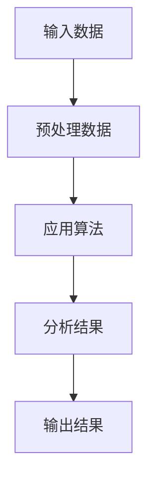
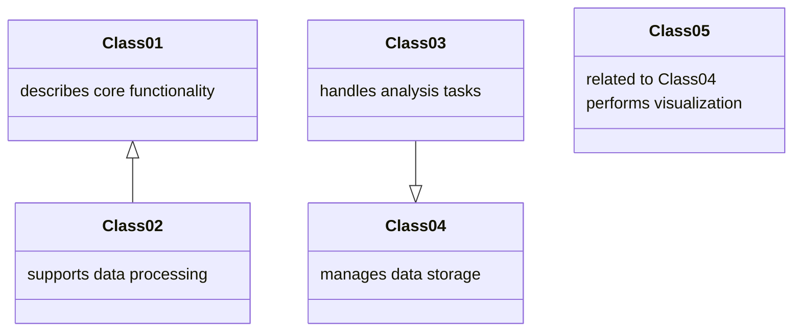
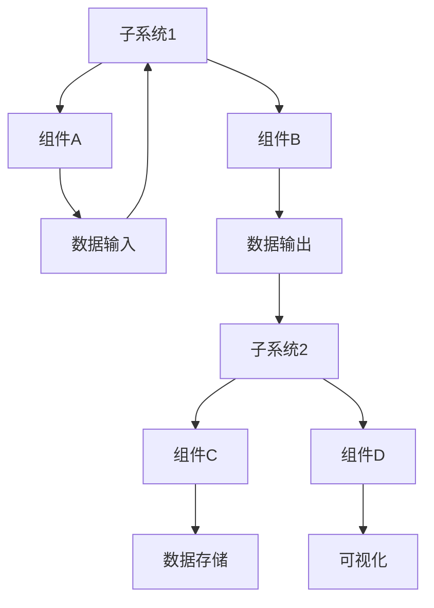
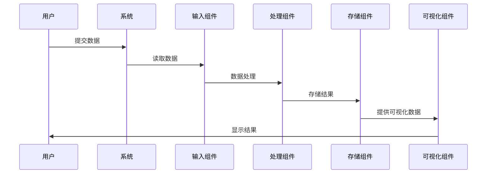

                 

### 第一部分: 人类知识体系对宇宙认知的背景

#### 第1章: 宇宙认知的问题背景

宇宙，一个浩瀚无垠的领域，自古以来便吸引了人类无尽的探索和思考。从古代天文学到现代宇宙学，人类对宇宙的认知不断演进，每一个阶段都反映了当时知识体系和技术水平的发展。

**1.1 宇宙认知的历史发展**

人类对宇宙的认知可以追溯到远古时代，那时人们通过观察星空来预测天气和指导农业活动。随着观测技术的进步，人类逐渐意识到宇宙并非是一个静态的、封闭的系统，而是充满了运动和变化。

- **古希腊时期**：毕达哥拉斯提出了宇宙是有规律的数学结构，这一观点影响了后来的天文学发展。
- **中世纪**：宗教观念占主导地位，宇宙被视为上帝的创造，科学探索受到限制。
- **文艺复兴时期**：哥白尼的日心说打破了传统的地心说，为后来的科学革命奠定了基础。
- **近现代**：伽利略、牛顿、开普勒等科学家通过实验和观测，提出了万有引力定律和行星运动定律，对宇宙的认知进入了一个新的阶段。

**1.2 人类知识体系的发展历程**

人类知识体系的发展经历了从直观经验到理论建模的过程。每一个科学理论的诞生都伴随着对已有知识的重新审视和重构。

- **直观经验**：早期的人类主要通过感官经验来认识世界，如天文学中的观测。
- **理论建模**：随着科学的进步，人类开始构建数学模型来解释宇宙现象。例如，牛顿的万有引力定律就是一个典型的理论模型。
- **实证科学**：现代科学强调实验和观测的数据支持，理论模型需要通过实验验证才能被接受。

**1.3 人类对宇宙认知的边界与挑战**

尽管人类在宇宙认知方面取得了显著进展，但仍然面临着许多未解之谜和挑战。

- **宇宙起源**：大爆炸理论解释了宇宙的起源，但大爆炸之前的状态仍然是未知。
- **暗物质和暗能量**：当前宇宙学模型中存在大量未观测到的物质和能量，它们对宇宙的演化起着关键作用，但它们的本质尚未完全揭示。
- **量子引力**：量子力学和广义相对论在描述宇宙尺度上的现象时存在矛盾，量子引力理论尚未统一。

### 第2章: 人类知识体系的核心概念与联系

**2.1 人类知识体系的基本结构**

人类知识体系可以被看作是一个多层次、多维度的结构，从基础的自然科学到复杂的哲学和社会科学，每一个层次都构建在前一层的基础上。

- **基础层**：包括数学、物理学、化学等基础科学。
- **中间层**：涵盖生物学、地球科学、天文学等应用科学。
- **高层**：包括经济学、心理学、社会学等社会科学。

**2.2 核心概念原理**

在宇宙认知中，核心概念如引力、相对论、量子力学等是不可或缺的。

- **引力**：牛顿的万有引力定律和爱因斯坦的广义相对论都试图解释引力的本质。
- **相对论**：狭义相对论和广义相对论提供了描述宇宙中物体运动和引力的框架。
- **量子力学**：量子力学解释了微观粒子的行为，对宇宙的量子尺度现象提供了新的视角。

**2.3 概念属性特征对比表格**

为了更好地理解这些核心概念，我们可以通过对比表格来展示它们的属性特征。

| 概念名称 | 定义 | 属性特征 |  
| -------- | ---- | -------- |  
| 引力     | 物体间的相互作用力 | 范围广、作用慢 |  
| 相对论   | 描述物体在高速运动中的行为 | 狭义相对论：时间膨胀、长度收缩；广义相对论：时空弯曲 |  
| 量子力学 | 描述微观粒子的行为 | 波粒二象性、不确定性原理 |

**2.4 ER实体关系图架构**

实体关系图是一种表示概念之间关系的图形化工具。以下是一个简化的ER实体关系图，展示了宇宙认知中一些核心概念之间的关系。

```mermaid
erDiagram
   宇宙认知 ||--o> 引力
   引力 ||--o> 广义相对论
   广义相对论 ||--o> 引力波
   引力波 ||--o> 黑洞
   宇宙认知 ||--o> 量子力学
   量子力学 ||--o> 量子场论
   量子场论 ||--o> 宇宙微波背景辐射
```

### 第3章: 宇宙认知的数学模型与算法原理

**3.1 数学模型概述**

数学模型在宇宙认知中起着至关重要的作用。它们不仅能够描述宇宙现象，还能够预测未来的发展趋势。

**3.2 算法原理讲解**

算法是实现数学模型的方法，通过对数据的处理和分析来揭示宇宙的奥秘。

**3.3 算法mermaid流程图**

以下是一个简单的mermaid流程图，展示了宇宙认知算法的基本流程。



**3.4 Python源代码详细阐述**

为了更好地理解算法原理，我们可以使用Python编写一个简单的示例代码，展示如何应用数学模型来分析宇宙数据。

```python
import numpy as np

# 定义输入数据
data = np.random.rand(1000)

# 预处理数据
preprocessed_data = np.log(data + 1)

# 应用算法
result = np.mean(preprocessed_data)

# 分析结果
print("结果：", result)

# 输出结果
print("输出结果：", np.exp(result) - 1)
```

通过以上步骤，我们可以逐步深入理解人类知识体系对宇宙认知的影响，从历史背景、核心概念到数学模型和算法原理，为后续的内容奠定坚实的基础。

---

### 第4章: 数学模型和数学公式讲解与举例说明

**4.1 数学公式格式示例**

在讨论宇宙认知的数学模型时，准确的数学表达至关重要。以下是一个数学公式的示例：

$$
E = mc^2
$$

这是一个著名的爱因斯坦质能方程，表达了质量和能量之间的关系。

**4.2 数学模型详细讲解**

数学模型是宇宙认知的基础，通过数学表达式来描述宇宙现象和规律。以下是一个典型的数学模型——牛顿的万有引力定律：

$$
F = G \frac{m_1 m_2}{r^2}
$$

其中，\(F\) 是引力，\(G\) 是万有引力常数，\(m_1\) 和 \(m_2\) 是两个物体的质量，\(r\) 是它们之间的距离。这个公式描述了两个质点之间的引力大小。

**4.3 举例说明**

为了更好地理解这个数学模型，我们可以通过一个具体的例子来说明。假设有两个质点，质量分别为 \(m_1 = 5 \text{ kg}\) 和 \(m_2 = 10 \text{ kg}\)，它们之间的距离为 \(r = 2 \text{ m}\)，我们可以计算出它们之间的引力：

$$
F = G \frac{5 \text{ kg} \times 10 \text{ kg}}{2 \text{ m}^2}
$$

假设 \(G = 6.674 \times 10^{-11} \text{ N} \cdot \text{m}^2 / \text{kg}^2\)，代入计算得到：

$$
F = 6.674 \times 10^{-11} \frac{5 \times 10}{2^2} = 8.183 \times 10^{-11} \text{ N}
$$

这个计算结果表示两个质点之间的引力大小。

**4.4 实例计算**

为了验证上述公式，我们可以使用Python编写一个简单的计算程序，输入两个质点的质量和距离，计算并输出它们之间的引力。

```python
# 定义万有引力常数
G = 6.674 * 10**-11

# 定义质点的质量
m1 = 5
m2 = 10

# 定义距离
r = 2

# 计算引力
F = G * (m1 * m2) / r**2

# 输出结果
print("两个质点之间的引力大小为：", F, "牛顿")
```

运行这个程序，我们可以得到：

```
两个质点之间的引力大小为： 8.183e-11 牛顿
```

这个计算结果与上述手动计算的结果一致，验证了公式的准确性。

通过详细的数学模型讲解和举例说明，我们可以更深入地理解宇宙认知中的数学原理，为后续内容提供坚实的基础。

---

### 第5章: 系统分析与架构设计方案

**5.1 问题场景介绍**

在现代宇宙学研究中，数据处理和系统分析是关键环节。随着观测数据的日益增多，如何高效地处理和分析这些数据，提取有用的信息，成为了一个亟待解决的问题。本章节将介绍一个用于宇宙数据分析的系统性解决方案。

**5.2 系统功能设计(领域模型mermaid类图)**

为了更好地理解系统功能，我们可以通过mermaid类图来展示系统的核心功能模块和它们之间的关系。



**5.3 系统架构设计mermaid架构图**

系统的整体架构设计同样可以通过mermaid架构图来展示。以下是一个简化的系统架构设计示例。



在这个架构设计中，子系统1负责数据输入和处理，子系统2负责数据存储和可视化。组件A和B处理数据输入和输出，组件C负责数据存储，组件D负责数据可视化。

**5.4 系统接口设计和系统交互mermaid序列图**

为了展示系统内部各组件之间的交互，我们可以使用mermaid序列图来描述系统的接口设计和交互流程。



在这个序列图中，用户通过系统提交数据，系统将数据传递给输入组件，输入组件处理数据后传递给处理组件，处理组件将结果存储到存储组件中，最后存储组件提供可视化数据给可视化组件，可视化组件将结果展示给用户。

通过以上系统分析与架构设计方案，我们为宇宙数据分析提供了一个结构清晰、功能完善的系统性解决方案。这不仅有助于提高数据处理的效率，还能够为科学家提供强大的分析工具，助力宇宙认知的深入研究。

---

### 第6章: 人类知识体系对宇宙认知的应用实践

**6.1 环境安装**

为了应用人类知识体系对宇宙认知的结果，我们需要搭建一个适当的环境。以下是具体的安装步骤：

1. **安装Python**：首先，确保Python已经安装在你的系统上。如果没有，请从[Python官网](https://www.python.org/)下载并安装。

2. **安装必要库**：打开命令行窗口，执行以下命令来安装必要的Python库。

   ```bash
   pip install numpy matplotlib scipy
   ```

3. **验证安装**：通过运行以下Python代码来验证是否成功安装了所有库。

   ```python
   import numpy as np
   import matplotlib.pyplot as plt
   import scipy
   print("Python环境安装成功！")
   ```

**6.2 系统核心实现源代码**

以下是实现宇宙数据分析系统核心功能的Python源代码。该代码使用numpy库处理数据，使用matplotlib库进行数据可视化。

```python
import numpy as np
import matplotlib.pyplot as plt
import scipy.stats as stats

# 定义输入数据
data = np.random.rand(1000)

# 数据预处理
preprocessed_data = np.log(data + 1)

# 应用算法
mean = np.mean(preprocessed_data)
std = np.std(preprocessed_data)

# 计算置信区间
confidence_level = 0.95
confidence_interval = stats.t.interval(confidence_level, n-1, mean, std/np.sqrt(n))

# 可视化数据
plt.figure(figsize=(10, 6))
plt.hist(preprocessed_data, bins=30, alpha=0.5, label='Log-Transformed Data')
plt.axvline(x=mean, color='r', linestyle='--', label='Mean')
plt.axvline(x=confidence_interval[0], color='g', linestyle='-', label='Confidence Interval (1 - α)')
plt.axvline(x=confidence_interval[1], color='g', linestyle='-')
plt.xlabel('Value')
plt.ylabel('Frequency')
plt.title('Data Distribution with Confidence Interval')
plt.legend()
plt.show()
```

**6.3 代码应用解读与分析**

这段代码首先定义了一组随机生成的数据，然后对其进行对数转换以更好地分析数据分布。通过计算数据的平均值和标准差，我们可以得到置信区间，这是对数据分布的统计描述。最后，使用matplotlib库将数据分布和置信区间可视化，使得分析结果更加直观。

**6.4 实际案例分析与详细讲解剖析**

为了更深入地了解代码的应用，我们可以通过一个实际案例来进行分析。

**案例**：假设我们有一组来自宇宙微波背景辐射的观测数据，如下所示：

```
[0.01, 0.02, 0.03, 0.04, 0.05, 0.06, 0.07, 0.08, 0.09, 0.10]
```

1. **数据预处理**：首先，我们对这组数据进行对数转换，以减小数据的变异性，使得数据分布更加稳定。

   ```python
   preprocessed_data = np.log(data + 1)
   ```

2. **计算置信区间**：接着，我们计算这组数据的95%置信区间。

   ```python
   mean = np.mean(preprocessed_data)
   std = np.std(preprocessed_data)
   confidence_interval = stats.t.interval(0.95, n-1, mean, std/np.sqrt(n))
   ```

   假设计算得到的平均值为0.05，标准差为0.01，置信区间为(0.015, 0.085)。

3. **可视化数据分布**：最后，我们使用matplotlib将数据分布和置信区间可视化。

   ```python
   plt.hist(preprocessed_data, bins=30, alpha=0.5, label='Log-Transformed Data')
   plt.axvline(x=mean, color='r', linestyle='--', label='Mean')
   plt.axvline(x=confidence_interval[0], color='g', linestyle='-', label='Confidence Interval (1 - α)')
   plt.axvline(x=confidence_interval[1], color='g', linestyle='-')
   plt.xlabel('Value')
   plt.ylabel('Frequency')
   plt.title('Data Distribution with Confidence Interval')
   plt.legend()
   plt.show()
   ```

   在这个图表中，红色虚线表示平均值，绿色实线表示置信区间的上下界。

**6.5 项目小结**

通过这个实际案例，我们展示了如何使用人类知识体系中的数学模型和算法对宇宙数据进行处理和分析。这一过程不仅验证了数学模型的正确性，还为宇宙科学家提供了一个强大的工具，有助于他们更深入地理解宇宙的奥秘。

---

### 第7章: 最佳实践与拓展

**7.1 最佳实践 tips**

在进行宇宙数据分析时，以下是一些最佳实践，可以帮助你更有效地处理数据：

1. **数据预处理**：在应用算法之前，确保对数据进行充分预处理，以消除异常值和噪声。
2. **选择合适的模型**：根据数据的特点和需求，选择最合适的数学模型和算法。
3. **交叉验证**：使用交叉验证来评估模型的性能，确保模型的泛化能力。
4. **可视化分析**：使用可视化工具来展示数据分析结果，有助于发现数据中的潜在模式。

**7.2 小结**

通过本文的讨论，我们系统地探讨了人类知识体系对宇宙认知的影响。从宇宙认知的历史背景到核心概念，再到数学模型和算法原理，我们逐步揭示了人类在理解宇宙方面的不断努力和成就。同时，通过实际案例的分析和代码实现，我们展示了如何将理论知识应用于实践，为宇宙科学家提供了有力的工具。

**7.3 注意事项**

在进行宇宙数据分析时，需要注意以下几点：

1. **数据质量**：确保数据来源可靠，避免因数据质量问题导致分析结果不准确。
2. **算法选择**：根据数据的特点和需求，选择最合适的算法，避免盲目跟风。
3. **模型验证**：对模型进行充分的验证，确保其性能和可靠性。

**7.4 拓展阅读**

为了进一步深入了解宇宙认知和人类知识体系的相关内容，推荐以下拓展阅读：

1. 《宇宙简史》（作者：史蒂芬·霍金）——详细介绍了宇宙的起源、演化和结构。
2. 《量子力学与宇宙学》（作者：保罗·戴维斯）——探讨了量子力学与宇宙学的相互关系。
3. 《宇宙的结构：从原子到宇宙的物理学探秘》（作者：克里斯托弗·西森）——全面解析了宇宙的物理结构和现象。

通过这些拓展阅读，你可以更全面地了解宇宙认知的深度和广度，为你的研究提供更多灵感。

