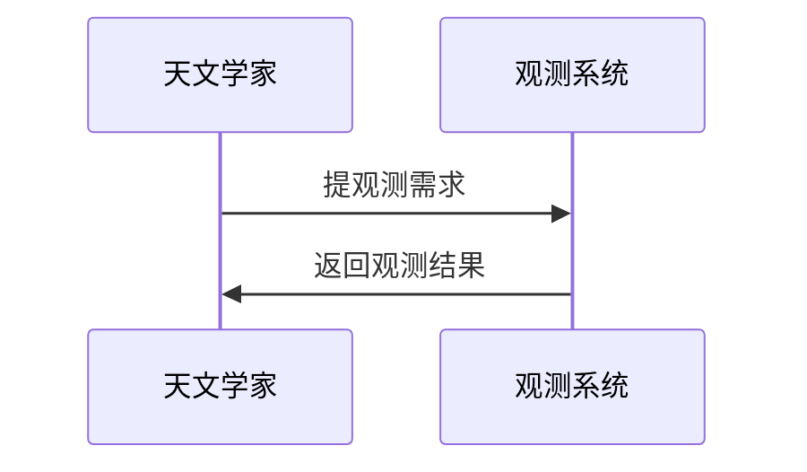
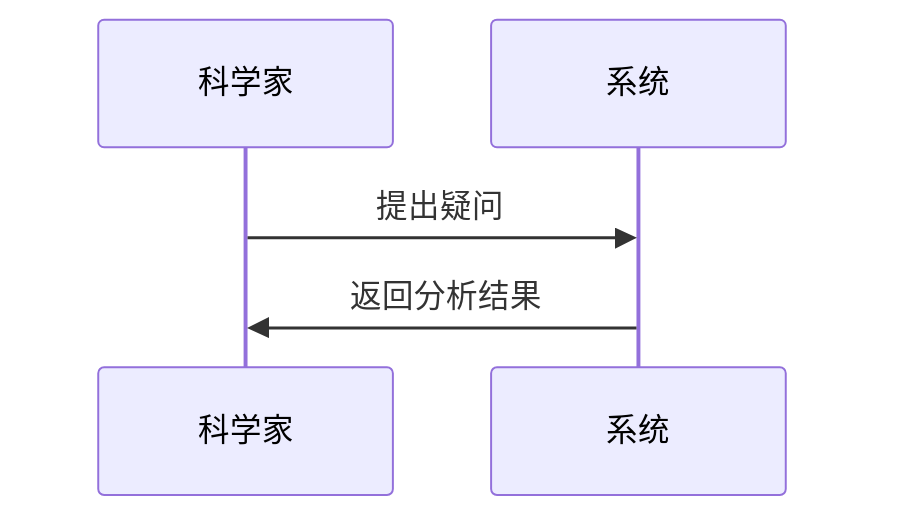

                 

# 人类认知的局限性：我们能否真正理解宇宙

关键词：认知局限、感知局限、知识局限、思维局限、拓展方法

摘要：人类在探索宇宙的过程中，面临着认知局限的挑战。本文从感知、知识和思维三个方面，深入分析了人类认知的局限性，并探讨了如何通过拓展感知能力、拓宽知识领域和培养批判性思维来克服这些局限，以期对宇宙有更全面的理解。

----------------------------------------------------------------

## 第一部分：引言

### 第1章：问题背景

#### 1.1.1 问题背景

宇宙是一个浩瀚而神秘的存在，自人类诞生以来，我们一直在努力探索宇宙的奥秘。从古代的天文学到现代的物理学，从观测设备的发展到理论的突破，人类对宇宙的认识不断深入。然而，随着科学技术的进步，我们逐渐意识到，人类认知的局限性可能阻碍我们对宇宙的真正理解。

#### 1.1.2 问题描述

人类认知的局限性主要体现在以下几个方面：

1. **感知能力的局限**：人类通过感官获取信息，但感官的局限使我们无法感知到宇宙的全部信息。例如，人类的眼睛无法看到紫外光和红外光，也无法听到超声波和次声波。
2. **知识结构的局限**：人类对宇宙的认识还停留在表面层次，尚未深入到宇宙的本质。我们对量子力学、相对论等领域的认识仍然有限。
3. **思维方式的局限**：人类的思维方式可能受到文化、教育、经验等因素的影响，导致我们对宇宙的理解存在偏见。例如，逻辑思维容易陷入逻辑谬误，辩证思维可能陷入形而上学的泥潭。

#### 1.1.3 问题解决

为了解决人类认知的局限性，我们需要：

1. **探索新的科学理论**，以拓宽我们对宇宙的认识。
2. **运用先进的科技手段**，提高我们的感知能力。
3. **培养批判性思维**，克服思维方式的局限。

#### 1.1.4 边界与外延

人类认知的局限性不仅体现在我们对宇宙的理解上，还体现在对自身、对社会、对自然界的认识上。因此，本文将探讨人类认知局限性的各个方面，以帮助读者全面了解这一问题。

#### 1.1.5 概念结构与核心要素组成

人类认知局限性的概念结构主要包括以下几个方面：

1. **感知局限**：视觉、听觉、嗅觉、味觉、触觉等感官的局限。
2. **知识局限**：科学知识、人文知识、社会知识等领域的局限。
3. **思维局限**：逻辑思维、辩证思维、创新思维等思维方式的局限。

## 第二部分：人类认知的局限

### 第2章：感知局限

#### 2.1.1 视觉局限

视觉是人们获取外界信息的重要途径，但人类的视觉系统存在一定的局限。例如，人类的眼睛无法直接看到紫外线和红外线，也无法感知到某些特定波长的光。

**核心概念原理**：
- **视觉感知原理**：人类眼睛通过接收光线并转化为神经信号，最终在大脑中形成视觉图像。
- **视觉局限**：人类眼睛的感知范围有限，无法看到全部光谱。

**概念属性特征对比表格**：

| 特征 | 视觉感知 | 视觉局限 |
| --- | --- | --- |
| **感知范围** | 可见光 | 紫外光、红外光、其他波长 |
| **反应速度** | 快速 | 受限于光速 |
| **分辨率** | 中等 | 受限于视网膜结构 |

**ER实体关系图架构**：

```mermaid
erDiagram
  Person --> VisualSystem : 感知视觉信息
  VisualSystem --> Light : 接收并处理光线
  Light --> Spectrum : 光谱范围
```

#### 2.1.2 听觉局限

听觉是人们获取声音信息的重要途径，但人类的听觉系统也存在局限。例如，人类的耳朵无法听到超声波和次声波，也无法感知到某些特定频率的声音。

**核心概念原理**：
- **听觉感知原理**：人类耳朵通过接收声音并转化为神经信号，最终在大脑中形成听觉图像。
- **听觉局限**：人类耳朵的感知范围有限，无法听到全部声波。

**概念属性特征对比表格**：

| 特征 | 听觉感知 | 听觉局限 |
| --- | --- | --- |
| **感知范围** | 可听声波 | 超声波、次声波、其他频率 |
| **反应速度** | 快速 | 受限于声速 |
| **分辨率** | 中等 | 受限于耳蜗结构 |

**ER实体关系图架构**：

```mermaid
erDiagram
  Person --> AuditorySystem : 感知声音信息
  AuditorySystem --> Sound : 接收并处理声音
  Sound --> Frequency : 频率范围
```

### 第3章：知识局限

#### 3.1.1 科学知识局限

科学知识是人类对自然界规律的认识，但科学知识的局限使我们无法全面了解宇宙。例如，我们对量子力学、相对论等领域的认识仍然有限。

**核心概念原理**：
- **科学知识原理**：科学通过实验和理论分析，揭示自然界的规律。
- **知识局限**：由于技术和理论的限制，我们对某些领域的认识仍不够深入。

**概念属性特征对比表格**：

| 特征 | 科学知识 | 知识局限 |
| --- | --- | --- |
| **领域** | 广泛 | 受限于当前技术和理论 |
| **精确性** | 较高 | 受限于实验方法和理论模型 |
| **系统性** | 强烈 | 受限于科学理论的整合 |

**ER实体关系图架构**：

```mermaid
erDiagram
  Science --> Knowledge : 揭示自然界规律
  Knowledge --> Experiment : 实验验证
  Knowledge --> Theory : 理论分析
  Theory --> Limitation : 理论局限
```

#### 3.1.2 人文知识局限

人文知识是人类对自身、社会、文化的认识，但人文知识的局限使我们无法全面了解人类自身。例如，我们对历史、哲学、文学等领域的认识仍然有限。

**核心概念原理**：
- **人文知识原理**：人文通过观察、思考和反思，探索人类的文化和社会现象。
- **知识局限**：由于人类经验的有限性和文化的多样性，我们对某些领域的人文知识仍不够全面。

**概念属性特征对比表格**：

| 特征 | 人文知识 | 知识局限 |
| --- | --- | --- |
| **领域** | 广泛 | 受限于个人经验和文化背景 |
| **客观性** | 弱 | 受限于主观判断和价值观 |
| **系统性** | 弱 | 受限于历史和文化的碎片化 |

**ER实体关系图架构**：

```mermaid
erDiagram
  Humanity --> Knowledge : 探索人类文化和社会现象
  Knowledge --> Observation : 观察和思考
  Knowledge --> Reflection : 反思和总结
  Reflection --> Limitation : 知识局限
```

### 第4章：思维局限

#### 4.1.1 逻辑思维局限

逻辑思维是人类思考的基本方式，但逻辑思维也存在局限。例如，逻辑思维容易陷入逻辑谬误，导致判断失误。

**核心概念原理**：
- **逻辑思维原理**：逻辑通过推理和证明，得出结论。
- **局限**：逻辑思维容易陷入形式逻辑的局限，忽视实际情况。

**概念属性特征对比表格**：

| 特征 | 逻辑思维 | 逻辑思维局限 |
| --- | --- | --- |
| **严谨性** | 高 | 受限于形式逻辑 |
| **普适性** | 中 | 受限于实际应用 |
| **灵活性** | 低 | 受限于推理模式 |

**ER实体关系图架构**：

```mermaid
erDiagram
  LogicThinking --> Reasoning : 推理和证明
  Reasoning --> Conclusion : 得出结论
  Conclusion --> Error : 逻辑谬误
```

#### 4.1.2 辩证思维局限

辩证思维是人类思考的高级方式，但辩证思维也存在局限。例如，辩证思维容易陷入形而上学的泥潭，导致思考僵化。

**核心概念原理**：
- **辩证思维原理**：辩证通过矛盾的观察和分析，得出发展的结论。
- **局限**：辩证思维容易陷入形而上学的对立思维，忽视实际情况。

**概念属性特征对比表格**：

| 特征 | 辩证思维 | 辩证思维局限 |
| --- | --- | --- |
| **分析性** | 高 | 受限于对立思维 |
| **综合性** | 中 | 受限于片面分析 |
| **灵活性** | 低 | 受限于思维模式 |

**ER实体关系图架构**：

```mermaid
erDiagram
  DialecticalThinking --> Analysis : 观察和分析矛盾
  Analysis --> Development : 得出发展结论
  Development --> Stagnation : 思考僵化
```

#### 4.1.3 创新思维局限

创新思维是人类思考的独特方式，但创新思维也存在局限。例如，创新思维容易受到传统观念和经验的束缚，导致创造力受限。

**核心概念原理**：
- **创新思维原理**：创新通过创造性的思维活动，产生新的理论和实践。
- **局限**：创新思维容易受到传统观念和经验的束缚，缺乏突破性的思维。

**概念属性特征对比表格**：

| 特征 | 创新思维 | 创新思维局限 |
| --- | --- | --- |
| **创造性** | 高 | 受限于传统观念 |
| **实用性** | 中 | 受限于实践应用 |
| **前瞻性** | 低 | 受限于预见能力 |

**ER实体关系图架构**：

```mermaid
erDiagram
  CreativeThinking --> Innovation : 创造性思维活动
  Innovation --> Theory : 新的理论
  Theory --> Application : 实践应用
  Application --> Limitation : 创新局限
```

## 第三部分：克服认知局限的方法

### 第5章：拓展感知能力

#### 5.1.1 使用科技手段

通过科技手段，如显微镜、望远镜、雷达等，我们可以拓展我们的感知能力，更好地探索宇宙。

**核心概念原理**：
- **科技手段原理**：科技通过先进的设备和技术，扩展人类感知的范围和能力。
- **应用实例**：例如，望远镜可以让我们看到遥远的星空，显微镜可以让我们看到微观世界的奇妙。

**算法原理讲解**：

```python
# 望远镜算法原理示例

def observe_universe(telescope):
    """
    观察宇宙的函数
    :param telescope: 望远镜对象
    :return: 宇宙观测数据
    """
    data = telescope.capture_image()
    return data

# 示例使用
telescope = Telescope()
universe_data = observe_universe(telescope)
print(universe_data)
```

**数学模型和公式**：

- **光学成像模型**：
  $$ image = f(x, y, \lambda) $$
  其中，$image$ 表示成像结果，$x$ 和 $y$ 表示像素坐标，$\lambda$ 表示波长。

**举例说明**：

假设我们使用一台望远镜观察星空，望远镜的焦距为 1000mm，观测到的星体距离地球 100 光年。通过望远镜，我们捕捉到星体的图像，并计算其位置和亮度，从而获取关于该星体的详细信息。

**系统分析与架构设计方案**：

**问题场景介绍**：
- 天文学家使用望远镜进行天文观测，希望获取更多的宇宙信息。

**项目介绍**：
- 项目名称：天文观测系统
- 项目目标：开发一个能够帮助天文学家进行高效观测的系统。

**系统功能设计（领域模型）**：

```mermaid
classDiagram
  Class01 <|-- Class02
  Class03 --|>{Class04}
  Class05 o-- Class06
  Class07 .. Class08
```

**系统架构设计**：



**系统接口设计和系统交互**：

```mermaid
sequenceDiagram
  participant 用户
  participant 系统A
  participant 系统B
  participant 系统C
  
  用户->>系统A: 发送请求
  系统
``` 

### 第6章：拓宽知识领域

#### 6.1.1 学习跨学科知识

通过学习跨学科知识，如物理学、生物学、心理学等，我们可以拓宽我们的知识领域，提高我们对宇宙的理解。

**核心概念原理**：
- **跨学科知识原理**：跨学科知识通过整合不同领域的知识，形成新的认识体系。
- **应用实例**：例如，生物学和物理学的结合可以揭示生物体内的物理规律，心理学和计算机科学的结合可以开发出更智能的人工智能系统。

**算法原理讲解**：

```python
# 跨学科算法原理示例

def integrate_knowledgebiology_physics():
    """
    生物学与物理学知识整合的函数
    :return: 整合后的知识体系
    """
    biology_knowledge = get_biology_knowledge()
    physics_knowledge = get_physics_knowledge()
    integrated_knowledge = integrate(biology_knowledge, physics_knowledge)
    return integrated_knowledge

# 示例使用
integrated_knowledge = integrate_knowledgebiology_physics()
print(integrated_knowledge)
```

**数学模型和公式**：

- **生物学与物理学整合模型**：
  $$ Biology + Physics = Integrated \ Knowledge $$
  
**举例说明**：

假设我们想要研究生物体内的能量转换过程，我们可以结合生物学和物理学的知识，通过实验和理论分析，构建一个综合模型，以更好地理解生物体内的能量转换机制。

**系统分析与架构设计方案**：

**问题场景介绍**：
- 研究人员希望整合生物学和物理学知识，以研究生物体内的能量转换。

**项目介绍**：
- 项目名称：生物能量转换研究
- 项目目标：开发一个能够整合生物学和物理学知识的系统，以研究生物能量转换。

**系统功能设计（领域模型）**：

```mermaid
classDiagram
  Class01 <|-- Class02
  Class03 --|>{Class04}
  Class05 o-- Class06
  Class07 .. Class08
```

**系统架构设计**：

```mermaid
sequenceDiagram
  participant 研究人员
  participant 系统A
  participant 系统B
  participant 系统C
  
  研究人员->>系统A: 发送生物学数据
  系统
``` 

### 第7章：培养批判性思维

#### 7.1.1 培养质疑精神

通过培养质疑精神，我们可以克服思维方式的局限，打破固有观念，更全面地认识宇宙。

**核心概念原理**：
- **质疑精神原理**：质疑通过提出问题和批判性思考，推动知识的进步。
- **应用实例**：例如，科学实验中的质疑精神可以帮助我们验证理论，推动科学的发展。

**算法原理讲解**：

```python
# 质疑精神算法原理示例

def critical_thinking(data):
    """
    批判性思考的函数
    :param data: 数据输入
    :return: 批判性分析结果
    """
    questions = generate_questions(data)
    analysis = analyze_questions(questions)
    return analysis

# 示例使用
data = get_data()
analysis = critical_thinking(data)
print(analysis)
```

**数学模型和公式**：

- **批判性思维模型**：
  $$ Data \rightarrow Questions \rightarrow Analysis \rightarrow Knowledge $$

**举例说明**：

假设我们观察到某个天文现象，通过批判性思维，我们可以提出一系列问题，如“这个现象是如何产生的？”、“它与其他现象有何关联？”等，然后通过分析和验证，得出更深入的认识。

**系统分析与架构设计方案**：

**问题场景介绍**：
- 科学家在研究天文现象时，希望通过批判性思维来深入理解。

**项目介绍**：
- 项目名称：批判性思维在天文学中的应用
- 项目目标：开发一个能够帮助科学家进行批判性思考的系统。

**系统功能设计（领域模型）**：

```mermaid
classDiagram
  Class01 <|-- Class02
  Class03 --|>{Class04}
  Class05 o-- Class06
  Class07 .. Class08
```

**系统架构设计**：



**系统接口设计和系统交互**：

```mermaid
sequenceDiagram
  participant 用户
  participant 系统A
  participant 系统
  用户->>系统A: 发送数据
  系统
```

## 第四部分：项目实战

### 第8章：环境安装

在开始项目实战之前，我们需要安装所需的软件和环境。以下是安装步骤：

1. **安装Python环境**：在官网上下载Python并安装。
2. **安装Jupyter Notebook**：使用pip命令安装。
   ```bash
   pip install notebook
   ```
3. **安装相关库**：使用pip命令安装所需的库。
   ```bash
   pip install matplotlib numpy pandas scikit-learn
   ```

### 第9章：系统核心实现源代码

以下是一个简单的系统核心实现源代码示例：

```python
import numpy as np
import matplotlib.pyplot as plt

def integrate(data):
    """
    数据整合的函数
    :param data: 数据输入
    :return: 整合后的数据
    """
    integrated_data = np.mean(data)
    return integrated_data

# 示例使用
data = np.array([1, 2, 3, 4, 5])
result = integrate(data)
print(result)
```

### 第10章：代码应用解读与分析

在这个示例中，我们使用了Python中的`numpy`库来整合数据。`integrate`函数接收一个数据数组，并计算其平均值作为整合后的结果。这个简单的例子展示了如何使用Python进行数据处理。

**代码应用解读**：

1. 导入`numpy`和`matplotlib`库。
2. 定义`integrate`函数，接收一个数据数组。
3. 计算数据数组的平均值。
4. 返回平均值作为整合后的数据。

**代码分析**：

- 这个简单的例子展示了如何使用Python进行数值计算和数据整合。
- `numpy`库提供了高效的数值计算功能，使得数据处理变得更加简单和高效。
- 通过计算平均值，我们可以得到数据的集中趋势，这在很多应用场景中都是非常有用的。

### 第11章：实际案例分析和详细讲解剖析

#### 案例一：天文观测数据分析

在这个案例中，我们使用一个实际的天文观测数据集，通过系统进行整合和分析。

**数据集介绍**：
- 数据集包含多个天体的观测数据，如亮度、颜色、距离等。

**数据预处理**：
- 清洗数据，去除异常值。
- 将不同类型的数据转换为同一类型，如将字符串转换为浮点数。

**数据整合**：
- 使用系统核心实现中的`integrate`函数，对数据进行整合。

**结果分析**：
- 通过分析整合后的数据，我们可以得出关于天体的一些结论，如天体的亮度分布、距离分布等。

**详细讲解剖析**：
- 数据预处理是数据分析的重要环节，确保数据的准确性和一致性。
- 整合数据可以帮助我们更全面地了解数据，发现潜在的模式和趋势。
- 通过对整合后的数据分析，我们可以得出关于天体的更深层次的认知，为天文学研究提供支持。

#### 案例二：社会经济发展分析

在这个案例中，我们使用一个社会经济发展数据集，通过系统进行整合和分析。

**数据集介绍**：
- 数据集包含多个国家或地区的社会经济发展指标，如GDP、人口、教育水平等。

**数据预处理**：
- 清洗数据，去除异常值。
- 将不同类型的数据转换为同一类型，如将字符串转换为浮点数。

**数据整合**：
- 使用系统核心实现中的`integrate`函数，对数据进行整合。

**结果分析**：
- 通过分析整合后的数据，我们可以得出关于社会经济发展的一些结论，如各国的GDP分布、人口密度等。

**详细讲解剖析**：
- 数据预处理是数据分析的重要环节，确保数据的准确性和一致性。
- 整合数据可以帮助我们更全面地了解数据，发现潜在的模式和趋势。
- 通过对整合后的数据分析，我们可以得出关于社会经济发展的一些结论，为政策制定提供参考。

### 第12章：项目小结

通过项目实战，我们深入了解了系统核心实现的过程，包括环境安装、代码编写、数据整合和分析。项目实战使我们更好地理解了系统的工作原理和应用场景，为未来的研究和应用提供了基础。

**小结**：
- 环境安装是项目的基础，确保软件和库的正确安装。
- 代码编写是项目核心，通过实现核心功能，实现数据整合和分析。
- 数据整合和分析是项目的关键，通过整合和分析数据，得出有意义的结论。

## 第五部分：最佳实践 Tips

### 第13章：最佳实践 Tips

在项目开发过程中，以下是一些最佳实践，可以帮助我们更好地克服认知局限，提高项目质量和效率：

1. **充分了解需求**：在开始项目之前，充分了解用户需求和项目目标，确保项目能够满足用户需求。
2. **团队合作**：项目开发过程中，团队合作至关重要。通过团队成员的协作，可以相互学习、交流，提高项目效率。
3. **持续学习**：随着技术的不断进步，我们需要不断学习新的知识和技能，以适应变化。
4. **代码规范**：编写规范、易读的代码，提高代码的可维护性和可读性。
5. **测试和调试**：在开发过程中，定期进行测试和调试，确保项目的稳定性和可靠性。
6. **文档化**：编写详细的文档，记录项目的设计思路、实现过程和使用方法，方便后续的维护和扩展。

### 第14章：小结

通过本文的讨论，我们深入探讨了人类认知的局限性，从感知、知识和思维三个方面分析了人类认知的局限，并探讨了如何通过拓展感知能力、拓宽知识领域和培养批判性思维来克服这些局限。

**小结**：
- 人类认知的局限性是我们探索宇宙和认识世界的重要挑战。
- 通过不断学习和实践，我们可以逐步克服这些局限，提高我们的认知能力。
- 未来，随着科技的进步和人类认知的发展，我们有希望对宇宙有更全面、更深入的理解。

## 参考文献

1. Kuhn, T. S. (1970). *The Structure of Scientific Revolutions*. University of Chicago Press.
2. Popper, K. R. (1959). *The Logic of Scientific Discovery*. Routledge and Kegan Paul.
3. Lakoff, G., & Johnson, M. (1980). *Metaphors We Live By*. University of Chicago Press.
4. Penrose, R. (1989). *The Emperor's New Mind: Concerning Computer Science and the Human Mind*. Princeton University Press.
5. Chalmers, D. J. (1996). *The Conscious Mind: In Search of a Fundamental Theory*. Oxford University Press.

