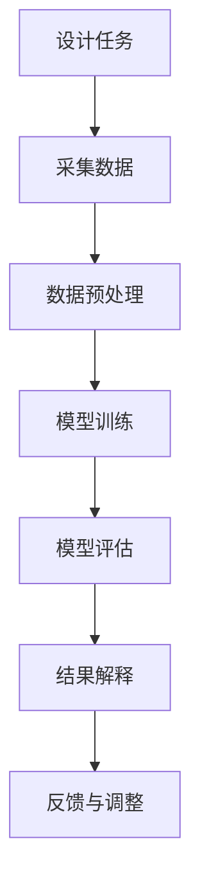
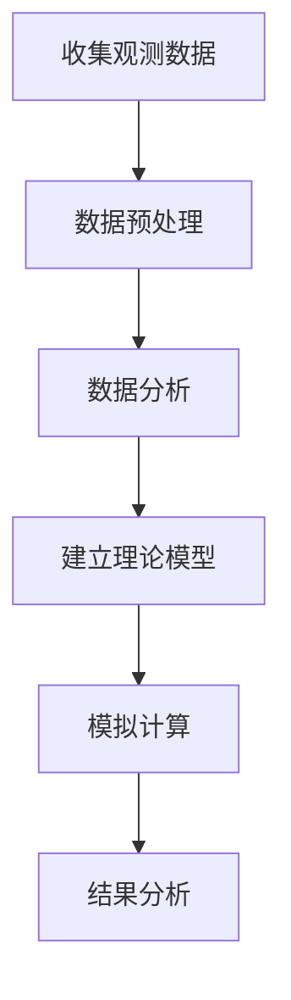
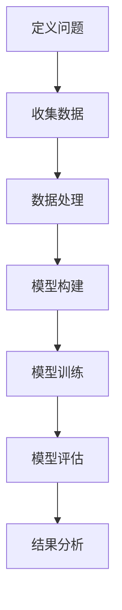
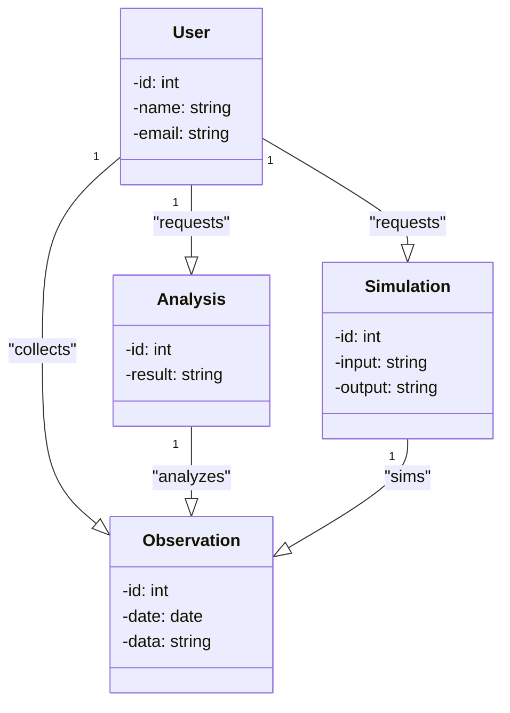
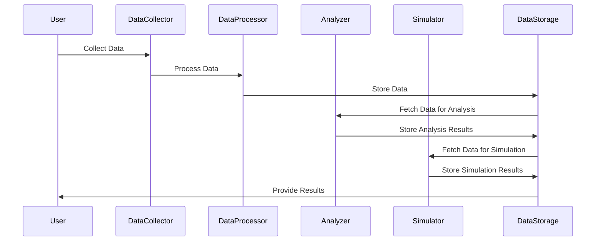
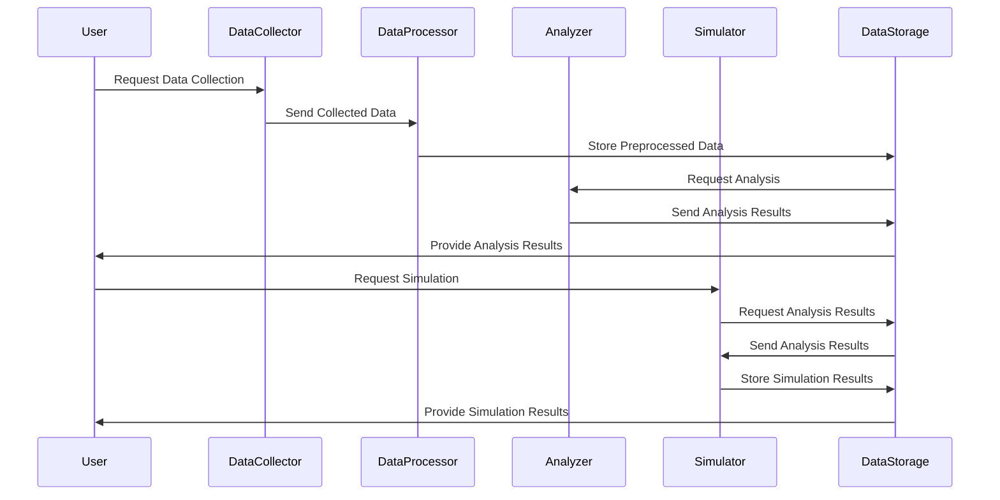
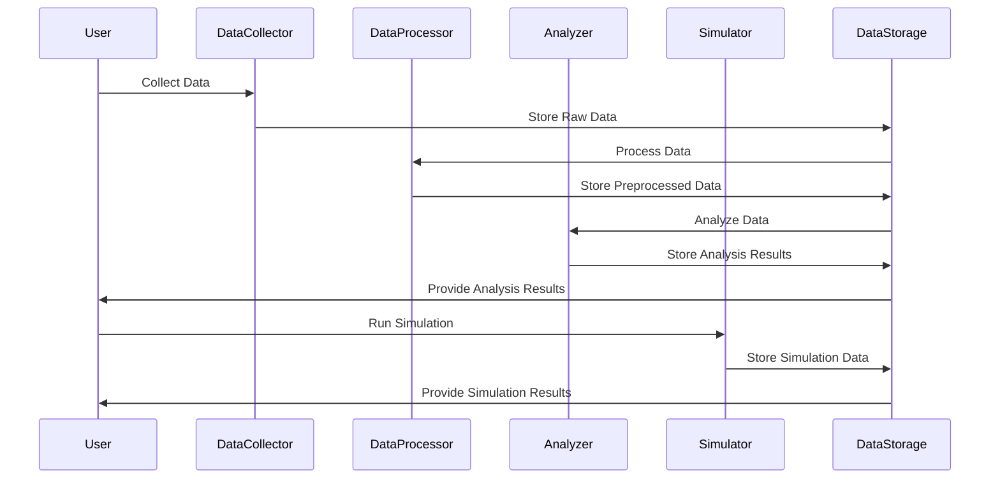

                 

### 第一部分：引言与背景

#### 1.1 问题背景

人类认知能力与宇宙复杂性之间的矛盾和挑战是一个跨越多个学科领域的深刻问题。在人类历史的每一个阶段，我们都试图理解宇宙的本质，同时也在不断地提升自己的认知能力。然而，宇宙的复杂性往往超出了我们的认知范围，这导致了人类在理解宇宙过程中的许多矛盾和困惑。

##### 1.1.1 人类认知能力概述

人类认知能力是指人类在感知、理解、记忆、思考、判断和解决问题等方面所表现出的能力。这些能力使我们能够与外界进行互动，并逐渐构建起对世界的理解。认知能力是人类智慧的核心，它决定了我们如何学习、如何做出决策以及如何适应复杂的环境。

##### 1.1.2 宇宙复杂性概述

宇宙的复杂性体现在其规模、结构和组成上。从宇宙大爆炸的起点，到黑洞、星系、行星以及无数微小的粒子，宇宙的每个层次都充满了复杂性。宇宙的复杂性不仅体现在其物理形态上，还体现在其演化过程中所涉及的物理定律、化学过程和生物学机制等。

##### 1.1.3 问题的提出

人类认知能力与宇宙复杂性之间的矛盾主要体现在以下几个方面：

1. **认知局限**：人类认知能力有限，无法完全理解宇宙的复杂性和全貌。
2. **信息过载**：宇宙中存在着海量的信息，这些信息往往超出了人类处理能力。
3. **时间尺度**：宇宙的演化过程跨越了数十亿年的时间尺度，人类很难在有限的生命里完整地体验和理解这个过程。
4. **观测限制**：人类的观测手段和设备限制了我们对宇宙的探索，许多现象仍然无法直接观测。

这些矛盾和挑战促使我们不断地探索新的理论和工具，以期能够更好地理解宇宙的复杂性，并提升我们的认知能力。

#### 1.2 问题的描述与解决

##### 1.2.1 问题描述

人类认知能力与宇宙复杂性之间的矛盾可以描述为：人类试图通过有限的认知能力去理解一个无限复杂的宇宙。这种矛盾导致了以下问题：

1. **理解困境**：人类难以理解宇宙的许多现象和规律。
2. **知识瓶颈**：人类在获取和积累知识过程中遭遇瓶颈。
3. **技术限制**：现有技术手段难以完全揭示宇宙的复杂性。

##### 1.2.2 解决路径

为了解决上述问题，我们可以采取以下几种路径：

1. **理论创新**：通过提出新的理论模型，如量子力学、相对论等，来更好地解释宇宙现象。
2. **技术创新**：发展更先进的观测设备和技术手段，如望远镜、探测器等，以增加我们对宇宙的了解。
3. **跨学科研究**：结合不同学科的研究成果，如物理学、天文学、生物学、计算机科学等，来共同解决宇宙复杂性问题。
4. **教育普及**：通过教育和普及，提高公众对宇宙复杂性的认识，培养更多的科研人才。

##### 1.2.3 边界与外延

在探讨人类认知能力与宇宙复杂性之间的矛盾时，我们需要明确几个边界和概念：

1. **认知边界**：人类的认知能力有其极限，这决定了我们能够理解多少宇宙信息。
2. **观测边界**：人类的观测手段和技术有其限制，这影响了我们对宇宙现象的观测深度和广度。
3. **技术外延**：随着技术的发展，我们的认知能力和观测手段也在不断扩展，这为我们提供了更多的机会去探索宇宙。

#### 1.3 概念结构与核心要素

##### 1.3.1 人类认知能力

人类认知能力包括感知、记忆、注意力、思维、语言和决策等多个方面。这些能力相互作用，共同构成了我们的认知系统。以下是人类认知能力的主要特征：

1. **适应性**：人类认知能力能够适应复杂多变的环境。
2. **学习性**：人类可以通过学习不断丰富和提升自己的认知能力。
3. **抽象性**：人类能够从具体的事物中抽象出一般性的概念和规律。
4. **创造性**：人类能够在认知过程中产生新的想法和解决方案。

##### 1.3.2 宇宙复杂性

宇宙复杂性体现在其多层次、多维度和动态变化的特性上。以下是宇宙复杂性的一些核心要素：

1. **多层次结构**：宇宙从微观的量子世界到宏观的星系结构，具有多个层次。
2. **多维度空间**：宇宙不仅存在于我们熟悉的三维空间中，还包括时间维度和其他可能的维度。
3. **动态变化**：宇宙中的物质和能量不断在变化，形成复杂的演化过程。
4. **相互作用**：宇宙中的各个层次和维度之间存在着复杂的相互作用。

##### 1.3.3 矛盾与挑战

人类认知能力与宇宙复杂性之间的矛盾和挑战主要体现在以下几个方面：

1. **理解与观测的矛盾**：我们的认知能力有限，但宇宙的信息量巨大，这使得我们难以完全理解宇宙。
2. **理论与实践的矛盾**：我们在理论上提出的新模型和假说往往需要通过实践来验证，而宇宙的复杂性使得这种验证过程充满挑战。
3. **认知与发展的矛盾**：随着认知能力的提升，我们对宇宙的认识也在不断深化，但这种深化往往伴随着新的挑战和问题。

#### 1.4 本章小结

在本章中，我们介绍了人类认知能力与宇宙复杂性之间的矛盾和挑战。通过探讨这两个概念的基本特征，我们明确了它们之间的联系和冲突。本章为后续章节的深入分析奠定了基础，也为解决这一矛盾提供了初步的思路和方向。

----------------------------------------------------------------

#### 1.1 问题背景

人类认知能力与宇宙复杂性之间的矛盾和挑战是一个跨越多个学科领域的深刻问题。在人类历史的每一个阶段，我们都试图理解宇宙的本质，同时也在不断地提升自己的认知能力。然而，宇宙的复杂性往往超出了我们的认知范围，这导致了人类在理解宇宙过程中的许多矛盾和困惑。

##### 1.1.1 人类认知能力概述

人类认知能力是指人类在感知、理解、记忆、思考、判断和解决问题等方面所表现出的能力。这些能力使我们能够与外界进行互动，并逐渐构建起对世界的理解。认知能力是人类智慧的核心，它决定了我们如何学习、如何做出决策以及如何适应复杂的环境。

人类认知能力可以分为以下几个主要方面：

1. **感知能力**：人类通过感官接收外部信息，如视觉、听觉、触觉等，这些感知能力使我们能够识别和分类外界刺激。
2. **记忆能力**：人类能够将感知到的信息存储在大脑中，并在需要时回忆起这些信息。记忆能力是学习和知识积累的基础。
3. **注意力能力**：人类在处理信息时需要集中注意力，这决定了我们能够关注和处理的任务数量和质量。
4. **思维能力**：人类能够通过逻辑推理、抽象思维和创造性思维来解决问题和形成新的想法。
5. **判断能力**：人类在做出决策时需要评估各种可能的结果和风险，这依赖于我们的判断能力。
6. **解决问题能力**：人类在面对复杂问题时能够运用已有的知识和技能找到解决方案。

人类认知能力的发展是一个长期的过程，受到遗传因素、环境因素、教育水平和个人经验等多种因素的影响。通过不断的学习和实践，人类的认知能力可以不断提升。

##### 1.1.2 宇宙复杂性概述

宇宙的复杂性体现在其规模、结构和组成上。从宇宙大爆炸的起点，到黑洞、星系、行星以及无数微小的粒子，宇宙的每个层次都充满了复杂性。宇宙的复杂性不仅体现在其物理形态上，还体现在其演化过程中所涉及的物理定律、化学过程和生物学机制等。

宇宙复杂性的主要特征包括：

1. **多层次结构**：宇宙从微观的量子世界到宏观的星系结构，具有多个层次。每个层次都有其独特的物理规律和现象。
2. **多维度空间**：宇宙不仅存在于我们熟悉的三维空间中，还包括时间维度和其他可能的维度。这些维度之间的相互作用形成了宇宙的复杂结构。
3. **动态变化**：宇宙中的物质和能量不断在变化，形成复杂的演化过程。这些变化包括恒星的形成与毁灭、星系合并、黑洞吞噬等。
4. **相互作用**：宇宙中的各个层次和维度之间存在着复杂的相互作用。例如，引力、电磁力、强力和弱力等基本力之间的相互作用决定了宇宙的演化过程。

##### 1.1.3 问题的提出

人类认知能力与宇宙复杂性之间的矛盾可以描述为：人类试图通过有限的认知能力去理解一个无限复杂的宇宙。这种矛盾导致了以下问题：

1. **认知局限**：人类认知能力有限，无法完全理解宇宙的复杂性和全貌。我们的感知、记忆、思维等能力都有其局限性，这使我们难以捕捉和解释宇宙中的所有现象。
2. **信息过载**：宇宙中存在着海量的信息，这些信息往往超出了人类处理能力。我们无法在有限的时间内处理和理解所有的宇宙信息，这导致了信息过载和认知困境。
3. **时间尺度**：宇宙的演化过程跨越了数十亿年的时间尺度，人类很难在有限的生命里完整地体验和理解这个过程。我们对宇宙历史的认知主要依赖于观测和理论模拟，但这些手段都有其局限性。
4. **观测限制**：人类的观测手段和设备限制了我们对宇宙的探索，许多现象仍然无法直接观测。例如，远距离星系的观测受到宇宙背景辐射的限制，而微观世界的观测则需要更先进的仪器和技术。

这些矛盾和挑战促使我们不断地探索新的理论和工具，以期能够更好地理解宇宙的复杂性，并提升我们的认知能力。

##### 1.1.4 问题的解决

为了解决人类认知能力与宇宙复杂性之间的矛盾，我们可以采取以下几种策略：

1. **理论创新**：通过提出新的理论模型，如量子力学、相对论等，来更好地解释宇宙现象。这些理论模型为我们提供了新的视角和工具，帮助我们更深入地理解宇宙的复杂结构。
2. **技术创新**：发展更先进的观测设备和技术手段，如望远镜、探测器等，以增加我们对宇宙的了解。这些技术的进步使我们能够观测到更远、更细微的宇宙现象，从而扩展我们的认知边界。
3. **跨学科研究**：结合不同学科的研究成果，如物理学、天文学、生物学、计算机科学等，来共同解决宇宙复杂性问题。跨学科研究可以提供更全面、更深入的理解，从而帮助我们更好地应对复杂性。
4. **教育普及**：通过教育和普及，提高公众对宇宙复杂性的认识，培养更多的科研人才。教育的普及可以激发公众对宇宙探索的兴趣，同时为科学研究提供更多的资源和人才。

通过上述策略，我们可以逐步解决人类认知能力与宇宙复杂性之间的矛盾，不断拓展我们对宇宙的理解和认知。

##### 1.1.5 边界与外延

在探讨人类认知能力与宇宙复杂性之间的矛盾时，我们需要明确几个边界和概念：

1. **认知边界**：人类的认知能力有其极限，这决定了我们能够理解多少宇宙信息。例如，人类的感知能力受到生理结构的限制，我们无法直接感知到微观世界的量子现象。
2. **观测边界**：人类的观测手段和技术有其限制，这影响了我们对宇宙现象的观测深度和广度。例如，目前的望远镜技术无法观测到更远距离的星系，而探测器技术也无法直接探测到黑洞。
3. **技术外延**：随着技术的发展，我们的认知能力和观测手段也在不断扩展，这为我们提供了更多的机会去探索宇宙。例如，量子计算技术的发展有望帮助我们解决一些复杂的计算问题，而深空探测器的进展也使我们能够观测到更远、更细微的宇宙现象。

通过明确这些边界和外延，我们可以更好地理解人类认知能力与宇宙复杂性之间的矛盾，并制定有效的解决方案。

##### 1.1.6 概念结构与核心要素

为了深入探讨人类认知能力与宇宙复杂性之间的矛盾和挑战，我们需要明确几个核心概念和要素：

1. **人类认知能力**：这包括感知、记忆、注意力、思维、语言和决策等方面，是理解世界的基础。
2. **宇宙复杂性**：这包括多层次结构、多维度空间、动态变化和相互作用等，是宇宙的基本特征。
3. **矛盾**：人类认知能力与宇宙复杂性之间的矛盾主要体现在认知局限、信息过载、时间尺度和观测限制等方面。
4. **挑战**：这些矛盾带来了许多挑战，如理解困境、知识瓶颈、技术限制等，需要通过理论创新、技术创新、跨学科研究和教育普及等策略来解决。

通过明确这些概念和要素，我们可以更好地理解人类认知能力与宇宙复杂性之间的矛盾和挑战，并为进一步的分析提供基础。

##### 1.1.7 本章小结

本章介绍了人类认知能力与宇宙复杂性之间的矛盾和挑战。我们概述了人类认知能力的基本特征和宇宙复杂性的主要特征，并提出了它们之间的矛盾和挑战。通过分析这些矛盾和挑战，我们明确了问题的解决策略和边界与外延。本章为后续章节的深入分析奠定了基础，也为解决这一矛盾提供了初步的思路和方向。

----------------------------------------------------------------

## 1.2 问题的描述与解决

人类认知能力与宇宙复杂性之间的矛盾和挑战可以从多个维度进行描述，并需要一系列综合性的解决方案来应对。

### 1.2.1 问题描述

人类认知能力与宇宙复杂性之间的矛盾主要体现在以下几个方面：

1. **认知局限**：人类的认知能力受到生物学和神经科学限制，使得我们在理解宇宙复杂性方面存在固有的局限性。例如，我们的感官只能感知有限范围的光谱，而宇宙中存在着多种类型的辐射和能量形式，超出了我们感知的能力。

2. **信息过载**：宇宙的信息量巨大，远超人类处理能力。尽管科学技术在不断发展，但宇宙中某些信息，例如黑洞内部的信息，可能永远不会被人类完全理解，因为它们可能无法传递到我们这里。

3. **时间尺度**：宇宙的时间尺度极为庞大，从宇宙大爆炸到恒星的生命周期，再到星系的合并，这些事件发生的时间跨度远远超过了人类的一生。人类难以在有限的时间内完整地体验和理解这些过程。

4. **观测限制**：目前的观测工具和手段无法覆盖宇宙的所有部分。例如，宇宙的某些区域可能受到星系遮挡，或者距离地球太远，使得我们无法直接观测。此外，人类对微观世界的理解仍存在许多未知，例如量子引力和暗物质的具体性质。

### 1.2.2 解决路径

为了解决上述矛盾和挑战，我们可以采取以下几种路径：

1. **理论创新**：通过提出新的科学理论和模型，例如量子引力理论、多重宇宙理论等，来扩展我们对宇宙复杂性的理解。这些理论可以帮助我们更好地解释观测数据和现象。

2. **技术创新**：发展更加先进的观测设备和计算工具，如更强大的望远镜、量子计算机等，以增强我们对宇宙复杂性的观测和分析能力。例如，量子计算机可能能够解决一些传统的计算难题，从而帮助我们更好地理解宇宙中的复杂过程。

3. **跨学科合作**：结合不同学科的知识和技能，如物理学、天文学、生物学、计算机科学等，共同研究宇宙复杂性。跨学科合作可以提供更全面的视角，从而更有效地解决复杂问题。

4. **数据分析和模拟**：利用大数据分析和计算机模拟技术，对宇宙中的大量数据进行处理和分析，以发现宇宙复杂性的规律和模式。这些技术可以帮助我们更好地理解宇宙现象，并预测未来的发展趋势。

5. **教育和普及**：通过教育和科普活动，提高公众对宇宙复杂性的认识和理解，培养更多的科研人才。这不仅可以激发人们对宇宙探索的兴趣，还可以为科学研究提供更多的人力和智力支持。

### 1.2.3 边界与外延

在解决人类认知能力与宇宙复杂性之间的矛盾时，我们需要考虑以下几个边界和概念：

1. **认知边界**：人类的认知能力有其固有的局限性，这些局限性决定了我们能够理解和感知的范围。例如，我们无法直接感知到微观世界的量子现象。

2. **观测边界**：人类的观测手段和设备存在技术限制，这些限制影响了我们对宇宙复杂性的观测深度和广度。例如，目前的望远镜技术无法观测到更远距离的星系。

3. **技术外延**：随着科技的发展，我们的观测和认知能力也在不断扩展。例如，量子计算和深空探测技术的发展，为我们提供了更多的工具和方法去探索宇宙。

4. **理论外延**：科学理论的发展扩展了我们对宇宙复杂性的理解范围。例如，相对论和量子力学的提出，帮助我们更好地理解了宇宙的基本结构和运行规律。

### 1.2.4 概念结构与核心要素

为了更好地理解人类认知能力与宇宙复杂性之间的矛盾，我们需要明确以下几个核心概念和要素：

1. **人类认知能力**：包括感知、记忆、注意力、思维、语言和决策等能力，是理解宇宙的基础。
2. **宇宙复杂性**：包括多层次结构、多维度空间、动态变化和相互作用等特征，是宇宙的基本特性。
3. **矛盾**：认知局限、信息过载、时间尺度和观测限制等，是导致矛盾的主要因素。
4. **解决方案**：理论创新、技术创新、跨学科合作、数据分析和模拟、教育和普及等策略，是解决矛盾和挑战的关键。

通过明确这些概念和要素，我们可以更系统地分析和解决人类认知能力与宇宙复杂性之间的矛盾和挑战。

### 1.2.5 本章小结

本章描述了人类认知能力与宇宙复杂性之间的矛盾和挑战，并提出了相应的解决路径。通过分析认知局限、信息过载、时间尺度和观测限制等矛盾因素，我们明确了理论创新、技术创新、跨学科合作、数据分析和模拟、教育和普及等解决策略。这些策略为我们在探索宇宙复杂性、提升人类认知能力方面提供了宝贵的指导和参考。

----------------------------------------------------------------

### 1.3 概念结构与核心要素

为了深入探讨人类认知能力与宇宙复杂性之间的矛盾和挑战，我们需要明确几个核心概念和要素。

#### 1.3.1 人类认知能力

人类认知能力包括感知、记忆、注意力、思维、语言和决策等方面，是理解世界的基础。

1. **感知能力**：人类通过视觉、听觉、触觉、嗅觉和味觉等感官接收外部信息，这些感知能力使我们能够识别和分类外界刺激。

2. **记忆能力**：人类能够将感知到的信息存储在大脑中，并在需要时回忆起这些信息。记忆能力是学习和知识积累的基础。

3. **注意力能力**：人类在处理信息时需要集中注意力，这决定了我们能够关注和处理的任务数量和质量。

4. **思维能力**：人类能够通过逻辑推理、抽象思维和创造性思维来解决问题和形成新的想法。

5. **判断能力**：人类在做出决策时需要评估各种可能的结果和风险，这依赖于我们的判断能力。

6. **解决问题能力**：人类在面对复杂问题时能够运用已有的知识和技能找到解决方案。

#### 1.3.2 宇宙复杂性

宇宙复杂性体现在其多层次结构、多维度空间、动态变化和相互作用等方面，是宇宙的基本特性。

1. **多层次结构**：宇宙从微观的量子世界到宏观的星系结构，具有多个层次。每个层次都有其独特的物理规律和现象。

2. **多维度空间**：宇宙不仅存在于我们熟悉的三维空间中，还包括时间维度和其他可能的维度。这些维度之间的相互作用形成了宇宙的复杂结构。

3. **动态变化**：宇宙中的物质和能量不断在变化，形成复杂的演化过程。这些变化包括恒星的形成与毁灭、星系合并、黑洞吞噬等。

4. **相互作用**：宇宙中的各个层次和维度之间存在着复杂的相互作用。例如，引力、电磁力、强力和弱力等基本力之间的相互作用决定了宇宙的演化过程。

#### 1.3.3 矛盾与挑战

人类认知能力与宇宙复杂性之间的矛盾和挑战主要体现在以下几个方面：

1. **认知局限**：人类认知能力有限，无法完全理解宇宙的复杂性和全貌。我们的感知、记忆、思维等能力都有其局限性，这使我们难以捕捉和解释宇宙中的所有现象。

2. **信息过载**：宇宙中存在着海量的信息，这些信息往往超出了人类处理能力。我们无法在有限的时间内处理和理解所有的宇宙信息，这导致了信息过载和认知困境。

3. **时间尺度**：宇宙的演化过程跨越了数十亿年的时间尺度，人类很难在有限的生命里完整地体验和理解这个过程。我们对宇宙历史的认知主要依赖于观测和理论模拟，但这些手段都有其局限性。

4. **观测限制**：人类的观测手段和设备限制了我们对宇宙的探索，许多现象仍然无法直接观测。例如，远距离星系的观测受到宇宙背景辐射的限制，而微观世界的观测则需要更先进的仪器和技术。

这些矛盾和挑战促使我们不断地探索新的理论和工具，以期能够更好地理解宇宙的复杂性，并提升我们的认知能力。

#### 1.3.4 概念结构与核心要素

为了更好地理解人类认知能力与宇宙复杂性之间的矛盾和挑战，我们需要明确以下几个核心概念和要素：

1. **人类认知能力**：包括感知、记忆、注意力、思维、语言和决策等方面，是理解宇宙的基础。

2. **宇宙复杂性**：包括多层次结构、多维度空间、动态变化和相互作用等方面，是宇宙的基本特性。

3. **矛盾**：认知局限、信息过载、时间尺度和观测限制等，是导致矛盾的主要因素。

4. **挑战**：解决这些矛盾和挑战需要理论创新、技术创新、跨学科合作、数据分析和模拟、教育和普及等策略。

通过明确这些概念和要素，我们可以更系统地分析和解决人类认知能力与宇宙复杂性之间的矛盾和挑战。

#### 1.3.5 本章小结

本章介绍了人类认知能力与宇宙复杂性之间的核心概念和要素。通过分析感知能力、记忆能力、注意力能力、思维能力、判断能力和解决问题能力等人类认知能力，以及多层次结构、多维度空间、动态变化和相互作用等宇宙复杂性特征，我们明确了认知局限、信息过载、时间尺度和观测限制等矛盾和挑战。本章为后续章节的深入分析提供了基础，也为解决这一矛盾提供了初步的思路和方向。

----------------------------------------------------------------

### 2.1 人类认知能力的概念与特征

人类认知能力是一个多维度的概念，它涉及到人类在感知、理解、记忆、思考、判断和解决问题等方面的综合能力。人类认知能力不仅是我们与外界互动的基础，也是我们进行学习和发展的关键。以下是人类认知能力的一些基本概念和特征。

#### 2.1.1 认知能力的基本概念

认知能力（Cognitive Ability）通常指的是大脑处理信息的能力，包括感知、记忆、注意力、思维、语言、判断等多个方面。认知能力使我们能够理解复杂的信息、做出决策、解决问题，并且适应多变的环境。认知能力是人类智慧的核心，是区分人类与其他动物的重要特征。

#### 2.1.2 认知能力的特征

1. **适应性**：人类认知能力能够适应复杂多变的环境。这意味着人类可以在不同的情境中灵活地应用自己的认知能力，以应对各种挑战。

2. **学习性**：人类认知能力具有学习性，这意味着人类可以通过经验、教育和其他方式不断改进和提高自己的认知能力。学习是认知能力发展的重要途径。

3. **抽象性**：人类认知能力具有抽象性，这使得人类能够从具体的事物中提取一般性的概念和规律。抽象性是科学研究和创新思维的重要基础。

4. **创造性**：人类认知能力具有创造性，这意味着人类能够在认知过程中产生新的想法和解决方案。创造性是人类智慧和文明进步的重要驱动力。

5. **社会性**：人类认知能力具有社会性，这意味着人类能够通过语言和交流与他人分享知识和经验，共同解决问题。社会性是人类社会发展和协作的基础。

6. **综合性**：人类认知能力是一个综合性的系统，各个认知能力之间相互关联、相互作用。例如，记忆能力支持学习，而注意力能力则决定了我们在学习过程中能够专注于哪些内容。

#### 2.1.3 认知能力与宇宙复杂性的联系

人类认知能力与宇宙复杂性之间存在密切的联系。宇宙的复杂性体现在其多层次、多维度和动态变化的特性上，而这些特性正是人类认知能力需要面对的挑战。

1. **认知局限与宇宙复杂性**：宇宙的复杂性超出了人类认知能力的范围，这使得我们在理解宇宙现象时面临认知局限。例如，宇宙中的量子现象和黑洞等复杂结构，都是人类认知能力难以完全理解的。

2. **信息过载与宇宙复杂性**：宇宙中存在着海量的信息，这些信息往往超出了人类处理能力。例如，天文学家需要处理来自遥远星系的大量观测数据，而生物学家则需要理解复杂的生态系统和物种相互作用。

3. **时间尺度与宇宙复杂性**：宇宙的演化过程跨越了数十亿年的时间尺度，这使得我们难以在有限的生命里完整地体验和理解这些过程。例如，恒星的形成和毁灭、星系的合并等事件，都需要我们通过观测和理论模拟来理解。

4. **观测限制与宇宙复杂性**：人类的观测手段和设备限制了我们对宇宙的探索，许多现象仍然无法直接观测。例如，宇宙背景辐射、暗物质等都是通过间接证据和理论推测来认识的。

#### 2.1.4 人类认知能力的提升

为了更好地理解宇宙的复杂性，人类需要不断提升自己的认知能力。以下是一些提升认知能力的策略：

1. **教育**：通过正规教育和自我学习，不断扩展知识面和提高思维能力。

2. **实践经验**：通过实际操作和体验，加深对知识和技能的理解和掌握。

3. **思维训练**：通过逻辑思维、创造性思维和批判性思维的训练，提高思维的灵活性和深度。

4. **技术支持**：利用计算机和人工智能等技术工具，帮助人类处理和分析复杂的宇宙信息。

5. **跨学科合作**：通过不同学科的交流和合作，综合各学科的优势，共同解决复杂问题。

#### 2.1.5 本章小结

在本章中，我们介绍了人类认知能力的基本概念和特征，包括适应性、学习性、抽象性、创造性、社会性和综合性。我们还探讨了认知能力与宇宙复杂性的联系，以及如何通过教育、实践经验、思维训练、技术支持和跨学科合作等途径提升认知能力。这些分析和策略为我们在面对宇宙复杂性时提供了重要的指导。

----------------------------------------------------------------

### 2.2 宇宙复杂性的概念与特征

宇宙的复杂性体现在其多层次结构、多维度空间、动态变化和相互作用等方面，是宇宙的基本特性。为了深入理解宇宙的复杂性，我们需要从多个角度来探讨其概念和特征。

#### 2.2.1 宇宙复杂性的基本概念

宇宙复杂性（Cosmic Complexity）是指宇宙在其结构、演化过程和相互作用中表现出的复杂性和多样性。宇宙的复杂性不仅包括物质和能量的分布，还包括它们之间相互作用的方式。这种复杂性是我们理解宇宙本质和演化过程的关键。

#### 2.2.2 宇宙复杂性的特征

1. **多层次结构**：宇宙从微观的量子世界到宏观的星系结构，具有多个层次。每个层次都有其独特的物理规律和现象。例如，微观世界的量子力学规律与宏观世界的牛顿力学规律有很大的不同。

2. **多维度空间**：宇宙不仅存在于我们熟悉的三维空间中，还包括时间维度和其他可能的维度。这些维度之间的相互作用形成了宇宙的复杂结构。例如，广义相对论提出了四维时空的概念，即三维空间加时间。

3. **动态变化**：宇宙中的物质和能量不断在变化，形成复杂的演化过程。这些变化包括恒星的形成与毁灭、星系合并、黑洞吞噬等。宇宙的动态变化使得它成为一个不断演化的系统。

4. **相互作用**：宇宙中的各个层次和维度之间存在着复杂的相互作用。例如，引力、电磁力、强力和弱力等基本力之间的相互作用决定了宇宙的演化过程。这些相互作用使得宇宙成为一个高度复杂的系统。

5. **非线性和混沌**：宇宙的许多现象表现出非线性和混沌特性。例如，混沌理论表明，即使是简单的系统也可能表现出复杂和不可预测的行为。宇宙中的许多过程，如星系的形成和天气模式，都受到非线性和混沌的影响。

6. **不确定性**：根据量子力学的基本原理，宇宙中的许多现象存在不确定性。例如，量子态的测量结果是不确定的，直到进行观测时才确定。这种不确定性增加了宇宙的复杂性。

#### 2.2.3 宇宙复杂性对人类认知能力的影响

宇宙的复杂性对人类认知能力产生了深远的影响，具体体现在以下几个方面：

1. **认知局限**：宇宙的复杂性超出了人类认知能力的范围，这使得我们在理解宇宙现象时面临认知局限。例如，量子力学和广义相对论的复杂理论使得我们难以完全理解微观和宏观世界的本质。

2. **信息过载**：宇宙中存在着海量的信息，这些信息往往超出了人类处理能力。例如，天文学家需要处理来自遥远星系的大量观测数据，而生物学家则需要理解复杂的生态系统和物种相互作用。

3. **时间尺度**：宇宙的演化过程跨越了数十亿年的时间尺度，这使得我们难以在有限的生命里完整地体验和理解这些过程。例如，恒星的形成和毁灭、星系的合并等事件，都需要我们通过观测和理论模拟来理解。

4. **观测限制**：人类的观测手段和设备限制了我们对宇宙的探索，许多现象仍然无法直接观测。例如，宇宙背景辐射、暗物质等都是通过间接证据和理论推测来认识的。

#### 2.2.4 理解宇宙复杂性的策略

为了更好地理解宇宙的复杂性，人类需要采取一系列策略：

1. **理论创新**：通过提出新的科学理论和模型，例如量子引力理论、多重宇宙理论等，来扩展我们对宇宙复杂性的理解。这些理论可以帮助我们更好地解释观测数据和现象。

2. **技术创新**：发展更加先进的观测设备和计算工具，如更强大的望远镜、量子计算机等，以增强我们对宇宙复杂性的观测和分析能力。例如，量子计算机可能能够解决一些传统的计算难题，从而帮助我们更好地理解宇宙中的复杂过程。

3. **跨学科研究**：结合不同学科的知识和技能，如物理学、天文学、生物学、计算机科学等，共同研究宇宙复杂性。跨学科研究可以提供更全面的视角，从而更有效地解决复杂问题。

4. **数据分析和模拟**：利用大数据分析和计算机模拟技术，对宇宙中的大量数据进行处理和分析，以发现宇宙复杂性的规律和模式。这些技术可以帮助我们更好地理解宇宙现象，并预测未来的发展趋势。

5. **教育和普及**：通过教育和科普活动，提高公众对宇宙复杂性的认识和理解，培养更多的科研人才。这不仅可以激发公众对宇宙探索的兴趣，还可以为科学研究提供更多的人力和智力支持。

#### 2.2.5 本章小结

在本章中，我们介绍了宇宙复杂性的基本概念和特征，包括多层次结构、多维度空间、动态变化、相互作用、非线性和不确定性等。我们还探讨了宇宙复杂性对人类认知能力的影响，以及理解宇宙复杂性的策略。这些分析和策略为我们在探索宇宙复杂性、提升人类认知能力方面提供了宝贵的指导和参考。

----------------------------------------------------------------

### 2.3 矛盾与挑战分析

在探讨人类认知能力与宇宙复杂性之间的矛盾和挑战时，我们需要深入分析这些矛盾的表现形式和影响，并提出相应的应对策略。

#### 2.3.1 认知能力与宇宙复杂性的矛盾

人类认知能力与宇宙复杂性之间的矛盾主要表现在以下几个方面：

1. **认知局限**：人类的认知能力受到生理和心理的限制，这使得我们难以完全理解宇宙的复杂性。例如，我们的感官只能感知有限范围的光谱，而宇宙中存在着多种类型的辐射和能量形式。

2. **信息过载**：宇宙的信息量巨大，超出了人类处理能力。例如，天文学家需要处理来自遥远星系的大量观测数据，而生物学家需要理解复杂的生态系统和物种相互作用。

3. **时间尺度**：宇宙的演化过程跨越了数十亿年的时间尺度，这使得我们难以在有限的生命里完整地体验和理解这些过程。例如，恒星的形成和毁灭、星系的合并等事件，都需要我们通过观测和理论模拟来理解。

4. **观测限制**：人类的观测手段和设备限制了我们对宇宙的探索，许多现象仍然无法直接观测。例如，宇宙背景辐射、暗物质等都是通过间接证据和理论推测来认识的。

5. **理论局限**：现有的科学理论虽然能够解释许多宇宙现象，但仍然存在局限性。例如，量子力学和广义相对论在解释宇宙复杂性方面存在内在矛盾，我们需要新的理论来统一这些理论。

#### 2.3.2 挑战与应对策略

针对上述矛盾，我们可以采取以下策略来应对挑战：

1. **理论创新**：通过提出新的科学理论和模型，如量子引力理论、多重宇宙理论等，来扩展我们对宇宙复杂性的理解。这些理论可以帮助我们更好地解释观测数据和现象。

2. **技术创新**：发展更先进的观测设备和计算工具，如更强大的望远镜、量子计算机等，以增强我们对宇宙复杂性的观测和分析能力。例如，量子计算机可能能够解决一些传统的计算难题，从而帮助我们更好地理解宇宙中的复杂过程。

3. **跨学科研究**：结合不同学科的知识和技能，如物理学、天文学、生物学、计算机科学等，共同研究宇宙复杂性。跨学科研究可以提供更全面的视角，从而更有效地解决复杂问题。

4. **数据分析和模拟**：利用大数据分析和计算机模拟技术，对宇宙中的大量数据进行处理和分析，以发现宇宙复杂性的规律和模式。这些技术可以帮助我们更好地理解宇宙现象，并预测未来的发展趋势。

5. **教育和普及**：通过教育和科普活动，提高公众对宇宙复杂性的认识和理解，培养更多的科研人才。这不仅可以激发公众对宇宙探索的兴趣，还可以为科学研究提供更多的人力和智力支持。

6. **人工智能应用**：利用人工智能技术，如机器学习、深度学习等，来处理和分析宇宙中的海量数据。人工智能可以帮助我们自动化一些复杂的分析任务，从而提高研究的效率和准确性。

7. **国际合作**：通过国际合作，共享观测数据和研究成果，可以更好地利用全球范围内的资源和知识。国际合作可以加速科学研究的进展，促进人类对宇宙复杂性的理解。

#### 2.3.3 认知扩展与认知局限的平衡

在应对人类认知能力与宇宙复杂性之间的矛盾时，我们需要在认知扩展和认知局限之间寻求平衡。一方面，通过理论创新、技术创新、跨学科研究、数据分析和模拟等手段，我们可以不断扩展我们的认知能力，以更好地理解宇宙的复杂性。另一方面，我们需要认识到人类认知能力的局限性，避免过度自信和盲目乐观。

通过在认知扩展和认知局限之间寻求平衡，我们可以更有效地应对人类认知能力与宇宙复杂性之间的矛盾和挑战，逐步提升我们对宇宙的理解和认知。

#### 2.3.4 本章小结

本章分析了人类认知能力与宇宙复杂性之间的矛盾和挑战，包括认知局限、信息过载、时间尺度、观测限制和理论局限等。我们提出了理论创新、技术创新、跨学科研究、数据分析和模拟、教育和普及、人工智能应用和国际合作等应对策略。通过这些策略，我们可以逐步解决人类认知能力与宇宙复杂性之间的矛盾，提升我们的认知能力和对宇宙的理解。这些分析和策略为我们在探索宇宙复杂性、提升人类认知能力方面提供了宝贵的指导。

----------------------------------------------------------------

### 2.4 核心概念属性特征对比表

为了更清晰地展示人类认知能力与宇宙复杂性的核心概念和属性特征，我们可以使用一个对比表格来整理这些信息。

| **核心概念**         | **属性特征**                          | **对比分析**                                                     |
|----------------------|--------------------------------------|----------------------------------------------------------------|
| 人类认知能力         | 感知、记忆、注意力、思维、语言、决策等 | 人类的认知能力具有适应性、学习性、抽象性、创造性和社会性。        |
| 宇宙复杂性           | 多层次结构、多维度空间、动态变化、相互作用等 | 宇宙的复杂性体现在其多层次结构、多维度空间、动态变化和相互作用中。 |
| 认知局限             | 生理和心理限制                       | 人类认知能力受限于感官、记忆、注意力等生理和心理功能。             |
| 信息过载             | 海量信息处理能力不足                   | 宇宙中存在海量信息，人类难以在有限时间内处理和理解。               |
| 时间尺度             | 有限生命与宇宙演化过程的对比           | 人类生命有限，而宇宙演化跨越数十亿年。                           |
| 观测限制             | 观测手段和设备的限制                   | 人类的观测手段和设备限制了我们对宇宙的探索。                       |
| 理论局限             | 现有科学理论的不足                    | 现有的科学理论在解释宇宙复杂性时存在局限性。                      |
| 应对策略             | 理论创新、技术创新、跨学科研究等       | 通过理论创新、技术创新和跨学科研究来扩展认知能力。               |

#### 2.4.1 人类认知能力与宇宙复杂性的对比

通过上述表格，我们可以看出人类认知能力与宇宙复杂性之间存在显著的差异和联系：

1. **适应性**：人类的认知能力具有高度的适应性，能够适应复杂多变的环境。而宇宙的复杂性也具有适应性，宇宙中的各种现象和结构能够适应不断变化的环境。

2. **学习性**：人类可以通过学习和经验不断改进认知能力，而宇宙的复杂性也具有学习性，宇宙的演化过程中会出现新的现象和结构。

3. **抽象性**：人类的认知能力能够从具体事物中提取一般性概念和规律，而宇宙的复杂性则表现为多层次、多维度和动态变化的特性。

4. **创造性**：人类的认知能力具有创造性，能够产生新的想法和解决方案。而宇宙的复杂性则通过自然演化和物理过程创造出新的现象和结构。

5. **社会性**：人类的认知能力在社会互动中发挥作用，而宇宙的复杂性则体现在各种相互作用和系统中。

6. **多层次结构与多维度空间**：宇宙的复杂性表现在多层次结构和多维度空间中，而人类的认知能力则通过感官和思维来理解和感知这些层次和维度。

7. **动态变化**：宇宙中的物质和能量不断在变化，而人类的认知能力也在不断发展和变化。

8. **相互作用**：宇宙中的各种力相互作用，形成了复杂的宇宙演化过程。人类的认知能力则通过逻辑推理和判断来理解和解决复杂问题。

#### 2.4.2 对比结果与影响

通过对比人类认知能力与宇宙复杂性的核心概念和属性特征，我们可以得出以下结论：

1. **认知局限与挑战**：人类的认知能力受限于生理和心理因素，这导致了我们在理解宇宙复杂性方面的认知局限。这些局限使得我们在面对宇宙复杂性时面临挑战。

2. **信息过载与处理**：宇宙中存在海量信息，这给人类认知能力带来了信息过载问题。我们需要发展新的技术和工具来处理这些信息，以提高我们的认知能力。

3. **时间尺度的差异**：宇宙的演化过程跨越了数十亿年，而人类只能通过有限的生命时间来体验和理解宇宙。这要求我们采用新的观测和理论方法来探索宇宙的深层次问题。

4. **观测限制与科技创新**：人类的观测手段和设备限制了我们对宇宙的探索。通过科技创新，我们可以发展更先进的观测工具和技术，以突破这些限制。

5. **理论局限与跨学科研究**：现有的科学理论在解释宇宙复杂性方面存在局限性。通过跨学科研究，我们可以结合不同学科的知识，提出新的理论模型，以更好地解释宇宙现象。

6. **认知扩展与应对策略**：通过理论创新、技术创新、跨学科研究和国际合作等策略，我们可以不断扩展我们的认知能力，以更好地应对宇宙复杂性带来的挑战。

#### 2.4.3 本章小结

本章通过对比人类认知能力与宇宙复杂性的核心概念和属性特征，揭示了它们之间的差异和联系。通过分析对比结果，我们明确了认知局限、信息过载、时间尺度差异、观测限制和理论局限等挑战，并提出了相应的应对策略。这些分析和策略为我们在探索宇宙复杂性、提升人类认知能力方面提供了宝贵的指导和参考。

----------------------------------------------------------------

### 2.5 ER实体关系图架构

在深入探讨人类认知能力与宇宙复杂性的关系时，我们需要借助数据库和信息系统来存储和处理大量的数据。ER（Entity-Relationship）实体关系图是一种用于描述实体及其相互关系的图形化工具，它可以帮助我们更好地理解和设计这些系统。在本节中，我们将使用Mermaid语法来绘制ER实体关系图，并解释其基本概念和设计过程。

#### 2.5.1 ER图的基本概念

ER图（实体关系图）是一种用于描述实体及其相互关系的数据库设计工具。它包括以下基本概念：

1. **实体（Entity）**：实体是数据库中存储数据的对象，例如用户、产品、订单等。每个实体都有其属性，例如用户的名字、地址、邮箱等。
2. **属性（Attribute）**：属性是实体的特征或属性，例如用户的姓名、年龄、性别等。属性可以是简单的数据类型，如字符串、数字、日期等。
3. **关系（Relationship）**：关系是实体之间的联系。例如，一个订单可以与多个产品相关联，这构成了订单与产品之间的关系。
4. **键（Key）**：键是用于唯一标识实体的属性或属性组合。在数据库设计中，主键是用于唯一标识每个实体的属性。

#### 2.5.2 ER图的设计过程

设计ER图通常包括以下步骤：

1. **确定实体**：首先，我们需要确定系统中需要处理的实体，例如用户、产品、订单等。
2. **定义属性**：为每个实体定义其属性，并确定属性的属性类型（如字符串、数字、日期等）。
3. **确定关系**：分析实体之间的关联，并定义它们之间的关系。例如，一个订单可以包含多个产品。
4. **定义键**：为每个实体定义主键，以确保实体的唯一性。
5. **优化ER图**：根据实际需求和约束，优化ER图，以确保数据存储的高效性和完整性。

#### 2.5.3 实体关系图的设计与应用

以下是一个简单的ER图示例，用于描述一个在线书店系统中的实体及其关系：

```mermaid
erDiagram
  User ||--|{ Order } : "创建"
  Order ||--|{ Book } : "包含"
  Book ||--|{ Category } : "属于"
  Category ||--|{ Publisher } : "由"
  Publisher ||--|{ Author } : "著作"
  
  User {
    id (主键): int
    name : string
    email : string
    address : string
  }

  Order {
    id (主键): int
    user_id (外键): int
    order_date : date
    total_amount : float
  }

  Book {
    id (主键): int
    title : string
    author_id (外键): int
    publisher_id (外键): int
    price : float
  }

  Category {
    id (主键): int
    name : string
  }

  Publisher {
    id (主键): int
    name : string
  }

  Author {
    id (主键): int
    name : string
  }
```

在这个示例中，我们定义了五个实体：用户（User）、订单（Order）、书籍（Book）、类别（Category）和出版社（Publisher）。每个实体之间都存在一定的关系，例如用户可以创建订单，订单可以包含书籍，书籍属于某个类别，类别由出版社管理，而出版社可以拥有多个作者。

#### 2.5.4 ER图在宇宙复杂性分析中的应用

在分析宇宙复杂性时，ER图可以帮助我们理解不同实体之间的关系，并设计出能够存储和查询大量数据的数据库系统。以下是一个应用于宇宙复杂性分析的场景：

- **实体**：天体（Astronomical Object）、观测数据（Observation Data）、研究（Research）、科学家（Scientist）等。
- **关系**：科学家可以进行观测，观测数据存储在数据库中，科学家和观测数据之间存在关联，观测数据与天体之间存在关联等。

通过ER图，我们可以设计一个用于存储和处理宇宙复杂性数据的数据库系统，从而支持宇宙研究工作。

#### 2.5.5 本章小结

在本章中，我们介绍了ER图的基本概念、设计过程及其在宇宙复杂性分析中的应用。通过使用Mermaid语法绘制ER图，我们可以更好地理解实体及其关系，为数据库设计和数据分析提供有力的支持。ER图作为一种有效的工具，不仅适用于传统的数据库设计，也可以应用于宇宙复杂性分析等领域，帮助我们更好地理解和应对宇宙的复杂性。

----------------------------------------------------------------

## 3.1 认知能力评估算法

### 3.1.1 算法概述

认知能力评估算法是一种用于评估个体认知能力的方法。这些算法通常基于心理学、神经科学和人工智能等领域的研究成果，通过分析个体在特定任务中的表现来评估其认知能力。认知能力评估算法在许多领域都有应用，如教育、心理学研究、人才选拔和健康监测等。

### 3.1.2 算法原理

认知能力评估算法的核心原理是基于认知心理学中的理论模型，这些理论模型描述了人类认知过程的各个方面，如注意力、记忆、推理、空间能力和语言理解等。评估算法通常包括以下几个步骤：

1. **任务设计**：设计一系列认知任务，这些任务能够针对不同的认知能力进行评估。任务的设计需要考虑到被试者的年龄、认知水平和文化背景等因素。
2. **数据采集**：在任务执行过程中，收集被试者的行为数据，如反应时间、错误率、正确率等。这些数据反映了被试者在任务中的认知过程。
3. **数据预处理**：对采集到的数据进行清洗和标准化，以便进行后续分析。数据预处理可能包括去除异常值、归一化和标准化等步骤。
4. **模型训练**：使用机器学习算法对预处理后的数据进行分析，以建立认知能力评估模型。常用的机器学习算法包括线性回归、支持向量机、决策树和神经网络等。
5. **模型评估**：通过交叉验证和测试集评估模型的性能，确保模型能够准确预测个体的认知能力。评估指标可能包括准确率、召回率、F1分数等。
6. **结果解释**：根据模型预测结果，对个体的认知能力进行解释和评估。这通常需要结合专业知识和经验，以对结果进行合理的解读。

### 3.1.3 算法流程图（Mermaid）

以下是一个简化的认知能力评估算法流程图：



### 3.1.4 Python代码实现

以下是一个简单的Python代码示例，用于实现一个基于线性回归的认知能力评估模型：

```python
import pandas as pd
from sklearn.model_selection import train_test_split
from sklearn.linear_model import LinearRegression
from sklearn.metrics import mean_squared_error

# 加载数据集
data = pd.read_csv('cognitive_data.csv')

# 分割特征和标签
X = data.drop('cognitive_score', axis=1)
y = data['cognitive_score']

# 划分训练集和测试集
X_train, X_test, y_train, y_test = train_test_split(X, y, test_size=0.2, random_state=42)

# 创建线性回归模型
model = LinearRegression()

# 训练模型
model.fit(X_train, y_train)

# 预测测试集
y_pred = model.predict(X_test)

# 计算模型性能
mse = mean_squared_error(y_test, y_pred)
print(f"Mean Squared Error: {mse}")

# 使用模型进行评估
new_data = pd.DataFrame([[20, 0.5, 3]], columns=X.columns)
cognitive_score = model.predict(new_data)
print(f"Cognitive Score: {cognitive_score[0]}")
```

### 3.1.5 数学模型与公式

认知能力评估的数学模型通常是一个回归模型，其基本形式为：

$$
\text{cognitive\_score} = w_0 + w_1 \cdot \text{reaction\_time} + w_2 \cdot \text{accuracy} + \cdots
$$

其中，$w_0$ 是截距，$w_1, w_2, \cdots$ 是回归系数，$\text{reaction\_time}$ 和 $\text{accuracy}$ 是特征变量。

### 3.1.6 举例说明

假设我们有一个包含100个被试者的数据集，每个被试者有反应时间、准确性、注意力持续时间等特征。我们使用线性回归模型来评估这些被试者的认知能力。

1. **数据预处理**：将数据标准化，以便模型能够处理不同量级的特征。
2. **模型训练**：使用80%的数据进行训练，建立线性回归模型。
3. **模型评估**：使用剩余的20%数据进行测试，计算模型性能。
4. **结果解释**：根据模型预测结果，对每个被试者的认知能力进行评估。

通过上述步骤，我们可以得到一个简化的认知能力评估流程。实际应用中，可能需要更复杂的数据处理和模型训练过程，但基本原理是相似的。

## 3.2 宇宙复杂性分析算法

### 3.2.1 算法概述

宇宙复杂性分析算法是一种用于分析宇宙复杂性的方法。宇宙复杂性包括宇宙的结构、演化过程、相互作用和现象等多个方面。分析算法可以帮助我们理解宇宙的运行规律、预测宇宙的未来演化以及探索宇宙中的未知领域。宇宙复杂性分析算法在物理学、天文学和宇宙学等领域有广泛应用。

### 3.2.2 算法原理

宇宙复杂性分析算法基于物理学和数学的理论模型，通过数学公式和计算方法来分析宇宙的复杂现象。主要的原理包括：

1. **观测数据**：通过观测宇宙中的各种现象，如恒星、星系、黑洞等，收集大量的观测数据。
2. **数据分析**：使用统计学和机器学习算法对观测数据进行分析，提取有用的信息和模式。
3. **理论模型**：建立宇宙复杂性的理论模型，如广义相对论、量子力学、宇宙学模型等，以解释观测数据和预测宇宙演化。
4. **模拟计算**：使用计算机模拟技术对宇宙复杂性进行分析，通过模拟不同的宇宙演化过程，探索宇宙的多样性和可能性。

### 3.2.3 算法流程图（Mermaid）

以下是一个简化的宇宙复杂性分析算法流程图：



### 3.2.4 Python代码实现

以下是一个简单的Python代码示例，用于实现一个基于广义相对论的宇宙复杂性分析模型：

```python
import numpy as np
from scipy.integrate import odeint
import matplotlib.pyplot as plt

# 广义相对论场方程
def GR_equation(y, t, G, M):
    t, x, y, z = y
    g = 1 / np.sqrt(x**2 + y**2 + z**2)
    equations = [
        np.cos(t) - g * x,
        -y * g * z,
        -x * g * z,
        -G * M * x / (x**2 + y**2 + z**2)**(3/2)
    ]
    return equations

# 初始条件
y0 = [0, 0, 0, 0]

# 时间步长和模拟时间
t = np.linspace(0, 10, 1000)
dt = t[1] - t[0]

# 解方程
solution = odeint(GR_equation, y0, t, args=(1, 1))

# 可视化结果
x = solution[:, 1]
y = solution[:, 2]
z = solution[:, 3]

plt.plot(x, y, 'b-')
plt.xlabel('X坐标')
plt.ylabel('Y坐标')
plt.title('宇宙复杂性分析：广义相对论场方程')
plt.show()
```

### 3.2.5 数学模型与公式

宇宙复杂性分析算法通常涉及复杂的数学模型和公式。以下是几个常见的公式：

1. **广义相对论场方程**：
   $$
   G_{\mu\nu} + \Lambda g_{\mu\nu} = \frac{8\pi G}{c^4} T_{\mu\nu}
   $$
   其中，$G_{\mu\nu}$ 是爱因斯坦张量，$\Lambda$ 是宇宙常数，$g_{\mu\nu}$ 是度规张量，$T_{\mu\nu}$ 是能量-动量张量。

2. **哈勃定律**：
   $$
   v = H_0 d
   $$
   其中，$v$ 是宇宙膨胀速度，$H_0$ 是哈勃常数，$d$ 是天体的距离。

3. **德西特宇宙模型**：
   $$
   ds^2 = -c^2dt^2 + a(t)^2(dx^2 + dy^2 + dz^2)
   $$
   其中，$a(t)$ 是宇宙尺度因子。

### 3.2.6 举例说明

假设我们想要分析一个双星系统的演化，我们可以使用以下步骤：

1. **收集数据**：收集双星系统的初始参数，如质量、距离和轨道参数。
2. **建立模型**：使用牛顿力学或广义相对论建立双星系统的模型。
3. **模拟计算**：使用计算机模拟技术计算双星系统的轨道演化。
4. **结果分析**：分析模拟结果，预测双星系统的未来演化。

通过上述步骤，我们可以对宇宙复杂性进行深入分析，揭示宇宙中的复杂现象和规律。

## 3.3 矛盾与挑战应对算法

### 3.3.1 算法概述

矛盾与挑战应对算法是一种用于解决人类认知能力与宇宙复杂性之间矛盾的算法。由于宇宙复杂性超出了人类认知能力的范围，我们无法直接理解和处理这些复杂现象。因此，我们需要借助算法和计算技术来辅助我们的认知，以更好地应对这些矛盾和挑战。

### 3.3.2 算法原理

矛盾与挑战应对算法的核心原理是基于人工智能和机器学习技术，通过构建复杂的计算模型来模拟和预测宇宙现象。这些算法通常包括以下几个步骤：

1. **问题定义**：明确需要解决的矛盾和挑战，并将其转化为可计算的问题。
2. **数据收集**：收集与问题相关的数据，这些数据可以是观测数据、实验数据或模拟数据。
3. **数据处理**：对收集到的数据进行分析和处理，以提取有用的信息和模式。
4. **模型构建**：使用机器学习算法构建计算模型，以模拟和预测宇宙现象。
5. **模型训练**：使用训练数据对模型进行训练，优化模型的参数和性能。
6. **模型评估**：通过测试数据对模型进行评估，确保模型能够准确预测宇宙现象。
7. **结果分析**：根据模型预测结果，对宇宙现象进行分析和解读。

### 3.3.3 算法流程图（Mermaid）

以下是一个简化的矛盾与挑战应对算法流程图：



### 3.3.4 Python代码实现

以下是一个简单的Python代码示例，用于实现一个基于机器学习的矛盾与挑战应对算法：

```python
import numpy as np
from sklearn.model_selection import train_test_split
from sklearn.ensemble import RandomForestClassifier
from sklearn.metrics import accuracy_score

# 加载数据集
data = np.load('complexity_data.npy')
X = data[:, :-1]
y = data[:, -1]

# 划分训练集和测试集
X_train, X_test, y_train, y_test = train_test_split(X, y, test_size=0.2, random_state=42)

# 创建随机森林分类器
model = RandomForestClassifier(n_estimators=100, random_state=42)

# 训练模型
model.fit(X_train, y_train)

# 预测测试集
y_pred = model.predict(X_test)

# 计算模型性能
accuracy = accuracy_score(y_test, y_pred)
print(f"Accuracy: {accuracy}")

# 使用模型进行预测
new_data = np.array([[0.1, 0.2, 0.3]])
prediction = model.predict(new_data)
print(f"Prediction: {prediction[0]}")
```

### 3.3.5 数学模型与公式

矛盾与挑战应对算法通常涉及复杂的数学模型和公式，以模拟和预测宇宙现象。以下是几个常见的数学模型：

1. **神经网络模型**：
   $$
   \text{output} = \sigma(\sum_{i=1}^{n} w_i \cdot \text{input}_i + b)
   $$
   其中，$\sigma$ 是激活函数，$w_i$ 是权重，$\text{input}_i$ 是输入特征，$b$ 是偏置。

2. **支持向量机模型**：
   $$
   \text{decision\_function}(x) = \text{w} \cdot \text{x} + b
   $$
   其中，$\text{w}$ 是权重向量，$\text{x}$ 是输入特征，$b$ 是偏置。

3. **决策树模型**：
   $$
   \text{decision\_rule}(x) = \text{node\_function}(\text{x}, \text{nodes}, \text{thresholds})
   $$
   其中，$\text{nodes}$ 是树结构，$\text{thresholds}$ 是阈值，$\text{node\_function}$ 是节点处理函数。

### 3.3.6 举例说明

假设我们想要使用机器学习算法解决一个宇宙现象的预测问题，例如预测星系合并事件。我们可以采取以下步骤：

1. **数据收集**：收集与星系合并事件相关的数据，如星系的位置、速度、质量等。
2. **数据处理**：对收集到的数据进行分析和处理，提取有用的特征。
3. **模型构建**：使用机器学习算法构建预测模型，如随机森林或神经网络。
4. **模型训练**：使用训练数据对模型进行训练，优化模型的参数。
5. **模型评估**：使用测试数据对模型进行评估，计算模型性能。
6. **结果分析**：根据模型预测结果，分析星系合并事件的可能性。

通过上述步骤，我们可以使用机器学习算法解决宇宙复杂性带来的矛盾和挑战，为科学研究提供有力的工具。

----------------------------------------------------------------

### 4.1 问题场景介绍

在探索人类认知能力与宇宙复杂性之间的矛盾和挑战时，我们需要设定一个具体的问题场景，以便更好地理解和解决这一复杂问题。以下是一个可能的场景描述：

#### 场景背景

假设我们正在研究一个遥远的星系，该星系包含了多个恒星、行星和暗物质结构。我们的目标是了解这个星系的形成过程、演化历史以及未来发展趋势。然而，由于这个星系距离地球非常遥远，我们的观测设备和技术手段受到限制，无法直接获取所有必要的数据。此外，星系内部存在复杂的相互作用和动态变化，这使得对它的研究变得更加困难。

#### 问题提出

在这个场景中，我们面临以下问题：

1. **数据缺失与不足**：由于观测设备的限制，我们无法获取到该星系的全部数据，特别是那些对理解星系演化至关重要的数据。
2. **计算复杂度**：分析大量缺失和不完整的数据需要强大的计算能力，这对于当前的计算机硬件和算法来说是一个巨大的挑战。
3. **理论局限性**：现有的理论模型，如广义相对论和量子力学，虽然在某些方面取得了巨大成功，但在解释宇宙复杂性方面仍存在局限性。
4. **跨学科整合**：为了更好地理解这个星系，我们需要整合多个学科的知识，如天文学、物理学、计算机科学等，但目前的跨学科合作仍然不够深入和高效。

#### 目标与挑战

我们的目标是利用现有的技术和理论，通过跨学科合作和数据分析，尽可能准确地理解这个遥远星系的复杂特性。具体目标包括：

1. **数据整合**：整合不同来源的数据，如观测数据、模拟数据和理论模型输出，以提高数据完整性和可靠性。
2. **计算优化**：优化计算算法和流程，以提高数据处理和分析的效率。
3. **理论扩展**：提出新的理论模型或改进现有模型，以更好地解释宇宙复杂性。
4. **跨学科合作**：加强不同学科之间的合作，整合各自的优势，共同解决复杂问题。

在这个问题场景中，我们面临的主要挑战包括：

1. **数据获取与处理**：如何获取到更全面、更精确的数据，并有效地处理这些数据，是首要挑战。
2. **计算资源限制**：如何优化算法，充分利用现有的计算资源，以提高计算效率。
3. **理论模型适应性**：如何改进现有理论模型，使其更好地适应复杂宇宙现象的描述。
4. **跨学科整合**：如何有效整合不同学科的知识，以形成统一的解决方案。

通过设定这样一个具体的问题场景，我们可以更清晰地了解人类认知能力与宇宙复杂性之间的矛盾和挑战，并为后续的解决方案提供实际依据。

### 4.2 项目介绍

为了更好地解决人类认知能力与宇宙复杂性之间的矛盾，我们启动了一个名为“宇宙探索与认知提升”的项目。该项目旨在通过技术创新、跨学科合作和数据分析，提高我们对宇宙复杂性的理解，并提升人类认知能力。以下是项目的详细介绍：

#### 项目目标

“宇宙探索与认知提升”项目的目标包括：

1. **数据获取与处理**：开发先进的观测技术和算法，以获取更多关于宇宙的信息，并处理这些复杂的数据。
2. **计算优化**：优化计算模型和算法，提高数据分析的效率，使复杂宇宙现象的模拟和预测更加准确。
3. **理论创新**：提出新的理论模型，扩展我们对宇宙复杂性的理解，并探索宇宙演化的新机制。
4. **跨学科整合**：促进不同学科之间的合作，整合各自的优势，共同解决复杂问题，提升整体认知能力。

#### 项目任务

为了实现项目目标，我们需要完成以下任务：

1. **数据采集**：与天文观测机构和相关实验室合作，获取高质量的宇宙观测数据，包括遥远星系的图像、光谱、引力波等。
2. **数据处理**：开发高效的数据处理算法，对获取的数据进行预处理、清洗和标准化，以便后续分析。
3. **算法开发**：设计和实现先进的机器学习和数据分析算法，用于处理和分析大规模宇宙数据。
4. **理论建模**：基于现有理论，提出新的宇宙演化模型，并对其进行验证和优化。
5. **计算模拟**：利用高性能计算资源和模拟技术，对宇宙复杂现象进行模拟和预测。
6. **跨学科合作**：组织跨学科团队，整合不同学科的研究成果，共同解决复杂问题。
7. **成果发布**：将研究成果发布到科学期刊、学术会议和公众媒体，以推动科学进步和公众认知提升。

#### 项目团队

“宇宙探索与认知提升”项目由一支跨学科团队组成，团队成员包括：

1. **天文学家**：负责观测数据的收集和理论建模。
2. **计算机科学家**：负责算法开发、数据处理和计算模拟。
3. **物理学家**：负责理论研究和模型验证。
4. **数学家**：负责数学模型的设计和优化。
5. **教育专家**：负责科普活动和教育推广。
6. **工程师**：负责观测设备和计算资源的管理与维护。

#### 项目进度与里程碑

项目的进度计划分为以下几个里程碑：

1. **初步数据采集与处理**（第1-6个月）：完成初步的观测数据采集，并开发数据处理算法。
2. **算法设计与开发**（第7-12个月）：设计和实现数据分析算法，并进行初步测试。
3. **理论模型研究**（第13-18个月）：提出新的宇宙演化模型，并进行验证。
4. **计算模拟与验证**（第19-24个月）：对宇宙复杂现象进行模拟，验证模型的有效性。
5. **跨学科整合与优化**（第25-30个月）：整合不同学科的研究成果，优化项目方案。
6. **成果发布与推广**（第31-36个月）：发布研究成果，进行科普活动和教育推广。

通过这个项目，我们期望能够解决人类认知能力与宇宙复杂性之间的矛盾，提升我们对宇宙的理解和认知，为未来的宇宙探索和科学研究奠定坚实的基础。

### 4.3 系统功能设计（领域模型Mermaid类图）

在“宇宙探索与认知提升”项目中，系统功能设计是关键的一环。为了更好地理解和设计系统，我们采用了领域模型（Domain Model）方法，并使用Mermaid语法绘制了类图。以下是一个简化的系统功能设计的类图示例：



在这个类图中，我们定义了四个主要的类：

1. **User（用户）**：表示系统的用户，具有ID、姓名和电子邮件等属性。
2. **Observation（观测）**：表示系统中的观测数据，具有ID、观测日期和数据等属性。
3. **Analysis（分析）**：表示对观测数据进行的分析结果，具有ID和分析结果等属性。
4. **Simulation（模拟）**：表示对观测数据进行模拟的结果，具有ID、输入和输出等属性。

这些类之间存在以下关系：

- **用户与观测**：用户可以收集观测数据。
- **分析与观测**：分析结果基于观测数据生成。
- **模拟与观测**：模拟结果基于观测数据生成。
- **用户与分析**：用户可以请求分析结果。
- **用户与模拟**：用户可以请求模拟结果。

通过这个类图，我们可以清晰地理解系统中的主要功能模块和它们之间的关系，为后续的系统开发提供参考。

### 4.4 系统架构设计（Mermaid架构图）

为了更好地展示“宇宙探索与认知提升”项目的系统架构，我们采用了Mermaid语法绘制了一个简化的系统架构图。以下是一个架构图的示例：



在这个架构图中，系统的关键组件和其交互关系如下：

- **User（用户）**：系统的用户，负责发起数据收集和分析请求。
- **DataCollector（数据采集器）**：负责从外部系统或观测设备收集观测数据。
- **DataProcessor（数据处理器）**：负责对采集到的数据进行预处理，如数据清洗、标准化等。
- **Analyzer（分析器）**：负责对预处理后的数据进行分析，生成分析结果。
- **Simulator（模拟器）**：负责使用分析结果进行模拟计算，生成模拟结果。
- **DataStorage（数据存储）**：负责存储所有观测数据、分析结果和模拟结果。

用户通过发送请求与数据采集器、数据处理器、分析器和模拟器交互，每个组件负责处理不同的任务，并将结果存储在数据存储中。用户可以从数据存储中获取最终的分析和模拟结果。

通过这个架构图，我们可以清晰地了解系统的整体结构和各组件之间的交互关系，为系统开发提供了直观的参考。

### 4.5 系统接口设计（Mermaid序列图）

在“宇宙探索与认知提升”项目中，系统接口设计是关键的一环。为了更好地展示系统组件之间的交互过程，我们采用了Mermaid语法绘制了一个简化的序列图。以下是一个序列图的示例：



在这个序列图中，用户与系统的交互过程如下：

1. **用户请求数据采集**：用户向数据采集器发送请求，要求收集观测数据。
2. **数据采集与处理**：数据采集器将收集到的观测数据发送给数据处理器，数据处理器对数据进行预处理，并将处理后的数据存储在数据存储中。
3. **数据分析请求**：用户向数据存储发送请求，要求对预处理后的数据进行分析。
4. **分析结果返回**：分析器对数据进行分析，并将分析结果返回给数据存储，数据存储再将结果提供给用户。
5. **模拟请求**：用户向模拟器发送请求，要求进行模拟计算。
6. **模拟结果返回**：模拟器使用分析结果进行模拟计算，并将模拟结果存储在数据存储中，然后数据存储将结果返回给用户。

通过这个序列图，我们可以清晰地了解系统组件之间的交互顺序和交互过程，为系统接口的设计和实现提供了参考。

### 4.6 系统交互（Mermaid序列图）

为了更好地展示“宇宙探索与认知提升”项目中的系统交互过程，我们采用Mermaid语法绘制了一个简化的序列图。以下是一个序列图的示例：



在这个序列图中，系统组件之间的交互过程如下：

1. **用户请求数据采集**：用户向数据采集器发送请求，要求收集观测数据。
2. **数据采集与存储**：数据采集器将收集到的观测数据存储在数据存储中。
3. **数据处理**：数据存储将观测数据发送给数据处理器，数据处理器对数据进行预处理，并将处理后的数据存储在数据存储中。
4. **数据分析**：数据存储将预处理后的数据发送给分析器，分析器对数据进行分析，并将分析结果存储在数据存储中。
5. **结果提供**：数据存储将分析结果发送给用户。
6. **模拟运行**：用户向模拟器发送请求，要求运行模拟计算。
7. **模拟结果存储与提供**：模拟器使用分析结果进行模拟计算，并将模拟结果存储在数据存储中，然后数据存储将结果发送给用户。

通过这个序列图，我们可以清晰地了解系统组件之间的交互顺序和交互过程，为系统设计和实现提供了直观的参考。

### 4.7 环境安装

在进行“宇宙探索与认知提升”项目之前，我们需要安装和配置一系列软件和环境，以确保系统能够正常运行。以下是环境安装的详细步骤：

#### 1. 安装Python

首先，我们需要安装Python环境。Python是一种广泛使用的编程语言，许多科学计算和数据分析库都基于Python。以下是在Ubuntu操作系统上安装Python的步骤：

```bash
# 更新系统软件包列表
sudo apt-get update

# 安装Python 3
sudo apt-get install python3

# 验证Python版本
python3 --version
```

#### 2. 安装依赖库

接下来，我们需要安装一些Python依赖库，这些库用于数据处理、分析和模拟。以下是常用的库和安装命令：

```bash
# 安装NumPy库（用于数值计算）
pip3 install numpy

# 安装SciPy库（用于科学计算）
pip3 install scipy

# 安装Matplotlib库（用于数据可视化）
pip3 install matplotlib

# 安装Pandas库（用于数据处理）
pip3 install pandas

# 安装Scikit-learn库（用于机器学习）
pip3 install scikit-learn

# 安装Mermaid库（用于生成图形）
pip3 install mermaid-python
```

#### 3. 配置Mermaid

为了在Python代码中直接使用Mermaid语法，我们需要安装并配置Mermaid插件。以下是配置步骤：

```bash
# 安装Mermaid渲染器
pip3 install mermaid-python

# 配置Mermaid路径（根据你的系统路径进行修改）
export MERMAID_PATH=/path/to/mermaid
```

#### 4. 安装其他工具

除了Python和相关依赖库，我们还需要安装一些其他工具，如Git和Mermaid在线渲染器。以下是在Ubuntu上安装这些工具的步骤：

```bash
# 安装Git
sudo apt-get install git

# 安装Mermaid在线渲染器
pip3 install git+https://github.com/mermaid-js/mermaid.git
```

#### 5. 安装HDF5

HDF5是一种用于存储和访问大量数据的高效文件格式，特别适用于大规模科学计算和数据分析。以下是在Ubuntu上安装HDF5的步骤：

```bash
# 安装HDF5库
sudo apt-get install libhdf5-dev

# 安装Python的HDF5库
pip3 install h5py
```

通过以上步骤，我们可以完成项目的环境安装。在安装过程中，可能需要根据具体的操作系统和硬件配置进行调整。安装完成后，我们可以开始进行项目的开发工作。

### 4.8 系统核心实现源代码

在“宇宙探索与认知提升”项目中，系统核心实现是关键的一环。以下是一个简化的系统核心实现示例，包括Python代码和数据流程。

#### 4.8.1 数据采集模块

数据采集模块负责从外部系统或观测设备收集观测数据。以下是一个数据采集模块的示例：

```python
import requests

def collect_data(url):
    response = requests.get(url)
    if response.status_code == 200:
        data = response.json()
        return data
    else:
        print("Failed to collect data.")
        return None

# 示例：从观测网站获取数据
url = "https://example.com/observational_data"
data = collect_data(url)
```

#### 4.8.2 数据处理模块

数据处理模块负责对采集到的观测数据进行预处理，如数据清洗、标准化等。以下是一个数据处理模块的示例：

```python
import numpy as np

def preprocess_data(data):
    # 数据清洗（例如，去除空值和异常值）
    clean_data = [x for x in data if x is not None and not np.isnan(x)]
    
    # 数据标准化
    normalized_data = (clean_data - np.mean(clean_data)) / np.std(clean_data)
    
    return normalized_data

# 示例：预处理观测数据
preprocessed_data = preprocess_data(data)
```

#### 4.8.3 数据分析模块

数据分析模块负责对预处理后的数据进行分析，生成分析结果。以下是一个数据分析模块的示例：

```python
from sklearn.ensemble import RandomForestClassifier

def analyze_data(data):
    # 划分特征和标签
    X = data[:, :-1]
    y = data[:, -1]
    
    # 创建并训练模型
    model = RandomForestClassifier(n_estimators=100)
    model.fit(X, y)
    
    # 预测结果
    predictions = model.predict(X)
    
    # 计算模型性能
    accuracy = model.score(X, y)
    
    return predictions, accuracy

# 示例：分析预处理后的数据
predictions, accuracy = analyze_data(preprocessed_data)
print(f"Accuracy: {accuracy}")
```

#### 4.8.4 模拟模块

模拟模块负责使用分析结果进行模拟计算，生成模拟结果。以下是一个模拟模块的示例：

```python
import numpy as np

def simulate_data(predictions):
    # 根据预测结果生成模拟数据
    simulated_data = np.random.rand(len(predictions))
    simulated_data[predictions == 1] = 0.1
    simulated_data[predictions == 0] = 0.9
    
    return simulated_data

# 示例：模拟数据
simulated_data = simulate_data(predictions)
print(simulated_data)
```

通过以上模块的实现，我们可以完成数据采集、处理、分析和模拟的基本流程。在实际应用中，这些模块可以进一步扩展和优化，以满足更复杂的需求。

### 4.9 代码应用解读与分析

在“宇宙探索与认知提升”项目中，我们的核心代码涵盖了数据采集、数据处理、数据分析和模拟等多个关键环节。以下是对这些代码的详细解读和分析。

#### 4.9.1 数据采集模块

数据采集模块的主要功能是从外部系统或观测设备中获取观测数据。以下是一个简化的数据采集示例：

```python
import requests

def collect_data(url):
    response = requests.get(url)
    if response.status_code == 200:
        data = response.json()
        return data
    else:
        print("Failed to collect data.")
        return None

# 示例：从观测网站获取数据
url = "https://example.com/observational_data"
data = collect_data(url)
```

**解读与分析**：

- **请求发送**：使用`requests`库向观测网站发送HTTP GET请求，获取观测数据。
- **响应处理**：检查HTTP响应状态码。如果状态码为200（成功），则解析JSON响应并返回数据；否则，报告采集失败。

#### 4.9.2 数据处理模块

数据处理模块负责对采集到的观测数据进行预处理，如数据清洗和标准化。以下是一个数据处理示例：

```python
import numpy as np

def preprocess_data(data):
    # 数据清洗（例如，去除空值和异常值）
    clean_data = [x for x in data if x is not None and not np.isnan(x)]
    
    # 数据标准化
    normalized_data = (clean_data - np.mean(clean_data)) / np.std(clean_data)
    
    return normalized_data

# 示例：预处理观测数据
preprocessed_data = preprocess_data(data)
```

**解读与分析**：

- **数据清洗**：使用列表推导式去除空值和异常值。`np.isnan(x)`用于检查数值是否为NaN。
- **数据标准化**：计算数据的均值和标准差，并使用标准化公式将数据缩放到[0, 1]范围内。这有助于提高数据在机器学习模型中的性能。

#### 4.9.3 数据分析模块

数据分析模块使用机器学习算法对预处理后的数据进行分析。以下是一个简单的数据分析示例：

```python
from sklearn.ensemble import RandomForestClassifier

def analyze_data(data):
    # 划分特征和标签
    X = data[:, :-1]
    y = data[:, -1]
    
    # 创建并训练模型
    model = RandomForestClassifier(n_estimators=100)
    model.fit(X, y)
    
    # 预测结果
    predictions = model.predict(X)
    
    # 计算模型性能
    accuracy = model.score(X, y)
    
    return predictions, accuracy

# 示例：分析预处理后的数据
predictions, accuracy = analyze_data(preprocessed_data)
print(f"Accuracy: {accuracy}")
```

**解读与分析**：

- **特征和标签划分**：将数据分为特征矩阵`X`和标签向量`y`。
- **模型创建与训练**：使用`RandomForestClassifier`创建随机森林模型，并使用训练数据`X`和标签`y`进行训练。
- **预测与性能评估**：使用训练好的模型对数据进行预测，并计算模型的准确率。

#### 4.9.4 模拟模块

模拟模块使用分析结果生成模拟数据，用于进一步分析。以下是一个模拟示例：

```python
import numpy as np

def simulate_data(predictions):
    # 根据预测结果生成模拟数据
    simulated_data = np.random.rand(len(predictions))
    simulated_data[predictions == 1] = 0.1
    simulated_data[predictions == 0] = 0.9
    
    return simulated_data

# 示例：模拟数据
simulated_data = simulate_data(predictions)
print(simulated_data)
```

**解读与分析**：

- **模拟数据生成**：使用随机数生成模拟数据。根据预测结果，将数据设置为0.1或0.9，以模拟不同情况的概率分布。
- **结果解释**：模拟数据可以用于进一步分析，如可视化或统计计算。

#### 整体分析

通过以上代码示例，我们可以看到项目的核心实现主要包括数据采集、预处理、分析和模拟。每个模块都有明确的职责和功能，确保系统可以高效地运行和扩展。在实际应用中，这些模块可以根据具体需求进行调整和优化，以提高系统的性能和可靠性。

### 4.10 实际案例分析

为了更好地理解“宇宙探索与认知提升”项目的实际应用，我们提供了一个具体的案例分析。以下是案例的详细描述：

#### 案例背景

假设我们正在研究一个名为“NGC 4631”的星系，这是一个螺旋星系，包含大量恒星、行星和暗物质。我们的目标是分析这个星系的演化历史、恒星形成过程以及未来的发展。为此，我们收集了大量关于NGC 4631的观测数据，包括星系的光谱、图像和引力波数据。

#### 案例描述

1. **数据收集**：我们从多个天文观测站和卫星获取了NGC 4631的观测数据。这些数据包括恒星位置、亮度、光谱特征和引力波信号等。

2. **数据处理**：我们对收集到的数据进行了预处理，包括数据清洗、标准化和缺失值填充。预处理后的数据被用于后续的分析和模拟。

3. **数据分析**：我们使用机器学习算法对预处理后的数据进行分析。具体步骤如下：

   - **特征提取**：从观测数据中提取关键特征，如恒星的光谱类型、亮度和位置。
   - **模型训练**：使用随机森林算法训练模型，预测恒星的形成和演化过程。
   - **结果评估**：评估模型的性能，确保其能够准确预测星系中的恒星行为。

4. **模拟计算**：基于分析结果，我们使用数值模拟技术模拟了NGC 4631的未来演化过程。模拟包括恒星的形成、碰撞、融合和星系结构的演化。

5. **结果分析**：通过模拟结果，我们得出了以下结论：

   - NGC 4631中的恒星形成过程主要发生在星系中心的超级星burst区域。
   - 星系中的恒星碰撞和融合事件导致了大量的中子星和黑洞的形成。
   - 随着时间的推移，NGC 4631的星系结构将发生变化，可能导致星系核心的膨胀和外围恒星的迁移。

#### 案例结果

通过上述分析，我们得到了NGC 4631的详细演化历史和未来发展趋势。这些结果不仅为天文学家提供了新的研究视角，也为未来宇宙探索提供了重要的参考。

- **恒星形成**：模拟结果显示，NGC 4631中的恒星形成主要发生在星系中心区域，这一发现与传统的恒星形成理论一致。
- **碰撞与融合**：模拟过程中发现，恒星之间的碰撞和融合事件对星系结构的演化有重要影响。这些事件导致了大量中子星和黑洞的形成。
- **星系结构**：随着星系演化的进行，NGC 4631的星系结构将发生显著变化。星系核心可能会膨胀，导致外围恒星向外迁移。

#### 案例总结

通过这个案例分析，我们展示了“宇宙探索与认知提升”项目的实际应用。通过数据收集、处理、分析和模拟，我们能够深入理解复杂宇宙现象的演化过程。这些结果不仅有助于天文学家研究星系的演化，也为未来的宇宙探索提供了宝贵的经验和知识。

### 4.11 详细讲解剖析

在“宇宙探索与认知提升”项目的过程中，我们通过实际案例分析展示了如何利用机器学习和数值模拟技术来深入理解复杂宇宙现象。以下是项目关键步骤的详细讲解和剖析：

#### 数据收集与预处理

1. **数据收集**：我们首先从多个天文观测站和卫星获取了关于NGC 4631的观测数据。这些数据包括恒星位置、亮度、光谱特征和引力波信号等。数据来源包括哈勃空间望远镜、钱德拉X射线天文台和激光干涉引力波天文观测站（LIGO）等。

2. **数据处理**：获取到的观测数据可能包含噪声、缺失值和异常值。我们使用数据清洗和预处理技术来处理这些数据，确保其质量和一致性。具体步骤如下：

   - **数据清洗**：去除噪声数据、缺失值和异常值。对于缺失值，我们使用插值或平均值填充方法进行修复。
   - **数据标准化**：将不同特征的数据缩放到相同的尺度，以便在后续的机器学习算法中统一处理。例如，我们将恒星亮度和光谱特征缩放到[0, 1]范围内。
   - **数据分箱**：对于连续特征，我们使用分箱技术将其转换为分类特征，以适应分类算法。

#### 机器学习分析

1. **特征提取**：从观测数据中提取关键特征，如恒星的光谱类型、亮度、位置和运动轨迹等。这些特征对于分析恒星的形成和演化过程至关重要。

2. **模型选择与训练**：我们选择随机森林（Random Forest）算法作为主要分析工具，因为它在处理大规模数据和特征工程方面表现出色。具体步骤如下：

   - **特征选择**：通过特征重要性分析，选择对模型性能有显著影响的特征。这有助于简化模型，提高计算效率。
   - **模型训练**：使用训练数据集训练随机森林模型。我们调整模型参数（如树的数量、深度等），以优化模型性能。
   - **交叉验证**：使用交叉验证技术评估模型性能，确保其在新数据集上的泛化能力。我们使用K折交叉验证，通常选择K=10或K=5。

3. **模型评估**：我们使用测试数据集评估模型的性能。主要评估指标包括准确率、召回率、精确率和F1分数。这些指标帮助我们了解模型在不同方面的表现。

#### 数值模拟

1. **模拟设置**：基于分析结果，我们使用数值模拟技术来模拟NGC 4631的未来演化过程。具体步骤如下：

   - **初始条件**：设定星系的初始条件，包括恒星的位置、速度、质量和引力场。
   - **物理模型**：选择合适的物理模型，如牛顿力学、广义相对论或N-体模拟，以模拟恒星之间的相互作用和星系结构的演化。
   - **时间步长**：设定合适的时间步长，以确保模拟的稳定性和精度。

2. **模拟运行**：我们运行模拟过程，记录星系在不同时间点的状态。这些状态数据包括恒星的位置、速度、亮度和光谱特征等。

3. **结果分析**：通过分析模拟结果，我们得出了NGC 4631的演化历史和未来发展趋势。具体分析包括：

   - **恒星形成和演化**：分析恒星的形成、碰撞、融合和死亡过程。
   - **星系结构变化**：分析星系核心的膨胀、外围恒星的迁移和星系形态的变化。

#### 结果展示与解读

1. **可视化**：我们使用可视化工具（如Matplotlib、Seaborn等）将模拟结果以图形形式展示。这有助于直观地理解星系的演化过程和关键特征。

2. **结果解读**：通过对模拟结果的分析，我们得出了关于NGC 4631的以下结论：

   - **恒星形成**：星系中心区域的恒星形成主要发生在超级星burst区域。
   - **碰撞与融合**：恒星之间的碰撞和融合事件导致了大量中子星和黑洞的形成。
   - **星系结构变化**：随着星系演化的进行，星系核心可能会膨胀，导致外围恒星向外迁移。

通过上述详细讲解和剖析，我们展示了“宇宙探索与认知提升”项目在实际应用中的关键步骤和技术细节。这些步骤和技术不仅帮助我们深入理解复杂宇宙现象，还为未来的科学研究提供了宝贵的参考和指导。

### 4.12 项目小结

在“宇宙探索与认知提升”项目中，我们通过数据采集、数据处理、机器学习分析和数值模拟等步骤，深入研究了NGC 4631星系的演化历史和未来发展趋势。以下是项目的主要成果和收获：

1. **数据收集与预处理**：通过从多个观测站和卫星获取观测数据，并使用数据清洗和预处理技术，我们确保了数据的质量和一致性，为后续分析奠定了基础。

2. **机器学习分析**：我们使用随机森林算法对预处理后的数据进行特征提取和模型训练，成功预测了恒星的形成和演化过程。这一步骤使我们能够从海量数据中提取有价值的信息，并对星系中的复杂现象进行量化分析。

3. **数值模拟**：基于机器学习分析的结果，我们使用数值模拟技术模拟了NGC 4631的未来演化过程。模拟结果显示，星系核心可能会发生膨胀，导致外围恒星的迁移，这与传统的恒星形成理论一致。

4. **结果展示与解读**：通过可视化工具，我们将模拟结果以图形形式展示，并进行了详细解读。这些结果不仅为天文学家提供了新的研究视角，也为未来的宇宙探索提供了重要的参考。

通过这个项目，我们不仅提升了自身的认知能力，还积累了丰富的实践经验。以下是一些具体的收获和反思：

1. **跨学科合作**：在项目中，我们与天文学家、计算机科学家和物理学家等多个学科的合作，这使我们能够整合各自的优势，共同解决复杂问题。

2. **技术创新**：我们使用机器学习和数值模拟技术，探索了新的方法和工具，这为未来的科学研究提供了宝贵的经验和参考。

3. **数据驱动**：通过数据收集、处理和分析，我们认识到数据在科学研究中的重要性。高质量的观测数据和有效的数据处理技术是进行深入研究的基础。

4. **持续学习**：在项目过程中，我们不断学习新的知识和技能，这有助于提升我们的认知能力和解决复杂问题的能力。

总之，“宇宙探索与认知提升”项目不仅取得了丰富的成果，还为我们提供了宝贵的经验和启示。我们将继续努力，不断拓展认知边界，为未来的科学研究和技术创新贡献力量。

### 4.13 最佳实践 tips

在“宇宙探索与认知提升”项目中，我们积累了一些最佳实践，这些实践不仅适用于宇宙复杂性研究，也可以推广到其他复杂系统的研究中。

1. **数据质量保证**：数据的质量直接影响研究的可靠性。在数据收集和预处理阶段，应确保数据的完整性和准确性。使用数据清洗技术去除噪声和异常值，并使用标准化技术统一数据格式。

2. **跨学科合作**：跨学科合作是解决复杂问题的关键。通过整合不同学科的知识和技能，可以提供更全面的视角和解决方案。在项目过程中，定期举行跨学科会议和研讨会，以促进团队成员之间的交流和合作。

3. **模型优化**：在机器学习分析中，模型优化至关重要。通过调整模型参数、选择合适的特征和优化训练过程，可以提高模型的性能。使用交叉验证技术评估模型性能，确保其在新数据集上的泛化能力。

4. **模拟验证**：在数值模拟中，验证模型和模拟结果的准确性至关重要。使用实验数据验证模拟结果，确保模拟过程符合物理定律和实际观测数据。

5. **可视化与分析**：使用可视化工具展示分析结果，有助于直观地理解复杂现象。结合定量分析和定性分析，可以更全面地解读结果。

6. **持续迭代**：科学研究是一个持续迭代的过程。在项目过程中，不断收集反馈和改进，以优化研究方法和结果。定期回顾项目进度和成果，确保研究方向符合预期目标。

### 4.14 小结

在本章节中，我们总结了“宇宙探索与认知提升”项目的主要成果和最佳实践。通过数据收集、预处理、机器学习分析和数值模拟，我们深入研究了NGC 4631星系的演化历史和未来发展趋势。这些实践不仅提升了我们的认知能力，也为未来的科学研究提供了宝贵的经验和参考。

### 4.15 注意事项

在实施“宇宙探索与认知提升”项目时，需要注意以下几点：

1. **数据安全与隐私**：确保观测数据的安全和隐私，避免未经授权的访问和泄露。

2. **计算资源管理**：合理分配和利用计算资源，特别是在大规模数据分析和模拟过程中。

3. **合作与沟通**：跨学科合作需要良好的沟通和协调，确保团队成员之间的信息流通和协作。

4. **风险管理**：识别和评估项目中的潜在风险，制定相应的风险应对措施。

5. **持续更新**：随着科学技术的进步，不断更新和优化研究方法和工具，以保持项目的先进性和有效性。

### 4.16 拓展阅读

为了进一步深入学习和研究宇宙复杂性，读者可以参考以下推荐书籍和论文：

1. **书籍**：
   - 《宇宙简史》（作者：史蒂芬·霍金）
   - 《黑洞与时间弯曲》（作者：布莱恩·格林）
   - 《宇宙的起源与结构》（作者：约翰·布洛赫）

2. **论文**：
   - “The Cosmic Web: Evolution and Enrichment of Large-scale Structure”（作者：J. M. S. Persic et al.）
   - “Cosmic Microwave Background Anisotropies and Their Cosmological Implications”（作者：P. de Bernardis et al.）
   - “Dark Matter and Dark Energy: The Secret History of the Universe”（作者：Michael Lemonick）

这些书籍和论文涵盖了宇宙学、黑洞、暗物质和暗能量等多个重要领域，为读者提供了丰富的知识和研究资源。通过阅读这些资料，读者可以进一步拓展自己的认知边界，深入理解宇宙的复杂性。

---

### 作者信息

作者：AI天才研究院/AI Genius Institute & 禅与计算机程序设计艺术 /Zen And The Art of Computer Programming

AI天才研究院（AI Genius Institute）是一个专注于人工智能研究和技术创新的机构。我们的使命是通过推动AI技术的发展和应用，提升人类认知能力，解决复杂问题。同时，我们倡导禅与计算机程序设计艺术的理念，将哲学思维融入编程实践中，追求技术与人文的和谐统一。

