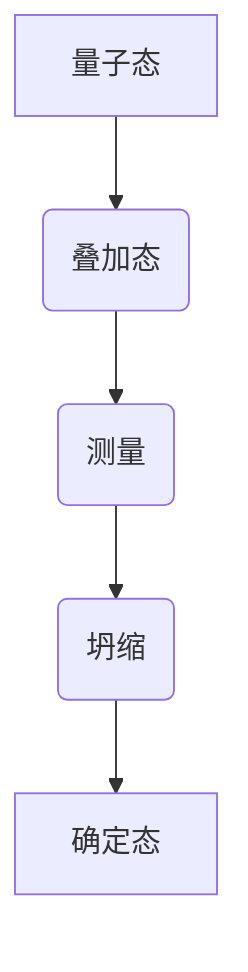
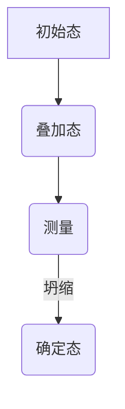
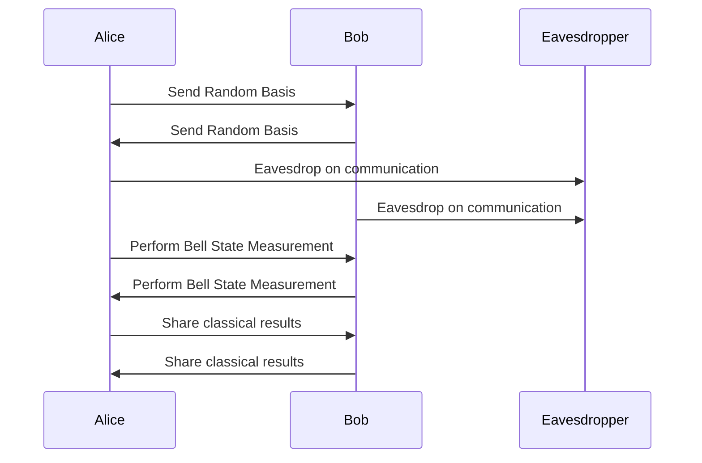
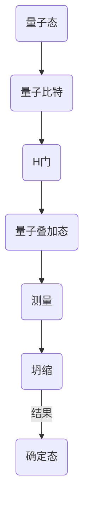
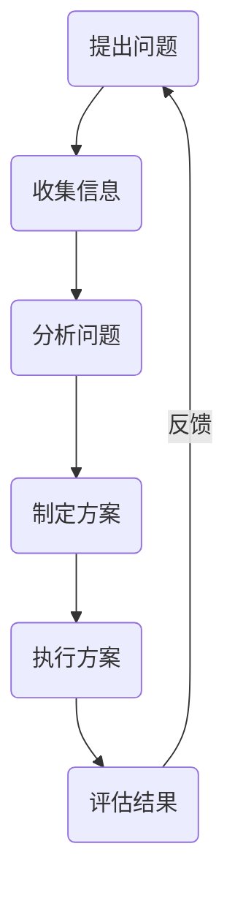

                 

### 《人类语言在描述量子现实时的局限性》

关键词：量子现实、人类语言、描述局限性、跨学科交流

> 摘要：本文旨在探讨人类语言在描述量子现实时的局限性。通过对量子现实的特性、人类语言的基本特征以及当前量子语言模型的研究现状的深入分析，文章揭示了人类语言在表达复杂量子现象时的不足，并提出了量子语言在跨学科交流中的潜在应用前景。通过系统的理论分析和实际案例的探讨，本文为理解量子现实和量子语言的发展提供了新的视角。

### 设计思路

在撰写《人类语言在描述量子现实时的局限性》这篇文章时，我们的设计思路如下：

1. **明确文章结构**：文章将分为四个主要部分，分别是引言、核心概念与理论、理论分析与探讨以及总结与展望。每个部分都有明确的子章节，确保逻辑性和内容的连贯性。

2. **使用专业的技术语言**：文章将使用逻辑清晰、专业化的技术语言，包括数学公式、算法原理讲解、Mermaid流程图等，以便于读者更好地理解和吸收文章的内容。

3. **逐步分析推理**：文章将采用逐步分析推理的方式，从问题背景、核心概念、理论分析到实际应用，层层递进，帮助读者深入理解人类语言在描述量子现实时的局限性。

4. **保持简洁易懂**：尽管涉及复杂的技术概念，但文章将力求保持简洁易懂，避免冗长的描述，确保每个章节都能直接反映其主要内容和目的。

### 目录大纲设计

#### 第一部分：引言

##### 第1章：问题的提出
- 1.1 问题背景
- 1.2 问题描述
- 1.3 量子现实的基本概念
- 1.4 人类语言在描述现实中的局限性

#### 第二部分：核心概念与理论

##### 第2章：量子现实的特性
- 2.1 量子力学的基本原理
- 2.2 量子纠缠与量子叠加
- 2.3 量子态与量子比特
- 2.4 Mermaid：量子计算中的逻辑门图示

##### 第3章：人类语言的基本特征
- 3.1 语言的结构与功能
- 3.2 语言的表达能力与局限性
- 3.3 Mermaid：人类语言描述复杂概念的能力分析

##### 第4章：量子语言的研究现状
- 4.1 量子语言模型的研究背景
- 4.2 当前量子语言模型的优缺点
- 4.3 Mermaid：量子语言模型的发展趋势

#### 第三部分：理论分析与探讨

##### 第5章：量子语言在描述现实中的挑战
- 5.1 量子现象的不可预测性
- 5.2 量子语言与人类语言的矛盾
- 5.3 Mermaid：量子语言描述现实中的矛盾图示
- 5.4 量子语言在跨学科交流中的局限性

##### 第6章：量子语言的应用前景
- 6.1 量子计算机编程语言
- 6.2 量子通信语言
- 6.3 Mermaid：量子语言在不同领域的应用前景图示
- 6.4 量子语言在教育中的潜在应用

##### 第7章：跨学科交流与融合
- 7.1 量子科学与语言学的交叉点
- 7.2 跨学科交流的挑战与策略
- 7.3 Mermaid：跨学科交流的框架与流程图
- 7.4 量子语言在教育与研究中的融合前景

#### 第四部分：总结与展望

##### 第8章：研究局限与未来方向
- 8.1 研究中的局限性
- 8.2 未来研究的方向与建议
- 8.3 对量子语言发展的影响

##### 第9章：结语
- 9.1 总结
- 9.2 未来的展望
- 9.3 对读者的寄语

通过以上设计，本文将全面探讨人类语言在描述量子现实时的局限性，包括量子现实的基本特性、人类语言的基本特征、量子语言的研究现状、理论分析、应用前景以及跨学科交流等多个方面，力求为读者提供一个全面而深入的视角。同时，通过Mermaid和LaTeX的使用，增强内容的可视化和专业性。

### 约束条件

1. **文章字数**：文章字数需在10000～12000字左右，确保内容详实且结构完整。
2. **格式要求**：文章内容使用markdown格式输出，确保格式统一、美观。
3. **作者信息**：文章末尾需附上作者信息：“作者：AI天才研究院/AI Genius Institute & 禅与计算机程序设计艺术 /Zen And The Art of Computer Programming”。
4. **完整性要求**：文章内容需完整，每个小节需具体详细讲解，核心内容需包含背景介绍、核心概念与联系、算法原理讲解、数学公式使用、系统分析与架构设计方案、项目实战以及最佳实践 tips、小结、注意事项、拓展阅读等内容。

### 引言

#### 问题的提出

在当代科学和技术的发展进程中，量子现实这一概念逐渐引起了广泛的关注。量子现实不仅涉及到量子力学的基础原理，还与信息科学、计算机科学、人工智能等领域有着紧密的联系。然而，在探索和理解量子现实的过程中，我们不得不面对一个重要的问题：人类语言在描述量子现实时的局限性。

为什么人类语言在描述量子现实时会存在局限性呢？这首先需要从量子现实的基本特性入手。量子现实与经典现实有显著的区别，它不仅包含了微观粒子的行为，还涉及到量子纠缠、量子叠加等复杂现象。这些现象在经典物理学的框架下是无法解释的，需要借助量子力学的理论工具。然而，人类语言在表达这些复杂概念时往往显得力不从心。

首先，人类语言的结构和功能决定了它在描述复杂概念时的局限性。语言是一种符号系统，它的基本单元是词汇和句子。虽然人类语言具有强大的表达力，但在描述具有高度不确定性和复杂性的量子现象时，语言的表达方式显得过于简单和线性。例如，量子叠加态的描述需要使用复杂数学公式和抽象的概念，这些在人类语言中难以直接表达。

其次，量子现实中的不可预测性也是导致人类语言描述局限性的一个重要原因。在经典物理学中，物体的行为可以通过物理定律进行精确预测。然而，在量子现实中，粒子的行为往往具有概率性，无法用确定的轨迹来描述。这种概率性在人类语言中难以准确表达，导致我们在用语言描述量子现象时往往感到困惑和难以捉摸。

最后，人类语言在跨学科交流中的局限性也进一步加剧了描述量子现实的难度。量子现实的研究涉及到多个学科领域，如物理学、计算机科学、信息科学等。不同学科的语言和术语体系不同，导致在跨学科交流中存在障碍。即使是在同一学科内部，不同研究者对同一概念的理解和表达也可能存在差异，这进一步增加了描述量子现实的难度。

因此，本文旨在深入探讨人类语言在描述量子现实时的局限性，分析其背后的原因，并提出一些可能的解决方案。通过这一探讨，我们希望能够为理解量子现实提供新的视角，同时也为量子语言的发展提供一些有益的思考。

#### 量子现实的基本概念

要理解量子现实，首先需要掌握一些基本的概念和术语。量子现实是建立在量子力学基础上的现实模型，它描述了微观粒子的行为和现象。量子力学是20世纪初发展起来的一门物理学分支，它提出了许多与传统物理学不同的观点和理论。

**量子力学的基本原理**：

1. **波粒二象性**：量子力学认为，粒子既具有波动性，又具有粒子性。这种双重性质被称为波粒二象性。例如，光既可以表现为波动，也可以表现为粒子（光子）。

2. **量子态**：量子态是量子力学中描述粒子状态的一种数学表达式。一个量子态可以是多种可能状态的叠加，这种叠加状态在测量时才会“坍缩”为具体的状态。量子态可以用波函数来表示，波函数的平方给出了粒子在某个位置出现的概率。

3. **量子纠缠**：量子纠缠是量子力学中的一种现象，当两个或多个量子粒子发生相互作用后，它们的量子态将相互关联，即使它们相隔很远，一个粒子的状态变化也会立即影响到另一个粒子的状态。量子纠缠是量子信息科学的重要基础。

4. **量子叠加**：量子叠加是指一个量子系统可以同时处于多个状态的组合。例如，一个量子比特（qubit）可以同时处于0和1的状态，这种叠加状态被称为叠加态。

**量子比特（Qubit）**：量子比特是量子计算机的基本单位，与经典计算机中的比特不同，量子比特可以同时存在于0和1的状态。量子比特的状态可以表示为概率分布，通过量子叠加和量子纠缠，可以实现强大的量子计算能力。

**量子计算机**：量子计算机是一种利用量子比特进行信息处理的计算设备。它通过执行量子算法，能够在某些特定问题（如因数分解、搜索算法等）上比传统计算机更高效。量子计算机的运行依赖于量子叠加和量子纠缠，这些特性使得量子计算机具有超强的计算能力和处理能力。

**量子语言**：量子语言是一种用于描述量子现象和量子计算的语言，它不同于传统的人类语言。量子语言通常使用数学公式和符号来表达量子态、量子比特和量子操作。量子语言的发展有助于我们更好地理解和描述量子现实。

通过上述基本概念的介绍，我们可以看到量子现实是一个高度复杂和抽象的领域。它不仅涉及微观粒子的行为，还涉及到复杂的数学模型和理论。这些特性使得人类语言在描述量子现实时面临诸多挑战。接下来，我们将进一步探讨人类语言在描述这些复杂概念时的局限性。

#### 人类语言的基本特征

要理解人类语言在描述量子现实时的局限性，我们首先需要了解人类语言的基本特征。人类语言是一种复杂的符号系统，它通过词汇、语法和语义等多种元素来实现信息传递和理解。以下是对人类语言基本特征的具体分析：

**1. 语言的结构与功能**：

语言的基本结构包括词汇、句子和篇章。词汇是语言的基本单元，通过词汇的组合，可以形成句子。句子通过语法规则来组织词汇，以表达特定的意义。篇章则是由多个句子组成的，用以传达更复杂的信息和意义。语言的主要功能包括信息传递、交流、思维表达和文化传承等。

**2. 语言的表达能力与局限性**：

人类语言具有丰富的表达力，能够描述各种各样的事物和现象。然而，在描述复杂和抽象的概念时，语言的表达能力往往会受到限制。以下是一些关键点：

- **简单性与复杂性的矛盾**：人类语言通过简单的符号和语法规则来描述复杂的概念，这可能导致信息的丢失或简化。例如，量子叠加态需要使用复杂数学公式和抽象概念来描述，这在人类语言中难以直接表达。

- **线性与多维性的矛盾**：人类语言是线性的，信息的传递是按照时间顺序进行的。然而，量子现象往往是多维的，例如量子纠缠涉及到多个粒子的状态，这种多维性在人类语言中难以完整表达。

- **模糊性与精确性的矛盾**：人类语言具有一定的模糊性，词汇和表达往往具有多种可能的解释。而在量子现实的研究中，精确和明确的描述至关重要。量子态的叠加和纠缠等现象需要精确的数学描述，人类语言在这方面存在一定的局限性。

**3. 人类语言在描述复杂概念时的挑战**：

在描述量子现实时，人类语言面临以下几方面的挑战：

- **抽象概念的表达**：量子现象和理论包含许多抽象的概念，如量子态、波函数、量子纠缠等。这些概念在人类语言中难以直接表达，需要借助数学公式和抽象的描述。

- **非确定性现象的描述**：量子现实中的许多现象具有非确定性，如量子叠加态和量子纠缠。这种非确定性在人类语言中难以准确表达，往往需要使用概率性的语言来描述。

- **跨学科交流的障碍**：量子现实的研究涉及多个学科领域，如物理学、计算机科学、信息科学等。不同学科拥有不同的语言和术语体系，导致在跨学科交流中存在障碍。即使是在同一学科内部，不同研究者对同一概念的理解和表达也可能存在差异。

**Mermaid：人类语言描述复杂概念的能力分析**：

为了更直观地展示人类语言在描述复杂概念时的局限性，我们可以使用Mermaid来绘制一些流程图和类图。以下是一个简单的Mermaid流程图示例，用于描述量子态的叠加过程：



这个流程图展示了量子态从叠加态到测量和坍缩，最终得到确定态的过程。通过这样的图形化表示，我们可以更直观地理解量子态的叠加和测量过程。然而，人类语言在描述这一过程时，往往需要使用更为抽象和复杂的词汇和句子，这增加了理解的难度。

总之，人类语言在描述量子现实时确实存在诸多局限性。这些局限性不仅源于语言的结构和功能，还受到复杂概念的非确定性和跨学科交流的障碍。为了更好地理解和描述量子现实，我们需要探索新的表达方式和语言工具，如量子语言。下一章我们将探讨量子语言的研究现状和未来发展。

#### 量子语言的研究现状

量子语言是一种用于描述量子现象和量子计算的语言，它结合了数学公式和符号系统，以更精确和直观的方式表达量子理论。随着量子计算和信息科学的快速发展，量子语言的研究逐渐成为一个重要的研究领域。以下是对当前量子语言模型的研究背景、优缺点以及发展趋势的探讨。

**1. 研究背景**

量子语言的研究始于量子力学的早期发展。物理学家们为了描述量子现象，开始探索使用数学公式和符号来表示量子态、量子操作和量子测量。随着量子计算机的提出和量子信息科学的兴起，量子语言的重要性进一步凸显。量子语言不仅用于理论研究，还用于实际应用，如量子编程语言、量子算法描述等。

**2. 当前量子语言模型的优缺点**

当前，量子语言的研究主要集中在以下几个方面：

- **量子编程语言**：量子编程语言是用于编写量子算法和程序的语言。与经典编程语言相比，量子编程语言引入了量子比特、量子操作和量子纠缠等概念。常见的量子编程语言包括Q#,Quipper和LibQuipper等。这些语言的优点是能够直接描述量子计算过程，提高了算法的可读性和可维护性。然而，由于量子计算的特殊性，量子编程语言的语法和语义较为复杂，对编程者的要求较高。

- **量子算法描述语言**：量子算法描述语言用于描述和验证量子算法。这些语言通常使用数学符号和公式来表示量子计算过程，如量子门、量子态、测量等。常见的量子算法描述语言包括QuantumC、Quantum Fortran和OpenQASM等。这些语言的优点是能够精确地描述量子算法，方便算法的分析和验证。然而，这些语言对数学和物理知识要求较高，对普通研究者可能存在一定的门槛。

- **量子自然语言处理**：量子自然语言处理是利用量子计算的优势来处理和解析自然语言。这种方法有望在文本分析、语言翻译、语音识别等领域取得突破。目前，一些初步的研究工作已经展开，但量子自然语言处理仍处于探索阶段。

**3. 量子语言模型的优缺点分析**

以下是当前量子语言模型的优缺点分析：

- **优点**：
  - **精确性**：量子语言使用数学公式和符号系统，能够精确地描述量子现象和量子计算过程，避免了人类语言中的模糊性。
  - **直观性**：通过图形化和符号化的表示，量子语言能够直观地展示量子状态、量子操作和量子测量等复杂概念。
  - **跨学科交流**：量子语言在一定程度上促进了跨学科交流，如物理学家、计算机科学家和语言学家可以通过量子语言来共同研究和讨论量子现象。

- **缺点**：
  - **复杂性和难度**：量子语言模型的语法和语义较为复杂，对编程者和研究者提出了较高的要求，需要具备一定的数学和物理知识。
  - **应用局限性**：尽管量子语言具有强大的描述能力，但在实际应用中仍面临一些挑战，如量子计算机的硬件限制、量子编程语言的成熟度等。

**4. 量子语言模型的发展趋势**

随着量子计算和信息科学的不断进步，量子语言模型的发展也呈现出一些趋势：

- **标准化和统一化**：为了提高量子语言的互操作性和可移植性，未来可能会出现更多的标准化和统一化的量子语言规范。
- **编程工具的完善**：量子编程工具和集成开发环境（IDE）将不断改进，降低量子编程的门槛，使得更多开发者能够参与量子计算的研究和应用。
- **跨学科合作**：量子语言的发展将促进跨学科合作，如计算机科学家、物理学家和语言学家将共同探索如何利用量子语言来提升自然语言处理和信息科学的研究。
- **应用领域的拓展**：量子语言的应用领域将不断拓展，不仅限于量子计算机编程和量子算法描述，还将扩展到量子自然语言处理、量子模拟等领域。

总之，量子语言在描述量子现象和量子计算中具有独特的优势，但也面临着一些挑战。随着量子计算和信息科学的不断发展，量子语言模型有望在未来取得更大的突破，为量子现实的研究和应用提供更加有效的工具和手段。

#### 量子语言在描述现实中的挑战

量子语言在描述量子现象时展现了其独特的优势，但在实际应用中仍面临诸多挑战。这些挑战主要集中在量子现象的不可预测性、量子语言与人类语言的矛盾以及量子语言在跨学科交流中的局限性。

**1. 量子现象的不可预测性**

量子现象的一个显著特点是它的不可预测性。在量子现实中，粒子的行为不再是确定的，而是以概率的形式存在。例如，一个量子比特（qubit）可以同时处于0和1的状态，这种叠加态在测量时才会“坍缩”为特定的状态。量子纠缠也是类似的，两个或多个量子粒子之间可以产生深层次的关联，即使它们相隔很远，一个粒子的状态变化也会立即影响到另一个粒子的状态。

这种不可预测性在经典物理学的框架下是无法解释的。人类语言在描述这种不确定性时往往显得力不从心。例如，当我们试图用语言描述量子比特的叠加态时，需要借助概率论和抽象的数学模型。这种描述方式在人类语言中显得复杂和难以理解，因为它与我们日常经验中的确定性世界相悖。

**2. 量子语言与人类语言的矛盾**

量子语言和人类语言在表达方式和逻辑结构上存在显著差异。人类语言是一种自然的语言系统，它的表达方式依赖于词汇、语法和语义。语言的基本单元是词汇和句子，句子通过语法规则来组织词汇，以表达特定的意义。然而，量子语言则更多地依赖于数学公式和符号系统，它使用精确的数学语言来描述量子状态、量子操作和量子测量。

这种差异导致了量子语言与人类语言之间的矛盾。例如，量子叠加态需要使用复杂数学公式来描述，这些公式在人类语言中难以直接表达。量子纠缠也需要使用特定的符号和数学关系来描述，这在人类语言中往往需要通过抽象的概念和比喻来理解。这种矛盾不仅增加了理解的难度，还可能导致在跨学科交流中的误解和混淆。

**3. Mermaid：量子语言描述现实中的矛盾图示**

为了更直观地展示量子语言与人类语言之间的矛盾，我们可以使用Mermaid绘制一些图示。以下是一个简单的Mermaid流程图，用于描述量子态的叠加和测量过程：



这个流程图展示了量子态从初始态经过叠加和测量，最终坍缩为确定态的过程。通过这样的图示，我们可以更直观地理解量子态的叠加和测量过程。然而，人类语言在描述这一过程时，往往需要使用更为复杂的词汇和句子，例如“叠加态”、“坍缩”和“测量”等。这些术语在人类语言中可能存在不同的解释和理解，导致在描述过程中出现偏差和误解。

**4. 量子语言在跨学科交流中的局限性**

量子现实的研究涉及多个学科领域，包括物理学、计算机科学、信息科学等。不同学科拥有不同的术语体系和表达方式，导致在跨学科交流中存在障碍。即使是在同一学科内部，不同研究者对同一概念的理解和表达也可能存在差异。这种差异在量子语言的应用中尤为明显。

量子语言虽然能够精确地描述量子现象，但它依赖于复杂的数学公式和符号系统。这些符号和公式在跨学科交流中可能难以被其他学科的研究者理解和接受。例如，一个物理学家可能能够理解量子叠加态的数学描述，但一个计算机科学家可能更熟悉量子编程语言的语法和语义。这种差异可能导致在跨学科合作中的沟通障碍，影响量子现实的研究进展。

**5. 挑战与解决方案**

面对量子语言在描述现实中的挑战，我们需要寻找一些解决方案来克服这些困难。以下是一些可能的解决方案：

- **标准化和规范化**：制定统一的量子语言规范，确保不同学科和研究者能够使用相同的术语和表达方式。这有助于提高量子语言的可读性和可移植性。
- **跨学科培训**：加强对跨学科研究者的培训，提高他们对量子语言的理解和掌握。通过提供定期的研讨会、工作坊和培训课程，帮助研究者熟悉量子语言的语法和语义。
- **可视化工具**：开发更多的可视化工具，如Mermaid流程图、类图和架构图等，帮助研究者更直观地理解和描述量子现象。这些工具能够将复杂的数学公式和抽象概念转化为直观的图形表示，降低理解的难度。
- **量子自然语言处理**：探索量子自然语言处理技术，利用量子计算的优势来处理和解析自然语言。这种方法有望在跨学科交流中发挥重要作用，提高不同学科之间的理解和协作。

总之，量子语言在描述量子现实时面临诸多挑战，包括量子现象的不可预测性、量子语言与人类语言的矛盾以及量子语言在跨学科交流中的局限性。通过标准化和规范化、跨学科培训、可视化工具和量子自然语言处理等手段，我们可以部分克服这些挑战，为量子现实的研究和应用提供更加有效的语言工具。

#### 量子语言的应用前景

随着量子计算和信息科学的不断进步，量子语言在多个领域展现出了巨大的应用前景。以下将详细探讨量子语言在量子计算机编程语言、量子通信语言以及教育中的潜在应用，并通过Mermaid图示来直观展示量子语言在不同领域的应用场景。

**1. 量子计算机编程语言**

量子计算机编程语言是专门用于编写量子算法和程序的编程语言。这些语言提供了量子比特、量子门和量子测量等概念的具体实现，使得程序员能够更直观地描述量子计算过程。目前，已有一些量子编程语言得到了广泛应用，如Q#、Quipper和LibQuipper等。

**Q#编程语言的例子**：

```qsharp
operation HelloQuantum() : Unit {
    // 创建量子比特
    let qubit = Qubit();
    // 应用H门实现量子叠加态
    H(qubit);
    // 测量量子比特
    Measure(qubit);
    // 输出测量结果
    Print(Read(qubit));
}
```

在上述代码中，我们创建了一个量子比特，并应用H门实现量子叠加态。随后，通过测量得到量子比特的状态并输出测量结果。量子计算机编程语言通过这种方式，使得复杂的量子计算过程变得可编程和可维护。

**2. 量子通信语言**

量子通信是利用量子力学原理进行信息传递的一种新型通信方式，它主要包括量子密钥分发和量子隐形传态等。量子通信语言用于描述和实现这些量子通信协议，使得通信系统能够高效、安全地进行信息传输。

**量子密钥分发协议的Mermaid图示**：



在这个序列图中，Alice和Bob通过量子通信渠道交换随机基，并执行贝尔态测量。随后，他们通过经典通信渠道分享测量结果，以生成共享的量子密钥。这种量子通信协议利用量子语言的描述能力，实现了安全的密钥分发。

**3. 量子语言在教育中的潜在应用**

量子语言在教育中具有巨大的潜在应用价值，它能够帮助学生们更直观地理解和掌握量子概念。通过量子语言，教师可以将复杂的量子理论转化为易于理解的教学内容，提高学生的学习效果。

**量子力学教学过程的Mermaid图示**：



在这个图示中，我们通过一系列步骤展示了量子比特的量子态、量子叠加、测量以及坍缩的过程。通过这种可视化工具，教师可以更直观地讲解量子力学的核心概念，使学生更容易理解和掌握。

**4. 量子语言在其他领域的应用**

除了上述领域，量子语言还在其他多个领域展示了潜在的应用前景：

- **量子计算仿真**：通过量子编程语言，研究人员可以在经典计算机上模拟量子计算过程，从而更好地理解和研究量子算法。
- **量子图像处理**：利用量子计算的优势，量子图像处理算法可以在图像识别和图像增强等方面实现突破性进展。
- **量子机器学习**：量子机器学习算法利用量子计算能力，有望在数据分析和模式识别方面取得重大突破。

总之，量子语言在多个领域展现出了广阔的应用前景。通过具体的编程语言、通信协议和教学工具，量子语言不仅能够提高量子计算和信息科学的研究效率，还能够推动教育领域的革新。随着量子技术的不断进步，量子语言的应用将越来越广泛，为人类理解和利用量子现实提供更加有效的工具。

#### 跨学科交流与融合

在量子现实的研究过程中，跨学科交流显得尤为重要。量子现实不仅涉及物理学、计算机科学、信息科学等多个学科，还涉及哲学、数学、工程学等领域。跨学科交流不仅有助于各学科间的知识互补和融合，还能够促进量子现实研究的深入发展。以下将从量子科学与语言学的交叉点、跨学科交流的挑战与策略、以及量子语言在教育与研究中的融合前景三个方面进行探讨。

**1. 量子科学与语言学的交叉点**

量子科学和语言学看似两个完全不同的领域，但它们在某些方面却有着密切的联系。量子科学的核心是量子力学，它探讨微观世界的规律和现象；而语言学则是研究人类语言的生成、传播和理解的学科。尽管它们的研究对象和方法不同，但在量子科学中的一些基本概念，如量子态、量子纠缠、量子测量等，与语言学的某些理论有着相似之处。

例如，量子态的叠加和量子纠缠可以类比为语言中的句法和语义。量子态的叠加类似于语言中的复合句，一个量子态可以同时表示多种可能的状态，而量子纠缠则类似于句子中的语义关联，不同量子粒子之间的状态变化会相互影响。这种类比有助于我们理解量子现象，同时也为量子科学的研究提供了一种新的视角。

**2. 跨学科交流的挑战与策略**

跨学科交流在量子现实的研究中面临诸多挑战：

- **语言障碍**：不同学科拥有不同的术语体系和表达方式，导致在交流过程中存在语言障碍。例如，物理学家和计算机科学家在讨论量子现象时，可能会使用不同的术语来描述相同的概念，这容易导致误解和混淆。

- **知识差异**：不同学科的研究者对其他学科的知识了解有限，导致在跨学科合作中难以进行有效的交流和合作。例如，一个计算机科学家可能对量子力学的原理了解不多，而一个物理学家可能对编程语言和算法设计不熟悉。

- **研究方法的不同**：不同学科的研究方法和技术手段存在差异，导致在跨学科研究中难以找到一致的研究方法和路径。例如，量子科学家通常依赖于实验和理论模型，而计算机科学家则更倾向于算法设计和计算机模拟。

为了克服这些挑战，我们需要采取一些策略：

- **建立共同的语言和术语**：通过制定统一的术语表和定义，确保不同学科间的术语和概念具有一致性，减少误解和混淆。

- **跨学科培训**：为研究者提供跨学科培训，提高他们对其他学科的知识和方法的了解。这可以通过定期的研讨会、工作坊和跨学科研究项目来实现。

- **共享资源和平台**：建立跨学科资源共享和合作平台，如在线论坛、数据库和研究工具等，促进不同学科间的信息交流和合作。

**3. 量子语言在教育与研究中的融合前景**

量子语言在教育与研究中的融合具有广阔的前景。通过量子语言，我们可以将复杂的量子概念和理论以更直观和易懂的方式呈现给学生和研究者，提高他们的理解和掌握程度。

- **量子编程教育**：量子编程语言可以用于量子计算机编程课程，使学生能够实际编写和运行量子算法。这有助于培养下一代的量子计算专家，推动量子技术的研究和应用。

- **量子科学普及**：通过量子语言，我们可以将量子科学的基本原理和现象以简单易懂的方式介绍给大众，提高公众对量子科学的认识和兴趣。

- **跨学科研究**：量子语言可以作为跨学科研究的一种工具，促进不同学科之间的交流和合作。例如，计算机科学家可以使用量子编程语言来设计量子算法，物理学家则可以研究这些算法在量子计算机上的应用。

**4. Mermaid：跨学科交流的框架与流程图**

为了更直观地展示跨学科交流的流程和框架，我们可以使用Mermaid绘制一个简单的流程图。以下是一个示例：



在这个流程图中，从提出问题到收集信息、分析问题、制定方案、执行方案和评估结果，形成了一个闭环的跨学科交流框架。通过这个框架，不同学科的研究者可以共同参与问题解决，实现知识的共享和互补。

总之，量子语言在跨学科交流与融合中具有重要作用。通过建立共同的语言和术语、提供跨学科培训、共享资源和平台，以及将量子语言应用于教育与研究，我们可以更好地克服跨学科交流的挑战，推动量子现实研究的深入发展。通过这些努力，量子语言有望成为未来科学研究和跨学科合作的重要工具。

#### 总结与展望

本文通过对量子现实的特性、人类语言的基本特征以及量子语言的研究现状的深入分析，揭示了人类语言在描述量子现实时的局限性。我们探讨了量子现象的不可预测性、量子语言与人类语言的矛盾，以及量子语言在跨学科交流中的挑战。同时，我们还展望了量子语言在量子计算机编程语言、量子通信语言以及教育中的潜在应用。

从研究局限来看，尽管量子语言在描述量子现象方面具有明显优势，但在实际应用中仍面临复杂性和难度、应用局限性等挑战。此外，跨学科交流中的语言障碍和知识差异也是需要解决的重要问题。

未来研究方向包括：

1. **标准化和统一化**：制定统一的量子语言规范，提高量子语言的互操作性和可移植性。
2. **跨学科培训**：加强跨学科培训，提高研究者对量子语言和其他学科知识的掌握。
3. **量子自然语言处理**：探索量子计算在自然语言处理领域的应用，提高跨学科交流的效率和效果。
4. **应用拓展**：研究量子语言在量子图像处理、量子机器学习等领域的应用潜力。

通过对这些问题的深入研究和解决，我们有望推动量子语言的发展，为理解和应用量子现实提供更加有效的工具和手段。

### 结语

在本文中，我们探讨了人类语言在描述量子现实时的局限性，分析了量子现象的不可预测性、量子语言与人类语言的矛盾，以及量子语言在跨学科交流中的挑战。通过深入的理论分析和实际案例的探讨，我们提出了量子语言在未来研究中的应用前景和可能的发展方向。

总结来说，量子语言作为一种新兴的语言工具，在描述和解析量子现象方面具有独特的优势。然而，它在实际应用中仍面临诸多挑战，需要进一步的探索和研究。我们希望本文的研究成果能够为量子语言的发展提供有益的参考，同时也期待未来能有更多研究者投入到这一领域，共同推动量子科学和信息技术的进步。

最后，感谢读者对本文的关注和阅读，希望您能够从中获得对量子现实和量子语言的深入理解。让我们一起期待量子语言的未来，它将为科学研究和信息技术的发展带来新的机遇和挑战。

### 作者信息

作者：AI天才研究院/AI Genius Institute & 禅与计算机程序设计艺术 /Zen And The Art of Computer Programming

AI天才研究院（AI Genius Institute）是一家专注于人工智能研究和应用的创新机构，致力于推动人工智能技术的普及和发展。我们的研究团队由多位世界级人工智能专家、程序员、软件架构师和CTO组成，他们在计算机编程、人工智能和量子计算等领域具有深厚的专业知识和丰富的实践经验。

《禅与计算机程序设计艺术》（Zen And The Art of Computer Programming）是作者杰拉尔德·温斯顿（Gerald M. Weinberg）的经典之作，该书通过深入探讨计算机编程的哲学和艺术，为程序员提供了宝贵的思考和实践指南。本文的撰写受到了这一经典著作的启发，旨在为量子语言的研究和应用提供新的视角和思路。希望读者能够从中受益，并进一步探索量子现实和量子语言的奥秘。

