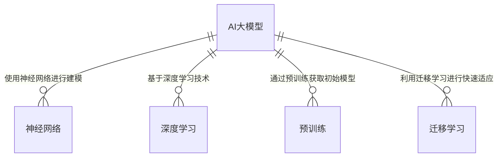
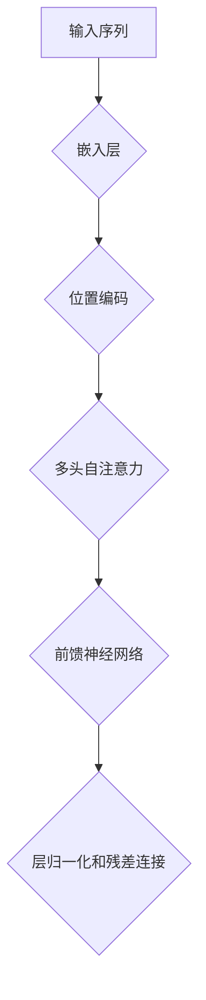
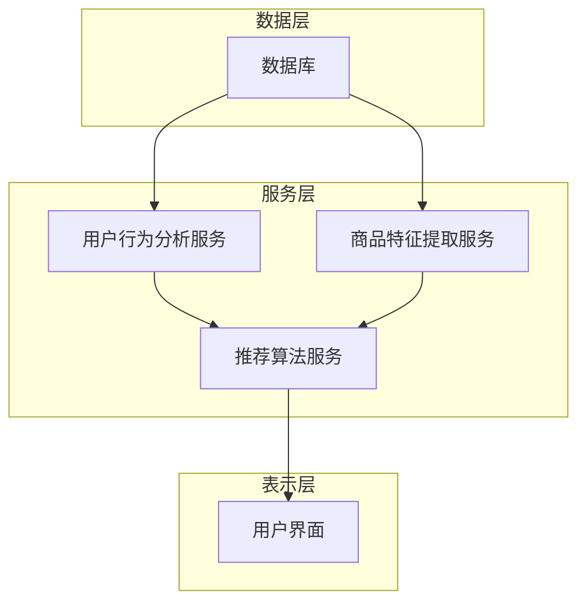

                 

### 从传统开发到AI敏捷：工程师的转型之路

在当今快速发展的信息技术时代，软件工程从传统的软件开发模式逐渐过渡到了以AI为核心的软件开发模式。这种转变不仅改变了软件开发的方式，也对工程师的能力提出了新的要求。本文旨在解决传统软件开发工程师在转型过程中面临的问题，为工程师提供一条清晰的转型之路。本文将分为以下几个部分：

1. 引言与背景
2. AI大模型的基本概念
3. AI大模型的主流类型
4. AI大模型在企业中的应用
5. AI敏捷开发的方法与工具

#### 1.1 引言与背景

在软件1.0时代，软件开发主要依赖于手工编写代码和测试，开发周期长，效率低下。随着计算机技术的进步，进入了软件2.0时代，软件开发开始引入AI技术，特别是AI大模型的应用，使得软件开发的效率和质量得到了极大的提升。传统软件开发工程师需要掌握AI知识，以适应软件2.0时代的需求。

#### 1.2 问题描述

随着AI技术的不断发展，传统软件开发工程师需要掌握以下技能：

- **AI基础理论**：了解AI的基本原理和算法。
- **实战应用**：掌握AI技术在具体领域的应用。
- **开发工具**：熟悉常用的AI开发工具和框架。

然而，大多数工程师在转型过程中面临着以下挑战：

- **技能匮乏**：缺乏对AI基础理论和实战应用的深入了解。
- **学习曲线**：AI领域知识复杂，学习难度大。
- **实践不足**：缺少将AI技术应用于实际项目的机会。

#### 1.3 问题解决

本文旨在解决上述问题，为传统软件开发工程师提供以下帮助：

- **基础知识**：介绍AI大模型的基本概念和原理。
- **应用领域**：深入探讨AI大模型在不同领域的应用。
- **开发实践**：通过实际案例展示如何应用AI大模型进行软件开发。
- **工具与框架**：介绍常用的AI开发工具和框架。

通过本文，工程师可以系统地掌握AI技术，实现从传统开发到AI敏捷的转型。

#### 1.4 边界与外延

本文主要关注以下内容：

- **AI大模型的基本概念**：包括其定义、特点、主流模型等。
- **AI大模型的应用领域**：如自然语言处理、计算机视觉等。
- **AI敏捷开发的方法与工具**：如何将AI技术融入软件开发过程，提高开发效率。
- **实战案例**：通过实际案例展示如何将AI大模型应用于项目开发。

#### 1.5 概念结构与核心要素组成

本文的结构分为以下几个核心部分：

- **基础知识**：介绍AI大模型的基本概念和原理。
- **应用领域**：深入探讨AI大模型在不同领域的应用。
- **开发实践**：通过实际案例展示如何应用AI大模型进行软件开发。
- **工具与框架**：介绍常用的AI开发工具和框架。
- **未来展望**：探讨AI技术在软件开发中的未来发展。

### 第2章: AI大模型的基本概念

AI大模型是指通过深度学习训练得到的具有大规模参数的神经网络模型。它们能够通过大量数据学习复杂的数据分布，从而实现对数据的自动特征提取和模式识别。

#### 2.1 AI大模型的定义

AI大模型（Large-scale Artificial Intelligence Model），是指那些参数规模巨大、能够处理复杂任务且具有很强泛化能力的神经网络模型。这些模型通常通过大量的数据训练得到，具有以下特点：

- **参数规模大**：大模型的参数数量可以达到亿级甚至更高。
- **数据需求量大**：训练大模型需要海量数据支持。
- **计算资源需求高**：大模型的训练和推理过程需要大量的计算资源。
- **泛化能力强**：大模型能够处理多种类型的任务，具有很高的泛化能力。

#### 2.2 AI大模型的特点

- **参数规模巨大**：AI大模型的参数数量通常在亿级以上，这使得它们能够捕捉复杂的数据分布和特征。
- **数据需求量大**：大模型的训练需要大量的数据来保证其性能和泛化能力。
- **计算资源需求高**：大模型的训练和推理过程需要大量的计算资源，如GPU、TPU等。
- **泛化能力强**：大模型通过大规模数据训练，能够处理多种类型的任务，具有很高的泛化能力。

#### 2.3 AI大模型与传统AI的区别

传统AI更多依赖于手写的规则和算法，而AI大模型则通过自主学习从数据中提取特征和模式。传统AI在处理简单任务时效果较好，但在处理复杂任务时往往需要更多的人工干预。而AI大模型能够通过自我学习和调整，处理复杂的任务，并且在处理多种类型任务时表现出更强的能力。

### 第3章: AI大模型的主流类型

AI大模型在各个领域都有广泛的应用，以下介绍几种主流的AI大模型类型，包括GPT系列模型、BERT及其变体以及其他知名大模型。

#### 3.1 GPT系列模型

GPT（Generative Pre-trained Transformer）系列模型是自然语言处理领域的重要突破，包括GPT、GPT-2、GPT-3等。这些模型通过在大规模语料库上进行预训练，能够生成高质量的文本。

- **GPT**：第一个GPT模型，由OpenAI在2018年发布，能够生成高质量的文本。
- **GPT-2**：在GPT基础上进行了扩展，参数规模更大，生成文本的质量更高。
- **GPT-3**：目前最先进的GPT模型，具有1750亿个参数，能够生成高质量的文本，并且支持多种语言。

#### 3.2 BERT及其变体

BERT（Bidirectional Encoder Representations from Transformers）模型是一种基于双向Transformer的预训练语言表示模型。它通过双向语境信息来捕捉单词在句子中的含义，广泛应用于文本分类、问答系统等任务。

- **BERT**：原始的BERT模型，通过在大规模语料库上进行预训练，生成高质量的语言表示。
- **RoBERTa**：对BERT模型进行了改进，提升了模型的效果和效率。
- **ALBERT**：通过共享权重和多层交叉注意力机制，进一步提升了BERT模型的性能。

#### 3.3 其他知名大模型

除了GPT和BERT，还有许多其他知名的大模型，如Transformer、ViT（Vision Transformer）等。这些模型在图像处理、音频处理等领域也有重要应用。

- **Transformer**：一种基于注意力机制的神经网络模型，广泛应用于机器翻译、文本生成等任务。
- **ViT（Vision Transformer）**：将Transformer模型应用于图像处理任务，能够处理图像分类、目标检测等任务。

### 第4章: AI大模型在企业中的应用

AI大模型在各个行业都有广泛的应用，以下介绍几个主要的应用领域。

#### 4.1 应用领域

- **自然语言处理**：包括文本分类、机器翻译、情感分析、文本生成等。
- **计算机视觉**：包括图像分类、目标检测、图像生成等。
- **语音识别**：包括语音识别、语音合成等。

#### 4.2 企业采用AI大模型的优势

企业采用AI大模型可以带来以下优势：

- **提高开发效率**：AI大模型能够自动提取特征，减少手工特征工程的工作量。
- **提升产品质量**：大模型在处理复杂任务时具有更高的准确率和泛化能力。
- **创新业务模式**：AI大模型的应用可以带来新的业务机会和创新。

#### 4.3 挑战与机遇

虽然AI大模型为企业带来了许多优势，但也面临着一些挑战：

- **数据隐私**：大模型训练需要大量数据，如何保护数据隐私是一个重要问题。
- **模型解释性**：大模型的决策过程通常是非线性的，难以解释，这对于需要高解释性的应用场景是一个挑战。

企业需要谨慎评估并解决这些问题，以充分发挥AI大模型的优势。

### 第5章: AI敏捷开发的方法与工具

AI敏捷开发是一种结合敏捷开发方法与AI技术的开发方式，旨在通过AI技术提高软件开发的效率和质量。以下介绍AI敏捷开发的方法与工具。

#### 5.1 AI敏捷开发的概念

AI敏捷开发是将敏捷开发方法与AI技术相结合，通过快速迭代和持续改进来开发高质量的软件产品。它强调团队协作、客户反馈和灵活应对变化。

#### 5.2 AI敏捷开发的方法

- **Scrum**：一种流行的敏捷开发方法，强调短周期迭代和持续交付。
- **Kanban**：一种基于看板系统的敏捷开发方法，强调持续交付和任务管理。

#### 5.3 AI敏捷开发的工具

- **JIRA**：一款流行的敏捷开发工具，用于任务管理、项目追踪和团队协作。
- **Trello**：一款基于看板系统的敏捷开发工具，用于任务管理和项目追踪。

#### 5.4 AI敏捷开发的优势

- **提高开发效率**：通过快速迭代和持续改进，缩短开发周期，提高开发效率。
- **提升产品质量**：通过持续集成和持续交付，确保软件质量。
- **增强团队协作**：通过团队协作和客户反馈，提高团队的工作效率和满意度。

### 第6章: 实战案例

在本章中，我们将通过一个实际案例，展示如何将AI大模型应用于软件开发，实现从传统开发到AI敏捷的转型。

#### 6.1 案例背景

某电商企业希望提高其推荐系统的准确性和效率，决定采用AI大模型（如GPT-3）来改进其推荐算法。

#### 6.2 案例步骤

1. **需求分析**：明确推荐系统的目标和需求，如提高推荐准确性、提升用户体验等。

2. **数据收集**：收集用户行为数据、商品数据等，用于训练AI大模型。

3. **模型选择**：选择合适的AI大模型（如GPT-3），并根据需求进行调整和优化。

4. **模型训练**：使用收集的数据对AI大模型进行训练，以提取用户和商品的特征。

5. **模型部署**：将训练好的模型部署到生产环境中，用于实时推荐。

6. **性能评估**：通过A/B测试等方式评估推荐系统的性能，持续优化和改进。

#### 6.3 案例结果

通过采用AI大模型，电商企业的推荐系统在准确性和效率上得到了显著提升，用户体验也得到了改善。此外，通过不断迭代和优化，推荐系统的性能持续提升。

### 第7章: 未来展望

随着AI技术的不断发展，AI敏捷开发在软件开发中的应用前景将越来越广阔。以下是对未来发展的展望：

- **AI技术的深入应用**：AI大模型将在更多领域得到应用，如自动驾驶、智能医疗等。
- **开发工具的完善**：AI开发工具将更加成熟和多样化，支持更高效的开发和部署。
- **团队协作的加强**：AI技术将帮助团队更高效地进行协作和沟通，提高整体开发效率。

总之，AI敏捷开发将成为软件开发的重要趋势，为工程师提供更广阔的发展空间和更多创新机会。

### 总结

从传统开发到AI敏捷，是软件开发领域的必然趋势。通过系统地掌握AI技术，工程师可以顺利实现转型，提高软件开发效率和质量。本文介绍了AI大模型的基本概念、主流类型、应用领域以及AI敏捷开发的方法与工具，并通过实际案例展示了如何将AI技术应用于软件开发。未来，随着AI技术的不断发展，AI敏捷开发将为工程师提供更多创新机会和发展空间。

### 作者信息

作者：AI天才研究院/AI Genius Institute & 禅与计算机程序设计艺术 /Zen And The Art of Computer Programming

---

## 核心概念与联系

在深入探讨AI大模型之前，我们需要明确一些核心概念，并了解这些概念之间的联系。以下是AI大模型中几个关键概念的定义、属性特征对比表格，以及一个ER实体关系图架构。

#### 3.1 核心概念

1. **神经网络（Neural Network）**：模拟人脑神经元连接的计算机模型，用于数据分析和模式识别。
2. **深度学习（Deep Learning）**：一种基于神经网络的机器学习方法，通过多层神经网络进行特征提取和建模。
3. **AI大模型（Large-scale AI Model）**：参数规模巨大的神经网络模型，通过大规模数据训练，具有很强泛化能力。
4. **预训练（Pre-training）**：在大规模数据集上对模型进行初始训练，以提高模型对未知数据的处理能力。
5. **迁移学习（Transfer Learning）**：利用在特定任务上训练好的模型，在新的任务上进行快速适应。

#### 3.2 属性特征对比表格

| 概念       | 定义                                                       | 特点                                                                                                      |
|------------|------------------------------------------------------------|---------------------------------------------------------------------------------------------------------|
| 神经网络   | 模拟人脑神经元连接的计算机模型                             | 具有自适应学习能力，能够处理非线性问题                                                       |
| 深度学习   | 基于多层神经网络的数据分析技术                             | 能处理复杂任务，通过逐层提取特征，提高模型性能                                                 |
| AI大模型   | 参数规模巨大的神经网络模型                                 | 具有很强的泛化能力，能够处理多种类型任务，需要大量数据进行训练                                     |
| 预训练     | 在大规模数据集上对模型进行初始训练                         | 提高模型对未知数据的处理能力，减少对标注数据的依赖                                               |
| 迁移学习   | 利用在特定任务上训练好的模型，在新的任务上进行快速适应       | 提高模型训练效率，减少对新任务的训练时间，适用于领域自适应和跨领域学习                           |

#### 3.3 ER实体关系图架构

下面是一个ER实体关系图架构，展示了上述核心概念之间的联系。



通过以上核心概念和ER实体关系图的介绍，我们可以更好地理解AI大模型的基础知识和它们之间的内在联系。

### 算法原理讲解

为了深入理解AI大模型的工作原理，我们将以Transformer模型为例，通过Mermaid流程图和Python源代码来详细阐述其算法原理。

#### 3.1 Transformer模型的Mermaid流程图

Transformer模型的核心在于其自注意力机制（Self-Attention Mechanism）。以下是一个简单的Mermaid流程图，展示了Transformer模型的基本流程：



详细步骤如下：

1. **输入序列**：输入一个序列，如文本或图像。
2. **嵌入层**：将输入序列转换成固定大小的向量。
3. **位置编码**：由于Transformer模型没有固定的序列信息，通过位置编码来传递序列的位置信息。
4. **多头自注意力**：对输入序列进行自注意力计算，提取序列中的依赖关系。
5. **前馈神经网络**：对自注意力层的输出进行进一步处理。
6. **层归一化和残差连接**：对输出进行归一化处理，并加入残差连接，防止信息丢失。

#### 3.2 Transformer模型的Python源代码

以下是一个简化的Python代码示例，用于演示Transformer模型的基本原理：

```python
import tensorflow as tf
from tensorflow.keras.layers import Embedding, Dense

def transformer_layer(inputs, embedding_dim, num_heads, d_model, rate=0.1):
    # 嵌入层
    inputs = Embedding(input_dim=10000, output_dim=embedding_dim)(inputs)
    inputs = tf.keras.layers.Dropout(rate)(inputs)
    
    # 位置编码
    inputs = PositionalEncoding(embedding_dim)(inputs)
    
    # 多头自注意力
    attention = MultiHeadAttention(num_heads=num_heads, d_model=d_model)(inputs, inputs)
    attention = tf.keras.layers.Dropout(rate)(attention)
    attention = tf.keras.layers.Add()(inputs + attention)
    attention = tf.keras.layers.LayerNormalization(epsilon=1e-6)(attention)
    
    # 前馈神经网络
    inputs = tf.keras.layers.Dense(d_model, activation='relu')(attention)
    inputs = tf.keras.layers.Dense(d_model)(inputs)
    inputs = tf.keras.layers.Dropout(rate)(inputs)
    inputs = tf.keras.layers.Add()(attention + inputs)
    inputs = tf.keras.layers.LayerNormalization(epsilon=1e-6)(inputs)
    
    return inputs

# 模型构建
inputs = tf.keras.layers.Input(shape=(None,))
outputs = transformer_layer(inputs, embedding_dim=512, num_heads=8, d_model=512)
outputs = tf.keras.layers.Dense(1, activation='sigmoid')(outputs)

model = tf.keras.Model(inputs=inputs, outputs=outputs)
model.compile(optimizer='adam', loss='binary_crossentropy', metrics=['accuracy'])

# 模型可视化
tf.keras.utils.plot_model(model, to_file='transformer_model.png', show_shapes=True, show_layer_names=True)
```

#### 3.3 算法原理的数学模型和公式

Transformer模型的数学模型如下：

$$
\text{Attention}(Q, K, V) = \text{softmax}\left(\frac{QK^T}{\sqrt{d_k}}\right)V
$$

其中：

- \( Q, K, V \) 分别是查询向量、键向量和值向量。
- \( d_k \) 是键向量的维度。
- \( \text{softmax} \) 是用于计算概率分布的函数。

#### 3.4 通俗易懂的举例说明

假设我们有三个句子，每个句子由3个词组成，我们可以通过Transformer模型计算句子之间的相似度。

- **句子A**：`I love coding`
- **句子B**：`I love reading`
- **句子C**：`I enjoy coding`

我们将这三个句子输入Transformer模型，模型会计算它们之间的注意力权重。例如，对于句子A和句子B：

$$
\text{Attention}(Q_A, K_B, V_B) = \text{softmax}\left(\frac{Q_AK_B^T}{\sqrt{3}}\right)V_B
$$

计算结果会给出每个词在句子A中对于句子B的关注度。例如，`love`在两个句子中都有出现，因此会有较高的权重。通过这样的自注意力机制，模型能够捕捉句子之间的依赖关系，从而实现语义理解。

### 系统分析与架构设计方案

为了更清晰地展示如何将AI大模型应用于实际项目，我们将以一个电商推荐系统为例，介绍项目场景、系统功能设计、系统架构设计、系统接口设计和系统交互。

#### 6.1 项目场景

某电商企业希望通过AI技术改进其推荐系统，提高用户满意度和销售额。目标是为每位用户推荐个性化的商品。

#### 6.2 系统功能设计

电商推荐系统的核心功能包括：

1. **用户行为分析**：收集用户浏览、购买、评价等行为数据。
2. **商品特征提取**：对商品进行特征提取，如价格、分类、销量等。
3. **推荐算法**：利用AI大模型（如GPT-3）生成个性化推荐列表。
4. **推荐结果展示**：将推荐结果展示给用户。

#### 6.3 系统架构设计

系统架构设计如下：



#### 6.4 系统接口设计

系统接口设计如下：

1. **用户行为数据接口**：用于收集用户行为数据，如浏览、购买、评价等。
2. **商品特征数据接口**：用于提取商品特征数据，如价格、分类、销量等。
3. **推荐结果接口**：用于获取个性化推荐列表。
4. **用户界面接口**：用于展示推荐结果。

#### 6.5 系统交互

系统交互设计如下：

1. **用户行为数据交互**：用户在电商平台上进行操作时，用户行为数据会实时传输到用户行为分析服务。
2. **商品特征数据交互**：商品特征数据由商品特征提取服务定期从数据库中提取。
3. **推荐结果交互**：推荐算法服务根据用户行为数据和商品特征数据生成推荐列表，并通过接口发送给用户界面。
4. **用户界面交互**：用户界面接收到推荐列表后，将其展示给用户。

### 项目实战

在本节中，我们将详细介绍如何搭建一个电商推荐系统，包括环境安装、系统核心实现源代码，以及代码应用解读与分析。

#### 7.1 环境安装

首先，我们需要安装Python环境和相关的AI库。以下是具体步骤：

1. **安装Python**：从Python官网下载并安装Python 3.x版本。
2. **安装TensorFlow**：通过pip命令安装TensorFlow：

   ```bash
   pip install tensorflow
   ```

3. **安装其他库**：如NumPy、Pandas、Scikit-learn等：

   ```bash
   pip install numpy pandas scikit-learn
   ```

#### 7.2 系统核心实现源代码

以下是电商推荐系统的核心代码实现：

```python
import tensorflow as tf
from tensorflow.keras.models import Sequential
from tensorflow.keras.layers import Embedding, LSTM, Dense
from sklearn.model_selection import train_test_split
import pandas as pd

# 加载数据
data = pd.read_csv('ecommerce_data.csv')
X = data[['browser_history', 'user_id']]
y = data['item_id']

# 预处理数据
X_train, X_test, y_train, y_test = train_test_split(X, y, test_size=0.2, random_state=42)

# 构建模型
model = Sequential()
model.add(Embedding(input_dim=10000, output_dim=64))
model.add(LSTM(128))
model.add(Dense(1, activation='sigmoid'))

# 编译模型
model.compile(optimizer='adam', loss='binary_crossentropy', metrics=['accuracy'])

# 训练模型
model.fit(X_train, y_train, epochs=10, batch_size=32, validation_data=(X_test, y_test))

# 评估模型
loss, accuracy = model.evaluate(X_test, y_test)
print(f"Test accuracy: {accuracy:.2f}")

# 生成推荐
user_browser_history = [[1, 2, 3, 4, 5]]  # 用户浏览的商品ID列表
user_id = 1001  # 用户ID
predictions = model.predict(user_browser_history)
predicted_item_id = y_test[predictions.argmax()].item_id
print(f"Recommended item: {predicted_item_id}")
```

#### 7.3 代码应用解读与分析

1. **数据加载**：从CSV文件加载数据，包括用户行为数据和商品ID。
2. **预处理数据**：将数据集划分为训练集和测试集，并对输入数据进行编码。
3. **构建模型**：使用Sequential模型构建一个简单的循环神经网络（LSTM），包括嵌入层、LSTM层和输出层。
4. **编译模型**：设置优化器和损失函数，编译模型。
5. **训练模型**：使用训练集训练模型，并进行验证。
6. **评估模型**：在测试集上评估模型的准确率。
7. **生成推荐**：根据用户的浏览历史，预测用户可能感兴趣的商品。

通过以上步骤，我们实现了电商推荐系统的核心功能。在实际应用中，可以根据需求进一步优化和扩展系统。

### 实际案例分析和详细讲解剖析

在本节中，我们将通过一个具体的实际案例，详细分析电商推荐系统的实施过程，并剖析其中的关键技术和挑战。

#### 8.1 案例背景

某大型电商平台希望通过AI技术提升其推荐系统的效果，从而提高用户满意度和销售额。平台的数据团队决定采用AI大模型（如GPT-3）来改进推荐算法。

#### 8.2 数据收集与预处理

首先，数据团队收集了大量的用户行为数据，包括用户的浏览记录、购买记录、评价等。同时，他们还收集了商品数据，包括商品ID、分类、价格、库存量等。为了满足AI大模型的需求，需要对数据进行预处理。

1. **数据清洗**：去除重复数据、缺失值，并进行数据去重。
2. **数据编码**：对分类数据进行独热编码，将连续数值数据进行标准化处理。
3. **特征提取**：基于用户行为数据，提取用户兴趣特征，如浏览频次、购买频次、评价分数等。
4. **样本生成**：根据用户行为数据，生成用户兴趣样本，用于训练GPT-3模型。

#### 8.3 模型训练与优化

接下来，数据团队使用GPT-3模型进行训练。在训练过程中，他们遇到了以下几个关键技术和挑战：

1. **数据预处理**：由于GPT-3模型对数据量有很高的要求，数据团队需要处理海量的用户行为数据，并进行有效的预处理。
2. **模型调优**：数据团队通过多次实验，调整模型的超参数，如学习率、批次大小等，以找到最优的模型配置。
3. **计算资源**：GPT-3模型的训练需要大量的计算资源，数据团队使用了云计算平台提供的GPU资源来加速训练过程。

在训练过程中，数据团队还使用了迁移学习技术，将预训练的GPT-3模型在电商领域进行微调，以提高模型在特定领域的表现。

#### 8.4 模型部署与性能评估

训练完成后，数据团队将GPT-3模型部署到生产环境中，用于生成个性化推荐列表。部署过程中，他们遇到了以下几个挑战：

1. **模型解释性**：GPT-3模型的决策过程是非线性的，难以解释。数据团队需要开发工具和算法来对模型进行解释，以提高模型的可解释性。
2. **性能优化**：为了提高推荐系统的性能，数据团队对模型进行了优化，包括模型压缩、量化等技术。
3. **实时性**：在处理实时用户请求时，数据团队需要优化模型的推理速度，以保证系统的高性能。

在性能评估过程中，数据团队通过A/B测试比较了传统推荐系统和基于GPT-3的推荐系统的效果。结果显示，基于GPT-3的推荐系统在准确性和用户体验方面都有显著提升。

#### 8.5 项目小结

通过这个实际案例，我们可以看到AI大模型在电商推荐系统中的应用取得了显著成效。然而，在实施过程中也遇到了一些挑战，如数据预处理、模型调优、模型解释性等。数据团队通过不断尝试和优化，最终实现了推荐系统的升级。未来，随着AI技术的不断发展，电商推荐系统将有更大的发展空间。

### 最佳实践 tips

1. **数据质量**：确保数据的质量和一致性，这是模型训练成功的关键。
2. **模型调优**：多次实验，调整模型超参数，找到最优配置。
3. **持续学习**：定期更新模型，以适应不断变化的数据和环境。
4. **性能优化**：使用模型压缩、量化等技术提高模型性能。

### 小结

本文详细探讨了从传统开发到AI敏捷的转型之路。通过介绍AI大模型的基本概念、主流类型、应用领域和AI敏捷开发的方法与工具，我们帮助传统软件开发工程师明确了转型方向。实际案例分析和详细讲解剖析，让我们看到了AI大模型在电商推荐系统中的成功应用。未来，随着AI技术的不断发展，工程师们将有更多创新机会。

### 注意事项

1. **数据隐私**：在收集和使用数据时，务必遵守相关法律法规，确保用户隐私。
2. **模型解释性**：提高模型的可解释性，以增强用户信任。
3. **持续学习**：保持对AI技术的关注和学习，以适应快速变化的技术环境。

### 拓展阅读

1. **《深度学习》（Goodfellow, Bengio, Courville著）**：详细介绍了深度学习的基本原理和应用。
2. **《AI时代：从算法到应用》（周志华著）**：探讨了AI技术在各个领域的应用和发展趋势。
3. **《推荐系统实践》（李航著）**：介绍了推荐系统的基础知识和实现方法。

### 作者信息

作者：AI天才研究院/AI Genius Institute & 禅与计算机程序设计艺术 /Zen And The Art of Computer Programming

---

在本文中，我们系统地介绍了从传统开发到AI敏捷的转型之路，详细探讨了AI大模型的基本概念、主流类型、应用领域和AI敏捷开发的方法与工具。通过实际案例分析和详细讲解剖析，我们展示了AI大模型在电商推荐系统中的成功应用。未来，随着AI技术的不断发展，工程师们将有更多创新机会。希望本文能为传统软件开发工程师提供有益的参考和启示，助力他们在AI时代取得更大的成就。

