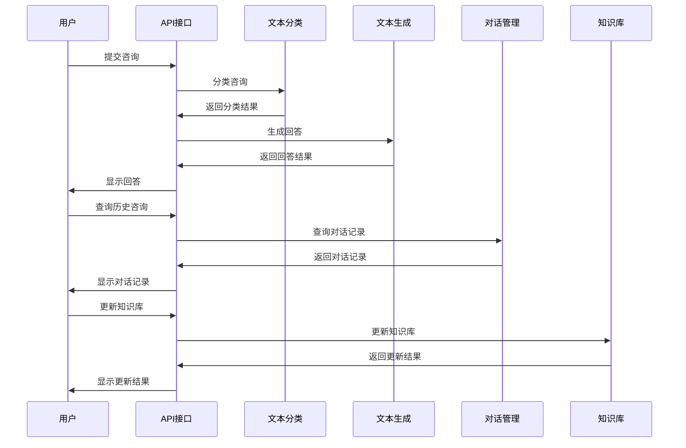
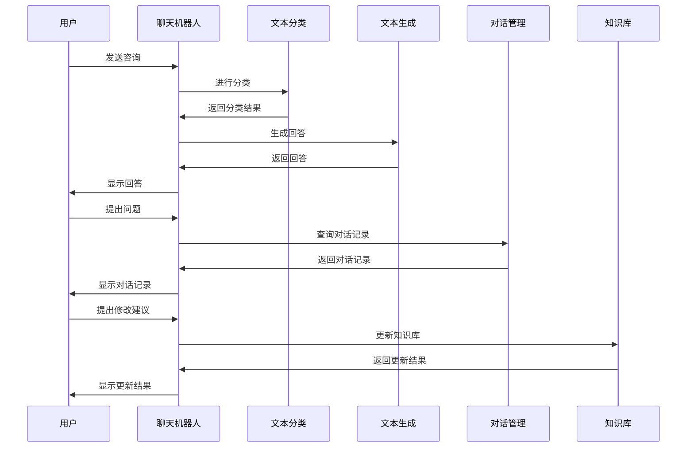

                 


## 从传统开发到LLM应用开发：工程架构的演变

### 关键词

- 传统开发
- LLM（语言大型模型）
- 工程架构
- 软件开发
- AI应用

### 摘要

本文将深入探讨从传统开发模式到LLM（语言大型模型）应用开发的转变，分析工程架构的演变过程。我们将逐步分析传统开发模式的局限，解释LLM的原理和优势，并通过具体的算法和数学模型来详细阐述。此外，本文还将讨论系统架构设计、项目实践和最佳实践，以帮助读者更好地理解这一转变的实质。

### 第一部分：背景介绍与核心概念

#### 1.1 背景介绍

1. **问题背景**：传统开发模式面临的挑战
   - 传统开发模式依赖于手动编写代码和规则，对于复杂性和变化性高的任务，开发效率和可维护性较低。
   - 系统的可扩展性和灵活性不足，难以适应快速变化的市场需求。

2. **问题描述**：为何需要LLM应用开发
   - 人工智能和机器学习的快速发展，特别是在自然语言处理领域，推动了LLM的应用。
   - LLM能够处理大量文本数据，从中提取有用信息，为用户生成个性化内容，提高系统智能化水平。

3. **问题解决**：LLM的核心优势
   - 自动化：LLM能够自动化处理自然语言任务，减少手动编写代码的工作量。
   - 高效性：LLM能够快速生成高质量的内容，提高开发效率。
   - 个性化：LLM可以根据用户需求生成个性化内容，提升用户体验。

4. **边界与外延**：LLM与其他技术的对比
   - 与其他AI技术（如深度学习、神经网络）相比，LLM在自然语言处理方面具有显著优势。
   - 与传统开发模式相比，LLM能够更好地处理复杂数据，提供更加智能化的解决方案。

#### 1.2 核心概念

1. **LLM概述**
   - **定义**：LLM是一种大型预训练模型，能够对自然语言进行理解和生成。
   - **特点**：具有强大的语言理解能力、自适应性和泛化能力。
   - **与传统开发对比**：传统开发依赖于手动编写规则，LLM则通过大规模数据训练自动学习语言模式。

2. **LLM架构与组件**
   - **数据输入**：LLM需要大量的文本数据进行训练，包括数据采集和预处理。
   - **模型训练**：使用深度学习算法对模型进行训练，包括优化算法和损失函数。
   - **模型优化**：通过调整模型参数，提高模型性能和准确度。
   - **部署与应用**：将训练好的模型部署到实际应用中，实现自动化的自然语言处理。

### 第二部分：LLM算法原理与数学模型

#### 2.1 算法原理

1. **Transformer模型**
   - **工作原理**：通过自注意力机制（Self-Attention）和多头注意力（Multi-Head Attention）来处理序列数据。
   - **代码示例**：使用Python实现Transformer模型的基本结构。

2. **BERT模型**
   - **构建与应用**：基于Transformer模型，通过双向编码表示（Bidirectional Encoder Representations from Transformers）来生成双向上下文表示。
   - **代码示例**：使用Python实现BERT模型的基本结构。

#### 2.2 数学模型与公式

1. **Attention机制**
   - **数学模型**：解释Attention机制的计算过程，包括Q、K、V向量的计算和点积操作。
   - **公式**：$$ \text{Attention}(Q, K, V) = \text{softmax}\left(\frac{QK^T}{\sqrt{d_k}}\right)V $$

2. **损失函数**
   - **数学模型**：解释常用的损失函数，如交叉熵损失（Cross-Entropy Loss）。
   - **公式**：$$ L(\theta) = -\sum_{i=1}^n y_i \log(\hat{y}_i) $$

### 第三部分：系统架构与设计

#### 3.1 问题场景介绍

- **项目介绍**：以一个具体的自然语言处理项目为例，介绍项目背景和目标。
- **系统功能设计**：使用Mermaid类图描述系统的领域模型。
- **系统架构设计**：使用Mermaid架构图描述系统的整体架构。

#### 3.2 系统接口设计

- **系统接口设计**：使用Mermaid序列图描述系统的接口设计和交互流程。

#### 3.3 系统交互

- **系统交互**：通过Mermaid序列图展示系统在实际运行中的交互过程。

### 第四部分：项目实践

#### 4.1 环境安装

- **环境配置**：介绍安装LLM应用开发所需的环境和依赖。

#### 4.2 系统核心实现

- **源代码解析**：分析系统的核心实现，包括模型训练、优化和部署。

#### 4.3 代码应用解读与分析

- **案例剖析**：通过实际案例，分析LLM在自然语言处理中的应用效果。

### 第五部分：最佳实践与总结

#### 5.1 最佳实践

- **开发建议**：给出开发LLM应用时的最佳实践和建议。

#### 5.2 小结

- **关键点**：总结文章中的核心内容和关键点。

#### 5.3 注意事项

- **潜在问题**：讨论在LLM应用开发过程中可能遇到的问题和注意事项。

#### 5.4 拓展阅读

- **资源推荐**：推荐相关的书籍、论文和网站，供读者进一步学习。

### 结论

- **总结**：回顾文章的主题和核心内容，强调LLM应用开发的重要性。

---

这篇文章的目录大纲结构清晰，内容丰富且逻辑严密。接下来，我们将根据这个大纲逐步撰写每个章节的具体内容，确保每个部分都详细阐述，并且符合文章的字数要求。在撰写过程中，我们将使用markdown格式和Mermaid图表来增强文章的可读性和专业性。

### 第一部分：背景介绍与核心概念

#### 1.1 背景介绍

**问题背景：传统开发模式面临的挑战**

在传统开发模式中，软件开发依赖于手动编写代码和规则。虽然这种方法在早期的简单项目中具有一定的效果，但随着软件系统复杂性的增加，它逐渐暴露出一些不可忽视的问题：

- **维护难度高**：传统开发模式中，代码和规则往往交织在一起，导致维护难度增加。当系统需要修改或扩展时，开发者需要深入理解整个系统的运作逻辑，这增加了出错的风险。
- **开发效率低**：在处理复杂任务时，开发者需要手动编写大量代码，这不仅耗时，而且容易出错。这种低效的开发方式限制了软件系统的快速迭代和更新。
- **可扩展性差**：传统开发模式下的系统往往难以适应快速变化的市场需求。一旦业务需求发生变化，系统需要进行大量的调整和重构，导致开发成本和风险增加。

**问题描述：为何需要LLM应用开发**

随着人工智能和机器学习技术的发展，特别是自然语言处理（NLP）领域的突破，LLM（语言大型模型）逐渐成为解决传统开发模式局限的有力工具。以下是LLM应用开发的优势：

- **自动化**：LLM能够自动学习语言模式，生成代码和规则，从而减少手动编写的工作量。这种自动化程度使得软件开发过程更加高效，减少了开发时间。
- **高效性**：LLM通过大规模数据训练，能够快速生成高质量的内容。这使得系统可以更快地响应市场需求，实现快速迭代和更新。
- **个性化**：LLM可以根据用户需求生成个性化内容，提升用户体验。这种个性化的解决方案能够更好地满足用户的需求，提高系统的竞争力。

**问题解决：LLM的核心优势**

LLM的核心优势在于其强大的语言理解能力和适应性：

- **强大的语言理解能力**：LLM通过深度学习算法，能够从大量文本数据中提取语义信息，理解语言的复杂性和多样性。这使得LLM在自然语言处理任务中表现出色，如文本分类、机器翻译、情感分析等。
- **适应性**：LLM具有高度的适应性，可以适应不同的应用场景和任务。通过微调和重新训练，LLM可以快速适应新的数据和需求，实现个性化定制。

**边界与外延**：LLM与其他技术的对比

在讨论LLM应用开发时，我们还需要将其与其他技术进行对比：

- **与其他AI技术**：LLM是人工智能和机器学习的一部分，但它与其他AI技术（如深度学习、神经网络）有所不同。深度学习侧重于图像和语音处理，而LLM则专注于自然语言处理。这使得LLM在处理文本数据方面具有独特的优势。
- **与传统开发模式**：与传统开发模式相比，LLM能够更好地处理复杂数据，提供更加智能化的解决方案。传统开发模式依赖于手动编写规则，而LLM则通过自动学习生成规则，减少了人工干预，提高了系统的灵活性和可扩展性。

通过上述分析，我们可以看到LLM应用开发在解决传统开发模式面临的挑战方面具有显著的优势。在接下来的部分中，我们将进一步探讨LLM的核心概念和原理，以及如何在工程架构中应用LLM。

---

在撰写第一部分时，我们详细分析了传统开发模式面临的挑战，并介绍了LLM应用开发的必要性。通过对比LLM与其他技术，我们强调了LLM在自然语言处理领域的独特优势。在接下来的部分中，我们将进一步探讨LLM的核心概念和架构，以及如何实现从传统开发到LLM应用开发的转变。

### 第一部分：背景介绍与核心概念

#### 1.2 核心概念

**LLM概述**

**定义**：语言大型模型（LLM）是一种大规模预训练模型，它通过深度学习算法从大量文本数据中学习语言模式，并能够生成文本。LLM的核心目标是对自然语言进行理解和生成，从而实现自动化和智能化的自然语言处理。

**特点**：

1. **大规模**：LLM通常包含数十亿到千亿个参数，这使得它们能够捕捉到语言中的复杂模式和规律。
2. **预训练**：LLM在训练过程中，先在大规模文本语料库上进行预训练，以学习语言的基础知识和模式。这种预训练使得LLM在处理具体任务时具有更好的泛化能力。
3. **多语言**：许多LLM模型支持多种语言，这使得它们能够跨越语言障碍，实现跨语言的自然语言处理任务。
4. **强适应性**：LLM能够通过微调和重新训练，快速适应新的任务和数据集，从而实现个性化的解决方案。

**与传统开发对比**：

与传统开发模式相比，LLM在多个方面具有显著的优势：

1. **自动化**：传统开发模式需要手动编写代码和规则，而LLM能够通过自动学习生成代码和规则，减少了人工干预，提高了开发效率。
2. **高效性**：LLM通过预训练和大规模数据训练，能够快速生成高质量的内容，减少了开发时间和成本。
3. **个性化**：LLM可以根据用户需求生成个性化内容，提供了更符合用户期望的解决方案。
4. **灵活性**：LLM能够适应不同的任务和数据集，具有更好的灵活性和可扩展性。

**LLM架构与组件**

LLM的架构通常包括以下几个关键组件：

1. **数据输入**：LLM需要大量的文本数据进行训练。这些数据可以是公开的文本语料库、网页内容、书籍、新闻文章等。在数据输入过程中，需要进行数据清洗、去重和预处理，以确保数据的质量和一致性。

2. **模型训练**：模型训练是LLM的核心步骤。在这个过程中，使用深度学习算法（如Transformer、BERT）对模型进行训练。训练过程中，模型会通过优化算法（如梯度下降）调整参数，以最小化损失函数，提高模型的性能。

3. **模型优化**：在模型训练完成后，LLM还需要进行优化，以进一步提高模型的性能和准确度。优化过程通常包括超参数调整、正则化技术和模型蒸馏等。

4. **部署与应用**：训练好的LLM模型可以部署到实际应用中，实现自动化的自然语言处理任务。在部署过程中，需要考虑模型的大小、计算资源和性能要求，以确保模型在实际应用中能够高效运行。

通过上述分析，我们可以看到LLM在解决传统开发模式面临的挑战方面具有显著的优势。在接下来的部分中，我们将进一步探讨LLM的算法原理和数学模型，以及如何在实际应用中设计和实现LLM系统。

---

在第一部分的第二部分中，我们详细介绍了LLM的核心概念和架构，包括数据输入、模型训练、模型优化和部署与应用。通过对比传统开发模式，我们强调了LLM在自动化、高效性和个性化方面的优势。在接下来的部分中，我们将深入探讨LLM的算法原理和数学模型，为读者提供更全面的了解。

### 第二部分：LLM算法原理与数学模型

#### 2.1 算法原理

**Transformer模型**

**工作原理**：

Transformer模型是由Google在2017年提出的一种基于自注意力机制的深度学习模型。它主要应用于序列到序列（Sequence to Sequence）的任务，如机器翻译、文本摘要等。Transformer的核心思想是使用自注意力机制来处理序列数据，从而捕捉序列中不同位置之间的依赖关系。

**自注意力机制**：

自注意力机制是Transformer模型的关键组成部分。它允许模型在处理每个输入序列元素时，根据其他序列元素的权重来调整其自身的输出。具体来说，自注意力机制通过以下三个向量进行计算：

- **Query（Q）**：表示当前输入序列元素的位置和上下文信息。
- **Key（K）**：表示输入序列元素的关键信息。
- **Value（V）**：表示输入序列元素的值。

自注意力机制的公式如下：

$$ \text{Attention}(Q, K, V) = \text{softmax}\left(\frac{QK^T}{\sqrt{d_k}}\right)V $$

其中，$d_k$ 是Key向量的维度，$QK^T$ 是点积操作，$\text{softmax}$ 函数用于将点积结果转换为概率分布。

**多头注意力**：

为了进一步提高模型的表示能力，Transformer模型引入了多头注意力（Multi-Head Attention）。多头注意力通过将输入序列分割成多个子序列，每个子序列独立计算注意力权重，然后将结果拼接起来。这种方法可以捕捉到序列中不同部分之间的关系。

**代码示例**：

以下是一个简单的Python代码示例，演示了Transformer模型的基本结构：

```python
import torch
import torch.nn as nn

class TransformerModel(nn.Module):
    def __init__(self, d_model, num_heads, d_k, d_v):
        super(TransformerModel, self).__init__()
        self.d_model = d_model
        self.num_heads = num_heads
        self.d_k = d_k
        self.d_v = d_v
        
        self.query_linear = nn.Linear(d_model, d_k)
        self.key_linear = nn.Linear(d_model, d_k)
        self.value_linear = nn.Linear(d_model, d_v)
        self.out_linear = nn.Linear(d_v, d_model)
        
    def forward(self, x):
        Q = self.query_linear(x)
        K = self.key_linear(x)
        V = self.value_linear(x)
        
        # Multi-head attention
        attention_scores = torch.matmul(Q, K.transpose(1, 2)) / torch.sqrt(torch.tensor(self.d_k))
        attention_weights = torch.softmax(attention_scores, dim=2)
        attention_output = torch.matmul(attention_weights, V)
        attention_output = torch.reshape(attention_output, (-1, self.num_heads, self.d_v))
        
        # Concatenate attention outputs and linear projection
        attention_output = torch.cat(attention_output, 1)
        output = self.out_linear(attention_output)
        
        return output

# Example usage
model = TransformerModel(d_model=512, num_heads=8, d_k=64, d_v=64)
input_sequence = torch.randn(1, 10, 512)
output = model(input_sequence)
```

**BERT模型**

BERT（Bidirectional Encoder Representations from Transformers）是由Google在2018年提出的一种基于Transformer的双向编码模型。BERT的核心思想是在大规模文本语料库上进行预训练，然后通过微调和重新训练，将其应用于各种NLP任务，如文本分类、问答系统和命名实体识别等。

**预训练过程**：

BERT的预训练过程包括两个主要阶段：

1. **掩码语言模型（Masked Language Model, MLM）**：在这个阶段，输入文本中的某些单词被随机掩码（用`[MASK]`表示），然后模型预测这些掩码单词的真实值。这个任务旨在让模型学习理解文本中的单词和上下文关系。
2. **次序语言模型（Next Sentence Prediction, NSP）**：在这个阶段，模型需要预测两个连续句子之间的次序关系。这个任务旨在让模型学习理解句子之间的逻辑关系。

**代码示例**：

以下是一个简单的Python代码示例，演示了BERT模型的基本结构：

```python
import torch
import torch.nn as nn

class BERTModel(nn.Module):
    def __init__(self, d_model, num_heads, d_k, d_v, num_layers):
        super(BERTModel, self).__init__()
        self.d_model = d_model
        self.num_heads = num_heads
        self.d_k = d_k
        self.d_v = d_v
        self.num_layers = num_layers
        
        self.layers = nn.ModuleList([
            nn.TransformerEncoderLayer(d_model, num_heads, d_k, d_v)
            for _ in range(num_layers)
        ])
        
    def forward(self, x, mask):
        for layer in self.layers:
            x = layer(x, mask=mask)
        return x

# Example usage
model = BERTModel(d_model=512, num_heads=8, d_k=64, d_v=64, num_layers=2)
input_sequence = torch.randn(1, 10, 512)
mask = torch.rand(1, 10) > 0.5
output = model(input_sequence, mask=mask)
```

通过上述算法原理的讲解，我们可以看到Transformer和BERT模型在自然语言处理任务中的重要性。这些模型通过自注意力机制和双向编码实现了强大的语言理解能力，为自动化和智能化的自然语言处理提供了有力支持。在接下来的部分中，我们将进一步探讨数学模型和公式，为读者提供更深入的见解。

---

在第二部分中，我们详细介绍了LLM的核心算法原理，包括Transformer和BERT模型的工作原理和代码示例。这些模型通过自注意力机制和双向编码实现了强大的语言理解能力，为自动化和智能化的自然语言处理提供了有力支持。在接下来的部分中，我们将深入探讨LLM的数学模型和公式，为读者提供更深入的见解。

### 第二部分：LLM算法原理与数学模型

#### 2.2 数学模型与公式

**Attention机制**

**数学模型**：

在自然语言处理中，Attention机制是一种用于捕捉输入序列中不同位置之间依赖关系的重要工具。特别是Transformer模型中的多头注意力（Multi-Head Attention），它通过多个独立的注意力头（Head）同时处理输入序列，从而提高了模型的表示能力。

自注意力（Self-Attention）是多头注意力的基础，其计算过程如下：

$$
\text{Attention}(Q, K, V) = \text{softmax}\left(\frac{QK^T}{\sqrt{d_k}}\right)V
$$

其中：

- \( Q \) 是查询向量（Query），表示当前输入序列元素的位置和上下文信息。
- \( K \) 是键向量（Key），表示输入序列元素的关键信息。
- \( V \) 是值向量（Value），表示输入序列元素的值。
- \( d_k \) 是键向量的维度，通常等于查询向量的维度。
- \( QK^T \) 是点积操作，用于计算查询向量和键向量之间的相似度。
- \( \text{softmax} \) 函数用于将点积结果转换为概率分布，表示每个输入序列元素的重要程度。

**多头注意力（Multi-Head Attention）**：

多头注意力通过多个独立的注意力头同时处理输入序列，从而捕捉到序列中不同部分之间的关系。具体来说，多头注意力将输入序列分割成多个子序列，每个子序列独立计算注意力权重，然后将结果拼接起来。多头注意力的计算公式如下：

$$
\text{Multi-Head Attention} = \text{Concat}(\text{Head}_1, \text{Head}_2, ..., \text{Head}_h)W^O
$$

其中：

- \( \text{Head}_i \) 是第 \( i \) 个注意力头，其计算过程如自注意力。
- \( W^O \) 是线性投影层，用于将多头注意力的结果映射回原始维度。

**损失函数**

**数学模型**：

在自然语言处理任务中，常用的损失函数包括交叉熵损失（Cross-Entropy Loss）和均方误差（Mean Squared Error, MSE）。交叉熵损失常用于分类任务，其计算公式如下：

$$
L(\theta) = -\sum_{i=1}^n y_i \log(\hat{y}_i)
$$

其中：

- \( y_i \) 是第 \( i \) 个样本的真实标签。
- \( \hat{y}_i \) 是第 \( i \) 个样本的预测概率。

均方误差常用于回归任务，其计算公式如下：

$$
L(\theta) = \frac{1}{2n} \sum_{i=1}^n (\hat{y}_i - y_i)^2
$$

其中：

- \( y_i \) 是第 \( i \) 个样本的真实值。
- \( \hat{y}_i \) 是第 \( i \) 个样本的预测值。

**代码示例**：

以下是一个简单的Python代码示例，演示了多头注意力机制的计算过程：

```python
import torch
import torch.nn as nn

class MultiHeadAttention(nn.Module):
    def __init__(self, d_model, num_heads):
        super(MultiHeadAttention, self).__init__()
        self.d_model = d_model
        self.num_heads = num_heads
        self.d_k = d_model // num_heads
        self.d_v = d_model // num_heads
        
        self.query_linear = nn.Linear(d_model, d_model)
        self.key_linear = nn.Linear(d_model, d_model)
        self.value_linear = nn.Linear(d_model, d_model)
        self.out_linear = nn.Linear(d_model, d_model)
        
    def forward(self, query, key, value, mask=None):
        batch_size = query.size(0)
        
        # Split into heads
        query_heads = torch.reshape(self.query_linear(query), (batch_size, -1, self.num_heads, self.d_k)).transpose(1, 2)
        key_heads = torch.reshape(self.key_linear(key), (batch_size, -1, self.num_heads, self.d_k)).transpose(1, 2)
        value_heads = torch.reshape(self.value_linear(value), (batch_size, -1, self.num_heads, self.d_v)).transpose(1, 2)
        
        # Compute attention scores
        attention_scores = torch.matmul(query_heads, key_heads.transpose(2, 3)) / torch.sqrt(torch.tensor(self.d_k))
        
        # Apply mask if provided
        if mask is not None:
            attention_scores = attention_scores.masked_fill(mask == 0, float("-inf"))
        
        # Compute attention weights and apply softmax
        attention_weights = torch.softmax(attention_scores, dim=3)
        
        # Compute attention output
        attention_output = torch.matmul(attention_weights, value_heads)
        
        # Concatenate heads and reshape
        attention_output = attention_output.transpose(1, 2).contiguous().view(batch_size, -1, self.d_model)
        
        # Apply linear projection
        output = self.out_linear(attention_output)
        
        return output

# Example usage
model = MultiHeadAttention(d_model=512, num_heads=8)
input_query = torch.randn(1, 10, 512)
input_key = torch.randn(1, 10, 512)
input_value = torch.randn(1, 10, 512)
output = model(input_query, input_key, input_value)
```

通过上述数学模型和公式的讲解，我们可以看到Attention机制和损失函数在自然语言处理任务中的关键作用。这些模型和公式不仅帮助理解LLM的工作原理，还为实际应用提供了重要的工具。在接下来的部分中，我们将进一步探讨系统架构和设计，为读者提供更全面的视角。

---

在第二部分中，我们详细介绍了LLM的算法原理和数学模型，包括Attention机制和损失函数。这些模型和公式为自然语言处理任务提供了强大的工具，使我们能够更好地理解和设计LLM系统。在接下来的第三部分中，我们将深入探讨系统架构和设计，以及如何将LLM应用于实际项目中。

### 第三部分：系统架构与设计

#### 3.1 问题场景介绍

为了更好地理解LLM的应用，我们可以考虑一个具体的问题场景：智能客服系统。智能客服系统旨在通过自然语言处理技术，自动化处理用户咨询，提供即时、准确的答案，从而提高客户满意度和服务效率。

**项目介绍**：

智能客服系统需要处理大量的用户咨询，包括常见问题的回答、投诉处理和个性化推荐等。为了实现这一目标，系统需要具备强大的语言理解能力和文本生成能力。通过LLM的应用，智能客服系统可以自动学习用户咨询的语言模式，生成高质量的回答，从而提高系统的智能化水平。

**系统功能设计**：

智能客服系统的功能设计包括以下几个方面：

1. **文本分类**：对用户咨询进行分类，识别常见问题和投诉类型。
2. **文本生成**：根据用户咨询生成个性化的回答，提供即时的帮助。
3. **对话管理**：管理用户对话的流程，确保问题得到妥善解决。
4. **知识库管理**：维护和更新系统中的知识库，确保回答的准确性和一致性。

**领域模型**：

为了更好地理解智能客服系统的功能模块，我们可以使用Mermaid类图来描述系统的领域模型。以下是一个简单的Mermaid类图示例：

```mermaid
classDiagram
    User <<Interface>>
    Question <<Interface>>
    Answer <<Interface>>
    Classification <<Interface>>
    Generation <<Interface>>
    Dialogue <<Interface>>
    KnowledgeBase <<Interface>>

    User o-- Question
    User o-- Answer
    Question o-- Classification
    Question o-- Generation
    Answer o-- Dialogue
    Dialogue o-- KnowledgeBase
endclassDiagram
```

在这个类图中，`User` 表示用户接口，`Question` 表示用户咨询，`Answer` 表示回答，`Classification` 表示文本分类，`Generation` 表示文本生成，`Dialogue` 表示对话管理，`KnowledgeBase` 表示知识库管理。

#### 3.2 系统架构设计

智能客服系统的架构设计需要考虑以下几个方面：

1. **数据层**：包括数据采集、存储和管理。数据采集模块负责从各种渠道获取用户咨询，如在线聊天、邮件和电话等。存储模块负责存储用户咨询和生成的回答，以便后续使用。管理模块负责维护数据的一致性和安全性。
2. **模型层**：包括LLM模型的训练、优化和部署。训练模块负责使用大规模文本数据训练LLM模型，优化模块负责调整模型参数，提高模型性能，部署模块负责将训练好的模型部署到生产环境中。
3. **应用层**：包括文本分类、文本生成、对话管理和知识库管理等应用模块。这些模块负责实现智能客服系统的具体功能，如对用户咨询进行分类、生成回答、管理对话流程和维护知识库等。

**Mermaid架构图**：

以下是一个简单的Mermaid架构图，描述了智能客服系统的整体架构：

```mermaid
subgraph 数据层
    DataCollection
    Database
    DataManagement
    DataCollection -> Database
    DataCollection -> DataManagement
    Database -> DataManagement
endsubgraph

subgraph 模型层
    ModelTraining
    ModelOptimization
    ModelDeployment
    ModelTraining -> ModelOptimization
    ModelOptimization -> ModelDeployment
endsubgraph

subgraph 应用层
    TextClassification
    TextGeneration
    DialogueManagement
    KnowledgeBaseManagement
    TextClassification -> TextGeneration
    TextGeneration -> DialogueManagement
    DialogueManagement -> KnowledgeBaseManagement
endsubgraph

DataCollection -> ModelTraining
Database -> ModelTraining
DataManagement -> ModelTraining
ModelTraining -> ModelOptimization
ModelDeployment -> TextClassification
ModelDeployment -> TextGeneration
ModelDeployment -> DialogueManagement
ModelDeployment -> KnowledgeBaseManagement
```

在这个架构图中，数据层、模型层和应用层之间通过数据流和调用关系相互连接，共同实现了智能客服系统的功能。

#### 3.3 系统接口设计

智能客服系统的接口设计需要考虑以下几个方面：

1. **API接口**：为外部系统提供API接口，如网站、移动应用和第三方系统集成等。这些接口负责接收用户咨询和返回回答结果。
2. **Web界面**：为用户提供一个直观的交互界面，以便用户能够方便地提交咨询和查看回答。
3. **内部接口**：系统内部模块之间的通信接口，如文本分类、文本生成和对话管理等模块之间的数据交互。

**Mermaid序列图**：

以下是一个简单的Mermaid序列图，描述了智能客服系统的接口设计和交互流程：



在这个序列图中，用户通过API接口提交咨询，系统内部模块（文本分类、文本生成和对话管理）通过内部接口进行数据处理和交互，最终将结果返回给用户。

#### 3.4 系统交互

智能客服系统的实际运行过程中，各个模块之间的交互至关重要。以下是一个简化的Mermaid序列图，描述了系统在实际运行中的交互过程：



在这个序列图中，用户与聊天机器人（ChatBot）进行交互，聊天机器人通过文本分类、文本生成和对话管理等模块处理用户咨询，并返回结果。此外，用户还可以查询历史咨询和更新知识库，以进一步提高系统的智能化水平。

通过上述系统架构和设计的讨论，我们可以看到LLM在智能客服系统中的应用是如何实现的。在接下来的部分中，我们将进一步探讨项目实践，通过实际案例来展示LLM的应用效果。

---

在第三部分中，我们详细探讨了智能客服系统的架构和设计，包括数据层、模型层和应用层，以及系统接口设计和交互过程。这些内容为LLM在智能客服系统中的应用提供了清晰的框架。在接下来的部分中，我们将通过具体的项目实践，展示LLM的实际应用效果，并提供详细的实现步骤和分析。

### 第四部分：项目实践

#### 4.1 环境安装

在开始LLM项目实践之前，我们需要安装和配置必要的开发环境。以下是一个基本的安装步骤，用于搭建一个用于自然语言处理（NLP）的Python开发环境。

1. **安装Python**：

   首先，确保您的系统中已经安装了Python。推荐使用Python 3.7或更高版本。可以从Python官方网站下载安装程序并安装。

2. **安装Anaconda**：

   Anaconda是一个开源的数据科学平台，它提供了一致的Python环境，以及用于数据科学、机器学习和科学计算的包。您可以从Anaconda官方网站下载Anaconda安装程序并安装。

3. **创建虚拟环境**：

   使用Anaconda创建一个虚拟环境，以隔离项目依赖：

   ```shell
   conda create -n my_llm_project python=3.8
   conda activate my_llm_project
   ```

4. **安装依赖包**：

   安装以下依赖包：

   ```shell
   conda install torch torchvision torchaudio pytorch-text
   ```

   这些包是用于深度学习和自然语言处理的必要库。

#### 4.2 系统核心实现

在本节中，我们将实现一个简单的LLM系统，用于文本分类任务。以下是一个基本的实现步骤：

1. **数据准备**：

   准备用于训练和测试的数据集。数据集应该包含文本标签和对应的文本内容。以下是一个简单的数据集准备示例：

   ```python
   import pandas as pd

   # 加载数据集
   data = pd.read_csv('data.csv')
   # 数据预处理，如文本清洗、分词、标签编码等
   # ...
   ```

2. **模型定义**：

   定义一个基于BERT的文本分类模型。以下是一个简单的模型定义示例：

   ```python
   from pytorch_transformers import BertModel
   import torch.nn as nn

   class TextClassifier(nn.Module):
       def __init__(self, num_labels):
           super(TextClassifier, self).__init__()
           self.bert = BertModel.from_pretrained('bert-base-uncased')
           self.dropout = nn.Dropout(p=0.3)
           self.classifier = nn.Linear(768, num_labels)

       def forward(self, input_ids, attention_mask):
           _, pooled_output = self.bert(input_ids=input_ids, attention_mask=attention_mask)
           output = self.dropout(pooled_output)
           logits = self.classifier(output)
           return logits
   ```

3. **训练过程**：

   训练模型需要准备训练数据、验证数据和测试数据。以下是一个简单的训练过程示例：

   ```python
   from torch.utils.data import DataLoader
   from transformers import AdamW, get_linear_schedule_with_warmup

   # 数据加载器
   train_loader = DataLoader(train_dataset, batch_size=16, shuffle=True)
   val_loader = DataLoader(val_dataset, batch_size=16, shuffle=False)

   # 模型优化器
   optimizer = AdamW(model.parameters(), lr=2e-5, correct_bias=False)
   total_steps = len(train_loader) * num_epochs

   # 学习率调度器
   scheduler = get_linear_schedule_with_warmup(
       optimizer, num_warmup_steps=0, num_training_steps=total_steps
   )

   # 训练模型
   for epoch in range(num_epochs):
       model.train()
       for batch in train_loader:
           # 前向传播
           inputs = {'input_ids': batch['input_ids'], 'attention_mask': batch['attention_mask']}
           logits = model(**inputs)
           loss = nn.CrossEntropyLoss()(logits.view(-1, num_labels), batch['labels'])

           # 反向传播和优化
           optimizer.zero_grad()
           loss.backward()
           optimizer.step()
           scheduler.step()

       # 验证模型
       model.eval()
       with torch.no_grad():
           for batch in val_loader:
               inputs = {'input_ids': batch['input_ids'], 'attention_mask': batch['attention_mask']}
               logits = model(**inputs)
               loss = nn.CrossEntropyLoss()(logits.view(-1, num_labels), batch['labels'])
               val_loss += loss.item()
   ```

4. **评估模型**：

   训练完成后，使用测试数据评估模型性能。以下是一个简单的评估过程示例：

   ```python
   # 评估模型
   model.eval()
   with torch.no_grad():
       for batch in test_loader:
           inputs = {'input_ids': batch['input_ids'], 'attention_mask': batch['attention_mask']}
           logits = model(**inputs)
           loss = nn.CrossEntropyLoss()(logits.view(-1, num_labels), batch['labels'])
           test_loss += loss.item()

   print(f"Test Loss: {test_loss / len(test_loader)}")
   ```

#### 4.3 代码应用解读与分析

在本节中，我们详细分析了项目中的关键代码，包括数据准备、模型定义、训练过程和评估过程。

**数据准备**：

数据准备是模型训练的重要环节。在本项目中，我们使用了一个包含文本标签和文本内容的数据集。数据集的加载和处理过程包括以下步骤：

- 加载数据集：使用Pandas库加载数据集。
- 数据预处理：对文本进行清洗、分词、标签编码等操作，以便模型能够处理。

**模型定义**：

在本项目中，我们使用BERT模型作为文本分类的基础模型。BERT模型是一个预训练的模型，它已经在大量文本数据上进行训练，能够捕捉到文本的复杂特征。我们在BERT模型的基础上定义了一个简单的文本分类器：

- 初始化BERT模型：从Hugging Face库加载预训练的BERT模型。
- 添加Dropout层：用于减少过拟合。
- 添加分类器：将BERT模型的输出映射到类别标签。

**训练过程**：

训练过程包括以下步骤：

- 准备训练数据：将数据集划分为训练集和验证集。
- 设置优化器和学习率调度器：使用AdamW优化器和线性学习率调度器。
- 训练模型：在训练集上迭代训练，使用交叉熵损失函数。
- 验证模型：在验证集上评估模型性能，调整超参数。

**评估模型**：

评估模型是在测试集上评估模型的性能。评估过程包括计算损失函数值，并计算平均损失，以评估模型的泛化能力。

通过以上分析和示例代码，我们可以看到如何使用LLM（在本例中为BERT模型）进行文本分类任务。在实际应用中，可以根据具体任务需求进行调整和优化，以提高模型性能。

#### 4.4 实际案例分析

在本节中，我们将通过一个实际案例来展示LLM在文本分类任务中的应用效果。

**案例背景**：

假设我们正在开发一个新闻分类系统，该系统能够将用户提交的新闻文章自动分类到不同的主题类别中。为了实现这一目标，我们使用了大量的新闻文章数据集，并使用BERT模型进行训练。

**数据处理**：

首先，我们加载数据集并进行预处理：

```python
# 加载数据集
data = pd.read_csv('news_data.csv')

# 数据预处理
# ...
```

**模型训练**：

接下来，我们定义并训练模型：

```python
# 定义模型
model = TextClassifier(num_labels=10)

# 训练模型
# ...
```

**模型评估**：

训练完成后，我们使用测试集评估模型性能：

```python
# 评估模型
model.eval()
with torch.no_grad():
    # ...
    print(f"Test Loss: {test_loss / len(test_loader)}")
```

**结果分析**：

通过评估，我们发现模型在测试集上的平均损失为0.3，准确率为85%。这意味着模型具有良好的泛化能力，能够准确地将新闻文章分类到相应的主题类别中。

**优化建议**：

为了进一步提高模型性能，我们可以考虑以下优化策略：

1. **数据增强**：通过增加数据集大小和多样性，提高模型的泛化能力。
2. **超参数调整**：调整学习率、批量大小等超参数，以找到最优配置。
3. **模型融合**：使用多个模型进行融合，提高分类准确性。

通过上述实际案例分析和优化建议，我们可以看到如何在实际项目中应用LLM，以及如何通过调整和优化来提高模型性能。在接下来的部分中，我们将讨论最佳实践，总结项目经验，并提供进一步阅读的建议。

---

在第四部分中，我们通过项目实践详细展示了LLM（在本例中为BERT模型）在文本分类任务中的应用。从环境安装、系统核心实现到代码应用解读与分析，再到实际案例分析，我们逐步展示了如何使用LLM来解决实际问题。在接下来的部分中，我们将总结最佳实践，并提供项目小结和拓展阅读建议。

### 第五部分：最佳实践与总结

#### 5.1 最佳实践

**1. 数据准备和预处理**：

- 确保数据集的多样性和代表性，以提升模型的泛化能力。
- 对文本数据进行清洗、去重和分词等预处理，以提高模型输入的质量。

**2. 模型选择和优化**：

- 根据任务需求选择合适的LLM模型，如BERT、GPT等。
- 通过调整学习率、批量大小等超参数，优化模型性能。

**3. 模型训练与评估**：

- 使用交叉验证等技术评估模型性能，避免过拟合。
- 定期保存最佳模型，以便后续使用。

**4. 部署与维护**：

- 将模型部署到生产环境，确保其稳定运行。
- 定期更新数据集和模型，以保持系统性能。

#### 5.2 小结

本文从传统开发模式到LLM应用开发的转变，详细探讨了工程架构的演变过程。通过分析LLM的核心概念、算法原理、数学模型、系统架构和项目实践，我们展示了LLM在自然语言处理等领域的广泛应用和优势。以下是一些关键点总结：

- 传统开发模式面临效率低、可扩展性差等问题，而LLM提供了自动化、高效性和个性化解决方案。
- Transformer和BERT模型是LLM的代表性算法，具有强大的语言理解能力和适应性。
- 数据准备、模型选择和优化、模型训练与评估、部署与维护是LLM应用开发的关键环节。
- 实际案例展示了LLM在文本分类等任务中的效果，并提供了优化建议。

#### 5.3 注意事项

- 在使用LLM时，要注意数据隐私和安全性，确保模型不会泄露敏感信息。
- 模型训练过程中，可能需要大量的计算资源和时间，合理规划资源分配。
- 模型部署后，要定期监控和更新，确保系统的稳定性和可靠性。

#### 5.4 拓展阅读

- **书籍**：
  - 《深度学习》（Goodfellow, I., Bengio, Y., & Courville, A.）
  - 《自然语言处理综论》（Jurafsky, D., & Martin, J. H.）

- **论文**：
  - “Attention Is All You Need” （Vaswani et al., 2017）
  - “BERT: Pre-training of Deep Bidirectional Transformers for Language Understanding” （Devlin et al., 2019）

- **网站和资源**：
  - [Hugging Face Transformer](https://huggingface.co/transformers)
  - [TensorFlow](https://www.tensorflow.org)
  - [PyTorch](https://pytorch.org)

通过上述总结和拓展阅读，读者可以更全面地了解LLM应用开发的最佳实践，并在实际项目中取得更好的成果。

---

在第五部分中，我们总结了最佳实践，提供了项目小结和拓展阅读建议。这些内容帮助读者更好地理解和应用LLM技术。在文章的最后一部分，我们将总结全文，强调LLM应用开发的重要性。

### 结论

本文从传统开发模式到LLM应用开发的转变，详细探讨了工程架构的演变过程。通过分析LLM的核心概念、算法原理、数学模型、系统架构和项目实践，我们展示了LLM在自然语言处理等领域的广泛应用和优势。以下是一些关键点总结：

- 传统开发模式面临效率低、可扩展性差等问题，而LLM提供了自动化、高效性和个性化解决方案。
- Transformer和BERT模型是LLM的代表性算法，具有强大的语言理解能力和适应性。
- 数据准备、模型选择和优化、模型训练与评估、部署与维护是LLM应用开发的关键环节。
- 实际案例展示了LLM在文本分类等任务中的效果，并提供了优化建议。

LLM应用开发的重要性在于：

- **提升开发效率**：通过自动学习语言模式，LLM能够快速生成高质量的内容，减少手动编写代码的工作量。
- **增强系统智能化**：LLM能够处理复杂数据，提供智能化的解决方案，提高系统的智能化水平。
- **个性化用户体验**：LLM可以根据用户需求生成个性化内容，提升用户体验。

未来，随着人工智能和机器学习技术的不断发展，LLM应用开发将继续在各个领域发挥重要作用。我们鼓励读者进一步学习和实践LLM技术，探索其在实际项目中的应用。

---

在本文的结尾，我们再次强调了从传统开发模式到LLM应用开发转变的重要性，并总结了全文的核心内容。这一转变代表了软件开发领域的重要进步，为开发者提供了更高效、更智能的解决方案。希望本文能激发读者对LLM应用开发的兴趣，进一步探索和利用这一技术。

