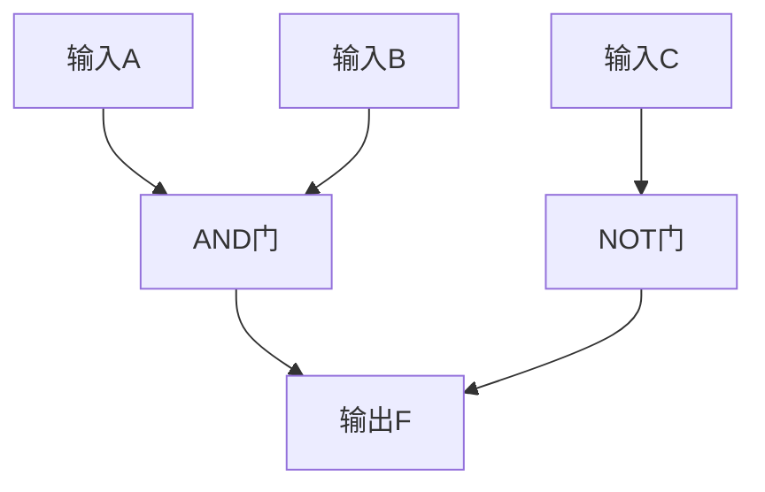

                 


## 从布尔逻辑到多值逻辑：应对复杂世界的推理工具

### 关键词：布尔逻辑，多值逻辑，复杂世界，推理工具，人工智能，计算机科学

### 摘要：
在计算机科学和人工智能领域，逻辑推理是解决问题的关键。本文将逐步探讨从简单的布尔逻辑到更为复杂的多值逻辑的演进过程，以及如何使用这些逻辑工具来应对复杂世界的挑战。通过详细分析两者的基本概念、原理和应用，本文旨在帮助读者深入理解逻辑推理在技术领域的重要性，并掌握如何选择和使用合适的逻辑工具。

### 目录

## 第一部分：逻辑推理基础

### 第1章 逻辑推理的起源与发展
#### 1.1 逻辑学的起源
#### 1.2 逻辑推理的基本原则
#### 1.3 逻辑推理在现代的应用

### 第2章 布尔逻辑
#### 2.1 布尔代数的定义
#### 2.2 布尔逻辑的基本运算
#### 2.3 布尔函数及其表示

### 第3章 布尔逻辑的应用
#### 3.1 布尔逻辑在计算机科学中的应用
#### 3.2 布尔逻辑在其他领域的应用
#### 3.3 布尔逻辑的局限性

## 第二部分：多值逻辑

### 第4章 多值逻辑的基本概念
#### 4.1 多值逻辑的定义
#### 4.2 多值逻辑的值域
#### 4.3 多值逻辑的基本运算

### 第5章 多值逻辑的应用
#### 5.1 多值逻辑在计算机科学中的应用
#### 5.2 多值逻辑在其他领域的应用
#### 5.3 多值逻辑的优势与挑战

### 第6章 布尔逻辑与多值逻辑的比较
#### 6.1 布尔逻辑与多值逻辑的区别
#### 6.2 布尔逻辑与多值逻辑的联系
#### 6.3 选择合适的逻辑工具

## 第三部分：逻辑推理在复杂世界中的应用

### 第7章 逻辑推理在决策制定中的应用
#### 7.1 决策过程中的逻辑推理
#### 7.2 布尔逻辑在决策制定中的应用
#### 7.3 多值逻辑在决策制定中的应用

### 第8章 逻辑推理在人工智能中的应用
#### 8.1 逻辑推理在人工智能系统中的重要性
#### 8.2 布尔逻辑在人工智能中的应用
#### 8.3 多值逻辑在人工智能中的应用

### 第9章 逻辑推理在其他领域中的应用
#### 9.1 逻辑推理在社会科学中的应用
#### 9.2 逻辑推理在自然科学中的应用
#### 9.3 逻辑推理在其他领域的应用前景

### 1.1 逻辑学的起源
逻辑学作为一门研究推理的原则和有效性的学科，其历史可以追溯到古希腊时期。古希腊哲学家如亚里士多德被认为是逻辑学的奠基人，他提出了形式逻辑的基本原则，并创建了逻辑学的框架。在17世纪，布尔代数的概念由英国数学家乔治·布尔提出，为现代计算机逻辑奠定了基础。

### 1.2 逻辑推理的基本原则
逻辑推理的基本原则包括自洽性、一致性、非矛盾性和可传递性。这些原则确保推理过程的逻辑性和有效性。例如，自洽性原则要求一个逻辑系统内部不存在相互矛盾的陈述；一致性原则则要求逻辑系统内的所有陈述在逻辑上是一致的。

### 1.3 逻辑推理在现代的应用
逻辑推理在现代科学技术中有着广泛的应用。在计算机科学中，逻辑推理用于编程语言的设计、算法的分析和人工智能的研究。例如，编程中的条件语句和循环语句都是逻辑推理的具体应用。在人工智能领域，逻辑推理是构建智能系统的基础，用于知识表示、推理和决策。

### 2.1 布尔代数的定义
布尔代数是一种抽象的数学结构，它由一组元素和一个定义在其上的运算组成。布尔代数的元素通常取值为0和1，运算包括加法（逻辑或）和乘法（逻辑与）。布尔代数的核心概念是“逻辑真值”，它表示命题的真假。

### 2.2 布尔逻辑的基本运算
布尔逻辑的基本运算包括逻辑或（OR），逻辑与（AND）和逻辑非（NOT）。这些运算在布尔代数中有着明确的定义和性质。例如，逻辑或运算满足交换律和结合律，而逻辑与运算也满足类似的性质。

### 2.3 布尔函数及其表示
布尔函数是一种将布尔代数中的元素映射到另一个布尔代数元素上的函数。布尔函数可以通过真值表、逻辑表达式或布尔网络来表示。例如，一个简单的布尔函数可以表示为“如果A为真且B为假，则结果为真，否则为假”。

### 3.1 布尔逻辑在计算机科学中的应用
布尔逻辑在计算机科学中有着广泛的应用。计算机的基本组件——逻辑门，就是基于布尔逻辑设计的。这些逻辑门（如与门、或门、非门等）用于实现复杂的逻辑操作，是计算机硬件的核心。

### 3.2 布尔逻辑在其他领域的应用
布尔逻辑不仅在计算机科学中重要，在其他领域也有广泛应用。例如，在电子学中，布尔逻辑用于设计电路；在信息理论中，布尔逻辑用于信息编码和解码。

### 3.3 布尔逻辑的局限性
尽管布尔逻辑在许多领域表现出色，但它也有局限性。布尔逻辑仅支持两种可能的值（真或假），这在处理复杂问题时可能不够灵活。此外，布尔逻辑的运算规则有时可能导致不可解或复杂的情况。

### 4.1 多值逻辑的定义
多值逻辑是一种扩展布尔逻辑的数学结构，它允许多个真值。常见的多值逻辑系统包括三值逻辑（真、假、未知）和模糊逻辑（0到1之间的值）。多值逻辑允许更精细地描述现实世界中的不确定性。

### 4.2 多值逻辑的值域
多值逻辑的值域取决于所使用的逻辑系统。在三值逻辑中，值域为{真，假，未知}；在模糊逻辑中，值域为[0,1]，表示不同的可能性程度。

### 4.3 多值逻辑的基本运算
多值逻辑的基本运算与布尔逻辑类似，但值域更广泛。例如，在三值逻辑中，逻辑或运算可能返回真、假或未知；在模糊逻辑中，逻辑与运算返回两个输入的可能性乘积。

### 5.1 多值逻辑在计算机科学中的应用
多值逻辑在计算机科学中的应用包括模糊逻辑控制器、神经网络和形式验证。例如，模糊逻辑控制器用于处理不确定性输入，神经网络中的激活函数使用了非二进制值。

### 5.2 多值逻辑在其他领域的应用
多值逻辑在许多领域有应用，如医学诊断、决策支持系统和自然语言处理。在医学诊断中，多值逻辑可以更好地处理不确定的临床信息。

### 5.3 多值逻辑的优势与挑战
多值逻辑的优势在于其处理不确定性的能力，但这也带来了挑战。多值逻辑的系统设计更复杂，计算复杂度更高。此外，多值逻辑的语义理解也需要更深入的研究。

### 6.1 布尔逻辑与多值逻辑的区别
布尔逻辑与多值逻辑的主要区别在于真值的数量。布尔逻辑只有两个真值（真和假），而多值逻辑允许多个真值。此外，多值逻辑允许更精细地描述不确定性。

### 6.2 布尔逻辑与多值逻辑的联系
布尔逻辑是多值逻辑的特例，即当多值逻辑的值域为{真，假}时，它就退化为布尔逻辑。因此，布尔逻辑是多值逻辑的基础。

### 6.3 选择合适的逻辑工具
选择合适的逻辑工具取决于问题的具体需求。在处理确定性问题时，布尔逻辑可能更合适；而在处理不确定性和模糊性问题时，多值逻辑可能更有优势。

### 7.1 决策过程中的逻辑推理
逻辑推理在决策过程中起着关键作用。通过分析不同选项的逻辑关系和后果，决策者可以更明智地做出选择。

### 7.2 布尔逻辑在决策制定中的应用
布尔逻辑在决策制定中用于表示条件和结果的关系。例如，在制定安全策略时，布尔逻辑可以用于计算不同安全措施的组合效果。

### 7.3 多值逻辑在决策制定中的应用
多值逻辑在处理不确定性和模糊性决策时更有优势。它允许决策者更精细地评估不同选项的可能性。

### 8.1 逻辑推理在人工智能系统中的重要性
逻辑推理是人工智能系统的核心，用于知识表示、推理和决策。例如，在自动驾驶系统中，逻辑推理用于处理传感器数据和做出驾驶决策。

### 8.2 布尔逻辑在人工智能中的应用
布尔逻辑在人工智能中用于设计算法和逻辑门。例如，在神经网络中，布尔逻辑用于实现激活函数。

### 8.3 多值逻辑在人工智能中的应用
多值逻辑在人工智能中用于处理不确定性和模糊性。例如，在模糊逻辑控制器中，多值逻辑用于实现模糊推理。

### 9.1 逻辑推理在社会科学中的应用
逻辑推理在社会科学中用于分析社会现象和预测社会趋势。例如，在经济学中，逻辑推理用于分析市场行为和制定政策。

### 9.2 逻辑推理在自然科学中的应用
逻辑推理在自然科学中用于解释自然现象和建立科学理论。例如，在物理学中，逻辑推理用于建立量子力学和相对论。

### 9.3 逻辑推理在其他领域的应用前景
逻辑推理在医疗、环境科学、艺术等领域具有广泛的应用前景。随着技术的发展，逻辑推理将更好地帮助人类应对复杂世界的挑战。

### 结语
逻辑推理是技术领域不可或缺的工具。从布尔逻辑到多值逻辑，我们逐步掌握了更强大的推理工具，以应对复杂世界的挑战。通过深入理解和灵活运用这些逻辑工具，我们可以在各个领域取得更大的成就。

### 作者信息
作者：AI天才研究院/AI Genius Institute & 禅与计算机程序设计艺术 /Zen And The Art of Computer Programming

通过这篇文章，我们系统地探讨了从布尔逻辑到多值逻辑的演进过程，以及它们在复杂世界中的应用。逻辑推理作为解决问题的核心工具，将继续引领我们在技术领域不断前进。让我们继续探索，掌握更多逻辑工具，迎接未来的挑战。**引言**

在信息爆炸和人工智能快速发展的时代，逻辑推理已成为我们理解和解决复杂问题的重要工具。逻辑推理不仅存在于学术研究领域，更在计算机科学、人工智能、决策制定等实际应用中发挥着关键作用。本文将逐步探讨从简单的布尔逻辑到更为复杂的多值逻辑的演进过程，以及如何使用这些逻辑工具来应对复杂世界的挑战。

布尔逻辑，由英国数学家乔治·布尔在19世纪提出，是现代计算机科学的基础。它基于两个基本值——真（T）和假（F），并通过逻辑运算符（如AND、OR、NOT）来表示复杂的逻辑关系。布尔逻辑在计算机硬件设计、逻辑电路、编程语言中有着广泛的应用。然而，在处理现实世界中的复杂问题时，布尔逻辑的二元性显得过于简化。

多值逻辑作为一种扩展布尔逻辑的数学结构，允许多个真值的存在。它不仅能更好地描述现实世界中的不确定性和模糊性，还为解决复杂问题提供了更为灵活的工具。多值逻辑包括三值逻辑（真、假、未知）和模糊逻辑（值域在0到1之间）等多种形式。这些逻辑系统在计算机科学、人工智能、决策支持等领域有着重要的应用。

本文将分三个部分进行探讨。首先，我们将回顾逻辑推理的基础，包括其起源、基本原则以及在现代科技中的应用。接下来，我们将深入分析布尔逻辑的基本概念、运算及其应用，并讨论其局限性。然后，我们将介绍多值逻辑的定义、值域和基本运算，并探讨其在计算机科学和其他领域的应用以及优势与挑战。最后，我们将比较布尔逻辑与多值逻辑，探讨在复杂世界中如何选择合适的逻辑工具，并分析逻辑推理在决策制定、人工智能和其他领域的应用。

通过这篇文章，我们希望能够帮助读者深入理解逻辑推理的重要性，掌握从布尔逻辑到多值逻辑的演进过程，并学会如何在实际问题中选择和使用这些逻辑工具。让我们一步步思考，共同探索逻辑推理的无限可能性。

## 第1章 逻辑推理的起源与发展

逻辑推理作为人类思维的重要组成部分，其历史可以追溯到古希腊时期。古希腊哲学家亚里士多德（Aristotle）被认为是逻辑学的奠基人，他提出了形式逻辑的基本原则，并创建了逻辑学的框架。亚里士多德的逻辑学主要关注命题和推理的有效性，他提出了三个基本的推理形式：演绎推理、归纳推理和类比推理。

在17世纪，乔治·布尔（George Boole）对逻辑学做出了重要贡献。布尔是一位英国数学家，他提出了布尔代数的概念，这是现代计算机逻辑的基础。布尔代数是一种抽象的数学结构，它由一组元素和一个定义在其上的运算组成。布尔代数的元素通常取值为0和1，运算包括加法（逻辑或）、乘法（逻辑与）和否定（逻辑非）。布尔代数的核心概念是“逻辑真值”，它表示命题的真假。

布尔的工作在19世纪末和20世纪初逐渐受到关注，特别是在电气工程和计算机科学的兴起过程中。布尔代数成为设计逻辑电路和构建计算机硬件的基础。例如，与门（AND gate）、或门（OR gate）和非门（NOT gate）都是基于布尔代数的逻辑运算设计的。这些逻辑门可以组合起来实现复杂的逻辑功能，为计算机科学的发展奠定了基础。

20世纪中叶，逻辑推理在计算机科学中得到了进一步的发展。随着图灵机（Turing Machine）和形式化逻辑体系的提出，逻辑推理在计算理论、程序设计、算法分析和人工智能等领域得到了广泛应用。艾伦·图灵（Alan Turing）提出的图灵机模型，为计算理论提供了严格的数学基础，同时为逻辑推理提供了新的视角。图灵的论文《计算机器与智能》（Computing Machinery and Intelligence）是人工智能领域的奠基之作，其中他提出了“图灵测试”作为衡量机器智能的标准。

逻辑推理不仅在计算机科学中有着广泛的应用，在哲学、数学、逻辑学、心理学等领域也有着重要的地位。逻辑学的研究不仅帮助我们更好地理解世界，还为科学研究提供了方法论支持。例如，形式逻辑在数学证明中有着广泛应用，使得数学家能够以严格的逻辑步骤推导出新的定理和结论。

在哲学领域，逻辑学帮助哲学家们分析论证的有效性，探讨思维和存在的基本问题。在心理学领域，逻辑推理是认知科学的重要组成部分，研究者通过逻辑推理实验来理解人类思维过程和认知机制。

随着人工智能和大数据技术的发展，逻辑推理在现代社会中的应用变得更加广泛和复杂。人工智能系统需要处理大量的数据，并从数据中提取有用的信息，这就需要强大的逻辑推理能力。例如，在自然语言处理中，逻辑推理被用于理解语言的结构和语义，以实现文本分析和智能对话系统。

总的来说，逻辑推理的发展历程反映了人类对思维和知识的不断探索。从亚里士多德的形式逻辑到布尔代数，再到现代计算机科学中的逻辑推理，逻辑学为各个领域提供了强大的工具。随着技术的进步，逻辑推理将继续在解决复杂问题和推动科技进步中发挥关键作用。

## 第2章 布尔逻辑

### 2.1 布尔代数的定义

布尔代数是一种抽象的数学结构，由一组元素和一个定义在其上的运算组成。布尔代数最早由英国数学家乔治·布尔在19世纪提出。布尔代数的元素通常取值为0和1，这两个值被称为布尔值或逻辑值，分别代表“假”（False）和“真”（True）。布尔代数的运算包括加法（逻辑或）、乘法（逻辑与）和否定（逻辑非）。

布尔代数的加法运算（逻辑或）具有以下性质：

- 交换律：\(A + B = B + A\)
- 结合律：\((A + B) + C = A + (B + C)\)
- 吸收律：\(A + (A \cdot B) = A\)
- 补集律：\(A + \neg A = 1\)

布尔代数的乘法运算（逻辑与）具有以下性质：

- 交换律：\(A \cdot B = B \cdot A\)
- 结合律：\((A \cdot B) \cdot C = A \cdot (B \cdot C)\)
- 吸收律：\(A \cdot (A + B) = A\)
- 补集律：\(A \cdot \neg A = 0\)

布尔代数的否定运算（逻辑非）具有以下性质：

- 双重否定律：\(\neg \neg A = A\)
- 否定律：\(\neg (A \cdot B) = \neg A + \neg B\)
- 否定的否定律：\(\neg (A + B) = \neg A \cdot \neg B\)

通过这些运算，布尔代数能够表示复杂的逻辑关系。例如，一个布尔函数可以表示为：

\[ F = A \cdot B + \neg C \]

在这个函数中，\(A\)、\(B\)和\(C\)是输入变量，而\(F\)是输出变量。布尔函数的真值表展示了在不同输入组合下函数的输出值。

### 2.2 布尔逻辑的基本运算

布尔逻辑的基本运算包括逻辑或（OR）、逻辑与（AND）和逻辑非（NOT）。这些运算在布尔代数中有着明确的定义和性质。

#### 逻辑或（OR）

逻辑或运算符“+”表示当两个或多个输入中至少有一个为真时，输出为真。其运算规则如下：

- \(A + 0 = A\)
- \(A + 1 = 1\)
- \(0 + B = B\)
- \(1 + B = 1\)

逻辑或运算具有交换律、结合律和分配律，这使得它可以有效地组合多个条件。

#### 逻辑与（AND）

逻辑与运算符“\*\*”表示当两个或多个输入都为真时，输出才为真。其运算规则如下：

- \(A \* 0 = 0\)
- \(A \* 1 = A\)
- \(0 \* B = 0\)
- \(1 \* B = B\)

逻辑与运算具有交换律、结合律和分配律，这些性质使其在逻辑电路设计中非常实用。

#### 逻辑非（NOT）

逻辑非运算符“\~”表示对输入取反。其运算规则如下：

- \~0 = 1
- \~1 = 0

逻辑非运算在逻辑电路中用于实现条件反转。

#### 布尔运算的真值表

下面是一个简单的布尔函数及其真值表：

| A | B | 输出 |
|---|---|------|
| 0 | 0 |  0   |
| 0 | 1 |  1   |
| 1 | 0 |  1   |
| 1 | 1 |  1   |

在这个例子中，布尔函数\(F = A \* B\)表示只有当\(A\)和\(B\)都为真时，输出才为真。真值表清晰地展示了布尔函数在不同输入组合下的输出值。

### 2.3 布尔函数及其表示

布尔函数是一种将布尔代数中的元素映射到另一个布尔代数元素上的函数。布尔函数可以通过真值表、逻辑表达式或布尔网络来表示。

#### 真值表表示

布尔函数的真值表展示了不同输入组合下函数的输出值。例如，以下是一个简单的布尔函数及其真值表：

| A | B | 输出 |
|---|---|------|
| 0 | 0 |  0   |
| 0 | 1 |  1   |
| 1 | 0 |  1   |
| 1 | 1 |  1   |

从真值表中可以清楚地看出，当\(A\)和\(B\)都为1时，输出为1，否则为0。

#### 逻辑表达式表示

布尔函数也可以用逻辑表达式表示。逻辑表达式通过逻辑运算符（AND、OR、NOT）组合输入变量，得到输出变量。以下是一个布尔函数的逻辑表达式：

\[ F = A \* B + \neg C \]

这个逻辑表达式表示，输出\(F\)是输入\(A\)和\(B\)的逻辑与运算结果，再加上输入\(C\)的逻辑非运算结果。

#### 布尔网络表示

布尔网络是一种图形化的表示方法，用于表示布尔函数。在布尔网络中，节点表示输入变量和逻辑运算，边表示逻辑运算的传递。以下是一个布尔网络的示例：



在这个布尔网络中，输入\(A\)和\(B\)通过AND门组合，输出结果与输入\(C\)的逻辑非运算结果通过另一个AND门组合，最终得到输出\(F\)。

布尔函数在计算机科学和人工智能中有着广泛的应用。例如，在逻辑电路设计中，布尔函数用于实现复杂的逻辑功能；在程序设计中，布尔变量用于表示条件和判断；在人工智能系统中，布尔逻辑用于知识表示和推理。

通过真值表、逻辑表达式和布尔网络等多种表示方法，布尔函数能够清晰地描述复杂的逻辑关系。布尔逻辑的基本运算规则和性质，使得布尔函数在各种应用场景中都能够有效地处理逻辑运算。理解和应用布尔函数，是掌握逻辑推理的重要基础。

### 第3章 布尔逻辑的应用

布尔逻辑在计算机科学和信息技术领域中有着广泛的应用。作为一种基础逻辑体系，布尔逻辑为计算机硬件设计、编程语言、算法分析等方面提供了强大的工具。以下是布尔逻辑在不同领域中的应用。

#### 3.1 布尔逻辑在计算机科学中的应用

在计算机科学中，布尔逻辑是设计逻辑电路和计算机硬件的核心。逻辑电路由基本的逻辑门组成，如与门（AND gate）、或门（OR gate）和非门（NOT gate）。这些逻辑门通过布尔逻辑的基本运算来处理输入信号，生成相应的输出信号。以下是一些具体的应用实例：

- **逻辑门设计**：计算机硬件中的许多电路都是基于布尔逻辑设计的。例如，与门、或门和非门是构建复杂逻辑电路的基本组件。这些逻辑门可以通过布尔函数的真值表来设计和验证。

- **存储器设计**：存储器是计算机中用于存储数据的重要部件。RAM（随机存取存储器）和ROM（只读存储器）等存储设备都基于布尔逻辑进行设计。在存储器中，每个存储单元都由一个简单的逻辑电路实现，这些电路通过布尔逻辑的运算来存储和读取数据。

- **寄存器设计**：寄存器是计算机中的临时存储单元，用于暂存数据。寄存器的逻辑设计也依赖于布尔逻辑。例如，在CPU的指令执行过程中，寄存器用于暂存操作数和结果，这些寄存器的逻辑实现依赖于布尔逻辑的基本运算。

- **微处理器设计**：微处理器是计算机的核心部件，负责执行各种计算和逻辑操作。微处理器的内部结构，如控制单元、算术逻辑单元（ALU）和寄存器文件，都依赖于布尔逻辑进行设计。布尔逻辑在微处理器的指令译码、执行和结果存储等过程中发挥着关键作用。

#### 3.2 布尔逻辑在编程语言中的应用

布尔逻辑是许多编程语言中的基础概念。编程中的条件语句、循环语句和逻辑表达式都依赖于布尔逻辑来实现复杂的控制流和运算。

- **条件语句**：条件语句（如`if-else`）用于根据布尔表达式的结果来执行不同的代码块。例如，以下是一个简单的`if-else`语句：

  ```python
  if condition:
      # 条件为真时执行的代码块
  else:
      # 条件为假时执行的代码块
  ```

  在这个例子中，`condition`是一个布尔表达式，根据其结果来决定执行哪个代码块。

- **循环语句**：循环语句（如`while`和`for`循环）用于重复执行一段代码，直到布尔条件为假。例如，以下是一个`while`循环的例子：

  ```python
  while condition:
      # 当条件为真时重复执行的代码块
  ```

  在这个例子中，`condition`是一个布尔表达式，用于控制循环的执行。

- **逻辑表达式**：逻辑表达式用于组合多个条件，以进行更复杂的控制流决策。例如，以下是一个逻辑表达式的例子：

  ```python
  result = (condition1 and condition2) or (condition3 and condition4)
  ```

  在这个例子中，`condition1`、`condition2`、`condition3`和`condition4`都是布尔表达式，通过逻辑与（`and`）和逻辑或（`or`）运算来组合，生成最终的布尔结果。

#### 3.3 布尔逻辑在算法分析中的应用

布尔逻辑在算法分析中用于描述算法的控制结构和逻辑关系。算法的控制结构，如顺序结构、分支结构和循环结构，都依赖于布尔逻辑来实现。

- **顺序结构**：顺序结构是最简单的控制结构，代码按照顺序依次执行。顺序结构不需要布尔逻辑。

- **分支结构**：分支结构用于根据布尔表达式的结果来选择执行不同的代码路径。例如，以下是一个简单的`if-else`分支结构：

  ```python
  if condition:
      # 条件为真时执行的代码块
  else:
      # 条件为假时执行的代码块
  ```

  在这个例子中，`condition`是一个布尔表达式，根据其结果来选择执行不同的代码块。

- **循环结构**：循环结构用于重复执行一段代码，直到布尔条件为假。例如，以下是一个`while`循环的例子：

  ```python
  while condition:
      # 当条件为真时重复执行的代码块
  ```

  在这个例子中，`condition`是一个布尔表达式，用于控制循环的执行。

布尔逻辑在算法分析中不仅用于描述控制结构，还用于分析算法的时间和空间复杂度。通过布尔逻辑的表达式，我们可以描述算法在不同输入情况下的运行时间和内存使用情况，从而评估算法的效率。

#### 3.4 布尔逻辑在其他领域的应用

布尔逻辑不仅在计算机科学中有着重要应用，在其他领域也有广泛应用。

- **电子学**：布尔逻辑在电子学中用于设计和分析各种电子电路。例如，数字电路、模拟电路和通信电路都依赖于布尔逻辑来实现。

- **信息理论**：布尔逻辑在信息理论中用于表示信息的编码和解码。例如，汉明码（Hamming code）是一种基于布尔逻辑的纠错码，用于保护数据在传输过程中免受错误的影响。

- **逻辑电路设计**：布尔逻辑在逻辑电路设计中用于实现复杂的逻辑功能。例如，计算机中的中央处理器（CPU）、存储器和输入输出设备等都依赖于布尔逻辑来实现。

总的来说，布尔逻辑在计算机科学和信息技术领域中扮演着至关重要的角色。它不仅为计算机硬件设计、编程语言和算法分析提供了基础，还在电子学、信息理论和逻辑电路设计等众多领域有着广泛应用。理解和应用布尔逻辑，是计算机科学和信息技术领域的基本要求。

### 第3章 布尔逻辑的应用（续）

#### 3.3 布尔逻辑的局限性

尽管布尔逻辑在计算机科学和信息技术领域有着广泛的应用，但它也存在一些局限性。布尔逻辑的二元性（仅支持真和假两个值）在处理复杂问题时可能不够灵活，以下是一些具体的问题和挑战：

1. **不确定性处理**：现实世界中的许多情况不是简单的二值判断，而存在模糊性和不确定性。例如，在医疗诊断中，病情可能处于不确定的状态，而不是简单的“健康”或“不健康”。布尔逻辑难以有效处理这类问题，因为它的运算规则和结果都是基于明确真值的。

2. **复杂性的增长**：随着逻辑表达式的复杂度增加，布尔逻辑的运算量和存储需求也会迅速增加。这种复杂性的增长可能导致设计上的困难和性能的下降。例如，在处理包含大量逻辑门的大规模集成电路时，布尔逻辑可能导致电路面积和功耗的显著增加。

3. **不可解问题**：在某些情况下，布尔逻辑可能导致逻辑悖论或不可解的问题。例如，在某些复杂的逻辑电路中，由于逻辑门的组合和反馈，可能导致逻辑状态的振荡或无法稳定。这种情况在电子学和计算机硬件设计中是一个严重的问题。

4. **人类理解难度**：随着布尔逻辑表达式变得越来越复杂，人类理解和调试这些表达式变得越来越困难。在编程和算法设计中，长而复杂的布尔表达式可能难以阅读和维护，增加了出错的可能性。

为了克服这些局限性，研究人员和发展者开始探索更高级的逻辑系统，如多值逻辑和模糊逻辑。这些逻辑系统允许多个真值，从而更好地处理现实世界中的不确定性和模糊性。多值逻辑和模糊逻辑提供了一种更灵活和强大的工具，用于解决布尔逻辑无法有效处理的问题。

#### 3.4 布尔逻辑在其他领域的应用

除了计算机科学和信息技术领域，布尔逻辑还在其他众多领域中有着广泛的应用。以下是一些典型的应用实例：

1. **电子学**：在数字电路设计中，布尔逻辑用于设计和分析各种数字电路，如加法器、寄存器和计数器。这些电路通过布尔逻辑的基本运算（与、或、非）来实现复杂的逻辑功能。

2. **通信系统**：布尔逻辑在通信系统中用于实现信号处理和编码解码。例如，在数字通信中，常用的汉明码（Hamming code）是一种基于布尔逻辑的纠错码，用于检测和纠正传输中的错误。

3. **控制理论**：在控制系统中，布尔逻辑用于设计逻辑控制器和逻辑判断。这些控制器通过布尔逻辑的运算来处理输入信号，生成相应的输出信号，从而实现自动控制。

4. **人工智能**：在人工智能领域，布尔逻辑用于实现简单的逻辑推理和知识表示。例如，在专家系统中，规则库和推理机都是基于布尔逻辑构建的，用于处理复杂的问题和决策。

5. **逻辑电路仿真**：布尔逻辑在逻辑电路仿真中有着重要的应用。通过布尔逻辑的运算规则，研究人员可以仿真和验证复杂的逻辑电路，确保其在实际应用中的正确性和性能。

总的来说，布尔逻辑作为一种基础逻辑系统，在计算机科学和信息技术领域之外有着广泛的应用。它为各种应用提供了强大的工具，用于实现复杂的逻辑功能和处理复杂的逻辑关系。然而，随着应用场景的复杂化，布尔逻辑的局限性也日益显现。多值逻辑和模糊逻辑等更高级的逻辑系统正在逐步取代布尔逻辑，以应对日益复杂的现实世界挑战。

### 第4章 多值逻辑的基本概念

多值逻辑是一种扩展了布尔逻辑的数学结构，它允许多个真值的存在。与布尔逻辑仅支持两个基本值（真和假）不同，多值逻辑允许三个或更多的值，这使得它能够更准确地描述现实世界中的不确定性和模糊性。以下将详细介绍多值逻辑的定义、值域和基本运算。

#### 4.1 多值逻辑的定义

多值逻辑是一种形式逻辑系统，它将布尔逻辑中的二值（真/假）扩展到多个值。常见的多值逻辑系统包括三值逻辑（Three-Valued Logic）和模糊逻辑（Fuzzy Logic）。

- **三值逻辑**：三值逻辑是最简单的多值逻辑，它有三个基本值：真（True）、假（False）和未知（Unknown）。三值逻辑在处理不确定性时非常有用，例如在逻辑判断中，未知值表示无法确定的情况。

- **模糊逻辑**：模糊逻辑是一种更复杂的逻辑系统，它使用一个连续的值域来表示真值。在模糊逻辑中，真值可以用一个介于0和1之间的数表示，这个数被称为隶属度（Membership Degree）。隶属度表示一个元素属于某个模糊集合的程度。例如，在模糊逻辑中，“中年人”这个概念的真值可以用0到1之间的数表示，表示一个人在年龄上属于“中年”的程度。

#### 4.2 多值逻辑的值域

多值逻辑的值域取决于所使用的逻辑系统。以下是一些常见的值域：

- **三值逻辑**：三值逻辑的值域为{真（T），假（F），未知（U）}。在布尔逻辑中，真值只有两种可能，但在三值逻辑中，未知值的引入使得系统可以表示不确定性的情况。

- **模糊逻辑**：模糊逻辑的值域通常是一个连续区间[0, 1]，表示隶属度。在这个值域中，隶属度为1表示元素完全属于某个模糊集合，而隶属度为0表示元素完全不属

