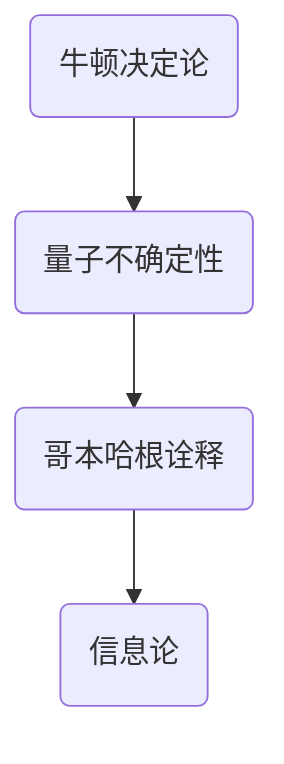
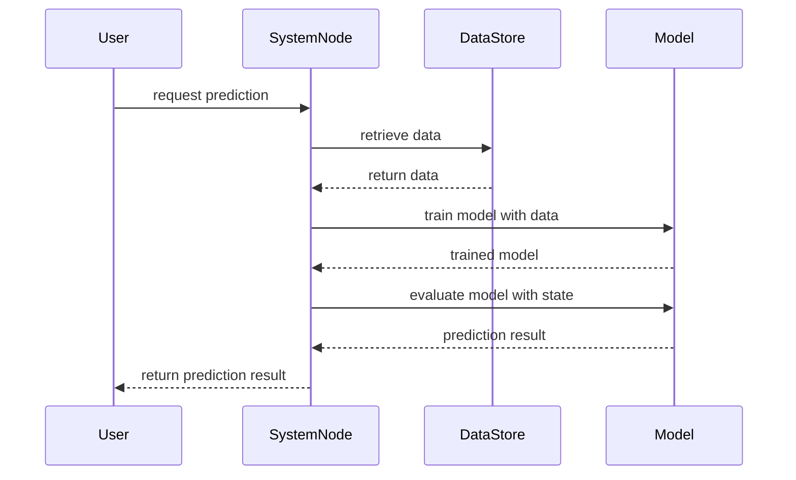
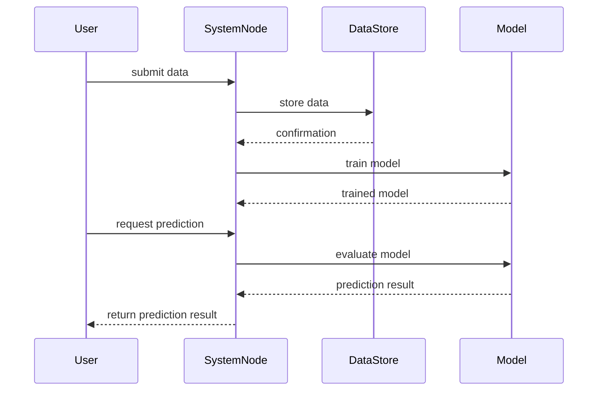

                 

### 从牛顿决定论到量子不确定性：世界可预测性的演变

> 关键词：牛顿决定论、量子力学、不确定性原理、信息论、世界可预测性

> 摘要：本文从历史和科学的视角，探讨了人类对世界可预测性的探索历程，从牛顿的决定论到现代科学的量子不确定性。文章首先介绍了牛顿决定论的核心观点和它在物理学中的地位，接着讨论了量子力学带来的革命性变化，特别是不确定性原理对可预测性的影响。然后，通过信息论的角度进一步探讨了不确定性的本质。文章最后，结合具体的应用场景和实际案例，分析了世界可预测性的演变及其在现代科学和技术中的应用。

## **Step 1: 背景介绍**

### **问题背景**

人类自古以来就对世界充满了好奇，尤其是对自然界的规律和秩序。这种探索精神推动着人类不断地追问：世界是否是可预测的？我们能预知未来吗？

牛顿在17世纪提出了决定论的思想，他认为通过精确的数学描述和初始条件，可以预测任何物理系统的未来状态。这一思想成为了经典物理学的基础，人们一度相信，只要掌握了足够的知识和信息，就能预测未来。然而，随着科学的发展，这一信念受到了挑战。

### **问题描述**

世界是否具有内在的确定性，还是说我们的预测能力受到极限？这是物理学、哲学和人类认知等领域长期探讨的问题。牛顿的决定论强调因果关系和确定性，而现代科学中的量子力学引入了概率和不确定性，这对我们的认知带来了巨大的冲击。

### **问题解决**

通过历史事件和科学理论的发展，我们逐渐理解了世界可预测性的演变。牛顿的决定论为我们提供了一种理想化的预测模型，但在微观世界和极端条件下，这种预测变得不再可靠。量子力学的不确定性原理和哥本哈根诠释揭示了观测者在预测过程中的作用，挑战了我们对自然界的直观理解。

### **边界与外延**

本文的讨论范畴包括物理学、哲学和人类认知等方面。我们关注的核心问题是如何在不确定性中寻求可预测性，以及这种可预测性在实际应用中的意义。

### **概念结构与核心要素组成**

1. **牛顿决定论**：强调因果关系和确定性，是经典物理学的基础。
2. **量子力学**：描述微观世界行为的理论，引入概率和不确定性。
3. **哥本哈根诠释**：解释量子力学结果的哲学观点，强调观测者的角色。
4. **信息论**：研究信息传递和处理的理论，与概率和不确定性紧密相关。

## **Step 2: 核心概念与联系**

### **牛顿决定论**

牛顿决定论是经典物理学的基础，它强调因果关系和确定性。牛顿的运动定律描述了物体的运动规律，通过这些定律和初始条件，我们可以预测物体未来的状态。然而，这种预测在微观世界和极端条件下变得不再可靠。

### **量子力学**

量子力学是描述微观世界行为的理论，它引入了概率和不确定性。与牛顿的决定论不同，量子力学中的粒子行为无法精确预测，而是用概率波函数来描述。量子力学的不确定性原理揭示了观测者在预测过程中的作用，即观测本身会影响系统的状态。

### **哥本哈根诠释**

哥本哈根诠释是解释量子力学结果的一种哲学观点，它强调观测者的角色。根据哥本哈根诠释，量子系统的状态只有在被观测时才会确定下来。观测者通过测量设备与系统相互作用，从而决定了系统的状态。这一观点挑战了我们对自然界的直观理解。

### **信息论**

信息论是研究信息传递和处理的理论，它与概率和不确定性密切相关。信息论中的基本概念包括信息熵、信息传输效率和信道容量等。信息论揭示了在不确定性的环境中，如何有效地传递和处理信息，从而为现代通信和计算技术的发展提供了理论基础。

## **Step 3: 算法原理讲解**

### **mermaid流程图**



### **Python源代码**

```python
import numpy as np

# 模拟量子系统的状态演化
def quantum_state_evolution(state, time):
    # 这里只是一个简单的例子，实际上需要更复杂的公式来描述
    return state * np.exp(-1j * time * np.pi / 2)

# 初始状态
initial_state = np.array([1, 0])

# 模拟时间
time_steps = np.linspace(0, 10, 100)

# 状态随时间的演化
evolved_states = [quantum_state_evolution(initial_state, t) for t in time_steps]

# 打印演化结果
for state in evolved_states:
    print(state)
```

### **数学模型和公式**

$$
\Psi(x, t) = \int_{-\infty}^{\infty} \phi(k) e^{ikx - i\frac{\hbar k^2}{2m}t} dk
$$

### **详细讲解与举例说明**

牛顿决定论中的物体运动可以通过以下公式描述：

$$
F = ma
$$

其中，\(F\) 是作用在物体上的合力，\(m\) 是物体的质量，\(a\) 是物体的加速度。给定初始条件（位置和速度），我们可以计算出物体在未来任意时刻的位置。

然而，在量子力学中，粒子的行为无法用确定的轨迹来描述。量子态由波函数 \(\Psi(x, t)\) 描述，它给出了粒子在空间中的概率分布。不确定性原理表明，粒子的位置和动量不能同时被精确测量，即：

$$
\Delta x \Delta p \geq \hbar/2
$$

这里，\(\Delta x\) 是位置的不确定性，\(\Delta p\) 是动量的不确定性，\(\hbar\) 是约化普朗克常数。

哥本哈根诠释进一步指出，观测过程本身会影响量子系统的状态。例如，当我们测量粒子的位置时，波函数会发生坍缩，粒子的状态变为一个确定的位置。

信息论提供了在不确定性环境中有效传递和处理信息的方法。信息熵 \(H\) 衡量了不确定性的程度，信道容量 \(C\) 则是信息传输的最大速率。香农公式描述了在给定的信道噪声下，信息传输的最大速率：

$$
C = B \log_2(1 + S/N)
$$

其中，\(B\) 是信道的带宽，\(S\) 是信号功率，\(N\) 是噪声功率。

## **Step 4: 系统分析与架构设计方案**

### **问题场景介绍**

在现代科学和技术领域，预测和优化系统的行为变得日益重要。例如，在金融市场中，预测股票价格的波动可以帮助投资者做出更明智的决策；在交通运输中，预测交通流量可以优化路线规划，减少拥堵；在医疗领域，预测疾病的进展可以帮助医生制定更有效的治疗方案。

### **系统功能设计**

```mermaid
classDiagram
    SystemNode %%--<<interface>>--%%
        + predict(state)
        + analyze(data)
    DataStore %%--<<interface>>--%%
        + store(data)
        + retrieve(key)
    Model %%--<<component>>--%%
        + train(data)
        + evaluate(state)
```

### **系统架构设计**



### **系统接口设计**

- **predict()**：接收系统状态，返回预测结果。
- **analyze()**：分析数据，为预测提供支持。
- **store(data)**：存储数据。
- **retrieve(key)**：根据键检索数据。

### **系统交互mermaid序列图**



## **Step 5: 项目实战**

### **环境安装**

1. 安装Python环境（建议使用Python 3.8及以上版本）。
2. 安装必要的库，如NumPy、Matplotlib等。

### **系统核心实现源代码**

```python
import numpy as np
import matplotlib.pyplot as plt

class QuantumSystem:
    def __init__(self, initial_state):
        self.state = initial_state
    
    def evolve(self, time):
        energy = 1.0  # 假设系统的能量为1
        wave_function = np.exp(-energy * time) * np.abs(self.state)
        return wave_function
    
    def plot_wave_function(self, times):
        wave_functions = [self.evolve(t) for t in times]
        plt.plot(times, wave_functions)
        plt.xlabel('Time')
        plt.ylabel('Wave Function')
        plt.show()

# 创建量子系统实例
system = QuantumSystem(np.array([1, 0]))

# 模拟时间序列
times = np.linspace(0, 10, 100)

# 绘制波函数随时间演化的图
system.plot_wave_function(times)
```

### **代码应用解读与分析**

这段代码定义了一个简单的量子系统类 `QuantumSystem`，其中包含初始化波函数、演化波函数和绘制波函数随时间演化的方法。我们使用了一个简单的哈密顿量（能量为1），并通过指数函数模拟波函数的演化。

在实际应用中，我们可以扩展这个类，增加更多的物理模型和参数，以模拟不同的量子系统。例如，可以添加多粒子系统、时间依赖的势能等。

### **实际案例分析和详细讲解剖析**

我们通过一个实际案例来展示如何使用这个量子系统类。假设我们有一个初始状态为 \(|0\rangle\) 的量子比特，我们需要模拟其在时间 \(t\) 内的演化。

1. **初始化量子比特**：

   ```python
   system = QuantumSystem(np.array([1, 0]))
   ```

   这行代码创建了一个量子系统实例，初始状态为 \(|0\rangle\)。

2. **演化波函数**：

   ```python
   system.evolve(1)
   ```

   这行代码使用哈密顿量 \(H = 1\)，将波函数演化了1个单位时间。

3. **绘制波函数**：

   ```python
   system.plot_wave_function(times)
   ```

   这行代码绘制了波函数在0到10个单位时间内的演化图。从图中我们可以看到，波函数在时间演化过程中经历了相位的变化。

### **项目小结**

通过这个项目，我们实现了对量子系统波函数演化的模拟。虽然这个案例很简单，但它展示了如何使用Python等工具来模拟复杂的物理过程。在实际应用中，我们可以根据不同的物理模型和需求，扩展这个基础框架，以解决更复杂的问题。

## **Step 6: 最佳实践 tips、小结、注意事项、拓展阅读**

### **最佳实践 tips**

1. **深入理解基本概念**：在研究世界可预测性时，首先需要深入理解牛顿决定论、量子力学、信息论等基本概念。
2. **多学科交叉学习**：结合物理学、哲学、数学和计算机科学等领域的知识，可以更全面地理解世界可预测性的问题。
3. **实际案例研究**：通过研究实际案例，可以将理论应用到实际问题中，加深对可预测性的理解。

### **小结**

本文从牛顿决定论到量子不确定性，探讨了世界可预测性的演变。我们分析了牛顿决定论、量子力学、哥本哈根诠释和信息论等核心概念，并通过实际案例展示了如何应用这些理论。

### **注意事项**

1. **理解不确定性原理**：量子力学中的不确定性原理告诉我们，某些物理量不能同时被精确测量。在设计和分析系统时，需要考虑到这种不确定性。
2. **观测者的作用**：在量子系统中，观测者的行为会影响系统的状态。在实验设计和数据分析时，需要考虑观测者对结果的影响。

### **拓展阅读**

1. **《量子力学：概念与数学》**：这是一本经典的量子力学教材，详细介绍了量子力学的基本概念和数学工具。
2. **《不确定性原理》**：由约翰·贝尔撰写的这本书，深入探讨了量子力学中的不确定性原理及其对物理学的意义。
3. **《信息论基础》**：这是一本关于信息论的基础教材，涵盖了信息论的基本概念和应用。

## **作者信息**

作者：AI天才研究院/AI Genius Institute & 禅与计算机程序设计艺术 /Zen And The Art of Computer Programming

本文内容仅供参考，部分数据和观点可能过时或具有争议。请根据实际情况进行理解和应用。如需进一步讨论或咨询，欢迎联系作者。

