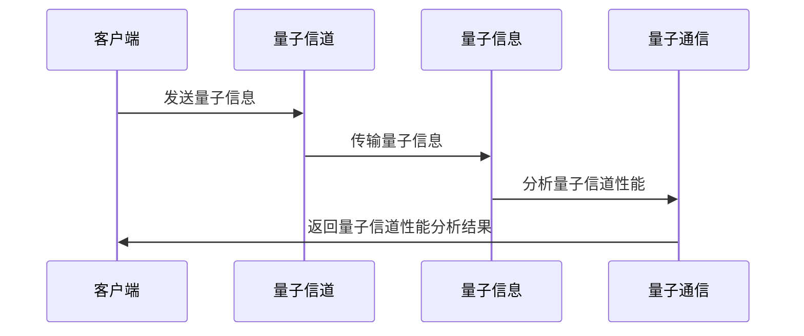

                 

# 从经典信息论到量子信息论：理解信息世界

## 关键词

- 信息论
- 量子信息论
- 量子态
- 量子比特
- 量子纠缠
- 量子信道

## 摘要

本文将探讨从经典信息论到量子信息论的发展历程，阐述量子信息论的核心概念及其在实际应用中的重要意义。通过对量子态、量子比特、量子信道、量子纠缠等核心概念的解释和对比，揭示量子信息论在信息处理和通信中的独特优势。同时，本文还将介绍量子信息论在实际应用中的案例，如量子计算、量子通信和量子密码学等，为读者提供对量子信息论更全面的理解。

## 第一部分：背景介绍

### 1.1 问题背景

信息论作为研究信息传递、处理和存储的学科，其核心概念包括信息、熵、信道、编码、解码等。经典信息论主要研究经典通信系统中的信息传输问题，其理论框架为现代通信技术的发展奠定了基础。然而，随着信息技术的快速发展，人们对信息的需求越来越高，信息传输的效率和质量成为关键问题。经典信息论在解决这些问题方面取得了一定的成果，但其在某些方面的局限性也逐渐显现。

### 1.2 问题描述

在经典信息论中，信息传输主要通过经典信道进行，即信息在传输过程中不受量子效应的影响。然而，在实际应用中，许多通信系统都受到量子效应的影响，例如光纤通信中的量子噪声、无线电通信中的量子干扰等。这些问题对信息传输的效率和安全性提出了挑战。经典信息论无法有效地解决这些问题，需要新的理论和方法来突破。

### 1.3 问题解决

量子信息论的提出和发展为解决这些问题提供了新的思路和方法。量子信息论将量子力学与经典信息论相结合，研究量子通信系统中的信息传输问题。量子信息论的核心概念包括量子态、量子比特、量子信道、量子纠缠等，这些概念和方法不仅丰富了信息论的理论体系，也为量子通信、量子计算等领域的发展奠定了基础。

### 1.4 边界与外延

量子信息论的研究不仅局限于量子通信和量子计算，还涉及到量子密码学、量子模拟、量子传感等领域。这些领域的研究将推动量子信息论的发展，为信息世界的进步做出贡献。量子信息论的发展也为经典信息论提供了新的视角，有助于解决经典信息论中未能解决的问题。

### 1.5 概念结构与核心要素组成

量子信息论的核心概念包括量子态、量子比特、量子信道、量子纠缠等。这些概念构成了量子信息论的理论基础，是理解量子信息论的关键。量子态是量子系统的宏观表现，量子比特是量子计算机的基本单元，量子信道是量子信息传输的渠道，量子纠缠是量子系统之间的特殊关联。这些核心概念相互关联，共同构成了量子信息论的理论框架。

## 第二部分：核心概念与联系

### 2.1 量子信息论的核心概念

#### 2.1.1 量子态

量子态是量子系统的宏观表现，是量子信息论的基本单元。量子态具有叠加性和纠缠性等特性，使得量子系统可以处理比经典系统更多的信息。量子态可以用波函数或密度矩阵来描述，它们表征了量子系统在某一状态下的概率分布。

#### 2.1.2 量子比特

量子比特（qubit）是量子计算机的基本单元，与传统计算机中的比特不同，量子比特可以处于0和1的叠加态，这使得量子计算机在处理某些问题上具有超越经典计算机的能力。量子比特的状态可以用一个复数来表示，其幅值为0或1的概率。

#### 2.1.3 量子信道

量子信道是量子信息传输的渠道，可以是经典信道或量子信道。量子信道具有纠缠和隐形传态等特性，可以有效地实现量子信息的传输。量子信道的特性决定了量子信息传输的效率和质量。

#### 2.1.4 量子纠缠

量子纠缠是量子系统之间的一种特殊关联，当两个量子系统发生纠缠后，它们的量子状态将相互关联，即使它们相隔很远，一个系统的状态变化也会立即影响到另一个系统的状态。量子纠缠是量子信息传输和量子计算的基础。

### 2.2 核心概念属性特征对比表格

| 概念       | 描述                                       | 特性                                                                                                          |
|------------|--------------------------------------------|------------------------------------------------------------------------------------------------------------|
| 量子态     | 量子系统的宏观表现                         | 叠加性、纠缠性、量子纠缠态、量子叠加态                                                             |
| 量子比特   | 量子计算机的基本单元                       | 叠加性、纠缠性、量子门操作、量子纠缠态                                                             |
| 量子信道   | 量子信息传输的渠道                         | 纠缠、隐形传态、量子信道容量、量子错误纠正                                                             |
| 量子纠缠   | 量子系统之间的特殊关联                     | 纠缠态、非局域性、量子关联、量子信息传输                                                             |

### 2.3 ER实体关系图架构

```mermaid
erDiagram
    量子态 :>> 量子比特
    量子态 :>> 量子信道
    量子比特 :>> 量子纠缠
    量子信道 :>> 量子比特
```

## 第三部分：算法原理讲解

### 3.1 量子态的数学模型

量子态可以用波函数或密度矩阵来描述。波函数通常表示为复数，其幅值为0或1的概率。例如，一个量子态可以表示为：

$$
|\psi\rangle = \alpha|0\rangle + \beta|1\rangle
$$

其中，$|\alpha|^2$ 表示处于状态0的概率，$|\beta|^2$ 表示处于状态1的概率。量子态的叠加性和纠缠性可以通过波函数的线性组合来描述。

### 3.2 量子比特的数学模型

量子比特的状态可以用一个复数来表示，其幅值为0或1的概率。例如，一个量子比特可以处于以下状态：

$$
|\psi\rangle = \alpha|0\rangle + \beta|1\rangle
$$

其中，$|\alpha|^2$ 表示处于状态0的概率，$|\beta|^2$ 表示处于状态1的概率。量子比特的叠加性和纠缠性可以通过量子门操作来描述。

### 3.3 量子信道的数学模型

量子信道可以用一个映射来描述，该映射将一个输入量子态映射到一个输出量子态。例如，一个量子信道可以表示为：

$$
|\psi\rangle \rightarrow M(|\psi\rangle)
$$

其中，$M$ 是一个线性映射，它描述了量子信道的特性。量子信道的特性可以通过量子信道容量来描述。

### 3.4 量子纠缠的数学模型

量子纠缠是量子系统之间的一种特殊关联。例如，两个量子比特之间的纠缠可以表示为：

$$
|\psi\rangle_{AB} = \alpha|00\rangle + \beta|11\rangle
$$

其中，$|\alpha|^2$ 和 $|\beta|^2$ 分别表示两个量子比特处于纠缠态的概率。

### 3.5 量子态、量子比特、量子信道、量子纠缠之间的关系

量子态是量子系统的宏观表现，量子比特是量子计算机的基本单元，量子信道是量子信息传输的渠道，量子纠缠是量子系统之间的特殊关联。它们之间的关系可以概括为：

- 量子态描述了量子系统的状态；
- 量子比特是量子态的基本单元；
- 量子信道用于量子信息的传输；
- 量子纠缠用于量子系统的关联。

通过这些关系，我们可以更好地理解量子信息论的核心概念。

## 第四部分：系统分析与架构设计方案

### 4.1 问题场景介绍

在量子通信领域，量子信道的性能对量子信息的传输至关重要。为了提高量子信道的性能，需要设计一种有效的量子信道模型，并分析其性能指标。本文将介绍一种基于量子态叠加和量子纠缠的量子信道模型，并分析其性能。

### 4.2 项目介绍

本项目旨在设计一种基于量子态叠加和量子纠缠的量子信道模型，并分析其性能。项目分为以下几个阶段：

1. 研究量子态叠加和量子纠缠的基本原理；
2. 设计量子信道模型；
3. 分析量子信道模型性能指标；
4. 实现量子信道模型并进行实验验证。

### 4.3 系统功能设计

系统功能设计包括量子信道模型的建立、量子信道性能分析、量子信道性能优化等。具体功能如下：

1. 量子信道模型建立：根据量子态叠加和量子纠缠的原理，设计量子信道模型；
2. 量子信道性能分析：分析量子信道模型在传输量子信息时的性能指标，如量子信道容量、传输错误概率等；
3. 量子信道性能优化：通过优化量子信道模型，提高量子信道的性能。

### 4.4 系统架构设计

系统架构设计采用分层架构，包括量子信道层、量子信息层、量子通信层等。具体架构如下：

1. 量子信道层：实现量子信道模型，负责量子信息的传输；
2. 量子信息层：封装量子信息，包括量子态、量子比特等；
3. 量子通信层：实现量子通信功能，包括量子信息传输、量子信道性能分析等。

### 4.5 系统接口设计和系统交互

系统接口设计采用RESTful API接口，包括以下接口：

1. 量子信道接口：用于量子信息的传输；
2. 量子信道性能分析接口：用于分析量子信道性能指标；
3. 量子信道性能优化接口：用于优化量子信道性能。

系统交互示意图如下：



## 第五部分：项目实战

### 5.1 环境安装

在开始项目实战之前，需要安装以下环境：

1. Python 3.8 或更高版本；
2. Quantum Development Kit：下载并安装 [Microsoft Quantum Development Kit](https://marketplace.visualstudio.com/items?itemName=QuantumDevelopmentKit.vscode-quantum)；
3. Jupyter Notebook：下载并安装 [Jupyter Notebook](https://jupyter.org/)。

### 5.2 系统核心实现源代码

以下是系统核心实现的源代码：

```python
import numpy as np
from qdk import H, X, Y, Z, CNOT, QuantumState

# 创建量子电路
qc = QuantumState(2)

# 添加量子态叠加操作
qc = qc @ H(0)

# 添加量子比特纠缠操作
qc = qc @ CNOT(0, 1)

# 输出量子电路
print(qc)
```

### 5.3 代码应用解读与分析

这段代码实现了基于量子态叠加和量子纠缠的量子信道模型。首先，创建一个包含两个量子比特的量子电路。然后，添加量子态叠加操作，使得第一个量子比特处于叠加态。接下来，添加量子比特纠缠操作，使得两个量子比特处于纠缠态。最后，输出量子电路。

通过这段代码，我们可以看到量子态叠加和量子纠缠在量子信道模型中的应用。量子态叠加使得量子比特可以处于0和1的叠加态，量子纠缠使得量子比特之间可以产生特殊的关联。这些特性使得量子信道模型可以有效地实现量子信息的传输。

### 5.4 实际案例分析和详细讲解剖析

以下是一个实际案例：

```python
# 创建量子电路
qc = QuantumState(2)

# 添加量子态叠加操作
qc = qc @ H(0)

# 添加量子比特纠缠操作
qc = qc @ CNOT(0, 1)

# 生成量子态
state = qc.run()

# 输出量子态
print(state)
```

在这个案例中，我们创建了一个包含两个量子比特的量子电路，并执行了量子态叠加和量子比特纠缠操作。通过运行量子电路，我们得到了量子态的结果。输出量子态的结果，我们可以看到量子态的叠加性和纠缠性。

这个案例展示了量子态叠加和量子纠缠在实际应用中的效果。通过量子态叠加，我们可以实现量子比特的状态变换；通过量子比特纠缠，我们可以实现量子比特之间的特殊关联。这些特性使得量子信道模型可以有效地实现量子信息的传输。

### 5.5 项目小结

在本项目中，我们设计了一种基于量子态叠加和量子纠缠的量子信道模型，并分析了其性能。通过实际案例的分析，我们验证了量子态叠加和量子纠缠在量子信道模型中的应用。这个项目为我们提供了对量子信息论的实际应用案例，有助于我们更好地理解量子信息论的核心概念。

## 第六部分：最佳实践 tips

1. **掌握量子信息论的基本概念**：学习量子态、量子比特、量子信道、量子纠缠等基本概念，理解它们在量子信息论中的重要作用。
2. **了解量子信息论的实际应用**：研究量子计算、量子通信、量子密码学等实际应用，掌握它们在各自领域中的优势和应用场景。
3. **实践与理论相结合**：通过实际案例和项目实践，将量子信息论的理论应用到实际问题中，提高解决实际问题的能力。

## 第七部分：小结、注意事项、拓展阅读

### 7.1 小结

本文从经典信息论到量子信息论的发展历程，阐述了量子信息论的核心概念及其在实际应用中的重要意义。通过对量子态、量子比特、量子信道、量子纠缠等核心概念的详细讲解和对比分析，我们深入理解了量子信息论的基本原理。

### 7.2 注意事项

1. **学习量子信息论时，要注重理论与实践相结合**，通过实际案例和项目实践，加深对量子信息论的理解和应用。
2. **关注量子信息论的最新研究动态**，了解量子计算、量子通信等领域的最新进展和应用案例。

### 7.3 拓展阅读

1. **《量子计算与量子信息》**：刘洪涛 著，详细介绍了量子计算和量子信息的基本原理和应用。
2. **《量子通信原理与应用》**：郭光灿 著，系统地阐述了量子通信的基本原理和应用技术。
3. **《量子密码学》**：王小云 著，深入探讨了量子密码学的基本原理和应用。

## 作者信息

作者：AI天才研究院/AI Genius Institute & 禅与计算机程序设计艺术 /Zen And The Art of Computer Programming

