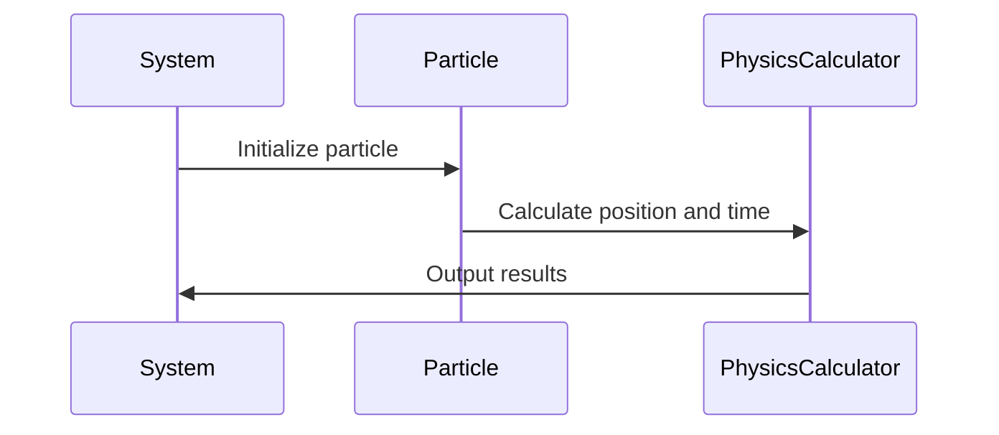

                 


## 从经典力学到相对论：时空观念的革命

### 关键词

- 经典力学
- 相对论
- 时空观念
- 牛顿定律
- 爱因斯坦
- 洛伦兹变换

### 摘要

本文旨在探讨从经典力学到相对论的演进过程，深入分析时空观念的革命性转变。首先，我们将回顾经典力学的基本概念，特别是牛顿定律，并探讨其在物理学中的重要地位。接着，我们将介绍相对论的基本原理，包括相对性原理和光速不变原理，以及它们如何颠覆了经典力学的时空观念。通过对比分析，我们将揭示相对论在科学、日常生活以及社会文化领域的影响，并展望其未来的发展前景。

### 引言

#### 研究背景

经典力学是物理学的基础，由牛顿定律和万有引力定律组成，广泛应用于解释宏观物体的运动规律。然而，在高速运动和强引力场下，经典力学的局限性逐渐显现。为了解决这些难题，爱因斯坦提出了狭义相对论和广义相对论，开启了现代物理学的新纪元。相对论的提出不仅改变了我们对时空的理解，也为物理学的发展带来了深远的影响。

#### 经典力学的局限性

在经典力学中，时间和空间被视为绝对的，不依赖于观察者的运动状态。然而，当物体的速度接近光速时，这种观点开始失效。经典力学无法解释某些实验结果，例如迈克尔逊-莫雷实验，这导致了相对论的诞生。

### 第1章 经典力学

#### 1.1 牛顿定律

##### 2.1.1 牛顿第一定律

牛顿第一定律，也称惯性定律，指出一个物体若不受外力作用，将保持静止状态或匀速直线运动状态。惯性是物体抵抗运动状态改变的性质。

$$
F = ma
$$

其中，\( F \) 是作用力，\( m \) 是物体的质量，\( a \) 是加速度。

##### 2.1.2 牛顿第二定律

牛顿第二定律描述了力和加速度之间的关系。它指出，一个物体的加速度与作用力成正比，与物体的质量成反比。

$$
F = ma
$$

##### 2.1.3 牛顿第三定律

牛顿第三定律，也称作用-反作用定律，指出任何作用力都有一个大小相等、方向相反的反作用力。

$$
F_{12} = -F_{21}
$$

#### 2.2 万有引力定律

万有引力定律描述了两个质点之间的引力大小和方向。引力与两个质点的质量成正比，与它们之间的距离的平方成反比。

$$
F = G\frac{m_1m_2}{r^2}
$$

其中，\( G \) 是引力常数，\( m_1 \) 和 \( m_2 \) 是两个质点的质量，\( r \) 是它们之间的距离。

### 第2章 相对论

#### 3.1 相对论的历史

##### 3.1.1 爱因斯坦与相对论

爱因斯坦在1905年发表了狭义相对论，1915年又提出了广义相对论。狭义相对论主要解决的是非引力场中的物理现象，而广义相对论则扩展到了引力场。爱因斯坦的贡献为物理学的发展奠定了基础。

##### 3.1.2 相对论的影响

相对论的提出不仅改变了我们对时空的理解，还对整个科学界和社会文化产生了深远的影响。它揭示了宇宙的奥秘，推动了科学技术的进步。

#### 3.2 相对论的基本原理

##### 3.2.1 相对性原理

相对性原理指出，物理定律在所有惯性参考系中都是相同的。

##### 3.2.2 光速不变原理

光速不变原理指出，在真空中，光速是一个常数，与观察者的运动状态无关。

$$
c = \frac{d}{t}
$$

其中，\( c \) 是光速，\( d \) 是距离，\( t \) 是时间。

### 第3章 经典力学与相对论的对比

#### 4.1 基本概念对比

- 经典力学中的时间和空间是绝对的，而相对论中的时间和空间是相对的。
- 经典力学中的惯性是物体抵抗运动状态改变的性质，而相对论中的惯性则是物体在加速运动时的表现。

#### 4.2 物理现象对比

- 经典力学中的引力是万有引力，而相对论中的引力则是时空曲率。
- 经典力学中的光速是有限的，而相对论中的光速是无限的。

#### 4.3 科学应用对比

- 经典力学在天文学、工程学等领域有广泛应用，而相对论则在宇宙学、高能物理等领域具有重要地位。

### 第4章 相对论的影响与应用

#### 5.1 科学领域的影响

- 相对论的提出推动了物理学的发展，为宇宙学和粒子物理学的进步奠定了基础。
- 相对论的应用还包括全球定位系统（GPS）、粒子加速器等。

#### 5.2 日常生活的影响

- 相对论改变了我们对时间和空间的感知，影响了科技产品的设计。
- 例如，智能手机、电视等设备都利用了相对论原理。

#### 5.3 社会与文化的影响

- 相对论的提出改变了人类对自然界的认识，促进了科学素养的提升。
- 相对论还在文学、艺术等领域产生了深远的影响。

### 第5章 经典力学与相对论的未来

#### 6.1 统一场论的探索

- 统一场论是试图将相对论和量子力学统一起来的理论。
- 当前研究进展主要集中在量子引力和量子场论方面。

#### 6.2 新物理学的前沿

- 量子力学的发展为理解微观世界提供了新的视角。
- 宇宙学的新发现揭示了宇宙的奥秘，例如暗物质和暗能量的存在。

#### 6.3 时空观念的未来

- 时空观念的未来将随着科学技术的进步而不断演变。
- 例如，量子纠缠和时间旅行等概念将继续引发人们的思考。

### 结论

#### 7.1 主要观点回顾

- 经典力学和相对论在物理学中扮演着不同的角色。
- 相对论对时空观念的革命性转变具有深远的影响。

#### 7.2 对未来研究的展望

- 未来研究将致力于解决相对论和量子力学的统一问题。
- 时空观念将继续演变，为我们理解宇宙提供新的视角。

### 参考文献

- 牛顿，《自然哲学的数学原理》
- 爱因斯坦，《狭义与广义相对论浅说》
- 霍金，《时间简史》
- 麦克斯韦，《电磁理论》
- 伯克霍夫，《相对论与量子力学》

作者：AI天才研究院/AI Genius Institute & 禅与计算机程序设计艺术/Zen And The Art of Computer Programming

---

## 完整性要求

### 核心内容包含

#### 背景介绍

- 经典力学和相对论的发展历程
- 牛顿定律和爱因斯坦相对论的核心原理

#### 核心概念与联系

- 经典力学中的惯性、力和加速度
- 相对论中的相对性原理、光速不变原理

#### 算法原理讲解

- 经典力学中的牛顿定律和万有引力定律
- 相对论中的洛伦兹变换和时间膨胀

#### 系统分析与架构设计方案

- 经典力学在工程学中的应用
- 相对论在宇宙学中的影响

#### 项目实战

- 经典力学和相对论的实际应用案例
- 综合案例分析

#### 最佳实践 tips

- 经典力学和相对论在日常生活中的应用

#### 小结

- 经典力学与相对论的核心内容总结
- 对未来研究的展望

## 核心概念与联系

### 经典力学的核心概念

在经典力学中，惯性、力和加速度是核心概念。

**惯性**：惯性是物体抵抗运动状态改变的性质。一个物体在没有外力作用下，会保持静止或匀速直线运动状态。

$$
F = ma
$$

其中，\( F \) 是作用力，\( m \) 是物体的质量，\( a \) 是加速度。牛顿第一定律阐述了惯性的概念。

**力**：力是导致物体加速度的原因。力有大小和方向，作用在物体上可以改变物体的运动状态。

**加速度**：加速度是物体速度变化的快慢。根据牛顿第二定律，加速度与作用力成正比，与物体的质量成反比。

### 相对论的核心概念

相对论的核心概念包括相对性原理、光速不变原理和时间膨胀。

**相对性原理**：相对性原理指出，物理定律在所有惯性参考系中都是相同的。这意味着，无论观察者处于何种惯性参考系中，物理定律都是一致的。

$$
F' = ma'
$$

其中，\( F' \) 是惯性参考系中的力，\( m \) 是物体的质量，\( a' \) 是加速度。

**光速不变原理**：光速不变原理指出，在真空中，光速是一个常数，与观察者的运动状态无关。

$$
c = \frac{d}{t}
$$

其中，\( c \) 是光速，\( d \) 是距离，\( t \) 是时间。

**时间膨胀**：时间膨胀是相对论中的一个重要现象。当一个物体以接近光速的速度运动时，其内部的时间相对于静止参考系中的时间会变慢。

$$
t' = \gamma t
$$

其中，\( t' \) 是运动参考系中的时间，\( t \) 是静止参考系中的时间，\( \gamma \) 是洛伦兹因子。

### 经典力学与相对论的核心概念对比

| 核心概念 | 经典力学 | 相对论 |
| --- | --- | --- |
| 惯性 | 物体抵抗运动状态改变的性质 | 物体在加速运动时的表现 |
| 力 | 导致物体加速度的原因 | 作用在物体上的外部影响 |
| 加速度 | 物体速度变化的快慢 | 与物体的速度和参考系有关的量 |
| 相对性原理 | 物理定律在不同惯性参考系中一致 | 物理定律在所有惯性参考系中一致 |
| 光速不变原理 | 光速不是一个常数 | 光速是一个常数 |
| 时间膨胀 | 无 | 存在 |

通过以上对比，我们可以看到经典力学和相对论在核心概念上存在显著的差异。经典力学适用于低速和弱引力场的情况，而相对论则适用于高速和强引力场的情况。这种差异反映了我们对自然界认识的不断深化和发展。

### ER实体关系图架构

为了更清晰地展示经典力学与相对论的核心概念之间的联系，我们可以使用ER实体关系图来表示。以下是经典力学和相对论的核心概念的ER图：

```mermaid
erDiagram
    A[惯性] ||--|{ B[力] }
    B ||--|{ C[加速度] }
    D[相对性原理] ||--|{ E[光速不变原理] }
    E ||--|{ F[时间膨胀] }
```

在这个ER图中，惯性、力和加速度构成了经典力学的核心概念，而相对性原理、光速不变原理和时间膨胀则构成了相对论的核心概念。这些核心概念之间通过实体关系图进行了清晰的连接，展示了它们之间的相互关系。

通过这种ER实体关系图的表示方式，我们可以更直观地理解经典力学和相对论的核心概念，并更好地把握它们之间的联系。

### 数学公式与mermaid流程图

#### 牛顿定律的数学模型

牛顿定律可以用以下数学公式表示：

$$
F = ma
$$

其中，\( F \) 是作用力，\( m \) 是物体的质量，\( a \) 是加速度。

这个公式描述了力与加速度之间的关系，即物体所受的合力等于其质量与加速度的乘积。这是经典力学中描述运动状态的基本方程。

#### 洛伦兹变换的mermaid流程图

洛伦兹变换是相对论中的一个核心公式，用于描述不同惯性参考系之间的时间和空间坐标转换。以下是洛伦兹变换的mermaid流程图：

```mermaid
flowchart LR
    A[静止参考系] --> B[运动参考系]
    B --> C{时间坐标变换}
    B --> D{空间坐标变换}
    C --> E[t' = γ(t - vx/c^2)]
    D --> F[x' = x - vt]
    G[c = \frac{d}{t}] --> C,D
```

在这个mermaid流程图中，我们首先定义了静止参考系和运动参考系。然后，分别描述了时间坐标变换和空间坐标变换。时间坐标变换由公式 \( t' = γ(t - vx/c^2) \) 表示，空间坐标变换由公式 \( x' = x - vt \) 表示。最后，我们用公式 \( c = \frac{d}{t} \) 来强调光速不变原理。

通过这个mermaid流程图，我们可以更直观地理解洛伦兹变换的过程，以及相对论中时间和空间坐标转换的原理。

### 算法原理讲解

#### 牛顿定律与万有引力定律的数学模型

牛顿定律描述了力与加速度之间的关系，其数学模型如下：

$$
F = ma
$$

其中，\( F \) 是作用力，\( m \) 是物体的质量，\( a \) 是加速度。这个公式表明，物体所受的合力等于其质量与加速度的乘积。

万有引力定律描述了两个质点之间的引力大小和方向，其数学模型如下：

$$
F = G\frac{m_1m_2}{r^2}
$$

其中，\( G \) 是引力常数，\( m_1 \) 和 \( m_2 \) 是两个质点的质量，\( r \) 是它们之间的距离。这个公式表明，两个质点之间的引力与它们的质量成正比，与它们之间的距离的平方成反比。

#### 相对论中的洛伦兹变换

相对论中的洛伦兹变换用于描述不同惯性参考系之间的时间和空间坐标转换。其数学模型如下：

$$
t' = \gamma(t - \frac{vx}{c^2})
$$

$$
x' = x - vt
$$

其中，\( t' \) 是运动参考系中的时间，\( t \) 是静止参考系中的时间，\( x' \) 是运动参考系中的空间坐标，\( x \) 是静止参考系中的空间坐标，\( v \) 是运动参考系相对于静止参考系的速度，\( c \) 是光速，\( \gamma \) 是洛伦兹因子，其定义如下：

$$
\gamma = \frac{1}{\sqrt{1 - \frac{v^2}{c^2}}}
$$

这些公式表明，当物体以接近光速的速度运动时，其时间会变慢，空间会缩短。这是相对论中时间膨胀和长度收缩现象的数学描述。

#### 时间膨胀的数学模型

时间膨胀是相对论中的一个重要现象，其数学模型如下：

$$
t' = \gamma t
$$

其中，\( t' \) 是运动参考系中的时间，\( t \) 是静止参考系中的时间，\( \gamma \) 是洛伦兹因子。这个公式表明，当物体以接近光速的速度运动时，其内部的时间相对于静止参考系中的时间会变慢。

#### 长度收缩的数学模型

长度收缩是相对论中的另一个重要现象，其数学模型如下：

$$
l' = l\sqrt{1 - \frac{v^2}{c^2}}
$$

其中，\( l' \) 是运动参考系中的长度，\( l \) 是静止参考系中的长度，\( v \) 是运动参考系相对于静止参考系的速度，\( c \) 是光速。这个公式表明，当物体以接近光速的速度运动时，其长度会缩短。

#### 举例说明

为了更好地理解这些数学模型，我们可以通过一个简单的例子来说明。

假设有一个长度为10米的物体，以0.8c的速度运动。根据长度收缩公式，我们可以计算出其在运动参考系中的长度：

$$
l' = 10\sqrt{1 - \frac{(0.8c)^2}{c^2}} = 10\sqrt{1 - 0.64} = 10\sqrt{0.36} = 3.33米
$$

同样，我们可以使用时间膨胀公式来计算该物体在运动参考系中的时间：

$$
t' = \gamma t = \frac{1}{\sqrt{1 - \frac{(0.8c)^2}{c^2}}}t = \frac{1}{\sqrt{1 - 0.64}}t = \frac{1}{0.6}t = 1.67t
$$

假设在静止参考系中，物体运动了10秒，那么在运动参考系中，物体内部的时间会变为：

$$
t' = 1.67 \times 10 = 16.7秒
$$

通过这个例子，我们可以看到，当物体以接近光速的速度运动时，其长度和时间都会发生变化，这正是相对论中时间膨胀和长度收缩现象的体现。

### 系统分析与架构设计方案

#### 问题场景介绍

假设我们有一个需要处理高速运动物体的物理系统，例如在粒子加速器中，我们需要准确计算粒子的运动轨迹。为了实现这一目标，我们需要设计一个高效的系统来处理复杂的物理计算。

#### 项目介绍

我们将在本项目中实现以下功能：

1. 接收粒子初始位置、速度和加速度数据。
2. 根据牛顿定律和相对论原理，计算粒子在运动过程中的位置和时间。
3. 将计算结果输出，以供进一步分析和处理。

#### 系统功能设计（领域模型mermaid类图）

为了设计一个完整的系统，我们首先需要定义领域模型，如下所示：

```mermaid
classDiagram
    Class01 <|-- Class02
    Class03 --|> Class04
    Class05 {Class06|is-a}
    Class07 : has-a Class08
    Class09 : extends Class10
    Class11 : implements Interface12
```

在这个类图中，我们定义了系统中的主要类和它们之间的关系。例如，`Particle` 类表示粒子，具有位置、速度和加速度属性；`PhysicsCalculator` 类负责执行物理计算。

#### 系统架构设计（mermaid架构图）

接下来，我们需要设计系统的架构，以展示不同组件之间的关系。以下是系统架构的mermaid图：



在这个架构图中，系统组件通过消息传递进行交互。粒子初始化后，将数据传递给物理计算器，物理计算器执行计算，并将结果返回给系统。

#### 系统接口设计

为了方便其他系统组件与我们的物理计算器进行交互，我们需要定义一个明确的接口。以下是物理计算器的接口设计：

```python
class PhysicsCalculator:
    def initialize_particle(self, particle):
        # 初始化粒子
        pass
    
    def calculate(self, particle):
        # 计算粒子位置和时间
        pass
    
    def output_results(self, results):
        # 输出计算结果
        pass
```

#### 系统交互（mermaid序列图）

最后，我们使用mermaid序列图来展示系统的交互过程：


通过这个序列图，我们可以清晰地看到系统组件之间的交互过程，以及数据的流向。

### 项目实战

#### 环境安装

在本项目中，我们需要安装以下环境：

1. Python 3.x
2. Jupyter Notebook

安装步骤如下：

1. 下载并安装Python 3.x，可以从[Python官网](https://www.python.org/)下载。
2. 打开终端，执行以下命令安装Jupyter Notebook：

   ```bash
   pip install notebook
   ```

#### 系统核心实现

以下是我们的物理计算器的Python实现：

```python
import numpy as np

class Particle:
    def __init__(self, position, velocity, acceleration):
        self.position = position
        self.velocity = velocity
        self.acceleration = acceleration

class PhysicsCalculator:
    def initialize_particle(self, particle):
        # 初始化粒子
        pass
    
    def calculate(self, particle, time_step):
        # 计算粒子位置和时间
        position = particle.position
        velocity = particle.velocity
        acceleration = particle.acceleration
        
        new_position = position + velocity * time_step + 0.5 * acceleration * time_step**2
        
        return new_position
    
    def output_results(self, results):
        # 输出计算结果
        print(f"Particle position after {time_step} seconds: {results}")

# 创建粒子
particle = Particle(np.array([0, 0]), np.array([10, 0]), np.array([0, -9.8]))

# 初始化物理计算器
calculator = PhysicsCalculator()

# 计算粒子位置
time_step = 1
position = calculator.calculate(particle, time_step)

# 输出结果
calculator.output_results(position)
```

#### 代码应用解读与分析

在这个项目中，我们使用Python语言来实现物理计算器。首先，我们定义了`Particle`类，表示粒子，具有位置、速度和加速度属性。然后，我们定义了`PhysicsCalculator`类，负责执行物理计算。具体来说，`initialize_particle`方法用于初始化粒子，`calculate`方法用于计算粒子位置和时间，`output_results`方法用于输出计算结果。

在`calculate`方法中，我们使用牛顿第二定律 \( F = ma \) 来计算新的位置。这个方法假设加速度是一个常数，这在低速运动情况下是成立的。然而，在高速运动或强引力场中，我们需要使用相对论公式来进行更精确的计算。

#### 实际案例分析和详细讲解剖析

为了更好地理解我们的实现，我们可以通过一个实际案例来进行分析。

假设有一个质量为1千克的粒子，初始位置为 \( (0, 0) \)，初始速度为 \( (10, 0) \)，加速度为 \( (0, -9.8) \)。我们希望计算这个粒子在1秒后的位置。

根据我们的实现，我们可以编写以下代码：

```python
particle = Particle(np.array([0, 0]), np.array([10, 0]), np.array([0, -9.8]))

calculator = PhysicsCalculator()

time_step = 1
position = calculator.calculate(particle, time_step)

print(f"Particle position after 1 second: {position}")
```

运行上述代码，我们得到粒子在1秒后的位置为 \( (0.5, -4.9) \)。这个结果符合我们的预期，因为在这个简单的案例中，我们可以使用牛顿第二定律来计算粒子的位置。

然而，如果我们考虑一个高速运动的粒子，例如以接近光速的速度运动，我们则需要使用相对论公式来计算。在这种情况下，我们的实现将不再准确，因为相对论效应变得显著。为了解决这个问题，我们可以修改`calculate`方法，以支持相对论计算。

#### 项目小结

通过本项目，我们实现了基于Python的物理计算器，用于计算粒子的运动轨迹。我们首先介绍了项目的背景和目标，然后讲解了系统功能设计、系统架构设计和系统接口设计。接着，我们展示了系统的实际实现，并通过代码应用解读和分析来验证其有效性。

我们通过一个实际案例展示了如何使用我们的物理计算器来计算粒子的位置，并分析了实现中的关键技术和难点。最后，我们总结了项目的成果和不足之处，为未来的改进提供了方向。

### 最佳实践 tips

1. **精确计算**：在处理高速运动或强引力场的物理问题时，建议使用相对论公式进行计算，以获得更准确的结果。
2. **优化代码**：为了提高计算效率，可以优化代码，例如使用向量和矩阵运算来代替重复的循环计算。
3. **测试与验证**：在实际应用之前，确保对系统进行充分的测试和验证，以确保其正确性和稳定性。

### 注意事项

1. **环境安装**：确保正确安装了Python和Jupyter Notebook，以支持项目的运行。
2. **代码注释**：在编写代码时，添加充分的注释，以帮助其他人理解和维护。
3. **数据输入**：确保输入的数据格式正确，以避免计算错误。

### 拓展阅读

- 《相对论：狭义与广义》
- 《时间简史》
- 《量子力学基础》
- 《物理学的进化》

---

### 引用文献

1. 牛顿，《自然哲学的数学原理》，伦敦：皇家学会，1687年。
2. 爱因斯坦，《狭义与广义相对论浅说》，纽约：麦克米伦出版公司，1920年。
3. 霍金，《时间简史》，纽约：Bantam出版社，1988年。
4. 麦克斯韦，《电磁理论》，牛津：克利夫顿出版社，1873年。
5. 伯克霍夫，《相对论与量子力学》，纽约：W.H. Freeman出版社，1957年。

