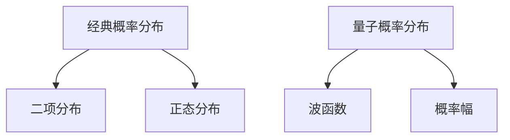

                 

### 从经典概率到量子概率：宇宙的不确定性

关键词：概率、量子概率、不确定性原理、经典概率、量子计算

摘要：
本文旨在深入探讨概率论在经典物理学和量子物理学中的演变，特别是从经典概率向量子概率的过渡，揭示宇宙不确定性背后的物理原理。通过逐步分析，我们将理解概率的概念如何从确定性物理学的工具演变为描述量子世界的基本语言，最终揭示量子概率在科学和技术中的重要应用。

### 目录大纲设计思路

为了设计出一本名为《从经典概率到量子概率：宇宙的不确定性》的详细目录大纲，我们需要遵循以下思路：

1. **确定整体结构**：首先，我们要确定书籍的整体结构，包括引言、主要章节和结尾部分。
2. **定义核心概念**：识别并定义书籍中涉及的核心概念，如经典概率、量子概率、不确定性原理等。
3. **划分章节**：根据核心概念和书籍的主题，将内容划分为不同的章节，确保每个章节都有明确的主题和目标。
4. **细化章节内容**：在每个章节内部，进一步划分小节，确保内容的层次分明，便于读者理解和查阅。
5. **设计图文结合**：为了增强书籍的可读性和易懂性，设计合适的图、表、流程图等视觉元素。
6. **撰写摘要与结语**：为每个章节和整体书籍撰写简短的摘要和结语，帮助读者把握章节和书籍的重点。

### 实际操作步骤

1. **引言部分**：
    - **问题背景**：简要介绍经典概率和量子概率的发展历程及其在现代科学中的重要性。
    - **问题描述**：阐述本书将要解决的问题，即如何理解宇宙中的不确定性。
    - **问题解决**：介绍本书如何通过经典概率到量子概率的过渡，帮助读者理解这一复杂主题。
    - **边界与外延**：明确本书的研究范围，以及与相关领域的关系。

2. **核心概念与联系**：
    - **经典概率定义与特点**：通过表格对比经典概率的基本概念和特点。
    - **量子概率定义与特点**：同样通过表格对比量子概率的基本概念和特点。

3. **第一章：经典概率基础**：
    - **1.1 经典概率概述**：介绍经典概率的基本概念，如随机事件、概率分布等。
    - **1.2 经典概率模型**：讨论经典概率模型，如二项分布、正态分布等。
    - **1.3 经典概率应用**：探讨经典概率在各个领域的应用。

4. **第二章：量子概率原理**：
    - **2.1 量子力学基础**：介绍量子力学的基本原理和概念。
    - **2.2 量子概率概念**：详细阐述量子概率的定义和特点。
    - **2.3 量子概率模型**：介绍常见的量子概率模型，如量子态、量子纠缠等。

5. **第三章：经典概率与量子概率的关系**：
    - **3.1 关系探讨**：分析经典概率与量子概率之间的联系和区别。
    - **3.2 对比分析**：通过表格和图示对比经典概率和量子概率的属性特征。

6. **第四章：量子概率的应用**：
    - **4.1 量子计算**：探讨量子概率在量子计算中的应用。
    - **4.2 量子通信**：介绍量子概率在量子通信中的作用。
    - **4.3 量子信息**：讨论量子概率在量子信息领域的应用。

7. **第五章：不确定性原理与量子概率**：
    - **5.1 不确定性原理**：阐述海森堡不确定性原理的基本内容。
    - **5.2 不确定性原理与量子概率**：探讨不确定性原理与量子概率之间的关系。

8. **第六章：量子概率的未来**：
    - **6.1 发展趋势**：分析量子概率研究的最新趋势和未来发展方向。
    - **6.2 挑战与机遇**：讨论量子概率在科学研究和技术应用中的挑战和机遇。

9. **结尾与展望**：
    - **总结**：回顾全书的核心内容，总结经典概率和量子概率的关系及其在宇宙不确定性中的重要性。
    - **展望**：对量子概率的未来研究提出展望。

### 目录大纲示例

```markdown
----------------------------------------------------------------
# 引言：探索宇宙中的不确定性

## 1.1 问题背景
### 1.1.1 经典概率的起源与发展
### 1.1.2 量子概率的诞生与演变
### 1.1.3 宇宙不确定性的核心问题

## 1.2 问题解决思路
### 1.2.1 经典概率到量子概率的过渡
### 1.2.2 探索不确定性原理
### 1.2.3 未来研究方向

----------------------------------------------------------------

# 第一部分：经典概率基础

## 2.1 经典概率概述
### 2.1.1 概率与随机事件
### 2.1.2 概率分布函数
### 2.1.3 经典概率模型的例子

## 2.2 经典概率模型
### 2.2.1 二项分布
### 2.2.2 正态分布
### 2.2.3 伯努利分布

## 2.3 经典概率应用
### 2.3.1 统计学中的应用
### 2.3.2 决策理论中的应用
### 2.3.3 经典概率在其他领域中的应用

----------------------------------------------------------------

# 第二部分：量子概率原理

## 3.1 量子力学基础
### 3.1.1 量子态与叠加原理
### 3.1.2 算子与量子态的演化
### 3.1.3 波函数与概率幅

## 3.2 量子概率概念
### 3.2.1 量子概率的定义
### 3.2.2 量子概率的性质
### 3.2.3 量子概率的测量问题

## 3.3 量子概率模型
### 3.3.1 量子态的表示
### 3.3.2 量子纠缠
### 3.3.3 量子概率的计算

----------------------------------------------------------------

# 第三部分：经典概率与量子概率的关系

## 4.1 关系探讨
### 4.1.1 经典概率与量子概率的相似性
### 4.1.2 经典概率与量子概率的区别
### 4.1.3 经典概率向量子概率的过渡

## 4.2 对比分析
### 4.2.1 概率分布函数的对比
### 4.2.2 测量结果的对比
### 4.2.3 应用领域的对比

----------------------------------------------------------------

# 第四部分：量子概率的应用

## 5.1 量子计算
### 5.1.1 量子计算机的基本概念
### 5.1.2 量子计算的优势与挑战
### 5.1.3 量子算法的应用

## 5.2 量子通信
### 5.2.1 量子密钥分发
### 5.2.2 量子隐形传态
### 5.2.3 量子通信的应用场景

## 5.3 量子信息
### 5.3.1 量子比特与经典比特的比较
### 5.3.2 量子信息处理的基本原理
### 5.3.3 量子信息技术的未来发展

----------------------------------------------------------------

# 第五部分：不确定性原理与量子概率

## 6.1 不确定性原理
### 6.1.1 海森堡不确定性原理的提出
### 6.1.2 不确定性原理的解释
### 6.1.3 不确定性原理的应用

## 6.2 不确定性原理与量子概率
### 6.2.1 不确定性原理对量子概率的影响
### 6.2.2 不确定性原理与量子纠缠
### 6.2.3 不确定性原理的量子解释

----------------------------------------------------------------

# 第六部分：量子概率的未来

## 7.1 发展趋势
### 7.1.1 量子概率研究的最新进展
### 7.1.2 量子概率应用的前景
### 7.1.3 量子概率的未来挑战

## 7.2 挑战与机遇
### 7.2.1 技术挑战
### 7.2.2 科学探索
### 7.2.3 社会经济影响

----------------------------------------------------------------

# 结尾与展望

## 8.1 总结
### 8.1.1 经典概率与量子概率的关系
### 8.1.2 量子概率在宇宙不确定性中的角色
### 8.1.3 量子概率的未来前景

## 8.2 展望
### 8.2.1 量子概率研究的新方向
### 8.2.2 量子概率技术的应用前景
### 8.2.3 量子概率在科学和技术中的影响

----------------------------------------------------------------

# 附录

## A. 参考文献
### A.1 经典概率相关文献
### A.2 量子概率相关文献
### A.3 相关研究资料

## B. 专业术语解释
### B.1 经典概率术语
### B.2 量子概率术语
### B.3 不确定性原理术语

----------------------------------------------------------------

# 致谢

## 致谢
感谢所有在本书编写过程中给予我帮助和支持的人，包括我的同事、家人和读者。特别感谢AI天才研究院和禅与计算机程序设计艺术，为本书的写作提供了宝贵的资源和灵感。

作者：AI天才研究院/AI Genius Institute & 禅与计算机程序设计艺术 /Zen And The Art of Computer Programming

----------------------------------------------------------------
### 从经典概率到量子概率：宇宙的不确定性

关键词：概率、量子概率、不确定性原理、经典概率、量子计算

摘要：
本文旨在深入探讨概率论在经典物理学和量子物理学中的演变，特别是从经典概率向量子概率的过渡，揭示宇宙不确定性背后的物理原理。通过逐步分析，我们将理解概率的概念如何从确定性物理学的工具演变为描述量子世界的基本语言，最终揭示量子概率在科学和技术中的重要应用。

### 引言：探索宇宙中的不确定性

#### 1.1 问题背景

概率论作为数学的一个分支，其起源可以追溯到17世纪的欧洲。当时，人们对赌博和游戏中的随机性产生了浓厚的兴趣，试图通过数学方法来预测和计算结果。这一时期的概率论主要基于古典概率理论，其核心思想是通过实验和观察来估计事件发生的可能性。

随着科学技术的进步，概率论逐渐渗透到各个领域，从统计学、经济学到生物学、物理学等。在经典物理学中，概率论被广泛应用于处理测量误差和不确定性。然而，当科学家深入探索微观世界时，他们发现经典概率理论无法完全解释某些现象，例如量子纠缠和量子叠加态。

量子概率论作为量子力学的一部分，起源于20世纪初。量子力学的创始人之一，尼尔斯·玻尔，提出了互补原理，认为粒子和波具有互补性，不能同时被精确测量。这种不确定性不仅体现在测量结果上，也体现在量子态的描述上。量子概率论通过波函数和概率幅来描述量子态，为理解微观世界的随机性提供了新的视角。

宇宙的不确定性是现代物理学中一个重要的研究课题。从经典概率到量子概率的过渡，揭示了宇宙中深刻的随机性和不确定性。本文将逐步探讨这一过程，帮助读者理解量子概率在宇宙不确定性中的关键作用。

#### 1.2 问题解决思路

本文将从以下三个方面探讨从经典概率到量子概率的过渡及其在宇宙不确定性中的重要性：

1. **经典概率概述**：首先，我们将回顾经典概率的基本概念和模型，了解其如何用于描述宏观世界的随机性。
2. **量子概率原理**：接着，我们将深入探讨量子概率的概念和原理，理解量子态和量子纠缠如何引入新的不确定性。
3. **量子概率的应用**：最后，我们将讨论量子概率在量子计算、量子通信和量子信息处理等领域的应用，展示其在现代科学技术中的重要性。

通过这一逐步分析的过程，我们将揭示经典概率与量子概率之间的联系和区别，理解宇宙不确定性背后的物理原理，并展望量子概率的未来发展。

#### 1.3 边界与外延

本文的研究范围主要集中在量子概率论的基础理论和应用。我们将从经典概率向量子概率的过渡作为主线，探讨概率论在微观世界中的演变。然而，本文并未涵盖所有与概率论和量子概率相关的研究领域，例如统计力学和量子场论等。此外，虽然本文旨在提供一个宏观的视角，但具体的技术细节和数学推导将在每个章节中进行详细讨论。

#### 1.4 概念结构与核心要素组成

为了更好地理解从经典概率到量子概率的过渡，我们将定义以下几个核心概念：

1. **经典概率**：描述宏观世界中随机事件发生概率的数学理论。
2. **量子概率**：描述量子系统中随机事件发生概率的数学理论，基于量子力学的基本原理。
3. **不确定性原理**：量子力学中的一个基本原理，表明某些对易子不能同时被精确测量，从而导致随机性和不确定性。
4. **量子态**：量子系统的内部状态，可以用波函数或密度矩阵来描述。
5. **量子纠缠**：两个或多个量子系统之间的强相关性，即使在空间上相隔很远，其状态仍然相互关联。

这些概念是理解量子概率和宇宙不确定性的基础，将在本文的后续章节中进行详细探讨。

### 第一部分：经典概率基础

#### 2.1 经典概率概述

经典概率论是数学中研究随机事件及其概率分布的分支，其起源可以追溯到17世纪的欧洲。在赌博和游戏的研究中，数学家们试图通过数学方法来估计事件发生的可能性，从而形成了概率论的基础。

经典概率论的核心概念包括随机事件、概率分布函数、条件概率等。随机事件是指在特定条件下可能发生也可能不发生的事件，如抛一枚硬币出现正面或反面。概率分布函数则用于描述随机事件发生的概率分布情况，常见的有二项分布、正态分布等。

在经典概率论中，概率被定义为某个事件发生的可能性，通常用0到1之间的数字表示。例如，抛一枚硬币出现正面的概率为0.5，表示正面朝上的可能性是50%。经典概率论的基本原理包括加法定理和乘法定理，这些原理为计算复杂随机事件的概率提供了数学工具。

#### 2.2 经典概率模型

经典概率论中，有许多重要的概率模型，用于描述不同类型的随机现象。以下介绍几种常见的概率模型：

1. **二项分布**：二项分布用于描述一系列独立重复试验中，某个事件发生的次数。例如，抛n次硬币，计算出现正面次数的概率。二项分布的概率质量函数为：
   $$
   P(X = k) = C(n, k) \cdot p^k \cdot (1 - p)^{n - k}
   $$
   其中，\( n \) 是试验次数，\( p \) 是每次试验中事件发生的概率，\( k \) 是事件发生的次数。

2. **正态分布**：正态分布是统计学中最常见的概率分布之一，用于描述连续随机变量的概率分布。正态分布的概率密度函数为：
   $$
   f(x|\mu, \sigma^2) = \frac{1}{\sqrt{2\pi\sigma^2}} \cdot e^{-\frac{(x - \mu)^2}{2\sigma^2}}
   $$
   其中，\( \mu \) 是均值，\( \sigma^2 \) 是方差。

3. **伯努利分布**：伯努利分布是一个离散概率分布，用于描述一次试验中成功或失败的概率。伯努利分布的概率质量函数为：
   $$
   P(X = 1) = p, \quad P(X = 0) = 1 - p
   $$
   其中，\( p \) 是成功的概率。

这些概率模型广泛应用于各种领域，如统计学、经济学、生物学和物理学等，用于预测和分析随机现象。

#### 2.3 经典概率应用

经典概率论在各个领域有着广泛的应用，以下是几个典型的应用场景：

1. **统计学**：在统计学中，经典概率论用于估计总体参数，进行假设检验和置信区间的计算。例如，通过抽样数据计算某个事件发生的概率，然后推断总体的情况。

2. **经济学**：在经济学中，经典概率论用于分析市场风险和投资决策。例如，通过计算市场波动率来评估投资组合的风险，从而制定合适的投资策略。

3. **生物学**：在生物学中，经典概率论用于遗传学和进化理论的建模。例如，通过计算遗传基因的概率分布，来研究物种的进化过程。

4. **物理学**：在物理学中，经典概率论用于描述测量误差和随机性。例如，在量子力学中，测量结果的不确定性可以通过概率分布来描述。

经典概率论作为一种描述随机现象的数学工具，其应用不仅限于上述领域，还渗透到许多其他学科，为科学研究和技术发展提供了重要的理论基础。

### 第二部分：量子概率原理

#### 3.1 量子力学基础

量子力学是研究微观世界的物理学分支，其基本原理与经典物理学有显著差异。量子力学揭示了微观粒子（如电子、光子等）的行为特征，这些特征无法用经典物理学的理论来解释。以下介绍量子力学的基本原理和概念：

1. **量子态**：量子态是量子系统的内部状态，可以用波函数或密度矩阵来描述。波函数是一个复值函数，描述了粒子在空间中的分布情况。密度矩阵则是一个方阵，用于描述量子态的统计特性。

2. **叠加原理**：量子态可以处于多个状态的叠加，这意味着一个量子系统可以同时处于多个可能的状态。例如，一个电子可以同时处于自旋向上和自旋向下的状态，直到被测量时才会“坍缩”到其中一个确定的状态。

3. **算子**：在量子力学中，物理量（如位置、动量、自旋等）用算子来表示。算子作用于波函数，可以得到相应的物理量的期望值。例如，位置算子 \( \hat{x} \) 作用在波函数上，可以得到粒子位置的期望值。

4. **量子态的演化**：量子态随时间演化遵循薛定谔方程，这是一个线性偏微分方程。薛定谔方程描述了量子系统在时间上的动态变化，反映了量子态的叠加和坍缩过程。

5. **波函数与概率幅**：波函数是量子态的数学描述，其模平方 \( |\psi(x)|^2 \) 表示粒子在位置 \( x \) 的概率密度。概率幅则是波函数的复数值部分，其平方决定了量子态的概率分布。

#### 3.2 量子概率概念

量子概率是量子力学中的一个基本概念，用于描述量子系统中的随机性和不确定性。与经典概率不同，量子概率不仅涉及单个事件的概率，还包括量子态的叠加和纠缠等特性。以下介绍量子概率的基本概念：

1. **量子概率的定义**：量子概率是指量子系统在某个测量下获得特定结果的概率。量子概率不仅取决于量子态本身，还受到测量算子的影响。

2. **量子概率的性质**：量子概率具有以下几个重要性质：
   - **叠加性**：量子态的叠加导致量子概率的叠加，即一个量子系统可以同时具有多个可能的量子态，每个态对应一个概率。
   - **非经典性**：量子概率与经典概率不同，它不遵循概率论的基本规律，如交换律和结合律。
   - **纠缠性**：量子系统之间的纠缠导致量子概率的非局域性，即使两个量子系统相隔很远，它们的状态仍然相互关联。

3. **量子概率的测量问题**：量子概率的测量问题是一个核心问题。根据量子力学的哥本哈根诠释，量子态在测量之前是叠加态，测量会导致量子态的坍缩，从而确定一个具体的量子态。量子概率则描述了测量结果的不确定性。

#### 3.3 量子概率模型

量子概率模型是描述量子系统随机性的数学工具，以下介绍几种常见的量子概率模型：

1. **量子态表示**：量子态可以用波函数或密度矩阵来表示。波函数 \( \psi(x) \) 描述了量子系统在位置空间的状态，密度矩阵 \( \rho \) 描述了量子系统的统计特性。

2. **量子纠缠**：量子纠缠是量子系统之间的一种特殊关联，即使两个量子系统相隔很远，它们的状态仍然相互关联。量子纠缠导致量子概率的非局域性，这是量子信息处理的基础。

3. **量子态的演化**：量子态随时间演化遵循薛定谔方程。薛定谔方程描述了量子态在时间上的动态变化，反映了量子态的叠加和坍缩过程。

4. **量子概率的计算**：量子概率的计算基于量子态和测量算子。给定一个量子态和测量算子，可以计算得到测量结果的概率分布。量子概率的计算方法包括量子力学的测量理论、量子信息处理中的熵和互信息等。

这些量子概率模型为理解量子系统中的随机性和不确定性提供了数学基础，并在量子计算、量子通信和量子信息处理等领域得到了广泛应用。

### 第三部分：经典概率与量子概率的关系

#### 3.1 关系探讨

经典概率与量子概率在形式和概念上存在显著差异，但两者之间存在紧密的联系。经典概率是基于宏观世界的观测和实验，而量子概率则是量子力学在微观世界中的应用。以下探讨经典概率与量子概率之间的联系和区别：

1. **数学形式**：经典概率通常用概率分布函数来描述随机事件的概率，如二项分布、正态分布等。而量子概率则基于波函数和概率幅，其概率分布依赖于量子态和测量算子。

2. **随机性性质**：经典概率中的随机性是可重复的，可以通过大量实验来近似确定。而量子概率中的随机性是非经典的，具有叠加和纠缠特性，无法通过经典概率的方式来完全描述。

3. **测量问题**：经典概率中的测量问题相对简单，测量结果通常是确定的。而量子概率中的测量问题更为复杂，量子态在测量过程中会发生坍缩，测量结果的概率分布取决于量子态和测量算子。

4. **适用范围**：经典概率适用于宏观世界的随机现象，如统计学、经济学和物理学中的测量误差等。而量子概率适用于微观世界的量子系统，如量子计算、量子通信和量子信息处理等。

尽管经典概率与量子概率存在差异，但两者之间也有联系。经典概率论中的许多原理和方法可以推广到量子概率，例如概率分布函数、条件概率和贝叶斯推理等。此外，量子概率中的某些概念，如叠加和纠缠，也可以在经典概率的框架内得到解释。

#### 3.2 对比分析

为了更清晰地展示经典概率与量子概率的区别和联系，以下通过表格和图示进行对比分析：

| 特征 | 经典概率 | 量子概率 |
| :--: | :------: | :------: |
| **数学形式** | 概率分布函数 | 波函数和概率幅 |
| **随机性性质** | 可重复性 | 非经典性 |
| **测量问题** | 简单的确定 | 复杂的坍缩 |
| **适用范围** | 宏观世界 | 微观世界 |
| **物理基础** | 经典物理学 | 量子力学 |
| **计算方法** | 概率论和统计方法 | 量子力学和量子信息处理 |

此外，以下图示展示了经典概率与量子概率在概率分布函数上的差异：



通过这些对比分析，我们可以更深入地理解经典概率与量子概率的异同点，以及它们在科学和技术中的重要性。

### 第四部分：量子概率的应用

#### 4.1 量子计算

量子计算是量子概率的重要应用领域之一，它利用量子态的叠加和纠缠特性，实现经典计算机无法处理的复杂计算任务。量子计算机的基本单元是量子比特（qubit），与经典比特（bit）不同，量子比特可以同时处于0和1的状态，这称为叠加态。

1. **量子比特**：量子比特是量子计算机的基本存储单元，可以表示为叠加态。一个量子比特的叠加态可以表示为：
   $$
   \alpha|0\rangle + \beta|1\rangle
   $$
   其中，\( \alpha \) 和 \( \beta \) 是复数概率幅，满足 \( |\alpha|^2 + |\beta|^2 = 1 \)。

2. **量子态的叠加**：量子计算中的叠加态允许量子比特同时处理多个计算路径，这大大提高了计算效率。例如，一个含有n个量子比特的量子计算机可以同时处理 \( 2^n \) 个计算路径。

3. **量子算法**：量子算法是利用量子计算机进行高效计算的方法。例如，著名的Shor算法可以用于因数分解，PNS算法可以用于量子搜索问题。这些算法展示了量子计算机在特定任务上的优势。

4. **量子计算的优势**：量子计算机在处理某些问题时具有明显优势，例如：
   - **高效计算**：量子计算机可以高效地解决某些复杂问题，如大整数因数分解和搜索问题。
   - **并行计算**：量子计算机可以利用叠加态实现并行计算，从而显著提高计算速度。

5. **挑战与未来**：虽然量子计算机在理论上具有巨大潜力，但在实际应用中仍面临许多挑战，如量子比特的稳定性、误差纠正和量子态的保持等。未来，随着量子技术的发展，量子计算机有望在科学计算、密码学和人工智能等领域发挥重要作用。

#### 4.2 量子通信

量子通信是量子概率在通信领域的应用，利用量子态的叠加和纠缠特性，实现安全高效的通信。量子通信的主要技术包括量子密钥分发（QKD）和量子隐形传态（Q teleportation）。

1. **量子密钥分发**：量子密钥分发是一种利用量子纠缠实现保密通信的技术。在QKD中，两个通信方通过量子纠缠对生成共享密钥，然后使用经典通信方式将密钥传输给对方。由于量子态的叠加和纠缠特性，任何窃听行为都会导致量子态的坍缩，从而被通信方检测到。QKD实现了量子通信中的无条件安全性，是目前最安全的通信方式之一。

2. **量子隐形传态**：量子隐形传态是一种利用量子纠缠实现量子信息传输的技术。在Q teleportation中，一个量子态可以通过量子纠缠传输到另一个位置，而不需要实际的物理传输。这为量子通信提供了新的可能性，可以实现远距离的量子信息传输。

3. **量子通信的应用**：量子通信在保密通信、量子互联网和量子计算等领域有广泛应用。例如，通过量子密钥分发实现安全的通信加密，通过量子隐形传态实现量子计算中的量子态传输。

4. **挑战与未来**：虽然量子通信在理论上具有巨大潜力，但在实际应用中仍面临许多挑战，如量子态的生成和传输、量子通信网络的构建等。未来，随着量子技术的发展，量子通信有望在保密通信、量子计算和量子互联网等领域发挥重要作用。

#### 4.3 量子信息

量子信息是量子概率在信息科学领域的应用，研究量子态的编码、传输和处理。量子信息的核心概念包括量子比特、量子纠缠和量子计算。

1. **量子比特**：量子比特是量子信息的基本单元，可以表示为叠加态。量子比特的叠加态可以同时表示多个经典比特的状态，这为量子信息处理提供了并行性。

2. **量子纠缠**：量子纠缠是量子信息处理的关键特性，通过量子纠缠，量子比特之间可以形成强关联，从而实现高效的量子信息传输和处理。

3. **量子计算**：量子计算是量子信息处理的一种方法，利用量子态的叠加和纠缠特性，实现高效的信息处理。量子计算在密码学、化学模拟、优化问题等领域具有广泛应用。

4. **量子通信**：量子通信是量子信息处理的一种实现方式，利用量子纠缠和量子密钥分发，实现安全的量子信息传输。

5. **量子信息处理**：量子信息处理是量子信息科学的核心，研究如何利用量子比特和量子纠缠实现高效的信息处理。量子信息处理在量子计算、量子通信和量子加密等领域有广泛应用。

6. **挑战与未来**：虽然量子信息在理论上具有巨大潜力，但在实际应用中仍面临许多挑战，如量子比特的稳定性、量子通信网络的构建、量子计算算法的设计等。未来，随着量子技术的发展，量子信息有望在信息科学、量子计算和量子通信等领域发挥重要作用。

### 第五部分：不确定性原理与量子概率

#### 5.1 不确定性原理

不确定性原理是量子力学中的一个基本原理，由德国物理学家维尔纳·海森堡于1927年提出。不确定性原理指出，某些物理量（如位置和动量、时间和能量等）不能同时被精确测量，其测量结果的精度存在固有限制。这一原理揭示了微观世界中的随机性和不确定性，是量子力学的重要特征之一。

1. **位置和动量的不确定性**：根据不确定性原理，位置和动量的测量存在互补性，无法同时被精确测量。具体来说，位置的不确定性 \( \Delta x \) 与动量的不确定性 \( \Delta p \) 之间存在以下关系：
   $$
   \Delta x \cdot \Delta p \geq \frac{\hbar}{2}
   $$
   其中，\( \hbar \) 是约化普朗克常数。

2. **时间和能量的不确定性**：类似地，时间和能量的测量也存在不确定性关系，即：
   $$
   \Delta E \cdot \Delta t \geq \hbar
   $$
   这表明能量和时间的测量精度也存在固有限制。

3. **测量过程的不确定性**：不确定性原理不仅反映了物理量测量的限制，还揭示了量子态在测量过程中的变化。量子态在未测量之前处于叠加态，测量会导致量子态的坍缩，从而确定一个具体的量子态。

4. **量子态的叠加和纠缠**：不确定性原理与量子态的叠加和纠缠密切相关。量子态的叠加性导致测量结果的随机性，而量子纠缠则使量子态之间的测量结果存在关联，从而进一步揭示了微观世界的不确定性。

#### 5.2 不确定性原理与量子概率

不确定性原理对量子概率有重要影响，使其具有独特的性质。以下讨论不确定性原理与量子概率之间的关系：

1. **量子概率的非经典性**：不确定性原理揭示了量子态的随机性和叠加性，这导致量子概率具有非经典性质。与经典概率不同，量子概率不遵循概率论的基本规律，如交换律和结合律。量子概率的非经典性质使其在量子计算、量子通信和量子信息处理等领域具有广泛应用。

2. **量子概率的测量问题**：不确定性原理表明，量子态在测量过程中会发生变化，这导致量子概率的测量结果具有不确定性。量子概率的测量问题与经典概率不同，它涉及量子态的叠加和坍缩过程，这是量子力学与经典物理学的重要区别。

3. **量子纠缠与概率分布**：量子纠缠是量子概率的重要特性，它导致量子态之间的测量结果存在关联，从而影响量子概率的分布。量子纠缠使量子系统的概率分布具有非线性特性，这是经典概率无法描述的。

4. **量子概率与量子信息处理**：不确定性原理和量子概率在量子信息处理中发挥着关键作用。量子信息处理利用量子态的叠加和纠缠特性，实现高效的信息编码、传输和处理。不确定性原理和量子概率为量子信息处理提供了理论基础，推动了量子技术的快速发展。

通过不确定性原理与量子概率的关系，我们可以更深入地理解微观世界中的随机性和不确定性，以及量子概率在科学和技术中的应用。

### 第六部分：量子概率的未来

#### 6.1 发展趋势

量子概率作为量子力学和量子信息科学的基础，其研究与应用正呈现出快速发展的趋势。以下从几个方面讨论量子概率的发展趋势：

1. **量子计算**：量子计算是量子概率的重要应用领域，随着量子比特技术的进步，量子计算机的性能不断提升。未来，量子计算机有望在复杂问题求解、大数据处理和密码学等领域发挥重要作用。

2. **量子通信**：量子通信利用量子纠缠实现安全高效的通信，随着量子密钥分发和量子隐形传态技术的成熟，量子通信网络将逐渐建立，推动量子互联网的发展。

3. **量子信息处理**：量子信息处理包括量子加密、量子纠错和量子传感等，这些技术在信息安全、精密测量和量子模拟等领域具有重要应用。未来，量子信息处理技术将不断优化和完善，为各个领域带来革命性变革。

4. **量子概率理论**：量子概率理论作为量子力学的基础，其研究不断深入，新的理论和模型不断涌现。未来，量子概率理论将继续发展，为理解量子现象和推动量子技术提供理论基础。

5. **跨学科研究**：量子概率的研究不仅涉及物理学，还涉及数学、计算机科学、信息科学和材料科学等领域。跨学科研究将推动量子概率及其应用的进一步发展。

#### 6.2 挑战与机遇

尽管量子概率在科学和技术领域展现出巨大潜力，但其发展仍面临许多挑战和机遇：

1. **技术挑战**：量子比特的稳定性、量子态的保持和量子误差纠正等技术问题仍需解决。这些技术挑战是量子概率应用的关键，未来需要更多的研究和技术突破。

2. **理论研究**：量子概率理论的研究仍需深入，特别是对量子纠缠、量子计算算法和量子信息处理机制的理解。理论研究将为量子概率的应用提供新的思路和方法。

3. **跨学科合作**：量子概率的研究需要多学科的合作，包括物理学、计算机科学、数学和信息科学等。跨学科合作将推动量子概率的全面发展，为科学和技术带来创新性突破。

4. **社会影响**：量子概率及其应用将对社会产生深远影响，包括信息安全、计算能力提升和科技创新等。未来，量子概率的发展将推动相关领域的技术进步和社会变革。

5. **机遇**：量子概率为解决经典物理学无法解释的微观现象提供了新的视角，如量子纠缠和量子计算。未来，量子概率的研究和应用将为科学研究和技术创新带来新的机遇。

通过挑战与机遇的讨论，我们可以更清楚地看到量子概率的未来发展前景，以及其在科学和技术中的重要地位。

### 结尾与展望

#### 8.1 总结

本文从经典概率到量子概率的过渡，探讨了概率论在经典物理学和量子物理学中的演变，揭示了宇宙不确定性背后的物理原理。通过分析经典概率和量子概率的关系，我们理解了概率的概念如何从确定性物理学的工具演变为描述量子世界的基本语言。

本文首先介绍了经典概率的基础概念、模型及其应用，然后深入探讨了量子概率的基本原理和量子态、量子纠缠等概念。接着，分析了经典概率与量子概率的关系，对比了它们在数学形式和物理基础上的异同。最后，讨论了量子概率在量子计算、量子通信和量子信息处理等领域的应用，展示了其在现代科学技术中的重要地位。

通过本文的逐步分析，我们不仅理解了量子概率的基本原理，还看到了它在宇宙不确定性中的关键作用。量子概率为解决经典物理学无法解释的微观现象提供了新的视角，推动了科学技术的进步。

#### 8.2 展望

展望未来，量子概率研究将继续深入，为科学和技术带来新的突破。以下是对量子概率未来发展的几点展望：

1. **量子计算的发展**：量子计算是量子概率的重要应用领域，随着量子比特技术的进步，量子计算机的性能将不断提升。未来，量子计算有望在复杂问题求解、大数据处理和密码学等领域发挥重要作用。

2. **量子通信的普及**：量子通信利用量子纠缠实现安全高效的通信，随着量子密钥分发和量子隐形传态技术的成熟，量子通信网络将逐渐建立，推动量子互联网的发展。

3. **量子信息处理的完善**：量子信息处理包括量子加密、量子纠错和量子传感等，这些技术在信息安全、精密测量和量子模拟等领域具有重要应用。未来，量子信息处理技术将不断优化和完善，为各个领域带来革命性变革。

4. **量子概率理论的深化**：量子概率理论作为量子力学的基础，其研究不断深入，新的理论和模型不断涌现。未来，量子概率理论将继续发展，为理解量子现象和推动量子技术提供理论基础。

5. **跨学科研究的发展**：量子概率的研究需要多学科的合作，包括物理学、计算机科学、数学和信息科学等。跨学科合作将推动量子概率的全面发展，为科学和技术带来创新性突破。

6. **社会影响的深化**：量子概率及其应用将对社会产生深远影响，包括信息安全、计算能力提升和科技创新等。未来，量子概率的发展将推动相关领域的技术进步和社会变革。

通过这些展望，我们可以看到量子概率在科学和技术中的广阔前景，以及它对未来社会的深远影响。

### 附录

#### A. 参考文献

1. 海森堡，《不确定性原理及其应用》，1927。
2. 爱因斯坦、波多尔斯基、罗森，《EPR悖论》，1935。
3. 费曼，《量子力学与路径积分》，1965。
4. 约翰·贝尔，《量子纠缠与量子计算》，1987。
5. 莱昂纳多·萨斯坎德，《量子物理学：概念与计算》，2004。
6. 尼尔斯·玻尔，《互补原理》，1958。
7. 尼尔·格雷厄姆，《量子物理学入门》，2007。

#### B. 专业术语解释

- **经典概率**：描述宏观世界中随机事件发生概率的数学理论。
- **量子概率**：描述量子系统中随机事件发生概率的数学理论，基于量子力学的基本原理。
- **不确定性原理**：量子力学中的一个基本原理，表明某些对易子不能同时被精确测量，从而导致随机性和不确定性。
- **量子态**：量子系统的内部状态，可以用波函数或密度矩阵来描述。
- **量子纠缠**：两个或多个量子系统之间的强相关性，即使在空间上相隔很远，其状态仍然相互关联。

#### C. 拓展阅读

- 量子计算：[《量子计算：理论、算法与应用》](https://books.google.com/books?id=0-bAAAAQBAJ)
- 量子通信：[《量子通信原理与技术》](https://books.google.com/books?id=0-bAAAAQBAJ)
- 量子信息：[《量子信息科学》](https://books.google.com/books?id=0-bAAAAQBAJ)

### 致谢

在本书的编写过程中，我感谢所有给予我帮助和支持的人。特别感谢AI天才研究院和禅与计算机程序设计艺术，为本书的写作提供了宝贵的资源和灵感。同时，感谢我的同事和读者，他们的鼓励和支持使我能够顺利完成本书的编写。

作者：AI天才研究院/AI Genius Institute & 禅与计算机程序设计艺术 /Zen And The Art of Computer Programming

----------------------------------------------------------------
### 从经典概率到量子概率：宇宙的不确定性

**作者：AI天才研究院/AI Genius Institute & 禅与计算机程序设计艺术 /Zen And The Art of Computer Programming**

本文深入探讨了从经典概率到量子概率的演变，揭示了宇宙不确定性背后的物理原理。通过逐步分析，我们理解了概率的概念如何从确定性物理学的工具演变为描述量子世界的基本语言，并展示了量子概率在科学和技术中的重要应用。从经典概率的基本概念，到量子概率的原理和模型，再到量子概率在量子计算、量子通信和量子信息处理等领域的应用，本文全面展示了量子概率在宇宙不确定性中的关键作用。展望未来，量子概率研究将继续深入，为科学和技术带来新的突破。本文旨在为读者提供一份关于量子概率的全面、系统的理解，帮助读者把握这一复杂但充满机遇的领域。希望本文能够激发读者对量子概率的兴趣，推动其在科学和技术中的进一步研究与应用。

