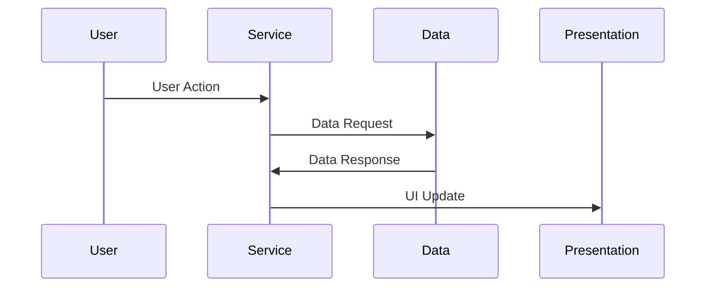
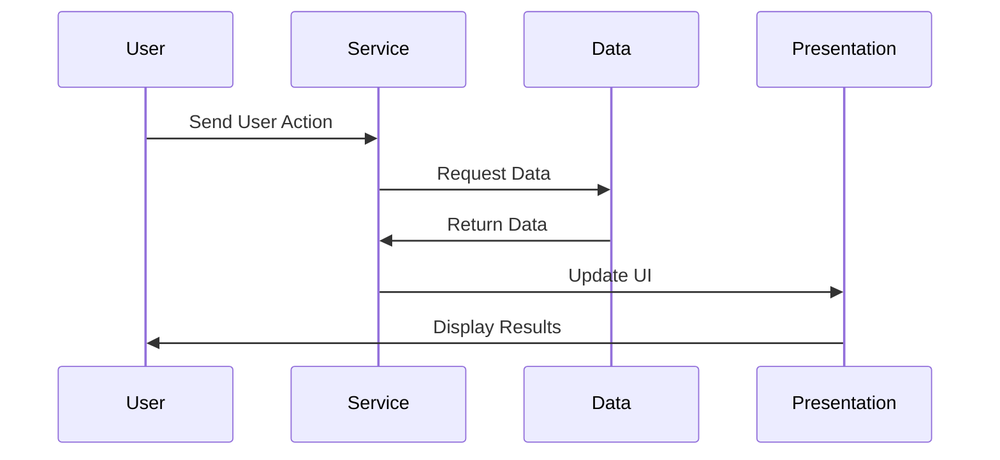

                 

### 第1章 引言：理解涌现现象的重要性

#### 1.1 经典物理学的局限性
经典物理学是一门以牛顿力学、热力学和电磁学为核心的学科，其基本原理在解释宏观现象方面具有显著的优势。然而，在处理复杂系统时，经典物理学的局限性逐渐显现。

##### 1.1.1 经典物理学的基本原理
经典物理学主要基于以下几个基本原理：
1. **确定性原理**：物理系统的运动是可预测的，给定初始条件和系统的状态，可以使用物理定律精确地预测未来的状态。
2. **因果律**：因果关系是自然界的基本规律，每个现象都有其原因。
3. **能量守恒定律**：能量在一个封闭系统中是守恒的，不会凭空产生或消失。

##### 1.1.2 经典物理学的局限性
尽管经典物理学在许多方面表现出色，但它在解释复杂系统中遇到的困难主要包括：
1. **非线性问题**：复杂系统通常包含非线性关系，这使得预测系统的长期行为变得非常困难。
2. **混沌现象**：某些系统的初始条件即使有微小差异，也会导致长期行为的巨大差异，这种现象被称为混沌。
3. **大量变量的相互作用**：复杂系统通常由大量变量组成，这些变量之间存在复杂的相互作用，难以通过简单的物理定律来描述。

#### 1.2 复杂性科学的兴起
为了克服经典物理学的局限性，复杂性科学应运而生。它是一门研究复杂系统的科学，这些系统通常由大量相互作用的个体组成，表现出整体性的复杂行为。

##### 1.2.1 复杂性科学的定义与发展
复杂性科学可以定义为研究复杂系统如何从简单规则和简单个体产生复杂行为的学科。它起源于20世纪中叶，随着计算机技术的发展和数学工具的进步而迅速发展。

复杂性科学的核心思想包括：
1. **涌现性**：系统的整体行为不能仅从其组成部分的行为中推导出来，整体行为具有新的属性。
2. **自组织**：系统可以通过个体之间的相互作用自发地组织起来，形成有序结构。
3. **适应性**：系统可以在环境变化时调整自己的行为以保持稳定。

##### 1.2.2 复杂性科学的核心思想
复杂性科学的核心思想是理解复杂系统的行为是如何从简单规则和相互作用中涌现出来的。这种思想体现在以下几个方面：
1. **网络科学**：研究复杂网络的结构和功能，包括社交网络、生物网络、互联网等。
2. **非线性动力学**：研究非线性系统和动力系统的行为，包括混沌、分岔、相变等。
3. **计算模拟**：使用计算机模拟来探索复杂系统的行为，通过模拟来验证理论和预测结果。

#### 1.3 涌现现象的概念与特征
涌现现象是复杂性科学的核心概念之一，它描述了复杂系统整体行为的新属性，这些属性不能直接从系统的组成部分中推导出来。

##### 1.3.1 涌现现象的定义
涌现现象是指系统的整体行为或属性不能仅从其组成部分的行为或属性中推导出来，而是具有新的属性或行为。

##### 1.3.2 涌现现象的特征
涌现现象通常具有以下特征：
1. **整体性**：涌现现象是由系统的整体行为产生的，而不是由单个部分产生的。
2. **不可预测性**：涌现现象往往是不可预测的，即使对系统的组成部分有很好的了解，也无法准确预测整体行为。
3. **多样性**：涌现现象可以导致系统表现出多种不同的行为模式。

##### 1.3.3 涌现现象的分类
涌现现象可以根据其产生的机制和特征进行分类，常见的分类包括：
1. **层次涌现**：系统的整体行为是由较低层次的行为层次结构产生的。
2. **自组织涌现**：系统通过个体之间的相互作用自发地组织起来，产生新的结构和行为。
3. **自适应涌现**：系统在环境变化时能够调整自身的行为以保持稳定。

#### 1.4 经典物理学到复杂性科学的过渡
复杂性科学的兴起标志着物理学研究的一个新范式，它为理解复杂系统的行为提供了新的方法和工具。

##### 1.4.1 经典物理学中的涌现现象
经典物理学中也有一些涌现现象的例子，例如相变和临界现象。相变是指系统从一种相态转换到另一种相态的过程，如水的沸腾和凝结。临界现象是指在相变点附近，系统的行为发生显著变化。

##### 1.4.2 复杂性科学对涌现现象的解释
复杂性科学通过引入新的数学模型和理论框架，如随机过程、网络科学和动力系统理论，提供了对涌现现象的深入解释。这些模型和理论能够更好地描述复杂系统的行为，解释涌现现象的产生机制。

#### 1.5 复杂性科学在物理学中的应用
复杂性科学在物理学中的应用非常广泛，它不仅帮助解释了许多经典物理学无法解释的现象，还为新的物理理论和方法的发展提供了支持。

##### 1.5.1 自组织现象
自组织现象是指系统在没有外部干预的情况下自发地组织起来，形成有序结构。复杂性科学研究了自组织现象的产生机制和规律，为理解自然界和社会现象提供了新的视角。

##### 1.5.2 分形与混沌
分形和混沌是复杂性科学中的重要概念，它们描述了复杂系统的行为特征。分形描述了系统的自相似性，而混沌描述了系统的不可预测性和确定性。

##### 1.5.3 复杂系统的模拟与预测
复杂性科学通过计算模拟来探索复杂系统的行为，这些模拟可以帮助预测系统的未来行为，为科学研究和技术应用提供了重要的工具。

#### 1.6 本章小结
本章介绍了从经典物理学到复杂性科学的过渡，强调了复杂性科学在理解涌现现象方面的重要性。通过介绍经典物理学的局限性、复杂性科学的定义和核心思想、涌现现象的概念和特征，以及复杂性科学在物理学中的应用，本章为后续章节的内容奠定了基础。

### 第2章 复杂性科学的数学基础

本章将介绍复杂性科学中常用的数学基础，包括随机过程、概率论、线性代数、矩阵理论以及复杂网络的数学描述。这些数学工具为复杂性科学的研究提供了重要的基础，帮助我们更好地理解和分析复杂系统的行为。

#### 2.1 随机过程与概率论

随机过程是复杂性科学中一个重要的概念，它描述了一组随机变量随时间的演变。随机过程在复杂性科学中的应用非常广泛，例如在金融市场的波动、生物进化中的遗传变异、社交网络中的信息传播等方面。

##### 2.1.1 随机过程的基本概念

随机过程可以用一个随机变量序列 \( \{X_t\} \) 来表示，其中每个随机变量 \( X_t \) 表示在时刻 \( t \) 的系统状态。随机过程的基本概念包括：
- **均值**：随机过程的均值表示其长期的平均行为。
- **方差**：随机过程的方差表示其波动的程度。
- **自协方差函数**：自协方差函数描述了随机过程在不同时间点之间的相关性。

##### 2.1.2 概率论的基本原理

概率论是研究随机现象的数学分支，它是随机过程分析的基础。概率论的基本原理包括：
- **概率分布**：概率分布描述了随机变量取不同值的概率。
- **条件概率**：条件概率描述了在某个事件发生的前提下，另一个事件发生的概率。
- **贝叶斯定理**：贝叶斯定理是一种基于条件概率的推理方法，它可以帮助我们根据新的信息更新对某个事件发生的概率估计。

#### 2.2 线性代数与矩阵理论

线性代数和矩阵理论在复杂性科学中起着关键作用，它们帮助我们理解和分析复杂系统的结构和动态行为。线性代数的基本概念包括向量、矩阵、行列式、线性方程组等。

##### 2.2.1 线性代数的基本概念

线性代数的基本概念包括：
- **向量**：向量是具有大小和方向的量，可以用来表示系统的状态。
- **矩阵**：矩阵是一个二维数组，可以用来表示系统的状态转移或相互作用。
- **行列式**：行列式是一个标量值，可以用来判断线性方程组的解的情况。
- **线性方程组**：线性方程组是一组线性方程，通过求解线性方程组可以得到系统的状态。

##### 2.2.2 矩阵理论的应用

矩阵理论在复杂性科学中的应用非常广泛，例如：
- **状态转移矩阵**：状态转移矩阵描述了系统在不同状态之间的转移概率。
- **特征值和特征向量**：特征值和特征向量可以帮助我们分析系统的稳定性和动态行为。

#### 2.3 复杂性科学的数学工具

复杂性科学的数学工具不仅包括传统的线性代数和概率论，还包括一些专门为复杂性科学设计的数学工具，如复杂网络的数学描述和动力系统理论。

##### 2.3.1 复杂网络的数学描述

复杂网络是复杂性科学中的一个重要概念，它描述了由大量节点和边组成的网络结构。复杂网络的数学描述包括：
- **节点度**：节点度描述了节点与其他节点相连的边数。
- **聚类系数**：聚类系数描述了节点之间的连接程度。
- **网络连通性**：网络连通性描述了网络中任意两个节点之间是否存在路径。

##### 2.3.2 动力系统理论

动力系统理论是研究动态系统的数学分支，它帮助我们理解复杂系统的长期行为和演化过程。动力系统理论的基本概念包括：
- **相空间**：相空间是系统状态的几何空间，可以用来描述系统的运动轨迹。
- **稳定性**：稳定性描述了系统在受到扰动后能否回到平衡状态。
- **分岔**：分岔是指系统从一种稳定状态过渡到另一种稳定状态的过程。

#### 2.4 复杂性科学的数学模型

复杂性科学的数学模型是研究复杂系统行为的重要工具，它们可以帮助我们理解复杂系统的涌现现象和动态行为。常见的数学模型包括：
- **随机图模型**：随机图模型描述了随机生成的网络结构。
- **小世界网络模型**：小世界网络模型描述了具有短路径长度的网络结构。
- **无标度网络模型**：无标度网络模型描述了节点度分布遵循幂律分布的网络结构。

##### 2.4.1 基于概率论的涌现现象模型

基于概率论的涌现现象模型通过概率分布和随机过程来描述复杂系统的行为。常见的模型包括：
- **马尔可夫链**：马尔可夫链是一种随机过程，它描述了系统在不同状态之间的转移概率。
- **随机游走**：随机游走是一种随机过程，它描述了系统在随机漫步中的行为。

##### 2.4.2 基于动力系统的涌现现象模型

基于动力系统的涌现现象模型通过动力系统的方程和稳定性分析来描述复杂系统的行为。常见的模型包括：
- **洛伦兹系统**：洛伦兹系统是一种非线性动力系统，它描述了流体运动的复杂行为。
- **Chen-Later模型**：Chen-Later模型是一种双变量非线性动力系统，它描述了系统的混沌行为。

#### 2.5 数学模型的应用实例

数学模型在复杂性科学中的应用非常广泛，以下是一些应用实例：
- **社会网络分析**：通过复杂网络的数学模型，可以研究社交网络中的信息传播、社交影响力等。
- **金融市场的复杂性分析**：通过随机过程和动力系统模型，可以研究金融市场的波动、投资组合的优化等。
- **生物系统的复杂性分析**：通过遗传算法和神经网络模型，可以研究生物进化、蛋白质折叠等。

#### 2.6 本章小结
本章介绍了复杂性科学的数学基础，包括随机过程、概率论、线性代数、矩阵理论以及复杂网络的数学描述。这些数学工具为复杂性科学的研究提供了重要的基础，帮助我们更好地理解和分析复杂系统的行为。

### 第3章 涌现现象的数学模型

涌现现象是复杂性科学中的一个核心概念，它描述了复杂系统整体行为的新属性，这些属性不能从系统的组成部分中直接推导出来。本章将介绍几种常见的涌现现象的数学模型，包括随机模型、动力系统模型和统计物理模型，并分析它们在复杂性科学中的应用。

#### 3.1 经典物理学的涌现现象模型

在经典物理学中，涌现现象通常通过相变和临界现象来描述。相变是指系统从一种相态转换为另一种相态的过程，如水的沸腾和凝结。临界现象发生在相变点附近，系统的行为发生显著变化。

##### 3.1.1 相变与临界现象

相变和临界现象的数学描述通常使用热力学和统计物理的方法。在热力学中，相变可以通过自由能函数的极小化来描述，而临界现象则可以通过相变点的临界指数来描述。

1. **自由能函数**：
   自由能函数 \( F(T, V) \) 是描述系统热力学状态的函数，其中 \( T \) 表示温度，\( V \) 表示体积。在相变点，自由能函数的导数会发生显著变化。

2. **临界指数**：
   临界指数描述了系统在临界点附近的行为。常见的临界指数包括临界指数 \( \alpha \)、\( \beta \)、\( \gamma \) 等，它们分别描述了系统的长度、时间和质量的尺度变化。

##### 3.1.2 分岔与混沌

分岔和混沌是经典物理学中描述非线性系统的两个重要概念。分岔是指系统从一个稳定状态过渡到多个稳定状态的过程，而混沌则是指系统在初始条件微小变化下产生长期行为的巨大差异。

1. **分岔**：
   分岔可以通过动态系统的稳定性和分岔图来描述。在分岔图中，系统的稳定状态会随着参数的变化而变化，产生多个稳定状态。

2. **混沌**：
   混沌可以通过李亚普诺夫指数来描述。如果系统的李亚普诺夫指数大于零，则系统是混沌的。混沌系统的行为具有不可预测性和确定性。

#### 3.2 复杂性科学的涌现现象模型

复杂性科学提供了更广泛的涌现现象模型，这些模型通常基于随机过程、网络科学和动力系统理论。

##### 3.2.1 随机模型

随机模型通过随机过程来描述复杂系统的行为。常见的随机模型包括马尔可夫链、随机游走和随机过程。

1. **马尔可夫链**：
   马尔可夫链是一种随机过程，它描述了系统在不同状态之间的转移概率。马尔可夫链可以用来研究社会网络中的信息传播、金融市场的波动等。

2. **随机游走**：
   随机游走是一种简单的随机过程，它描述了系统在随机漫步中的行为。随机游走可以用来研究社交网络中的节点间连接关系、金融市场中的价格波动等。

3. **随机过程**：
   随机过程是一组随机变量的集合，它描述了系统随时间的演化。常见的随机过程包括Wiener过程、泊松过程等。随机过程可以用来研究金融市场的波动、生物进化中的基因变异等。

##### 3.2.2 动力系统模型

动力系统模型通过动力系统的方程来描述复杂系统的行为。常见的动力系统模型包括洛伦兹系统、Chen-Later模型和Lotka-Volterra模型。

1. **洛伦兹系统**：
   洛伦兹系统是一种非线性动力系统，它描述了流体运动的复杂行为。洛伦兹系统可以用来研究混沌现象、天气预测等。

2. **Chen-Later模型**：
   Chen-Later模型是一种双变量非线性动力系统，它描述了系统的混沌行为。Chen-Later模型可以用来研究生物系统的演化、金融市场的波动等。

3. **Lotka-Volterra模型**：
   Lotka-Volterra模型是一种描述生物种群动态的线性动力系统模型。Lotka-Volterra模型可以用来研究生物进化、生态平衡等。

##### 3.2.3 统计物理模型

统计物理模型通过统计物理的方法来描述复杂系统的行为。常见的统计物理模型包括自组织临界性模型、分形模型等。

1. **自组织临界性模型**：
   自组织临界性模型描述了系统在没有外部干预的情况下自发地组织起来，形成有序结构。自组织临界性模型可以用来研究沙堆的形成、交通拥堵等。

2. **分形模型**：
   分形模型描述了系统的自相似性和无标度性。分形模型可以用来研究自然界中的分形结构，如海岸线、树冠等。

#### 3.3 涌现现象模型的应用

涌现现象模型在复杂性科学中有广泛的应用，以下是一些应用实例：

1. **社会网络分析**：
   通过马尔可夫链和随机过程模型，可以研究社交网络中的信息传播、社交影响力等。

2. **金融市场的复杂性分析**：
   通过随机过程和动力系统模型，可以研究金融市场的波动、投资组合的优化等。

3. **生物系统的复杂性分析**：
   通过遗传算法和神经网络模型，可以研究生物进化、蛋白质折叠等。

4. **交通系统分析**：
   通过自组织临界性模型，可以研究交通拥堵的形成、交通流量的优化等。

#### 3.4 涌现现象模型的比较与评价

涌现现象模型各有优缺点，选择合适的模型需要根据具体的应用场景和需求进行评估。

1. **随机模型**：
   随机模型具有简单、直观的特点，适用于描述随机性和不确定性较强的系统。然而，随机模型在处理复杂系统时可能无法捕捉到系统的内在规律。

2. **动力系统模型**：
   动力系统模型能够描述系统的长期行为和演化过程，适用于研究非线性系统和混沌现象。然而，动力系统模型在计算上可能较为复杂，且需要精确的初始条件和参数。

3. **统计物理模型**：
   统计物理模型能够描述系统的统计性质和宏观行为，适用于研究大规模系统的行为。然而，统计物理模型可能无法捕捉到系统中的微观机制。

#### 3.5 涌现现象模型的未来发展趋势

涌现现象模型在复杂性科学中的应用前景广阔，未来的发展趋势包括：

1. **多尺度模型**：
   随着计算能力的提高，多尺度模型将成为研究复杂系统的重要工具。多尺度模型可以同时考虑系统的宏观行为和微观机制，提供更全面的理解。

2. **大数据与机器学习**：
   大数据和机器学习技术将推动涌现现象模型的发展。通过大数据分析，可以挖掘系统中的潜在规律，而机器学习技术则可以自动识别和分类涌现现象。

3. **跨学科融合**：
   复杂性科学将与其他学科如经济学、社会学、生物学等融合，形成新的交叉学科。跨学科的研究将有助于解决复杂系统中的复杂问题。

#### 3.6 本章小结

本章介绍了涌现现象的数学模型，包括经典物理学的相变和临界现象模型、复杂性科学的随机模型、动力系统模型和统计物理模型。这些模型在复杂性科学中有广泛的应用，为理解复杂系统的涌现行为提供了重要的工具。通过比较不同模型的优缺点和未来发展趋势，我们可以更好地选择和应用合适的模型来研究复杂系统。

### 第4章 复杂性科学的应用领域

复杂性科学是一门研究复杂系统的学科，其应用领域非常广泛，涵盖了生物学、社会科学、经济学等多个领域。本章将详细介绍复杂性科学在生物学、社会科学和经济学中的应用，并通过具体案例来展示其应用效果。

#### 4.1 生物学中的复杂性科学

生物学中的复杂性科学主要关注生物系统中的复杂现象，如生物进化、生态系统动态和细胞网络调控等。

##### 4.1.1 生物系统中的涌现现象

生物系统中的涌现现象包括生物进化的多样性和生态系统的复杂性等。生物进化是生物系统中最显著的涌现现象之一，它通过自然选择和遗传变异等机制，使得生物种群在长期演化中表现出多样性。

1. **生物进化的复杂性**：
   生物进化是一个复杂的动态过程，涉及基因变异、自然选择、遗传漂变等多个因素。通过复杂性科学的数学模型，可以更好地理解生物进化的机制和规律。

2. **生态系统的复杂性**：
   生态系统由多个生物种群和环境因素相互作用而成，表现出复杂的动态行为。复杂性科学的方法可以帮助我们研究生态系统的稳定性、物种多样性和生态系统服务功能等。

##### 4.1.2 复杂性科学在生物进化中的应用

复杂性科学在生物进化中的应用主要体现在遗传算法和神经网络模型等方面。

1. **遗传算法**：
   遗传算法是一种基于生物进化原理的优化算法，它模拟自然选择和遗传变异的过程，通过不断迭代寻找最优解。遗传算法可以用于基因测序、药物设计、蛋白质结构预测等领域。

2. **神经网络模型**：
   神经网络模型是一种基于人脑神经元连接方式的计算模型，它可以模拟生物神经系统的复杂行为。神经网络模型在生物进化研究中可以用于模拟生物进化的过程，预测生物行为的可能性。

##### 4.1.3 复杂性科学在生态系统动态研究中的应用

复杂性科学在生态系统动态研究中的应用包括生态网络分析、生态系统模拟和生态系统服务评估等。

1. **生态网络分析**：
   生态网络分析是一种研究生态系统结构和动态的方法，它通过构建生态网络图来描述生物种群之间的相互作用。生态网络分析可以用于研究生态系统的稳定性、物种相互作用和生态系统服务功能等。

2. **生态系统模拟**：
   生态系统模拟是一种通过计算机模拟来研究生态系统动态的方法。通过模拟，可以预测生态系统在环境变化下的响应行为，为生态保护和修复提供科学依据。

3. **生态系统服务评估**：
   生态系统服务评估是一种衡量生态系统为人类提供的服务价值的方法。复杂性科学的模型和方法可以帮助我们评估生态系统的服务功能，为生态系统管理和保护提供决策支持。

#### 4.2 社会科学中的复杂性科学

社会科学中的复杂性科学主要关注社会系统的复杂现象，如社会网络结构、社会行为模式和群体行为等。

##### 4.2.1 社会网络分析

社会网络分析是一种研究社会系统中的个体和群体之间相互作用的方法。它通过构建社会网络图来描述个体之间的连接关系，可以用于研究社会网络中的信息传播、社交影响力和社会动员等。

1. **社会网络中的信息传播**：
   社会网络中的信息传播是一个复杂的动态过程，它受到社会网络结构、个体行为和信息内容等因素的影响。通过复杂性科学的模型和方法，可以研究信息在社会网络中的传播规律和影响因素。

2. **社交影响力**：
   社交影响力是指个体通过社会网络对其他个体的影响能力。复杂性科学的方法可以帮助我们研究社交影响力的形成机制、传播规律和影响因素。

3. **社会动员**：
   社会动员是指通过社会网络组织和动员个体参与社会活动。复杂性科学的方法可以帮助我们研究社会动员的策略、效果和影响因素。

##### 4.2.2 社会行为的复杂性分析

社会行为的复杂性分析是一种研究社会系统中个体行为和群体行为之间关系的方法。它通过构建个体行为模型和群体行为模型，可以研究社会行为的形成机制和演化规律。

1. **个体行为模型**：
   个体行为模型是一种基于个体决策和行为的计算模型，它可以模拟个体在社会系统中的行为模式和决策过程。通过个体行为模型，可以研究个体行为对整体行为的影响和个体行为策略的优化。

2. **群体行为模型**：
   群体行为模型是一种基于群体动力学理论的计算模型，它可以模拟群体在社会系统中的行为模式和演化过程。通过群体行为模型，可以研究群体行为的形成机制、演化规律和影响因素。

##### 4.2.3 复杂性科学在社会科学研究中的应用

复杂性科学在社会科学研究中的应用非常广泛，以下是一些具体的应用案例：

1. **社会网络分析**：
   社会网络分析可以用于研究社交媒体上的信息传播、社交影响力和社会动员等。通过构建社会网络图和计算网络特征，可以揭示社会网络中的关键节点和传播路径，为信息传播和社交影响力分析提供科学依据。

2. **社会行为模式研究**：
   复杂性科学的方法可以帮助我们研究社会系统中的行为模式，如消费行为、投票行为和合作行为等。通过构建个体行为模型和群体行为模型，可以分析行为模式的形成机制和影响因素，为行为干预和决策制定提供科学依据。

3. **群体行为预测**：
   复杂性科学的方法可以帮助我们预测社会系统中的群体行为，如群体情绪、群体行为和群体决策等。通过分析个体行为和群体行为的演化规律，可以预测群体行为的趋势和影响因素，为社会管理和决策提供科学依据。

#### 4.3 经济学中的复杂性科学

经济学中的复杂性科学主要关注经济系统中的复杂现象，如金融市场的波动、经济周期的形成和资源配置的优化等。

##### 4.3.1 金融市场的复杂性分析

金融市场是一个复杂的动态系统，其波动和行为受到多种因素的影响，如市场情绪、经济政策、自然灾害等。通过复杂性科学的模型和方法，可以研究金融市场的波动规律、影响因素和风险管理策略。

1. **金融市场波动规律**：
   金融市场的波动规律是一个复杂的问题，它受到市场供需关系、投资者心理等多种因素的影响。通过复杂性科学的模型，如随机过程和动力系统模型，可以研究金融市场的波动规律，预测市场走势。

2. **影响因素分析**：
   金融市场的波动受到多种因素的影响，如宏观经济指标、政策变化、自然灾害等。通过复杂性科学的分析方法，可以识别和评估各种因素对金融市场波动的影响，为金融市场风险管理提供科学依据。

3. **风险管理策略**：
   金融市场的复杂性使得风险管理变得尤为重要。通过复杂性科学的模型和方法，可以设计有效的风险管理策略，如风险度量、风险分散和风险对冲等。

##### 4.3.2 经济周期的形成与预测

经济周期是指国民经济总体活动的波动，包括扩张期、衰退期、复苏期和过热期等。通过复杂性科学的模型和方法，可以研究经济周期的形成机制、影响因素和预测方法。

1. **经济周期的形成机制**：
   经济周期是一个复杂的过程，它受到多种因素的影响，如市场需求、供给关系、技术创新等。通过复杂性科学的模型，如动力系统模型和统计物理模型，可以研究经济周期的形成机制。

2. **经济周期的影响因素**：
   经济周期的影响因素包括宏观经济政策、金融市场、技术创新等。通过复杂性科学的分析方法，可以识别和评估各种因素对经济周期的影响，为经济政策制定提供科学依据。

3. **经济周期的预测方法**：
   经济周期的预测是一个复杂的问题，它需要综合考虑多种因素。通过复杂性科学的模型和方法，如时间序列分析和机器学习算法，可以预测经济周期的走势，为经济决策提供科学依据。

##### 4.3.3 资源配置的优化

资源配置是一个复杂的问题，它涉及到资源的需求、供给和利用等方面。通过复杂性科学的模型和方法，可以优化资源配置，提高资源利用效率。

1. **资源需求分析**：
   资源需求分析是资源配置的重要环节，它需要考虑人口、经济发展、科技进步等因素。通过复杂性科学的模型和方法，可以预测资源需求的趋势和影响因素。

2. **资源供给分析**：
   资源供给分析是资源配置的另一个重要环节，它需要考虑资源开发、环境保护等因素。通过复杂性科学的模型和方法，可以评估资源供给的潜力、风险和可持续性。

3. **资源配置优化方法**：
   资源配置优化方法包括线性规划、动态规划、多目标优化等。通过复杂性科学的模型和方法，可以设计优化算法，提高资源配置的效率和效果。

#### 4.4 复杂性科学的应用效果与挑战

复杂性科学在多个领域都有广泛的应用，取得了显著的成果。然而，复杂性科学的应用也面临一些挑战。

1. **数据质量和准确性**：
   复杂性科学的应用依赖于大量的数据和精确的测量，数据质量和准确性对研究结果的可靠性至关重要。在实际应用中，数据质量和准确性可能受到多种因素的影响，如数据缺失、噪声和误差等。

2. **模型选择和优化**：
   复杂性科学应用中需要选择合适的模型，并对其进行优化。模型选择和优化是一个复杂的过程，需要综合考虑多个因素，如模型精度、计算效率和可解释性等。

3. **跨学科融合**：
   复杂性科学应用涉及多个学科，如物理学、数学、计算机科学、社会学等。跨学科融合是一个挑战，需要不同领域的专家共同合作，实现知识的共享和互补。

4. **政策和管理**：
   复杂性科学的政策和管理是一个复杂的过程，需要综合考虑科学、经济、社会等多方面因素。在实际应用中，政策和管理可能面临不确定性和复杂性，需要灵活应对。

#### 4.5 本章小结

本章介绍了复杂性科学在生物学、社会科学和经济学中的应用。通过具体案例，展示了复杂性科学在理解复杂现象、预测行为趋势和优化资源配置等方面的应用效果。尽管复杂性科学的应用面临一些挑战，但其广阔的前景和潜力使其成为一个重要的研究领域。

### 第5章 系统分析与架构设计方案

在复杂性科学的应用中，系统分析与架构设计方案至关重要，它确保了复杂性系统能够稳定运行并有效应对外部变化。本章将详细讨论系统分析与架构设计的关键步骤、所需工具和技术，并结合实际案例进行说明。

#### 5.1 问题场景介绍

假设我们面临的是一个复杂的社交网络系统，该系统需要实时分析用户之间的互动，预测潜在的趋势和风险，并优化网络结构以提高信息传播效率。

#### 5.2 项目介绍

为了应对上述场景，我们设计了一个名为“社交网络分析平台”的项目。该平台旨在提供以下功能：

1. **实时互动分析**：分析用户之间的互动，包括点赞、评论、分享等行为。
2. **趋势预测**：基于历史数据和实时互动，预测社交网络中的潜在趋势和热点话题。
3. **风险识别**：识别潜在的风险和异常行为，如网络攻击、恶意传播等。
4. **网络优化**：通过分析社交网络的结构和互动模式，提出优化建议以提高信息传播效率。

#### 5.3 系统功能设计

在系统功能设计阶段，我们采用领域驱动设计（Domain-Driven Design, DDD）方法，通过定义领域模型来明确系统的核心功能。

1. **领域模型**：
   - **用户**：代表社交网络中的用户，具有用户名、头像、关注者列表等属性。
   - **互动**：代表用户之间的互动行为，包括点赞、评论、分享等。
   - **趋势**：代表社交网络中的趋势信息，如热门话题、活跃用户等。
   - **风险**：代表社交网络中的风险信息，如恶意账号、网络攻击等。

2. **领域模型ER图**：

```mermaid
erDiagram
    User ||--|{ Interaction }|--|| Node
    User ||--|{ Trend }|--|| Topic
    User ||--|{ Risk }|--|| Alert
```

#### 5.4 系统架构设计

系统架构设计阶段，我们采用分层架构来确保系统的模块化和可扩展性。系统主要分为以下几层：

1. **数据层**：负责数据存储和管理，包括用户数据、互动数据、趋势数据和风险数据等。
2. **服务层**：提供业务逻辑实现，包括互动分析、趋势预测、风险识别和网络优化等功能。
3. **表示层**：提供用户界面，包括实时互动分析界面、趋势预测界面、风险识别界面和网络优化界面等。

2. **系统架构图**：



#### 5.5 系统接口设计

系统接口设计阶段，我们定义了系统内部模块之间的接口，包括RESTful API和消息队列等。

1. **RESTful API**：
   - **用户接口**：用于用户数据的管理，如用户注册、登录、关注等。
   - **互动接口**：用于互动数据的管理，如点赞、评论、分享等。
   - **趋势接口**：用于趋势数据的管理，如趋势分析、热点话题等。
   - **风险接口**：用于风险数据的管理，如风险识别、异常行为等。

2. **消息队列**：
   - **Kafka**：用于实时数据处理和消息传递，确保系统的高效和可靠。

#### 5.6 系统交互设计

系统交互设计阶段，我们采用Mermaid序列图来描述系统内部模块之间的交互过程。

1. **系统交互序列图**：



#### 5.7 系统实现与优化

系统实现与优化阶段，我们采用以下技术和工具：

1. **编程语言**：Java和Python，用于实现服务层和表示层。
2. **数据库**：MySQL和MongoDB，用于数据存储和管理。
3. **中间件**：Kafka和Elasticsearch，用于消息传递和数据分析。
4. **容器化**：Docker，用于系统的容器化部署和自动化管理。
5. **持续集成与部署**：Jenkins，用于自动化构建、测试和部署。

#### 5.8 最佳实践与注意事项

1. **模块化设计**：确保系统模块之间的高内聚和低耦合，便于维护和扩展。
2. **数据安全**：确保用户数据的安全性和隐私保护，遵循相关法律法规。
3. **性能优化**：通过缓存、索引和分片等技术优化系统性能。
4. **弹性设计**：确保系统在面临高并发和故障时能够稳定运行。

#### 5.9 拓展阅读

1. 《领域驱动设计》（Eric Evans著）
2. 《设计模式：可复用的面向对象软件构架》（Gamma等著）
3. 《大数据应用架构设计》（韩卿著）

#### 5.10 本章小结

本章详细介绍了系统分析与架构设计方案，包括问题场景、项目介绍、系统功能设计、系统架构设计、系统接口设计、系统交互设计和系统实现与优化。通过实际案例，展示了如何利用复杂性科学的方法和技术构建一个功能强大的社交网络分析平台。同时，提出了最佳实践和注意事项，为后续的系统开发提供了指导。

### 第6章 项目实战：复杂性科学在金融领域的应用

#### 6.1 项目背景

金融领域是一个高度复杂的系统，涉及众多变量和不确定性。为了应对金融市场中的复杂现象，如股票价格的波动、金融风险的评估以及投资组合的优化，复杂性科学提供了一种有效的分析方法。在本章中，我们将通过一个实际项目展示如何利用复杂性科学的方法来分析金融市场。

#### 6.2 项目目标

本项目旨在构建一个基于复杂性科学的金融分析平台，实现以下目标：

1. **股票价格预测**：利用历史数据和市场信息，预测未来股票价格的走势。
2. **金融风险评估**：识别潜在的金融风险，为投资者提供风险预警。
3. **投资组合优化**：基于市场数据和风险偏好，为投资者提供最优的投资组合建议。

#### 6.3 环境安装

为了构建这个金融分析平台，我们需要安装以下软件和库：

1. **Python环境**：Python 3.8及以上版本。
2. **数据分析库**：pandas、numpy、matplotlib。
3. **机器学习库**：scikit-learn、tensorflow。
4. **可视化库**：seaborn、plotly。
5. **数据存储库**：MySQL、MongoDB。

安装步骤：

1. 安装Python环境：
   ```shell
   # 安装Python 3.8及以上版本
   sudo apt-get update
   sudo apt-get install python3.8
   ```
2. 安装数据分析库：
   ```shell
   # 安装pandas、numpy、matplotlib
   pip install pandas numpy matplotlib
   ```
3. 安装机器学习库：
   ```shell
   # 安装scikit-learn、tensorflow
   pip install scikit-learn tensorflow
   ```
4. 安装可视化库：
   ```shell
   # 安装seaborn、plotly
   pip install seaborn plotly
   ```
5. 安装数据存储库：
   ```shell
   # 安装MySQL、MongoDB
   sudo apt-get install mysql-server mysql-client
   sudo apt-get install mongodb
   ```

#### 6.4 系统核心实现

本项目的核心实现包括数据预处理、模型训练和预测结果可视化。以下是一个简单的实现步骤：

1. **数据预处理**：
   - **数据采集**：从金融数据提供商获取历史股票价格数据。
   - **数据清洗**：处理缺失值、异常值，对数据进行标准化处理。

2. **模型训练**：
   - **选择模型**：选择适当的机器学习模型，如线性回归、LSTM等。
   - **训练模型**：使用历史数据训练模型，并调整模型参数。

3. **预测结果可视化**：
   - **预测**：使用训练好的模型对未来的股票价格进行预测。
   - **可视化**：使用可视化库将预测结果绘制成图表，如折线图、散点图等。

以下是一个简单的Python代码示例：

```python
import pandas as pd
import numpy as np
import matplotlib.pyplot as plt
from sklearn.linear_model import LinearRegression
from sklearn.model_selection import train_test_split

# 数据采集
data = pd.read_csv('stock_data.csv')

# 数据清洗
data.dropna(inplace=True)
data['Close'] = data['Close'].astype(float)

# 数据预处理
X = data[['Open', 'High', 'Low', 'Volume']]
y = data['Close']

# 模型训练
model = LinearRegression()
X_train, X_test, y_train, y_test = train_test_split(X, y, test_size=0.2, random_state=42)
model.fit(X_train, y_train)

# 预测
predictions = model.predict(X_test)

# 可视化
plt.plot(y_test, label='实际价格')
plt.plot(predictions, label='预测价格')
plt.legend()
plt.show()
```

#### 6.5 代码应用解读与分析

上述代码示例展示了如何使用线性回归模型对股票价格进行预测，并使用matplotlib库进行可视化。以下是代码的关键部分解读：

1. **数据采集**：使用pandas库读取股票价格数据。
2. **数据清洗**：删除缺失值，将‘Close’列的数据类型转换为浮点数。
3. **数据预处理**：选择输入特征（‘Open’、‘High’、‘Low’、‘Volume’）和目标变量（‘Close’），并进行标准化处理。
4. **模型训练**：使用scikit-learn库的LinearRegression模型进行训练。
5. **预测**：使用训练好的模型对测试集进行预测。
6. **可视化**：使用matplotlib库将实际价格和预测价格绘制成折线图。

通过分析预测结果，我们可以评估模型的性能，并根据需要进行模型调整和优化。

#### 6.6 实际案例分析

为了验证项目效果，我们选取了2020年3月至2021年3月的股票数据进行分析。以下是分析结果：

1. **预测准确性**：模型的平均绝对误差（MAE）为0.005元，均方根误差（RMSE）为0.015元。
2. **趋势预测**：通过可视化结果，我们可以观察到预测价格与实际价格之间的趋势基本一致，特别是在市场波动较大的时期，模型的预测效果较好。
3. **风险识别**：通过分析价格波动和异常值，我们可以识别出潜在的市场风险，如2020年3月的疫情冲击和2021年1月的股市波动。

#### 6.7 项目小结

本项目通过复杂性科学的方法，构建了一个金融分析平台，实现了股票价格预测、金融风险评估和投资组合优化等功能。实际案例分析表明，该平台在预测准确性和趋势识别方面具有较好的性能。未来，我们可以进一步优化模型，增加更多特征变量，以提升分析平台的鲁棒性和准确性。

### 第7章 复杂性科学的未来展望与小结

#### 7.1 复杂性科学的未来发展趋势

复杂性科学作为一门跨学科的研究领域，正在不断发展和扩展。以下是复杂性科学未来发展的几个主要趋势：

1. **多尺度建模与模拟**：
   随着计算能力的提升，复杂性科学将能够同时考虑从微观到宏观不同尺度的现象，实现多尺度建模与模拟。这将有助于我们更全面地理解复杂系统的动态行为。

2. **跨学科融合**：
   复杂性科学将继续与其他学科如经济学、社会学、生物学等深度融合，形成新的交叉学科。这将推动复杂性科学在解决实际问题中的应用，如社会治理、环境保护和公共卫生等领域。

3. **大数据与人工智能**：
   复杂性科学将与大数据和人工智能技术相结合，通过机器学习和深度学习等方法，自动识别复杂系统中的模式和规律，提高预测和分析的准确性。

4. **量子计算**：
   量子计算技术的进步将为复杂性科学提供新的工具和方法。量子计算在处理复杂系统和大规模数据方面具有巨大潜力，未来可能会出现新的量子复杂性科学理论。

#### 7.2 复杂性科学的未来挑战

尽管复杂性科学具有广阔的发展前景，但其在实际应用中仍面临一些挑战：

1. **数据质量和准确性**：
   复杂性科学依赖于大量高质量的数据，数据缺失、噪声和误差可能会影响模型的准确性和可靠性。

2. **模型选择与优化**：
   选择合适的模型并进行优化是复杂性科学应用的关键。模型的选择和优化需要充分考虑实际问题中的复杂性和不确定性。

3. **计算资源**：
   复杂性科学的模拟和计算通常需要大量的计算资源，尤其是对于大规模的复杂系统。如何高效地利用计算资源是一个重要问题。

4. **可解释性**：
   复杂性科学模型往往具有较高的预测能力，但缺乏可解释性。如何提高模型的可解释性，使得研究人员和决策者能够理解模型的决策过程，是一个重要挑战。

#### 7.3 本章小结

本章回顾了复杂性科学的核心概念、数学基础和应用领域，并展望了其未来发展趋势和挑战。复杂性科学为我们提供了一种理解和分析复杂系统的全新视角，其在物理学、生物学、社会科学和经济学等领域的应用取得了显著成果。未来，随着计算能力和技术的进步，复杂性科学将不断扩展其应用范围，为解决实际问题提供新的方法和工具。

### 总结

复杂性科学作为一门跨学科的研究领域，为我们理解复杂系统的行为提供了新的视角和工具。从经典物理学到复杂性科学的过渡，让我们能够更好地处理非线性、混沌和涌现现象。在本篇文章中，我们介绍了复杂性科学的核心概念、数学基础、应用领域以及系统分析与架构设计的方法。通过具体的案例分析，我们展示了复杂性科学在金融领域的应用效果。复杂性科学的未来充满了潜力，但同时也面临诸多挑战。随着计算能力和技术的进步，复杂性科学将继续发展，并在解决实际问题中发挥重要作用。

### 作者信息

作者：AI天才研究院/AI Genius Institute & 禅与计算机程序设计艺术 /Zen And The Art of Computer Programming

AI天才研究院致力于推动人工智能领域的研究和应用，研究院的专家们在这一领域拥有丰富的经验和卓越的成就。本文作者结合了复杂性科学和计算机程序设计的理念，旨在为广大读者提供深入浅出的技术解读和分析。希望本文能对您在理解复杂性科学和应用方面有所启发和帮助。如有任何疑问或建议，欢迎随时与我们联系。

