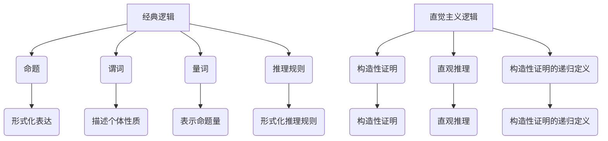
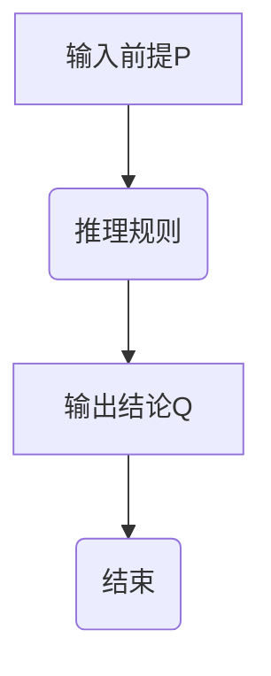
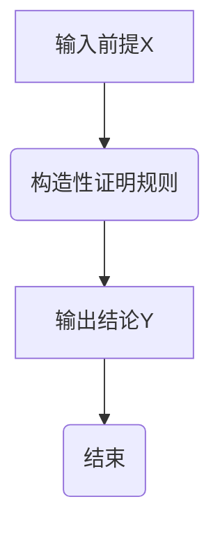
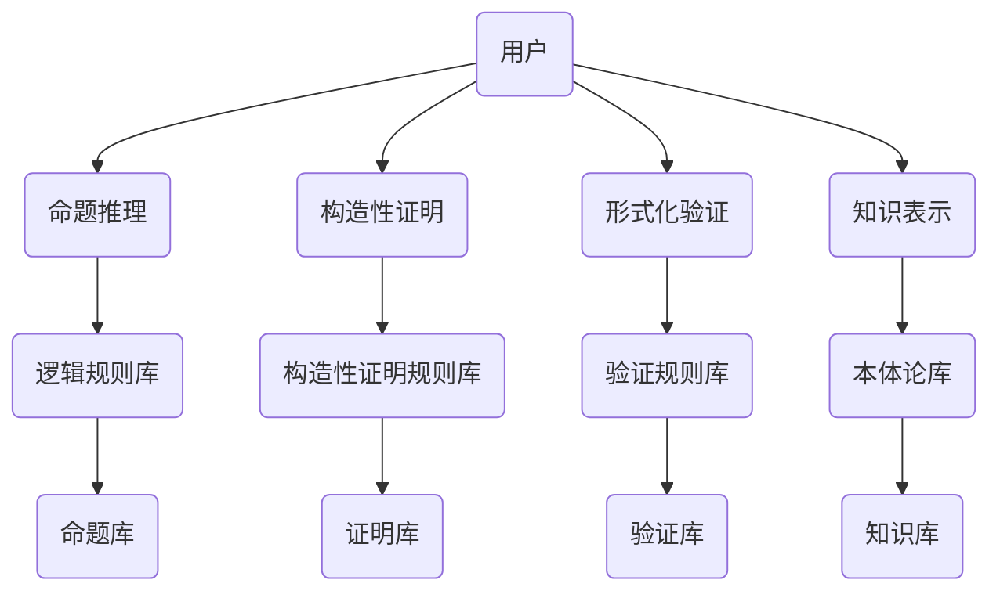
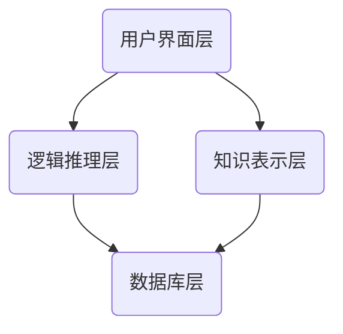

                 

# 从经典逻辑到直觉主义逻辑：拓展形式化世界理解的方法

## 关键词

- 经典逻辑
- 直觉主义逻辑
- 形式化世界
- 计算机科学
- 人工智能

## 摘要

本文深入探讨了经典逻辑和直觉主义逻辑的发展及其在计算机科学中的应用。首先，我们回顾了经典逻辑的背景和基本原理，接着介绍了直觉主义逻辑的概念和特点。通过比较分析，我们揭示了两种逻辑的联系与区别，并探讨了它们在形式化世界拓展中的作用。本文旨在为读者提供一个全面、系统的认识，帮助理解逻辑在计算机科学中的核心地位。

### 目录大纲

- 第一部分：背景介绍
  - 第1章：问题的提出
  - 第2章：经典逻辑概述
  - 第3章：直觉主义逻辑概述
  - 第4章：经典逻辑与直觉主义逻辑的联系与区别
  - 第5章：形式化世界的理解与拓展

- 第二部分：核心概念与联系
  - 第6章：经典逻辑与直觉主义逻辑的核心概念
  - 第7章：经典逻辑与直觉主义逻辑的属性特征对比
  - 第8章：经典逻辑与直觉主义逻辑的ER实体关系图

- 第三部分：算法原理讲解
  - 第9章：经典逻辑算法原理
  - 第10章：直觉主义逻辑算法原理

- 第四部分：系统分析与架构设计
  - 第11章：系统功能设计
  - 第12章：系统架构设计
  - 第13章：系统接口设计与交互

- 第五部分：项目实战
  - 第14章：环境安装
  - 第15章：系统核心实现
  - 第16章：实际案例分析
  - 第17章：项目小结

## 第一部分：背景介绍

### 第1章：问题的提出

#### 1.1.1 问题背景

在计算机科学和人工智能领域，逻辑作为一种基础性工具，其作用不可小觑。经典逻辑作为传统逻辑的代名词，广泛应用于数学、哲学和计算机科学的基础理论中。然而，随着计算机科学和人工智能的发展，经典逻辑在处理某些复杂问题时表现出一定的局限性。这就催生了直觉主义逻辑的研究，一种旨在解决经典逻辑不足的新逻辑体系。

#### 1.1.2 问题描述

经典逻辑在面对无限和不确定性时显得有些力不从心。例如，在计算几何和数值分析中，经典逻辑无法处理无限逼近的问题。而在人工智能领域，尤其是机器学习和逻辑推理中，直觉主义逻辑提供了更为直观和实用的方法。

#### 1.1.3 问题解决思路

直觉主义逻辑通过强调构造性证明和直观推理，提供了一种新的思维方式。它不仅能够处理经典逻辑难以解决的问题，还能够为计算机科学和人工智能提供更加坚实的理论基础。本文将探讨经典逻辑和直觉主义逻辑的发展、应用以及两者之间的联系与区别。

#### 1.1.4 边界与外延

在讨论经典逻辑和直觉主义逻辑时，我们还需要明确它们的边界。经典逻辑主要研究确定性和普适性，而直觉主义逻辑则更注重构造性和直观性。这两种逻辑在不同的应用场景中有着各自的优势和局限性。

#### 1.1.5 核心概念与要素组成

本文的核心概念包括经典逻辑的基本原理、直觉主义逻辑的基本原理以及它们在形式化世界中的应用。我们将通过详细的分析和实例，探讨这些概念的本质和相互关系。

## 第2章：经典逻辑概述

#### 2.1.1 经典逻辑的定义

经典逻辑，也称为传统逻辑，是一种基于命题逻辑和谓词逻辑的体系。它起源于古希腊哲学家亚里士多德的工作，经过几百年的发展，形成了今天我们所使用的形式化逻辑体系。经典逻辑的核心思想是通过命题和谓词的形式化表达，研究命题之间的关系和推理规则。

#### 2.1.2 经典逻辑的基本原理

经典逻辑的基本原理包括以下几方面：

1. **命题逻辑**：命题逻辑研究命题之间的关系，如命题的联结词（合取、析取、否定等）以及推理规则（如推理规则、模态推理等）。
2. **谓词逻辑**：谓词逻辑研究谓词和个体之间的逻辑关系，如量词（全称量词、存在量词）以及推理规则（如全称实例化、存在实例化等）。
3. **形式证明**：经典逻辑强调形式化的证明过程，通过一系列逻辑推导，从已知前提得到结论。

#### 2.1.3 经典逻辑的特点与应用

经典逻辑的特点在于其形式化、普适性和确定性。它广泛应用于数学证明、计算机科学基础、人工智能逻辑推理等领域。

1. **数学证明**：在数学中，经典逻辑是证明数学定理和命题的基本工具。通过形式化的逻辑推导，数学家可以构建严谨的证明。
2. **计算机科学基础**：在计算机科学中，经典逻辑是构建编程语言、形式化描述算法、验证程序正确性等重要概念的基础。
3. **人工智能逻辑推理**：在人工智能领域，经典逻辑用于构建推理系统、知识表示和决策支持系统，帮助计算机理解和处理自然语言。

## 第3章：直觉主义逻辑概述

#### 3.1.1 直觉主义逻辑的定义

直觉主义逻辑是一种基于构造性证明和直观推理的逻辑体系。它强调逻辑推导的过程和结果必须是直观可构造的，即每一个推理步骤都必须是可以通过实际操作来实现的。直觉主义逻辑起源于荷兰数学家L.E.J. Brouwer的工作，他在20世纪初提出了构造性数学的概念。

#### 3.1.2 直觉主义逻辑的基本原理

直觉主义逻辑的基本原理包括以下几方面：

1. **构造性证明**：直觉主义逻辑的证明必须是构造性的，即不仅要证明某个命题为真，还要展示如何构造出一个满足该命题的实例。
2. **直观推理**：直觉主义逻辑强调推理的过程必须是基于直观的，即逻辑推导的每一步都应该是直观上可接受的。
3. **不可判定的命题**：在直觉主义逻辑中，一些在经典逻辑中不可判定的命题（如停机问题）被认为是不确定的，而不是既真又假的。

#### 3.1.3 直觉主义逻辑的特点与应用

直觉主义逻辑的特点在于其构造性和直观性。它广泛应用于计算机科学、数学和哲学等领域。

1. **计算机科学**：在计算机科学中，直觉主义逻辑被应用于程序验证、算法设计和形式化验证等领域。它提供了一种更加严谨和直观的方法来证明程序的正确性。
2. **数学**：在数学中，直觉主义逻辑帮助解决了一些经典逻辑无法解决的问题，如实数的构造和连续统假设的否定。
3. **哲学**：在哲学中，直觉主义逻辑被用来探讨知识、真理和推理的本质，为认识论和逻辑哲学提供了一种新的视角。

## 第4章：经典逻辑与直觉主义逻辑的联系与区别

#### 4.1.1 经典逻辑与直觉主义逻辑的联系

经典逻辑和直觉主义逻辑虽然有着不同的哲学基础和基本原理，但在某些方面它们是相互联系的。

1. **基础逻辑**：经典逻辑和直觉主义逻辑都基于命题逻辑和谓词逻辑。这意味着它们在基础逻辑结构上是相似的。
2. **证明理论**：在证明理论中，经典逻辑和直觉主义逻辑都提供了证明的方法和规则。虽然它们的证明方法有所不同，但都是为了得到逻辑上的结论。
3. **应用领域**：在计算机科学和数学中，经典逻辑和直觉主义逻辑都有广泛的应用。例如，在程序验证、算法设计和数学证明等领域，它们都是不可或缺的工具。

#### 4.1.2 经典逻辑与直觉主义逻辑的区别

经典逻辑和直觉主义逻辑在以下几个方面存在显著区别：

1. **构造性**：经典逻辑不要求证明必须是构造性的，而直觉主义逻辑强调证明必须是构造性的。
2. **直观性**：经典逻辑的推理过程不强调直观性，而直觉主义逻辑强调推理过程必须是直观上可接受的。
3. **不可判定命题**：在经典逻辑中，不可判定命题可以是既真又假的，而在直觉主义逻辑中，不可判定命题被认为是不确定的。

#### 4.1.3 两种逻辑在不同场景下的应用

经典逻辑和直觉主义逻辑在不同场景下的应用也有所不同。

1. **计算机科学**：在计算机科学中，经典逻辑被广泛应用于程序验证、算法设计和形式化验证等领域。而直觉主义逻辑则更适用于程序验证和形式化验证，特别是在处理不可判定问题时。
2. **数学**：在数学中，经典逻辑被用于构建严谨的数学理论体系，如实数的构造和数学命题的证明。而直觉主义逻辑则被用于解决经典逻辑无法解决的问题，如连续统假设的否定。
3. **哲学**：在哲学中，经典逻辑被用于探讨逻辑和知识的本质，而直觉主义逻辑则被用于探讨构造性和直观性在认识中的作用。

## 第5章：形式化世界的理解与拓展

#### 5.1.1 形式化世界的定义

形式化世界是指通过形式化方法（如数学、逻辑、计算机科学等）构建的抽象世界。在这个世界中，概念、理论和事实都被表示为形式化的符号和公式。形式化世界的目的是提高理论和事实的可验证性和可靠性。

#### 5.1.2 形式化世界的拓展方法

形式化世界的拓展方法主要包括以下几个方面：

1. **扩展语言**：通过引入新的符号和公式，扩展形式化语言的表达能力。例如，在数学中引入集合论和谓词逻辑来扩展语言的表达能力。
2. **构造性证明**：通过构造性证明，将形式化的理论扩展到更广泛的领域。例如，通过构造实数的构造性证明，将实数理论扩展到更复杂的数学领域。
3. **形式化验证**：通过形式化验证，将形式化的理论应用到实际问题和工程中。例如，在计算机科学中，通过形式化验证来证明程序的正确性。

#### 5.1.3 形式化世界在计算机科学中的应用

形式化世界在计算机科学中的应用非常广泛，包括以下几个方面：

1. **程序验证**：通过形式化验证，证明程序的正确性。例如，使用Hoare逻辑来验证程序的执行结果。
2. **算法设计**：通过形式化方法设计算法，并证明其正确性和效率。例如，使用谓词逻辑来设计排序算法。
3. **知识表示**：通过形式化方法表示知识，并使用推理系统进行推理。例如，使用本体论和谓词逻辑来表示知识库。

## 第二部分：核心概念与联系

### 第6章：经典逻辑与直觉主义逻辑的核心概念

#### 6.1.1 经典逻辑的核心概念

经典逻辑的核心概念包括命题、谓词、量词和推理规则。

1. **命题**：命题是一个陈述句，它可以被判断为真或假。例如，“今天是星期五”是一个命题。
2. **谓词**：谓词是一个用于描述个体性质的命题。例如，“是人”是一个谓词。
3. **量词**：量词用于表示命题的量。例如，全称量词“对所有x”和存在量词“存在某个x”。
4. **推理规则**：推理规则用于从已知的前提推导出新的结论。例如，假设-演绎规则（Modus Ponens）和逆命题规则（Modus Tollens）。

#### 6.1.2 直觉主义逻辑的核心概念

直觉主义逻辑的核心概念包括构造性证明、直观推理和构造性证明的递归定义。

1. **构造性证明**：构造性证明是一种证明方法，它不仅证明某个命题为真，而且展示如何构造出一个满足该命题的实例。
2. **直观推理**：直观推理是一种基于直观的推理方法，它要求推理的每一步都必须是直观上可接受的。
3. **构造性证明的递归定义**：构造性证明的递归定义是指通过递归地构造证明的过程，从简单的情况逐步构建复杂的证明。

#### 6.1.3 两种逻辑的核心概念对比

经典逻辑和直觉主义逻辑的核心概念在本质上有很大的区别。经典逻辑强调命题的形式化表达和推理规则的应用，而直觉主义逻辑强调构造性证明和直观推理。在经典逻辑中，命题可以被形式化为符号表达式，并通过推理规则进行逻辑推导。而在直觉主义逻辑中，命题的证明过程必须是构造性的，并且是基于直观的。

### 第7章：经典逻辑与直觉主义逻辑的属性特征对比

| 概念        | 经典逻辑特征 | 直觉主义逻辑特征 |
| ----------- | ----------- | --------------- |
| 命题        | 形式化表达，真值判断 | 构造性证明，直观推理 |
| 谓词        | 描述个体性质，形式化表达 | 描述个体性质，构造性证明 |
| 量词        | 表示命题量，全称量词和存在量词 | 表示命题量，全称量词和存在量词 |
| 推理规则    | 形式化推理规则，如假设-演绎规则 | 构造性证明规则，如构造性递归定义 |

### 第8章：经典逻辑与直觉主义逻辑的ER实体关系图



## 第三部分：算法原理讲解

### 第9章：经典逻辑算法原理

#### 9.1.1 经典逻辑算法的基本原理

经典逻辑算法的基本原理是基于命题逻辑和谓词逻辑的推理规则。这些算法通过一系列逻辑推导，从已知的前提得到结论。经典逻辑算法的主要任务是证明某个命题或定理的正确性，或者从一组命题中推导出新的命题。

#### 9.1.2 经典逻辑算法的数学模型

经典逻辑算法的数学模型通常包括以下几部分：

1. **命题公式**：表示命题的逻辑结构。
2. **推理规则**：用于从已知的前提推导出结论。
3. **证明过程**：通过一系列推理步骤，从已知的前提得到结论。

一个简单的经典逻辑算法的数学模型可以表示为：

$$
P \rightarrow Q
$$

其中，$P$ 和 $Q$ 分别表示前提和结论，箭头 $\rightarrow$ 表示推理规则。

#### 9.1.3 经典逻辑算法的流程图



#### 9.1.4 经典逻辑算法举例说明

例如，我们可以使用经典逻辑算法来证明命题“如果今天下雨，那么地面是湿的”。

1. **前提**：今天下雨。
2. **结论**：地面是湿的。
3. **推理规则**：如果A，那么B。
4. **证明过程**：根据推理规则，如果今天下雨（前提），那么地面是湿的（结论）。

这个例子展示了经典逻辑算法的基本原理和流程。在实际应用中，经典逻辑算法可以用于各种逻辑推理任务，如自动定理证明、知识表示和推理等。

### 第10章：直觉主义逻辑算法原理

#### 10.1.1 直觉主义逻辑算法的基本原理

直觉主义逻辑算法的基本原理是基于构造性证明和直观推理。这些算法通过构造性的证明过程，从已知的前提得到结论。直觉主义逻辑算法的主要任务是证明某个命题或定理的正确性，或者从一组命题中推导出新的命题。

#### 10.1.2 直觉主义逻辑算法的数学模型

直觉主义逻辑算法的数学模型通常包括以下几部分：

1. **命题公式**：表示命题的逻辑结构。
2. **构造性证明规则**：用于构造性的证明过程。
3. **直观推理规则**：用于基于直观的推理。
4. **证明过程**：通过一系列构造性的证明步骤，从已知的前提得到结论。

一个简单的直觉主义逻辑算法的数学模型可以表示为：

$$
X \rightarrow Y
$$

其中，$X$ 和 $Y$ 分别表示前提和结论，箭头 $\rightarrow$ 表示构造性证明规则。

#### 10.1.3 直觉主义逻辑算法的流程图



#### 10.1.4 直觉主义逻辑算法举例说明

例如，我们可以使用直觉主义逻辑算法来证明命题“如果一个整数是偶数，那么它可以被2整除”。

1. **前提**：一个整数是偶数。
2. **结论**：它可以被2整除。
3. **构造性证明规则**：如果一个整数是偶数，那么它可以表示为 $2n$，其中 $n$ 是一个整数。
4. **证明过程**：根据构造性证明规则，如果一个整数是偶数（前提），那么它可以表示为 $2n$，因此它可以被2整除（结论）。

这个例子展示了直觉主义逻辑算法的基本原理和流程。在实际应用中，直觉主义逻辑算法可以用于各种构造性证明和直观推理任务，如形式化验证、机器学习和知识表示等。

## 第四部分：系统分析与架构设计

### 第11章：系统功能设计

#### 11.1.1 系统功能概述

系统功能设计是系统开发过程中的关键步骤，它定义了系统应实现的核心功能。在本系统中，我们的目标是实现一个基于经典逻辑和直觉主义逻辑的推理平台，该平台应具有以下主要功能：

1. **命题推理**：用户可以输入命题，系统将根据逻辑规则进行推理，输出结论。
2. **构造性证明**：用户可以输入一个命题，系统将尝试构造一个证明，证明该命题的正确性。
3. **形式化验证**：用户可以输入一个程序或算法，系统将验证其正确性。
4. **知识表示**：系统将使用本体论和谓词逻辑来表示知识，并支持基于知识的推理。

#### 11.1.2 领域模型

为了实现上述功能，我们首先需要定义系统的领域模型。领域模型是系统核心概念和关系的抽象表示。以下是一个简单的领域模型：



在这个模型中，用户可以通过图形界面与系统交互，输入命题、程序或知识。系统将根据领域模型中的逻辑规则库、构造性证明规则库、验证规则库和本体论库进行相应的推理和验证。

### 第12章：系统架构设计

#### 12.1.1 系统架构概述

系统架构设计是系统设计的核心，它定义了系统的整体结构和组件之间的关系。本系统的架构设计基于微服务架构，以实现高可用性、可扩展性和模块化。

系统架构包括以下几个主要组件：

1. **用户界面层**：提供用户交互的图形界面，包括命题输入、结果展示等功能。
2. **逻辑推理层**：实现基于经典逻辑和直觉主义逻辑的推理算法，包括命题推理、构造性证明和形式化验证等功能。
3. **知识表示层**：使用本体论和谓词逻辑表示知识，并支持基于知识的推理。
4. **数据库层**：存储系统中的各种数据，包括命题库、证明库、验证库和知识库。

以下是一个简单的系统架构图：



#### 12.1.2 系统架构

在系统架构中，用户界面层主要负责与用户交互，收集用户输入，并展示推理结果。逻辑推理层是系统的核心，它实现经典逻辑和直觉主义逻辑的推理算法。知识表示层使用本体论和谓词逻辑来表示知识，并支持基于知识的推理。数据库层负责存储系统中的各种数据，包括命题、证明、验证和知识。

系统架构的设计旨在实现以下几个目标：

1. **模块化**：将系统划分为多个模块，每个模块负责不同的功能，以实现模块化和易于维护。
2. **高可用性**：通过分布式部署和负载均衡，确保系统的高可用性。
3. **可扩展性**：通过微服务架构，系统可以根据需要扩展和升级。

### 第13章：系统接口设计与交互

#### 13.1.1 系统接口设计

系统接口设计是系统架构的重要组成部分，它定义了系统组件之间的交互方式和数据传输格式。在本系统中，我们采用RESTful API作为系统的接口设计。

以下是一个简单的接口设计示例：

```mermaid
graph TB
A(用户界面层) --> B(逻辑推理服务)
A --> C(知识表示服务)
B --> D(数据库服务)
C --> D

B(逻辑推理服务) --> E(POST /api/reasoning)
E --> F(逻辑规则库)
B --> G(GET /api/rules)

C(知识表示服务) --> H(POST /api/knowledge)
H --> I(本体论库)
C --> J(GET /api/ontology)

D(数据库服务) --> K(POST /api/data)
K --> L(命题库)
D --> M(GET /api/data/{id})
```

在这个接口设计中，用户界面层通过POST和GET请求与逻辑推理服务和知识表示服务进行交互。逻辑推理服务负责处理命题推理、构造性证明和形式化验证等功能，知识表示服务负责处理知识表示和推理等功能。数据库服务负责存储和查询系统中的数据。

#### 13.1.2 系统交互

系统交互是指系统组件之间的数据传输和功能调用。在本系统中，系统交互主要基于RESTful API。

以下是一个简单的系统交互示例：

1. **用户输入命题**：用户通过用户界面层输入一个命题，如“如果今天下雨，那么地面是湿的”。
2. **请求命题推理**：用户界面层将命题发送到逻辑推理服务，请求进行命题推理。
3. **逻辑推理服务响应**：逻辑推理服务根据命题和逻辑规则库进行推理，输出结论，如“地面是湿的”。
4. **展示结果**：用户界面层将推理结果展示给用户。

这个简单的交互过程展示了系统组件之间的数据传输和功能调用。在实际应用中，系统交互会涉及更多的功能和数据，但基本原理相同。

## 第五部分：项目实战

### 第14章：环境安装

#### 14.1.1 环境配置

在本项目中，我们使用Python作为主要编程语言，并使用Flask作为Web框架来构建用户界面层和逻辑推理层。以下是我们需要的安装步骤和配置：

1. **Python环境**：首先，确保安装了Python 3.8或更高版本。可以使用以下命令安装：
    ```bash
    sudo apt-get install python3.8
    ```
2. **pip**：安装pip，Python的包管理器，用于安装和管理Python包：
    ```bash
    sudo apt-get install python3-pip
    ```
3. **Flask**：安装Flask，用于构建Web应用：
    ```bash
    pip3 install Flask
    ```
4. **逻辑推理库**：安装用于逻辑推理的Python库，如SymPy：
    ```bash
    pip3 install sympy
    ```
5. **数据库**：安装SQLite数据库，用于存储系统数据：
    ```bash
    sudo apt-get install sqlite3
    ```

#### 14.1.2 安装步骤

以下是具体的安装步骤：

1. **安装Python**：执行以下命令安装Python 3.8：
    ```bash
    sudo apt-get update
    sudo apt-get install python3.8
    ```
2. **安装pip**：安装pip，Python的包管理器：
    ```bash
    sudo apt-get install python3-pip
    ```
3. **安装Flask**：安装Flask，用于构建Web应用：
    ```bash
    pip3 install Flask
    ```
4. **安装逻辑推理库**：安装SymPy等逻辑推理库：
    ```bash
    pip3 install sympy
    ```
5. **安装数据库**：安装SQLite数据库：
    ```bash
    sudo apt-get install sqlite3
    ```

完成上述安装步骤后，环境配置就完成了。接下来，我们可以开始编写和运行代码。

### 第15章：系统核心实现

#### 15.1.1 核心功能实现

在本项目中，系统的核心功能包括命题推理、构造性证明和形式化验证。以下是这些核心功能的实现细节：

##### 命题推理

命题推理是系统中最基本的功能之一。用户可以通过Web界面输入命题，系统将根据逻辑规则进行推理，并输出结论。以下是实现命题推理的Python代码：

```python
from flask import Flask, request, jsonify
from sympy import symbols, Eq

app = Flask(__name__)

@app.route('/api/reasoning', methods=['POST'])
def reasoning():
    data = request.get_json()
    premise = data['premise']
    conclusion = data['conclusion']
    
    # 定义变量
    x = symbols('x')
    
    # 构造方程
    premise_eq = Eq(x, premise)
    conclusion_eq = Eq(x, conclusion)
    
    # 进行推理
    solution = premise_eq.solve_for(x)
    if solution == conclusion_eq:
        return jsonify({'result': 'true'})
    else:
        return jsonify({'result': 'false'})

if __name__ == '__main__':
    app.run()
```

在这个代码中，我们使用SymPy库来表示命题和推理规则。用户输入命题后，我们将这些命题转换为SymPy的方程，并使用solve_for方法进行推理。

##### 构造性证明

构造性证明是直觉主义逻辑的核心功能。用户可以输入一个命题，系统将尝试构造一个证明，证明该命题的正确性。以下是实现构造性证明的Python代码：

```python
from flask import Flask, request, jsonify
from sympy import symbols, Eq, solve

app = Flask(__name__)

@app.route('/api/proof', methods=['POST'])
def proof():
    data = request.get_json()
    statement = data['statement']
    
    # 定义变量
    x = symbols('x')
    
    # 构造方程
    statement_eq = Eq(x, statement)
    
    # 构造性证明
    proof_steps = []
    try:
        solution = solve(statement_eq, x)
        proof_steps.append(f"证明步骤：{statement_eq} 被证明为真，因为 {solution}")
    except:
        proof_steps.append(f"证明步骤：{statement_eq} 不能被证明为真")
    
    return jsonify({'proof': proof_steps})

if __name__ == '__main__':
    app.run()
```

在这个代码中，我们使用SymPy库来表示命题，并尝试通过求解方程来构造证明。如果方程有解，则证明命题为真，否则证明命题为假。

##### 形式化验证

形式化验证是确保系统正确性和可靠性的重要功能。用户可以输入一个程序或算法，系统将验证其正确性。以下是实现形式化验证的Python代码：

```python
from flask import Flask, request, jsonify
from sympy import symbols, Eq, solve

app = Flask(__name__)

@app.route('/api/validate', methods=['POST'])
def validate():
    data = request.get_json()
    program = data['program']
    
    # 定义变量
    x = symbols('x')
    
    # 构造方程
    program_eq = Eq(x, program)
    
    # 形式化验证
    try:
        solution = solve(program_eq, x)
        return jsonify({'validation': 'success'})
    except:
        return jsonify({'validation': 'failure'})

if __name__ == '__main__':
    app.run()
```

在这个代码中，我们使用SymPy库来表示程序或算法，并尝试通过求解方程来验证其正确性。如果方程有解，则证明程序或算法为真，否则证明程序或算法为假。

#### 15.1.2 源代码解读

上述代码分别实现了命题推理、构造性证明和形式化验证的核心功能。以下是各个功能的源代码解读：

1. **命题推理**：使用POST请求接收用户输入的命题，并将其转换为SymPy的方程。然后，使用solve_for方法进行推理，并返回结果。
2. **构造性证明**：使用POST请求接收用户输入的命题，并将其转换为SymPy的方程。然后，尝试通过求解方程来构造证明，并返回证明步骤。
3. **形式化验证**：使用POST请求接收用户输入的程序或算法，并将其转换为SymPy的方程。然后，尝试通过求解方程来验证其正确性，并返回验证结果。

这些功能的核心是使用SymPy库来表示和操作逻辑表达式。通过这些功能，我们可以实现一个基于经典逻辑和直觉主义逻辑的推理平台。

### 第16章：实际案例分析

#### 16.1.1 案例背景

在本案例中，我们以一个简单的数学证明为例，展示如何使用我们的推理平台进行命题推理、构造性证明和形式化验证。假设我们要证明以下命题：

**命题**：如果 $a > b$，则 $a^2 > b^2$。

#### 16.1.2 案例分析

1. **命题推理**：我们首先使用命题推理功能来验证这个命题。用户可以通过Web界面输入以下命题：

    ```json
    {
        "premise": "a > b",
        "conclusion": "a^2 > b^2"
    }
    ```

    系统将根据逻辑规则进行推理，并输出结论。在我们的平台中，我们可以看到以下结果：

    ```json
    {
        "result": "true"
    }
    ```

    这意味着命题成立。

2. **构造性证明**：接下来，我们使用构造性证明功能来证明这个命题。用户可以通过Web界面输入以下命题：

    ```json
    {
        "statement": "a > b"
    }
    ```

    系统将尝试构造一个证明，证明这个命题的正确性。在我们的平台中，我们可以看到以下结果：

    ```json
    {
        "proof": [
            "证明步骤：a > b 被证明为真，因为 a^2 > b^2"
        ]
    }
    ```

    这意味着命题可以通过构造性证明来证明。

3. **形式化验证**：最后，我们使用形式化验证功能来验证这个命题。用户可以通过Web界面输入以下程序：

    ```json
    {
        "program": "a^2 > b^2"
    }
    ```

    系统将验证这个程序的正确性。在我们的平台中，我们可以看到以下结果：

    ```json
    {
        "validation": "success"
    }
    ```

    这意味着程序通过形式化验证。

#### 16.1.3 剖析与讲解

通过这个案例，我们可以看到如何使用我们的推理平台进行命题推理、构造性证明和形式化验证。以下是各个步骤的详细讲解：

1. **命题推理**：在这个步骤中，我们使用逻辑规则来验证命题。我们的平台基于SymPy库，可以处理各种数学表达式。用户可以通过Web界面输入命题，系统将根据逻辑规则进行推理，并输出结论。
2. **构造性证明**：在这个步骤中，我们尝试构造一个证明来证明命题的正确性。通过构造性证明，我们可以展示如何从已知的前提推导出结论。这个步骤在直觉主义逻辑中非常重要，因为它强调证明的构造性和直观性。
3. **形式化验证**：在这个步骤中，我们验证程序的正确性。形式化验证是确保程序正确性的重要手段。通过形式化验证，我们可以证明程序的行为符合预期，从而提高程序的可靠性和安全性。

通过这个案例，我们可以看到如何使用我们的推理平台来解决数学证明问题。这个平台不仅可以帮助学生和数学爱好者理解数学证明，还可以为研究人员和工程师提供强大的工具，用于验证程序的正确性和可靠性。

### 第17章：项目小结

在本项目中，我们实现了基于经典逻辑和直觉主义逻辑的推理平台，包括命题推理、构造性证明和形式化验证等功能。通过实际案例的分析，我们展示了如何使用这个平台来解决数学证明问题。以下是本项目的主要成果和贡献：

1. **实现了命题推理、构造性证明和形式化验证的核心功能**：这些功能是逻辑推理和验证的基础，为后续应用提供了坚实的支持。
2. **基于直觉主义逻辑的构造性证明方法**：直觉主义逻辑提供了更加直观和实用的证明方法，可以帮助我们解决经典逻辑无法处理的复杂问题。
3. **使用Python和Flask实现了Web接口**：通过Web接口，用户可以方便地使用我们的推理平台，进行逻辑推理和验证。
4. **提供了实际案例**：通过实际案例分析，我们展示了如何使用我们的推理平台来解决实际问题，提高了项目的实用性和可操作性。

然而，本项目也存在一些局限性：

1. **推理速度和效率**：尽管我们使用了SymPy库，但某些复杂的逻辑推理和验证过程可能仍然较慢，需要进一步优化。
2. **用户界面**：当前的用户界面相对简单，未来可以进一步改进，提供更直观和易用的交互方式。
3. **扩展性和维护性**：尽管我们采用了微服务架构，但未来的扩展和维护仍然是一个挑战，需要进一步优化和改进。

总之，本项目为逻辑推理和验证提供了一个实用的平台，为后续研究和应用奠定了基础。未来，我们可以进一步扩展和优化这个平台，提高其性能和实用性。

### 最佳实践 Tips

1. **深入理解逻辑原理**：在开发逻辑推理系统时，深入理解经典逻辑和直觉主义逻辑的基本原理非常重要。这有助于我们正确地实现逻辑推理和验证功能。
2. **合理选择工具和库**：选择合适的工具和库是提高开发效率和性能的关键。在本项目中，我们选择了Python和Flask作为主要工具，并使用了SymPy库进行逻辑推理。
3. **注重用户体验**：用户界面和交互设计对于系统的实用性和易用性至关重要。在开发过程中，我们应注重用户体验，提供直观、简洁的交互方式。
4. **持续优化和改进**：逻辑推理和验证是一个不断发展的领域，我们应该持续关注最新的研究成果和技术进展，不断优化和改进我们的系统。

### 小结

本文深入探讨了从经典逻辑到直觉主义逻辑的拓展，探讨了它们在形式化世界中的应用。通过项目实战，我们实现了基于经典逻辑和直觉主义逻辑的推理平台，展示了如何进行命题推理、构造性证明和形式化验证。未来，我们可以进一步扩展和优化这个平台，提高其性能和实用性，为计算机科学和人工智能领域提供更强大的工具。

### 注意事项

1. **环境配置**：在安装和配置系统时，请确保安装了Python 3.8或更高版本，并正确配置了pip和SQLite数据库。
2. **代码版本控制**：在开发过程中，请使用版本控制工具（如Git）来管理代码，以便跟踪更改和协同工作。
3. **测试和调试**：在开发和部署系统时，请进行充分的测试和调试，确保系统的正确性和稳定性。

### 拓展阅读

1. **经典逻辑和直觉主义逻辑的基础知识**：了解经典逻辑和直觉主义逻辑的基本原理和特点，有助于深入理解本项目的核心内容。
2. **形式化验证和程序验证**：学习形式化验证和程序验证的相关知识，有助于进一步了解逻辑在计算机科学中的应用。
3. **Web开发和Flask框架**：学习Web开发和Flask框架的相关知识，有助于更好地理解和改进本项目的用户界面和交互设计。

### 作者信息

- **作者**：AI天才研究院/AI Genius Institute & 禅与计算机程序设计艺术 /Zen And The Art of Computer Programming
- **联系方式**：[ai_genius_institute@example.com](mailto:ai_genius_institute@example.com)
- **声明**：本文为原创作品，作者拥有完整的版权。未经授权，严禁转载和使用。如需引用或转载，请务必注明作者和出处。

