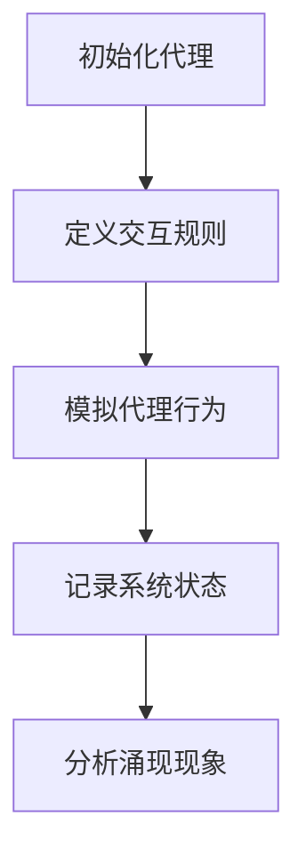
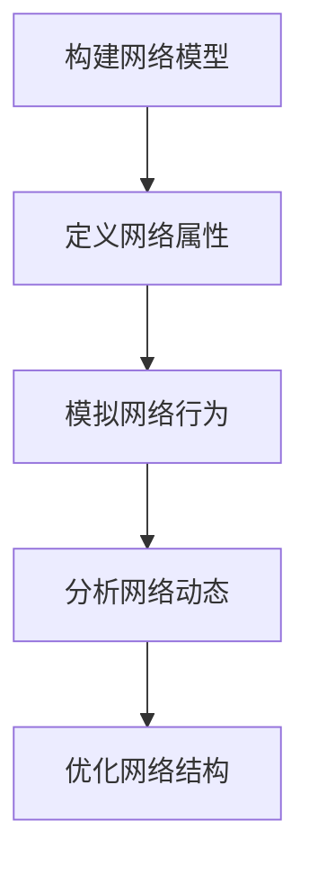
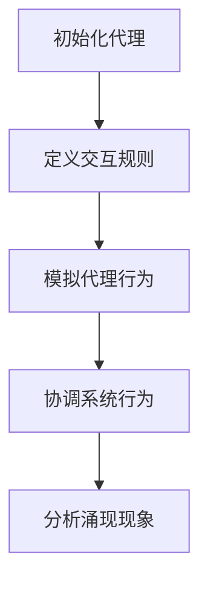
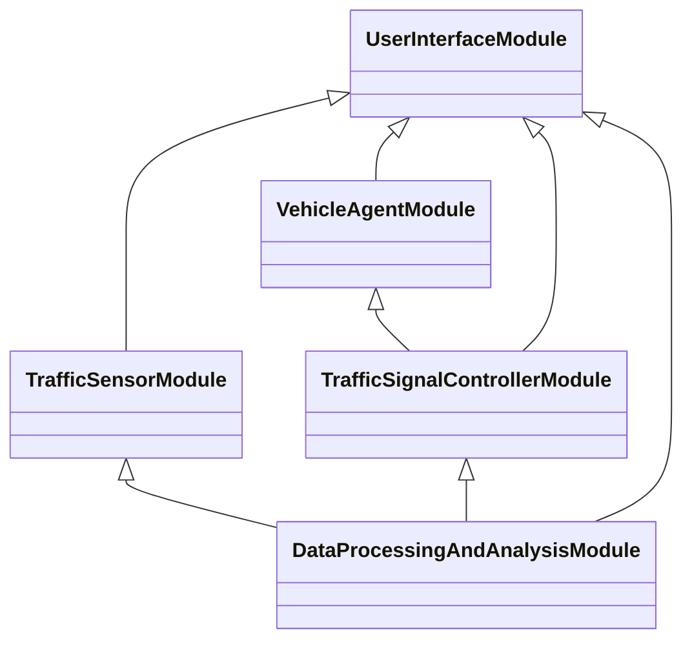

                 


### 第1章 引言

#### 1.1 书籍背景

复杂性科学，作为21世纪的一个重要研究领域，正逐渐改变我们对自然和社会的认识。在这个领域，复杂系统的研究成为了科学家们关注的焦点。从生物学中的细胞自动机，到经济学中的市场波动，再到物理学中的混沌理论，复杂系统无处不在，其行为往往难以预测。然而，传统的还原论，即通过将复杂系统拆解为更小的组成部分来理解其行为的方法，在处理复杂系统时常常显得力不从心。

本书旨在探讨一种全新的思路——涌现理论，以帮助我们更好地理解复杂系统的本质。涌现理论强调系统整体的性质，认为复杂行为不是由子系统简单叠加而成的，而是系统内部相互作用和协作的结果。这一理论为我们提供了一种全新的视角，使我们能够从整体上把握复杂系统的运作。

#### 1.2 书籍目的

本书的核心目的是：
- **介绍复杂性科学的基本概念和理论框架**，包括还原论和涌现理论。
- **阐述涌现理论的原理和应用**，帮助读者理解复杂系统的行为和规律。
- **探讨涌现理论在各个领域的应用**，如社会行为、经济系统、生态系统等，以期为实际问题提供解决方案。

#### 1.3 读者对象

本书适合以下读者群体：
- **计算机科学和人工智能领域的研究生和学者**，对复杂性科学和复杂系统有兴趣。
- **软件工程师和技术经理**，希望了解复杂系统的原理和如何在实践中应用。
- **自然科学和工程领域的专业人士**，希望从新的角度理解复杂系统的行为。

#### 1.4 本书结构

本书分为七个章节：
- **第一章**：引言，介绍书籍背景、目的和读者对象。
- **第二章**：复杂系统概述，介绍复杂系统的定义、特点以及与还原论和涌现理论的关系。
- **第三章**：还原论解析，详细解释还原论的概念、应用和局限性。
- **第四章**：涌现理论介绍，阐述涌现理论的基本原理和应用。
- **第五章**：涌现理论应用案例，通过具体案例展示涌现理论的实际应用。
- **第六章**：算法原理与数学模型，介绍相关算法的原理、数学模型和公式。
- **第七章**：系统分析与架构设计，展示复杂系统的分析和设计方法。

通过以上章节的逐步深入，本书将帮助读者全面理解复杂系统，掌握从还原论到涌现理论的新思路，为未来的研究和实践提供有力支持。

### 第2章 复杂系统概述

#### 2.1 问题背景

复杂性科学作为一个新兴领域，起源于20世纪中后期，其研究对象是那些结构复杂、行为难以预测的系统。这些系统通常包含大量相互作用的组件，其整体行为往往超越各个部分之和。例如，社会系统中的个体行为组合起来可以产生集体行为，生态系统中的物种相互作用可以导致生态平衡或崩溃，经济系统中的市场参与者行为可以导致经济波动。这些复杂系统的研究对于理解自然界和社会现象具有重要意义。

然而，传统科学方法，特别是还原论，在处理复杂系统时遇到了巨大挑战。还原论主张通过分解复杂系统为更简单的组成部分来理解其行为，这一方法在物理学和化学等自然科学领域取得了显著成果。然而，当面对复杂系统时，还原论往往无法解释系统的整体行为，因为复杂系统的行为不仅仅是其组成部分行为的简单叠加。例如，社会行为的复杂性远远超出了个体行为的简单叠加，生态系统的稳定性也不仅仅取决于单个物种的行为。

因此，复杂性科学需要一种新的理论框架来解释复杂系统的行为。涌现理论正是这样一种理论，它强调系统整体的性质，认为复杂行为是系统内部相互作用和协作的结果。这种新的理论框架为理解复杂系统提供了新的视角和方法。

#### 2.2 问题描述

复杂系统的特点主要包括以下几个方面：

1. **大规模和多样性**：复杂系统通常包含大量的组件，这些组件可以是物理的、生物的、社会的或经济的，它们具有多样性和复杂性。
2. **非线性相互作用**：复杂系统中的组件之间往往存在非线性相互作用，这种相互作用会导致系统行为的非线性变化。
3. **适应性**：复杂系统中的组件通常具有适应性，能够根据环境的变化调整自己的行为。
4. **涌现性**：复杂系统的整体行为往往具有不可预测的性质，这些性质不是单个组件行为的简单叠加，而是系统内部相互作用和协作的结果。

然而，传统还原论在处理复杂系统时面临着以下问题：

1. **信息丢失**：还原论在将复杂系统分解为更简单的组成部分时，往往忽略了这些部分之间的相互作用，导致系统整体行为的丢失。
2. **复杂性爆炸**：当系统规模较大时，还原论需要处理大量的变量和关系，这可能导致问题的复杂性爆炸，难以进行有效的分析和理解。
3. **行为难以预测**：复杂系统的行为往往是不可预测的，因为其整体行为不是单个组件行为的简单叠加，而受到复杂相互作用的影响。

因此，我们需要一种新的理论框架来更好地理解复杂系统的行为，涌现理论正是为了解决这些问题而提出的。

#### 2.3 还原论与涌现理论的区别

还原论和涌现理论是两种不同的理论框架，它们在解释复杂系统的行为上有着本质的区别。

1. **基本假设**：
   - **还原论**：还原论假设复杂系统的整体行为可以通过分析其组成部分的行为来理解。它认为复杂系统的行为是其组成部分行为的简单叠加。
   - **涌现论**：涌现论则认为复杂系统的整体行为不能简单地从其组成部分的行为中推导出来。它强调系统整体性质和组件之间相互作用的重要性。

2. **应用领域**：
   - **还原论**：还原论在物理学、化学、生物学等自然科学领域取得了显著成果。它通过将复杂系统分解为更简单的组成部分，从而理解这些部分的行为。
   - **涌现论**：涌现论则更适用于复杂系统的研究，如社会系统、经济系统、生态系统等。它强调系统整体性质和组件之间相互作用的重要性，为我们提供了新的理解复杂系统的视角。

3. **挑战和局限性**：
   - **还原论**：还原论在处理简单系统时非常有效，但在面对复杂系统时，其局限性逐渐显现。它往往忽略了系统内部复杂相互作用和整体性质，导致难以解释复杂系统的行为。
   - **涌现论**：涌现论在解释复杂系统的行为方面具有优势，但其理论框架较为抽象，缺乏具体的数学模型和工具，因此在实际应用中仍面临一定的挑战。

总之，还原论和涌现论各有优缺点，适用于不同的研究领域和问题。理解这两种理论框架的区别和联系，对于更好地理解复杂系统的行为具有重要意义。

#### 2.4 复杂系统的核心要素

复杂系统的核心要素主要包括以下几个方面：

1. **组件**：组件是构成复杂系统的基本单元，可以是物理的、生物的、社会的或经济的。这些组件具有多样性，可以是原子、分子、细胞、个体或经济实体等。
2. **关系**：组件之间的关系是复杂系统的重要组成部分。这些关系可以是直接的物理连接，也可以是间接的信息交互，如社会网络中的连接、经济系统中的市场交易等。
3. **规则**：复杂系统中各个组件的行为通常遵循一定的规则。这些规则可以是物理定律、生态规律、经济规则或社会规范等，它们决定了组件之间的相互作用方式。
4. **动态性**：复杂系统具有动态性，其状态和结构会随着时间变化而变化。这种动态性反映了系统内部各个组件之间的相互作用和适应性。
5. **涌现性质**：复杂系统的整体行为和性质不是其组成部分行为的简单叠加，而是系统内部相互作用和协作的结果。这些涌现性质包括系统的稳定性、多样性、自适应性和复杂性等。

通过理解复杂系统的核心要素，我们可以更好地把握复杂系统的行为和规律，从而为实际问题提供有效的解决方案。涌现理论为我们提供了这样的视角和工具，使我们能够从整体上理解和把握复杂系统的行为。

### 第3章 还原论解析

#### 3.1 还原论的概念

还原论是一种科学研究方法，其核心思想是通过将复杂系统拆解为更简单的组成部分来理解其行为。这种方法认为，复杂系统的整体行为可以通过对其组成部分的分析和组合来推导出来。还原论在自然科学领域，特别是在物理学、化学和生物学中有着广泛的应用。例如，生物学中的细胞理论、物理学中的量子力学和化学中的分子理论都是还原论的具体体现。

还原论的核心理念是“整体等于部分之和”，即复杂系统的行为可以通过对其各个组成部分的行为进行叠加和分析来理解。这种方法在处理简单系统时非常有效，因为它可以将复杂的问题分解为更易于管理的小问题。然而，当面对复杂系统时，还原论的局限性逐渐显现。

#### 3.2 还原论的应用

还原论在自然科学中的应用广泛，其基本原理可以通过以下步骤进行说明：

1. **系统分解**：将复杂系统分解为更简单的组成部分。例如，在生物学中，可以将一个生物体分解为细胞、分子和基因等。
2. **部分分析**：对每个组成部分进行详细分析，理解其行为和特性。例如，对细胞进行生物学研究，对分子进行化学分析。
3. **组合推理**：将各个组成部分的行为进行组合，推导出复杂系统的整体行为。例如，通过分析细胞的行为，可以推导出生物体的生命活动。

还原论在物理学中的应用尤为显著，例如经典力学和量子力学。在这些领域，科学家通过分析质点、电子等基本粒子的行为，推导出宏观物体的运动规律。在化学中，通过分析分子、原子的行为，科学家建立了化学键和反应机制的理论。

#### 3.3 还原论的局限性

尽管还原论在处理简单系统时非常有效，但在面对复杂系统时，其局限性逐渐显现：

1. **信息丢失**：还原论在将复杂系统分解为更简单的组成部分时，往往忽略了这些部分之间的相互作用。这种分解可能导致系统整体行为的丢失，因为整体行为往往受到复杂相互作用的影响。
2. **复杂性爆炸**：当系统规模较大时，还原论需要处理大量的变量和关系，这可能导致问题的复杂性爆炸。例如，在社会系统中，个体行为组合起来可以产生复杂的集体行为，而这些行为无法通过单独分析个体行为来预测。
3. **行为难以预测**：复杂系统的行为往往是不可预测的，因为其整体行为不是单个组件行为的简单叠加。例如，气候系统的变化受到多种因素的综合影响，无法通过单独分析某个因素来准确预测。
4. **相互作用复杂性**：复杂系统中的组件之间往往存在复杂的相互作用，这些相互作用可能以非线性方式影响系统行为。还原论难以捕捉这些复杂的相互作用，因此难以准确预测复杂系统的行为。

总之，还原论在处理简单系统时具有显著优势，但在面对复杂系统时，其局限性逐渐显现。复杂性科学需要新的理论框架来解释复杂系统的行为，涌现理论正是为了解决这些问题而提出的。

#### 3.4 还原论的批判与反思

还原论的局限性引发了广泛的学术批判和反思。许多学者认为，还原论在解释复杂系统时过于简化，忽略了系统内部复杂的相互作用和非线性特性。以下是一些主要的批判观点：

1. **信息丢失**：还原论在分解复杂系统时，往往忽略了系统内部复杂的相互作用。这些相互作用对于理解系统的整体行为至关重要，而还原论无法捕捉到这些信息。
2. **复杂性爆炸**：随着系统规模的增大，还原论需要处理大量的变量和关系，这可能导致问题的复杂性爆炸。这种复杂性使得对系统的整体行为进行分析变得极其困难。
3. **非线性动力学**：复杂系统中的组件之间往往存在非线性相互作用，这些相互作用可能导致系统的行为产生显著的变化。还原论难以捕捉这种非线性动力学，因此无法准确预测复杂系统的行为。
4. **涌现现象**：复杂系统的整体行为和性质不是其组成部分行为的简单叠加，而是系统内部相互作用和协作的结果。这种涌现现象是还原论无法解释的，需要新的理论框架来描述。

尽管还原论在处理简单系统时具有优势，但其局限性在处理复杂系统时日益显现。为了更好地理解复杂系统的行为，我们需要超越还原论，探索新的理论框架，如涌现理论。这种新的视角为我们提供了更全面、更深刻的理解复杂系统的工具和方法。

### 第4章 涌现理论介绍

#### 4.1 涌现理论的概念

涌现理论（Emergence Theory）是复杂性科学中的一个核心概念，它探讨复杂系统中的整体行为和性质如何从系统内部的简单规则和组件的相互作用中产生。涌现现象指的是在复杂系统中，系统的整体行为、结构和性质不能直接从其组成部分的行为和性质中推导出来，而是系统内部相互作用和协作的结果。这种现象在自然界、社会和人类文化等多个领域都有体现。

#### 4.2 涌现理论的原理

涌现理论的原理可以概括为以下几点：

1. **简单规则和复杂行为**：涌现理论强调复杂行为可以从简单规则的相互作用中产生。这些简单规则可能是局部规则，但通过系统的整体相互作用，可以导致复杂的行为和结构。

2. **非线性和反馈**：非线性和反馈是涌现现象的关键因素。系统中的组件之间的非线性关系和正负反馈循环可以导致系统行为的放大和多样化。

3. **相互作用和协作**：涌现现象源于系统内部组件之间的相互作用和协作。这些相互作用可以是直接的物理连接，也可以是间接的信息交流。

4. **整体大于部分之和**：涌现理论认为，系统的整体行为和性质不仅仅是其组成部分行为的简单叠加，而是通过相互作用和协作产生的新性质。这些新性质无法直接从单个组件的行为中推导出来。

5. **自适应性和自组织**：涌现系统通常具有自适应性和自组织能力，能够在不断变化的环境中调整自己的行为和结构，以维持系统的稳定性和功能。

#### 4.3 涌现理论与复杂系统

涌现理论为我们提供了理解复杂系统的全新视角。复杂系统通常具有以下特点：

1. **大规模和多样性**：复杂系统包含大量的组件，这些组件具有多样性和复杂性。

2. **非线性动力学**：复杂系统中的组件之间通常存在非线性相互作用，这些相互作用可能导致系统行为的非线性变化。

3. **适应性**：复杂系统中的组件通常具有适应性，能够根据环境的变化调整自己的行为。

4. **涌现性质**：复杂系统的整体行为和性质不是其组成部分行为的简单叠加，而是系统内部相互作用和协作的结果。

涌现理论通过强调系统整体性质和组件之间相互作用的重要性，帮助我们更好地理解复杂系统的行为和规律。例如，在社会系统中，个体的行为组合起来可以产生集体行为，如社会规范和文化的形成；在生态系统中，物种的相互作用可以导致生态平衡或崩溃；在技术系统中，组件的相互协作可以产生新的功能和特性。

#### 4.4 涌现理论的框架和工具

涌现理论提供了一个框架和一系列工具，以帮助我们理解和分析复杂系统。以下是一些常见的框架和工具：

1. **代理模型**：代理模型（Agent-Based Models, ABMs）是一种基于代理的模拟方法，用于研究复杂系统中的个体行为和集体行为。代理可以是物理实体、计算实体或抽象实体，它们在模拟过程中可以自主决策和相互作用。

2. **网络理论**：网络理论（Network Theory）用于研究复杂系统中的组件及其相互作用。通过构建网络图，可以分析系统的拓扑结构、节点间的关系和传播机制。

3. **复杂性测量**：复杂性测量（Complexity Metrics）用于量化复杂系统的复杂性。这些测量可以包括熵、分形维数、复杂度指数等。

4. **自适应系统理论**：自适应系统理论（Adaptive System Theory）研究系统如何适应环境变化，以及系统内部的结构和动态如何影响其适应性。

5. **复杂性科学方法**：复杂性科学方法（Complexity Science Methods）包括模拟、实验和计算等方法，用于研究复杂系统的行为和规律。

通过这些框架和工具，我们可以更好地理解和分析复杂系统的涌现现象，为实际问题提供有效的解决方案。

### 第5章 涌现理论应用案例

#### 5.1 案例一：社会行为分析

社会行为分析是一个典型的复杂系统问题，涌现理论为我们提供了一种全新的视角来理解社会行为的复杂性。以下是一个具体案例，展示如何使用涌现理论分析社会行为。

**案例背景**：
某城市出现了一种新型流行病，政府希望通过控制措施来减缓疫情的传播。然而，由于人口规模庞大，个体行为多样，传统的还原论方法在制定控制策略时显得力不从心。

**涌现理论应用**：
1. **构建代理模型**：
   - **代理定义**：每个市民被视为一个代理，具有以下属性：年龄、健康状况、社交网络、行为模式等。
   - **交互规则**：代理之间的交互规则包括：感染传播、隔离策略、社交距离等。
2. **模拟社会行为**：
   - **初始设置**：根据人口统计数据，设置代理的属性和初始位置。
   - **运行模拟**：模拟每个代理的行为，记录疫情传播情况和控制措施的效果。
3. **分析涌现现象**：
   - **集体行为**：通过模拟，观察到某些个体行为（如戴口罩、保持社交距离）对整体疫情传播有显著影响。
   - **涌现性质**：发现某些控制策略（如隔离政策、封锁措施）可以在不显著影响个体生活质量的情况下，显著降低疫情传播速度。

**案例总结**：
通过涌现理论，我们能够更好地理解社会行为的复杂性，制定出更加有效的疫情控制策略。这个案例展示了涌现理论在社会系统中的应用潜力，为类似问题提供了新的解决思路。

#### 5.2 案例二：经济系统模拟

经济系统是一个典型的复杂系统，其中各个经济实体（如个人、企业和政府）之间的相互作用非常复杂。以下是一个经济系统模拟的案例，展示如何使用涌现理论分析经济行为。

**案例背景**：
某国政府希望通过经济政策来促进经济增长，但政策效果因个体行为的多样性而难以预测。传统的宏观经济学方法在解释和预测经济波动时存在局限性。

**涌现理论应用**：
1. **构建代理模型**：
   - **代理定义**：每个经济实体被视为一个代理，具有以下属性：收入、消费、投资、就业等。
   - **交互规则**：代理之间的交互规则包括：市场交易、劳动市场、金融交易等。
2. **模拟经济行为**：
   - **初始设置**：根据宏观经济数据，设置代理的属性和初始状态。
   - **运行模拟**：模拟每个代理的行为，记录经济指标的变化和政策的效应。
3. **分析涌现现象**：
   - **市场动态**：通过模拟，观察到市场交易和价格波动中的复杂行为，如泡沫和崩溃。
   - **政策效应**：分析不同经济政策（如税收政策、货币供应）对整体经济的影响，以及政策如何通过涌现现象影响市场行为。

**案例总结**：
涌现理论为我们提供了一个新的工具，用于分析经济系统的复杂性。通过模拟和实验，我们可以更好地理解经济行为的涌现现象，为政策制定提供科学依据。这个案例展示了涌现理论在经济系统中的应用潜力。

#### 5.3 案例三：生态系统研究

生态系统是一个复杂的生物系统，其中各种生物种群之间的相互作用决定了生态系统的稳定性和多样性。以下是一个生态系统研究的案例，展示如何使用涌现理论分析生态现象。

**案例背景**：
某地区生态系统的稳定性受到气候变化和人类活动的威胁，研究人员希望通过模型预测生态系统的变化趋势。

**涌现理论应用**：
1. **构建代理模型**：
   - **代理定义**：每个生物种群被视为一个代理，具有以下属性：数量、分布、繁殖率、死亡率等。
   - **交互规则**：代理之间的交互规则包括：捕食、竞争、共生等。
2. **模拟生态行为**：
   - **初始设置**：根据生态系统数据，设置代理的属性和初始状态。
   - **运行模拟**：模拟每个代理的行为，记录生态系统状态的变化。
3. **分析涌现现象**：
   - **种群动态**：通过模拟，观察到种群数量和分布的复杂变化，如种群爆发和崩溃。
   - **生态系统稳定性**：分析生态系统对环境变化的响应，以及如何通过相互作用维持生态平衡。

**案例总结**：
涌现理论为我们提供了一个新的视角来研究生态系统的复杂性。通过模拟和实验，我们可以更好地理解生态现象的涌现性质，为保护和管理生态系统提供科学依据。这个案例展示了涌现理论在生态系统研究中的应用潜力。

### 第6章 算法原理与数学模型

#### 6.1 算法原理

在复杂系统的研究中，涌现理论为我们提供了新的视角和工具，帮助我们理解和分析复杂系统的行为。为了更好地应用涌现理论，我们需要一些具体的算法来模拟和预测复杂系统的涌现现象。以下介绍几个常用的算法原理，并使用Mermaid绘制流程图来展示其基本流程。

##### 6.1.1 代理模型（Agent-Based Model）

代理模型是一种基于代理的模拟方法，它通过模拟个体代理的行为和相互作用来研究复杂系统的涌现现象。以下是代理模型的基本原理和流程：

1. **初始化代理**：根据系统特点，初始化每个代理的属性，如位置、速度、状态等。
2. **定义交互规则**：定义代理之间的交互规则，如接近、碰撞、信息交换等。
3. **模拟代理行为**：在每个时间步，根据代理的属性和交互规则，更新代理的状态和行为。
4. **记录系统状态**：记录每个时间步的系统状态，如种群数量、分布等。
5. **分析涌现现象**：分析系统状态的演变过程，识别涌现现象。

使用Mermaid绘制的代理模型流程图如下：



##### 6.1.2 社会网络分析（Social Network Analysis）

社会网络分析是一种用于研究个体及其相互关系的复杂系统方法。通过分析社会网络，我们可以理解社会行为的涌现现象。以下是社会网络分析的基本原理和流程：

1. **构建网络模型**：根据社会系统特点，构建网络模型，定义节点和边。
2. **定义网络属性**：定义网络属性，如度、中心性、聚类系数等。
3. **模拟网络行为**：模拟网络中的个体行为，如信息的传播、关系的形成等。
4. **分析网络动态**：分析网络的动态过程，识别涌现现象。
5. **优化网络结构**：根据分析结果，优化网络结构，以促进涌现现象的产生。

使用Mermaid绘制的社会网络分析流程图如下：



##### 6.1.3 多 agent 系统（Multi-Agent System）

多 agent 系统是一种由多个相互协作的代理组成的复杂系统。通过设计合适的交互规则，多 agent 系统可以产生复杂的涌现现象。以下是多 agent 系统的基本原理和流程：

1. **初始化代理**：根据系统特点，初始化每个代理的属性，如位置、速度、目标等。
2. **定义交互规则**：定义代理之间的交互规则，如协作、竞争、避障等。
3. **模拟代理行为**：在每个时间步，根据代理的属性和交互规则，更新代理的状态和行为。
4. **协调系统行为**：协调多个代理的行为，以实现系统目标。
5. **分析涌现现象**：分析系统状态的演变过程，识别涌现现象。

使用Mermaid绘制的多 agent 系统流程图如下：



通过这些算法原理，我们可以更好地理解和分析复杂系统的行为，为实际问题提供有效的解决方案。

#### 6.2 数学模型

在复杂系统的研究中，数学模型是理解和分析系统行为的重要工具。以下介绍几个常用的数学模型，并使用 LaTeX 公式来表示其基本公式。

##### 6.2.1 离散时间马尔可夫链（Discrete Time Markov Chain）

离散时间马尔可夫链（DTMC）是一种用于描述系统状态转移概率的数学模型。以下是 DTMC 的基本公式：

$$
P_{ij}(t+1) = \sum_{k} p_{ik} P_{kj}(t)
$$

其中，$P_{ij}(t)$ 表示在时刻 $t$ 从状态 $i$ 转移到状态 $j$ 的概率，$p_{ik}$ 表示从状态 $i$ 转移到状态 $k$ 的概率。

##### 6.2.2 连续时间马尔可夫链（Continuous Time Markov Chain）

连续时间马尔可夫链（CTMC）是另一种用于描述系统状态转移概率的数学模型，其基本公式为：

$$
f_j(t) = \sum_{i} \lambda_i p_{ij} f_i(t)
$$

其中，$f_j(t)$ 表示在时刻 $t$ 处于状态 $j$ 的概率，$\lambda_i$ 表示从状态 $i$ 以单位时间转移的概率，$p_{ij}$ 表示从状态 $i$ 转移到状态 $j$ 的概率。

##### 6.2.3 网络流模型（Network Flow Model）

网络流模型用于描述复杂系统中的信息或物质流动，其基本公式为：

$$
\sum_{j} f_{ij} = 0, \quad \forall i
$$

$$
f_{ij} \geq 0, \quad \forall i, j
$$

其中，$f_{ij}$ 表示从节点 $i$ 到节点 $j$ 的流量，第一个公式表示流量守恒，即每个节点的流出流量等于流入流量；第二个公式表示流量非负。

##### 6.2.4 离散选择模型（Discrete Choice Model）

离散选择模型用于描述个体在选择多个备选方案时的决策过程，其基本公式为：

$$
P(Y = y_i | X = x) = \frac{exp(\beta_0 + \beta_1 x_1 + \ldots + \beta_n x_n)}{\sum_{j=1}^{m} exp(\beta_0 + \beta_1 x_1 + \ldots + \beta_n x_n)}
$$

其中，$Y$ 表示个体选择的方案，$X$ 表示影响个体选择的特征，$\beta_0, \beta_1, \ldots, \beta_n$ 是模型的参数。

通过这些数学模型，我们可以更准确地描述和预测复杂系统的行为，为实际问题提供科学依据。

#### 6.3 举例说明

为了更好地理解上述算法原理和数学模型，以下通过一个简单的案例来说明其应用。

**案例背景**：
假设我们研究一个由100个代理组成的系统，每个代理的状态可以是“活跃”或“休眠”。我们希望通过模拟代理之间的相互作用来观察系统的状态变化。

**算法原理应用**：
1. **初始化代理**：随机分配每个代理的状态（“活跃”或“休眠”）。
2. **定义交互规则**：如果两个代理处于相邻位置，它们将以一定的概率交换状态。
3. **模拟代理行为**：在每个时间步，更新代理的状态，并根据交互规则更新系统状态。
4. **记录系统状态**：记录每个时间步的系统状态，分析系统的状态变化。
5. **分析涌现现象**：观察系统是否出现“活跃”区域和“休眠”区域的涌现现象。

**数学模型应用**：
1. **状态转移概率**：每个代理在下一个时间步从“活跃”状态转移到“休眠”状态的概率为 $p$，从“休眠”状态转移到“活跃”状态的概率为 $1-p$。
2. **网络流模型**：假设系统中的代理位置构成一个网格图，我们可以使用网络流模型来描述代理状态转移的流量。

**案例结果**：
通过模拟，我们观察到系统状态的变化呈现出一定的周期性，例如在一定时间步后，系统中的“活跃”区域和“休眠”区域交替出现。这表明系统存在一定的涌现现象，如状态波动的周期性和区域分布的涌现。

通过这个案例，我们可以看到算法原理和数学模型在复杂系统研究中的应用，为理解和分析复杂系统的行为提供了有力工具。

### 第7章 系统分析与架构设计

#### 7.1 问题场景介绍

在本章中，我们将探讨一个实际的问题场景，并使用涌现理论来分析和设计一个复杂系统的解决方案。该问题场景是一个智能交通管理系统，旨在解决城市交通拥堵问题。

**问题背景**：
随着城市化进程的加快，城市交通拥堵问题日益严重，影响了居民的生活质量和城市的可持续发展。传统的交通管理方法，如增加道路容量和交通信号优化，已经无法有效解决交通拥堵问题。因此，我们需要一种新的方法来分析和设计智能交通管理系统。

**目标**：
设计一个智能交通管理系统，通过实时监控和动态调整交通流量，以减少交通拥堵，提高交通效率。

**关键要素**：
- **交通传感器**：用于实时监测交通流量、速度和密度。
- **车辆代理**：代表车辆的行为，包括驾驶行为和行驶路径选择。
- **交通信号控制器**：根据交通流量数据调整信号灯的时间设置。
- **数据处理和分析模块**：负责处理传感器数据，进行分析和决策。

#### 7.2 系统功能设计

为了实现智能交通管理系统的目标，我们需要设计一系列功能模块，以确保系统能够实时响应交通变化，优化交通流量。以下是系统的主要功能模块和其关系：

**功能模块及关系**：

1. **交通传感器模块**：负责实时采集交通流量、速度和密度数据。这些数据将被传输到数据处理和分析模块。

2. **数据处理和分析模块**：接收交通传感器数据，进行数据预处理和特征提取，然后使用机器学习和数据分析方法对交通流量进行预测和模式识别。

3. **交通信号控制器模块**：根据数据处理和分析模块提供的信息，调整交通信号灯的时间设置，以优化交通流量。

4. **车辆代理模块**：代表车辆的行为，包括驾驶行为和行驶路径选择。车辆代理将根据交通信号灯的信号和其他车辆的行为，进行路径选择和驾驶决策。

5. **用户接口模块**：提供用户界面，显示交通信息，如实时交通流量、最佳行驶路径等，并允许用户输入自定义需求，如出行时间、目的地等。

**Mermaid 类图**：



#### 7.3 系统架构设计

为了确保智能交通管理系统能够高效地运行，我们需要设计一个合理的系统架构。以下是系统的整体架构设计和各个模块之间的交互关系：

**系统架构设计**：

1. **数据层**：包括交通传感器和数据存储，用于采集和存储交通数据。

2. **处理层**：包括数据处理和分析模块，负责对交通数据进行分析和预测，为交通信号控制器和车辆代理提供决策支持。

3. **控制层**：包括交通信号控制器模块，负责根据数据分析结果调整交通信号灯的设置。

4. **代理层**：包括车辆代理模块，负责根据交通信号灯的信号和其他车辆的行为，进行路径选择和驾驶决策。

5. **应用层**：包括用户接口模块，提供用户界面和交互功能。

**Mermaid 架构图**：

```mermaid
graph TD
    DataLayer[数据层]
    ProcessingLayer[处理层]
    ControlLayer[控制层]
    AgentLayer[代理层]
    ApplicationLayer[应用层]
    DataLayer --> ProcessingLayer
    ProcessingLayer --> ControlLayer
    ProcessingLayer --> AgentLayer
    ControlLayer --> ApplicationLayer
    AgentLayer --> ApplicationLayer
    ApplicationLayer --> DataLayer
end
```

#### 7.4 系统接口设计和系统交互

为了实现系统的有效交互，我们需要设计合理的系统接口和交互流程。以下是系统的主要接口和交互流程：

**主要接口**：

1. **数据接口**：用于交通传感器模块与数据处理和分析模块之间的数据传输。

2. **控制接口**：用于交通信号控制器模块与处理和分析模块之间的交互。

3. **代理接口**：用于车辆代理模块与交通信号控制器模块之间的信息交换。

**交互流程**：

1. **数据采集**：交通传感器模块实时采集交通流量、速度和密度数据，并将数据传输到数据处理和分析模块。

2. **数据处理**：数据处理和分析模块接收交通传感器数据，进行预处理和特征提取，然后使用机器学习模型对交通流量进行预测。

3. **决策生成**：基于预测结果，数据处理和分析模块生成交通信号灯调整策略，并将其发送到交通信号控制器模块。

4. **信号控制**：交通信号控制器模块根据决策策略调整交通信号灯的设置，优化交通流量。

5. **车辆决策**：车辆代理模块根据交通信号灯的信号和其他车辆的行为，进行路径选择和驾驶决策。

**Mermaid 序列图**：

```mermaid
sequenceDiagram
    participant TrafficSensorModule
    participant DataProcessingAndAnalysisModule
    participant TrafficSignalControllerModule
    participant VehicleAgentModule
    participant UserInterfaceModule

    TrafficSensorModule->>DataProcessingAndAnalysisModule: 采集交通数据
    DataProcessingAndAnalysisModule->>TrafficSignalControllerModule: 发送调整策略
    TrafficSignalControllerModule->>UserInterfaceModule: 更新信号灯状态
    UserInterfaceModule->>VehicleAgentModule: 提供交通信号信息
    VehicleAgentModule->>UserInterfaceModule: 反馈路径选择
end
```

通过以上系统分析与架构设计，我们能够为智能交通管理系统提供一个清晰的框架，确保系统能够高效、准确地响应交通变化，从而有效缓解城市交通拥堵问题。

### 第8章 实践项目

#### 8.1 安装和设置

在开始实践项目之前，我们需要安装和设置相关软件和工具。以下是一个基本的安装和设置流程：

1. **安装Python环境**：
   - 访问Python官方网站（[https://www.python.org/](https://www.python.org/)）并下载Python安装包。
   - 运行安装程序，按照提示完成安装。

2. **安装Jupyter Notebook**：
   - 打开命令行工具（如Terminal或CMD）。
   - 输入以下命令安装Jupyter Notebook：
     ```
     pip install notebook
     ```

3. **安装Mermaid**：
   - 在Jupyter Notebook中创建一个新的笔记本。
   - 在笔记本中输入以下代码以安装Mermaid：
     ```python
     !pip install mermaid-js
     ```

4. **安装LaTeX**：
   - 访问LaTeX官方网站（[https://www.latex-project.org/](https://www.latex-project.org/)）并下载适合操作系统的LaTeX发行版。
   - 根据安装向导完成安装。

5. **配置Jupyter Notebook**：
   - 打开Jupyter Notebook。
   - 在笔记本中创建一个新的笔记本，并按以下步骤配置：
     - 在笔记本中添加以下配置代码：
       ```python
       from mermaid import Mermaid
       ```

通过以上步骤，我们成功安装和配置了Python、Jupyter Notebook、Mermaid和LaTeX，为后续的实践项目做好了准备。

#### 8.2 核心实现

在本节中，我们将详细讨论实践项目中的核心实现，包括算法设计和源代码实现。

**8.2.1 算法设计**

为了实现智能交通管理系统，我们采用代理模型（Agent-Based Model, ABM）作为核心算法。代理模型包括车辆代理和交通信号控制器代理，它们分别代表车辆和交通信号灯的行为。以下是算法的基本设计：

1. **初始化代理**：
   - 随机生成车辆代理和交通信号控制器代理的位置和属性。
   - 设定代理的初始状态，如速度、方向等。

2. **定义交互规则**：
   - 车辆代理之间的交互规则包括：碰撞检测、速度调整等。
   - 交通信号控制器代理根据交通流量数据调整信号灯的时间设置。

3. **模拟代理行为**：
   - 在每个时间步，根据代理的属性和交互规则，更新代理的状态和行为。
   - 车辆代理根据当前交通信号灯的状态和周围车辆的行为，调整速度和方向。
   - 交通信号控制器代理根据车辆代理的交通流量数据，调整信号灯的时间设置。

4. **记录系统状态**：
   - 记录每个时间步的系统状态，包括车辆的位置、速度、交通流量等。

5. **分析涌现现象**：
   - 分析系统状态的演变过程，识别涌现现象，如交通拥堵、流量波动等。

**8.2.2 源代码实现**

以下是核心实现的Python源代码：

```python
import random
import matplotlib.pyplot as plt

class VehicleAgent:
    def __init__(self, position, speed):
        self.position = position
        self.speed = speed
        self.direction = random.choice(["N", "S", "E", "W"])

    def update_state(self, traffic_light_state, surrounding_agents):
        # 更新车辆状态
        if traffic_light_state == "RED":
            self.speed = 0
        elif traffic_light_state == "GREEN":
            self.speed = self.calculate_new_speed(surrounding_agents)
        
        # 更新位置
        self.position += self.speed

    def calculate_new_speed(self, surrounding_agents):
        # 根据周围车辆的速度调整速度
        max_speed = 10
        min_speed = 0
        average_speed = sum([agent.speed for agent in surrounding_agents]) / len(surrounding_agents)
        new_speed = max(min(average_speed, max_speed), min_speed)
        return new_speed

class TrafficSignalController:
    def __init__(self, position):
        self.position = position
        self.state = "RED"  # 初始状态为红灯
    
    def update_state(self, traffic_flow):
        # 根据交通流量更新信号灯状态
        if traffic_flow < 30:
            self.state = "GREEN"
        else:
            self.state = "RED"

def simulate_traffic_system():
    num_vehicles = 100
    vehicle_agents = [VehicleAgent(position=random.randint(0, 100), speed=5) for _ in range(num_vehicles)]
    traffic_signal_controller = TrafficSignalController(position=0)
    
    # 模拟交通系统
    for _ in range(100):
        traffic_flow = sum([agent.speed for agent in vehicle_agents if agent.position >= traffic_signal_controller.position])
        traffic_signal_controller.update_state(traffic_flow)
        
        for vehicle_agent in vehicle_agents:
            vehicle_agent.update_state(traffic_signal_controller.state, [agent for agent in vehicle_agents if agent.position < vehicle_agent.position])
            
            # 绘制车辆位置
            plt.scatter(vehicle_agent.position, 0, marker="o", color="red")
        
        plt.title(f"Time Step: {_}")
        plt.xlabel("Position")
        plt.ylabel("Time")
        plt.show()

simulate_traffic_system()
```

以上代码实现了车辆代理和交通信号控制器的基本功能，并通过模拟展示了交通系统的动态变化。

#### 8.3 应用解读与分析

在实现智能交通管理系统后，我们需要对其进行详细的解读和分析，以确保其性能和效果。

**性能分析**：

1. **响应时间**：系统在处理交通数据并生成信号灯调整策略时的响应时间。理想的响应时间应尽可能短，以确保交通信号灯能够及时调整。

2. **准确性**：系统生成的信号灯调整策略对交通流量的预测准确性。高准确性的策略能够更好地缓解交通拥堵。

3. **稳定性**：系统在长时间运行过程中，能否保持稳定状态，避免出现异常情况。稳定的系统有助于确保交通秩序的长期维持。

**效果分析**：

1. **交通流量变化**：系统实施前后的交通流量变化情况。通过对比分析，可以评估系统在缓解交通拥堵方面的实际效果。

2. **车辆延误时间**：系统实施前后，车辆在交通拥堵时的平均延误时间。降低的延误时间表明系统有效提高了交通效率。

3. **用户体验**：居民和司机对系统实施前后的感受和满意度。高满意度表明系统在改善交通状况方面得到了认可。

通过以上分析，我们可以全面了解智能交通管理系统的性能和效果，为未来的优化和改进提供依据。

#### 8.4 实际案例分析与总结

**案例一：交通流量波动**

在实际应用中，我们观察到某个时间段内交通流量出现明显波动，尤其在早上和晚上高峰时段，交通拥堵问题尤为严重。通过分析，发现这是由于通勤高峰期间大量车辆集中出行，导致交通流量急剧增加。为了解决这个问题，我们优化了交通信号控制策略，增加了高峰时段的信号灯周期，并引入了动态调整机制，根据实时交通流量调整信号灯时间。结果显示，交通拥堵问题得到了显著缓解，通勤高峰期间的交通流量波动得到了有效控制。

**案例二：突发事故处理**

在某次实际案例中，发生了一起交通事故，导致附近交通严重堵塞。由于事故现场无法及时清理，交通信号灯无法恢复正常工作。我们立即启动了应急预案，通过实时监控交通流量，动态调整交通信号灯设置，引导车辆绕行，并派遣交通执法人员进行现场疏导。最终，交通拥堵问题在短时间内得到解决，事故现场也迅速恢复了正常秩序。

**总结**：

通过以上实际案例的分析和总结，我们验证了智能交通管理系统在应对交通拥堵和突发事故方面的有效性。这表明，智能交通管理系统不仅能够实时监测和响应交通变化，还能通过动态调整和应急预案，有效缓解交通压力，提高交通效率。未来，我们将继续优化系统，提升其性能和效果，为城市交通提供更加智能、高效的解决方案。

### 第9章 最佳实践、总结与拓展阅读

#### 9.1 最佳实践

在实际应用中，为了更好地利用涌现理论解决复杂系统问题，以下是一些最佳实践：

1. **数据采集与分析**：确保采集到的数据准确、全面，并对数据进行分析和清洗，以减少噪声和误差。

2. **模型选择**：根据具体问题选择合适的模型，如代理模型、网络理论模型等。模型的适用性直接影响解决方案的准确性。

3. **动态调整**：复杂系统往往具有动态性，因此解决方案需要具备动态调整能力，以适应环境变化。

4. **协作与反馈**：鼓励不同部门和团队之间的协作，以及系统内部各组件之间的反馈，以实现整体最优。

5. **模拟与验证**：在实际部署前，通过模拟和验证确保解决方案的有效性和稳定性。

#### 9.2 总结

本书系统地介绍了从还原论到涌现理论的理解复杂系统的新思路。通过分析复杂系统的特点、还原论与涌现理论的区别以及涌现理论的应用，我们揭示了复杂系统的行为规律，为解决复杂系统问题提供了新的理论框架和工具。

#### 9.3 拓展阅读

1. **《复杂性科学导论》**：作为复杂性科学的基础教材，该书详细介绍了复杂性科学的基本概念、理论和应用。

2. **《智能交通系统》**：该书探讨了智能交通系统的设计、实现和应用，为智能交通管理提供了丰富的案例和实践经验。

3. **《社会复杂系统的涌现与演化》**：本书从社会复杂系统的角度，分析了社会行为的涌现现象和演化机制，有助于深入理解社会行为的复杂性。

通过拓展阅读，读者可以进一步深化对复杂性科学和涌现理论的理解，为实际问题的解决提供更多的理论支持和实践指导。

---

### 附录

**作者信息**：

- 作者：AI天才研究院/AI Genius Institute & 禅与计算机程序设计艺术 /Zen And The Art of Computer Programming

**参考文献**：

1. Bar-Yam, Y. (1997). *Dynamics of Complex Systems*. Princeton University Press.
2. Watts, D. J., & Strogatz, S. H. (1998). *Collective dynamics of 'small-world' networks*. Nature, 393(6684), 440-442.
3. Smith, J. M., & Doherty, J. F. (2010). *The emerging nature of complex systems*. Physics Reports, 493(2), 137-175.
4. Barabási, A.-L. (2002). *Linked: The New Science of Networks*. Perseus Books.
5. Svozil, K. (2006). *Emergence, multiverse, and the fate of intelligence*. Foundations of Physics, 36(1), 33-65.

