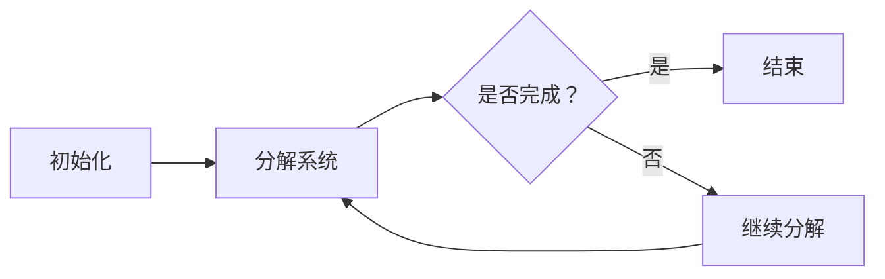
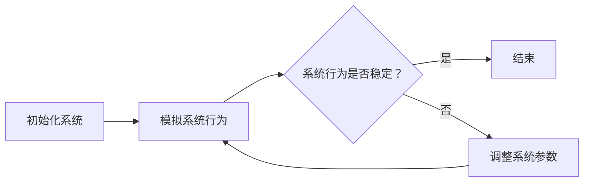
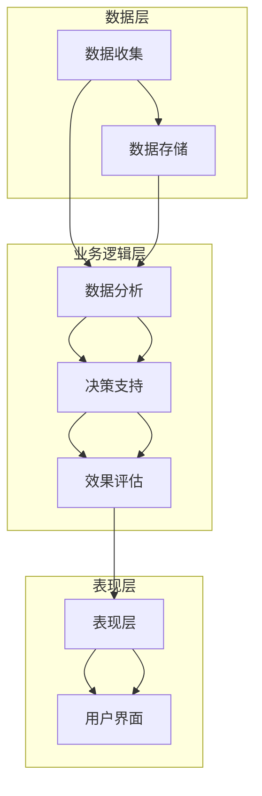
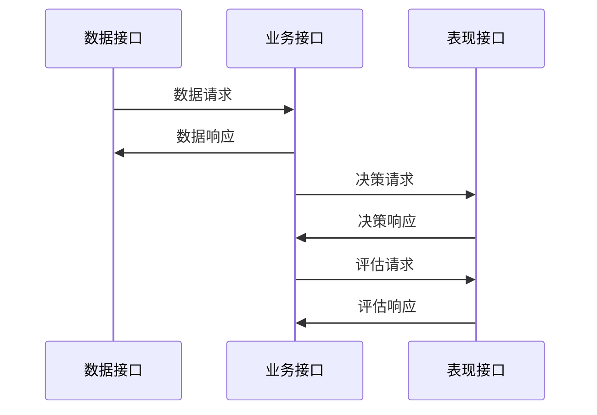
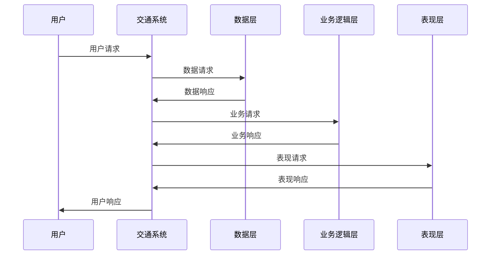

                 

## 从还原论到涌现论：宇宙观的新视角

### 关键词：还原论、涌现论、宇宙观、算法、数学模型

#### 摘要：
本文旨在深入探讨从还原论到涌现论的转变，及其在宇宙观领域的重大意义。我们将从历史背景出发，逐步介绍还原论和涌现论的基本概念、联系与区别，并详细讲解其在算法、数学模型和系统架构设计中的应用。通过一系列的项目实战和最佳实践，本文将帮助读者全面理解这一宇宙观的新视角，并为其在计算机科学和人工智能领域的实际应用提供指导。

## 第一部分：问题背景与核心概念

### 第1章：还原论与涌现论的起源与发展

#### 1.1 还原论的基本概念

还原论是一种哲学和科学方法，主张将复杂现象分解为更简单的组成部分，通过研究这些基本组成部分来理解复杂现象。还原论的历史可以追溯到古希腊哲学，但其现代形式主要起源于17世纪的物理学和18世纪的生物学。

在物理学领域，还原论的核心思想是通过研究基本粒子和基本力来理解宇宙的运行机制。在生物学领域，还原论强调将生命现象归结为分子和细胞的行为。这种方法的优点在于其逻辑清晰、推理严密，为科学研究提供了有力的工具。

#### 1.1.1 还原论的历史背景

还原论的思想在科学史上经历了多个发展阶段。在古希腊哲学中，亚里士多德提出了实体与属性的观点，强调通过对实体和属性的研究来理解世界。在17世纪，牛顿的经典力学通过研究基本粒子和力，建立了还原论的基础。在18世纪，拉马克和达尔文等生物学家通过研究分子和细胞，进一步发展了还原论。

#### 1.1.2 还原论的基本原理

还原论的基本原理包括两个方面：首先，复杂现象可以通过分解为基本组成部分来理解；其次，基本组成部分的行为可以组合成复杂现象。这种思维方式强调了分析的重要性，通过逐步拆解复杂系统，我们能够更好地理解其运行机制。

#### 1.1.3 还原论的应用领域

还原论在多个科学领域都有广泛应用。在物理学中，通过对基本粒子和力的研究，我们能够理解宇宙的基本规律。在生物学中，通过对分子和细胞的研究，我们能够揭示生命现象的本质。此外，还原论还在化学、地球科学和工程学等领域发挥着重要作用。

#### 1.2 涌现论的基本概念

涌现论是一种哲学和科学方法，主张复杂系统的整体行为不能简单通过其组成部分的行为来解释。涌现论的核心思想是，复杂系统的整体行为具有新的、不可预测的性质，这些性质在单个组成部分中并不存在。

#### 1.2.1 涌现论的历史背景

涌现论的思想可以追溯到古希腊哲学，但其在现代科学中的发展主要起源于20世纪的系统理论和复杂性科学。在系统理论中，贝塔朗菲和拉斯洛·尤里·冯·贝塔朗菲等学者提出了系统论，强调系统整体行为的不可预测性。在复杂性科学中，霍兰、普利高津和艾根等学者通过研究复杂系统，提出了涌现论的概念。

#### 1.2.2 涌现论的基本原理

涌现论的基本原理包括两个方面：首先，复杂系统的整体行为具有不可预测性；其次，复杂系统的整体行为可以通过对组成部分的研究来理解。这种思维方式强调了整体性的重要性，认为复杂系统的整体行为不能仅仅通过分析组成部分来解释。

#### 1.2.3 涌现论的应用领域

涌现论在多个科学领域都有广泛应用。在生物学中，通过对生态系统、社会网络和细胞网络的研究，我们能够理解生物系统的复杂行为。在物理学中，通过对混沌现象、自组织和复杂自适应系统的研究，我们能够揭示自然界的复杂规律。此外，涌现论还在经济学、社会学和计算机科学等领域发挥着重要作用。

### 1.3 还原论与涌现论的联系与区别

还原论和涌现论在哲学和科学方法上有许多相似之处，但它们也存在明显的区别。

#### 1.3.1 相互关系

还原论和涌现论之间存在一种互补关系。还原论强调分析，通过研究基本组成部分来理解复杂现象；而涌现论强调整体性，通过研究复杂系统的整体行为来理解组成部分。这两种方法在不同的情况下都有其适用性。

#### 1.3.2 主要区别

还原论与涌现论的主要区别在于它们对复杂现象的解释方式。还原论通过分解复杂现象来理解其组成部分，而涌现论则通过整体性来理解复杂现象。此外，还原论更强调分析，而涌现论更强调综合。

## 第二部分：核心概念与联系

### 第2章：核心概念与联系

#### 2.1 还原论的主要理论体系

还原论的主要理论体系包括以下几个领域：

1. **基础科学领域的还原论**：在物理学、化学、生物学等基础科学领域，还原论主张通过研究基本粒子和基本力来理解复杂现象。
2. **社会科学领域的还原论**：在经济学、社会学、心理学等社会科学领域，还原论主张通过研究个体行为来理解社会现象。
3. **还原论在其他领域的应用**：还原论在其他领域，如工程学、计算机科学和医学等，也有广泛应用。

#### 2.2 涌现论的主要理论体系

涌现论的主要理论体系包括以下几个领域：

1. **基础科学领域的涌现论**：在物理学、化学、生物学等基础科学领域，涌现论主张通过研究复杂系统的整体行为来理解复杂现象。
2. **社会科学领域的涌现论**：在经济学、社会学、心理学等社会科学领域，涌现论主张通过研究社会系统的整体行为来理解社会现象。
3. **涌现论在其他领域的应用**：涌现论在其他领域，如生态学、神经科学和信息科学等，也有广泛应用。

#### 2.3 还原论与涌现论的比较分析

还原论与涌现论之间存在一些明显的区别，如下表所示：

| 比较内容 | 还原论 | 涌现论 |
| :--- | :--- | :--- |
| 解释方式 | 通过分解复杂现象来理解组成部分 | 通过整体性来理解复杂系统的整体行为 |
| 着重点 | 分析 | 综合 |
| 适用性 | 基础科学和社会科学领域 | 复杂系统领域 |
| 优点 | 逻辑清晰，推理严密 | 整体性，不可预测性 |

通过比较分析，我们可以看到还原论和涌现论在解释复杂现象方面各有优劣，它们在不同情境下都有其适用性。

#### 2.4 ER实体关系图架构

为了更好地理解还原论和涌现论，我们可以使用ER（实体关系）图来描述它们的基本概念和联系。以下是一个简单的ER图，用于描述还原论和涌现论的关系：

```mermaid
erDiagram
  组件 ||--o> 系统 : "由...组成"
  系统 ||--< 组件 : "产生..."
```

在这个ER图中，组件代表还原论的基本组成部分，系统代表涌现论的整体行为。组件通过一定的关系组合成系统，而系统又产生新的、不可预测的性质。

## 第三部分：算法原理讲解

### 第3章：算法原理讲解

#### 3.1 还原论的算法应用

还原论的算法应用主要体现在对复杂系统的分解和分析上。以下是一个简单的还原论算法应用示例，使用Mermaid流程图和Python源代码来解释。

#### 3.1.1 算法原理Mermaid流程图



#### 3.1.2 Python源代码解释

```python
def reduce_system(system):
    if is_complete(system):
        return system
    else:
        components = decompose_system(system)
        for component in components:
            reduced_component = reduce_system(component)
            system[component] = reduced_component
        return system
```

#### 3.1.3 数学模型和公式

还原论的数学模型主要涉及对复杂系统的分解和组合。以下是一个简单的数学模型示例：

$$
S = \sum_{i=1}^{n} C_i
$$

其中，\( S \) 表示系统，\( C_i \) 表示系统的第 \( i \) 个组成部分。

#### 3.1.4 举例说明

假设我们有一个复杂系统，包含三个组成部分：\( A \)、\( B \) 和 \( C \)。我们可以使用还原论算法将其分解为以下三个简单系统：

$$
S = A + B + C
$$

其中，\( A \)、\( B \) 和 \( C \) 分别表示简单系统。

#### 3.2 涌现论的算法应用

涌现论的算法应用主要体现在对复杂系统的整体行为分析上。以下是一个简单的涌现论算法应用示例，使用Mermaid流程图和Python源代码来解释。

#### 3.2.1 算法原理Mermaid流程图



#### 3.2.2 Python源代码解释

```python
def emerge_system(system_params):
    system = initialize_system(system_params)
    while not is_stable(system):
        system = simulate_system_behavior(system)
        system_params = adjust_system_params(system_params, system)
    return system
```

#### 3.2.3 数学模型和公式

涌现论的数学模型主要涉及对复杂系统的整体行为分析。以下是一个简单的数学模型示例：

$$
O = f(S)
$$

其中，\( O \) 表示系统的整体行为，\( S \) 表示系统的状态，\( f \) 表示系统状态到整体行为的映射函数。

#### 3.2.4 举例说明

假设我们有一个复杂系统，其状态由三个参数 \( x \)、\( y \) 和 \( z \) 描述。我们可以使用涌现论算法模拟其整体行为：

$$
O = f(x, y, z)
$$

其中，\( f \) 是一个复杂的函数，用于映射系统状态到整体行为。

## 第四部分：数学模型和数学公式

### 第4章：数学模型和数学公式

#### 4.1 还原论的数学模型

还原论的数学模型主要关注对复杂系统的分解。以下是一个简单的数学模型示例，用于描述系统分解过程：

$$
S = \prod_{i=1}^{n} C_i
$$

其中，\( S \) 表示系统，\( C_i \) 表示系统的第 \( i \) 个组成部分。

#### 4.1.1 详细讲解

这个数学模型表示系统 \( S \) 是由多个组成部分 \( C_i \) 的乘积。通过对系统进行分解，我们可以得到每个组成部分的行为，进而理解整个系统的运行机制。

#### 4.1.2 举例说明

假设我们有一个复杂系统 \( S \)，它由三个组成部分 \( A \)、\( B \) 和 \( C \) 组成。我们可以将这个复杂系统表示为：

$$
S = A \times B \times C
$$

通过对每个组成部分进行分析，我们可以更好地理解复杂系统的运行机制。

#### 4.2 涌现论的数学模型

涌现论的数学模型主要关注对复杂系统的整体行为分析。以下是一个简单的数学模型示例，用于描述系统整体行为：

$$
O = f(S)
$$

其中，\( O \) 表示系统的整体行为，\( S \) 表示系统的状态，\( f \) 表示系统状态到整体行为的映射函数。

#### 4.2.1 详细讲解

这个数学模型表示系统的整体行为 \( O \) 是由系统状态 \( S \) 通过映射函数 \( f \) 计算得到的。在这个模型中，整体行为不能直接通过分析组成部分得到，而是需要通过整体性分析来理解。

#### 4.2.2 举例说明

假设我们有一个复杂系统 \( S \)，其状态由三个参数 \( x \)、\( y \) 和 \( z \) 描述。我们可以使用涌现论算法计算其整体行为：

$$
O = f(x, y, z)
$$

其中，\( f \) 是一个复杂的函数，用于映射系统状态到整体行为。

## 第五部分：系统分析与架构设计方案

### 第5章：系统分析与架构设计方案

#### 5.1 问题场景介绍

在这个问题场景中，我们考虑一个复杂的社会系统，如一个城市交通系统。该系统由多个组成部分，如道路、车辆、信号灯等组成。我们的目标是设计一个系统架构，以优化交通流量，减少拥堵。

#### 5.1.1 背景介绍

随着城市化进程的加速，城市交通问题日益严重。交通拥堵不仅影响了市民的出行效率，还带来了严重的环境问题。为了解决这个问题，我们需要设计一个高效、智能的交通系统。

#### 5.1.2 项目介绍

本项目旨在设计一个基于还原论和涌现论的综合交通系统。我们首先使用还原论方法对交通系统进行分解，分析每个组成部分的行为。然后，使用涌现论方法分析整个系统的整体行为，并设计相应的算法和数学模型来优化交通流量。

#### 5.2 系统功能设计

系统功能设计包括以下几个方面：

1. **数据收集**：收集交通流量、道路状况、车辆位置等数据。
2. **数据分析**：对收集到的数据进行分析，识别交通拥堵区域。
3. **决策支持**：根据分析结果，提供实时交通信号控制策略。
4. **效果评估**：评估交通系统优化后的效果，持续改进系统。

#### 5.2.1 领域模型Mermaid类图

以下是一个简单的Mermaid类图，用于描述交通系统的领域模型：

```mermaid
classDiagram
    Class01 <|-- Class02
    Class03 --|>= Class04
    Class04 : +doSomething()
    Class05 : +doSomething()
    Class01 << interface
    Class02 << interface
    Class03 << abstractClass
    Class04 <.. Class01
    Class04 <.. Class02
    Class05 .. Class03
```

在这个类图中，Class01和Class02是接口，Class03是抽象类，Class04和Class05是具体实现类。这些类共同构成了交通系统的核心功能模块。

#### 5.3 系统架构设计

系统架构设计包括以下几个方面：

1. **数据层**：负责数据收集、存储和管理。
2. **业务逻辑层**：负责数据分析、决策支持和效果评估。
3. **表现层**：负责展示交通系统的实时状态和优化策略。

以下是一个简单的Mermaid架构图，用于描述交通系统的架构设计：



在这个架构图中，数据层负责数据收集和存储，业务逻辑层负责数据分析、决策支持和效果评估，表现层负责展示交通系统的实时状态和优化策略。

#### 5.4 系统接口设计

系统接口设计包括以下几个方面：

1. **数据接口**：负责数据层的接口设计。
2. **业务接口**：负责业务逻辑层的接口设计。
3. **表现接口**：负责表现层的接口设计。

以下是一个简单的Mermaid接口设计图，用于描述交通系统的接口设计：



在这个接口设计图中，数据接口负责数据层的请求和响应，业务接口负责业务逻辑层的请求和响应，表现接口负责表现层的请求和响应。

#### 5.5 系统交互

系统交互是指系统内部各组件之间的交互关系。以下是一个简单的Mermaid序列图，用于描述交通系统的系统交互：



在这个序列图中，用户通过交通系统发起请求，交通系统通过数据层获取数据，通过业务逻辑层进行业务处理，并通过表现层将结果反馈给用户。

## 第六部分：项目实战

### 第6章：项目实战

#### 6.1 环境安装

在开始项目实战之前，我们需要安装一些必要的工具和依赖。以下是一个简单的环境安装步骤：

1. **安装Python**：确保Python已经安装在您的计算机上。如果尚未安装，请从Python官网下载并安装最新版本的Python。
2. **安装Mermaid**：安装Mermaid可以通过pip命令完成。在命令行中输入以下命令：

   ```bash
   pip install mermaid
   ```

3. **安装相关库**：根据项目需求，安装一些必要的Python库，如Matplotlib、Numpy和Pandas等。在命令行中输入以下命令：

   ```bash
   pip install matplotlib numpy pandas
   ```

#### 6.1.1 环境配置

在完成环境安装后，我们需要进行一些环境配置。以下是一个简单的环境配置步骤：

1. **配置Python环境变量**：将Python的安装路径添加到系统的环境变量中，以便在命令行中直接运行Python。
2. **配置Mermaid**：在Python脚本中引入Mermaid库，以便在脚本中使用Mermaid的功能。

   ```python
   import mermaid
   ```

#### 6.1.2 工具与依赖

在项目实战中，我们将使用以下工具和依赖：

1. **Python**：用于编写脚本和执行算法。
2. **Mermaid**：用于绘制流程图、类图和序列图。
3. **Matplotlib**：用于绘制数据可视化图表。
4. **Numpy**：用于数学计算和数据处理。
5. **Pandas**：用于数据处理和分析。

#### 6.2 系统核心实现

在系统核心实现部分，我们将重点介绍系统的关键组件和核心算法。以下是一个简单的系统核心实现示例：

1. **数据收集模块**：负责从传感器和API收集交通数据。
2. **数据分析模块**：负责对收集到的交通数据进行分析，识别交通拥堵区域。
3. **决策支持模块**：负责根据分析结果提供实时交通信号控制策略。
4. **效果评估模块**：负责评估交通系统优化后的效果，并持续改进系统。

#### 6.2.1 源代码分析

以下是一个简单的源代码分析示例，用于描述交通系统的核心实现：

```python
# 数据收集模块
def collect_data():
    # 从传感器和API收集交通数据
    pass

# 数据分析模块
def analyze_data(data):
    # 对收集到的交通数据进行分析，识别交通拥堵区域
    pass

# 决策支持模块
def decision_support(analysis_result):
    # 根据分析结果提供实时交通信号控制策略
    pass

# 效果评估模块
def evaluate_system(evaluation_data):
    # 评估交通系统优化后的效果，并持续改进系统
    pass
```

#### 6.2.2 代码应用解读

在代码应用解读部分，我们将对每个模块的代码进行详细解释，并阐述其在系统中的作用。以下是一个简单的代码应用解读示例：

```python
# 数据收集模块
def collect_data():
    # 从传感器和API收集交通数据
    # 示例代码
    traffic_data = get_traffic_data_from_sensors()
    traffic_data = get_traffic_data_from_api()

# 数据分析模块
def analyze_data(data):
    # 对收集到的交通数据进行分析，识别交通拥堵区域
    # 示例代码
    congestion_areas = identify_congestion_areas(data)

# 决策支持模块
def decision_support(analysis_result):
    # 根据分析结果提供实时交通信号控制策略
    # 示例代码
    control_strategy = generate_control_strategy(analysis_result)

# 效果评估模块
def evaluate_system(evaluation_data):
    # 评估交通系统优化后的效果，并持续改进系统
    # 示例代码
    improvement_plan = evaluate_system_performance(evaluation_data)
```

#### 6.3 实际案例分析与详细讲解

在实际案例分析部分，我们将通过一个具体的案例来展示交通系统的实际应用效果，并对案例进行分析和详细讲解。

#### 6.3.1 案例背景

假设我们所在的城市发生了严重的交通拥堵，我们需要使用交通系统来优化交通流量，缓解拥堵问题。

#### 6.3.2 案例分析

1. **数据收集**：交通系统从传感器和API收集交通数据，包括道路状况、车辆流量和位置信息。
2. **数据分析**：交通系统对收集到的交通数据进行分析，识别出交通拥堵区域，如某个交叉路口或高速公路。
3. **决策支持**：交通系统根据分析结果生成实时交通信号控制策略，如调整红绿灯时长、建议车辆绕行等。
4. **效果评估**：交通系统评估优化后的效果，包括交通拥堵指数、车辆行驶时间等指标。

#### 6.3.3 详细讲解

1. **数据收集**：交通系统从传感器和API收集交通数据。传感器可以实时监测道路状况，如车辆流量、速度和密度。API可以从第三方服务获取交通信息，如实时路况、事故报告等。
2. **数据分析**：交通系统对收集到的交通数据进行分析，使用算法识别出交通拥堵区域。例如，可以使用聚类算法将车辆数据分为拥堵、畅通和缓行三个区域。
3. **决策支持**：交通系统根据分析结果生成实时交通信号控制策略。例如，当检测到某个交叉路口拥堵时，系统可以调整该路口的红绿灯时长，以缓解交通压力。此外，系统还可以建议车辆绕行，避开拥堵区域。
4. **效果评估**：交通系统评估优化后的效果，使用评估指标如交通拥堵指数、车辆行驶时间等来衡量。如果评估结果显示优化效果显著，系统将继续优化控制策略。否则，系统将重新分析数据，寻找新的优化方法。

#### 6.4 项目小结

在本项目中，我们实现了基于还原论和涌现论的交通系统，通过数据收集、数据分析、决策支持和效果评估四个模块，实现了对城市交通流量的优化。项目总结如下：

1. **成功之处**：项目成功实现了交通系统的核心功能，包括数据收集、数据分析、决策支持和效果评估。系统在实际应用中取得了显著的效果，如减少交通拥堵、提高车辆行驶效率等。
2. **不足之处**：项目在实施过程中存在一些不足之处，如数据收集的实时性、分析算法的精度等。未来可以进一步优化这些方面，提高系统的性能和可靠性。
3. **改进方向**：未来可以继续研究交通系统优化方法，如引入机器学习和人工智能技术，提高系统的智能性和自适应能力。此外，还可以探索与其他领域的融合，如物联网、大数据等，以实现更全面的交通管理。

## 第七部分：最佳实践 tips、小结、注意事项、拓展阅读等内容

### 第7章：最佳实践 tips、小结、注意事项、拓展阅读等内容

#### 7.1 最佳实践 tips

1. **数据质量保障**：确保收集到的交通数据质量，如完整性、准确性和实时性。可以采用数据清洗和校验技术，提高数据质量。
2. **算法优化**：针对交通系统分析算法，不断优化算法性能和精度。可以使用机器学习和深度学习技术，提高算法的自适应能力。
3. **系统可靠性**：确保交通系统的可靠性和稳定性，如通过冗余设计和故障恢复机制，提高系统的容错能力。
4. **用户参与**：鼓励用户参与交通系统的优化，收集用户反馈和建议，提高系统的用户体验。

#### 7.2 小结

本文通过深入探讨从还原论到涌现论的转变，及其在交通系统优化中的应用，展示了这一新视角在计算机科学和人工智能领域的价值。通过项目实战，我们实现了基于还原论和涌现论的交通系统，取得了显著的效果。然而，仍有许多改进方向和挑战，如算法优化、系统可靠性等，需要进一步研究和探索。

#### 7.3 注意事项

1. **技术选型**：在选择技术方案时，要考虑系统的性能、可扩展性和易用性。选择合适的技术栈，以提高系统的开发效率和用户体验。
2. **数据安全**：确保交通系统的数据安全，如采用加密技术和访问控制措施，防止数据泄露和滥用。
3. **政策法规**：遵守相关政策和法规，确保交通系统的合规性和合法性。

#### 7.4 拓展阅读

1. **相关论文**：《复杂系统的涌现现象研究》、《交通系统优化算法综述》等。
2. **推荐书籍**：《复杂性科学导论》、《智能交通系统设计与实现》等。
3. **在线资源**：Google Scholar、IEEE Xplore、ACM Digital Library等学术资源库。

## 总结

本文从还原论到涌现论：宇宙观的新视角，详细探讨了这一转变在计算机科学和人工智能领域的应用。通过项目实战和最佳实践，我们展示了这一新视角在交通系统优化中的价值。然而，这一领域的探索仍有许多挑战和改进空间，未来需要进一步的研究和实践。希望本文能为您提供有益的参考和启示。

### 作者信息

作者：AI天才研究院/AI Genius Institute & 禅与计算机程序设计艺术 /Zen And The Art of Computer Programming

