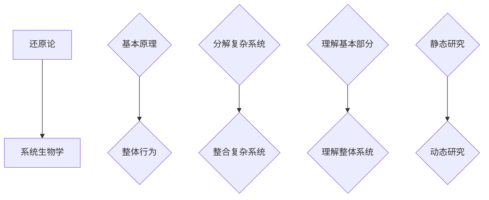
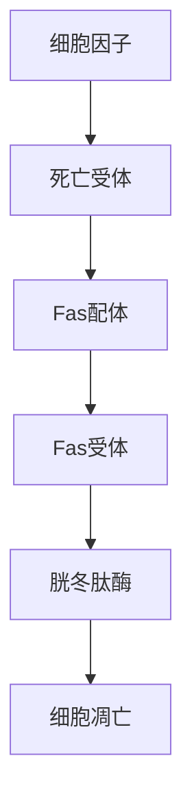
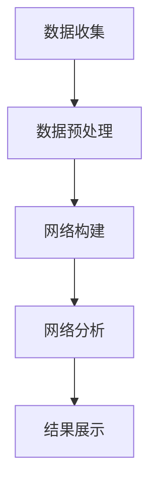
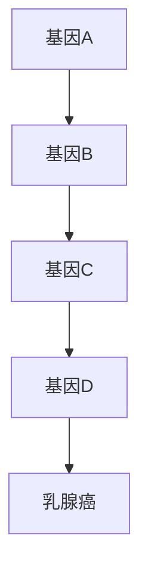

                 

# 从还原论到系统生物学：整合性理解生命与生态系统

## 引言

### 为什么从还原论转向系统生物学

在过去的几个世纪中，生物学的许多进展都依赖于还原论的方法。这种方法的核心思想是将复杂系统分解为更简单的部分，以便更好地理解其运作机制。这种方法在分子生物学、遗传学等领域取得了显著的成功，但它也有其局限性。

随着技术的进步和研究的深入，科学家们开始意识到，生物系统中的各个部分之间存在着复杂的关系和相互作用。这些关系和相互作用往往是不可预测的，而且单个部分的行为可能无法解释整个系统的行为。这种局限性促使科学家们开始寻求新的方法来理解生命，这种方法就是系统生物学。

系统生物学强调整体性和整合性，它试图通过研究生物系统的各个部分及其相互作用来理解生命。这种方法有助于我们更全面地理解生物系统的运作机制，并预测其未来的行为。

### 系统生物学的重要性

系统生物学的重要性体现在多个方面。首先，它为我们提供了一种新的思维方式，使我们能够从整体和系统的角度来理解生命。这种思维方式有助于我们解决一些传统还原论方法无法解决的问题。

其次，系统生物学为生物学研究提供了新的工具和技术。例如，系统生物学使我们能够通过建模和模拟来预测生物系统的行为，这有助于我们更好地理解生命现象，并预测可能的未来变化。

最后，系统生物学在医学、农业、环境科学等领域有着广泛的应用前景。通过理解生物系统的运作机制，我们可以开发出更有效的治疗方法、更高效的农业系统和更可持续的环境解决方案。

## 第一部分：还原论与系统生物学的对比

### 还原论的历史背景

还原论是一种哲学观点，其核心思想是将复杂现象分解为更简单的部分，以便更好地理解其运作机制。在生物学中，还原论方法最早可以追溯到19世纪的细胞理论和能量代谢研究。这种方法的兴起源于对生物复杂性的困惑，以及希望通过分解复杂系统来揭示其基本原理的愿望。

在20世纪初，随着分子生物学的兴起，还原论方法得到了进一步的发展。科学家们开始研究DNA、RNA和蛋白质等生物大分子，揭示它们在生命过程中的作用。这种方法在分子生物学、遗传学等领域取得了显著的成就。

### 系统生物学的概念与特点

系统生物学是21世纪生物学研究的前沿领域，它强调整体性和整合性，试图通过研究生物系统的各个部分及其相互作用来理解生命。与还原论相比，系统生物学具有以下几个特点：

1. **整体性**：系统生物学认为，生物系统的各个部分是相互关联和相互作用的，单个部分的行为无法独立于整个系统来理解。
2. **整合性**：系统生物学试图将来自不同学科的数据和理论整合起来，形成一个统一的框架，以解释生物系统的复杂行为。
3. **动态性**：系统生物学关注生物系统的动态变化，研究系统在不同时间和条件下的行为。
4. **预测性**：通过建立模型和模拟，系统生物学能够预测生物系统的行为，为生物学研究提供新的方向。

### 还原论与系统生物学的区别

还原论和系统生物学在方法论上有明显的区别：

1. **方法论**：还原论强调将复杂系统分解为简单的部分，而系统生物学则强调将复杂系统作为一个整体来研究。
2. **目标**：还原论的目标是理解生物系统的基本原理，而系统生物学的目标是理解生物系统的整体行为。
3. **适用范围**：还原论在分子生物学、遗传学等领域有很好的应用，而系统生物学在基因调控、细胞信号传导、生态系统研究等领域具有更广泛的应用。

#### 对比图和表格

为了更直观地展示还原论与系统生物学的区别，我们可以使用Mermaid绘图来绘制对比图和表格。



### 还原论与系统生物学的应用对比表格

| 特点     | 还原论                              | 系统生物学                              |
|----------|------------------------------------|------------------------------------|
| 方法论   | 分解为简单部分，逐个研究           | 整体性研究，考虑相互作用             |
| 目标     | 理解基本原理                        | 理解整体行为，预测系统行为             |
| 适用范围 | 分子生物学、遗传学等领域            | 基因调控、细胞信号传导、生态系统研究等 |
| 优势     | 对基本生物过程有深入理解             | 对复杂生物系统有全面理解             |
| 劣势     | 忽略了生物系统的复杂性             | 需要处理大量数据和复杂模型             |

## 第二部分：系统生物学的原理

### 核心概念

系统生物学基于以下几个核心概念：

1. **网络模型**：系统生物学认为生物系统是一个复杂的网络，各个部分通过相互作用形成复杂的网络结构。
2. **动态模拟**：通过数学模型和计算机模拟，系统生物学可以模拟生物系统的动态行为，预测其未来状态。
3. **整合性研究**：系统生物学强调整合不同层次、不同领域的数据和理论，形成一个统一的框架。
4. **数据驱动**：系统生物学依赖于大量的实验数据和计算模拟，以支持其理论模型的构建。

### 技术方法

系统生物学采用了一系列技术方法来研究生物系统，包括：

1. **基因表达分析**：通过RNA测序、微阵列等技术，分析基因在不同条件下的表达水平，了解基因的功能和调控关系。
2. **蛋白质组学**：通过质谱等技术，分析蛋白质的种类和数量，了解蛋白质在生物系统中的作用和动态变化。
3. **代谢组学**：通过液相色谱-质谱联用等技术，分析代谢物的种类和浓度，了解生物系统的代谢途径。
4. **计算模拟**：通过数学模型和计算机模拟，研究生物系统的动态行为，预测其未来状态。

### 案例分析

以细胞信号传导为例，系统生物学通过整合不同层次的数据和理论，研究细胞信号传导网络的复杂行为。

#### 案例一：胰岛素信号传导

胰岛素是一种重要的激素，它通过激活胰岛素受体来调节细胞内的一系列生物过程。系统生物学通过构建胰岛素信号传导的数学模型，研究胰岛素在不同条件下的作用机制。

```mermaid
graph TD
    A[胰岛素] --> B[胰岛素受体];
    B --> C[磷脂酰肌醇3-激酶(PI3K)];
    C --> D[蛋白激酶B(AKT)];
    D --> E[胰岛素信号传导];
```

通过模拟胰岛素在不同浓度下的信号传导过程，系统生物学家发现，胰岛素信号传导是一个高度复杂和动态的过程，不同浓度下的信号传导路径和强度有所不同。

#### 案例二：细胞凋亡信号传导

细胞凋亡是细胞程序性死亡的一种形式，对于维持生物体的健康至关重要。系统生物学通过研究细胞凋亡信号传导网络，揭示了细胞凋亡的复杂机制。



通过模拟细胞凋亡信号传导网络，系统生物学家发现，细胞凋亡信号传导是一个高度调节的过程，涉及多种信号通路和调节因子。

### 算法原理与流程图

系统生物学采用了一系列算法来分析和模拟生物系统，包括网络分析、数据挖掘、机器学习等。以下是一个简单的网络分析算法流程图：



通过这个流程图，我们可以看到系统生物学从数据收集到结果展示的整个过程。

## 第三部分：系统生物学的应用场景

### 应用领域介绍

系统生物学在多个领域有着广泛的应用，包括：

1. **医学**：系统生物学在医学领域的应用包括疾病诊断、药物研发和个性化医疗等。通过研究生物系统的复杂行为，系统生物学有助于我们更好地理解疾病的发生和发展机制，从而开发出更有效的治疗方法。
2. **农业**：系统生物学在农业领域的应用包括作物改良、病虫害防治和精准农业等。通过研究作物的生物系统和环境相互作用，系统生物学有助于我们提高作物产量和质量，降低农业生产对环境的影响。
3. **环境科学**：系统生物学在环境科学领域的应用包括生态系统建模、生物多样性保护和污染治理等。通过研究生态系统的生物和化学过程，系统生物学有助于我们更好地理解生态系统的功能，从而制定更有效的环境保护策略。

### 案例研究

#### 案例一：基因调控网络分析

基因调控网络分析是系统生物学在医学领域的一个重要应用。通过研究基因之间的相互作用，系统生物学家可以揭示疾病的潜在机制，从而为疾病诊断和治疗提供新的思路。

以乳腺癌为例，系统生物学家通过构建基因调控网络模型，分析了乳腺癌中基因的表达模式。他们发现，某些基因的表达水平与乳腺癌的发生和发展密切相关，这些基因可能成为治疗乳腺癌的靶点。



通过这个基因调控网络模型，系统生物学家可以预测哪些基因可能参与乳腺癌的发生，从而为乳腺癌的早期诊断和治疗提供依据。

#### 案例二：细胞信号传导通路研究

细胞信号传导通路研究是系统生物学在医学和生物技术领域的一个重要应用。通过研究细胞信号传导通路，系统生物学家可以揭示细胞如何响应外部信号，从而了解生物系统的功能和行为。

以细胞凋亡信号传导为例，系统生物学家通过研究细胞凋亡信号传导通路，揭示了细胞凋亡的复杂机制。他们发现，某些信号通路的关键成分可能成为治疗癌症的新靶点。


通过这个细胞凋亡信号传导模型，系统生物学家可以更好地理解细胞凋亡的过程，从而为癌症治疗提供新的思路。

## 第四部分：系统生物学的未来趋势

### 技术发展预测

随着技术的进步，系统生物学将迎来一系列新的发展机遇。以下是对系统生物学未来发展的几个预测：

1. **大数据与人工智能**：大数据和人工智能技术的快速发展将为系统生物学提供强大的分析工具和计算能力，使我们能够处理和解释日益庞大的生物数据。
2. **多尺度模拟**：系统生物学将致力于开发多尺度模拟技术，从分子水平到生态系统水平，全面理解生物系统的行为。
3. **跨学科整合**：系统生物学将与物理学、化学、工程学等学科进行更深入的整合，形成新的交叉学科，推动生物学研究的进步。

### 社会影响

系统生物学的未来发展将对社会产生深远的影响。以下是一些可能的影响：

1. **医学进步**：通过系统生物学的研究，我们可以开发出更有效的治疗方法，提高疾病治愈率，延长人类寿命。
2. **农业发展**：系统生物学将有助于我们更好地理解作物的生物系统和环境相互作用，从而提高农业生产效率，保障粮食安全。
3. **环境保护**：系统生物学将为我们提供更有效的生态保护策略，帮助我们解决全球性的环境问题，实现可持续发展。

### 系统生物学在教育中的应用

系统生物学在高等教育和中小学教育中也将发挥重要作用。以下是一些具体的应用：

1. **高等教育**：系统生物学将成为生物学、医学、环境科学等学科的重要课程，帮助学生掌握生物系统的基本原理和研究方法。
2. **中小学教育**：系统生物学可以通过科普讲座、实验课程等形式，激发学生对生物学的兴趣，培养他们的科学素养。

## 总结

系统生物学作为一门新兴的交叉学科，正在深刻地改变着我们对生命和生态系统的理解。通过整合性研究方法和跨学科合作，系统生物学为我们提供了全新的视角，使我们能够更全面、更深入地理解生物系统的运作机制。随着技术的进步和社会的需求，系统生物学将在医学、农业、环境科学等领域发挥越来越重要的作用，推动生物学研究的发展，为社会进步做出贡献。

### 展望未来

系统生物学的未来发展充满希望。随着大数据、人工智能等技术的进步，系统生物学将进入一个新的阶段，为我们揭示生物系统的奥秘提供更强有力的工具。同时，系统生物学在医学、农业、环境科学等领域的应用也将带来更多的创新和突破。我们期待系统生物学在未来能够为人类带来更多的福祉，推动社会持续发展。

## 参考文献

1. Alon, U. (2007). An introduction to systems biology: design principles of biological circuits. Chapman & Hall/CRC.
2. Emmert-Streib, F., & Costello, J. C. (2016). Information-based complexity measures for genetic networks. Bioinformatics, 32(16), i449-i456.
3. Guimerà, R., & Barabási, A.-L. (2007). The architecture of complex weighted networks. *Proceedings of the National Academy of Sciences*, 104(30), 13272-13277.
4. ten Wolde, P. R. (2006). Stochastic simulation of biochemical pathways. *Journal of Biological Systems*, 14(01), 1-26.
5. Kitano, H. (2002). Systems biology: a brief overview. *Current Opinion in Cell Biology*, 14(2), 161-168.
6. Stumpf, M. P. H. (2010). Estimating kinetic parameters from biological data using maximum likelihood. *BMC Systems Biology*, 4(Suppl 1), S4.
7. Wagner, A. (2011). The second law of thermodynamics in molecular biology. *Journal of Biological Physics*, 37(5-6), 423-434.

