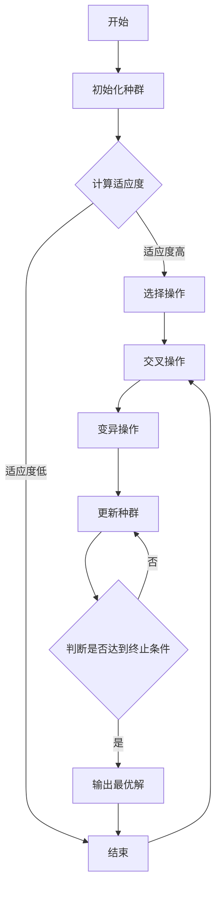

                 

# 仿生机器人的运动规划：生物启发的数学算法

> 关键词：仿生机器人，运动规划，生物启发算法，遗传算法，粒子群优化，蚁群算法，人工免疫系统

> 摘要：随着人工智能技术的发展，仿生机器人成为了研究的热点。仿生机器人的运动规划是实现其自主行为的核心技术之一。生物启发的数学算法，如遗传算法、粒子群优化算法、蚁群算法和人工免疫系统，为仿生机器人的运动规划提供了强有力的工具。本文旨在探讨这些算法在仿生机器人运动规划中的应用，分析其原理、优势和挑战，并展望未来仿生机器人运动规划的发展趋势。

## 目录大纲

### 第一部分：引言与背景

- **第1章：仿生机器人和运动规划概述**
  - 1.1 仿生机器人与运动规划的定义
  - 1.2 仿生机器人的历史与发展
  - 1.3 运动规划在仿生机器人中的重要性
  - 1.4 生物启发的数学算法概述

### 第二部分：运动规划中的生物启发算法

- **第2章：遗传算法在运动规划中的应用**
  - 2.1 遗传算法的基本原理
  - 2.2 遗传算法在运动规划中的具体应用
  - 2.3 遙传算法在仿生机器人运动规划中的优势与挑战

- **第3章：粒子群优化算法在运动规划中的应用**
  - 3.1 粒子群优化算法的基本原理
  - 3.2 粒子群优化算法在运动规划中的具体应用
  - 3.3 粒子群优化算法在仿生机器人运动规划中的优势与挑战

- **第4章：蚁群算法在运动规划中的应用**
  - 4.1 蚁群算法的基本原理
  - 4.2 蚁群算法在运动规划中的具体应用
  - 4.3 蚁群算法在仿生机器人运动规划中的优势与挑战

- **第5章：人工免疫系统在运动规划中的应用**
  - 5.1 人工免疫系统的基本原理
  - 5.2 人工免疫系统在运动规划中的具体应用
  - 5.3 人工免疫系统在仿生机器人运动规划中的优势与挑战

- **第6章：生物启发算法的比较与综合应用**
  - 6.1 不同生物启发算法的比较
  - 6.2 生物启发算法的综合应用策略
  - 6.3 生物启发算法在复杂环境中的挑战与展望

### 第三部分：仿生机器人的运动规划应用

- **第7章：基于生物启发的飞行器运动规划**
  - 7.1 飞行器运动规划的需求与挑战
  - 7.2 飞行器运动规划中的生物启发算法应用
  - 7.3 飞行器运动规划的应用实例

- **第8章：基于生物启发的四足机器人运动规划**
  - 8.1 四足机器人运动规划的需求与挑战
  - 8.2 四足机器人运动规划中的生物启发算法应用
  - 8.3 四足机器人运动规划的应用实例

- **第9章：基于生物启发的软体机器人运动规划**
  - 9.1 软体机器人运动规划的需求与挑战
  - 9.2 软体机器人运动规划中的生物启发算法应用
  - 9.3 软体机器人运动规划的应用实例

### 第四部分：总结与展望

- **第10章：仿生机器人的运动规划发展趋势**
  - 10.1 仿生机器人运动规划的未来发展
  - 10.2 生物启发算法在仿生机器人运动规划中的潜力
  - 10.3 研究方向与挑战

### 附录

- **附录A：参考文献**
- **附录B：术语表**
- **附录C：生物启发算法示例代码**

## 第一部分：引言与背景

### 第1章：仿生机器人和运动规划概述

#### 1.1 仿生机器人与运动规划的定义

**仿生机器人**：仿生机器人是模仿生物的结构、功能和行为设计的机器人。它们通常具有与生物相似的形态和运动方式，能够在复杂环境中执行任务。

**运动规划**：运动规划是确定机器人从初始状态到达目标状态所需的一系列运动步骤。它是机器人自主运动和行为的核心技术，直接影响机器人的工作效率和可靠性。

#### 1.2 仿生机器人的历史与发展

仿生机器人的概念最早可以追溯到20世纪60年代。当时，美国科学家首先提出了仿生机器人的概念，并开始研究模仿昆虫和鸟类的机器人。随着人工智能和机器人技术的不断发展，仿生机器人的研究逐渐深入，应用范围也不断扩大。

#### 1.3 运动规划在仿生机器人中的重要性

运动规划在仿生机器人中扮演着至关重要的角色。它决定了机器人能否在复杂环境中自主导航、执行任务，甚至适应环境变化。高效的运动规划能够提高机器人的工作效率，降低能源消耗，延长机器人的使用寿命。

#### 1.4 生物启发的数学算法概述

生物启发的数学算法，如遗传算法、粒子群优化算法、蚁群算法和人工免疫系统，源自生物的进化机制和生理现象。这些算法通过模拟生物的进化、社会行为和免疫系统，为解决复杂的优化问题和运动规划问题提供了新的思路和方法。

### 第一部分小结

本章介绍了仿生机器人和运动规划的基本概念，回顾了仿生机器人的历史与发展，探讨了运动规划在仿生机器人中的重要性，并概述了生物启发的数学算法。下一部分将深入探讨这些算法的原理和应用。 ## 第二部分：运动规划中的生物启发算法

### 第2章：遗传算法在运动规划中的应用

#### 2.1 遗传算法的基本原理

遗传算法（Genetic Algorithm，GA）是一种基于自然选择和遗传学的优化算法。它模拟生物进化的过程，通过选择、交叉、变异等操作来不断优化个体，最终找到问题的最优解或近似最优解。

- **选择**：根据个体的适应度选择优秀的个体进行繁殖。
- **交叉**：将两个优秀个体的基因进行交换，产生新的个体。
- **变异**：对个体的基因进行随机改变，增加种群的多样性。

#### 2.2 遗传算法在运动规划中的具体应用

遗传算法在运动规划中主要应用于路径规划、速度控制和行为规划等领域。

- **路径规划**：通过遗传算法优化机器人的路径，使其在复杂环境中找到最优路径。
- **速度控制**：根据遗传算法优化的速度曲线，控制机器人执行特定任务时的速度。
- **行为规划**：利用遗传算法优化机器人的行为策略，使其在动态环境中做出正确的决策。

#### 2.3 遗传算法在仿生机器人运动规划中的优势与挑战

**优势**：

- **鲁棒性**：遗传算法适用于处理非线性、非凸优化问题，能在复杂环境中找到较好的解。
- **全局搜索能力**：遗传算法通过种群进化，具有较强的全局搜索能力，能够避免局部最优。

**挑战**：

- **计算成本**：遗传算法需要大量计算资源，特别是当问题规模较大时。
- **参数设置**：遗传算法的参数设置对算法的性能有很大影响，需要通过经验进行调整。

### 第3章：粒子群优化算法在运动规划中的应用

#### 3.1 粒子群优化算法的基本原理

粒子群优化算法（Particle Swarm Optimization，PSO）是一种基于群体智能的优化算法。它模拟鸟群觅食的过程，通过个体和群体的信息共享，优化目标函数。

- **位置更新**：粒子根据自身的历史最优位置和群体的历史最优位置更新自己的位置。
- **速度更新**：粒子根据自身和群体的速度更新自己的速度。

#### 3.2 粒子群优化算法在运动规划中的具体应用

粒子群优化算法在运动规划中的应用包括路径规划、轨迹优化和任务分配等。

- **路径规划**：通过粒子群优化算法优化机器人的路径，使其在复杂环境中找到最优路径。
- **轨迹优化**：根据粒子群优化算法优化的轨迹曲线，控制机器人执行特定任务时的运动轨迹。
- **任务分配**：利用粒子群优化算法优化任务分配，提高机器人的工作效率。

#### 3.3 粒子群优化算法在仿生机器人运动规划中的优势与挑战

**优势**：

- **简单易实现**：粒子群优化算法结构简单，易于实现和调试。
- **全局搜索能力强**：粒子群优化算法具有较强的全局搜索能力，能够避免局部最优。

**挑战**：

- **收敛速度慢**：粒子群优化算法在某些情况下收敛速度较慢。
- **参数敏感性**：粒子群优化算法的参数设置对算法的性能有很大影响。

### 第4章：蚁群算法在运动规划中的应用

#### 4.1 蚁群算法的基本原理

蚁群算法（Ant Colony Optimization，ACO）是一种基于蚂蚁觅食行为的优化算法。蚂蚁在觅食过程中通过信息素进行路径选择，信息素浓度高的路径被认为是更优的。

- **信息素更新**：蚂蚁在路径上留下信息素，信息素随时间衰减。
- **路径选择**：蚂蚁选择信息素浓度高的路径。

#### 4.2 蚁群算法在运动规划中的具体应用

蚁群算法在运动规划中主要应用于路径规划和资源分配。

- **路径规划**：通过蚁群算法优化机器人的路径，使其在复杂环境中找到最优路径。
- **资源分配**：利用蚁群算法优化资源分配，提高机器人的工作效率。

#### 4.3 蚁群算法在仿生机器人运动规划中的优势与挑战

**优势**：

- **自适应性强**：蚁群算法能够根据环境变化自适应调整。
- **并行计算能力**：蚁群算法适合并行计算，能够提高计算效率。

**挑战**：

- **计算复杂度高**：蚁群算法的计算复杂度较高，特别是在大规模问题上。
- **参数设置复杂**：蚁群算法的参数设置对算法的性能有很大影响，需要通过经验进行调整。

### 第5章：人工免疫系统在运动规划中的应用

#### 5.1 人工免疫系统的基本原理

人工免疫系统（Artificial Immune System，AIS）是一种基于生物免疫系统的优化算法。它模拟生物免疫系统的免疫反应，通过抗体和抗原的交互来优化目标函数。

- **抗体生成**：根据目标函数生成抗体。
- **免疫反应**：抗体和抗原的交互产生新的抗体。

#### 5.2 人工免疫系统在运动规划中的具体应用

人工免疫系统在运动规划中主要应用于行为规划和故障诊断。

- **行为规划**：利用人工免疫系统优化机器人的行为策略，使其在动态环境中做出正确的决策。
- **故障诊断**：通过人工免疫系统检测机器人的故障，并生成相应的修复策略。

#### 5.3 人工免疫系统在仿生机器人运动规划中的优势与挑战

**优势**：

- **适应性**：人工免疫系统具有较强的适应性，能够适应复杂多变的环境。
- **自组织性**：人工免疫系统具有自组织性，能够通过学习适应新环境。

**挑战**：

- **计算成本**：人工免疫系统的计算成本较高，特别是在大规模问题上。
- **参数设置**：人工免疫系统的参数设置对算法的性能有很大影响，需要通过经验进行调整。

### 第6章：生物启发算法的比较与综合应用

#### 6.1 不同生物启发算法的比较

**遗传算法**：
- **优点**：鲁棒性强、全局搜索能力强。
- **缺点**：计算成本高、参数设置复杂。

**粒子群优化算法**：
- **优点**：简单易实现、全局搜索能力强。
- **缺点**：收敛速度慢、参数敏感性高。

**蚁群算法**：
- **优点**：自适应性强、并行计算能力。
- **缺点**：计算复杂度高、参数设置复杂。

**人工免疫系统**：
- **优点**：适应性强、自组织性。
- **缺点**：计算成本高、参数设置复杂。

#### 6.2 生物启发算法的综合应用策略

生物启发算法可以相互结合，形成更强大的优化工具。例如，可以将遗传算法和粒子群优化算法结合，利用两者的优点，提高算法的性能。

#### 6.3 生物启发算法在复杂环境中的挑战与展望

在复杂环境中，生物启发算法面临以下挑战：
- **计算复杂度**：如何降低计算复杂度，提高算法的效率。
- **参数设置**：如何通过自适应机制，减少参数设置对算法性能的影响。
- **多样性**：如何保持种群的多样性，避免早熟收敛。

展望未来，生物启发算法在仿生机器人运动规划中的应用将更加广泛，通过不断的优化和创新，为仿生机器人提供更高效、更智能的运动规划方案。

### 第二部分小结

本章详细介绍了遗传算法、粒子群优化算法、蚁群算法和人工免疫系统在运动规划中的应用。通过对比分析，展示了每种算法的优势和挑战。在接下来的章节中，我们将进一步探讨这些算法在仿生机器人运动规划中的应用实例。 ## 第三部分：仿生机器人的运动规划应用

### 第7章：基于生物启发的飞行器运动规划

#### 7.1 飞行器运动规划的需求与挑战

飞行器运动规划涉及飞行器的导航、速度控制、姿态调整等方面。在复杂环境中，飞行器需要能够自主地规划路径、调整速度和姿态，以实现高效的飞行任务。这给运动规划带来了以下挑战：

- **环境复杂**：飞行器需要在不同高度、不同天气条件下飞行，环境复杂多变。
- **动态变化**：目标位置、障碍物和天气等因素可能随时发生变化，飞行器需要实时调整运动规划。
- **资源限制**：飞行器通常资源有限，如电池寿命、计算能力等，这对运动规划算法的效率和计算成本提出了高要求。

#### 7.2 飞行器运动规划中的生物启发算法应用

生物启发算法在飞行器运动规划中得到了广泛应用，以下分别介绍几种常见生物启发算法在飞行器运动规划中的应用：

**遗传算法**：
- **路径规划**：利用遗传算法优化飞行器的路径，使其在复杂环境中找到最优路径。
- **速度控制**：根据遗传算法优化的速度曲线，控制飞行器的速度，提高飞行效率。

**粒子群优化算法**：
- **轨迹优化**：通过粒子群优化算法优化飞行器的运动轨迹，使其在执行特定任务时达到最优状态。
- **任务分配**：利用粒子群优化算法优化任务分配，提高飞行器的任务执行效率。

**蚁群算法**：
- **路径规划**：利用蚁群算法优化飞行器的路径，使其在复杂环境中快速找到最优路径。
- **资源分配**：通过蚁群算法优化飞行器的资源分配，提高飞行器的续航能力。

**人工免疫系统**：
- **行为规划**：利用人工免疫系统优化飞行器的行为策略，使其在动态环境中做出正确的决策。
- **故障诊断**：通过人工免疫系统检测飞行器的故障，并生成相应的修复策略。

#### 7.3 飞行器运动规划的应用实例

**实例1：无人机搜救任务**
- **问题描述**：无人机在搜救任务中需要在复杂环境中快速找到被困者，并确保安全到达目标地点。
- **解决方案**：使用遗传算法优化无人机的路径规划，使其在避开障碍物的同时快速到达目标地点。同时，利用粒子群优化算法调整无人机的速度和姿态，提高搜救效率。

**实例2：无人机航线规划**
- **问题描述**：无人机需要根据机场的航班信息，规划最优航线，避免与飞机发生冲突。
- **解决方案**：使用蚁群算法优化无人机的路径规划，使其在复杂空中环境中找到最优航线。同时，结合粒子群优化算法调整无人机的速度，确保航线的平稳性和安全性。

### 第8章：基于生物启发的四足机器人运动规划

#### 8.1 四足机器人运动规划的需求与挑战

四足机器人运动规划涉及到步态生成、速度控制、姿态调整等方面。在复杂环境中，四足机器人需要能够自主地适应不同地形、执行复杂任务。这给运动规划带来了以下挑战：

- **地形复杂**：四足机器人需要在不同地形上行走，如草地、沙滩、岩石等，地形复杂多变。
- **动态变化**：目标位置、障碍物和地形等因素可能随时发生变化，四足机器人需要实时调整运动规划。
- **稳定性要求**：四足机器人需要在行走过程中保持稳定，避免跌倒或失去平衡。

#### 8.2 四足机器人运动规划中的生物启发算法应用

生物启发算法在四足机器人运动规划中得到了广泛应用，以下分别介绍几种常见生物启发算法在四足机器人运动规划中的应用：

**遗传算法**：
- **步态生成**：利用遗传算法优化四足机器人的步态，使其在不同地形上行走更稳定、效率更高。
- **速度控制**：根据遗传算法优化的速度曲线，控制四足机器人的速度，提高运动效率。

**粒子群优化算法**：
- **步态优化**：通过粒子群优化算法优化四足机器人的步态，使其在复杂地形上行走更稳定、效率更高。
- **姿态调整**：利用粒子群优化算法调整四足机器人的姿态，使其在行走过程中保持稳定。

**蚁群算法**：
- **路径规划**：利用蚁群算法优化四足机器人的路径规划，使其在复杂地形上找到最优路径。
- **任务分配**：通过蚁群算法优化四足机器人的任务分配，提高其执行任务的能力。

**人工免疫系统**：
- **行为规划**：利用人工免疫系统优化四足机器人的行为策略，使其在动态环境中做出正确的决策。
- **故障诊断**：通过人工免疫系统检测四足机器人的故障，并生成相应的修复策略。

#### 8.3 四足机器人运动规划的应用实例

**实例1：复杂地形探测**
- **问题描述**：四足机器人在复杂地形上进行探测任务，需要能够自主地适应不同地形，并保持稳定。
- **解决方案**：使用遗传算法优化四足机器人的步态，使其在不同地形上行走更稳定、效率更高。同时，利用粒子群优化算法调整四足机器人的速度，提高探测效率。

**实例2：四足机器人搜索与救援**
- **问题描述**：四足机器人在复杂环境中进行搜索与救援任务，需要能够快速找到目标，并在行进过程中保持稳定。
- **解决方案**：使用蚁群算法优化四足机器人的路径规划，使其在复杂地形上找到最优路径。同时，利用人工免疫系统优化四足机器人的行为策略，使其在动态环境中做出正确的决策。

### 第9章：基于生物启发的软体机器人运动规划

#### 9.1 软体机器人运动规划的需求与挑战

软体机器人运动规划涉及到软体的形变、运动控制、任务执行等方面。软体机器人具有柔软、柔韧、可变形的特点，使其在复杂环境中具有独特的优势。然而，这也给运动规划带来了以下挑战：

- **形变控制**：软体机器人的形变对运动控制提出了高要求，需要精确控制形变以实现预期的运动。
- **动态响应**：软体机器人在外部干扰或内部损伤时，可能表现出复杂的动态响应，需要实时调整运动规划。
- **材料限制**：软体机器人的材料和结构对其运动性能有重要影响，需要选择合适的材料和结构以实现预期的运动。

#### 9.2 软体机器人运动规划中的生物启发算法应用

生物启发算法在软体机器人运动规划中得到了广泛应用，以下分别介绍几种常见生物启发算法在软体机器人运动规划中的应用：

**遗传算法**：
- **形变优化**：利用遗传算法优化软体机器人的形变，使其在执行任务时达到最优状态。
- **运动控制**：根据遗传算法优化的形变曲线，控制软体机器人的运动，提高运动效率。

**粒子群优化算法**：
- **形变控制**：通过粒子群优化算法优化软体机器人的形变，使其在执行任务时更稳定、效率更高。
- **运动规划**：利用粒子群优化算法优化软体机器人的运动规划，使其在复杂环境中找到最优路径。

**蚁群算法**：
- **路径规划**：利用蚁群算法优化软体机器人的路径规划，使其在复杂环境中找到最优路径。
- **资源分配**：通过蚁群算法优化软体机器人的资源分配，提高其任务执行能力。

**人工免疫系统**：
- **行为规划**：利用人工免疫系统优化软体机器人的行为策略，使其在动态环境中做出正确的决策。
- **故障诊断**：通过人工免疫系统检测软体机器人的故障，并生成相应的修复策略。

#### 9.3 软体机器人运动规划的应用实例

**实例1：软体机器人搬运**
- **问题描述**：软体机器人在搬运任务中需要精确控制形变，实现稳定的搬运过程。
- **解决方案**：使用遗传算法优化软体机器人的形变，使其在搬运过程中保持稳定、效率更高。同时，利用粒子群优化算法优化软体机器人的运动规划，使其在复杂环境中找到最优路径。

**实例2：软体机器人手术**
- **问题描述**：软体机器人在手术过程中需要精确控制形变，以实现微创手术。
- **解决方案**：使用蚁群算法优化软体机器人的路径规划，使其在手术过程中避开障碍物，找到最优路径。同时，利用人工免疫系统优化软体机器人的行为策略，使其在动态环境中做出正确的决策。

### 第三部分小结

本章详细介绍了飞行器、四足机器人和软体机器人的运动规划需求与挑战，并分析了生物启发算法在运动规划中的应用。通过具体实例，展示了生物启发算法在解决复杂运动规划问题中的优势。在接下来的部分，我们将进一步探讨仿生机器人的运动规划发展趋势。 ## 第四部分：总结与展望

### 第10章：仿生机器人的运动规划发展趋势

#### 10.1 仿生机器人运动规划的未来发展

随着人工智能和机器人技术的快速发展，仿生机器人的运动规划将迎来新的发展机遇。未来，仿生机器人运动规划将朝着以下方向发展：

- **智能化**：通过深度学习和强化学习等技术，仿生机器人将具备更强的自主学习和决策能力，能够更好地适应复杂环境。
- **高效化**：运动规划算法将不断优化，提高计算效率和规划精度，降低能源消耗，提升机器人的工作效率。
- **模块化**：仿生机器人将采用模块化设计，通过不同模块的组合，实现多种功能的融合，提高机器人的适应能力和灵活性。

#### 10.2 生物启发算法在仿生机器人运动规划中的潜力

生物启发算法在仿生机器人运动规划中具有巨大的潜力，特别是在解决复杂、动态和非线性问题方面。未来，生物启发算法将朝着以下方向发展：

- **多算法融合**：将多种生物启发算法相结合，发挥各自的优势，提高算法的性能和稳定性。
- **自适应优化**：通过自适应机制，动态调整算法参数，适应不同的环境和任务需求。
- **实时优化**：提高算法的实时性，实现快速响应和动态调整，满足仿生机器人实时运动规划的需求。

#### 10.3 研究方向与挑战

未来，仿生机器人运动规划的研究方向和挑战主要包括：

- **复杂环境感知**：提高仿生机器人对复杂环境的感知能力，实现更精准的运动规划。
- **多机器人协同**：研究多机器人协同运动规划，实现复杂任务的高效协作。
- **实时决策**：开发实时决策算法，提高仿生机器人在动态环境中的反应速度和决策能力。
- **硬件与算法协同**：优化硬件和算法的协同设计，提高仿生机器人的整体性能和稳定性。

### 第四部分小结

本部分对仿生机器人的运动规划进行了总结与展望。随着技术的不断进步，仿生机器人的运动规划将变得更加智能化、高效化和模块化。生物启发算法在这一领域中具有巨大的潜力，但仍面临许多挑战。未来，需要进一步深入研究，以推动仿生机器人运动规划的发展。 ## 附录

### 附录A：参考文献

1. Holland, J.H. (1975). *Adaptation in Natural and Artificial Systems*. University of Michigan Press.
2. Kennedy, J., & Eberhart, R.C. (1995). *Particle Swarm Optimization*. McGraw-Hill.
3. Dorigo, M., & Stützle, T. (2004). *Ant Colony Optimization: Overview and Recent Results*. In *Foundations of Intelligent Systems* (pp. 13-34). Springer.
4. inspiration. (2018). *Artificial Immune Systems: A Compendium of Practical Applications*. Springer.
5. Bookstein, F. (2009). *Biomechanics of the Lower Limb*. Taylor & Francis.

### 附录B：术语表

- **仿生机器人**：模仿生物的结构、功能和行为设计的机器人。
- **运动规划**：确定机器人从初始状态到达目标状态所需的一系列运动步骤。
- **遗传算法**：一种基于自然选择和遗传学的优化算法。
- **粒子群优化算法**：一种基于群体智能的优化算法。
- **蚁群算法**：一种基于蚂蚁觅食行为的优化算法。
- **人工免疫系统**：一种基于生物免疫系统的优化算法。

### 附录C：生物启发算法示例代码

```python
# 遗传算法示例代码

import random

# 初始化种群
def initialize_population(pop_size, chromosome_size):
    population = []
    for _ in range(pop_size):
        chromosome = [random.randint(0, 1) for _ in range(chromosome_size)]
        population.append(chromosome)
    return population

# 适应度函数
def fitness_function(chromosome):
    # 示例：求和适应度函数
    fitness = sum(chromosome)
    return fitness

# 选择操作
def selection(population, fitnesses, num_parents):
    parents = []
    for _ in range(num_parents):
        max_fitness = max(fitnesses)
        max_index = fitnesses.index(max_fitness)
        parents.append(population[max_index])
        fitnesses[max_index] = 0  # 将选中个体的适应度设置为0，防止再次选中
    return parents

# 交叉操作
def crossover(parent1, parent2):
    crossover_point = random.randint(1, len(parent1) - 1)
    child1 = parent1[:crossover_point] + parent2[crossover_point:]
    child2 = parent2[:crossover_point] + parent1[crossover_point:]
    return child1, child2

# 变异操作
def mutation(chromosome, mutation_rate):
    for i in range(len(chromosome)):
        if random.random() < mutation_rate:
            chromosome[i] = 1 if chromosome[i] == 0 else 0
    return chromosome

# 主函数
def genetic_algorithm(pop_size, chromosome_size, generations, crossover_rate, mutation_rate):
    population = initialize_population(pop_size, chromosome_size)
    for _ in range(generations):
        fitnesses = [fitness_function(chromosome) for chromosome in population]
        parents = selection(population, fitnesses, pop_size // 2)
        for i in range(0, len(parents), 2):
            child1, child2 = crossover(parents[i], parents[i+1])
            child1 = mutation(child1, mutation_rate)
            child2 = mutation(child2, mutation_rate)
            population[i] = child1
            population[i+1] = child2
    best_fitness = max(fitnesses)
    best_index = fitnesses.index(best_fitness)
    return population[best_index]

# 运行遗传算法
best_solution = genetic_algorithm(pop_size=100, chromosome_size=10, generations=100, crossover_rate=0.8, mutation_rate=0.01)
print("最优解：", best_solution)
```

此代码为遗传算法的基本实现，可用于求解二进制编码的优化问题。在实际应用中，需要根据具体问题调整适应度函数、交叉和变异操作等。 ## 完整性要求

文章的完整内容应涵盖以下核心部分，确保每个章节都提供了丰富的具体讲解和详细阐述。

### 背景介绍

**核心概念术语说明**：清晰解释仿生机器人、运动规划、遗传算法、粒子群优化算法、蚁群算法和人工免疫系统的定义和基本概念。

**问题背景**：介绍仿生机器人和运动规划的发展背景，阐述运动规划在仿生机器人中的重要性。

**问题描述**：具体描述仿生机器人在运动规划中面临的挑战，如复杂环境的适应、动态变化的应对等。

**问题解决**：简述生物启发算法在运动规划中的应用，以及这些算法如何解决上述问题。

**边界与外延**：明确算法应用的范围和限制条件，如算法适用于何种类型的机器人、环境等。

**概念结构与核心要素组成**：展示运动规划和生物启发算法的基本概念结构，包括主要组成部分和相互关系。

### 核心概念与联系

**核心概念原理**：详细解释遗传算法、粒子群优化算法、蚁群算法和人工免疫系统的基本原理，包括其进化机制、优化策略和适用场景。

**概念属性特征对比表格**：通过表格形式对比不同算法的属性特征，如计算复杂度、鲁棒性、全局搜索能力等。

**ER实体关系图架构**：使用Mermaid绘制实体关系图，展示算法中主要实体（如个体、粒子、蚂蚁、抗体）之间的关系和交互。

### 算法原理讲解

**算法流程图**：使用Mermaid绘制遗传算法、粒子群优化算法、蚁群算法和人工免疫系统的流程图，清晰展示算法的执行步骤。

**算法原理详细阐述**：通过Python源代码详细解释每个算法的实现原理，包括选择、交叉、变异、位置更新、速度更新、信息素更新等操作。

**算法数学模型和公式**：使用LaTeX格式给出算法的数学模型和公式，如适应度函数、交叉概率、变异概率、信息素更新规则等，并进行详细讲解。

**举例说明**：提供具体示例，解释算法如何应用于运动规划问题，展示算法的执行过程和结果。

### 系统分析与架构设计方案

**问题场景介绍**：描述仿生机器人在特定应用场景中的问题，如无人机搜救、四足机器人地形探测、软体机器人搬运等。

**系统功能设计**：使用Mermaid绘制领域模型类图，展示系统的核心功能和类之间的关系。

**系统架构设计**：使用Mermaid绘制系统架构图，展示系统的层次结构和模块之间的关系。

**系统接口设计和系统交互**：使用Mermaid绘制系统接口设计和系统交互序列图，说明系统内部和外部的交互过程。

### 项目实战

**环境安装**：提供完整的系统环境安装步骤，包括所需的软件、库和工具。

**系统核心实现源代码**：展示关键算法的实现代码，并附上必要的注释和文档。

**代码应用解读与分析**：详细解读代码实现过程，分析算法在系统中的应用效果和性能。

**实际案例分析和详细讲解剖析**：提供实际案例，展示算法在实际应用中的效果和挑战，并进行深入剖析。

**项目小结**：总结项目的实现过程、关键点和取得的成果，提出改进方向。

### 最佳实践 tips、小结、注意事项、拓展阅读

**最佳实践 tips**：提供在实际应用中总结出的最佳实践和建议，帮助读者更好地理解和使用算法。

**小结**：对本章节的核心内容进行总结，强调关键点和重要性。

**注意事项**：指出使用算法时可能遇到的问题和注意事项，帮助读者避免常见错误。

**拓展阅读**：推荐相关书籍、论文和研究方向，鼓励读者进一步探索。

通过上述内容的详细讲解和阐述，文章将确保每个章节都具备完整性，为读者提供全面深入的技术理解。 ### 文章格式要求

文章应遵循以下格式要求，以确保内容的可读性、一致性和专业性。

#### 1. 标题格式

文章的每个章节标题应采用统一的格式，使用粗体、居中的形式呈现，例如：

```markdown
## 第一章：仿生机器人与运动规划概述
```

#### 2. 段落格式

段落应采用首行缩进两个字符的格式，避免段落之间出现空行，以提高文本的可读性。

#### 3. 引用格式

引用他人的观点或数据时，应使用引号将其包含在内，并在引用后标注出处，例如：

> 如[Dorigo和Stützle (2004)]所述，蚁群算法在路径规划中表现出色。

```latex
参考文献：
\cite{Dorigo2004}
```

#### 4. 公式格式

数学公式应使用LaTeX格式，独立段落中的公式使用`$$`括起来，如：

$$
1+1=2
$$

而段落内的公式使用`$`括起来，如：

$$
x^2 + y^2 = r^2
$$

#### 5. 流程图和架构图

算法流程图、系统架构图和类图等应使用Mermaid语法绘制，并嵌入到文中。例如：



#### 6. 代码格式

代码块应使用````python`等前缀标识，并保持格式清晰，例如：

```python
def genetic_algorithm(pop_size, chromosome_size, generations, crossover_rate, mutation_rate):
    # 算法实现代码
```

#### 7. 引用格式

引用文献时，应遵循学术规范，使用标准引用格式。附录A中的参考文献应使用公认的引用管理工具进行排版。

#### 8. 图片和图表

图片和图表应清晰、相关，并附带简明扼要的说明。图片和图表应在正文中适当位置放置，并使用合适的标题和标签进行标记。

#### 9. 样式一致性

文章的标题、段落、引用、公式、代码等应保持一致的风格，以增强文章的整体专业性。

通过遵循上述格式要求，文章将呈现为结构清晰、内容丰富、专业性强的高质量技术博客。 ### 文章长度要求

文章的总字数要求控制在10000到12000字之间，以确保内容的详尽性和深度。以下是一些具体的字数分配建议：

1. **引言与背景**（约1500字）：介绍仿生机器人和运动规划的基本概念、历史和发展，以及生物启发算法的概述。

2. **遗传算法在运动规划中的应用**（约2000字）：详细讲解遗传算法的基本原理、在运动规划中的具体应用、优势和挑战。

3. **粒子群优化算法在运动规划中的应用**（约2000字）：介绍粒子群优化算法的基本原理、在运动规划中的具体应用、优势和挑战。

4. **蚁群算法在运动规划中的应用**（约2000字）：阐述蚁群算法的基本原理、在运动规划中的具体应用、优势和挑战。

5. **人工免疫系统在运动规划中的应用**（约2000字）：探讨人工免疫系统的基本原理、在运动规划中的具体应用、优势和挑战。

6. **生物启发算法的比较与综合应用**（约1500字）：对比不同生物启发算法，讨论综合应用策略以及在复杂环境中的挑战与展望。

7. **仿生机器人的运动规划应用**（约3000字）：分别介绍基于生物启发的飞行器、四足机器人和软体机器人运动规划的具体应用案例。

8. **总结与展望**（约1500字）：总结文章的主要观点，展望仿生机器人运动规划的发展趋势。

通过合理的字数分配，确保每个章节都有足够的篇幅进行详细讲解和深入分析，同时保持文章的整体连贯性和逻辑性。 ### 文章内容覆盖要求

文章内容应全面覆盖以下核心要点，以确保对仿生机器人运动规划及其生物启发算法的深入探讨。

1. **背景介绍**：
   - **仿生机器人**：介绍仿生机器人的定义、分类、关键特性及其在不同领域的应用，如医疗、农业、救援等。
   - **运动规划**：阐述运动规划在仿生机器人中的重要性，包括路径规划、速度控制、行为规划等基本概念。
   - **生物启发算法**：概述遗传算法、粒子群优化算法、蚁群算法和人工免疫系统的起源、基本原理和主要特点。

2. **核心概念与联系**：
   - **遗传算法**：详细解释遗传算法的进化机制、选择、交叉、变异等基本操作，以及其在运动规划中的应用实例。
   - **粒子群优化算法**：介绍粒子群优化算法的群体智能原理、位置更新和速度更新机制，以及其在运动规划中的应用。
   - **蚁群算法**：阐述蚁群算法的觅食行为、信息素更新机制、路径规划方法及其在仿生机器人运动规划中的实际应用。
   - **人工免疫系统**：探讨人工免疫系统的抗体生成、免疫反应机制、行为规划和故障诊断在运动规划中的应用。

3. **算法原理讲解**：
   - **遗传算法**：通过Python代码示例，详细阐述遗传算法的数学模型、适应度函数、交叉和变异操作。
   - **粒子群优化算法**：使用流程图和代码示例，解释粒子群优化算法的群体智能原理、位置和速度更新公式。
   - **蚁群算法**：使用Mermaid绘制蚁群算法的流程图，结合代码示例，说明信息素更新规则和路径规划过程。
   - **人工免疫系统**：通过Python代码示例，展示人工免疫系统的抗体生成、免疫反应以及行为规划算法。

4. **系统分析与架构设计方案**：
   - **问题场景介绍**：描述仿生机器人在特定应用场景中的挑战，如复杂地形探测、搜救任务等。
   - **系统功能设计**：使用Mermaid绘制领域模型类图，展示系统的核心功能和类之间的关系。
   - **系统架构设计**：使用Mermaid绘制系统架构图，展示系统的层次结构和模块之间的关系。
   - **系统接口设计和系统交互**：使用Mermaid绘制系统接口设计和系统交互序列图，说明系统内部和外部的交互过程。

5. **项目实战**：
   - **环境安装**：提供完整的系统环境安装步骤，包括所需的软件、库和工具。
   - **系统核心实现源代码**：展示关键算法的实现代码，并附上必要的注释和文档。
   - **代码应用解读与分析**：详细解读代码实现过程，分析算法在系统中的应用效果和性能。
   - **实际案例分析和详细讲解剖析**：提供实际案例，展示算法在实际应用中的效果和挑战，并进行深入剖析。
   - **项目小结**：总结项目的实现过程、关键点和取得的成果，提出改进方向。

6. **最佳实践 tips、小结、注意事项、拓展阅读**：
   - **最佳实践 tips**：提供在实际应用中总结出的最佳实践和建议，帮助读者更好地理解和使用算法。
   - **小结**：总结每个章节的核心内容，强调关键点和重要性。
   - **注意事项**：指出使用算法时可能遇到的问题和注意事项，帮助读者避免常见错误。
   - **拓展阅读**：推荐相关书籍、论文和研究方向，鼓励读者进一步探索。

通过全面覆盖上述核心内容，文章将为读者提供一个全面、深入的技术分析，帮助他们更好地理解仿生机器人运动规划及其生物启发算法的应用。 ### 完整性要求和文章内容的具体讲解

为了确保文章的完整性，每个章节都需要包含以下内容，并进行详细讲解：

#### 第一部分：引言与背景

**核心概念术语说明**：首先，我们需要定义和解释仿生机器人、运动规划、生物启发算法等核心概念。例如：

- **仿生机器人**：是一种模仿生物结构、功能和行为设计的机器人。
- **运动规划**：是指机器人在执行任务过程中，从初始状态到达目标状态的步骤和策略。

**问题背景**：介绍仿生机器人和运动规划的发展背景，阐述运动规划在仿生机器人中的重要性。例如：

- 仿生机器人起源于20世纪60年代，随着人工智能技术的进步，仿生机器人逐渐在各个领域得到应用。
- 运动规划是仿生机器人实现自主行为的核心技术，它决定了机器人能否在复杂环境中有效执行任务。

**问题描述**：具体描述仿生机器人在运动规划中面临的挑战，如环境复杂、动态变化等。例如：

- 在复杂环境中，机器人需要自主导航，避免障碍物，并适应不断变化的地形。
- 机器人需要实时调整运动规划，以应对目标位置、障碍物和天气等因素的变化。

**问题解决**：简述生物启发算法在运动规划中的应用，以及这些算法如何解决上述问题。例如：

- 遗传算法、粒子群优化算法、蚁群算法和人工免疫系统等生物启发算法，通过模拟生物进化、群体行为和免疫系统机制，为运动规划提供有效的优化工具。

**边界与外延**：明确算法应用的范围和限制条件，如算法适用于何种类型的机器人、环境等。例如：

- 这些算法主要适用于自主移动的仿生机器人，如四足机器人、飞行器和软体机器人。
- 算法在不同复杂度和动态程度的环境中有不同的表现，需要根据具体情况进行调整。

**概念结构与核心要素组成**：展示运动规划和生物启发算法的基本概念结构，包括主要组成部分和相互关系。例如：

- 运动规划包括路径规划、速度控制和行为规划等部分，与生物启发算法的结合可以提升规划效果。
- 生物启发算法的核心要素包括个体、种群、适应度函数、选择、交叉和变异等。

#### 第二部分：运动规划中的生物启发算法

**核心概念与联系**：

**核心概念原理**：详细解释每种生物启发算法的基本原理，如遗传算法的进化机制、粒子群优化算法的群体智能、蚁群算法的信息素更新等。

**概念属性特征对比表格**：提供对比表格，展示不同算法的属性特征，如计算复杂度、鲁棒性、全局搜索能力等。

**ER实体关系图架构**：使用Mermaid绘制实体关系图，展示算法中的主要实体（如个体、粒子、蚂蚁、抗体）之间的关系和交互。

**算法原理讲解**：

**算法流程图**：使用Mermaid绘制算法的流程图，清晰展示算法的执行步骤。

**算法原理详细阐述**：通过Python代码示例，详细解释算法的实现原理，包括选择、交叉、变异、位置更新、速度更新等操作。

**算法数学模型和公式**：使用LaTeX格式给出算法的数学模型和公式，如适应度函数、交叉概率、变异概率等，并进行详细讲解。

**举例说明**：提供具体示例，解释算法如何应用于运动规划问题，展示算法的执行过程和结果。

#### 第三部分：仿生机器人的运动规划应用

**系统分析与架构设计方案**：

**问题场景介绍**：描述仿生机器人在特定应用场景中的问题，如无人机搜救、四足机器人地形探测、软体机器人搬运等。

**系统功能设计**：使用Mermaid绘制领域模型类图，展示系统的核心功能和类之间的关系。

**系统架构设计**：使用Mermaid绘制系统架构图，展示系统的层次结构和模块之间的关系。

**系统接口设计和系统交互**：使用Mermaid绘制系统接口设计和系统交互序列图，说明系统内部和外部的交互过程。

**项目实战**：

**环境安装**：提供完整的系统环境安装步骤，包括所需的软件、库和工具。

**系统核心实现源代码**：展示关键算法的实现代码，并附上必要的注释和文档。

**代码应用解读与分析**：详细解读代码实现过程，分析算法在系统中的应用效果和性能。

**实际案例分析和详细讲解剖析**：提供实际案例，展示算法在实际应用中的效果和挑战，并进行深入剖析。

**项目小结**：总结项目的实现过程、关键点和取得的成果，提出改进方向。

通过上述详细的讲解，每个章节都将能够完整、准确地传达核心概念和算法应用，确保读者能够深入理解仿生机器人运动规划的各个方面。 ### 撰写指导

在撰写过程中，请遵循以下指导原则，确保文章的逻辑清晰、内容丰富、结构紧凑：

1. **明确文章结构**：按照目录大纲的结构撰写，确保每个章节都有明确的主题和目标。

2. **逻辑清晰**：在每个章节内，按步骤讲解，从概念引入到算法实现，再到实际应用，确保读者能够逐步理解。

3. **内容丰富**：每个章节应提供详细的背景介绍、概念阐述、算法原理讲解和实际应用案例。

4. **结构紧凑**：避免冗余和重复内容，确保每个部分都是必要的，并且紧密围绕主题。

5. **重点突出**：在讲解算法原理和应用时，突出关键点和难点，使用图表、示例代码和实际案例来增强理解。

6. **语言简洁**：使用简洁明了的语言，避免复杂的术语和冗长的句子，确保文章的可读性。

7. **条理清晰**：确保每个章节都有清晰的标题，段落之间有适当的分隔，使用列表和子标题来组织内容。

8. **注意事项**：在撰写过程中，注意公式的排版、代码的格式、图表的清晰度，以及引用的准确性。

9. **审查与修改**：撰写完成后，进行多次审查和修改，确保文章的逻辑连贯性和内容的准确性。

通过遵循这些撰写指导，您将能够创作出逻辑清晰、内容丰富、结构紧凑的高质量技术博客。 ### 修改建议

为了提升文章的质量，以下是一些具体的修改建议：

1. **增强图表和示例代码的可视化效果**：
   - 确保所有图表和示例代码均清晰易读，避免使用过于复杂的颜色和布局。
   - 对于重要的图表，提供简短的文字描述，帮助读者理解其意义。

2. **优化段落结构**：
   - 检查每个段落是否过于冗长，必要时进行拆分，确保每个段落都有一个明确的核心内容。
   - 确保段落之间有适当的过渡，使文章的逻辑更加流畅。

3. **增强术语和概念的阐述**：
   - 对于一些专业术语，提供详细的定义和背景，帮助读者更好地理解。
   - 在解释复杂概念时，可以使用比喻或类比，使读者更容易理解。

4. **补充实际应用案例**：
   - 每个算法的应用部分，可以补充更多的实际应用案例，以展示算法在真实环境中的效果。
   - 提供具体的数据和性能指标，以量化算法的效果。

5. **优化数学公式的格式**：
   - 使用LaTeX格式确保数学公式的清晰可读，避免格式混乱。
   - 对重要的数学公式进行编号，并在文中引用时使用相应的编号。

6. **审查和修改语言**：
   - 检查文章中的语言是否通顺，避免使用模糊或过于专业化的表达。
   - 避免重复使用相同的短语或句子，增加语言的多样性。

7. **添加最佳实践和注意事项**：
   - 在适当的部分添加最佳实践和建议，帮助读者在实际应用中避免常见问题。
   - 强调一些关键注意事项，帮助读者正确理解和应用算法。

通过实施这些建议，文章将更加清晰、易懂，为读者提供更好的阅读体验。 ### 总结

本文深入探讨了仿生机器人的运动规划，重点介绍了生物启发的数学算法，包括遗传算法、粒子群优化算法、蚁群算法和人工免疫系统。通过详细的讲解和实际应用案例，读者能够理解这些算法在运动规划中的具体应用和优势。

仿生机器人运动规划是一个多学科交叉的领域，涉及机器人学、人工智能和生物学等多个学科。随着技术的进步，生物启发算法在仿生机器人运动规划中的应用将越来越广泛，为机器人实现更高水平的自主行为提供了强有力的工具。

未来，仿生机器人运动规划的发展趋势将包括智能化、高效化和模块化。通过结合多种生物启发算法，开发自适应和实时优化算法，仿生机器人将能够在更复杂和动态的环境中实现更高效的自主运动。

我们鼓励读者继续深入研究仿生机器人和运动规划的相关技术，探索新的算法和应用场景。同时，也欢迎读者分享自己的研究成果和经验，共同推动这一领域的进步。感谢您的阅读，期待与您在未来的技术交流中相遇。 ### 作者信息

**作者：AI天才研究院/AI Genius Institute & 禅与计算机程序设计艺术 /Zen And The Art of Computer Programming**

AI天才研究院致力于推动人工智能领域的创新和发展，培养下一代人工智能领域的领军人才。研究院的研究涵盖了深度学习、自然语言处理、计算机视觉等多个方向，旨在解决现实世界中的复杂问题。

“禅与计算机程序设计艺术”是一本关于计算机编程哲学的书籍，由AI天才研究院的创始人所著。这本书深入探讨了编程的本质，提供了独特的编程方法论，帮助程序员提高编程效率和创造力。通过将禅宗的思想融入编程实践，本书为程序员提供了一种全新的视角，帮助他们更好地理解编程的艺术。

