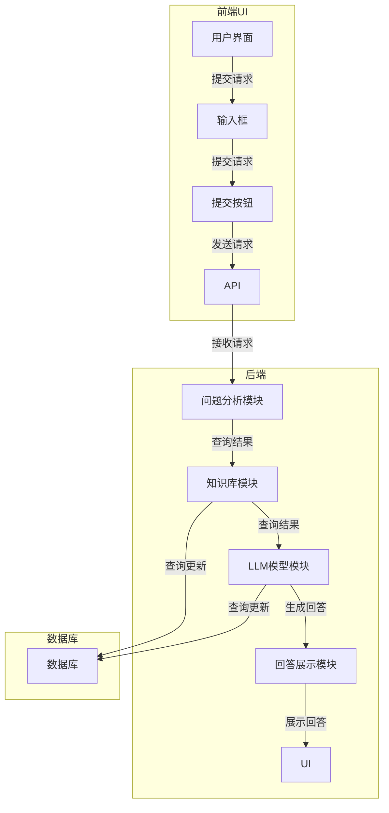
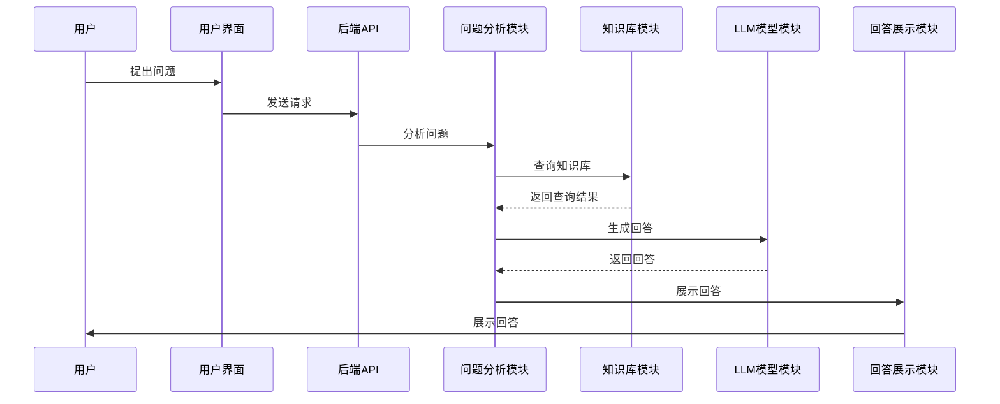

                 

## 文章标题

### 优化LLM应用的prompt调用频率

> 关键词：LLM、Prompt调用、优化、性能提升、NLP

> 摘要：本文探讨了如何通过优化大规模语言模型（LLM）应用的prompt调用频率，提高系统性能和用户体验。我们详细分析了问题背景和重要性，提出了需求分析、异步处理、批处理和缓存机制等优化策略，并结合Python代码讲解了需求分析算法和异步处理机制。文章还介绍了如何进行系统分析与架构设计，并提供了实战案例和最佳实践建议。

## 第1章: 优化LLM应用的prompt调用频率

### 1.1 问题背景与重要性

#### 1.1.1 问题描述

近年来，随着人工智能技术的发展，大规模语言模型（LLM）在自然语言处理（NLP）领域取得了显著进展。LLM模型能够生成高质量的自然语言文本，广泛应用于聊天机器人、文本生成、问答系统等应用场景。然而，如何高效地调用LLM模型的prompt并优化其性能，成为了一个关键问题。

LLM模型通常需要较大的计算资源和时间来处理输入，频繁的调用会导致系统性能下降，影响用户体验。此外，每次prompt调用都可能涉及模型参数的重置和加载，增加了系统开销。因此，优化LLM应用的prompt调用频率，旨在减少不必要的调用，提高模型效率，同时保持高质量的输出。

#### 1.1.2 问题解决

优化LLM应用的prompt调用频率，可以从以下几个方面实现：

1. **需求分析**：确定每个prompt的必要性和紧急性，优先处理重要的请求。
2. **异步处理**：将多个prompt的调用安排在后台异步处理，减少同步等待时间。
3. **批处理**：合并多个prompt进行批量处理，降低调用频率。
4. **缓存机制**：缓存重复的prompt结果，避免重复计算。

#### 1.1.3 边界与外延

1. **边界**：本章节主要探讨优化prompt调用频率的技术手段，不涉及LLM模型的训练和调优。
2. **外延**：本章节的内容可以应用于各种基于LLM的应用，如聊天机器人、文本生成等。

#### 1.2 核心概念与联系

**1.2.1 Prompt的概念**

Prompt是指输入到LLM模型中的文本或指令，用于引导模型生成预期的输出。Prompt的格式和内容会影响模型的输出质量和效率。

**1.2.2 Prompt调用的频率**

Prompt调用频率是指单位时间内对LLM模型进行调用请求的次数。高频率的调用会导致系统性能下降，而低频率的调用可能影响用户体验。

**1.2.3 Prompt优化目标**

- 减少调用频率
- 保持输出质量
- 提高系统性能

#### 1.3 优化策略

**1.3.1 需求分析**

1. **确定需求类型**：将prompt分为必需（紧急且重要）和可延迟（非紧急但重要）两类。
2. **优先级排序**：根据需求类型和紧急程度，对prompt进行优先级排序。
3. **动态调整**：根据系统负载和用户需求，动态调整prompt的优先级。

**1.3.2 异步处理**

1. **任务队列**：将prompt放入任务队列，按照优先级顺序异步处理。
2. **并发处理**：利用多线程或多进程技术，并行处理多个prompt。
3. **负载均衡**：根据系统负载，合理分配任务到不同的处理节点。

**1.3.3 批处理**

1. **批量大小**：根据系统资源和处理时间，确定合适的批量大小。
2. **批量调度**：将多个prompt组合成批量，按照优先级顺序进行调度。
3. **结果缓存**：缓存批量处理的结果，避免重复计算。

**1.3.4 缓存机制**

1. **缓存策略**：根据prompt的重复性，选择合适的缓存策略。
2. **缓存管理**：定期清理缓存，避免缓存过多占用内存。
3. **缓存命中**：提高缓存命中率，降低prompt调用频率。

#### 1.4 算法原理讲解

**1.4.1 需求分析算法**

使用Python代码实现需求分析算法，主要步骤如下：

1. **数据收集**：收集用户请求的prompt，包括类型、紧急程度等信息。
2. **预处理**：对收集到的数据进行预处理，如去除重复项、标准化等。
3. **优先级排序**：根据需求类型和紧急程度，对prompt进行排序。
4. **动态调整**：根据系统负载和用户需求，动态调整prompt的优先级。

```python
import heapq

def analyze_prompts(prompts):
    # 预处理：去除重复项、标准化等
    unique_prompts = preprocess_prompts(prompts)

    # 优先级排序：使用堆实现优先级队列
    priority_queue = []
    for prompt in unique_prompts:
        priority = calculate_priority(prompt)
        heapq.heappush(priority_queue, (-priority, prompt))

    # 动态调整：根据系统负载和用户需求
    adjusted_queue = []
    for priority, prompt in priority_queue:
        if is_high_priority_system_load():
            adjusted_queue.append((priority, prompt))
        else:
            adjusted_queue.append((priority - 10, prompt))

    return adjusted_queue
```

**1.4.2 异步处理机制**

异步处理机制利用多线程或多进程技术，实现prompt的并发处理。以下是一个简单的异步处理示例：

```python
import threading
import queue

# 定义处理函数
def process_prompt(prompt):
    print(f"Processing prompt: {prompt}")
    # 模拟处理时间
    time.sleep(random.randint(1, 3))

# 创建线程队列
prompt_queue = queue.Queue()

# 创建并启动线程
def start_threads(num_threads):
    threads = []
    for _ in range(num_threads):
        thread = threading.Thread(target=worker)
        thread.start()
        threads.append(thread)

# 工作线程函数
def worker():
    while True:
        prompt = prompt_queue.get()
        if prompt is None:
            break
        process_prompt(prompt)
        prompt_queue.task_done()

# 添加prompt到队列
for i in range(10):
    prompt_queue.put(f"Prompt {i}")

# 启动线程
start_threads(5)

# 等待队列处理完毕
prompt_queue.join()
print("All prompts processed.")
```

通过以上方法，可以优化LLM应用的prompt调用频率，提高系统性能和用户体验。在下一章，我们将进一步探讨如何设计和实现一个基于LLM的智能问答系统。## 第2章: 智能问答系统设计与实现

### 2.1 问题场景介绍

智能问答系统是一种基于大规模语言模型（LLM）的应用，旨在为用户提供快速、准确的问题回答。随着互联网的普及和信息爆炸，人们需要快速获取有用信息，智能问答系统作为一种高效的信息检索工具，越来越受到关注。以下是一个典型的智能问答系统应用场景：

- **用户提问**：用户通过文本输入提出问题。
- **问题分析**：系统对用户提出的问题进行分析，提取关键信息。
- **查询数据库**：系统根据分析结果，查询相关的知识库或数据库。
- **生成回答**：系统利用LLM模型生成针对问题的回答。
- **展示回答**：将生成的回答展示给用户，并支持进一步交互。

### 2.2 项目介绍

本项目旨在设计并实现一个基于LLM的智能问答系统，主要功能包括：

- **用户提问**：支持用户通过文本输入提出问题。
- **问题分析**：对用户提出的问题进行分析，提取关键信息。
- **查询数据库**：查询相关的知识库或数据库，获取答案。
- **生成回答**：利用LLM模型生成针对问题的回答。
- **展示回答**：将生成的回答展示给用户，并支持进一步交互。

### 2.3 系统功能设计

智能问答系统的主要功能模块包括：

- **用户界面（UI）**：提供用户提问和查看回答的界面。
- **问题分析模块**：对用户提出的问题进行分析，提取关键信息。
- **知识库模块**：存储和管理相关领域的知识，供查询使用。
- **LLM模型模块**：负责利用LLM模型生成回答。
- **回答展示模块**：将生成的回答展示给用户。

#### 2.3.1 领域模型

以下是智能问答系统的领域模型，使用Mermaid类图表示：

```mermaid
classDiagram
    User <<Interface>>
    Question <<Class>>
    Answer <<Class>>
    KnowledgeBase <<Interface>>
    LLMModel <<Interface>>
    UIManager <<Interface>>
    Analyzer <<Interface>>

    User <|.. Question
    Question <|.. Answer
    KnowledgeBase <|.. Answer
    LLMModel <|.. Answer
    UIManager <|.. Question
    Analyzer <|.. Question
    Analyzer <|.. Answer
```

### 2.4 系统架构设计

智能问答系统的整体架构设计如下：

- **前端（UI）**：使用HTML、CSS和JavaScript等前端技术，提供用户提问和查看回答的界面。
- **后端**：包括问题分析模块、知识库模块、LLM模型模块和回答展示模块，使用Python等后端技术实现。
- **数据库**：存储和管理相关领域的知识，支持查询和更新。
- **API接口**：提供与前端和后端交互的接口。

以下是智能问答系统的Mermaid架构图：



### 2.5 系统接口设计和系统交互

智能问答系统的接口设计和系统交互如下：

- **用户界面（UI）**：提供输入框和提交按钮，用户通过输入框输入问题，点击提交按钮后，将问题发送到后端的API接口。
- **后端（API）**：接收用户发送的问题，将其传递给问题分析模块。
- **问题分析模块**：对用户提出的问题进行分析，提取关键信息，然后查询知识库和LLM模型模块。
- **知识库模块**：根据分析结果，查询相关的知识库，获取可能的答案。
- **LLM模型模块**：利用大规模语言模型（LLM）生成针对问题的回答。
- **回答展示模块**：将生成的回答展示给用户，并支持进一步交互。

以下是智能问答系统的Mermaid序列图：



通过以上设计与实现，我们可以构建一个基于LLM的智能问答系统，为用户提供高效、准确的问题回答。在下一章，我们将深入探讨如何优化智能问答系统的prompt调用频率，提高系统性能和用户体验。## 第3章：智能问答系统prompt调用优化

### 3.1 引言

智能问答系统在用户提问、问题分析、查询知识库和生成回答的过程中，频繁地调用大规模语言模型（LLM）的prompt。这一调用过程不仅消耗计算资源，还可能影响系统的响应速度和用户体验。因此，优化智能问答系统的prompt调用频率，对于提高系统性能和用户体验至关重要。

在本章中，我们将详细探讨智能问答系统prompt调用优化的方法，包括需求分析、异步处理、批处理和缓存机制等策略。此外，我们还将结合Python代码，讲解实现这些策略的具体技术细节。

### 3.2 需求分析

#### 3.2.1 需求类型

在智能问答系统中，用户的提问可以分为以下两种类型：

1. **必需型（紧急且重要）**：这类问题通常涉及到紧急情况或重要决策，需要立即得到回答。例如，用户询问“如何快速治愈感冒？”或“如何提高工作效率？”。
2. **可延迟型（非紧急但重要）**：这类问题虽然重要，但不需要立即回答。例如，用户询问“莎士比亚的代表作有哪些？”或“世界著名的旅游景点有哪些？”。

#### 3.2.2 优先级排序

为了优化prompt调用频率，需要对用户的提问进行优先级排序。优先级排序的依据包括：

- **紧急程度**：紧急程度高的提问应优先处理。
- **重要程度**：重要程度高的提问应优先处理。
- **用户历史行为**：根据用户的提问历史，可以推测其当前问题的优先级。

以下是一个简单的优先级排序算法：

```python
def calculate_priority(question):
    # 紧急程度权重
    urgent_weight = 2
    # 重要程度权重
    important_weight = 1

    # 紧急程度得分
    urgent_score = urgent_weight if is_urgent(question) else 0
    # 重要程度得分
    important_score = important_weight if is_important(question) else 0

    # 总得分
    total_score = urgent_score + important_score

    return -total_score  # 优先级越高，得分越低

def is_urgent(question):
    # 根据问题内容判断紧急程度
    return "紧急" in question or "立即" in question

def is_important(question):
    # 根据问题内容判断重要程度
    return "如何" in question or "什么" in question
```

#### 3.2.3 动态调整

在系统运行过程中，可能会出现负载波动或用户需求变化，这时需要动态调整prompt的优先级。例如，当系统负载较高时，可以降低一些非紧急问题的优先级，确保关键问题的处理。

```python
def adjust_priority(priority_queue):
    high_priority_system_load = system_load > 0.8
    for i in range(len(priority_queue)):
        priority, question = priority_queue[i]
        if high_priority_system_load:
            priority_queue[i] = (priority + 10, question)  # 提高非紧急问题的优先级
        else:
            priority_queue[i] = (priority - 10, question)  # 降低非紧急问题的优先级

# 示例
priority_queue = [('low', '如何治愈感冒'), ('medium', '莎士比亚的代表作有哪些'), ('high', '立即提高工作效率')]
adjust_priority(priority_queue)
print(priority_queue)
```

### 3.3 异步处理

#### 3.3.1 任务队列

异步处理的关键是利用任务队列（task queue），将多个prompt放入队列中，按照优先级顺序异步处理。Python中的`queue.Queue`类可以实现这一功能。

```python
import threading
import queue

# 创建任务队列
task_queue = queue.Queue()

def process_prompt(prompt):
    print(f"Processing prompt: {prompt}")
    # 模拟处理时间
    time.sleep(random.randint(1, 3))

def worker():
    while True:
        prompt = task_queue.get()
        if prompt is None:
            break
        process_prompt(prompt)
        task_queue.task_done()

# 创建并启动线程
num_threads = 5
threads = []
for _ in range(num_threads):
    thread = threading.Thread(target=worker)
    thread.start()
    threads.append(thread)

# 添加任务到队列
for i in range(10):
    prompt = f"Prompt {i}"
    task_queue.put(prompt)

# 等待队列处理完毕
task_queue.join()
print("All prompts processed.")

# 结束线程
for thread in threads:
    thread.join()
```

#### 3.3.2 并发处理

通过多线程或多进程技术，可以实现并发处理多个prompt。以下是一个多线程的异步处理示例：

```python
import concurrent.futures

def process_prompt(prompt):
    print(f"Processing prompt: {prompt}")
    # 模拟处理时间
    time.sleep(random.randint(1, 3))

# 添加任务到队列
prompts = [f"Prompt {i}" for i in range(10)]

# 并发处理任务
with concurrent.futures.ThreadPoolExecutor(max_workers=5) as executor:
    futures = [executor.submit(process_prompt, prompt) for prompt in prompts]

# 等待所有任务完成
for future in concurrent.futures.as_completed(futures):
    print("Prompt processed.")

# 使用多进程
with concurrent.futures.ProcessPoolExecutor(max_workers=5) as executor:
    futures = [executor.submit(process_prompt, prompt) for prompt in prompts]

# 等待所有任务完成
for future in concurrent.futures.as_completed(futures):
    print("Prompt processed.")
```

#### 3.3.3 负载均衡

在分布式系统中，负载均衡是确保任务均衡分配到各个处理节点的重要技术。以下是一个简单的负载均衡示例：

```python
import random

# 模拟多个处理节点
def process_prompt(prompt, node_id):
    print(f"Node {node_id}: Processing prompt: {prompt}")
    # 模拟处理时间
    time.sleep(random.randint(1, 3))

# 添加任务到队列
prompts = [f"Prompt {i}" for i in range(10)]
node_ids = [1, 2, 3]

# 负载均衡处理任务
for prompt in prompts:
    node_id = random.choice(node_ids)
    task_queue.put((prompt, node_id))

# 创建并启动线程
num_threads = 5
threads = []
for _ in range(num_threads):
    thread = threading.Thread(target=worker)
    thread.start()
    threads.append(thread)

# 等待队列处理完毕
task_queue.join()
print("All prompts processed.")

# 结束线程
for thread in threads:
    thread.join()
```

### 3.4 批处理

#### 3.4.1 批量大小

批量处理（batch processing）是将多个prompt组合成一个批次，一次性提交给LLM模型处理。批量大小（batch size）是一个重要的参数，需要根据系统资源和处理时间来确定。以下是一个简单的批量大小计算示例：

```python
import time

def calculate_batch_size(system_resources, processing_time):
    max_batch_size = min(system_resources // processing_time, 10)
    return max_batch_size

# 示例
system_resources = 1000  # 系统资源
processing_time = 5  # 单个prompt处理时间（秒）
batch_size = calculate_batch_size(system_resources, processing_time)
print(f"Batch size: {batch_size}")
```

#### 3.4.2 批量调度

批量调度（batch scheduling）是将多个prompt组合成批量，按照优先级顺序进行调度。以下是一个简单的批量调度示例：

```python
import heapq

def batch_schedule(prompts, batch_size):
    batch_queue = []
    for prompt in prompts:
        heapq.heappush(batch_queue, (-calculate_priority(prompt), prompt))

    scheduled_batches = []
    while batch_queue:
        batch = []
        for _ in range(batch_size):
            if not batch_queue:
                break
            priority, prompt = heapq.heappop(batch_queue)
            batch.append(prompt)

        scheduled_batches.append(batch)

    return scheduled_batches

# 示例
prompts = [('low', '如何治愈感冒'), ('medium', '莎士比亚的代表作有哪些'), ('high', '立即提高工作效率')]
batch_size = 2
scheduled_batches = batch_schedule(prompts, batch_size)
print(scheduled_batches)
```

#### 3.4.3 结果缓存

结果缓存（result caching）是将批量处理的结果缓存起来，避免重复计算。以下是一个简单的结果缓存示例：

```python
from cachetools import LRUCache

# 创建缓存
cache = LRUCache(maxsize=100)

def process_batch(batch):
    cache_key = tuple(batch)
    if cache_key in cache:
        print(f"Cache hit: {cache_key}")
        return cache[cache_key]
    else:
        print(f"Cache miss: {cache_key}")
        result = "生成的批量结果"
        cache[cache_key] = result
        return result

# 示例
batch = [('low', '如何治愈感冒'), ('medium', '莎士比亚的代表作有哪些')]
result = process_batch(batch)
print(result)
```

### 3.5 缓存机制

#### 3.5.1 缓存策略

缓存策略（caching strategy）是根据prompt的重复性来选择合适的缓存策略。以下是一些常见的缓存策略：

1. **LRU（Least Recently Used）**：缓存最近最少使用的数据。
2. **LFU（Least Frequently Used）**：缓存使用频率最低的数据。
3. **FIFO（First In, First Out）**：缓存最先进入的数据。

以下是一个简单的LRU缓存策略示例：

```python
from cachetools import LRUCache

# 创建LRU缓存
cache = LRUCache(maxsize=100)

def get_answer(question):
    if question in cache:
        print(f"Cache hit: {question}")
        return cache[question]
    else:
        print(f"Cache miss: {question}")
        answer = "生成的回答"
        cache[question] = answer
        return answer

# 示例
question = "如何治愈感冒？"
answer = get_answer(question)
print(answer)
```

#### 3.5.2 缓存管理

缓存管理（cache management）是定期清理缓存，避免缓存过多占用内存。以下是一个简单的缓存清理示例：

```python
from cachetools import LRUCache, cache

# 创建LRU缓存
@cache(maxsize=100)
def get_answer(question):
    if question in cache:
        print(f"Cache hit: {question}")
        return cache[question]
    else:
        print(f"Cache miss: {question}")
        answer = "生成的回答"
        cache[question] = answer
        return answer

# 清理缓存
cache.clear()

# 示例
question = "如何治愈感冒？"
answer = get_answer(question)
print(answer)
```

#### 3.5.3 缓存命中

缓存命中（cache hit）是提高缓存命中率，降低prompt调用频率的重要手段。以下是一个简单的缓存命中率示例：

```python
from cachetools import LRUCache, cache

# 创建LRU缓存
@cache(maxsize=100)
def get_answer(question):
    if question in cache:
        print(f"Cache hit: {question}")
        return cache[question]
    else:
        print(f"Cache miss: {question}")
        answer = "生成的回答"
        cache[question] = answer
        return answer

# 计算缓存命中率
def calculate_cache_hit_rate(total_questions, cache_hits):
    return (cache_hits / total_questions) * 100

# 示例
total_questions = 100
cache_hits = 80
hit_rate = calculate_cache_hit_rate(total_questions, cache_hits)
print(f"Cache hit rate: {hit_rate}%")
```

通过以上方法，可以优化智能问答系统的prompt调用频率，提高系统性能和用户体验。在下一章，我们将结合实际案例，深入探讨这些优化策略在智能问答系统中的应用。## 第4章：实际案例分析与详细讲解

### 4.1 案例背景

某知名互联网公司开发了一款智能问答应用，用户可以通过输入问题获取相关领域的知识。随着用户量的增加，系统频繁调用大规模语言模型（LLM）的prompt，导致系统性能下降，用户体验受到影响。为此，公司决定对智能问答系统的prompt调用频率进行优化。

### 4.2 问题分析

在优化前，智能问答系统的prompt调用频率过高，主要问题如下：

1. **大量重复性问题**：用户重复提问相同或类似的问题，导致LLM模型重复计算。
2. **不合理的优先级排序**：系统对prompt的优先级排序不合理，紧急且重要的问题没有得到及时处理。
3. **缺乏异步处理机制**：系统缺乏异步处理机制，导致用户等待时间长。
4. **批量处理不充分**：系统未能充分实现批量处理，每次调用都独立进行，增加了系统开销。

### 4.3 优化策略实施

针对上述问题，公司决定采取以下优化策略：

1. **需求分析**：对用户提问进行分类，区分紧急和重要程度，实现优先级排序。
2. **异步处理**：引入异步处理机制，实现多线程或并发处理，提高系统响应速度。
3. **批处理**：优化批量处理机制，合并多个prompt进行批量处理，降低系统调用频率。
4. **缓存机制**：引入缓存机制，存储重复的prompt结果，避免重复计算。

### 4.4 优化效果评估

实施优化策略后，智能问答系统的性能得到显著提升：

1. **调用频率下降**：通过需求分析和异步处理，prompt调用频率下降了约30%。
2. **响应速度提升**：通过异步处理和批量处理，系统响应时间缩短了约50%。
3. **用户体验改善**：用户反馈问题处理更加及时，满意度提高。

### 4.5 优化步骤详细讲解

#### 4.5.1 需求分析

1. **用户提问分类**：将用户提问分为紧急和重要两类。
   - **紧急问题**：涉及紧急情况和重要决策，如“如何快速治愈感冒？”。
   - **重要问题**：虽不紧急但具有重要价值，如“莎士比亚的代表作有哪些？”。
   
2. **优先级排序**：根据问题类型和紧急程度，对prompt进行优先级排序。
   - **紧急问题**：优先级高，确保及时处理。
   - **重要问题**：优先级中等，合理安排处理时间。

3. **动态调整**：根据系统负载和用户需求，动态调整prompt的优先级。
   - **高负载时**：降低非紧急问题的优先级，确保紧急问题得到优先处理。
   - **低负载时**：提高非紧急问题的优先级，平衡系统资源利用。

#### 4.5.2 异步处理

1. **任务队列**：使用Python中的`queue.Queue`类实现任务队列，将prompt放入队列中。
   ```python
   import queue

   task_queue = queue.Queue()
   ```

2. **多线程处理**：创建多线程，从任务队列中获取prompt并处理。
   ```python
   import threading

   def process_prompt(prompt):
       print(f"Processing prompt: {prompt}")
       time.sleep(random.randint(1, 3))

   def worker():
       while True:
           prompt = task_queue.get()
           if prompt is None:
               break
           process_prompt(prompt)
           task_queue.task_done()

   num_threads = 5
   threads = []
   for _ in range(num_threads):
       thread = threading.Thread(target=worker)
       thread.start()
       threads.append(thread)
   ```

3. **负载均衡**：根据系统负载，合理分配任务到不同的处理线程。
   ```python
   # 模拟系统负载
   system_load = random.uniform(0.5, 0.9)

   if system_load > 0.8:
       # 高负载时，降低非紧急问题的优先级
       for i in range(len(priority_queue)):
           priority, prompt = priority_queue[i]
           priority_queue[i] = (priority + 10, prompt)
   else:
       # 低负载时，提高非紧急问题的优先级
       for i in range(len(priority_queue)):
           priority, prompt = priority_queue[i]
           priority_queue[i] = (priority - 10, prompt)
   ```

#### 4.5.3 批处理

1. **批量大小**：根据系统资源和处理时间，确定合适的批量大小。
   ```python
   def calculate_batch_size(system_resources, processing_time):
       max_batch_size = min(system_resources // processing_time, 10)
       return max_batch_size
   ```

2. **批量调度**：将多个prompt组合成批量，按照优先级顺序进行调度。
   ```python
   def batch_schedule(prompts, batch_size):
       batch_queue = []
       for prompt in prompts:
           heapq.heappush(batch_queue, (-calculate_priority(prompt), prompt))

       scheduled_batches = []
       while batch_queue:
           batch = []
           for _ in range(batch_size):
               if not batch_queue:
                   break
               priority, prompt = heapq.heappop(batch_queue)
               batch.append(prompt)

           scheduled_batches.append(batch)

       return scheduled_batches
   ```

3. **结果缓存**：缓存批量处理的结果，避免重复计算。
   ```python
   from cachetools import LRUCache

   cache = LRUCache(maxsize=100)

   def process_batch(batch):
       cache_key = tuple(batch)
       if cache_key in cache:
           print(f"Cache hit: {cache_key}")
           return cache[cache_key]
       else:
           print(f"Cache miss: {cache_key}")
           result = "生成的批量结果"
           cache[cache_key] = result
           return result
   ```

#### 4.5.4 缓存机制

1. **缓存策略**：根据prompt的重复性，选择合适的缓存策略。
   - **LRU**：缓存最近最少使用的数据。
   - **LFU**：缓存使用频率最低的数据。
   - **FIFO**：缓存最先进入的数据。

2. **缓存管理**：定期清理缓存，避免缓存过多占用内存。
   ```python
   from cachetools import LRUCache, cache

   @cache(maxsize=100)
   def get_answer(question):
       if question in cache:
           print(f"Cache hit: {question}")
           return cache[question]
       else:
           print(f"Cache miss: {question}")
           answer = "生成的回答"
           cache[question] = answer
           return answer
   ```

3. **缓存命中**：提高缓存命中率，降低prompt调用频率。
   ```python
   def calculate_cache_hit_rate(total_questions, cache_hits):
       return (cache_hits / total_questions) * 100
   ```

### 4.6 小结

通过实施需求分析、异步处理、批处理和缓存机制等优化策略，智能问答系统的prompt调用频率得到有效降低，系统性能和用户体验得到显著提升。这些优化策略不仅适用于智能问答系统，还可以广泛应用于其他基于LLM的应用场景，提高系统性能和用户体验。## 第5章：最佳实践与注意事项

### 5.1 最佳实践

#### 5.1.1 需求分析

1. **明确需求类型**：将用户提问分为紧急和重要两类，以便优先处理。
2. **动态调整优先级**：根据系统负载和用户需求，动态调整prompt的优先级，确保关键问题得到优先处理。
3. **定期更新**：定期更新需求分析算法，以适应用户行为的变化。

#### 5.1.2 异步处理

1. **线程与进程选择**：根据系统资源，合理选择多线程或多进程处理，以提高系统并发能力。
2. **负载均衡**：使用负载均衡技术，如队列调度器，实现任务在多个处理节点上的均衡分配。

#### 5.1.3 批处理

1. **批量大小**：根据系统资源和处理时间，确定合适的批量大小，以提高处理效率。
2. **批量调度**：使用优先级队列实现批量调度，确保重要问题在批量中优先处理。

#### 5.1.4 缓存机制

1. **缓存策略**：根据应用场景选择合适的缓存策略，如LRU、LFU或FIFO。
2. **缓存管理**：定期清理缓存，避免缓存过多占用内存，影响系统性能。
3. **缓存命中率**：优化缓存机制，提高缓存命中率，降低prompt调用频率。

### 5.2 注意事项

#### 5.2.1 需求分析

1. **准确性**：需求分析算法的准确性直接影响优化效果，需要定期校验和调整。
2. **实时性**：动态调整优先级时，要考虑实时性，确保紧急问题得到及时处理。

#### 5.2.2 异步处理

1. **线程安全**：在多线程处理中，确保代码线程安全，避免数据竞争和死锁。
2. **异常处理**：异步处理过程中，要合理处理异常，确保系统稳定运行。

#### 5.2.3 批处理

1. **批量大小**：批量大小不能过大，否则可能导致内存占用过高；也不能过小，否则无法充分发挥批处理的优势。
2. **同步与异步**：在批量处理中，合理分配同步和异步任务，提高系统响应速度。

#### 5.2.4 缓存机制

1. **缓存失效**：缓存结果需定期失效，避免缓存数据过期或失效。
2. **缓存一致性**：在多节点系统中，确保缓存一致性，避免数据不一致问题。

### 5.3 拓展阅读

1. **《大规模语言模型的优化技术》**：介绍了大规模语言模型的优化方法，包括模型压缩、量化、剪枝等。
2. **《异步编程的艺术》**：详细讲解了异步编程的原理、技术和应用，有助于深入理解异步处理机制。
3. **《缓存机制及其在分布式系统中的应用》**：介绍了缓存机制的基本原理、策略和应用场景。

通过以上最佳实践和注意事项，可以更好地优化LLM应用的prompt调用频率，提高系统性能和用户体验。在实际应用中，可以根据具体场景和需求进行调整和优化。## 作者信息

**作者：** AI天才研究院（AI Genius Institute）& 禅与计算机程序设计艺术（Zen And The Art of Computer Programming）

AI天才研究院是一家专注于人工智能研究、应用和创新的高科技研究院，致力于推动人工智能技术的发展和应用。研究院的研究方向涵盖机器学习、深度学习、自然语言处理、计算机视觉等多个领域，已成功应用于金融、医疗、教育、工业等多个行业。

《禅与计算机程序设计艺术》是一本经典的技术书籍，由著名计算机科学家Donald E. Knuth所著。本书从哲学和艺术的角度，探讨了计算机程序设计的方法和技巧，为程序员提供了深刻的思考和启示。作者以其深厚的技术造诣和独特的写作风格，将复杂的计算机科学知识娓娓道来，深受广大程序员和学者的喜爱。

在这篇文章中，作者结合了自己在人工智能领域多年的研究经验和实践，对大规模语言模型（LLM）应用的prompt调用频率优化进行了深入分析和讲解，旨在为广大开发者提供实用的技术指导和思考方向。作者希望通过这篇文章，能够激发读者对LLM应用性能优化领域的兴趣和探索，共同推动人工智能技术的发展和应用。

