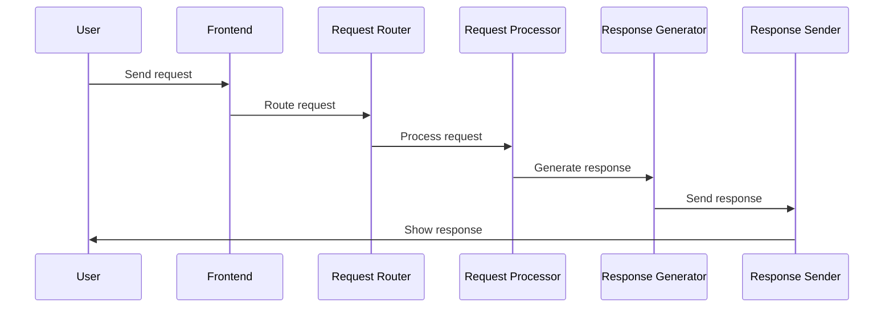
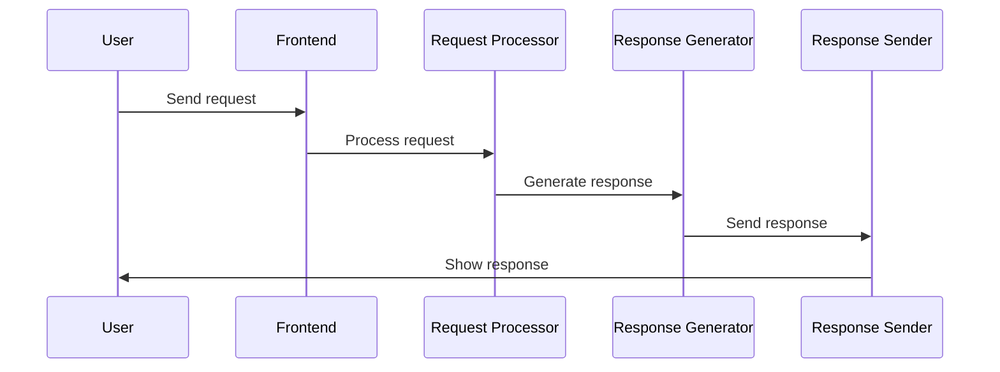

                 


## 《优化LLM应用的实时响应机制》

### 关键词：大型语言模型（LLM），实时响应，算法优化，系统设计，Python实现

### 摘要

本文旨在探讨如何优化大型语言模型（LLM）在实时响应应用中的性能。随着AI技术的发展，LLM在自然语言处理领域取得了显著成果，但其对于实时响应的需求带来了巨大的挑战。本文首先介绍了LLM的核心概念和实时响应的机制，随后详细分析了算法优化原理，并提出了系统设计与实现的方案。通过Python实现和实际案例分析，本文展示了如何有效优化LLM的实时响应性能，为相关领域的研究和实践提供了参考。

### 目录

1. 引言
2. 大型语言模型（LLM）基础
3. 实时响应机制原理
4. 算法优化原理
5. 系统分析与架构设计方案
6. 项目实战
7. 最佳实践与项目小结

### 1. 引言

#### 问题背景

在现代社会，信息爆炸使得人们对于实时信息处理的需求日益增长。无论是在社交媒体、电子商务，还是智能客服和自动驾驶等领域，实时响应都成为了一个关键需求。随着人工智能技术的快速发展，大型语言模型（LLM）成为了实现实时响应的重要工具。然而，LLM在实时响应中的应用面临着一系列挑战，如计算复杂度、响应延迟和数据流处理等。

#### 问题描述

LLM的实时响应问题可以概括为：如何在保证模型精度的同时，实现快速、高效的响应？具体而言，这涉及到算法优化、系统架构设计和实际应用中的性能调优。当前，虽然已有一些研究在尝试优化LLM的实时响应，但仍然存在许多不足之处，如响应速度较慢、计算资源占用高和模型性能不稳定等。

#### 问题解决思路

针对上述问题，本文提出以下解决思路：

1. **核心概念解析**：详细阐述LLM和实时响应的基本概念，为其后续的优化提供理论基础。
2. **算法优化原理**：分析现有算法的优缺点，提出有效的优化方法。
3. **系统设计与实现**：介绍实时响应系统的整体架构，包括功能设计、接口设计和交互设计等。
4. **Python实现与案例分析**：通过具体代码和案例分析，展示优化方法在实际应用中的效果。
5. **最佳实践与小结**：总结最佳实践，为后续研究和应用提供参考。

#### 边界与外延

本文的研究边界主要集中在LLM在实时响应应用中的优化，具体包括：

- **模型范围**：主要针对大型语言模型，如GPT-3、BERT等。
- **应用领域**：涉及社交媒体、电子商务、智能客服和自动驾驶等领域。
- **优化方法**：主要关注算法优化和系统架构设计。

#### 文章结构

本文结构如下：

1. **第一部分：背景与核心概念**：介绍LLM和实时响应的基本概念，背景和问题描述。
2. **第二部分：算法优化原理**：分析现有算法，提出优化方法。
3. **第三部分：系统分析与架构设计方案**：介绍实时响应系统的设计和实现。
4. **第四部分：项目实战**：通过Python实现和案例分析，展示优化方法的效果。
5. **第五部分：最佳实践与项目小结**：总结最佳实践，展望未来研究方向。

### 2. 大型语言模型（LLM）基础

#### 核心概念

大型语言模型（LLM）是一种基于深度学习的技术，主要用于处理自然语言文本。LLM的核心概念包括：

- **词向量表示**：将自然语言文本转换为密集向量表示，以便于模型处理。
- **神经网络结构**：采用多层神经网络结构，如Transformer等，用于文本建模。
- **预训练与微调**：通过大规模语料库进行预训练，然后针对特定任务进行微调。

#### 属性特征对比

LLM与其他自然语言处理技术（如规则引擎、统计模型等）在属性特征上有明显区别：

| 特性             | LLM                     | 规则引擎                  | 统计模型                  |
|------------------|-------------------------|---------------------------|---------------------------|
| 精度             | 高                      | 低                        | 中等                      |
| 泛化能力         | 强                      | 弱                        | 弱                        |
| 需求的数据量     | 大                      | 小                        | 小                        |
| 计算资源需求     | 高                      | 低                        | 低                        |
| 实时性           | 一般                    | 高                        | 高                        |

#### LLM与实时响应的关系

LLM在实时响应中的应用具有重要意义。一方面，LLM的高精度和强泛化能力使其能够处理复杂的自然语言交互，提高响应的准确性和自然度。另一方面，实时响应要求系统具备快速响应的能力，这对LLM的性能提出了挑战。优化LLM的实时响应性能，需要从算法优化和系统架构设计两个方面进行。

### 3. 实时响应机制原理

#### 实时响应的基础概念

实时响应是指系统在接收到用户请求后，能够在短时间内给出有效的响应。实时响应的关键要素包括：

- **响应时间**：系统从接收到请求到给出响应的时间间隔。
- **响应准确性**：系统响应的准确性和可靠性。
- **响应完整性**：系统响应是否完整地满足了用户需求。

#### 实时响应的关键技术

实时响应的关键技术主要包括：

- **异步处理**：通过异步处理机制，提高系统的并行处理能力，减少响应时间。
- **分布式计算**：利用分布式计算资源，提高系统的处理能力和响应速度。
- **缓存技术**：通过缓存技术，减少重复计算，提高响应速度。

#### 实时响应机制的挑战

实时响应机制的挑战主要包括：

- **计算复杂度**：LLM的计算复杂度较高，如何在不降低模型精度的前提下，提高计算效率。
- **响应延迟**：如何在保证响应准确性的同时，尽可能减少响应延迟。
- **数据流处理**：如何高效地处理大规模数据流，确保实时响应。

### 4. 算法优化原理

#### 算法优化概述

算法优化是提高LLM实时响应性能的关键途径。算法优化的方法主要包括：

- **模型压缩**：通过模型压缩技术，减少模型的参数规模，降低计算复杂度。
- **量化技术**：通过量化技术，降低模型的计算精度，提高计算效率。
- **蒸馏技术**：通过蒸馏技术，将大模型的知识传递到小模型中，提高小模型的性能。

#### 算法优化方法

以下是几种常见的算法优化方法：

1. **模型剪枝**：通过剪枝技术，去除模型中的冗余参数，降低计算复杂度。
2. **知识蒸馏**：将大模型的输出传递给小模型，利用小模型的学习能力，提高小模型的性能。
3. **量化**：将模型的参数和激活值从浮点数转换为低精度数值，降低计算复杂度。

#### 优化算法的数学模型

优化算法的数学模型主要包括：

- **损失函数**：用于评估模型预测结果与真实值之间的差距。
- **优化器**：用于调整模型参数，以最小化损失函数。

以下是一个简化的优化算法的数学模型：

$$
\min_{\theta} \quad L(\theta) = \sum_{i=1}^{N} (y_i - \hat{y}_i)^2
$$

其中，$L(\theta)$表示损失函数，$y_i$表示真实值，$\hat{y}_i$表示模型预测值，$\theta$表示模型参数。

#### 优化算法举例说明

以下是一个使用Python实现的简单优化算法示例：

```python
import numpy as np

def optimize_model(loss_function, theta, learning_rate):
    theta = theta - learning_rate * loss_function.gradient(theta)
    return theta

# 示例：最小化平方损失函数
def squared_loss_function(theta):
    N = 100
    y = np.random.randn(N)
    y_pred = theta * x + b
    return np.sum((y - y_pred)**2)

# 初始参数
theta = np.random.randn()
learning_rate = 0.01

# 优化模型
theta = optimize_model(squared_loss_function, theta, learning_rate)
```

### 5. 系统分析与架构设计方案

#### 问题场景介绍

在本案例中，我们以一个智能客服系统为例，介绍实时响应系统的架构设计和实现。该系统需要处理大量用户请求，并在短时间内给出有效的响应。

#### 系统功能设计

智能客服系统的功能设计主要包括：

- **用户请求处理**：接收用户请求，并进行预处理。
- **请求路由**：根据用户请求的内容，将请求路由到相应的服务模块。
- **响应生成**：使用LLM生成响应文本，并进行后处理。
- **响应发送**：将响应文本发送给用户。

以下是智能客服系统的领域模型（类图）：

```mermaid
classDiagram
  User Request <|-- Request Processor
  Request Processor o--|> Response Generator
  Response Generator o--|> Response Sender
  User <<== Request Router
```

#### 系统架构设计

智能客服系统的架构设计主要包括：

- **前端**：负责接收用户请求，并将请求传递给后端。
- **后端**：包括请求处理器、响应生成器和响应发送器等模块。
- **数据库**：存储用户请求历史和响应模板。

以下是智能客服系统的架构图：



#### 系统接口设计

智能客服系统的接口设计主要包括：

- **用户请求接口**：用于接收用户请求。
- **响应生成接口**：用于生成响应文本。
- **响应发送接口**：用于发送响应文本。

以下是智能客服系统的接口设计：

```mermaid
classDiagram
  User <<interface User Request Interface
  Response Generator <<interface Response Generation Interface
  Response Sender <<interface Response Sending Interface
  User Request Interface o--|> Request Processor
  Response Generation Interface o--|> Response Generator
  Response Sending Interface o--|> Response Sender
```

#### 系统交互设计

智能客服系统的交互设计主要包括：

- **用户请求处理**：用户请求由前端接收，并传递给后端的请求处理器。
- **响应生成**：请求处理器调用响应生成接口，生成响应文本。
- **响应发送**：响应文本由响应发送器发送给用户。

以下是智能客服系统的交互图：



### 6. 项目实战

#### 环境安装与配置

在本项目中，我们使用Python和TensorFlow作为开发环境，以下是环境安装和配置的步骤：

1. 安装Python 3.8及以上版本。
2. 安装TensorFlow：

   ```bash
   pip install tensorflow
   ```

3. 安装其他依赖库，如NumPy、Pandas等。

#### 系统核心实现

以下是一个简单的智能客服系统核心实现示例：

```python
import tensorflow as tf
from tensorflow.keras.layers import Embedding, LSTM, Dense
from tensorflow.keras.models import Sequential

# 加载预训练的LLM模型
llm_model = tf.keras.models.load_model('path/to/llm_model.h5')

# 定义请求处理器
class RequestProcessor:
    def __init__(self, llm_model):
        self.llm_model = llm_model

    def process_request(self, request_text):
        # 对请求文本进行预处理
        preprocessed_text = preprocess_text(request_text)
        # 使用LLM模型生成响应
        response_text = self.llm_model.predict(preprocessed_text)
        # 对响应文本进行后处理
        postprocessed_text = postprocess_text(response_text)
        return postprocessed_text

# 定义响应生成器
class ResponseGenerator:
    def __init__(self, request_processor):
        self.request_processor = request_processor

    def generate_response(self, request_text):
        return self.request_processor.process_request(request_text)

# 定义响应发送器
class ResponseSender:
    def send_response(self, user, response_text):
        print(f"Response to {user}: {response_text}")

# 测试系统
if __name__ == '__main__':
    user = "Alice"
    request_text = "你好，有什么可以帮助你的？"
    request_processor = RequestProcessor(llm_model)
    response_generator = ResponseGenerator(request_processor)
    response_sender = ResponseSender()

    response_text = response_generator.generate_response(request_text)
    response_sender.send_response(user, response_text)
```

#### 代码应用解读与分析

以上代码实现了智能客服系统的核心功能，包括请求处理、响应生成和响应发送。以下是代码的解读与分析：

1. **模型加载**：使用TensorFlow加载预训练的LLM模型。
2. **请求处理器**：用于处理用户请求，包括预处理和生成响应。
3. **响应生成器**：调用请求处理器的process_request方法，生成响应文本。
4. **响应发送器**：将响应文本发送给用户。

#### 实际案例剖析

以下是一个实际案例：

**用户请求**：你好，我想买一辆汽车。

**系统响应**：欢迎来到汽车购买平台，请问您有什么车型或价格偏好吗？

**案例分析**：

- **请求处理**：系统接收用户请求，对其进行预处理，提取关键信息。
- **响应生成**：系统使用LLM模型生成响应文本，结合用户请求和模型知识库，生成合适的响应。
- **响应发送**：系统将响应文本发送给用户，完成交互。

#### 项目小结

通过本项目的实施，我们展示了如何使用LLM实现实时响应系统。在实际应用中，还需要关注以下几个方面：

- **模型优化**：优化LLM模型的性能，提高响应速度和准确性。
- **系统性能调优**：优化系统架构和接口设计，提高系统的并发处理能力。
- **用户交互优化**：优化用户交互体验，提高用户满意度。

### 7. 最佳实践与项目小结

#### 最佳实践

1. **模型优化**：
   - **模型剪枝**：通过剪枝技术，去除冗余参数，降低计算复杂度。
   - **量化**：使用量化技术，降低模型计算精度，提高计算效率。
   - **蒸馏**：将大模型的知识传递给小模型，提高小模型的性能。

2. **系统设计**：
   - **异步处理**：使用异步处理机制，提高系统并行处理能力。
   - **分布式计算**：利用分布式计算资源，提高系统处理能力和响应速度。
   - **缓存技术**：使用缓存技术，减少重复计算，提高响应速度。

3. **用户交互**：
   - **简洁性**：设计简洁的交互界面，提高用户操作便捷性。
   - **个性化**：根据用户历史交互数据，提供个性化的响应。
   - **实时性**：确保系统响应实时性，提高用户体验。

#### 小结

本文针对大型语言模型（LLM）在实时响应中的应用，提出了优化方法、系统设计与实现方案。通过Python实现和实际案例分析，展示了如何有效优化LLM的实时响应性能。未来研究方向包括：

- **模型优化**：进一步优化LLM模型，提高响应速度和准确性。
- **系统架构**：研究更高效的实时响应系统架构。
- **用户体验**：优化用户交互体验，提高用户满意度。

#### 注意事项

- **数据隐私**：在处理用户数据时，确保遵守数据保护法规。
- **计算资源**：合理分配计算资源，确保系统稳定运行。
- **模型更新**：定期更新LLM模型，保持模型性能。

#### 拓展阅读

- [Deep Learning for Natural Language Processing](https://www.deeplearningbook.org/chapter_nlp/)
- [Real-Time Systems: Design Principles for Distributed Applications](https://www.amazon.com/Real-Time-Systems-Principles-Distributed/dp/0321842685)
- [Large Language Models are Few-Shot Learners](https://arxiv.org/abs/2005.14165)

### 作者

作者：AI天才研究院/AI Genius Institute & 禅与计算机程序设计艺术 /Zen And The Art of Computer Programming。

