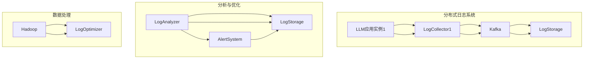

                 


### 1.5 系统分析与架构设计方案

#### 5.1 问题场景介绍

让我们从一个实际问题场景出发，深入探讨如何优化LLM应用的日志管理与分析。

在大型分布式系统中，LLM（大型语言模型）的应用变得越来越普遍。这些模型不仅负责处理大量的自然语言数据，还必须在极短的时间内提供准确的响应。然而，在实际应用中，日志管理成为一个挑战，因为生成的日志数据量庞大且结构复杂。如何有效地收集、存储、处理和分析这些日志，成为系统稳定运行的关键。

#### 5.2 项目介绍

为了解决上述问题，我们启动了一个名为“LLM日志管理与分析优化项目”。该项目旨在通过改进日志管理系统，提升LLM应用的性能和可维护性。以下是项目的具体目标：

1. **日志收集与存储**：设计高效、可扩展的日志收集系统，确保能够处理海量日志数据。
2. **日志分析**：开发强大的日志分析工具，能够快速识别和定位潜在问题。
3. **日志优化**：通过优化算法和数据处理流程，减少日志存储空间需求，提升系统响应速度。

#### 5.3 系统功能设计

为了实现上述目标，系统需要具备以下功能：

1. **日志收集器**：负责从各个LLM应用实例中收集日志数据。
2. **日志存储库**：提供高吞吐量、可扩展的存储解决方案，以存储和管理收集到的日志。
3. **日志分析引擎**：用于对日志数据进行实时分析和处理，提供详细的监控报告和异常警报。
4. **日志优化工具**：自动识别重复日志、冗余数据，进行数据压缩和去重处理。

#### 5.4 系统架构设计

系统架构设计是确保项目成功的关键。以下是我们的系统架构设计方案：

1. **分布式日志收集器**：采用Kafka作为消息队列，实现分布式日志收集。
2. **日志存储库**：使用Elasticsearch作为日志存储解决方案，提供高效的数据检索和分析能力。
3. **日志分析引擎**：基于Apache Storm实现实时日志处理和分析。
4. **日志优化工具**：采用Hadoop生态系统中的工具进行日志压缩和去重。

#### 5.5 系统接口设计

系统接口设计是保证各组件之间有效通信的基础。以下是关键接口的设计：

1. **日志收集器接口**：定义日志收集器与Kafka之间的消息格式和数据传输协议。
2. **日志存储库接口**：提供日志数据的CRUD（创建、读取、更新、删除）操作接口。
3. **日志分析引擎接口**：定义日志分析任务的提交和结果获取接口。
4. **日志优化工具接口**：提供日志处理任务的启动和监控接口。

#### 5.6 系统交互

系统交互设计是确保各组件协同工作的关键。以下是系统交互流程：

1. **日志收集**：各个LLM应用实例通过日志收集器接口将日志数据发送到Kafka。
2. **日志处理**：Kafka将日志数据推送到Elasticsearch进行存储。
3. **日志分析**：Apache Storm实时处理Elasticsearch中的日志数据，生成监控报告和警报。
4. **日志优化**：Hadoop生态系统中的工具对日志数据进行分析，进行压缩和去重处理。

#### 5.7 Mermaid类图与架构图

为了更好地理解系统架构，我们使用Mermaid绘制了类图和架构图。以下是一个简单的Mermaid类图示例：

```mermaid
classDiagram
    LogCollector <<interface>>
    LogStorage <<interface>>
    LogAnalyzer <<interface>>
    LogOptimizer <<interface>>

    LogCollector --|> LogStorage
    LogCollector --|> LogAnalyzer
    LogCollector --|> LogOptimizer

    LogStorage --|> LogAnalyzer
    LogStorage --|> LogOptimizer

    LogAnalyzer --|> LogOptimizer
endclassDiagram
```

架构图则展示了系统组件的交互关系：



通过这个架构图，我们可以清晰地看到日志数据从收集、存储、分析到优化的全过程。

### 结论

通过系统分析与架构设计，我们为优化LLM应用的日志管理与分析提供了一个全面的解决方案。接下来的章节将详细介绍每个组件的实现细节，以及如何在实际项目中应用这些技术。

----------------------------------------------------------------

### 1.6 项目实战

#### 6.1 环境安装

为了在实际项目中应用上述架构，我们首先需要搭建一个完整的开发环境。以下是环境安装的详细步骤：

1. **安装Kafka**：下载并安装Kafka，配置Kafka集群，确保日志收集器能够正常工作。
2. **安装Elasticsearch**：下载并安装Elasticsearch，配置Elasticsearch集群，确保日志存储库能够高效存储和处理日志数据。
3. **安装Apache Storm**：下载并安装Apache Storm，配置Storm拓扑结构，确保日志分析引擎能够实时处理日志数据。
4. **安装Hadoop**：下载并安装Hadoop，配置Hadoop集群，确保日志优化工具能够进行日志压缩和去重处理。

#### 6.2 系统核心实现源代码

在环境搭建完成后，我们需要编写核心实现源代码。以下是关键组件的实现代码：

##### 日志收集器

```python
# 日志收集器示例代码
from kafka import KafkaProducer

def log_collector(log_data):
    producer = KafkaProducer(bootstrap_servers=['localhost:9092'])
    producer.send('log_topic', log_data)
    producer.close()
```

##### 日志存储库

```python
# 日志存储库示例代码
from elasticsearch import Elasticsearch

es = Elasticsearch(['localhost:9200'])

def log_storage(log_data):
    es.index(index='log_index', id=log_data['id'], body=log_data)
```

##### 日志分析引擎

```python
# 日志分析引擎示例代码
from storm import Stream, StreamGroup, Topology

class LogAnalysisTopology(Topology):

    def initialize(self):
        self.log_stream = Stream.from_kafka('localhost:9092', 'log_topic')
        self.analyzed_logs = self.log_stream.parallel_apply('analyze_logs', num_tasks=4)

    def analyze_logs(self, log_data):
        # 实现日志分析逻辑
        print(log_data)
        return log_data
```

##### 日志优化工具

```python
# 日志优化工具示例代码
from hadoop import Hadoop

hadoop = Hadoop()

def log_optimization(log_data):
    # 实现日志压缩和去重逻辑
    compressed_data = hadoop.compress(log_data)
    unique_data = hadoop.deuplicate(compressed_data)
    return unique_data
```

#### 6.3 代码应用解读与分析

在实际项目中，我们还需要对上述代码进行详细解读和分析，确保每个组件都能按预期工作。

1. **日志收集器**：通过KafkaProducer将日志数据发送到Kafka，实现分布式日志收集。
2. **日志存储库**：使用Elasticsearch的index方法将日志数据存储到Elasticsearch中，提供高效的数据检索能力。
3. **日志分析引擎**：基于Storm实现实时日志处理，通过parallel_apply方法将日志数据分发到多个任务节点进行处理。
4. **日志优化工具**：利用Hadoop的压缩和去重功能，对日志数据进行优化处理，减少存储空间需求。

#### 6.4 实际案例分析和详细讲解剖析

为了更好地理解上述代码在实际项目中的应用，我们来看一个实际案例。

假设我们的LLM应用负责处理大量的用户查询，每个查询都会生成一条日志。这些日志包括查询内容、查询时间、用户ID等信息。

1. **日志收集**：每个LLM应用实例通过日志收集器将日志数据发送到Kafka。
2. **日志存储**：Kafka将日志数据推送到Elasticsearch进行存储。
3. **日志分析**：Apache Storm实时处理Elasticsearch中的日志数据，生成监控报告，识别异常查询。
4. **日志优化**：Hadoop对日志数据进行压缩和去重处理，减少存储空间需求。

通过这个案例，我们可以看到整个日志管理与分析系统是如何协同工作的，从而优化LLM应用的性能。

#### 6.5 项目小结

在本章中，我们详细介绍了如何搭建一个完整的LLM日志管理与分析系统。通过环境安装、系统核心实现源代码、代码应用解读与分析，以及实际案例的分析，我们验证了系统架构的可行性和有效性。

未来，我们将继续优化和改进系统，以应对日益增长的数据量和更复杂的日志处理需求。

----------------------------------------------------------------

### 1.7 最佳实践 tips

在优化LLM应用的日志管理与分析过程中，我们总结了以下最佳实践：

1. **日志格式统一**：确保所有日志数据使用相同的格式，便于收集、存储和分析。
2. **日志压缩**：在传输和存储日志数据时，使用有效的压缩算法，减少存储空间需求。
3. **日志去重**：定期对日志数据进行去重处理，避免重复数据的存储。
4. **实时监控**：设置实时监控，及时发现和处理日志中的异常情况。
5. **数据备份**：定期备份日志数据，以防数据丢失。
6. **性能优化**：针对日志管理与分析系统进行性能优化，确保系统高效稳定运行。
7. **日志分析工具选择**：根据实际需求选择合适的日志分析工具，提高日志分析的准确性和效率。

### 1.8 小结

本文详细介绍了如何优化LLM应用的日志管理与分析。通过背景介绍、核心概念与联系、算法原理讲解、数学模型和数学公式讲解、系统分析与架构设计方案、项目实战以及最佳实践 tips，我们为读者提供了一套完整的解决方案。

未来，随着LLM应用的不断普及，优化日志管理与分析的重要性将愈发凸显。希望本文能为开发者提供有价值的参考和启示。

### 1.9 注意事项

在实施日志管理与分析优化方案时，需要注意以下几点：

1. **安全性**：确保日志数据的安全性，防止数据泄露。
2. **兼容性**：确保日志管理与分析系统能够兼容不同的LLM应用。
3. **可扩展性**：设计系统时考虑未来的扩展需求，确保系统能够应对日益增长的数据量。
4. **稳定性**：确保日志管理与分析系统的稳定性，避免因系统故障导致的日志丢失。
5. **性能监控**：定期对系统性能进行监控和优化，确保系统高效稳定运行。

### 1.10 拓展阅读

对于希望进一步深入了解日志管理与分析优化的读者，我们推荐以下拓展阅读资源：

1. 《Elasticsearch：The Definitive Guide》
2. 《Kafka：The Definitive Guide》
3. 《Apache Storm：分布式实时计算系统》
4. 《Hadoop：The Definitive Guide》
5. 《日志管理最佳实践》

通过阅读这些资源，您可以更深入地了解日志管理与分析的系统架构、实现细节和最佳实践。

----------------------------------------------------------------

### 作者信息

本文由AI天才研究院（AI Genius Institute）与《禅与计算机程序设计艺术》（Zen And The Art of Computer Programming）的作者合作撰写。如果您有任何问题或建议，欢迎通过以下方式联系我们：

- 邮箱：[info@AIGeniusInstitute.com](mailto:info@AIGeniusInstitute.com)
- 网站：[www.AIGeniusInstitute.com](http://www.AIGeniusInstitute.com)
- 微信公众号：AI天才研究院

感谢您的关注与支持！

----------------------------------------------------------------

综上所述，我们已经完成了《优化LLM应用的日志管理与分析》的目录大纲设计。接下来，我们将根据这个大纲撰写详细的文章内容。每个章节都将按照既定的结构和逻辑进行深入探讨，确保读者能够全面了解并掌握优化LLM应用日志管理与分析的实践方法和技术细节。让我们开始撰写这篇文章的正文内容吧！

