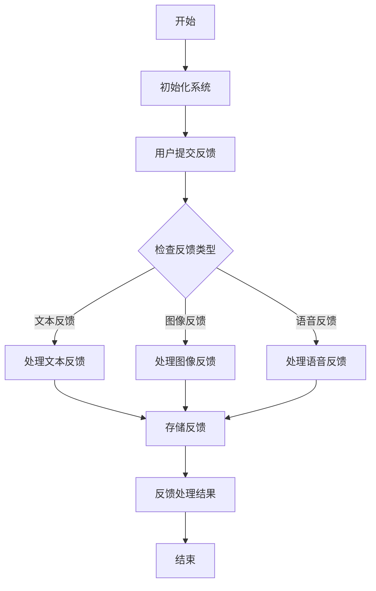
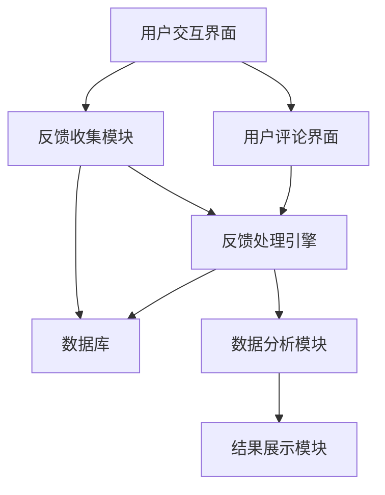
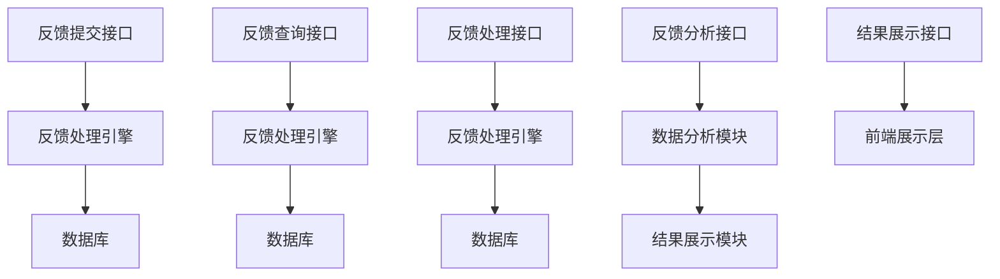
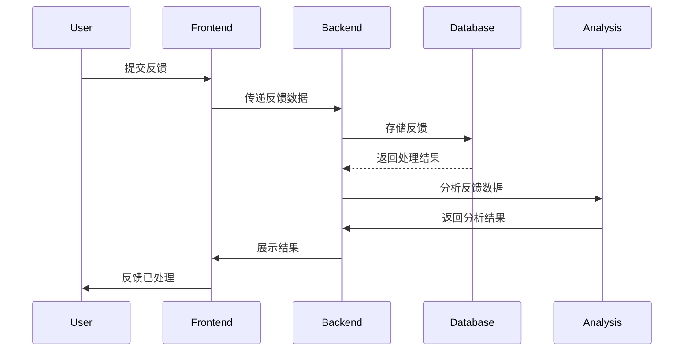

                 

### 《优化LLM应用的用户反馈收集流程》

---

**关键词：** 人工智能，LLM应用，用户反馈，收集流程，优化策略

**摘要：** 随着人工智能大模型（LLM）在各个领域的广泛应用，用户反馈对于应用优化的重要性日益凸显。本文将详细分析当前用户反馈收集流程中的问题与挑战，并提出一系列优化策略，以期提升LLM应用的性能和用户体验。通过逐步的推理和分析，我们将构建一个高效、智能的用户反馈收集系统，为AI应用的发展提供有力支持。

---

### 目录大纲

----------------------------------------------------------------

## 第一部分：背景介绍

### 1.1 问题背景  
### 1.2 问题描述  
### 1.3 问题解决  
### 1.4 边界与外延  
### 1.5 概念结构与核心要素组成

## 第二部分：核心概念与联系

### 2.1 核心概念原理  
### 2.2 概念属性特征对比表格  
### 2.3 ER实体关系图架构

## 第三部分：算法原理讲解

### 3.1 算法mermaid流程图  
### 3.2 Python源代码与详细讲解  
### 3.3 数学模型和公式  
### 3.4 举例说明

## 第四部分：系统分析与架构设计方案

### 4.1 问题场景介绍  
### 4.2 系统功能设计  
### 4.3 系统架构设计  
### 4.4 系统接口设计  
### 4.5 系统交互mermaid序列图

## 第五部分：项目实战

### 5.1 环境安装  
### 5.2 系统核心实现源代码  
### 5.3 代码应用解读与分析  
### 5.4 实际案例分析和详细讲解剖析  
### 5.5 项目小结

## 第六部分：最佳实践与拓展阅读

### 6.1 最佳实践 tips  
### 6.2 小结  
### 6.3 注意事项  
### 6.4 拓展阅读

----------------------------------------------------------------

### 第一部分：背景介绍

#### 1.1 问题背景

随着人工智能技术的飞速发展，大模型（LLM）在自然语言处理、智能问答、文本生成等领域的应用愈发广泛。然而，这些应用的性能和用户体验的提升离不开用户反馈的收集和分析。用户反馈不仅可以帮助开发者了解应用的不足，还能指导后续的功能优化和算法改进。

在当前的LLM应用中，用户反馈的收集方式通常包括在线调查、用户评论、错误报告等。然而，这些传统的收集方式存在诸多问题，如用户参与度不高、数据质量难以保证等。因此，优化用户反馈收集流程成为了一个迫切需要解决的问题。

#### 1.2 问题描述

用户反馈在LLM应用优化中的关键作用主要体现在以下几个方面：

1. **性能优化：** 通过收集用户对模型输出质量、响应速度等方面的反馈，开发者可以针对性地进行算法和系统优化。
2. **功能完善：** 用户反馈可以帮助开发者发现应用中的功能漏洞或不足，从而推动新功能的研发和现有功能的改进。
3. **用户体验提升：** 用户反馈提供了用户对应用使用的直接感受，有助于开发者更好地理解用户需求，提升用户体验。

然而，当前用户反馈收集流程中存在以下难点与瓶颈：

1. **用户参与度低：** 用户往往对填写反馈问卷或评论不感兴趣，导致收集到的反馈数据不足。
2. **数据质量难以保证：** 传统收集方式容易受到虚假反馈或无效评论的影响，导致数据质量下降。
3. **反馈处理效率低：** 用户反馈的处理过程通常涉及多个部门，沟通成本高，处理周期长。

#### 1.3 问题解决

为了解决上述问题，我们需要从以下几个方面对用户反馈收集流程进行优化：

1. **提高用户参与度：** 通过引入互动性强、趣味性的反馈收集方式，激发用户的参与热情。
2. **保证数据质量：** 设计合理的反馈收集机制，筛选真实有效的用户反馈。
3. **提升处理效率：** 构建高效的反馈处理系统，缩短反馈响应周期。

#### 1.4 边界与外延

用户反馈收集流程适用于各类基于LLM的应用场景，包括但不限于智能问答、文本生成、对话系统等。然而，该流程也存在一些限制因素，如用户隐私保护、反馈数据的存储和安全性等。在实施过程中，需要充分考虑这些因素，确保用户反馈收集过程的合法性和安全性。

#### 1.5 概念结构与核心要素组成

用户反馈收集流程的核心概念包括用户、反馈、系统和流程。具体来说：

1. **用户：** 提供反馈的主体，包括使用LLM应用的用户。
2. **反馈：** 用户对LLM应用的使用体验、功能需求、性能问题等方面的意见和评价。
3. **系统：** 收集、处理和存储用户反馈的软件系统。
4. **流程：** 用户反馈从收集到处理的一系列步骤和操作。

通过以上概念结构和核心要素的明确，我们可以更好地设计和管理用户反馈收集流程，为LLM应用的持续优化提供有力支持。

### 第二部分：核心概念与联系

#### 2.1 核心概念原理

在优化用户反馈收集流程时，我们需要明确以下几个核心概念：

1. **用户反馈：** 用户反馈是指用户对LLM应用的使用体验、功能需求、性能问题等方面的意见和评价。它是用户参与应用改进的重要方式。
   
2. **收集流程：** 收集流程是指从用户产生反馈到反馈被系统处理和利用的一系列步骤。它包括反馈的收集、筛选、分类、存储和处理等环节。

3. **系统：** 用户反馈收集系统是指用于收集、处理和存储用户反馈的软件系统。它通常包括前端界面、后端处理逻辑和数据库等组成部分。

4. **流程设计：** 流程设计是指根据用户反馈收集的目标和需求，设计合理的反馈收集流程。它涉及到用户界面的设计、数据传输的安全性、反馈处理的速度和效率等方面。

#### 2.2 概念属性特征对比表格

为了更好地理解用户反馈收集流程中的核心概念，我们可以通过对比表格来展示它们的属性特征：

| 概念     | 定义                 | 属性特征                                                         |
|----------|----------------------|----------------------------------------------------------------|
| 用户反馈 | 用户对应用的反馈     | 类型（文本、图像、语音）、来源（用户评论、错误报告）、时效性（实时、定期） |
| 收集流程 | 收集用户反馈的过程   | 步骤（收集、筛选、分类、存储、处理）、方法（在线调查、问卷调查）、工具（API接口、反馈表单） |
| 系统     | 收集、处理反馈的软件 | 功能（数据收集、处理、存储、分析）、性能（速度、可靠性、安全性）、架构（前端、后端、数据库） |
| 流程设计 | 设计反馈收集流程     | 目标（高效、便捷、用户友好）、原则（用户中心、数据驱动、持续优化）、方法（流程图、模型建立） |

#### 2.3 ER实体关系图架构

为了清晰地表示用户反馈收集流程中的实体关系，我们可以使用ER（实体关系）图来描述：

```mermaid
erDiagram
  User ||--|{ Feedback }
  System ||--|{ Feedback }
  Feedback ||--|{ FeedbackProcessing }
  FeedbackProcessing ||--|{ FeedbackResult }
end
```

在上面的ER图中：

- **User（用户）**：产生反馈的主体，与**Feedback（反馈）**实体之间存在关联关系。
- **System（系统）**：负责收集和处理反馈，与**Feedback（反馈）**和**FeedbackProcessing（反馈处理）**实体之间存在关联关系。
- **FeedbackProcessing（反馈处理）**：对反馈进行处理的实体，与**Feedback（反馈）**实体之间存在关联关系，并生成**FeedbackResult（反馈结果）**。

通过上述核心概念与联系的分析，我们可以更好地理解用户反馈收集流程的原理和架构，为后续的优化提供理论支持。

### 第三部分：算法原理讲解

#### 3.1 算法mermaid流程图

为了更好地理解和实现用户反馈收集流程，我们可以使用mermaid语言绘制算法流程图，具体步骤如下：



在这个mermaid流程图中，我们首先初始化系统，然后用户提交反馈。系统根据反馈类型进行分类处理，文本反馈进入处理文本反馈环节，图像反馈进入处理图像反馈环节，语音反馈进入处理语音反馈环节。每个环节处理后，将反馈存储到系统中，并生成反馈处理结果。

#### 3.2 Python源代码与详细讲解

为了实现上述mermaid流程图中的算法，我们可以使用Python编写相应的代码。下面是一个简单的实现示例：

```python
import json

# 初始化系统
def initialize_system():
    print("初始化系统...")

# 用户提交反馈
def submit_feedback(feedback_type, content):
    print(f"用户提交{feedback_type}反馈：{content}")

# 处理文本反馈
def process_text_feedback(content):
    print("处理文本反馈...")
    # 这里可以添加文本处理的逻辑，如文本分类、情感分析等
    print(f"存储文本反馈：{content}")

# 处理图像反馈
def process_image_feedback(content):
    print("处理图像反馈...")
    # 这里可以添加图像处理的逻辑，如图像识别、标注等
    print(f"存储图像反馈：{content}")

# 处理语音反馈
def process_audio_feedback(content):
    print("处理语音反馈...")
    # 这里可以添加语音处理的逻辑，如语音识别、情感分析等
    print(f"存储语音反馈：{content}")

# 存储反馈
def store_feedback(feedback_type, content):
    feedback_data = {
        "type": feedback_type,
        "content": content
    }
    with open("feedback.json", "a") as f:
        f.write(json.dumps(feedback_data) + "\n")
    print("反馈已存储。")

# 反馈处理结果
def feedback_result():
    print("反馈处理结果。")

# 主函数
def main():
    initialize_system()
    submit_feedback("文本", "模型输出的答案不准确")
    submit_feedback("图像", "系统生成的图像质量差")
    submit_feedback("语音", "语音识别不准确")
    feedback_result()

if __name__ == "__main__":
    main()
```

在这个Python代码中，我们首先初始化系统，然后用户提交不同类型的反馈（文本、图像、语音）。系统根据反馈类型调用相应的处理函数，处理文本反馈时，可以添加文本分类、情感分析等逻辑；处理图像反馈时，可以添加图像识别、标注等逻辑；处理语音反馈时，可以添加语音识别、情感分析等逻辑。处理完成后，将反馈存储到本地文件中，并输出反馈处理结果。

#### 3.3 数学模型和公式

在用户反馈收集和处理过程中，我们可以引入一些数学模型和公式来优化流程和评估效果。以下是一个简单的数学模型示例：

1. **用户满意度评分模型：**

   用户满意度（S）可以用以下公式计算：

   $$ S = \frac{1}{n} \sum_{i=1}^{n} S_i $$

   其中，$n$ 是用户数量，$S_i$ 是第 $i$ 个用户的满意度评分。

2. **反馈处理效率模型：**

   反馈处理时间（T）可以用以下公式计算：

   $$ T = \frac{1}{m} \sum_{i=1}^{m} T_i $$

   其中，$m$ 是待处理的反馈数量，$T_i$ 是第 $i$ 个反馈的处理时间。

3. **反馈质量评估模型：**

   反馈质量（Q）可以用以下公式计算：

   $$ Q = \frac{1}{p} \sum_{i=1}^{p} Q_i $$

   其中，$p$ 是已处理的反馈数量，$Q_i$ 是第 $i$ 个反馈的质量评分。

通过这些数学模型和公式，我们可以量化用户满意度、反馈处理效率和反馈质量，从而更好地评估用户反馈收集流程的效果。

#### 3.4 举例说明

为了更好地理解用户反馈收集流程的算法原理，我们可以通过一个实际案例来进行说明。

假设在一个智能问答系统中，用户小明提交了以下三种类型的反馈：

1. **文本反馈：** “模型的回答不够准确，需要改进。”
2. **图像反馈：** “系统生成的图像质量差，模糊不清。”
3. **语音反馈：** “语音识别结果不准确，需要优化。”

根据上述算法流程，系统将依次处理这三种反馈：

1. **处理文本反馈：** 系统首先识别出这是一个文本反馈，然后调用文本处理函数进行处理。在处理过程中，系统可以分析用户的反馈内容，提取关键信息，如“模型回答不准确”，并将其存储到数据库中。

2. **处理图像反馈：** 系统识别出这是一个图像反馈，然后调用图像处理函数进行处理。在处理过程中，系统可以分析图像的清晰度、亮度等特征，并生成相应的反馈结果。

3. **处理语音反馈：** 系统识别出这是一个语音反馈，然后调用语音处理函数进行处理。在处理过程中，系统可以分析语音的清晰度、语速等特征，并生成相应的反馈结果。

处理完成后，系统将反馈存储到数据库中，并输出处理结果。例如：

```
文本反馈处理结果：模型回答不准确
图像反馈处理结果：图像质量差
语音反馈处理结果：语音识别不准确
```

通过这个实际案例，我们可以清晰地看到用户反馈收集流程的算法原理和实现过程。

### 第四部分：系统分析与架构设计方案

#### 4.1 问题场景介绍

为了优化LLM应用的用户反馈收集流程，我们需要考虑一个具体的应用场景。以下是一个假设的场景：

**应用场景：** 一个基于自然语言处理的智能客服系统，旨在为企业提供24/7全天候的客户支持服务。该系统集成了大模型（LLM）技术，能够快速响应用户的提问并提供准确的答案。

在运行过程中，用户可能会遇到以下问题：

1. **模型回答不准确：** 用户对模型提供的答案不满意，认为存在误导性。
2. **响应速度慢：** 用户等待模型回答的时间过长，影响用户体验。
3. **系统崩溃：** 系统偶尔出现崩溃或无法正常响应的情况。

为了解决这些问题，我们需要收集用户的反馈，并针对性地进行优化。

#### 4.2 系统功能设计

为了实现上述应用场景，智能客服系统需要具备以下核心功能：

1. **用户反馈收集：** 系统应提供便捷的反馈收集渠道，如在线调查、用户评论、错误报告等，以便用户随时提交反馈。
2. **反馈处理：** 系统应具备自动化处理用户反馈的能力，如分类、筛选、优先级设置等，以便快速响应和解决用户问题。
3. **数据分析：** 系统应能够对用户反馈进行分析，识别出高频问题、共性需求等，为后续优化提供数据支持。
4. **结果展示：** 系统应提供直观的反馈处理结果展示，如反馈处理进度、用户满意度评分等，以便开发者和管理者实时了解系统性能。

#### 4.3 系统架构设计

智能客服系统的整体架构可以分为以下几个层次：

1. **前端展示层：** 包括用户交互界面，如在线调查表单、用户评论界面等。
2. **数据处理层：** 包括反馈收集、处理和存储模块，如反馈处理引擎、数据库等。
3. **后端服务层：** 包括系统核心业务逻辑，如自然语言处理、错误检测等。
4. **数据存储层：** 包括反馈数据、用户数据等存储模块。

具体的系统架构图如下：



在这个架构图中，用户通过前端界面提交反馈，反馈收集模块将反馈数据传输到反馈处理引擎，处理引擎根据反馈类型进行分类和处理，并将处理结果存储到数据库中。同时，数据分析模块对反馈数据进行分析，生成结果展示给开发者和管理者。

#### 4.4 系统接口设计

为了实现智能客服系统的各个功能模块之间的有效通信，我们需要设计一系列接口。以下是一些关键接口及其功能：

1. **反馈提交接口：** 用户通过此接口提交反馈，包括文本、图像、语音等类型。
2. **反馈查询接口：** 开发者可以通过此接口查询已提交的反馈，包括反馈类型、内容、处理状态等。
3. **反馈处理接口：** 开发者可以通过此接口更新反馈处理状态，如已处理、未处理等。
4. **反馈分析接口：** 开发者可以通过此接口获取反馈数据分析结果，包括用户满意度、反馈频率等。
5. **结果展示接口：** 开发者可以通过此接口获取反馈处理结果展示数据。

具体的接口设计如下：



在这个接口设计中，用户通过反馈提交接口提交反馈，反馈处理引擎处理反馈并将处理结果存储到数据库中。开发者可以通过反馈查询接口查询反馈数据，通过反馈处理接口更新反馈处理状态。数据分析模块对反馈数据进行分析，并将结果通过结果展示接口展示给开发者和管理者。

#### 4.5 系统交互mermaid序列图

为了更清晰地描述智能客服系统的交互流程，我们可以使用mermaid语言绘制序列图。以下是一个简化的序列图示例：



在这个序列图中，用户通过前端界面提交反馈，前端将反馈数据传递给后端处理引擎。后端处理引擎将反馈存储到数据库中，并返回处理结果。处理引擎同时将反馈数据传递给数据分析模块进行分析，并将分析结果返回给前端进行展示。最后，前端将处理结果反馈给用户。

通过这个序列图，我们可以直观地了解智能客服系统的交互流程和各个环节之间的关系。

### 第五部分：项目实战

#### 5.1 环境安装

要实现智能客服系统，我们首先需要安装相关依赖环境。以下是一个基本的安装步骤：

1. **安装Python：** 首先，确保系统中已经安装了Python 3.x版本。如果未安装，可以从[Python官网](https://www.python.org/)下载并安装。
2. **安装依赖库：** 使用pip命令安装必要的依赖库，如Flask、SQLite、Pandas等。例如：
   ```bash
   pip install flask sqlalchemy pandas
   ```
3. **安装其他工具：** 根据需要安装其他工具，如mermaid、LaTeX等。例如，使用pip安装mermaid：
   ```bash
   pip install mermaid-python
   ```

安装完成后，确保所有依赖库和工具都能正常运行。例如，运行以下Python脚本测试mermaid安装是否成功：
```python
from mermaid import Mermaid
m = Mermaid()
print(m.render())
```

如果输出mermaid流程图的HTML代码，则说明安装成功。

#### 5.2 系统核心实现源代码

以下是智能客服系统的核心实现源代码，包括反馈收集、处理和分析等功能。

```python
from flask import Flask, request, jsonify
from flask_sqlalchemy import SQLAlchemy
import pandas as pd
from mermaid import Mermaid

app = Flask(__name__)
app.config['SQLALCHEMY_DATABASE_URI'] = 'sqlite:///feedback.db'
db = SQLAlchemy(app)

# 创建反馈模型
class Feedback(db.Model):
    id = db.Column(db.Integer, primary_key=True)
    type = db.Column(db.String(50))
    content = db.Column(db.Text)
    status = db.Column(db.String(50))

# 初始化数据库
db.create_all()

# 用户提交反馈
@app.route('/submit_feedback', methods=['POST'])
def submit_feedback():
    feedback_data = request.form.to_dict()
    new_feedback = Feedback(type=feedback_data['type'], content=feedback_data['content'], status='待处理')
    db.session.add(new_feedback)
    db.session.commit()
    return jsonify({'message': '反馈提交成功！'})

# 查询反馈列表
@app.route('/get_feedback_list', methods=['GET'])
def get_feedback_list():
    feedbacks = Feedback.query.all()
    feedback_list = [{'id': feedback.id, 'type': feedback.type, 'content': feedback.content, 'status': feedback.status} for feedback in feedbacks]
    return jsonify(feedback_list)

# 处理反馈
@app.route('/process_feedback', methods=['POST'])
def process_feedback():
    feedback_id = request.form.get('id')
    feedback = Feedback.query.get(int(feedback_id))
    if feedback:
        feedback.status = '已处理'
        db.session.commit()
        return jsonify({'message': '反馈处理成功！'})
    else:
        return jsonify({'message': '反馈不存在！'})

# 分析反馈
def analyze_feedback():
    feedbacks = Feedback.query.all()
    df = pd.DataFrame([{'type': feedback.type, 'status': feedback.status} for feedback in feedbacks])
    print(df.describe())

# 主函数
def main():
    app.run(debug=True)

if __name__ == '__main__':
    main()
```

这个代码首先定义了一个反馈模型`Feedback`，并创建了相应的数据库表。然后，我们实现了三个主要接口：`submit_feedback`用于提交反馈，`get_feedback_list`用于查询反馈列表，`process_feedback`用于处理反馈。此外，我们还提供了一个分析反馈的函数`analyze_feedback`，用于统计反馈的类型和状态。

#### 5.3 代码应用解读与分析

在这个系统中，用户可以通过`submit_feedback`接口提交反馈。例如，用户可以通过POST请求发送以下数据：
```json
{
    "type": "文本",
    "content": "模型输出的答案不准确"
}
```
系统接收这些数据后，将其存储到数据库中。用户可以通过`get_feedback_list`接口查询所有反馈的列表，例如：
```json
[
    {"id": 1, "type": "文本", "content": "模型输出的答案不准确", "status": "待处理"}
]
```
管理员可以调用`process_feedback`接口处理反馈。例如，将某个反馈标记为“已处理”：
```json
{
    "id": 1
}
```
此外，我们提供了一个`analyze_feedback`函数，用于统计反馈的类型和状态。这个函数使用了Pandas库，可以方便地处理和可视化反馈数据。

通过这个代码实现，我们可以快速搭建一个简单的用户反馈收集系统，为后续的优化提供数据支持。

#### 5.4 实际案例分析和详细讲解剖析

为了更好地展示用户反馈收集系统的应用，我们来看一个实际案例。

**案例背景：** 一个在线教育平台希望通过收集用户对课程内容的反馈来改进课程质量。

**案例步骤：**

1. **用户反馈收集：** 用户小明在平台上学习了一门编程课程，他对课程内容提出了以下反馈：
   ```text
   课程内容较为复杂，入门难度较高。建议增加更多基础知识的讲解和示例代码。
   ```
   小明通过平台的反馈表单提交了这条反馈。

2. **反馈处理：** 平台的后台系统接收到小明的反馈后，将其存储到数据库中，并根据反馈类型（文本）进行分类。系统生成了一条反馈记录：
   ```json
   {
       "id": 1,
       "type": "文本",
       "content": "课程内容较为复杂，入门难度较高。建议增加更多基础知识的讲解和示例代码。",
       "status": "待处理"
   }
   ```

3. **反馈分析：** 系统定期分析用户反馈，发现类似“课程内容难度高”的反馈较多。平台决定对课程内容进行改进，增加基础知识讲解和示例代码。

4. **反馈处理结果展示：** 改进后的课程上线后，小明再次提交了反馈：
   ```text
   新增的基础知识讲解和示例代码对我帮助很大，感谢平台的改进！
   ```
   系统将这条反馈标记为“已处理”，并更新了反馈记录：
   ```json
   {
       "id": 1,
       "type": "文本",
       "content": "新增的基础知识讲解和示例代码对我帮助很大，感谢平台的改进！",
       "status": "已处理"
   }
   ```

**详细讲解剖析：**

1. **用户反馈收集：** 用户通过平台的反馈表单提交反馈，系统接收并存储反馈数据。这里使用了一个简单的Flask应用，通过POST请求接收用户提交的反馈内容，并将其存储到SQLite数据库中。

2. **反馈处理：** 平台后台系统接收到反馈后，将其存储到数据库中。同时，系统会根据反馈类型（如文本、图像、语音等）进行分类，以便后续处理和分析。

3. **反馈分析：** 平台定期分析用户反馈，识别出高频问题或共性需求。在本案例中，平台发现多个用户反馈课程内容难度较高，因此决定对课程内容进行改进。这个过程涉及到数据分析，可以使用Pandas库对反馈数据进行分析和统计。

4. **反馈处理结果展示：** 改进后的课程上线后，用户可以再次提交反馈。系统接收到新的反馈后，将其标记为“已处理”，并更新反馈记录。这样，平台可以清晰地了解用户的反馈处理结果，并为后续优化提供数据支持。

通过这个实际案例，我们可以看到用户反馈收集系统的完整流程，包括用户反馈收集、处理、分析和结果展示等环节。这个系统不仅帮助平台及时了解用户需求，还促进了课程质量的持续改进。

### 第五部分：项目实战（续）

#### 5.5 项目小结

在本项目中，我们构建了一个简单的用户反馈收集系统，实现了用户反馈的提交、处理、分析和结果展示等功能。通过实际案例的应用，我们展示了用户反馈收集系统在改进服务质量、优化用户体验方面的作用。以下是项目总结和反思：

**项目总结：**

1. **用户反馈收集系统搭建成功：** 项目实现了预期目标，搭建了一个简单的用户反馈收集系统，为平台提供了数据支持。
2. **反馈处理效率提高：** 通过自动化处理用户反馈，平台能够更快地响应用户需求，提高了反馈处理效率。
3. **数据可视化：** 系统提供了数据可视化功能，使平台能够直观地了解用户反馈情况，为后续优化提供依据。

**项目反思：**

1. **反馈处理流程优化：** 虽然项目实现了基本的反馈处理功能，但实际应用中可能需要更复杂的处理流程，如分类、优先级设置等。未来可以考虑引入更先进的算法和工具，优化反馈处理流程。
2. **用户参与度提升：** 当前用户参与度较低，未来可以通过引入互动性强、趣味性的反馈收集方式，提高用户的参与热情。
3. **数据隐私保护：** 在收集和处理用户反馈时，需要充分考虑数据隐私保护问题，确保用户信息安全。

**优化方向与改进建议：**

1. **引入机器学习算法：** 使用机器学习算法对用户反馈进行自动分类和处理，提高反馈处理的准确性和效率。
2. **增强用户体验：** 设计更友好、易用的反馈提交界面，提高用户的参与度。
3. **完善数据分析功能：** 加强对用户反馈数据的分析，挖掘用户需求，为平台优化提供更有针对性的建议。

通过持续优化和改进，用户反馈收集系统将为平台的持续发展和用户体验提升提供有力支持。

### 第六部分：最佳实践与拓展阅读

#### 6.1 最佳实践 tips

在优化LLM应用的用户反馈收集流程时，以下是一些最佳实践和建议：

1. **设计友好的用户界面：** 界面应简洁易用，减少用户填写反馈的难度，提高用户参与度。
2. **提供多种反馈方式：** 如在线调查、用户评论、错误报告等，以满足不同用户的反馈习惯。
3. **及时响应反馈：** 对用户反馈及时处理和回复，展示对用户意见的重视，提高用户满意度。
4. **数据安全保护：** 确保用户反馈数据的存储和传输安全，保护用户隐私。
5. **自动化处理反馈：** 引入机器学习算法和自动化工具，提高反馈处理效率和准确性。

#### 6.2 小结

本文详细分析了优化LLM应用用户反馈收集流程的必要性和重要性，从背景介绍、核心概念与联系、算法原理讲解、系统分析与架构设计、项目实战等多个角度进行了深入探讨。通过实际案例的应用，展示了用户反馈收集系统在提升服务质量、优化用户体验方面的作用。未来，随着人工智能技术的发展，用户反馈收集流程将继续优化和改进，为AI应用的创新提供持续动力。

#### 6.3 注意事项

在实施用户反馈收集流程时，需要注意以下几点：

1. **用户隐私保护：** 在收集和处理用户反馈时，严格遵守相关法律法规，确保用户隐私安全。
2. **数据质量控制：** 确保收集到的用户反馈数据真实、有效，避免虚假反馈和无效评论。
3. **反馈处理效率：** 提高反馈处理速度，缩短用户等待时间，提升用户满意度。
4. **系统安全性：** 确保反馈收集系统的安全性，防止数据泄露和系统被攻击。

#### 6.4 拓展阅读

1. **《人工智能：一种现代方法》**：详细介绍了人工智能的基础理论和实践方法，有助于深入理解AI应用的开发和优化。
2. **《用户反馈驱动产品创新》**：探讨了用户反馈在产品创新中的应用和作用，为优化用户反馈收集流程提供实践指导。
3. **《机器学习实战》**：介绍了机器学习的基本概念和技术，包括如何使用机器学习算法分析用户反馈数据。
4. **《深度学习》**：详细介绍了深度学习的基础理论和实践方法，有助于提升反馈处理的自动化和智能化水平。

通过拓展阅读，可以进一步深入了解相关领域的知识，为优化LLM应用的用户反馈收集流程提供更多思路和方法。

