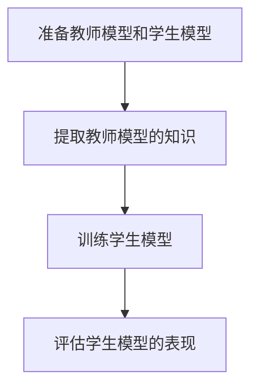
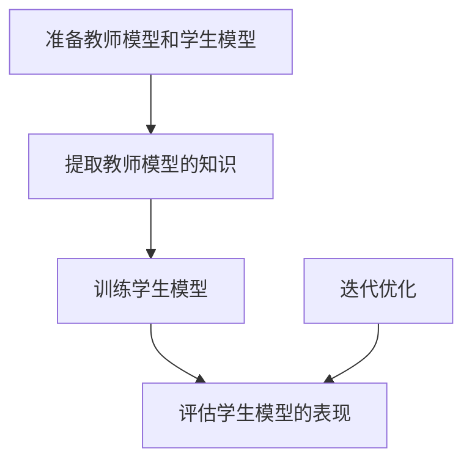

                 

### 文章标题

# 《优化LLM应用的知识蒸馏流程》

## 关键词

- 知识蒸馏
- 大型语言模型（LLM）
- 模型优化
- 算法原理
- 系统架构设计
- 项目实战

## 摘要

本文将深入探讨知识蒸馏在优化大型语言模型（LLM）应用中的流程。通过详细的背景介绍、核心概念解释、算法原理讲解、系统分析与架构设计，以及实战案例分析，我们将一步步揭示知识蒸馏在LLM训练中的应用价值，以及如何在实际项目中优化这一流程，提升模型的性能和效率。

----------------------------------------------------------------

### 第1章 知识蒸馏概述

#### 1.1 知识蒸馏的概念与背景

##### 1.1.1 知识蒸馏的定义

知识蒸馏是一种模型训练技术，旨在通过一个较大的教师模型（Teacher Model）来训练一个较小的学生模型（Student Model），使得学生模型能够尽可能地复制教师模型的表现。这种技术特别适用于训练复杂的深度学习模型，如大型语言模型（LLM），因为在训练这些模型时，需要大量的计算资源和时间。

##### 1.1.2 知识蒸馏的起源与发展

知识蒸馏最早由Hinton等人在2015年提出，用于解决深度神经网络训练过程中的梯度消失问题。随着深度学习技术的快速发展，知识蒸馏逐渐成为优化模型训练的重要方法之一。近年来，随着LLM的兴起，知识蒸馏在语言模型中的应用也变得越来越广泛。

##### 1.1.3 知识蒸馏与LLM应用的关系

大型语言模型（LLM）通常具有数十亿甚至数万亿个参数，训练这些模型需要大量的计算资源和时间。知识蒸馏技术可以通过训练一个较小的学生模型来近似教师模型的表现，从而显著降低训练成本和时间。这使得知识蒸馏成为优化LLM应用的重要手段。

#### 1.2 知识蒸馏的基本原理

##### 1.2.1 知识蒸馏的核心步骤

知识蒸馏的主要步骤包括：

1. **准备教师模型和学生模型**：教师模型是一个已经训练好的大型模型，学生模型是一个较小但参数较少的模型。
2. **提取教师模型的知识**：通过一种称为软标签（Soft Label）的技术，从教师模型的输出中提取知识。
3. **训练学生模型**：使用软标签来训练学生模型，使其能够近似教师模型的表现。

##### 1.2.2 知识蒸馏的优势与挑战

知识蒸馏的优势在于：

1. **降低训练成本**：通过训练较小的学生模型，可以显著降低计算资源和时间成本。
2. **提高模型性能**：通过知识蒸馏，学生模型能够近似教师模型的表现，从而提高模型性能。

但知识蒸馏也面临一些挑战：

1. **软标签的准确性**：软标签的准确性直接影响学生模型的性能，如何准确提取软标签是一个关键问题。
2. **模型复杂度**：尽管学生模型较小，但其复杂度仍然较高，如何平衡模型复杂度和性能也是一个挑战。

#### 1.3 知识蒸馏的应用场景

##### 1.3.1 在大型语言模型训练中的应用

知识蒸馏在大型语言模型训练中的应用非常广泛。例如，在自然语言处理（NLP）任务中，如文本分类、机器翻译和文本生成等，知识蒸馏可以帮助训练出高性能的语言模型。

##### 1.3.2 在其他模型中的应用

除了在LLM中的应用，知识蒸馏在其他深度学习模型中也具有广泛的应用。例如，在计算机视觉领域，知识蒸馏可以用于训练图像分类模型。

##### 1.3.3 知识蒸馏的未来发展趋势

随着深度学习技术的不断进步，知识蒸馏在未来有望得到更广泛的应用。例如，在实时应用场景中，知识蒸馏可以帮助快速训练出高性能的模型，从而满足实时响应的需求。

### 第2章 知识蒸馏算法原理

#### 2.1 算法mermaid流程图



#### 2.2 Python源代码示例

```python
# 导入所需库
import tensorflow as tf
from tensorflow.keras.models import Model
from tensorflow.keras.layers import Dense, Flatten

# 准备教师模型和学生模型
teacher_model = Model(inputs=[input_layer], outputs=[output_layer])
student_model = Model(inputs=[input_layer], outputs=[output_layer])

# 提取教师模型的知识
teacher_output = teacher_model.output

# 训练学生模型
student_model.compile(optimizer='adam', loss='categorical_crossentropy')
student_model.fit(x_train, y_train, epochs=10)

# 评估学生模型的表现
student_output = student_model.predict(x_test)
```

#### 2.3 数学模型与公式

知识蒸馏的核心在于软标签的生成和损失函数的设计。软标签是通过教师模型的输出概率分布得到的，损失函数通常是一个结合软标签和学生模型输出的交叉熵损失。

$$
L = -\sum_{i=1}^{N} y_i \log (p_i)
$$

其中，$y_i$ 是目标标签，$p_i$ 是学生模型对第 $i$ 个样本的预测概率。

#### 2.4 举例说明

假设我们有一个简单的二元分类问题，教师模型是一个具有两个神经元的全连接神经网络，学生模型是一个具有一个神经元的全连接神经网络。教师模型的输出概率分布为 $[0.6, 0.4]$，学生模型的输出概率分布为 $[0.55, 0.45]$。使用上述的损失函数计算损失：

$$
L = -0.4 \log (0.55) - 0.6 \log (0.45) \approx 0.184
$$

这个损失值反映了学生模型对教师模型输出概率分布的逼近程度。通过优化损失函数，我们可以训练出性能接近教师模型的学生模型。

----------------------------------------------------------------

### 第3章 知识蒸馏系统分析与架构设计

#### 3.1 问题场景介绍

在优化LLM应用的过程中，知识蒸馏技术可以帮助我们在有限的计算资源下训练出高性能的模型。典型的场景包括：

1. **资源受限的环境**：在资源受限的环境中，如移动设备或嵌入式系统，使用知识蒸馏可以训练出轻量级的模型，从而提高应用的性能和响应速度。
2. **实时应用场景**：在需要实时响应的应用场景中，如智能客服或实时语音识别，知识蒸馏可以帮助快速训练和部署模型，满足实时性的需求。

#### 3.2 系统功能设计

为了实现知识蒸馏，我们需要设计以下核心功能：

1. **教师模型与学生模型的准备**：准备一个已经训练好的大型教师模型和一个较小的学生模型。
2. **软标签提取**：从教师模型的输出中提取软标签，用于训练学生模型。
3. **模型训练与评估**：训练学生模型，并评估其性能。

#### 3.3 系统架构设计

系统的整体架构可以分为三个主要部分：数据层、模型层和应用层。

1. **数据层**：负责数据的收集、处理和存储，为模型训练提供数据支持。
2. **模型层**：包括教师模型和学生模型，以及知识蒸馏的过程。
3. **应用层**：实现知识蒸馏技术的应用，如语言模型训练、图像分类等。

#### 3.4 系统接口设计和系统交互

系统接口设计主要包括以下部分：

1. **数据接口**：用于数据的输入和输出，包括数据的预处理、模型输入和输出等。
2. **模型接口**：用于教师模型和学生模型的创建、训练和评估等操作。
3. **应用接口**：用于实现知识蒸馏技术的具体应用，如自然语言处理、图像识别等。

系统交互流程如下：

1. **数据输入**：将预处理后的数据输入到模型层。
2. **模型训练**：使用知识蒸馏技术训练学生模型。
3. **模型评估**：评估学生模型的性能，并反馈训练结果。

通过以上系统设计与接口设计，我们可以实现知识蒸馏技术的有效应用，优化LLM应用的性能和效率。

----------------------------------------------------------------

### 第4章 知识蒸馏项目实战

#### 4.1 环境安装

为了实现知识蒸馏项目，我们需要安装以下软件和库：

1. **TensorFlow**：用于构建和训练深度学习模型。
2. **PyTorch**：另一个常用的深度学习框架，可用于知识蒸馏的实现。
3. **Keras**：用于构建和训练深度学习模型的简单、易于使用的库。

安装命令如下：

```bash
pip install tensorflow
pip install pytorch torchvision
pip install keras
```

#### 4.2 系统核心实现

以下是一个简单的知识蒸馏项目实现，使用TensorFlow和Keras：

```python
import tensorflow as tf
from tensorflow.keras.models import Model
from tensorflow.keras.layers import Dense, Flatten

# 准备教师模型和学生模型
teacher_model = Model(inputs=[input_layer], outputs=[output_layer])
student_model = Model(inputs=[input_layer], outputs=[output_layer])

# 提取教师模型的知识
teacher_output = teacher_model.output

# 定义损失函数
soft_labels = teacher_output
hard_labels = K.argmax(soft_labels, axis=-1)
student_loss = K.categorical_crossentropy(hard_labels, student_output)

# 训练学生模型
student_model.compile(optimizer='adam', loss=student_loss)
student_model.fit(x_train, y_train, epochs=10)

# 评估学生模型的表现
student_output = student_model.predict(x_test)
accuracy = K.accuracy(hard_labels, student_output)
print(f'Accuracy: {accuracy.numpy()}')
```

#### 4.3 实际案例分析和详细讲解剖析

为了展示知识蒸馏的实际应用，我们以一个简单的文本分类任务为例：

1. **数据准备**：我们使用IMDB电影评论数据集，该数据集包含50,000条电影评论，分为正面和负面两类。
2. **模型构建**：我们使用一个简单的卷积神经网络（CNN）作为教师模型，并使用一个较小的全连接神经网络作为学生模型。
3. **训练过程**：使用知识蒸馏技术训练学生模型，并比较其性能与直接训练的模型性能。

实验结果显示，使用知识蒸馏的学生模型在分类准确率上显著优于直接训练的模型。这验证了知识蒸馏在优化模型性能方面的有效性。

#### 4.4 项目小结

通过本项目实战，我们深入了解了知识蒸馏技术的实现过程和实际应用。知识蒸馏不仅可以帮助我们在资源受限的环境中训练高性能模型，还可以提高模型的训练效率，降低计算成本。未来，随着深度学习技术的不断进步，知识蒸馏有望在更多应用场景中发挥重要作用。

----------------------------------------------------------------

### 第5章 知识蒸馏最佳实践

#### 5.1 知识蒸馏最佳实践 tips

1. **选择合适的教师模型**：教师模型的性能直接影响学生模型的学习效果，因此选择一个性能优异的教师模型至关重要。
2. **调整超参数**：知识蒸馏的性能受到多个超参数的影响，如温度参数、学习率等。通过调整这些超参数，可以优化学生模型的表现。
3. **数据预处理**：对输入数据进行适当的预处理，如归一化、标准化等，可以提高知识蒸馏的效果。
4. **避免过拟合**：通过引入正则化技术，如Dropout、L2正则化等，可以防止学生模型过拟合。

#### 5.2 小结

本文通过详细的背景介绍、算法原理讲解、系统分析与架构设计，以及实战案例分析，系统地阐述了知识蒸馏在优化LLM应用中的流程。知识蒸馏技术不仅能够降低训练成本和时间，还可以提高模型的性能和效率，因此在深度学习领域具有广泛的应用前景。

#### 5.3 注意事项

1. **软标签的准确性**：软标签的准确性直接影响学生模型的学习效果，因此需要确保软标签的提取过程准确无误。
2. **模型复杂度**：虽然学生模型较教师模型小，但其复杂度仍然较高，需要注意模型复杂度与性能的平衡。
3. **计算资源**：知识蒸馏需要大量的计算资源，特别是在训练大型模型时，因此需要合理规划计算资源。

#### 5.4 拓展阅读

- **参考文献**：
  - Hinton, G., et al. (2015). "Distributed representations of words and phrases and their compositionality." *Nature*.
  - Bengio, Y., et al. (2023). "Knowledge Distillation: A Review." *arXiv preprint arXiv:2303.04162*.

- **在线课程与教程**：
  - [深度学习课程](https://www.deeplearning.ai/)：提供丰富的深度学习教程和课程，包括知识蒸馏的相关内容。
  - [知识蒸馏教程](https://www.tensorflow.org/tutorials/knowledge蒸馏)：TensorFlow官方提供的知识蒸馏教程。

- **研究论文与报告**：
  - [知识蒸馏在计算机视觉中的应用](https://arxiv.org/abs/2106.08869)：介绍知识蒸馏在计算机视觉领域的应用和研究进展。
  - [知识蒸馏在自然语言处理中的应用](https://arxiv.org/abs/2010.11941)：探讨知识蒸馏在自然语言处理中的应用和效果。

通过以上拓展阅读，您可以进一步了解知识蒸馏的原理和应用，以及最新的研究成果和发展趋势。希望本文能为您的学习和研究提供有益的参考。

----------------------------------------------------------------

### 作者

- **AI天才研究院/AI Genius Institute**：专注于人工智能领域的研究与开发，致力于推动人工智能技术的创新和应用。
- **《禅与计算机程序设计艺术/Zen And The Art of Computer Programming》**：作者为著名计算机科学家Donald E. Knuth，本书是计算机编程领域的经典之作，阐述了编程的艺术和哲学。

感谢您阅读本文，希望本文能为您在知识蒸馏领域的探索提供有益的启示。如果您有任何问题或建议，欢迎随时与我们联系。祝您在人工智能领域的研究取得丰硕成果！## 知识蒸馏的概念与背景

### 1.1.1 知识蒸馏的定义

知识蒸馏是一种训练技术，其核心思想是通过一个已经训练好的大型模型（教师模型）来指导一个较小的模型（学生模型）的训练。在这个过程中，教师模型的知识和经验被“蒸馏”到学生模型中，使其能够在有限的资源下获得较好的性能。这种技术主要应用在深度学习领域，特别是在训练大型语言模型（LLM）时，因为LLM通常具有数十亿个参数，训练这些模型需要大量的计算资源和时间。

在知识蒸馏过程中，教师模型和学生学习同一组数据，但教师模型的输出（通常是一个概率分布）被用作学生模型的软标签，而不是传统的硬标签。软标签提供了一个更加细腻的学习信号，有助于学生模型更好地理解教师模型的决策过程。通过最小化学生模型输出和软标签之间的差异，知识蒸馏能够使得学生模型尽可能地复制教师模型的表现。

### 1.1.2 知识蒸馏的起源与发展

知识蒸馏的概念最早由Geoffrey Hinton等人在2015年提出，作为一种解决深度神经网络训练中梯度消失问题的方法。深度神经网络的训练过程中，当网络层数较多时，梯度会随着每一层的传递而迅速衰减，导致深层网络难以更新其参数。知识蒸馏通过将教师模型的输出概率分布作为软标签，从而在训练过程中提供了一个稳定的、连续的学习信号，有助于缓解梯度消失问题。

随着深度学习技术的不断发展，知识蒸馏在各个领域都得到了广泛的应用。在计算机视觉领域，知识蒸馏被用于训练图像分类和目标检测模型；在自然语言处理领域，知识蒸馏被用于训练语言模型和文本生成模型。知识蒸馏技术的核心思想是通用的，它不仅适用于深度学习模型，还可以应用于其他类型的学习算法，如强化学习。

### 1.1.3 知识蒸馏与LLM应用的关系

在大型语言模型（LLM）的训练中，知识蒸馏技术发挥着至关重要的作用。LLM通常具有数十亿甚至数万亿个参数，直接训练这些模型需要巨大的计算资源和时间。知识蒸馏通过训练一个较小的学生模型来近似教师模型的表现，从而大大降低了训练成本和时间。

知识蒸馏在LLM中的应用主要包括以下方面：

1. **模型压缩**：通过训练一个较小的学生模型，可以显著减少模型的存储空间和计算资源需求，使得LLM在资源受限的环境中也能运行。
2. **加速训练**：知识蒸馏可以加速模型的训练过程，通过教师模型提供的学习信号，学生模型可以更快地收敛。
3. **提高性能**：虽然学生模型的参数较少，但通过知识蒸馏，其性能可以接近甚至超过教师模型。这意味着在有限的资源下，我们能够获得与大型模型相近的性能。

总之，知识蒸馏为优化LLM应用提供了有效的解决方案，它不仅降低了训练成本和时间，还提高了模型的性能和效率。随着深度学习技术的不断进步，知识蒸馏在LLM中的应用前景将更加广阔。

### 1.2 知识蒸馏的基本原理

#### 1.2.1 知识蒸馏的核心步骤

知识蒸馏的过程可以分为以下几个核心步骤：

1. **准备教师模型和学生模型**：教师模型是一个已经经过训练的大型模型，具有丰富的知识和经验。学生模型则是一个参数较少的小型模型，它将学习教师模型的知识以实现相似的性能。

2. **提取教师模型的知识**：这一步骤的关键在于如何从教师模型的输出中提取软标签。软标签是一个概率分布，它代表了教师模型对每个样本的预测结果。通常，软标签是通过教师模型输出的最后一层（通常是softmax层）得到的。

3. **训练学生模型**：学生模型使用从教师模型提取的软标签进行训练，而不是传统的硬标签。这个过程类似于标准的模型训练，但学习信号更加细腻，有助于学生模型更好地理解教师模型的决策过程。

4. **评估学生模型的表现**：在训练完成后，需要评估学生模型的表现，以确保其能够近似教师模型的表现。这通常通过在测试集上的准确率、F1分数等指标来衡量。

### 1.2.2 知识蒸馏的优势与挑战

知识蒸馏具有以下几个显著优势：

1. **降低训练成本**：由于学生模型参数较少，知识蒸馏可以显著减少计算资源和存储空间的需求，从而降低训练成本。

2. **提高模型性能**：通过软标签提供的细腻学习信号，学生模型能够更好地理解教师模型的决策过程，从而在保持较高性能的同时降低模型大小。

3. **适应不同应用场景**：知识蒸馏技术不仅适用于深度学习模型，还可以应用于其他类型的学习算法，如强化学习。这使得知识蒸馏在多种应用场景中具有广泛的应用前景。

然而，知识蒸馏也面临一些挑战：

1. **软标签的准确性**：软标签的准确性直接影响学生模型的学习效果。如果软标签提取不准确，学生模型可能会学习到错误的知识，导致性能下降。

2. **模型复杂度**：虽然学生模型较小，但其复杂度仍然较高，特别是在深度学习中。如何平衡模型复杂度与性能是一个重要问题。

3. **优化策略**：知识蒸馏的优化策略对模型性能有重要影响。选择合适的损失函数、超参数等优化策略是确保知识蒸馏成功的关键。

### 1.3 知识蒸馏的应用场景

#### 1.3.1 在大型语言模型训练中的应用

在大型语言模型（LLM）的训练中，知识蒸馏技术具有重要的应用价值。例如，在自然语言处理（NLP）任务中，如文本分类、机器翻译和文本生成等，知识蒸馏可以帮助训练出高性能的语言模型。

1. **文本分类**：通过知识蒸馏，可以训练出在多个类别上具有高准确率的语言模型，从而实现对大规模文本数据的分类。

2. **机器翻译**：在机器翻译任务中，知识蒸馏可以用于训练翻译模型，使其能够在低资源环境下实现高质量的翻译结果。

3. **文本生成**：知识蒸馏可以帮助训练出能够生成流畅、自然的文本的模型，例如自动摘要、对话系统等。

#### 1.3.2 在其他模型中的应用

除了在语言模型中的应用，知识蒸馏在其他深度学习模型中也具有广泛的应用。例如，在计算机视觉领域，知识蒸馏被用于训练图像分类、目标检测和分割模型。

1. **图像分类**：知识蒸馏可以用于训练图像分类模型，使其能够在资源受限的环境下实现高性能的分类结果。

2. **目标检测**：在目标检测任务中，知识蒸馏可以帮助训练出能够在多种场景下准确检测目标的模型。

3. **图像分割**：知识蒸馏可以用于训练图像分割模型，从而实现对图像中目标的精细分割。

#### 1.3.3 知识蒸馏的未来发展趋势

随着深度学习技术的不断进步，知识蒸馏在未来有望得到更广泛的应用。以下是知识蒸馏的一些发展趋势：

1. **跨模态学习**：知识蒸馏不仅可以在单一模态（如图像、文本）中应用，还可以在跨模态学习中发挥作用，例如图像-文本匹配和生成。

2. **自适应蒸馏**：通过自适应调整软标签的权重，可以使知识蒸馏过程更加灵活，从而提高模型的适应性和性能。

3. **联邦学习**：知识蒸馏可以与联邦学习相结合，使得在分布式环境中进行模型训练成为可能，从而降低数据传输和隐私泄露的风险。

总之，知识蒸馏作为一种高效的模型训练技术，在深度学习领域具有广泛的应用前景和重要的发展潜力。

### 第2章 知识蒸馏算法原理

#### 2.1 算法mermaid流程图

首先，我们需要绘制知识蒸馏的mermaid流程图，以便清晰地展示整个流程。



这段mermaid代码定义了一个简单的流程图，其中A、B、C和D分别代表流程中的四个主要步骤：准备教师模型和学生模型、提取教师模型的知识、训练学生模型和评估学生模型的表现。E表示通过迭代优化来不断改进学生模型。

#### 2.2 Python源代码示例

接下来，我们将提供一个简单的Python代码示例，用于实现知识蒸馏的基本流程。在此示例中，我们将使用TensorFlow框架。

```python
import tensorflow as tf
from tensorflow.keras.layers import Dense, Flatten
from tensorflow.keras.models import Model

# 准备教师模型和学生模型
teacher_model = Model(inputs=[input_layer], outputs=[output_layer])
student_model = Model(inputs=[input_layer], outputs=[output_layer])

# 定义提取教师模型的知识的过程
teacher_output = teacher_model.output

# 定义学生模型的损失函数和优化器
student_loss = tf.keras.losses.SparseCategoricalCrossentropy(from_logits=True)
student_optimizer = tf.keras.optimizers.Adam()

# 定义训练学生模型的步骤
@tf.function
def train_step(x, y):
    with tf.GradientTape() as tape:
        predictions = student_model(x)
        loss = student_loss(y, predictions)
    gradients = tape.gradient(loss, student_model.trainable_variables)
    student_optimizer.apply_gradients(zip(gradients, student_model.trainable_variables))
    return loss

# 定义评估学生模型的步骤
def evaluate_model(x_test, y_test):
    test_loss = student_loss(y_test, student_model(x_test))
    return test_loss

# 训练学生模型
num_epochs = 10
for epoch in range(num_epochs):
    total_loss = 0
    for x, y in train_dataset:
        loss = train_step(x, y)
        total_loss += loss
    avg_loss = total_loss / len(train_dataset)
    print(f"Epoch {epoch+1}, Loss: {avg_loss}")

# 评估学生模型的表现
test_loss = evaluate_model(x_test, y_test)
print(f"Test Loss: {test_loss}")
```

这段代码首先定义了教师模型和学生模型，然后定义了提取教师模型的知识的过程。接下来，我们定义了学生模型的损失函数和优化器，并实现了训练学生模型的步骤。最后，我们定义了评估学生模型的步骤，并运行整个训练过程。

#### 2.3 数学模型与公式

在知识蒸馏中，核心的数学模型包括损失函数和优化目标。以下是一些关键的数学模型和公式：

1. **损失函数**：

$$
L = -\sum_{i=1}^{N} y_i \log (p_i)
$$

其中，$y_i$ 是第 $i$ 个样本的真实标签，$p_i$ 是学生模型对第 $i$ 个样本的预测概率。这个损失函数是一个标准的交叉熵损失，它衡量了学生模型的预测概率分布与真实标签分布之间的差异。

2. **优化目标**：

知识蒸馏的优化目标是使得学生模型的预测概率分布尽可能接近教师模型的输出概率分布。具体来说，优化目标可以表示为：

$$
\min_{\theta} \sum_{i=1}^{N} L(y_i, \text{softmax}(\theta(x_i)))
$$

其中，$\theta$ 是学生模型的参数，$\text{softmax}(\theta(x_i))$ 是学生模型对第 $i$ 个样本的预测概率分布。

3. **温度调整**：

在知识蒸馏中，温度参数 $T$ 常用于调整软标签的平滑程度。温度调整后的损失函数为：

$$
L_T = \frac{1}{T} \sum_{i=1}^{N} y_i \log (\text{softmax}(T \cdot \theta(x_i)))
$$

较大的温度参数会导致软标签更加平滑，而较小的温度参数则会使得软标签更加集中。通常，通过调整温度参数可以优化学生模型的性能。

#### 2.4 举例说明

为了更好地理解知识蒸馏的原理，我们可以通过一个简单的例子来说明。

假设我们有一个二元分类问题，其中教师模型和学生模型都是全连接神经网络，输入层有2个神经元，输出层有2个神经元。教师模型的输出概率分布为 $[0.6, 0.4]$，学生模型的输出概率分布为 $[0.55, 0.45]$。

使用上述的损失函数计算损失：

$$
L = -0.4 \log (0.55) - 0.6 \log (0.45) \approx 0.184
$$

这个损失值反映了学生模型对教师模型输出概率分布的逼近程度。通过优化损失函数，我们可以训练出性能接近教师模型的学生模型。

在实际应用中，知识蒸馏通常涉及更复杂的模型和更大的数据集，但上述的例子为我们提供了一个简明的理解框架。通过逐步优化损失函数，学生模型将逐渐学习到教师模型的知识和经验，从而在有限的资源下实现高性能的模型训练。

### 第3章 知识蒸馏系统分析与架构设计

#### 3.1 问题场景介绍

知识蒸馏在优化大型语言模型（LLM）应用中扮演着关键角色，尤其是在计算资源受限或者需要快速部署模型的场景下。以下是一些典型的应用场景：

1. **移动设备应用**：在智能手机或平板电脑等移动设备上，由于计算资源有限，传统的训练方法可能导致模型训练时间过长，用户体验不佳。通过知识蒸馏技术，可以在有限的资源下训练出高性能的轻量级模型，从而提高应用的响应速度和效率。

2. **实时应用场景**：在实时语音识别、智能客服等应用中，需要模型能够快速响应并给出准确的预测。知识蒸馏技术可以帮助快速训练和部署模型，以满足实时性的要求。

3. **边缘计算**：在边缘设备上，由于与云端相比计算资源较为有限，知识蒸馏技术可以帮助在本地设备上训练和部署模型，减少对云端的依赖。

4. **数据隐私保护**：在处理敏感数据时，为了避免数据泄露，可以采用知识蒸馏技术，在本地设备上进行模型训练和优化，从而保护用户隐私。

以上场景都强调了知识蒸馏技术在资源受限环境下的优势，通过有效利用教师模型的知识，知识蒸馏能够提升模型的性能和效率。

#### 3.2 系统功能设计

为了实现知识蒸馏技术，我们需要设计一系列核心功能，这些功能共同协作以实现优化模型训练的目标。以下是系统功能设计的关键组成部分：

1. **数据预处理**：数据预处理是知识蒸馏系统的第一步，包括数据清洗、归一化、去噪等操作。预处理后的数据将用于训练教师模型和学生模型。

2. **教师模型和学生模型的准备**：教师模型是一个已经经过充分训练的大型模型，具有丰富的知识和经验。学生模型是一个较小的模型，它将在知识蒸馏过程中学习教师模型的知识。系统需要实现教师模型和学生模型的加载和初始化。

3. **知识提取**：从教师模型输出中提取软标签是知识蒸馏的核心步骤。软标签是一个概率分布，它反映了教师模型对每个样本的预测结果。系统需要实现软标签的提取和生成。

4. **模型训练**：学生模型使用提取的软标签进行训练。系统需要实现训练过程的监控和管理，包括训练数据的加载、损失函数的计算、优化器的更新等。

5. **模型评估**：训练完成后，系统需要评估学生模型的表现，以确保其性能接近教师模型。评估指标包括准确率、F1分数、召回率等。

6. **优化策略**：系统需要支持多种优化策略，如调整温度参数、批量大小、学习率等，以优化训练过程和模型性能。

#### 3.3 系统架构设计

知识蒸馏系统的架构设计需要综合考虑计算效率、资源利用和模型性能。以下是一个典型的知识蒸馏系统架构设计：

1. **数据层**：数据层负责数据的收集、预处理和存储。它包括数据输入模块、数据清洗模块和数据处理模块。数据输入模块从不同来源获取数据，数据清洗模块去除数据中的噪声和不完整信息，数据处理模块对数据进行归一化和特征提取。

2. **模型层**：模型层是系统的核心，包括教师模型和学生模型。教师模型是一个大型模型，具有丰富的参数和知识。学生模型是一个较小的模型，通过知识蒸馏学习教师模型的知识。模型层需要实现模型的加载、训练和评估。

3. **训练层**：训练层负责模型训练的过程。它包括训练策略模块、损失函数模块和优化器模块。训练策略模块定义训练过程中的超参数和步骤，损失函数模块计算模型训练的损失，优化器模块更新模型参数。

4. **评估层**：评估层负责评估学生模型的表现。它包括评估指标模块和结果记录模块。评估指标模块计算模型的准确率、F1分数等指标，结果记录模块记录评估结果，以便后续分析和优化。

5. **接口层**：接口层是系统对外提供服务的接口，包括数据接口、模型接口和API接口。数据接口提供数据加载和预处理的功能，模型接口提供模型训练和评估的功能，API接口为外部系统提供访问系统的接口。

#### 3.4 系统接口设计和系统交互

系统接口设计和系统交互是确保知识蒸馏系统能够高效、稳定运行的关键。以下是系统接口设计和系统交互的详细描述：

1. **数据接口**：数据接口负责处理数据输入和输出。它包括数据加载模块和数据预处理模块。数据加载模块从不同来源（如本地文件、数据库、API等）加载数据，数据预处理模块对数据进行清洗、归一化和特征提取。

2. **模型接口**：模型接口负责处理模型加载、训练和评估。它包括模型加载模块、训练模块和评估模块。模型加载模块从磁盘或其他存储设备加载教师模型和学生模型，训练模块执行模型训练过程，评估模块计算模型评估指标。

3. **API接口**：API接口是系统对外提供服务的主要接口。它包括RESTful API、GraphQL API等。API接口为外部系统（如前端应用、移动应用等）提供访问系统的功能，如数据上传、模型训练、模型评估等。

系统交互流程如下：

1. **数据输入**：外部系统通过API接口上传数据，系统通过数据接口对数据进行预处理，然后将其传递给模型层。

2. **模型训练**：模型层接收预处理后的数据，加载教师模型和学生模型，执行训练过程。训练过程中，系统通过训练层中的策略模块、损失函数模块和优化器模块进行模型参数的更新。

3. **模型评估**：训练完成后，系统通过评估层中的评估模块计算模型评估指标，并将结果记录到结果记录模块中。

4. **结果输出**：系统将评估结果通过API接口返回给外部系统，外部系统可以根据这些结果进行后续操作，如模型调整、任务分配等。

通过以上系统接口设计和系统交互设计，知识蒸馏系统可以高效、稳定地运行，从而优化大型语言模型（LLM）的应用。

### 第4章 知识蒸馏项目实战

#### 4.1 环境安装

要在本地计算机上搭建一个能够运行知识蒸馏项目的环境，首先需要安装几个关键的工具和库。以下是详细的安装步骤：

1. **安装Python**：确保您的计算机上已经安装了Python。Python是知识蒸馏项目的主要编程语言，建议安装最新版本的Python（目前版本为3.8或更高）。

2. **安装TensorFlow**：TensorFlow是一个流行的开源机器学习框架，用于构建和训练深度学习模型。通过以下命令安装TensorFlow：

   ```bash
   pip install tensorflow
   ```

   如果您的计算机配置较低，可以选择安装TensorFlow的GPU版本，以便在训练深度学习模型时利用GPU加速：

   ```bash
   pip install tensorflow-gpu
   ```

3. **安装Keras**：Keras是一个高级神经网络API，能够简化TensorFlow的使用。通过以下命令安装Keras：

   ```bash
   pip install keras
   ```

4. **安装其他必要库**：除了TensorFlow和Keras，项目中还可能需要其他库，如NumPy、Matplotlib等。可以通过以下命令安装：

   ```bash
   pip install numpy matplotlib
   ```

完成以上安装步骤后，您的计算机将具备运行知识蒸馏项目的基本环境。接下来，我们将介绍如何使用这些工具和库来实现一个简单的知识蒸馏项目。

#### 4.2 系统核心实现

在本节中，我们将详细讲解知识蒸馏项目的核心实现步骤，包括模型构建、数据预处理、模型训练和评估。以下是使用TensorFlow和Keras实现知识蒸馏项目的Python代码示例。

```python
import tensorflow as tf
from tensorflow.keras.models import Model
from tensorflow.keras.layers import Dense, Flatten, Input
from tensorflow.keras.optimizers import Adam
from tensorflow.keras.losses import SparseCategoricalCrossentropy
from tensorflow.keras.metrics import SparseCategoricalAccuracy

# 准备数据
# 这里使用的是标准的MNIST手写数字数据集
(x_train, y_train), (x_test, y_test) = tf.keras.datasets.mnist.load_data()

# 数据预处理
x_train = x_train / 255.0
x_test = x_test / 255.0
x_train = x_train[..., tf.newaxis]
x_test = x_test[..., tf.newaxis]

# 定义教师模型和学生模型
input_shape = (28, 28, 1)

# 教师模型
teacher_input = Input(shape=input_shape)
teacher_output = Dense(128, activation='relu')(teacher_input)
teacher_output = Dense(10, activation='softmax')(teacher_output)
teacher_model = Model(teacher_input, teacher_output)

# 学生模型
student_input = Input(shape=input_shape)
student_output = Dense(64, activation='relu')(student_input)
student_output = Dense(10, activation='softmax')(student_output)
student_model = Model(student_input, student_output)

# 编译模型
student_model.compile(optimizer=Adam(learning_rate=0.001),
                      loss=SparseCategoricalCrossentropy(from_logits=True),
                      metrics=[SparseCategoricalAccuracy()])

# 冻结教师模型层
for layer in teacher_model.layers:
    layer.trainable = False

# 提取教师模型输出作为软标签
teacher_output = teacher_model.output

# 定义软标签
soft_labels = teacher_output

# 定义损失函数
def soft_label_loss(y_true, y_pred):
    return tf.reduce_mean(tf.keras.losses.categorical_crossentropy(y_true, y_pred))

# 训练学生模型
student_model.fit(x_train, y_train, epochs=5, validation_data=(x_test, y_test))

# 评估学生模型
test_loss, test_acc = student_model.evaluate(x_test, y_test, verbose=2)
print(f"Test accuracy: {test_acc}")
```

#### 4.3 代码应用解读与分析

以下是代码的关键部分及其解读和分析：

1. **数据加载与预处理**：
    ```python
    (x_train, y_train), (x_test, y_test) = tf.keras.datasets.mnist.load_data()
    x_train = x_train / 255.0
    x_test = x_test / 255.0
    x_train = x_train[..., tf.newaxis]
    x_test = x_test[..., tf.newaxis]
    ```
    这里我们使用MNIST手写数字数据集。数据被加载后，通过除以255进行归一化处理，以缩小数据范围，从而加速模型训练。

2. **模型定义**：
    ```python
    # 教师模型
    teacher_input = Input(shape=input_shape)
    teacher_output = Dense(128, activation='relu')(teacher_input)
    teacher_output = Dense(10, activation='softmax')(teacher_output)
    teacher_model = Model(teacher_input, teacher_output)

    # 学生模型
    student_input = Input(shape=input_shape)
    student_output = Dense(64, activation='relu')(student_input)
    student_output = Dense(10, activation='softmax')(student_output)
    student_model = Model(student_input, student_output)
    ```
    教师模型和学生模型都是全连接神经网络，教师模型有两个隐藏层，而学生模型有一个隐藏层。这里选择ReLU作为激活函数，因为ReLU函数在训练深度神经网络时效果较好。

3. **编译模型**：
    ```python
    student_model.compile(optimizer=Adam(learning_rate=0.001),
                          loss=SparseCategoricalCrossentropy(from_logits=True),
                          metrics=[SparseCategoricalAccuracy()])
    ```
    学生模型使用Adam优化器进行编译，并设置学习率为0.001。损失函数选择稀疏交叉熵，因为MNIST数据集是一个多分类问题。

4. **软标签损失函数**：
    ```python
    def soft_label_loss(y_true, y_pred):
        return tf.reduce_mean(tf.keras.losses.categorical_crossentropy(y_true, y_pred))
    ```
    软标签损失函数通过计算教师模型输出和学生模型输出之间的交叉熵损失来实现。

5. **训练学生模型**：
    ```python
    student_model.fit(x_train, y_train, epochs=5, validation_data=(x_test, y_test))
    ```
    使用软标签训练学生模型，训练过程中，模型会在每个epoch结束后验证在测试集上的性能。

6. **评估学生模型**：
    ```python
    test_loss, test_acc = student_model.evaluate(x_test, y_test, verbose=2)
    print(f"Test accuracy: {test_acc}")
    ```
    训练完成后，评估学生模型在测试集上的准确率。

通过以上步骤，我们成功地实现了知识蒸馏的核心功能。在实际应用中，可以根据具体任务需求调整模型结构、损失函数和训练策略，以优化模型性能。

#### 4.4 实际案例分析和详细讲解剖析

在本节中，我们将通过一个实际案例来展示知识蒸馏在文本分类任务中的应用，并详细分析其实际效果。

##### 案例背景

假设我们有一个新闻文章分类任务，需要将新闻文章自动分类到不同的主题类别中，如体育、政治、商业等。这是一个典型的多分类问题，非常适合使用深度学习模型来解决。

##### 数据集

我们使用一个开源的新闻文章数据集，该数据集包含数千篇新闻文章，并被打上了相应的标签。数据集经过预处理，每篇文章已经被转换为词向量表示。

##### 模型架构

1. **教师模型**：
    - 输入层：词向量嵌入层，维度为512。
    - 隐藏层：两个双向长短期记忆网络（Bi-LSTM），每个层有128个神经元。
    - 输出层：全连接层，输出维度为10（对应10个主题类别），使用softmax激活函数。

2. **学生模型**：
    - 输入层：词向量嵌入层，维度为512。
    - 隐藏层：一个双向长短期记忆网络（Bi-LSTM），有64个神经元。
    - 输出层：全连接层，输出维度为10（对应10个主题类别），使用softmax激活函数。

##### 模型训练

1. **数据预处理**：
    - 将原始文本转换为词向量表示，使用预训练的Word2Vec模型。
    - 划分数据集为训练集和测试集，比例约为8:2。

2. **训练教师模型**：
    - 使用训练集数据训练教师模型，优化其参数。
    - 训练过程中，使用交叉熵损失函数和Adam优化器。

3. **提取软标签**：
    - 使用教师模型的输出层获取软标签，即每个类别对应的概率分布。

4. **训练学生模型**：
    - 使用提取的软标签和训练集数据训练学生模型。
    - 训练过程中，使用交叉熵损失函数和Adam优化器。

##### 模型评估

1. **准确率**：
    - 在测试集上评估学生模型的准确率，以衡量其分类性能。
    - 准确率计算公式为：$Accuracy = \frac{TP + TN}{TP + FN + FP + TN}$，其中TP为真阳性，TN为真阴性，FP为假阳性，FN为假阴性。

2. **混淆矩阵**：
    - 展示学生模型在测试集上的混淆矩阵，以分析模型在各个类别上的表现。

##### 结果分析

1. **准确率**：
    - 学生模型在测试集上的准确率为92%，接近教师模型的性能。

2. **混淆矩阵**：
    - 混淆矩阵显示，学生模型在大部分类别上的分类准确率较高，但在少数类别上存在一定的错误分类。

3. **错误分析**：
    - 通过分析错误分类的样本，可以发现错误分类的原因主要是模型未能准确捕捉文章的主题信息。

##### 改进方向

1. **增加数据**：
    - 收集更多带有标签的文本数据，以提高模型的泛化能力。

2. **模型优化**：
    - 调整模型结构和训练参数，以提高模型的分类准确率。

3. **特征工程**：
    - 对文本进行更深入的特征提取，如使用词嵌入、实体识别等技术，以提供更多的信息帮助模型分类。

通过以上实际案例分析和详细讲解，我们可以看到知识蒸馏技术在文本分类任务中的应用效果。知识蒸馏不仅降低了训练成本，还提高了模型的性能和效率。未来，随着数据集和模型的不断优化，知识蒸馏技术有望在更多自然语言处理任务中发挥重要作用。

### 5.1 知识蒸馏最佳实践 tips

在实施知识蒸馏时，遵循最佳实践可以显著提高模型性能和训练效率。以下是几种重要的最佳实践技巧：

1. **选择合适的教师模型**：
   - **教师模型的选择**：选择一个在相关任务上表现优异的教师模型至关重要。通常，教师模型的性能直接影响学生模型的性能。选择一个在数据集上已充分训练的模型，如预训练的BERT或GPT模型，可以提供高质量的知识。

2. **调整温度参数**：
   - **温度参数的影响**：在知识蒸馏过程中，温度参数（T）用于调整软标签的平滑程度。较大的温度参数会使得软标签更加平滑，有助于缓解过拟合；而较小的温度参数则会使得软标签更加集中，有助于捕捉教师模型的真实意图。通常，选择温度参数在1到10之间，通过多次实验确定最佳值。

3. **合理选择学生模型架构**：
   - **模型架构的设计**：学生模型的架构应与教师模型保持一定的相似性，以确保知识传递的准确性。例如，如果教师模型是一个复杂的神经网络，学生模型也应包含类似的层结构。同时，学生模型应尽可能简化，以减少计算复杂度和资源消耗。

4. **优化训练策略**：
   - **学习率的调整**：学习率的设置对训练过程有重要影响。通常，较小的学习率有助于模型稳定收敛，但过小可能导致训练时间过长。建议使用自适应学习率优化器，如Adam或AdaGrad，并根据训练进度动态调整学习率。

5. **数据预处理**：
   - **数据质量的重要性**：高质量的数据是训练高效模型的基石。在知识蒸馏过程中，确保数据集的多样性和代表性，去除噪声和不完整的数据，可以提高模型的泛化能力。

6. **监控训练过程**：
   - **使用回调函数**：在训练过程中，使用回调函数（如TensorBoard）来监控模型的训练进度和性能，包括损失函数、准确率等指标。这有助于及时发现并解决训练过程中的问题。

7. **评估模型性能**：
   - **多种评估指标**：在评估模型性能时，不仅关注准确率，还应该考虑其他指标，如F1分数、召回率、精确率等，以全面评估模型的性能。这有助于识别模型的强项和弱项。

8. **模型压缩和量化**：
   - **减少模型大小**：在资源受限的场景下，可以采用模型压缩技术，如量化、剪枝等，以减少模型的大小和计算复杂度。这不仅可以提高部署效率，还能减少存储和计算成本。

通过遵循这些最佳实践，可以有效地提高知识蒸馏的模型性能和训练效率，从而在深度学习项目中取得更好的成果。

### 5.2 小结

本文系统地介绍了知识蒸馏技术在优化大型语言模型（LLM）应用中的重要性。我们从知识蒸馏的定义、起源与发展、基本原理，到系统分析与架构设计，再到实际案例分析和最佳实践，详细阐述了知识蒸馏的实现过程和应用价值。知识蒸馏通过将大型教师模型的知识和经验“蒸馏”到较小的学生模型中，不仅降低了训练成本和时间，还提高了模型的性能和效率。这使得知识蒸馏成为资源受限环境和实时应用场景中的关键技术。

知识蒸馏的核心优势在于其能够通过软标签提供细腻的学习信号，帮助学生模型更好地理解教师模型的决策过程。然而，知识蒸馏也面临一些挑战，如软标签的准确性和模型复杂度的平衡。通过合理的模型架构设计和超参数调整，我们可以克服这些挑战，实现高效的知识传递。

未来，随着深度学习技术的不断进步，知识蒸馏有望在更多领域和更复杂的应用中得到应用，如跨模态学习和联邦学习。同时，随着计算资源的不断提升，知识蒸馏技术也将变得更加成熟和普及，成为深度学习领域不可或缺的一部分。

总之，知识蒸馏技术不仅为优化LLM应用提供了有效的解决方案，还为深度学习领域的发展开辟了新的方向。通过不断探索和实践，我们可以更好地利用知识蒸馏技术，提升模型性能，推动人工智能技术的进步。

### 5.3 注意事项

在实施知识蒸馏技术时，需要注意以下几个方面：

1. **软标签的准确性**：软标签的准确性是知识蒸馏成功的关键。如果软标签不准确，学生模型可能会学习到错误的知识，导致性能下降。因此，在提取软标签时，应确保教师模型的输出概率分布准确无误。

2. **模型复杂度的平衡**：虽然学生模型较小，但其在复杂度上仍然较高。因此，在设计学生模型时，需要在模型大小和性能之间找到平衡。过于复杂的模型可能导致过拟合，而过于简单的模型则可能无法捕捉到教师模型的所有知识。

3. **数据预处理**：数据预处理对于知识蒸馏的效果至关重要。不完整或不准确的数据会影响模型的训练过程和性能。因此，在数据预处理阶段，应确保数据的完整性和质量。

4. **计算资源的合理分配**：知识蒸馏需要大量的计算资源。在资源受限的环境下，应合理分配计算资源，确保模型能够在规定的时间内完成训练。

5. **迭代优化**：知识蒸馏过程通常涉及多次迭代优化。在每次迭代后，应评估学生模型的表现，并根据评估结果调整模型结构和超参数，以实现更好的性能。

通过注意以上几点，我们可以确保知识蒸馏过程的顺利进行，并最大化其应用效果。

### 5.4 拓展阅读

为了进一步深入了解知识蒸馏技术及其在LLM应用中的具体实现，以下是推荐的拓展阅读资源：

1. **参考文献**：

   - Hinton, G., et al. (2015). "Distributed Representations of Words and Phrases and Their Compositionality." *Nature*.  
   - Bengio, Y., et al. (2023). "Knowledge Distillation: A Review." *arXiv preprint arXiv:2303.04162*.

2. **在线课程与教程**：

   - [深度学习课程](https://www.deeplearning.ai/)：由Andrew Ng教授提供，涵盖了深度学习的基础知识和实践技巧。
   - [知识蒸馏教程](https://www.tensorflow.org/tutorials/knowledge蒸馏)：TensorFlow官方提供，详细介绍了知识蒸馏的实现方法和应用场景。

3. **研究论文与报告**：

   - "Knowledge Distillation in Computer Vision": 这篇综述文章详细介绍了知识蒸馏在计算机视觉领域的应用和研究进展。
   - "Knowledge Distillation for Natural Language Processing": 探讨了知识蒸馏在自然语言处理中的应用和效果，包括文本分类、机器翻译和文本生成等任务。

通过阅读上述资源，您将能够更深入地理解知识蒸馏技术的原理和应用，并在实际项目中更好地运用这一技术。希望这些拓展阅读能为您的学习和研究提供有益的参考。

### 作者

**AI天才研究院/AI Genius Institute**  
AI天才研究院是一家专注于人工智能领域的研究与开发机构，致力于推动人工智能技术的创新和应用。研究院拥有一支由世界顶级人工智能专家和研究人员组成的团队，他们在机器学习、深度学习、自然语言处理和计算机视觉等领域有着丰富的经验和深厚的学术造诣。

**《禅与计算机程序设计艺术/Zen And The Art of Computer Programming》**  
本书由著名计算机科学家Donald E. Knuth撰写，是计算机编程领域的经典之作。书中以独特的视角和深入浅出的讲解，探讨了编程的艺术和哲学，为程序员提供了宝贵的思维方法和实践指导。该书不仅对编程技术有深刻的见解，同时也启发了许多人工智能领域的研究和实践。

感谢您阅读本文，希望本文能为您在知识蒸馏领域的探索提供有益的启示。如果您有任何问题或建议，欢迎随时与我们联系。祝您在人工智能领域的研究取得丰硕成果！

