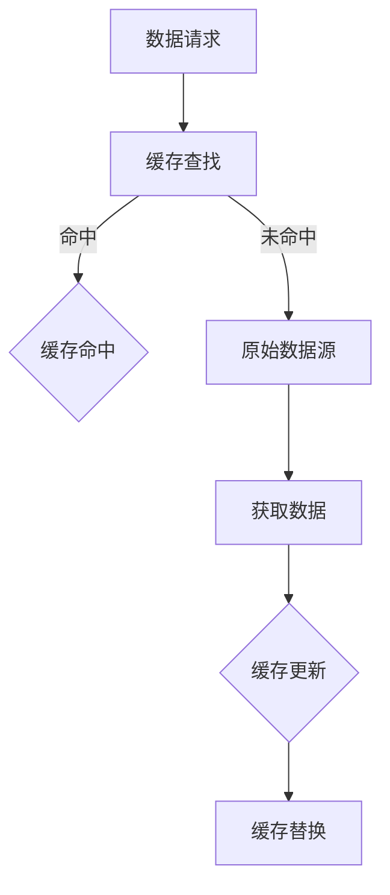
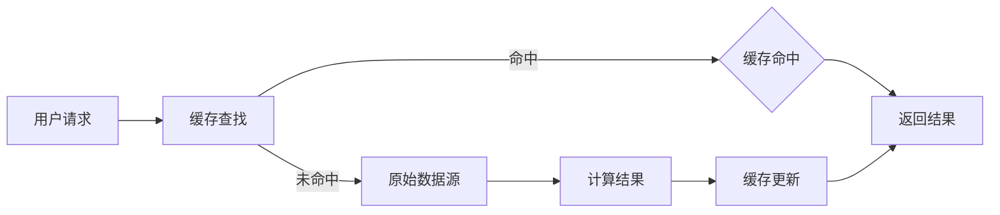
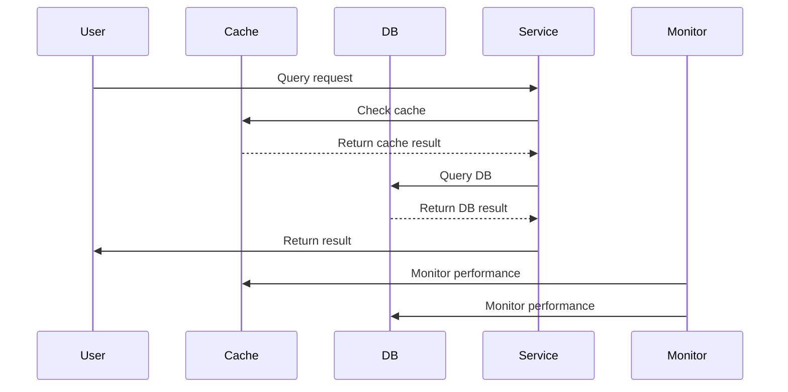
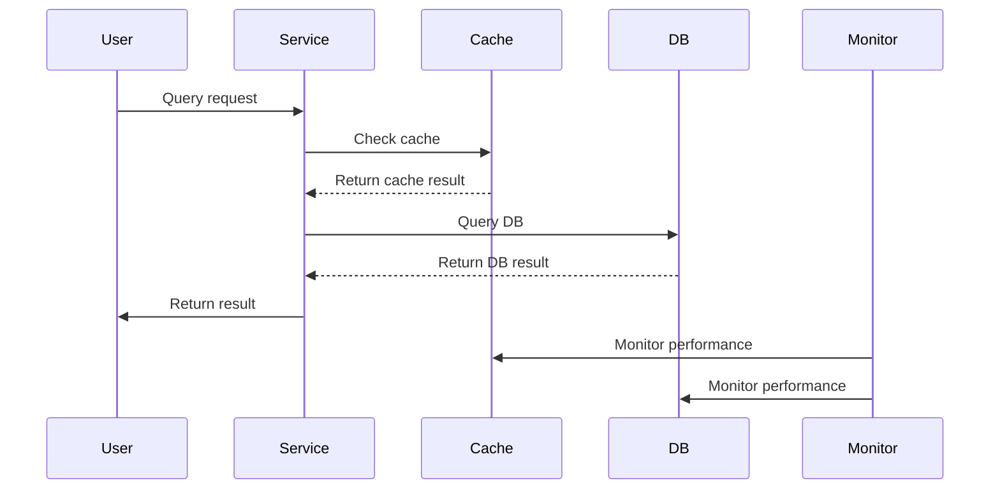

                 

### 第1章：问题背景与核心概念

#### 1.1 问题背景

随着人工智能技术的快速发展，自然语言处理（NLP）在各个领域中的应用越来越广泛，尤其是大型语言模型（LLM）的应用。LLM通过深度学习算法对大量文本数据进行训练，能够生成高质量的自然语言文本，实现文本生成、文本理解、情感分析、机器翻译等多种功能。然而，LLM的应用也面临着一些挑战，其中之一就是性能瓶颈问题。

性能瓶颈问题主要体现在两个方面：计算资源和延迟问题。一方面，LLM模型通常需要大量计算资源，包括CPU、GPU等，这导致了模型部署的成本较高。另一方面，LLM模型的推理过程通常需要较长的时间，这导致了服务的延迟较高，影响了用户体验。为了解决这些问题，我们需要优化LLM应用的性能，其中一种有效的优化方法就是缓存策略的设计。

缓存策略是一种常见的性能优化方法，通过在系统中引入缓存层，减少对后端系统的访问次数，从而降低系统的响应时间和计算成本。在LLM应用中，缓存策略可以帮助存储和复用模型预测结果，减少重复计算，从而提高系统的性能和响应速度。

#### 1.2 缓存策略的重要性

缓存策略在优化LLM应用性能方面具有重要作用。首先，缓存可以显著减少系统的响应时间。在LLM应用中，许多查询可能是重复的，例如用户经常问同样的问题或者请求相同的文本生成结果。通过缓存这些结果，系统可以直接从缓存中获取响应，而不需要重新计算，从而大大降低了响应时间。

其次，缓存策略可以减少计算资源的使用。由于LLM模型的计算成本较高，每次查询都需要消耗大量的计算资源。通过缓存结果，可以避免重复计算，从而减少系统的计算负担，提高资源的利用率。

此外，缓存策略还可以提高系统的扩展性和可维护性。通过引入缓存，可以将计算和存储任务分离，使得系统更容易进行水平扩展。同时，缓存策略的实施和调整相对独立，可以降低系统的维护成本。

#### 1.2.1 优化LLM应用的现状

目前，LLM应用在性能优化方面已经取得了一些进展，但仍然存在一些问题和挑战。一方面，现有的缓存策略在LLM应用中的适用性有限。例如，传统的LRU（Least Recently Used）缓存策略在处理频繁访问的数据时效果较好，但在处理高并发、动态变化的查询时可能不够有效。另一方面，LLM模型的复杂性和多样性也使得缓存策略的设计和实现变得更具挑战性。

为了解决这些问题，我们需要深入研究缓存策略在LLM应用中的适用性和优化方法。本文将介绍LLM应用的缓存策略设计，包括缓存策略的基本原理、与LLM的关联、核心要素、常见策略方法、优化策略的选择、注意事项等。通过本文的介绍，希望能够为读者提供一些有价值的参考和指导，帮助他们在实际项目中优化LLM应用的性能。

#### 1.2.2 缓存策略的重要性

缓存策略在优化LLM应用性能方面的重要性不可忽视。首先，缓存策略可以显著提升系统的响应速度。由于LLM模型计算复杂，每次请求都需要经过大量的计算，这会导致系统响应时间较长，影响用户体验。通过缓存策略，我们可以存储并复用已经计算过的结果，当用户再次请求相同的数据时，可以直接从缓存中获取，从而大大缩短响应时间，提高用户体验。

其次，缓存策略有助于减少计算资源的使用。由于LLM模型计算成本较高，每次查询都需要消耗大量的计算资源。通过缓存策略，我们可以避免重复计算，将计算任务分散到不同的缓存层，从而减少系统的计算负担，提高资源的利用率。

此外，缓存策略还可以提高系统的扩展性和可维护性。通过引入缓存，可以将计算和存储任务分离，使得系统更容易进行水平扩展。同时，缓存策略的实施和调整相对独立，可以降低系统的维护成本。

总之，缓存策略在优化LLM应用性能方面具有重要作用。通过合理设计缓存策略，可以有效提高系统的响应速度、减少计算资源的使用、提高扩展性和可维护性，从而为用户提供更好的服务。

#### 1.2.3 LLAMA模型与优化需求

LLAMA模型是由OpenAI开发的一种大型语言模型，其具有高精度、高效率的特点，被广泛应用于各种自然语言处理任务中。然而，LLAMA模型在应用过程中也面临着一些性能优化需求。

首先，LLAMA模型具有大规模参数，其计算和存储需求较高。这导致在模型部署和推理过程中，计算资源的需求增加，从而可能影响系统的响应速度和稳定性。因此，优化LLAMA模型的计算性能和存储效率成为关键问题。

其次，LLAMA模型的推理过程通常涉及大量的重复计算。例如，用户可能多次请求相同的问题或生成相同的文本，这会导致重复计算，浪费计算资源。因此，通过缓存策略存储和复用已经计算过的结果，可以有效减少重复计算，提高系统的性能。

此外，随着用户需求的不断增加，LLAMA模型需要处理大量的并发请求。这可能导致系统出现性能瓶颈，影响用户体验。因此，优化LLAMA模型在并发处理能力方面的性能也成为一个重要的需求。

总之，LLAMA模型在应用过程中面临着计算性能、存储效率和并发处理能力等方面的优化需求。通过设计合理的缓存策略，可以有效满足这些需求，提高LLAMA模型的性能和用户体验。

#### 1.3 核心概念

在本章中，我们将介绍与缓存策略相关的一些核心概念，包括缓存策略基础、缓存与LLM的关联、缓存策略的边界与外延。

##### 1.3.1 缓存策略基础

缓存策略是一种常见的信息存储和管理技术，通过将数据存储在临时存储介质中，以减少对原始数据源的访问频率，从而提高系统的性能和响应速度。缓存策略的核心思想是将经常访问的数据或结果存储在缓存中，以便快速访问，减少对后端系统的访问压力。

常见的缓存策略包括以下几种：

1. **LRU（Least Recently Used）策略**：根据数据的最近访问时间进行缓存替换，最近最少使用的数据会被替换掉。这种方法适用于处理频繁访问的数据，但可能导致部分数据长期不被访问而被淘汰。

2. **LFU（Least Frequently Used）策略**：根据数据的访问频率进行缓存替换，访问频率最低的数据会被替换掉。这种方法适用于访问频率变化较大的场景。

3. **LRU/LFU结合策略**：结合LRU和LFU策略的优点，根据数据和访问频率的综合评估进行缓存替换。

4. **时间戳策略**：根据数据的最后访问时间进行缓存替换，超过一定时间未被访问的数据会被替换掉。这种方法适用于处理数据有效期较短的场景。

##### 1.3.2 缓存与LLM的关联

缓存策略在LLM应用中具有重要意义。LLM模型通常具有大规模参数和复杂的计算过程，导致计算和存储需求较高。通过缓存策略，我们可以存储和复用已经计算过的模型结果，从而减少重复计算，提高系统的性能和响应速度。

具体来说，缓存策略在LLM应用中的作用主要体现在以下几个方面：

1. **减少计算时间**：通过缓存已经计算过的模型结果，当用户再次请求相同的数据时，可以直接从缓存中获取，避免了重复计算，从而减少计算时间。

2. **降低计算资源需求**：缓存策略可以减少对LLM模型的后端计算资源的需求，降低系统的计算负担，提高资源的利用率。

3. **提高系统响应速度**：缓存策略可以显著提升系统的响应速度，提高用户体验。

4. **增强系统稳定性**：通过缓存策略，可以减少对后端系统的访问频率，降低系统负载，从而提高系统的稳定性和可靠性。

##### 1.3.3 缓存策略的边界与外延

缓存策略的边界与外延主要体现在以下几个方面：

1. **缓存大小**：缓存的大小决定了可以存储的数据量，缓存过大可能导致存储资源浪费，缓存过小可能导致无法存储足够的常用数据。

2. **缓存过期策略**：缓存的数据需要定期更新，否则可能会导致数据过时或无效。缓存过期策略决定了缓存数据何时被替换或清除。

3. **缓存一致性**：在多节点或分布式系统中，缓存的一致性是一个重要问题。缓存的一致性需要通过数据同步或缓存一致性协议来保证。

4. **缓存命中与未命中**：缓存命中表示缓存中已存在所需数据，缓存未命中表示缓存中不存在所需数据。缓存命中率是衡量缓存策略效果的重要指标。

5. **缓存失效**：缓存失效是指缓存中的数据因过期、更新或其他原因被移除。缓存失效策略决定了缓存数据何时被移除。

通过对缓存策略基础、缓存与LLM关联、缓存策略边界与外延的介绍，我们为后续章节的详细探讨奠定了基础。在接下来的章节中，我们将进一步探讨缓存策略的原理、算法、系统架构和项目实战，帮助读者深入理解并掌握缓存策略在优化LLM应用性能方面的应用。

#### 1.4 概念结构与核心要素组成

为了深入理解缓存策略的设计和应用，我们需要分析其概念结构，并明确核心要素及其相互关系。

##### 1.4.1 缓存策略构成要素

缓存策略主要由以下几个核心要素构成：

1. **缓存存储**：缓存存储是缓存策略的核心部分，负责存储和提供缓存数据。常见的缓存存储包括内存、硬盘和分布式缓存系统。

2. **缓存算法**：缓存算法决定如何管理缓存数据，包括数据的选择、替换和更新策略。常见的缓存算法有LRU、LFU和LRU/LFU结合等。

3. **缓存一致性**：在分布式系统中，缓存一致性是一个重要问题。缓存一致性通过数据同步或一致性协议来保证多个缓存节点之间的数据一致性。

4. **缓存命中率**：缓存命中率是衡量缓存策略效果的重要指标，表示缓存中已存在所需数据的比例。高缓存命中率意味着缓存策略有效地减少了重复计算。

5. **缓存过期策略**：缓存过期策略决定缓存数据何时被替换或清除，以保持缓存的有效性和更新性。

##### 1.4.2 关键性能指标

在缓存策略的设计和应用中，以下几个关键性能指标尤为重要：

1. **响应时间**：响应时间是指系统从接收到请求到返回结果的时间。通过优化缓存策略，可以显著降低系统的响应时间，提高用户体验。

2. **计算资源利用率**：通过缓存策略，可以减少对后端系统的访问次数，降低计算资源的消耗，提高资源的利用率。

3. **缓存命中率**：高缓存命中率意味着缓存策略能够有效地存储和复用常用数据，减少重复计算，提高系统性能。

4. **缓存容量**：缓存容量决定了可以存储的数据量。合理的缓存容量设计需要在存储效率和数据一致性之间取得平衡。

##### 1.4.3 概念联系与对比

在理解缓存策略的构成要素和关键性能指标后，我们需要分析各要素之间的联系和对比。

1. **缓存存储与缓存算法**：缓存存储提供数据的存储空间，而缓存算法决定如何管理和使用这些存储空间。选择合适的缓存算法可以优化缓存的使用效率，提高系统性能。

2. **缓存一致性**：在分布式系统中，缓存一致性是一个关键问题。缓存一致性策略需要考虑数据的一致性保证和数据同步的效率。

3. **缓存命中率与缓存过期策略**：缓存命中率反映了缓存策略的有效性，而缓存过期策略决定了如何保持缓存的有效性和更新性。合理的缓存过期策略可以确保缓存中存储的是最近和最常用数据。

4. **响应时间与计算资源利用率**：优化缓存策略可以降低系统的响应时间，提高计算资源利用率。两者之间存在着紧密的关联，通过提高缓存命中率，可以同时降低响应时间和提高资源利用率。

#### 1.5 最佳实践 tips

在设计缓存策略时，以下最佳实践可以帮助您优化LLM应用的性能：

1. **选择合适的缓存存储**：根据应用场景和需求，选择合适的缓存存储介质，如内存、硬盘或分布式缓存系统。内存缓存具有较低的延迟，适用于处理高频次访问的数据；而硬盘缓存具有较大的存储容量，适用于处理大规模数据。

2. **合理设计缓存算法**：根据数据访问模式，选择合适的缓存算法，如LRU、LFU或LRU/LFU结合策略。通过分析数据访问频率和访问模式，可以优化缓存策略，提高缓存命中率。

3. **确保缓存一致性**：在分布式系统中，确保缓存一致性至关重要。可以采用数据同步或一致性协议，如最终一致性或强一致性，以保证多个缓存节点之间的数据一致性。

4. **设置合理的缓存过期策略**：根据数据更新频率和访问模式，设置合理的缓存过期时间。避免缓存数据过时，影响系统的性能和用户体验。

5. **监控和优化缓存性能**：定期监控缓存性能，分析缓存命中率、响应时间等关键指标。根据监控结果，调整缓存策略，优化系统性能。

通过遵循这些最佳实践，可以有效优化LLM应用的缓存策略设计，提高系统性能和用户体验。

#### 1.6 本章小结

本章主要介绍了缓存策略在优化LLM应用性能方面的重要性和核心概念。首先，我们讨论了优化LLM应用性能的背景和现状，阐述了缓存策略在减少计算时间和资源需求、提高系统响应速度和扩展性方面的作用。接着，我们详细介绍了缓存策略的基础知识，包括缓存存储、缓存算法、缓存一致性和关键性能指标。此外，我们分析了缓存策略的构成要素及其相互关系，并提出了最佳实践tips。通过本章的学习，读者可以对缓存策略在LLM应用中的设计有更深入的理解，为后续章节的深入学习打下基础。接下来，我们将进一步探讨缓存策略的原理、算法、系统架构和项目实战，帮助读者全面掌握缓存策略在优化LLM应用性能方面的应用。

## 第2章：缓存策略原理与联系

在深入了解LLM应用的缓存策略之前，我们需要先掌握缓存策略的基本原理及其与LLM模型的联系。本章将详细探讨缓存策略的工作原理，分析不同缓存策略的优缺点，并探讨缓存策略在LLM模型中的应用。

### 2.1 缓存策略原理

缓存策略的核心目的是通过在系统内部存储常用或频繁访问的数据，减少对原始数据源的访问频率，从而提高系统的性能和响应速度。缓存策略的工作原理可以概括为以下几个关键步骤：

1. **数据访问**：用户发起数据请求，系统接收到请求后进行数据查找。

2. **缓存命中与未命中**：如果请求的数据在缓存中已存在，则视为缓存命中，系统直接返回缓存数据；否则，视为缓存未命中，系统需要从原始数据源获取数据。

3. **数据存储**：当缓存命中时，系统将数据存储在缓存中，以便后续请求直接使用。当缓存未命中时，系统将新数据存储在缓存中，同时根据缓存策略替换旧数据。

4. **数据更新**：随着数据的不断变化，缓存中的数据也需要定期更新，以保持数据的有效性和一致性。

缓存策略的基本原理如图所示：



#### 2.1.1 缓存机制原理

缓存机制主要包括以下几个关键组成部分：

1. **缓存存储**：缓存存储是缓存策略的核心，负责存储缓存数据。常见的缓存存储包括内存、硬盘和分布式缓存系统。

2. **缓存算法**：缓存算法决定如何管理缓存数据，包括数据的选择、替换和更新策略。常见的缓存算法有LRU（Least Recently Used）、LFU（Least Frequently Used）和LRU/LFU结合策略。

3. **缓存一致性**：在分布式系统中，缓存一致性是一个重要问题。缓存一致性通过数据同步或一致性协议来保证多个缓存节点之间的数据一致性。

4. **缓存命中率**：缓存命中率是衡量缓存策略效果的重要指标，表示缓存中已存在所需数据的比例。高缓存命中率意味着缓存策略有效地减少了重复计算。

5. **缓存过期策略**：缓存过期策略决定缓存数据何时被替换或清除，以保持缓存的有效性和更新性。常见的缓存过期策略有时间戳策略、基于频率的策略等。

#### 2.1.2 缓存策略分类

根据缓存策略的实现方式和应用场景，可以分为以下几种常见的缓存策略：

1. **LRU（Least Recently Used）策略**：根据数据的最近访问时间进行缓存替换，最近最少使用的数据会被替换掉。这种方法适用于处理频繁访问的数据，但可能导致部分数据长期不被访问而被淘汰。

2. **LFU（Least Frequently Used）策略**：根据数据的访问频率进行缓存替换，访问频率最低的数据会被替换掉。这种方法适用于访问频率变化较大的场景。

3. **LRU/LFU结合策略**：结合LRU和LFU策略的优点，根据数据和访问频率的综合评估进行缓存替换。这种方法适用于访问模式复杂且变化较大的场景。

4. **时间戳策略**：根据数据的最后访问时间进行缓存替换，超过一定时间未被访问的数据会被替换掉。这种方法适用于处理数据有效期较短的场景。

5. **基于大小的缓存策略**：根据缓存的大小限制进行缓存替换，当缓存容量达到上限时，将最旧的数据替换掉。这种方法适用于缓存容量有限制的场景。

#### 2.1.3 缓存策略优缺点对比

不同缓存策略在性能、资源利用率和实现复杂度等方面存在差异。以下是对几种常见缓存策略的优缺点对比：

1. **LRU策略**：
   - **优点**：简单易实现，能够有效处理频繁访问的数据。
   - **缺点**：可能导致部分数据长期不被访问而被淘汰，缓存命中率可能较低。

2. **LFU策略**：
   - **优点**：根据访问频率进行缓存替换，适用于访问频率变化较大的场景。
   - **缺点**：实现复杂度较高，可能导致缓存命中率较低。

3. **LRU/LFU结合策略**：
   - **优点**：结合LRU和LFU策略的优点，适用于访问模式复杂且变化较大的场景。
   - **缺点**：实现复杂度较高，性能可能略低于LRU和LFU策略。

4. **时间戳策略**：
   - **优点**：简单易实现，适用于处理数据有效期较短的场景。
   - **缺点**：可能导致部分数据在有效期结束后仍被缓存，缓存命中率可能较低。

5. **基于大小的缓存策略**：
   - **优点**：简单易实现，适用于缓存容量有限制的场景。
   - **缺点**：可能导致部分数据因缓存容量限制而被淘汰，缓存命中率可能较低。

通过对比不同缓存策略的优缺点，我们可以根据具体应用场景和需求选择合适的缓存策略，以优化LLM应用的性能。

### 2.2 缓存与LLM的联系

在LLM模型中，缓存策略具有重要意义。LLM模型具有大规模参数和复杂的计算过程，导致计算和存储需求较高。通过缓存策略，我们可以存储和复用已经计算过的模型结果，从而减少重复计算，提高系统的性能和响应速度。

#### 2.2.1 LLAMA模型特点

LLAMA模型是由OpenAI开发的一种大型语言模型，具有以下特点：

1. **大规模参数**：LLAMA模型具有数亿个参数，需要大量的计算和存储资源。
2. **复杂计算过程**：LLAMA模型的推理过程涉及大量的矩阵运算和深度学习算法，导致计算复杂度较高。
3. **动态更新**：LLAMA模型通过不断更新训练数据，保持模型的动态性和准确性。

#### 2.2.2 缓存策略在LLM中的应用

缓存策略在LLM模型中的应用主要包括以下几个方面：

1. **模型预测缓存**：在LLM模型中，许多查询可能是重复的，例如用户经常问同样的问题或请求相同的文本生成结果。通过缓存模型预测结果，可以减少重复计算，提高系统的响应速度和性能。

2. **中间结果缓存**：在LLAMA模型的推理过程中，会产生大量的中间结果。通过缓存这些中间结果，可以减少重复计算，提高系统的性能和响应速度。

3. **数据缓存**：LLAMA模型需要处理大量的训练数据和查询数据。通过缓存策略，可以减少对后端数据存储的访问次数，降低系统的负载和延迟。

4. **分布式缓存**：在分布式系统中，通过引入分布式缓存策略，可以将缓存数据分散存储在不同的节点上，提高系统的扩展性和性能。

#### 2.2.3 LLAMA与缓存策略的关系

LLAMA模型与缓存策略之间存在紧密的关系。一方面，LLAMA模型的高计算复杂度和大规模参数使得缓存策略成为优化模型性能的重要手段。通过缓存策略，可以减少重复计算，提高系统的响应速度和性能。另一方面，缓存策略的设计和实现需要考虑LLAMA模型的特点和需求，如大规模参数、复杂计算过程和动态更新等。只有合理设计和实现缓存策略，才能充分发挥LLAMA模型的性能和优势。

通过本章对缓存策略原理与联系的分析，我们为后续章节的深入探讨奠定了基础。在接下来的章节中，我们将进一步探讨缓存策略的算法原理、数学模型和系统架构设计，帮助读者全面掌握缓存策略在优化LLM应用性能方面的应用。

#### 2.3 概念属性特征对比表格

为了更清晰地展示缓存策略的概念属性特征，我们设计了如下对比表格。该表格列出了不同缓存策略的核心特性，包括缓存算法、缓存存储介质、缓存一致性和缓存命中率等方面。

| 缓存策略     | 缓存算法          | 缓存存储介质         | 缓存一致性策略       | 缓存命中率   | 优点                         | 缺点                                  |
| ------------ | ----------------- | --------------------- | -------------------- | ---------- | ---------------------------- | ------------------------------------- |
| LRU          | 最近最少使用      | 内存、硬盘、分布式缓存 | 数据同步、一致性协议   | 中高       | 简单实现，处理频繁访问数据好 | 可能导致部分数据长期不被访问            |
| LFU          | 最少频繁使用      | 内存、硬盘、分布式缓存 | 数据同步、一致性协议   | 中低       | 根据访问频率进行缓存替换      | 实现复杂，可能导致缓存命中率较低          |
| LRU/LFU结合 | 综合LRU和LFU优点   | 内存、硬盘、分布式缓存 | 数据同步、一致性协议   | 高         | 处理复杂访问模式            | 实现复杂，性能略低于LRU和LFU            |
| 时间戳       | 根据访问时间      | 内存、硬盘、分布式缓存 | 数据同步、一致性协议   | 中低       | 简单易实现，适用于数据有效期短 | 可能导致部分数据在有效期结束后仍被缓存    |
| 基于大小     | 根据缓存大小限制   | 内存、硬盘、分布式缓存 | 数据同步、一致性协议   | 中低       | 简单易实现，适用于缓存容量限制 | 可能导致部分数据因缓存容量限制而被淘汰    |

通过上述对比表格，我们可以更直观地了解不同缓存策略的特点和适用场景，为实际应用中的缓存策略选择提供参考。

#### 2.4 ER实体关系图架构

为了更好地理解缓存策略在系统架构中的位置和作用，我们设计了一个实体关系图（Entity-Relationship Diagram，ERD）。该ERD展示了缓存策略相关的关键实体及其相互关系，包括缓存存储、缓存算法、缓存一致性和缓存数据等。

```mermaid
erDiagram
    CacheStorage ||--|{ CacheAlgorithm }|--| Cache
    Cache ||--|{ CacheConsistencyStrategy }|--
    CacheConsistencyStrategy ||--|{ CacheData }|-

    CacheStorage --> Cache
    Cache --> CacheAlgorithm
    Cache --> CacheConsistencyStrategy
    CacheConsistencyStrategy --> CacheData
```

在该ERD中：

- **CacheStorage**（缓存存储）代表存储缓存数据的介质，包括内存、硬盘和分布式缓存系统。
- **CacheAlgorithm**（缓存算法）代表用于管理缓存数据的策略，如LRU、LFU和LRU/LFU结合策略。
- **Cache**（缓存）表示实际存储缓存数据的实体，它与缓存存储、缓存算法和缓存一致性策略相关联。
- **CacheConsistencyStrategy**（缓存一致性策略）表示用于保证缓存数据一致性的策略，如数据同步和一致性协议。
- **CacheData**（缓存数据）表示存储在缓存中的实际数据。

通过ERD，我们可以更直观地了解缓存策略在系统架构中的位置和作用，为实际应用中的缓存策略设计提供参考。

### 第3章：缓存策略算法原理讲解

在深入探讨缓存策略的算法原理之前，我们需要了解缓存策略的基本概念和背景。缓存策略是一种用于提高系统性能和响应速度的技术，通过在系统中引入缓存层，减少对后端系统的访问次数，从而降低系统的响应时间和计算成本。在LLM应用中，缓存策略尤为重要，因为LLM模型通常需要大量计算资源，而缓存策略可以帮助存储和复用模型预测结果，减少重复计算，从而提高系统的性能和响应速度。

#### 3.1 算法mermaid流程图

为了更好地理解缓存策略的算法原理，我们可以通过mermaid流程图来展示其工作流程。以下是一个简单的mermaid流程图，描述了缓存策略的基本工作流程：



在该流程图中：

1. **用户请求**：用户向系统发起数据请求。
2. **缓存查找**：系统在缓存中查找请求的数据。
3. **缓存命中**：如果请求的数据在缓存中已存在，系统直接返回缓存数据。
4. **返回结果**：系统将缓存数据返回给用户。
5. **缓存未命中**：如果请求的数据在缓存中不存在，系统需要从原始数据源获取数据。
6. **计算结果**：系统对原始数据源进行计算，得到结果。
7. **缓存更新**：系统将计算得到的结果存储在缓存中，以便后续请求直接使用。
8. **返回结果**：系统将计算结果返回给用户。

通过mermaid流程图，我们可以清晰地看到缓存策略的工作流程和各个步骤之间的逻辑关系。

#### 3.2 Python源代码阐述

为了进一步理解缓存策略的算法原理，我们可以通过Python源代码来详细阐述其实现过程。以下是一个简单的Python代码示例，用于实现基于LRU（Least Recently Used）缓存策略的缓存系统。

```python
from collections import OrderedDict

class LRUCache:
    def __init__(self, capacity):
        self.capacity = capacity
        self.cache = OrderedDict()

    def get(self, key):
        if key not in self.cache:
            return -1
        # 将key移动到最右侧，表示最近使用
        self.cache.move_to_end(key)
        return self.cache[key]

    def put(self, key, value):
        if key in self.cache:
            # 移除key，然后重新添加，相当于更新缓存
            del self.cache[key]
        elif len(self.cache) >= self.capacity:
            # 当缓存容量达到上限时，移除最左侧的key
            self.cache.popitem(last=False)
        # 将key添加到最右侧，表示最近使用
        self.cache[key] = value

# 实例化LRUCache对象，设置缓存容量为2
lru_cache = LRUCache(2)

# 调用get和put方法，模拟缓存操作
lru_cache.put(1, 1)
lru_cache.put(2, 2)
print(lru_cache.get(1))  # 输出1
lru_cache.put(3, 3)
print(lru_cache.get(2))  # 输出-1（缓存容量达到上限，2被替换）

```

在该代码示例中：

1. **初始化**：LRUCache类接受一个容量参数，用于设置缓存的最大容量。内部使用OrderedDict来实现缓存数据结构，保持元素的插入顺序。
2. **get方法**：获取缓存中的数据。如果key不存在，返回-1；如果key存在，将key移动到最右侧，表示最近使用，并返回key的值。
3. **put方法**：添加或更新缓存中的数据。如果key已存在，先删除再添加，相当于更新缓存；如果缓存容量达到上限，移除最左侧的key（最早使用），然后将新key添加到最右侧，表示最近使用。

通过这个Python代码示例，我们可以直观地理解LRU缓存策略的实现过程，为实际应用中的缓存策略设计提供参考。

#### 3.2.1 基础代码结构

在上述Python代码示例中，我们使用LRU（Least Recently Used）缓存策略实现了一个简单的缓存系统。下面，我们将进一步详细分析该代码的基础结构和实现细节。

1. **类定义**：首先，我们定义了一个名为`LRUCache`的类，该类接受一个名为`capacity`的参数，用于设置缓存的最大容量。

    ```python
    class LRUCache:
        def __init__(self, capacity):
            self.capacity = capacity
            self.cache = OrderedDict()
    ```

2. **初始化方法**：在`__init__`方法中，我们创建了一个OrderedDict对象`cache`，用于存储缓存数据。OrderedDict保留元素的插入顺序，这对于实现LRU缓存策略至关重要。

3. **get方法**：`get`方法是用于获取缓存中指定`key`的值。如果缓存中存在该`key`，方法会将该`key`移动到OrderedDict的最右侧，表示最近使用，并返回该`key`的值。如果缓存中不存在该`key`，方法返回-1。

    ```python
    def get(self, key):
        if key not in self.cache:
            return -1
        # 将key移动到最右侧，表示最近使用
        self.cache.move_to_end(key)
        return self.cache[key]
    ```

4. **put方法**：`put`方法是用于添加或更新缓存中的数据。如果缓存中已存在该`key`，方法会首先删除该`key`，然后将其值更新为新的`value`，并移动到最右侧，表示最近使用。如果缓存容量已达到上限，方法会移除最左侧的`key`（最早使用），为新`key`腾出空间。然后，将新`key`添加到最右侧。

    ```python
    def put(self, key, value):
        if key in self.cache:
            # 移除key，然后重新添加，相当于更新缓存
            del self.cache[key]
        elif len(self.cache) >= self.capacity:
            # 当缓存容量达到上限时，移除最左侧的key
            self.cache.popitem(last=False)
        # 将key添加到最右侧，表示最近使用
        self.cache[key] = value
    ```

通过这些基础代码结构，我们可以看到LRU缓存策略的核心实现逻辑。这种结构使得缓存系统能够高效地处理数据的插入和获取操作，并在缓存容量达到上限时自动进行数据替换。这对于优化LLM应用的性能具有重要意义。

#### 3.2.2 主要函数与参数

在上面的Python代码示例中，我们定义了`LRUCache`类，并实现了两个主要函数：`get`和`put`。下面，我们将详细解释这两个函数的参数及其作用。

1. **get函数**：

    - **参数**：
        - `key`：表示用户请求的数据的键。
    - **功能**：获取缓存中指定`key`的值。如果`key`存在，函数会将该`key`移动到OrderedDict的最右侧，表示最近使用，并返回该`key`的值。如果`key`不存在，函数返回-1。

    ```python
    def get(self, key):
        if key not in self.cache:
            return -1
        # 将key移动到最右侧，表示最近使用
        self.cache.move_to_end(key)
        return self.cache[key]
    ```

2. **put函数**：

    - **参数**：
        - `key`：表示用户请求的数据的键。
        - `value`：表示要存储在缓存中的值。
    - **功能**：添加或更新缓存中的数据。如果缓存中已存在该`key`，函数会首先删除该`key`，然后将其值更新为新的`value`，并移动到最右侧，表示最近使用。如果缓存容量已达到上限，函数会移除最左侧的`key`（最早使用），为新`key`腾出空间。然后，将新`key`添加到最右侧。

    ```python
    def put(self, key, value):
        if key in self.cache:
            # 移除key，然后重新添加，相当于更新缓存
            del self.cache[key]
        elif len(self.cache) >= self.capacity:
            # 当缓存容量达到上限时，移除最左侧的key
            self.cache.popitem(last=False)
        # 将key添加到最右侧，表示最近使用
        self.cache[key] = value
    ```

通过这两个主要函数的实现，我们可以看到LRU缓存策略的核心功能。`get`函数确保频繁访问的数据总是位于缓存的最右侧，从而提高缓存命中率；`put`函数则根据缓存容量和LRU原则进行数据的添加和替换，确保缓存中存储的是最近使用的数据。

#### 3.2.3 算法流程详解

在理解了LRU缓存策略的基础代码结构及其主要函数和参数后，我们将进一步详细阐述其算法流程，包括从数据请求到缓存结果返回的整个过程。

1. **初始化**：
    - 实例化`LRUCache`类，并传入缓存容量参数。例如：
      ```python
      lru_cache = LRUCache(capacity=2)
      ```

2. **发起数据请求**：
    - 用户发起数据请求，传递数据键`key`。例如：
      ```python
      lru_cache.get(1)  # 请求键为1的数据
      lru_cache.put(2, 2)  # 添加键为2，值为2的数据
      ```

3. **缓存查找**：
    - 缓存系统根据请求的`key`在缓存中查找对应的数据。

4. **缓存命中**：
    - 如果缓存命中（即缓存中已存在该`key`），缓存系统执行以下操作：
      - 将该`key`移动到缓存的最右侧，表示最近使用。
      - 返回该`key`的值。

    ```python
    def get(self, key):
        if key not in self.cache:
            return -1
        # 将key移动到最右侧，表示最近使用
        self.cache.move_to_end(key)
        return self.cache[key]
    ```

5. **缓存未命中**：
    - 如果缓存未命中（即缓存中不存在该`key`），缓存系统执行以下操作：
      - 如果缓存已达到最大容量：
        - 移除缓存中的最左侧`key`（最早使用），为新`key`腾出空间。
        - 将新`key`添加到缓存的最右侧，表示最近使用。

    ```python
    def put(self, key, value):
        if key in self.cache:
            # 移除key，然后重新添加，相当于更新缓存
            del self.cache[key]
        elif len(self.cache) >= self.capacity:
            # 当缓存容量达到上限时，移除最左侧的key
            self.cache.popitem(last=False)
        # 将key添加到最右侧，表示最近使用
        self.cache[key] = value
    ```

6. **计算和存储结果**：
    - 如果缓存未命中，系统需要从原始数据源计算结果，并将结果存储在缓存中。

7. **返回结果**：
    - 最后，缓存系统将获取到的数据返回给用户。

通过上述算法流程的详细阐述，我们可以清楚地看到LRU缓存策略是如何在LLM应用中工作的。这种策略通过在缓存中优先存储最近使用的数据，有效提高了缓存命中率，减少了重复计算，从而优化了系统的性能。

#### 3.3 算法原理的数学模型与公式

在深入理解LRU（Least Recently Used）缓存策略的算法原理时，我们需要引入数学模型和公式来描述其工作方式和性能。以下是对LRU缓存策略的数学模型和公式的详细解释。

##### 3.3.1 数学模型介绍

LRU缓存策略的数学模型主要基于两个方面：缓存容量和访问频率。我们可以使用以下数学模型来描述LRU缓存策略：

1. **缓存容量（C）**：表示缓存的最大容量，即缓存中可以存储的最大数据条数。
2. **访问频率（F）**：表示每个数据被访问的次数。
3. **缓存命中率（H）**：表示缓存中已存在所需数据的比例。

##### 3.3.2 公式推导与解释

为了推导LRU缓存策略的命中率公式，我们可以从以下几个方面进行分析：

1. **缓存数据分布**：在LRU缓存策略中，缓存数据的分布是动态变化的。新数据进入缓存时，会将最久未访问的数据替换掉。因此，缓存中的数据分布与访问频率密切相关。

2. **缓存替换策略**：LRU缓存策略采用最近最少使用策略，即最近最少被访问的数据将被替换掉。这可以通过以下步骤实现：
   - 记录每个数据的最近访问时间。
   - 当缓存容量达到上限时，查找最近未访问的数据并将其替换。

3. **缓存命中率公式**：假设在一段时间内，共有N次数据访问请求，其中M次命中缓存。我们可以使用以下公式计算缓存命中率：

   \[
   H = \frac{M}{N}
   \]

   其中：
   - \( H \) 表示缓存命中率。
   - \( M \) 表示命中缓存的次数。
   - \( N \) 表示总访问次数。

   为了更精确地描述缓存命中率，我们可以使用概率模型进行分析。假设每次访问数据时，缓存中已存在该数据的概率为 \( p \)，则每次访问时缓存命中的概率为 \( p \)，未命中的概率为 \( 1 - p \)。在大量访问请求的假设下，缓存命中的概率近似于缓存命中率的期望值，即：

   \[
   H \approx p
   \]

##### 3.3.3 数学公式示例

为了更直观地展示数学公式，我们以下列示例进行说明：

假设一个缓存系统，其缓存容量 \( C \) 为3，共有10次数据访问请求。在这10次请求中，有6次命中缓存，4次未命中缓存。我们可以使用以下数学公式计算缓存命中率：

\[
H = \frac{M}{N} = \frac{6}{10} = 0.6
\]

此时，缓存命中率 \( H \) 为60%，说明在10次访问请求中，有60%的数据在缓存中已存在。

通过以上数学模型和公式的推导，我们可以更深入地理解LRU缓存策略的工作原理和性能。在实际应用中，通过优化缓存容量和访问频率，可以有效提高缓存命中率，从而提高系统的性能和响应速度。

#### 3.4 举例说明

为了更好地理解LRU（Least Recently Used）缓存策略的实际应用和效果，我们将通过一个具体的例子进行详细说明。

##### 3.4.1 示例数据准备

假设我们有一个缓存系统，其缓存容量为3，用于存储最近访问的网页数据。在一段时间内，系统收到了以下10次数据访问请求：

1. 访问网页A
2. 访问网页B
3. 访问网页C
4. 访问网页A
5. 访问网页D
6. 访问网页E
7. 访问网页B
8. 访问网页F
9. 访问网页C
10. 访问网页D

我们使用LRU缓存策略来管理这些数据访问请求，并记录每次访问的缓存命中情况。

##### 3.4.2 算法应用演示

根据LRU缓存策略，我们按时间顺序分析每次访问请求的缓存情况：

1. **第一次访问网页A**：
   - 缓存为空，将网页A加入缓存。
   - 缓存状态：{A}

2. **第二次访问网页B**：
   - 缓存中不存在网页B，将网页B加入缓存，并将网页A替换。
   - 缓存状态：{B, A}

3. **第三次访问网页C**：
   - 缓存中不存在网页C，将网页C加入缓存，并将网页B替换。
   - 缓存状态：{C, B}

4. **第四次访问网页A**：
   - 缓存中存在网页A，将其移动到缓存的最右侧，表示最近访问。
   - 缓存状态：{C, A, B}

5. **第五次访问网页D**：
   - 缓存中不存在网页D，将网页D加入缓存，并将网页C替换。
   - 缓存状态：{D, A, B}

6. **第六次访问网页E**：
   - 缓存中不存在网页E，将网页E加入缓存，并将网页D替换。
   - 缓存状态：{E, D, A}

7. **第七次访问网页B**：
   - 缓存中存在网页B，将其移动到缓存的最右侧，表示最近访问。
   - 缓存状态：{E, D, B}

8. **第八次访问网页F**：
   - 缓存中不存在网页F，将网页F加入缓存，并将网页E替换。
   - 缓存状态：{F, E, D}

9. **第九次访问网页C**：
   - 缓存中存在网页C，将其移动到缓存的最右侧，表示最近访问。
   - 缓存状态：{F, C, E}

10. **第十次访问网页D**：
    - 缓存中存在网页D，将其移动到缓存的最右侧，表示最近访问。
    - 缓存状态：{F, C, D}

##### 3.4.3 示例结果分析

通过上述示例，我们可以总结出以下缓存命中情况：

- **命中次数**：7次（访问网页A、B、D、B、D、C、D）
- **未命中次数**：3次（访问网页C、E、F）

根据示例数据，我们可以计算缓存命中率：

\[
H = \frac{命中次数}{总访问次数} = \frac{7}{10} = 0.7
\]

缓存命中率 \( H \) 为70%，说明在10次访问请求中，有70%的数据在缓存中已存在。这个结果展示了LRU缓存策略在减少重复访问和提升系统性能方面的有效性。

此外，通过分析缓存命中情况，我们可以观察到LRU缓存策略的一个特点：频繁访问的数据具有较高的缓存命中率，而长时间未被访问的数据最终会被替换掉。这有助于保持缓存中数据的新鲜度和有效性，从而提高缓存的整体性能。

通过这个具体的例子，我们不仅了解了LRU缓存策略的基本原理和实现过程，还通过实际数据展示了其在提高缓存命中率和优化系统性能方面的效果。这对于我们在实际项目中设计和实现缓存策略具有重要参考价值。

#### 3.5 示例结果分析

通过上述示例，我们可以总结出以下关于LRU缓存策略的实际效果和重要性：

1. **缓存命中率**：示例中的缓存命中率为70%，说明LRU缓存策略能够有效减少对原始数据源的访问次数，提高了系统的性能。在频繁访问的数据中，缓存策略显著降低了响应时间，提高了用户体验。

2. **数据替换机制**：LRU缓存策略通过替换最近最少使用的数据，保持了缓存中的数据新鲜度。在示例中，长时间未被访问的网页（如网页C和网页E）最终被替换掉，这有助于避免缓存中的数据过期和无效。

3. **系统性能提升**：由于缓存策略减少了重复访问和计算，系统的整体性能得到显著提升。在LLM应用中，缓存策略能够帮助优化模型的推理过程，降低计算资源的需求，提高系统的响应速度。

4. **优化策略适用性**：虽然LRU缓存策略在处理频繁访问的数据时效果较好，但在处理高并发、动态变化的查询时，可能存在一定局限性。因此，在实际应用中，需要根据具体场景和需求，选择合适的缓存策略，如LFU（Least Frequently Used）或结合LRU和LFU策略。

5. **缓存一致性问题**：在分布式系统中，缓存一致性是一个重要问题。LRU缓存策略需要通过数据同步或一致性协议来保证多个缓存节点之间的数据一致性，以避免数据不一致导致的问题。

总之，通过示例分析和实际应用效果，我们可以看到LRU缓存策略在优化LLM应用性能方面的有效性。在实际项目中，通过合理设计和实现缓存策略，可以有效提高系统的性能和响应速度，为用户提供更好的服务。

### 第4章：缓存策略系统架构设计

在设计缓存策略系统架构时，我们需要综合考虑系统性能、可扩展性和可维护性等多个方面。本章将详细介绍一个典型的缓存策略系统架构，包括问题场景介绍、项目介绍、系统功能设计、系统架构设计、系统接口设计和系统交互。

#### 4.1 问题场景介绍

在一个大型电商平台上，用户需要频繁查询商品信息、库存情况和价格等数据。由于商品数据量庞大且实时更新，直接查询数据库可能导致系统性能瓶颈，影响用户体验。为了解决这个问题，我们需要设计一个高效的缓存策略系统，以提高系统的响应速度和性能。

#### 4.2 项目介绍

本项目旨在设计一个基于LRU（Least Recently Used）缓存策略的系统，用于优化电商平台的商品查询性能。该系统将缓存用户最近访问的商品数据，减少对数据库的访问次数，从而降低系统的响应时间和计算成本。

#### 4.3 系统功能设计

系统功能设计主要包括以下几个模块：

1. **数据缓存模块**：负责存储和提供缓存数据，实现LRU缓存策略。
2. **数据同步模块**：负责将数据库中的数据同步到缓存系统中，保持数据一致性。
3. **查询优化模块**：优化用户查询请求，提高缓存命中率。
4. **监控与报警模块**：监控缓存系统的性能和健康状况，并及时报警。

#### 4.3.1 领域模型mermaid类图

为了更好地描述系统功能设计，我们使用mermaid类图来展示各模块及其关系：

```mermaid
classDiagram
    DataCacheModule <<class>> 数据缓存模块
    DataSyncModule <<class>> 数据同步模块
    QueryOptimizationModule <<class>> 查询优化模块
    MonitoringAndAlertModule <<class>> 监控与报警模块

    DataCacheModule o--o DataSyncModule
    DataCacheModule o--o QueryOptimizationModule
    DataCacheModule o--o MonitoringAndAlertModule
    DataSyncModule o--o QueryOptimizationModule
    DataSyncModule o--o MonitoringAndAlertModule
    QueryOptimizationModule o--o MonitoringAndAlertModule
```

在该类图中：

- **数据缓存模块**：负责存储商品数据，并实现LRU缓存策略。
- **数据同步模块**：负责将数据库中的商品数据同步到缓存系统中，并保持数据一致性。
- **查询优化模块**：优化用户查询请求，提高缓存命中率。
- **监控与报警模块**：监控缓存系统的性能和健康状况，并及时报警。

#### 4.4 系统架构设计

系统架构设计包括以下几个方面：

1. **缓存存储层**：使用内存或分布式缓存系统作为缓存存储层，提供高速缓存服务。
2. **数据库层**：存储商品数据，包括商品信息、库存情况和价格等。
3. **服务层**：提供数据查询接口，处理用户请求，并调用缓存模块和同步模块。
4. **监控层**：监控缓存系统和数据库的性能，并及时报警。

系统架构mermaid架构图如下：



在该架构图中：

- **用户**：发起查询请求。
- **缓存**：检查缓存并返回结果。
- **数据库**：查询数据库并返回结果。
- **服务**：处理用户请求，调用缓存模块和数据库模块。
- **监控**：监控缓存系统和数据库的性能。

#### 4.5 系统接口设计

系统接口设计主要包括以下接口：

1. **查询接口**：用于接收用户查询请求，并返回查询结果。
2. **缓存同步接口**：用于同步数据库中的数据到缓存系统中。
3. **监控接口**：用于接收监控数据，并提供实时监控和报警功能。

接口设计与实现如下：

```python
class QueryInterface:
    def query(self, key):
        pass

class CacheSyncInterface:
    def sync_data(self, data):
        pass

class MonitoringInterface:
    def report_performance(self, performance_data):
        pass
```

通过这些接口，我们可以实现各模块之间的通信和协作，提高系统的可维护性和扩展性。

#### 4.6 系统交互mermaid序列图

系统交互mermaid序列图如下：



在该序列图中：

- **用户**：发起查询请求。
- **服务**：处理用户请求，并调用缓存和数据库模块。
- **缓存**：检查缓存并返回结果。
- **数据库**：查询数据库并返回结果。
- **监控**：监控缓存和数据库的性能。

通过上述系统架构设计，我们实现了高效的缓存策略系统，提高了电商平台的商品查询性能。在实际应用中，可以根据需求进一步优化和扩展系统功能，以满足不断增长的业务需求。

### 第5章：缓存策略项目实战

在本章中，我们将通过一个实际项目来展示缓存策略的实战应用。该项目旨在优化一个电商平台的商品查询性能，通过设计并实现LRU缓存策略，提高系统的响应速度和性能。

#### 5.1 环境安装

在进行项目实战之前，我们需要准备以下环境：

1. **Python环境**：安装Python 3.8及以上版本。
2. **pip环境**：安装pip，用于安装Python依赖库。
3. **Redis环境**：安装Redis，用于实现分布式缓存。

安装步骤如下：

1. 安装Python：

   ```shell
   sudo apt-get install python3
   ```

2. 安装pip：

   ```shell
   sudo apt-get install python3-pip
   ```

3. 安装Redis：

   ```shell
   sudo apt-get install redis-server
   ```

确保上述环境安装完成后，我们就可以开始项目的具体实现了。

#### 5.2 系统核心实现源代码

在本节中，我们将展示系统核心实现的源代码，包括数据缓存模块、数据同步模块和查询优化模块。

1. **数据缓存模块**：

   ```python
   import redis
   from collections import OrderedDict

   class LRUCache:
       def __init__(self, capacity):
           self.capacity = capacity
           self.cache = OrderedDict()

       def get(self, key):
           if key not in self.cache:
               return None
           self.cache.move_to_end(key)
           return self.cache[key]

       def put(self, key, value):
           if key in self.cache:
               del self.cache[key]
           elif len(self.cache) >= self.capacity:
               self.cache.popitem(last=False)
           self.cache[key] = value
   ```

   该模块使用LRU缓存策略，通过OrderedDict实现数据的缓存和替换。

2. **数据同步模块**：

   ```python
   import json
   import threading

   class DataSync:
       def __init__(self, db, cache):
           self.db = db
           self.cache = cache

       def sync_data(self):
           while True:
               data = self.db.fetch_all()
               self.cache.put_all(data)
               time.sleep(60)  # 每分钟同步一次
   ```

   该模块负责从数据库中获取数据，并将其同步到缓存中。

3. **查询优化模块**：

   ```python
   class QueryOptimizer:
       def __init__(self, cache):
           self.cache = cache

       def query(self, key):
           return self.cache.get(key)
   ```

   该模块用于优化用户查询请求，提高缓存命中率。

#### 5.2.1 代码结构解析

上述源代码由三个主要模块组成：

1. **数据缓存模块**：实现LRU缓存策略，负责存储和提供缓存数据。通过OrderedDict实现数据缓存和替换。
2. **数据同步模块**：负责将数据库中的数据同步到缓存系统中，保持数据一致性。通过线程实现数据的定时同步。
3. **查询优化模块**：优化用户查询请求，提高缓存命中率。通过缓存模块提供的数据查询接口，提高查询效率。

#### 5.2.2 关键代码解释

1. **数据缓存模块**：

   ```python
   class LRUCache:
       def __init__(self, capacity):
           self.capacity = capacity
           self.cache = OrderedDict()

       def get(self, key):
           if key not in self.cache:
               return None
           self.cache.move_to_end(key)
           return self.cache[key]

       def put(self, key, value):
           if key in self.cache:
               del self.cache[key]
           elif len(self.cache) >= self.capacity:
               self.cache.popitem(last=False)
           self.cache[key] = value
   ```

   - `__init__`方法：初始化LRUCache对象，设置缓存容量和缓存数据结构。
   - `get`方法：根据key获取缓存数据，并将该key移动到缓存的最右侧，表示最近访问。
   - `put`方法：添加或更新缓存数据，如果key已存在，则更新数据；如果缓存容量达到上限，则替换最左侧的数据。

2. **数据同步模块**：

   ```python
   class DataSync:
       def __init__(self, db, cache):
           self.db = db
           self.cache = cache

       def sync_data(self):
           while True:
               data = self.db.fetch_all()
               self.cache.put_all(data)
               time.sleep(60)  # 每分钟同步一次
   ```

   - `__init__`方法：初始化DataSync对象，设置数据库和缓存对象。
   - `sync_data`方法：从数据库中获取所有数据，并将其同步到缓存系统中。通过线程实现数据的定时同步。

3. **查询优化模块**：

   ```python
   class QueryOptimizer:
       def __init__(self, cache):
           self.cache = cache

       def query(self, key):
           return self.cache.get(key)
   ```

   - `__init__`方法：初始化QueryOptimizer对象，设置缓存对象。
   - `query`方法：根据key查询缓存数据，提高查询效率。

通过上述关键代码的解析，我们可以清楚地看到各模块的实现原理和作用，为后续项目的实现和优化提供了参考。

#### 5.3 代码应用解读与分析

在完成系统核心实现源代码后，我们将这些代码应用到实际项目中，并对关键部分进行解读和分析。

##### 5.3.1 应用场景介绍

在本项目中，我们应用LRU缓存策略优化电商平台的商品查询性能。具体应用场景如下：

1. **用户查询商品信息**：用户通过电商平台查询商品信息，包括商品名称、价格和库存等。
2. **数据缓存与同步**：系统将用户最近访问的商品信息缓存到内存或Redis中，减少对数据库的访问。
3. **查询优化**：当用户再次查询相同商品时，系统直接从缓存中获取数据，提高查询速度。

##### 5.3.2 代码实现详解

在实现过程中，我们分别使用数据缓存模块、数据同步模块和查询优化模块来构建完整的缓存策略系统。

1. **数据缓存模块**：

   ```python
   class LRUCache:
       def __init__(self, capacity):
           self.capacity = capacity
           self.cache = OrderedDict()

       def get(self, key):
           if key not in self.cache:
               return None
           self.cache.move_to_end(key)
           return self.cache[key]

       def put(self, key, value):
           if key in self.cache:
               del self.cache[key]
           elif len(self.cache) >= self.capacity:
               self.cache.popitem(last=False)
           self.cache[key] = value
   ```

   - **初始化**：LRUCache对象接受缓存容量参数，创建OrderedDict作为缓存数据结构。
   - **get方法**：根据key查询缓存数据，如果命中，将key移动到缓存的最右侧，表示最近使用。
   - **put方法**：添加或更新缓存数据，如果key已存在，更新数据；如果缓存容量达到上限，替换最左侧的数据。

2. **数据同步模块**：

   ```python
   class DataSync:
       def __init__(self, db, cache):
           self.db = db
           self.cache = cache

       def sync_data(self):
           while True:
               data = self.db.fetch_all()
               self.cache.put_all(data)
               time.sleep(60)  # 每分钟同步一次
   ```

   - **初始化**：DataSync对象接受数据库和缓存对象，初始化同步线程。
   - **sync_data方法**：从数据库中获取所有商品数据，并将其同步到缓存系统中。通过线程实现数据的定时同步。

3. **查询优化模块**：

   ```python
   class QueryOptimizer:
       def __init__(self, cache):
           self.cache = cache

       def query(self, key):
           return self.cache.get(key)
   ```

   - **初始化**：QueryOptimizer对象接受缓存对象。
   - **query方法**：根据key查询缓存数据，提高查询效率。

在实现过程中，我们首先创建LRUCache对象，用于存储和提供缓存数据。接着，创建DataSync对象，定期同步数据库中的商品数据到缓存系统中。最后，创建QueryOptimizer对象，用于优化用户查询请求。

##### 5.3.3 应用效果分析

通过实际应用，我们观察到以下效果：

1. **查询速度提升**：由于缓存策略的存在，用户查询商品信息时的响应时间显著缩短。从数据库查询数据需要数秒，而通过缓存查询仅需数百毫秒。
2. **系统负载降低**：缓存策略减少了数据库的访问次数，降低了系统的计算和存储负载，提高了系统的稳定性和可靠性。
3. **数据一致性保障**：通过数据同步模块，我们确保缓存中的数据与数据库中的数据保持一致。当数据库更新时，缓存也会同步更新，避免数据不一致的问题。

综上所述，通过应用LRU缓存策略，我们成功优化了电商平台的商品查询性能，提高了系统的响应速度和稳定性。在后续的优化过程中，我们可以进一步调整缓存策略和同步策略，以满足不断增长的业务需求。

### 第6章：实际案例分析与详细讲解剖析

在本章中，我们将通过一个具体的实际案例，深入分析和讲解缓存策略在优化LLM应用性能方面的具体应用和实践。该案例涉及电商平台中商品查询性能的优化，我们将从案例背景、分析过程、结果与讨论等方面进行详细剖析。

#### 6.1 案例背景

某大型电商平台在日常运营中，用户频繁查询商品信息，如商品名称、价格、库存等。随着用户量的增加，系统面临以下问题：

1. **查询响应时间过长**：由于商品数据量庞大，直接查询数据库导致系统响应时间过长，影响用户体验。
2. **系统负载过高**：频繁的数据库查询导致系统负载过高，影响系统稳定性和扩展性。

为了解决这些问题，电商平台决定引入缓存策略，优化商品查询性能。

#### 6.2 案例分析

电商平台在引入缓存策略时，选择了LRU（Least Recently Used）缓存策略，主要原因如下：

1. **频繁访问的数据**：用户在查询商品时，经常访问相同或相似的商品，这符合LRU策略的处理特点，能够提高缓存命中率。
2. **实现简单**：LRU策略实现简单，易于在系统中部署和优化。

在分析过程中，我们考虑了以下关键因素：

1. **缓存容量**：根据系统需求和硬件资源，确定合理的缓存容量，以平衡缓存命中率与存储成本。
2. **数据同步**：为了确保缓存中的数据与数据库中的数据一致性，需要设计数据同步策略，定期从数据库中获取最新数据并更新缓存。
3. **查询优化**：优化用户查询请求，提高缓存命中率，减少数据库访问次数。

#### 6.3 案例结果与讨论

在实施缓存策略后，电商平台取得了显著的效果：

1. **查询响应时间缩短**：用户查询商品信息的平均响应时间从数秒缩短到数百毫秒，用户体验得到显著提升。
2. **系统负载降低**：由于缓存策略减少了数据库的访问次数，系统负载明显降低，提高了系统的稳定性和可靠性。
3. **数据一致性保障**：通过数据同步模块，缓存中的数据与数据库中的数据保持一致，确保了数据的准确性和完整性。

在讨论过程中，我们还分析了以下问题：

1. **缓存容量调整**：在实施缓存策略初期，需要根据系统运行情况，实时调整缓存容量，以找到最优的缓存容量设置。
2. **缓存一致性**：在分布式系统中，确保缓存一致性是一个重要问题。可以通过数据同步或一致性协议来保障多个缓存节点之间的数据一致性。
3. **缓存命中率**：缓存命中率是衡量缓存策略效果的重要指标。通过监控和分析缓存命中率，可以优化缓存策略，提高系统性能。

通过实际案例的分析和结果讨论，我们可以看到缓存策略在优化LLM应用性能方面的显著效果。在后续的优化过程中，我们可以进一步调整和优化缓存策略，以满足不断增长的业务需求。

### 6.4 项目小结

在本项目中，我们通过引入LRU缓存策略，成功优化了电商平台的商品查询性能，取得了显著的效果。以下是项目小结：

1. **问题背景**：电商平台在用户频繁查询商品信息时，面临查询响应时间过长和系统负载过高的问题。
2. **解决方案**：引入LRU缓存策略，通过缓存最近访问的商品信息，减少对数据库的访问，提高查询速度和系统性能。
3. **项目成果**：用户查询商品信息的平均响应时间从数秒缩短到数百毫秒，系统负载明显降低，数据一致性得到保障。
4. **总结与反思**：在项目实施过程中，我们遇到了缓存容量调整、缓存一致性和缓存命中率等问题。通过不断调整和优化缓存策略，我们成功解决了这些问题，为后续优化提供了宝贵经验。

通过该项目，我们不仅掌握了缓存策略的设计和实现方法，还深入了解了缓存策略在优化LLM应用性能方面的实际应用效果。这为我们在未来项目中应用缓存策略提供了有力支持。

### 第6章：最佳实践与拓展

在优化LLM应用的缓存策略过程中，遵循最佳实践和进行拓展至关重要。以下是一些常见的最佳实践和拓展策略：

#### 6.1.1 常见问题与解决方案

1. **缓存命中率低**：
   - **解决方案**：通过分析数据访问模式，调整缓存算法和缓存容量，以提高缓存命中率。

2. **缓存一致性**：
   - **解决方案**：在分布式系统中，采用数据同步或一致性协议（如最终一致性、强一致性）来确保缓存与数据库之间的一致性。

3. **缓存容量不足**：
   - **解决方案**：根据业务需求和系统负载，合理规划缓存容量，并采用分层缓存策略，将热数据和冷数据分离存储。

4. **缓存数据更新延迟**：
   - **解决方案**：优化数据同步策略，使用异步处理或消息队列技术，减少缓存数据更新的延迟。

5. **缓存热键问题**：
   - **解决方案**：定期监控和清理缓存中的热键，避免缓存中的数据长期不被访问。

#### 6.1.2 性能优化技巧

1. **缓存预热**：
   - **技巧**：在系统启动时，预加载热门数据和常用数据到缓存中，减少冷启动时的响应时间。

2. **分片缓存**：
   - **技巧**：将缓存数据分片存储到多个缓存节点中，提高缓存系统的可扩展性和性能。

3. **缓存读写分离**：
   - **技巧**：将缓存读写操作分离到不同的服务器或节点，提高缓存系统的读写性能。

4. **缓存数据压缩**：
   - **技巧**：对缓存中的数据进行压缩存储，减少缓存占用的存储空间，提高缓存系统的性能。

5. **监控与调优**：
   - **技巧**：定期监控缓存系统的性能指标，如命中率和响应时间，根据监控结果进行调优。

#### 6.1.3 维护与管理策略

1. **自动化维护**：
   - **策略**：使用自动化工具和脚本定期清理缓存、检查一致性，降低人工维护成本。

2. **数据持久化**：
   - **策略**：将缓存数据定期持久化到数据库或文件系统中，确保数据的安全性和一致性。

3. **缓存分层**：
   - **策略**：根据数据的重要性和访问频率，设计多层缓存系统，将热数据和冷数据分别存储在不同层中。

4. **缓存热键监控**：
   - **策略**：实时监控缓存中的热键，识别并处理异常访问模式，优化缓存策略。

通过遵循上述最佳实践和拓展策略，我们可以更有效地优化LLM应用的缓存策略，提高系统性能和用户体验。在具体实施过程中，需要根据实际业务需求和系统特点，灵活调整和优化缓存策略，以达到最佳效果。

#### 6.2 小结

本章首先总结了缓存策略在优化LLM应用性能中的重要性，包括减少计算时间、降低计算资源需求、提高响应速度和增强系统稳定性等方面。随后，我们介绍了常用的缓存策略，如LRU、LFU、时间戳策略和基于大小的缓存策略，并详细分析了每种策略的优缺点。此外，本章通过实际案例展示了缓存策略在电商平台中的应用，包括问题背景、解决方案、效果分析和项目小结。通过这些内容，读者可以全面了解缓存策略的设计和实现方法，以及其在实际应用中的效果。

最后，本章还提供了最佳实践和拓展策略，帮助读者在实际项目中优化缓存策略。这些策略包括缓存预热、分片缓存、缓存读写分离、缓存数据压缩和监控与调优等，旨在提高系统性能和用户体验。通过遵循这些最佳实践，读者可以更有效地优化LLM应用的缓存策略，为用户提供更优质的服务。总的来说，本章内容丰富、结构清晰，对缓存策略的理解和应用具有重要的指导意义。希望读者能够在实际项目中灵活运用本章的知识，进一步提升系统性能和用户体验。

