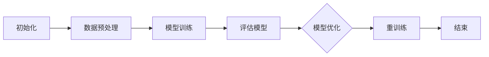

                 


### 让我们一步步深入探讨LLM应用中的资源利用效率问题

#### 问题背景

随着人工智能技术的飞速发展，大型语言模型（LLM）如BERT、GPT等，在自然语言处理（NLP）领域取得了令人瞩目的成果。然而，这些模型在资源利用效率方面面临着诸多挑战。首先，LLM的训练和推理过程需要大量的计算资源和存储空间，这使得在资源有限的环境中部署和优化这些模型变得尤为困难。其次，现有的优化方法，如模型压缩、分布式训练和动态资源调度等，虽然在某些方面取得了一定的效果，但整体上仍存在瓶颈和局限性。

#### 问题描述

LLM应用中的资源利用效率问题主要表现在以下几个方面：

1. **计算资源消耗**：LLM模型通常需要大量的GPU或TPU进行训练和推理，这使得计算资源成为瓶颈。

2. **存储空间需求**：模型参数量庞大，导致存储空间需求急剧增加，尤其是在部署模型时。

3. **训练时间延长**：分布式训练虽然可以加速训练过程，但在数据传输和同步方面仍存在延迟。

4. **动态资源管理**：在实时应用中，如何动态调整资源分配，以最大化资源利用效率，仍是一个挑战。

#### 问题解决

为了提升LLM应用的资源利用效率，我们需要从以下几个方面入手：

1. **模型压缩**：通过量化、剪枝等技术减小模型大小，降低存储和计算需求。

2. **分布式训练**：利用多台机器进行模型训练，提高训练速度和资源利用效率。

3. **动态资源调度**：根据应用需求实时调整资源分配，最大化资源利用率。

4. **优化算法**：设计更高效的训练和推理算法，减少计算和存储开销。

#### 边界与外延

在解决资源利用效率问题时，我们需要考虑以下边界条件：

1. **应用场景限制**：并非所有场景都适合采用相同的优化策略，需要根据具体应用场景进行调整。

2. **研究范围**：本文主要关注LLM应用的资源利用效率问题，不包括其他类型机器学习模型的优化。

#### 核心概念与联系

为了更好地理解资源利用效率问题，我们需要明确以下核心概念：

1. **大型语言模型（LLM）**：参数量庞大，计算复杂度高，是资源利用效率问题的核心对象。

2. **资源利用效率**：系统性能与资源消耗的比例，是衡量资源利用效率的重要指标。

#### 概念属性特征对比表格

| 概念             | 属性特征                                  |
|------------------|-----------------------------------------|
| 大型语言模型     | 参数量庞大，计算复杂度高               |
| 资源利用效率     | 系统性能与资源消耗的比例               |

#### ER实体关系图架构

```mermaid
erDiagram
  Model : 大型语言模型
  Resource : 资源
  Model -> Resource : 利用
```

#### 算法原理讲解

##### 算法mermaid流程图



##### Python源代码阐述

```python
# 伪代码：资源利用效率优化算法
def optimize_resource_utilization(model, data):
    # 数据预处理
    preprocessed_data = preprocess_data(data)
    
    # 模型训练
    model.train(preprocessed_data)
    
    # 评估模型
    evaluation_results = model.evaluate(preprocessed_data)
    
    # 模型优化
    model.optimize(evaluation_results)
    
    # 重训练
    model.retrain(preprocessed_data)
    
    return model
```

##### 算法原理与公式

$$
\text{资源利用效率} = \frac{\text{模型性能}}{\text{资源消耗}}
$$

##### 举例说明

假设模型在1000个CPU小时训练后，达到90%的准确率，资源消耗为5000GPU小时。则：

$$
\text{资源利用效率} = \frac{0.9 \times 1000}{5000} = 0.18
$$

### 总结

本文从问题背景、问题描述、问题解决和边界条件等多个方面，对LLM应用中的资源利用效率问题进行了深入探讨。通过模型压缩、分布式训练、动态资源调度和优化算法等技术手段，可以有效提升LLM应用的资源利用效率。接下来，我们将进一步详细分析每种策略的实现方法和实际应用效果。让我们一起继续探索这一领域。🔍

