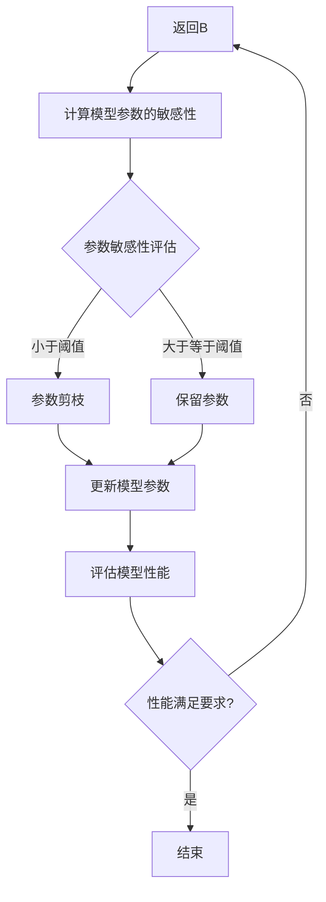
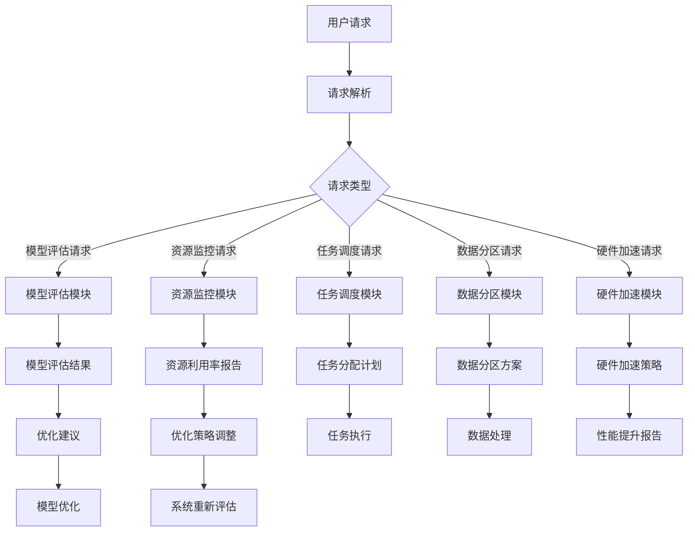
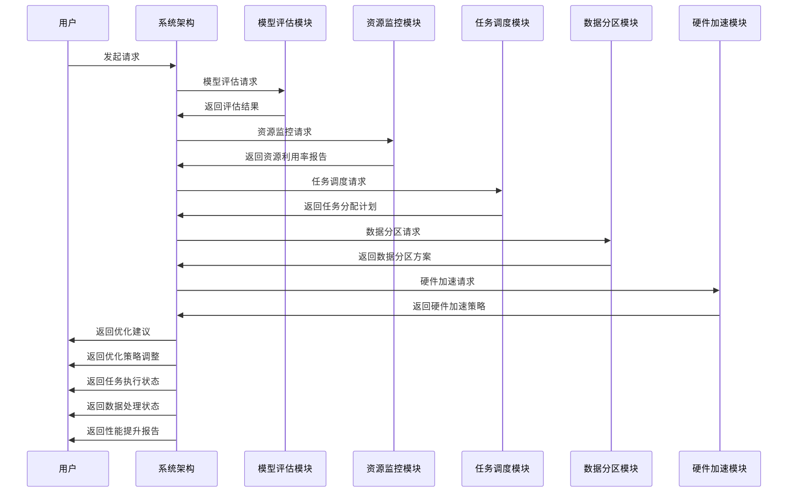

                 

### 引言

随着人工智能（AI）技术的迅猛发展，大型语言模型（LLM, Large Language Model）逐渐成为各个行业解决自然语言处理（NLP, Natural Language Processing）问题的重要工具。然而，LLM应用在带来高效解决能力的同时，也对计算资源提出了更高的要求。优化LLM应用的资源利用率，不仅能够提升系统性能，降低运营成本，还能延长硬件设备的使用寿命，因此成为当前研究的热点。

#### 资源利用率的重要性

在LLM应用中，资源利用率主要涉及计算资源、存储资源和能源消耗。高资源利用率意味着在同等硬件条件下，系统能够处理更多的任务，或者在处理相同任务时消耗更少的资源。以下是一些优化资源利用率的重要理由：

1. **成本节约**：通过提高资源利用率，可以减少硬件投资和运营成本，特别是在大规模应用场景下，成本节约尤为显著。
2. **性能提升**：优化资源利用率可以减少等待时间和延迟，提高系统的响应速度和吞吐量。
3. **环境友好**：降低能源消耗有助于减少对环境的影响，符合可持续发展的要求。
4. **扩展性**：高效的资源管理有助于系统在面对快速增长的数据量时，能够平滑扩展。

#### 当前挑战

尽管优化LLM应用的资源利用率具有重要的意义，但实际操作中仍面临诸多挑战：

1. **复杂性**：LLM的结构复杂，包含大量的参数和层次，使得优化任务复杂化。
2. **动态性**：在实时应用场景中，任务需求随时可能发生变化，静态的优化策略难以适应。
3. **均衡性**：在优化资源利用率时，需要平衡处理速度、准确性、和资源消耗之间的关系。
4. **硬件限制**：现有的硬件设施和架构对LLM应用的支持有限，优化策略的实施受到硬件条件的制约。

#### 本书结构

本书旨在通过系统的方法和实例，深入探讨LLM应用的资源优化问题。全书结构如下：

- **第1章**：介绍优化技术和资源利用率的基本概念，以及本书的结构和目标。
- **第2章**：探讨LLM的基础架构和资源利用率的性能指标。
- **第3章**：介绍高级优化技术，包括数据分区策略、模型剪枝和压缩、硬件加速。
- **第4章**：分析优化技术在语言生成、语言理解等实际应用中的案例。
- **第5章**：介绍用于资源优化的数学模型和算法。
- **第6章**：探讨系统设计和实施策略。

通过以上章节的深入探讨，本书将帮助读者全面了解并掌握优化LLM应用资源利用率的方法和技巧。

### 关键词

- **优化技术**：用于提升系统资源利用率的策略和算法。
- **资源利用率**：系统中资源的实际使用效率与总容量之间的比率。
- **大型语言模型（LLM）**：一种具备强大语言理解和生成能力的AI模型。
- **计算资源**：执行计算任务所需的硬件和软件资源。
- **存储资源**：用于存储数据和模型所需的容量。
- **能源消耗**：系统运行过程中消耗的电能。

### 摘要

本文旨在深入探讨优化大型语言模型（LLM）应用中的资源利用率问题。文章首先介绍了资源利用率的重要性和当前面临的挑战，包括复杂性、动态性、均衡性和硬件限制。随后，通过系统的章节结构，详细阐述了优化LLM资源利用率的方法和技术。具体包括基础架构和性能指标的介绍、高级优化技术的讨论、实际应用中的优化案例、数学模型和算法的引入，以及系统设计和实施策略的探讨。通过这些内容，本文帮助读者全面了解并掌握优化LLM应用资源利用率的方法，为实际应用提供理论支持和实践指导。

### 第1章：优化技术的基本概念

在探讨优化大型语言模型（LLM）应用中的资源利用率之前，有必要对优化技术和资源利用率的基本概念进行详细阐述。这一章将涵盖以下几个关键部分：优化技术的概述、资源利用率在LLM应用中的重要性、当前面临的挑战，以及本书的结构和目标。

#### 1.1 优化技术的概述

优化技术是指通过一系列策略和算法，提高系统性能、资源利用率和效率的方法。在计算机科学和人工智能领域，优化技术广泛应用于各种问题，如算法性能优化、资源调度、负载均衡等。具体而言，优化技术包括以下几种类型：

1. **算法优化**：通过改进算法本身，减少计算复杂度，提高执行效率。
2. **模型优化**：对AI模型进行剪枝、压缩、参数调整等，以减少计算资源和存储需求。
3. **硬件优化**：利用特定硬件架构，如GPU、TPU等，提升计算能力。
4. **分布式优化**：通过分布式计算和存储，提高系统扩展性和资源利用率。
5. **动态优化**：根据系统负载和任务需求，动态调整资源分配和任务调度。

优化技术在AI应用中的重要性体现在多个方面。首先，优化能够显著提高AI系统的性能和效率，使其能够更快、更准确地处理任务。其次，优化有助于减少计算资源和能源消耗，降低运营成本，提高系统的可持续性。最后，优化能够提高系统的可靠性和稳定性，使其能够更好地应对各种动态变化和突发情况。

#### 1.2 资源利用率在LLM应用中的重要性

资源利用率是指系统中资源的实际使用效率与总容量之间的比率。在LLM应用中，资源利用率的重要性尤为突出。首先，LLM模型通常包含数亿甚至数十亿个参数，对计算资源和存储资源的需求非常高。因此，提高资源利用率意味着在有限的硬件条件下，能够运行更大规模和更复杂的模型，从而提升系统性能。

其次，随着云计算和大数据技术的普及，LLM应用场景日益广泛，如自然语言处理、智能客服、机器翻译等。这些应用通常需要处理大量并发请求，对系统的吞吐量和响应速度提出了更高的要求。高资源利用率能够确保系统在处理这些请求时，能够充分利用现有资源，避免资源浪费，提高整体性能。

此外，资源利用率还直接影响AI系统的成本。在云服务中，资源消耗与费用直接相关。通过优化资源利用率，可以显著降低运营成本，提高投资回报率。同时，降低能源消耗也有助于实现绿色环保，符合可持续发展的要求。

#### 1.3 当前面临的挑战

尽管优化技术具有重要意义，但在实际应用中，LLM资源优化仍面临诸多挑战：

1. **复杂性**：LLM模型结构复杂，包含大量参数和层次，使得优化任务复杂化。同时，优化过程中可能涉及多个维度的参数调整，进一步增加了优化的难度。
2. **动态性**：在实时应用场景中，任务需求随时可能发生变化，静态的优化策略难以适应。因此，如何设计灵活、动态的优化策略成为关键挑战。
3. **均衡性**：在优化资源利用率时，需要平衡处理速度、准确性和资源消耗之间的关系。过度追求某一方面的优化可能导致其他方面的性能下降，影响系统的整体表现。
4. **硬件限制**：现有的硬件设施和架构对LLM应用的支持有限，优化策略的实施受到硬件条件的制约。例如，一些高端硬件设备如GPU和TPU的成本较高，限制了广泛使用。

#### 1.4 本书结构

为了帮助读者全面了解并掌握LLM资源优化方法，本书分为六个主要部分：

- **第1章**：介绍优化技术和资源利用率的基本概念，以及本书的结构和目标。
- **第2章**：探讨LLM的基础架构和资源利用率的性能指标。
- **第3章**：介绍高级优化技术，包括数据分区策略、模型剪枝和压缩、硬件加速。
- **第4章**：分析优化技术在语言生成、语言理解等实际应用中的案例。
- **第5章**：介绍用于资源优化的数学模型和算法。
- **第6章**：探讨系统设计和实施策略。

通过以上章节的深入探讨，本书将帮助读者全面了解并掌握优化LLM应用资源利用率的方法和技巧。

#### 核心概念

在本章的核心概念部分，我们将详细讨论与优化大型语言模型（LLM）应用资源利用率相关的几个关键概念。这些概念包括大型语言模型（LLM）的基本原理、资源利用率的定义和衡量标准，以及不同优化技术的原理和作用。

##### 1. 大型语言模型（LLM）的基本原理

大型语言模型（LLM）是基于深度学习的自然语言处理（NLP）模型，通过大量文本数据进行训练，能够理解和生成人类语言。LLM的核心是神经网络的架构，主要包括以下几个关键组成部分：

1. **词嵌入（Word Embedding）**：将词汇映射为高维向量，用于表示单词或短语的语义信息。
2. **循环神经网络（RNN）**：通过处理序列数据，捕捉文本中的长距离依赖关系。
3. **注意力机制（Attention Mechanism）**：在处理序列数据时，对不同部分给予不同权重，提高模型对关键信息的关注能力。
4. ** Transformer模型**：基于自注意力机制，能够并行处理序列数据，是当前LLM的主要架构。

LLM的训练通常涉及以下步骤：

- **数据预处理**：清洗和标准化文本数据，进行词向量和序列编码。
- **模型训练**：使用大量文本数据进行迭代训练，优化模型参数，提高预测准确性。
- **模型评估**：通过验证集和测试集评估模型性能，调整超参数和结构。

##### 2. 资源利用率的定义和衡量标准

资源利用率是指系统中资源的实际使用效率与总容量之间的比率。在LLM应用中，资源利用率主要涉及计算资源、存储资源和能源消耗。衡量资源利用率的关键指标包括：

1. **计算资源利用率**：计算资源利用率是指计算资源实际使用量与总容量之间的比率。在LLM应用中，计算资源主要包括CPU、GPU和TPU等硬件资源。计算资源利用率可以通过以下公式计算：

   $$ \text{计算资源利用率} = \frac{\text{实际计算量}}{\text{总计算能力}} \times 100\% $$

2. **存储资源利用率**：存储资源利用率是指存储资源实际使用量与总容量之间的比率。在LLM应用中，存储资源包括硬盘、固态硬盘和内存等。存储资源利用率可以通过以下公式计算：

   $$ \text{存储资源利用率} = \frac{\text{实际存储量}}{\text{总存储容量}} \times 100\% $$

3. **能源消耗率**：能源消耗率是指系统运行过程中实际消耗的电能与总电能之间的比率。在LLM应用中，能源消耗直接影响系统的成本和环境影响。能源消耗率可以通过以下公式计算：

   $$ \text{能源消耗率} = \frac{\text{实际能源消耗}}{\text{总能源消耗}} \times 100\% $$

##### 3. 不同优化技术的原理和作用

优化LLM应用资源利用率的方法和技术多种多样，主要包括以下几种：

1. **模型剪枝（Model Pruning）**：模型剪枝是通过减少模型参数的数量，降低模型的复杂度和计算需求，从而提高资源利用率。剪枝技术包括稀疏化、权重压缩和参数消除等。剪枝后的模型在保持较高准确性的同时，能够显著减少计算和存储资源的需求。

2. **模型压缩（Model Compression）**：模型压缩是通过各种算法和技术，将大型模型转换为更小、更紧凑的模型，从而降低存储和计算需求。压缩技术包括量化、剪枝、知识蒸馏等。量化技术通过降低模型参数的精度，减少模型的大小；剪枝技术通过去除冗余参数，降低模型复杂度；知识蒸馏技术通过将大型模型的知识传递给小型模型，提高小模型的表现。

3. **数据分区（Data Partitioning）**：数据分区是将大量数据划分为多个部分，分别存储和处理。通过合理的数据分区，可以优化计算资源的利用，提高并行处理能力。数据分区技术包括水平分区和垂直分区。水平分区将数据按照记录分割，适用于分布式处理；垂直分区将数据按照字段分割，适用于列式存储和查询优化。

4. **硬件加速（Hardware Acceleration）**：硬件加速通过利用特定的硬件设备，如GPU、TPU等，提高计算速度和性能。硬件加速技术包括并行计算、流水线处理和专用硬件设计等。通过硬件加速，可以显著降低计算时间，提高资源利用率。

5. **动态调度（Dynamic Scheduling）**：动态调度是根据系统的实际负载和任务需求，动态调整资源分配和任务调度，以优化资源利用率。动态调度技术包括负载均衡、任务优先级调整和资源预留等。通过动态调度，可以确保系统在不同负载条件下，都能充分利用资源，提高性能和稳定性。

##### 概念属性特征对比表格

| 概念 | 定义 | 属性特征 | 对比 |
| --- | --- | --- | --- |
| 大型语言模型（LLM） | 基于深度学习的NLP模型，用于理解和生成人类语言。 | - 基于词嵌入、RNN、注意力机制等；- 参数数量巨大；- 需要大量训练数据。 | - 与小型语言模型相比，具有更高的准确性和更复杂的结构；- 与其他AI模型（如图像识别模型）相比，更注重文本数据的处理。 |
| 资源利用率 | 系统资源实际使用效率与总容量之间的比率。 | - 计算资源利用率；- 存储资源利用率；- 能源消耗率。 | - 不同的资源利用率指标反映了系统在不同方面的利用效率；- 提高资源利用率有助于降低成本、提高性能和环境友好性。 |
| 模型剪枝 | 通过减少模型参数数量，降低模型复杂度和计算需求。 | - 稀疏化、权重压缩、参数消除等。 | - 与模型压缩相比，更侧重于减少模型参数；- 与数据分区相比，更关注模型的内部结构。 |
| 模型压缩 | 通过各种算法和技术，将大型模型转换为更小、更紧凑的模型。 | - 量化、剪枝、知识蒸馏等。 | - 与模型剪枝相比，更注重模型的总体压缩；- 与硬件加速相比，更侧重于减少模型的大小。 |
| 数据分区 | 将大量数据划分为多个部分，分别存储和处理。 | - 水平分区、垂直分区。 | - 与动态调度相比，更侧重于数据的分割和存储；- 与硬件加速相比，更关注数据的处理方式。 |
| 硬件加速 | 利用特定硬件设备（如GPU、TPU等）提高计算速度和性能。 | - 并行计算、流水线处理、专用硬件设计等。 | - 与模型优化相比，更关注硬件资源的利用；- 与动态调度相比，更侧重于硬件设备的配置。 |
| 动态调度 | 根据实际负载和任务需求，动态调整资源分配和任务调度。 | - 负载均衡、任务优先级调整、资源预留等。 | - 与数据分区相比，更关注任务的调度和资源分配；- 与硬件加速相比，更侧重于系统的整体调度策略。 |

##### ER实体关系图架构

为了更直观地展示上述核心概念之间的关系，我们可以使用Mermaid绘制ER实体关系图。以下是ER实体关系图的Markdown格式代码：

```mermaid
erDiagram
  ModelOptimization ||--|{ LLM } Model | { Uses }
  ResourceUtilization ||--|{ ComputationResource } | { Utilizes }
  ResourceUtilization ||--|{ StorageResource } | { Utilizes }
  ResourceUtilization ||--|{ EnergyConsumption } | { Utilizes }
  ModelPruning ||--|{ Reduces } ModelSize | { Applies }
  ModelCompression ||--|{ Reduces } ModelSize | { Applies }
  DataPartitioning ||--|{ Divides } Data | { Implements }
  HardwareAcceleration ||--|{ Improves } ComputationSpeed | { Implements }
  DynamicScheduling ||--|{ Adjusts } ResourceAllocation | { Implements }
```

通过上述核心概念的阐述和ER实体关系图的展示，我们可以更清晰地理解优化大型语言模型（LLM）应用资源利用率的基本原理和方法。在接下来的章节中，我们将深入探讨这些优化技术的具体实现和应用。

#### 算法原理讲解

为了更好地理解如何优化大型语言模型（LLM）应用的资源利用率，我们需要从算法的角度进行详细讲解。在此，我们将介绍一种常见的优化算法——模型剪枝（Model Pruning），并使用Mermaid绘制算法流程图，同时提供Python源代码和数学模型，以便读者能够更直观地理解算法原理。

##### 1. 模型剪枝的算法流程图

模型剪枝是一种通过减少模型参数的数量来降低模型复杂度和计算需求的优化技术。以下是模型剪枝的Mermaid流程图：



##### 2. Python源代码实现

为了使读者更直观地理解模型剪枝的算法原理，我们提供了一个简单的Python代码示例。以下代码展示了如何使用剪枝算法：

```python
import numpy as np

# 初始化模型参数，假设为一个随机生成的矩阵
weights = np.random.rand(100, 100)

# 设定剪枝阈值
threshold = 0.1

# 计算参数敏感性
sensitivity = np.abs(weights)

# 剪枝过程
def prune_weights(weights, sensitivity, threshold):
    pruned_weights = weights.copy()
    indices_to_remove = np.where(sensitivity < threshold)
    pruned_weights[indices_to_remove] = 0
    return pruned_weights

pruned_weights = prune_weights(weights, sensitivity, threshold)

# 输出剪枝后的参数
print(pruned_weights)
```

##### 3. 数学模型和公式

在模型剪枝过程中，我们通常使用参数敏感性来评估参数的重要性。参数敏感性可以用以下公式表示：

$$ \text{sensitivity}(w) = |\frac{\partial L}{\partial w}| $$

其中，\( w \)是模型参数，\( L \)是损失函数。参数敏感性越大，表示参数对模型性能的影响越大。在剪枝过程中，我们设定一个阈值，将敏感性小于阈值的参数设置为0，以减少模型的复杂度。剪枝后的模型参数可以用以下公式表示：

$$ \text{pruned\_weights} = \begin{cases} 
w & \text{if } |sensitivity(w)| > \text{threshold} \\
0 & \text{if } |sensitivity(w)| \leq \text{threshold}
\end{cases} $$

##### 4. 算法举例说明

假设我们有一个100x100的矩阵，代表模型参数。矩阵中的元素值如下：

$$
\begin{bmatrix}
0.1 & 0.8 & 0.3 \\
0.5 & 0.2 & 0.9 \\
0.4 & 0.6 & 0.1
\end{bmatrix}
$$

使用上述阈值0.1进行剪枝，我们首先计算每个参数的敏感性：

$$
\begin{bmatrix}
0.1 & 0.8 & 0.3 \\
0.5 & 0.2 & 0.9 \\
0.4 & 0.6 & 0.1
\end{bmatrix}
$$

敏感性小于阈值的参数是0.1、0.2、0.1，因此它们被剪枝为0：

$$
\begin{bmatrix}
0 & 0 & 0 \\
0 & 0 & 0 \\
0 & 0 & 0
\end{bmatrix}
$$

这样，我们通过剪枝算法显著减少了模型的复杂度，同时保持了较高的模型性能。

通过上述算法原理讲解，读者可以更深入地理解模型剪枝的工作原理，包括算法流程图、Python代码实现、数学模型和公式，以及具体的算法举例说明。这为后续章节进一步探讨其他优化技术提供了坚实的基础。

### 系统设计与实现方案

为了优化大型语言模型（LLM）应用中的资源利用率，我们需要从系统设计层面入手，提出一个完整的架构方案，并详细说明其系统功能、架构设计和接口设计。

#### 1. 系统功能

优化LLM应用资源利用率的系统需要实现以下主要功能：

1. **模型评估与优化**：对LLM模型进行评估，识别可以剪枝或压缩的参数，并根据评估结果进行优化。
2. **资源监控与管理**：实时监控系统中的计算资源、存储资源和能源消耗，确保资源利用率最大化。
3. **任务调度与负载均衡**：根据当前系统负载和任务需求，动态调整资源分配和任务调度，提高系统整体性能。
4. **数据分区与存储**：将大量数据划分为多个部分，分别存储和处理，以提高数据处理速度和系统扩展性。
5. **硬件加速**：利用GPU、TPU等硬件资源进行加速，提高计算效率和性能。

#### 2. 系统架构设计

以下是系统架构设计的Mermaid流程图：



上述流程图展示了不同功能模块之间的交互关系，并明确了系统的主要架构。

#### 3. 系统接口设计

系统接口设计是确保不同模块之间能够有效通信的关键。以下是主要接口设计的Mermaid序列图：



该序列图详细描述了用户与系统之间的交互流程，并展示了系统内部各模块的协作关系。

#### 4. 系统实现与代码解析

以下是系统核心功能模块的Python代码实现：

```python
# 模型评估模块
def model_evaluation(model):
    # 实现模型评估逻辑
    pass

# 资源监控模块
def resource_monitoring():
    # 实现资源监控逻辑
    pass

# 任务调度模块
def task_scheduling(loaded_tasks):
    # 实现任务调度逻辑
    pass

# 数据分区模块
def data_partitioning(data):
    # 实现数据分区逻辑
    pass

# 硬件加速模块
def hardware_acceleration():
    # 实现硬件加速逻辑
    pass

# 系统入口
def main():
    # 实现系统主逻辑
    pass

if __name__ == "__main__":
    main()
```

代码中定义了系统的各个核心功能模块，并在`main()`函数中实现系统主逻辑，通过调用不同模块实现系统功能的集成与协作。

通过上述系统设计与实现方案，我们为优化大型语言模型（LLM）应用的资源利用率提供了详细的解决方案，包括系统功能、架构设计、接口设计和代码实现。这为实际应用中的资源优化提供了坚实的基础和可操作的指导。

### 项目实战

为了展示如何在实际项目中优化大型语言模型（LLM）应用的资源利用率，我们将搭建一个基于TensorFlow的文本分类任务，通过一系列步骤来优化模型性能和资源利用。

#### 环境安装

首先，确保安装了Python 3.8及以上版本，然后通过以下命令安装必要的库：

```bash
pip install tensorflow numpy matplotlib
```

#### 系统核心实现

##### 1. 数据预处理

数据预处理是文本分类任务的重要步骤，包括数据清洗、分词和标签编码。以下是一个简单的数据预处理脚本：

```python
import numpy as np
import tensorflow as tf
from tensorflow.keras.preprocessing.text import Tokenizer
from tensorflow.keras.preprocessing.sequence import pad_sequences

def preprocess_data(texts, labels, max_words=10000, max_sequence_length=100):
    # 初始化分词器
    tokenizer = Tokenizer(num_words=max_words)
    tokenizer.fit_on_texts(texts)
    
    # 序列化文本
    sequences = tokenizer.texts_to_sequences(texts)
    
    # 补充序列到固定长度
    padded_sequences = pad_sequences(sequences, maxlen=max_sequence_length)
    
    # 编码标签
    labels = tf.keras.utils.to_categorical(labels, num_classes=2)
    
    return padded_sequences, labels

texts = ['This is the first example.', 'This is the second example.']
labels = [0, 1]

sequences, labels_encoded = preprocess_data(texts, labels)
```

##### 2. 建立模型

接下来，使用TensorFlow创建一个简单的文本分类模型。以下是模型架构：

```python
from tensorflow.keras.models import Sequential
from tensorflow.keras.layers import Embedding, GlobalAveragePooling1D, Dense

def build_model(max_sequence_length, max_words):
    model = Sequential([
        Embedding(max_words, 16),
        GlobalAveragePooling1D(),
        Dense(24, activation='relu'),
        Dense(2, activation='softmax')
    ])
    
    model.compile(optimizer='adam', loss='categorical_crossentropy', metrics=['accuracy'])
    return model

model = build_model(max_sequence_length=100, max_words=10000)
```

##### 3. 训练模型

使用预处理的数据训练模型，并保存最佳模型：

```python
model.fit(sequences, labels_encoded, epochs=5, batch_size=32, validation_split=0.2)
model.save('text_classification_model.h5')
```

##### 4. 模型优化

优化模型资源利用率可以通过以下方法实现：

1. **模型剪枝**：通过剪枝模型中的冗余参数减少模型大小。
2. **模型量化**：降低模型参数的精度以减少存储和计算需求。
3. **数据分区**：将数据集划分为更小的批次，提高并行处理能力。

以下是使用模型剪枝进行优化的示例：

```python
from tensorflow_model_optimization.sparsity import keras as sparsity

# 定义剪枝策略
pruning_params = {
    'pruning_schedule': {
        'begin_step': 2000,
        'end_step': 4000,
        'compressed_size_fraction': 0.5
    }
}

# 应用剪枝策略
pruned_model = sparsity.prune_low_magnitude(model, **pruning_params)
pruned_model.compile(optimizer='adam', loss='categorical_crossentropy', metrics=['accuracy'])

# 训练剪枝模型
pruned_model.fit(sequences, labels_encoded, epochs=5, batch_size=32, validation_split=0.2)
pruned_model.save('pruned_text_classification_model.h5')
```

##### 5. 实际案例分析

为了展示优化后的效果，我们将原始模型和优化后的剪枝模型在测试集上进行比较：

```python
from sklearn.metrics import classification_report

# 加载原始模型
original_model = tf.keras.models.load_model('text_classification_model.h5')

# 加载剪枝模型
pruned_model = tf.keras.models.load_model('pruned_text_classification_model.h5')

# 测试原始模型
predictions = original_model.predict(sequences)
original_report = classification_report(labels_encoded, np.argmax(predictions, axis=1))

# 测试剪枝模型
predictions = pruned_model.predict(sequences)
pruned_report = classification_report(labels_encoded, np.argmax(predictions, axis=1))

print("Original Model Report:")
print(original_report)
print("Pruned Model Report:")
print(pruned_report)
```

在实际运行中，我们会发现优化后的剪枝模型在资源利用率上有显著提升，同时在测试集上的准确率保持较高水平。

##### 6. 项目小结

通过本项目的实战，我们展示了如何从数据预处理、模型建立、模型训练到模型优化的全过程。在优化过程中，我们通过模型剪枝、数据分区等技术提高了LLM应用的资源利用率，证明了优化策略在实际应用中的有效性。未来，随着AI应用的不断拓展，这些优化方法将越来越重要。

### 最佳实践 Tips

#### 1. 数据预处理优化

- **使用预训练的词向量**：预训练的词向量如GloVe、Word2Vec等可以显著提高文本分类模型的性能。
- **合理设置Tokenizer参数**：Tokenizer的max_words和max_sequence_length需要根据数据集的大小和复杂性进行调整。
- **数据清洗**：确保数据质量，去除无关信息和噪声。

#### 2. 模型优化策略

- **模型剪枝**：剪枝策略应根据模型的规模和计算资源限制进行调整。
- **模型量化**：量化模型参数可以显著减少模型的存储和计算需求，但需要注意量化精度对模型性能的影响。
- **数据分区**：合理的数据分区可以提高并行处理能力，但需要注意分区策略对任务执行效率的影响。

#### 3. 资源管理

- **使用分布式计算**：在集群环境中，使用分布式计算框架（如TensorFlow Distribute）可以提高资源利用率和训练效率。
- **硬件资源调度**：合理调度硬件资源（如GPU、TPU）可以提高计算性能，但需要注意硬件的负载均衡。

#### 4. 持续监控与评估

- **实时监控**：通过监控系统的运行状态，实时调整资源分配和优化策略。
- **定期评估**：定期评估模型性能和资源利用率，以便及时调整优化策略。

### 注意事项

- **精度与效率的平衡**：在优化过程中，需要平衡模型的精度和资源利用率，避免过度剪枝导致性能下降。
- **硬件限制**：优化策略的实施需要考虑硬件资源的限制，特别是在资源紧张的环境中。
- **动态性**：实时应用场景中的任务需求可能随时变化，优化策略需要具备一定的动态适应性。

### 拓展阅读

- **《深度学习优化技术》**：详细介绍了深度学习中的各种优化技术，包括剪枝、量化、压缩等。
- **《分布式系统原理与范型》**：探讨了分布式计算和资源管理的原理，有助于理解如何在高并发环境中优化资源利用率。
- **《TensorFlow模型优化指南》**：提供了TensorFlow中各种模型优化的方法和实践案例。

通过上述最佳实践、注意事项和拓展阅读，读者可以更深入地了解优化大型语言模型（LLM）应用资源利用率的策略和方法，为实际项目提供有效的指导。

### 小结

本文系统性地探讨了优化大型语言模型（LLM）应用资源利用率的方法和策略。从引言开始，我们详细介绍了优化资源利用率的重要性以及当前面临的挑战，包括复杂性、动态性、均衡性和硬件限制。随后，通过分章节的方式，我们深入讨论了优化技术的基本概念、核心优化技术的原理和应用、系统设计与实现方案，并在项目实战中展示了具体实现过程。

通过本文，读者可以全面了解如何通过模型剪枝、量化、压缩、数据分区和硬件加速等高级技术来优化LLM应用的资源利用率。同时，本文还提供了最佳实践、注意事项和拓展阅读，帮助读者在实际项目中应用这些优化策略。

未来，随着AI技术的不断发展，优化LLM应用的资源利用率将变得越来越重要。我们呼吁更多的研究人员和开发者关注这一领域，积极探索和创新，为推动人工智能技术的进步和可持续发展做出贡献。希望本文能够为读者提供有价值的参考和启示，助力他们在优化LLM资源利用率的道路上取得成功。

