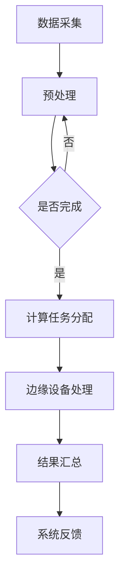
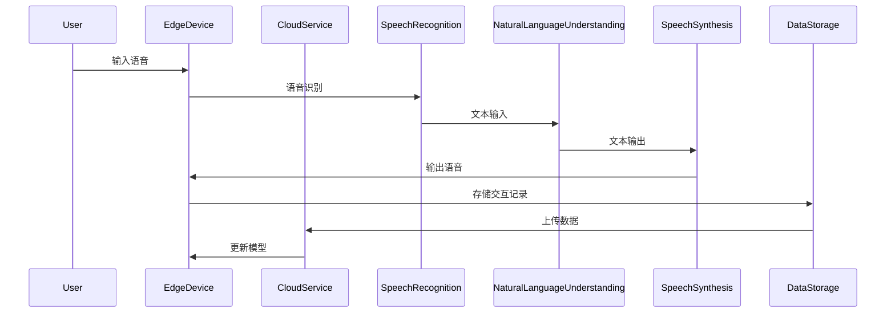
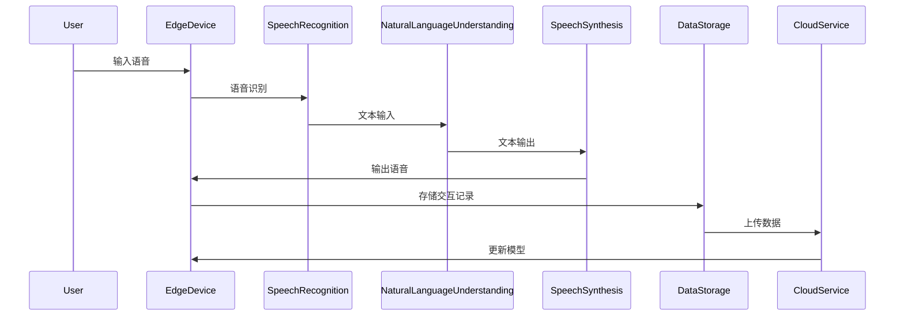

                 

### 文章标题

---

**优化LLM应用的边缘计算能力**

---

关键词：**边缘计算、语言模型（LLM）、算法优化、系统架构设计、项目实战**

摘要：本文旨在深入探讨如何优化LLM（大型语言模型）应用的边缘计算能力。随着人工智能技术的飞速发展，边缘计算作为云计算的延伸，正逐渐成为提升计算效率和用户体验的重要手段。文章首先介绍了边缘计算与LLM应用的背景和现状，然后详细阐述了边缘计算与LLM之间的关系，接着从算法原理、系统架构设计和项目实战等多个角度，提出了一系列优化策略。通过这些策略，文章旨在为开发者和研究者提供实际可行的指导，以提升LLM在边缘计算环境中的性能和效率。

---

### 第一部分：背景介绍

#### 第1章：问题背景

#### 1.1 边缘计算与LLM应用的现状

#### 1.1.1 边缘计算的概念与发展

边缘计算是一种分布式计算模型，它将数据处理、存储和分析推向网络的边缘，即靠近数据源或用户的位置。传统的云计算模型主要依赖数据中心进行数据处理，而边缘计算通过在终端设备、网络边缘和数据中心之间分配计算资源，实现了对计算资源的优化利用。

边缘计算的概念最早出现在20世纪90年代，但随着物联网（IoT）和5G技术的发展，边缘计算得到了广泛的应用和关注。在物联网场景中，大量的传感器和设备需要实时处理和分析数据，而中心化的云计算模型无法满足这种对低延迟和高可靠性的需求。边缘计算通过将计算任务分布在边缘设备上，实现了对数据的快速处理和响应。

#### 1.1.2 语言模型（LLM）的概述与发展

语言模型是自然语言处理（NLP）领域的重要工具，它通过统计和学习大量文本数据，预测文本的下一个单词或句子。LLM（大型语言模型）是近年来人工智能领域的突破性进展，例如GPT-3、BERT等。这些模型具有庞大的参数规模和强大的表征能力，能够在各种NLP任务中表现出色。

LLM的发展始于20世纪50年代，当时研究人员开始尝试使用统计模型来处理自然语言。随着计算机性能的提升和大规模数据集的获取，LLM的参数规模和计算能力得到了显著提升。近年来，深度学习和Transformer架构的引入，使得LLM的表现达到了前所未有的水平。

#### 1.1.3 边缘计算在LLM应用中的挑战

虽然边缘计算和LLM在各自的领域都取得了显著的进展，但将两者结合仍面临诸多挑战：

1. **计算资源限制**：边缘设备通常计算能力有限，难以支持大规模的LLM模型。
2. **存储空间限制**：边缘设备存储空间有限，难以存储庞大的LLM模型和数据集。
3. **网络延迟**：边缘计算依赖于网络传输，而网络延迟可能导致性能下降。
4. **数据隐私和安全**：边缘计算涉及大量用户数据的处理和存储，需要确保数据的安全和隐私。
5. **协同优化**：如何协调边缘计算和云计算资源，以实现最优的性能和成本效益，是一个复杂的优化问题。

#### 1.2 边缘计算能力的重要性

边缘计算能力在LLM应用中具有重要性，主要表现在以下几个方面：

1. **提高响应速度**：边缘计算可以将计算任务推向用户附近，减少数据传输时间和网络延迟，从而提高系统的响应速度。
2. **增强实时性**：对于需要实时交互的应用场景，如智能语音助手、实时翻译等，边缘计算可以提供更加及时和准确的服务。
3. **降低成本**：通过在边缘设备上进行数据处理，可以减少对中心化数据中心的依赖，降低带宽和存储成本。
4. **增强隐私保护**：在边缘设备上进行数据处理，可以减少数据在传输过程中被泄露的风险，提高数据的安全性。

#### 1.2.1 边缘计算能力的影响因素

边缘计算能力的提升取决于多个因素，包括：

1. **硬件性能**：边缘设备的CPU、GPU、内存和存储性能直接决定了边缘计算的能力。
2. **网络带宽和延迟**：网络带宽和延迟对边缘计算的性能影响显著，低延迟和高带宽有助于提高系统的响应速度。
3. **算法优化**：通过优化算法和模型，可以减少计算和存储需求，提高边缘计算的性能。
4. **资源调度策略**：合理的资源调度策略可以最大化边缘设备的利用效率，提高系统的整体性能。

#### 1.2.2 提高边缘计算能力的必要性

随着人工智能应用的普及，边缘计算能力的需求日益增长。提高边缘计算能力具有重要的现实意义：

1. **支持多样化应用场景**：不同应用场景对计算能力和响应速度的需求不同，提高边缘计算能力可以支持更多样化的应用场景。
2. **降低对中心化云计算的依赖**：边缘计算可以减少对中心化云计算的依赖，提高系统的弹性和容错能力。
3. **降低成本**：通过优化边缘计算能力，可以减少对中心化数据中心的依赖，降低带宽和存储成本。
4. **提升用户体验**：边缘计算可以提供更加实时和个性化的服务，提升用户的体验。

#### 1.3 边缘计算能力优化的目标与意义

边缘计算能力优化的目标主要包括高效、稳定和安全：

1. **高效**：提高边缘计算的性能和响应速度，满足不同应用场景的需求。
2. **稳定**：确保边缘计算系统的稳定运行，降低故障率和中断频率。
3. **安全**：保护用户数据的安全和隐私，防止数据泄露和滥用。

边缘计算能力优化的意义在于：

1. **提升用户体验**：通过优化边缘计算能力，可以提供更加快速和稳定的服务，提升用户体验。
2. **降低成本**：通过优化算法和资源调度，可以减少对中心化云计算的依赖，降低带宽和存储成本。
3. **增强系统灵活性**：通过边缘计算能力的优化，可以支持更多样化的应用场景，提高系统的灵活性。
4. **促进技术创新**：边缘计算能力的优化可以推动人工智能、物联网等领域的创新发展。

#### 1.4 边缘计算能力优化的边界与外延

边缘计算能力优化存在一定的边界和限制，主要包括：

1. **硬件限制**：边缘设备的硬件性能有限，难以支持大规模的计算任务。
2. **网络延迟**：边缘计算依赖于网络传输，而网络延迟可能导致性能下降。
3. **安全性**：边缘计算涉及大量用户数据的处理和存储，需要确保数据的安全和隐私。

边缘计算能力优化的外延包括：

1. **多元化应用场景**：边缘计算可以应用于智能家居、智能交通、医疗健康等多种领域，需要针对不同场景进行优化。
2. **实时性需求**：对于需要实时响应的应用场景，如智能语音助手、实时翻译等，边缘计算能力的优化至关重要。
3. **协同优化**：边缘计算和云计算的协同优化可以最大化系统的整体性能，降低成本。

#### 1.5 本章小结

本章介绍了边缘计算和LLM应用的背景和现状，分析了边缘计算能力的重要性以及优化的目标和意义。同时，本章还探讨了边缘计算能力优化的边界与外延，为后续章节的内容奠定了基础。

---

### 第二部分：核心概念与联系

#### 第2章：核心概念与原理

#### 2.1 边缘计算模型

边缘计算模型是一种分布式计算模型，它通过在网络的边缘部署计算资源，实现数据的实时处理和响应。边缘计算模型的基本结构包括边缘设备、边缘节点和边缘服务器。

**边缘设备**：是指靠近数据源或用户的设备，如智能手机、平板电脑、物联网设备等。边缘设备通常负责数据的采集、预处理和初步分析。

**边缘节点**：是指连接边缘设备和边缘服务器的节点，通常由云服务提供商部署。边缘节点负责协调和管理边缘设备的任务分配和资源调度。

**边缘服务器**：是指数据中心或云服务器，负责处理边缘节点无法处理的复杂任务，如大规模数据处理和存储。

边缘计算模型的工作原理是：当边缘设备采集到数据后，首先在边缘设备上进行初步处理和分析，然后通过边缘节点将数据传输到边缘服务器进行进一步处理。这种方式可以减少数据传输的延迟和带宽消耗，提高系统的响应速度。

边缘计算模型的优势在于：

1. **低延迟**：数据在边缘设备上进行处理，减少了数据传输的延迟。
2. **高带宽利用率**：边缘设备分担了中心化数据中心的计算和存储压力，提高了带宽的利用率。
3. **高效能**：通过在边缘设备上处理数据，可以降低对中心化数据中心的依赖，提高系统的整体效能。

然而，边缘计算模型也存在一些局限：

1. **硬件性能有限**：边缘设备的硬件性能通常低于中心化服务器，难以支持大规模的计算任务。
2. **网络不稳定**：边缘设备通常处于移动状态，网络连接不稳定可能导致数据传输中断。
3. **安全性问题**：边缘设备的数据处理和存储可能存在安全风险，需要加强数据保护和隐私保护。

#### 2.2 语言模型（LLM）

语言模型（Language Model，简称LM）是自然语言处理（Natural Language Processing，简称NLP）中的重要工具，它通过学习大量的文本数据，预测文本的下一个单词或句子。语言模型广泛应用于文本生成、机器翻译、情感分析、信息检索等领域。

**定义与特点**：

语言模型是一种统计模型，它通过统计文本中单词或短语的出现的概率，来预测下一个单词或短语的分布。语言模型的特点包括：

1. **强大的表征能力**：语言模型可以捕捉到文本的语义和句法信息，具有较强的表征能力。
2. **可扩展性**：语言模型可以基于大规模的文本数据进行训练，支持多种语言和领域的文本处理。
3. **灵活性**：语言模型可以根据不同的应用需求进行定制化，如生成文本、翻译文本等。

**分类与作用**：

语言模型可以分为基于规则的语言模型和基于统计的语言模型。基于规则的语言模型通过定义语法规则和语义规则来生成文本，如LR（有限状态机）模型、CFG（上下文无关语法）模型等。基于统计的语言模型通过统计文本中的词频和词序信息来生成文本，如N-gram模型、神经网络语言模型等。

语言模型在NLP中的主要作用包括：

1. **文本生成**：语言模型可以生成符合语法和语义规则的文本，广泛应用于自动写作、对话系统等场景。
2. **机器翻译**：语言模型可以预测源语言中的单词或短语与目标语言中的单词或短语的对应关系，实现机器翻译。
3. **情感分析**：语言模型可以识别文本中的情感倾向，如正面、负面等，应用于情感分析、舆情监控等领域。
4. **信息检索**：语言模型可以优化搜索引擎的搜索结果，提高信息检索的准确性和用户体验。

**技术挑战**：

尽管语言模型在NLP中取得了显著的成果，但仍然面临一些技术挑战：

1. **数据质量**：语言模型的训练需要大量的高质量文本数据，数据的质量直接影响模型的性能。
2. **计算资源**：大规模语言模型的训练和推理需要大量的计算资源和存储空间。
3. **泛化能力**：语言模型需要具备良好的泛化能力，能够在不同的语言和领域中进行有效应用。
4. **可解释性**：语言模型的决策过程通常是非线性和复杂的，如何提高模型的可解释性是一个重要研究方向。

#### 2.3 边缘计算与语言模型的关系

边缘计算与语言模型之间存在着紧密的联系和相互作用：

1. **计算资源的互补**：边缘计算可以补充中心化云计算的计算资源，提供更加灵活和高效的计算环境。边缘计算可以将复杂的语言模型推理任务分配到边缘设备上进行处理，降低中心化云计算的负载。
2. **实时性的提升**：边缘计算可以减少数据传输的延迟，提高语言模型的实时响应能力。对于需要实时交互的应用场景，如智能语音助手、实时翻译等，边缘计算可以提供更加快速和准确的服务。
3. **数据隐私的保护**：边缘计算可以将敏感数据在本地进行预处理和加密，减少数据在传输过程中被泄露的风险。这对于保护用户隐私和提升系统的安全性具有重要意义。

#### 2.3.1 关系概述

边缘计算与语言模型的关系可以概括为以下几个方面：

1. **计算资源的协作**：边缘计算和语言模型相互协作，共同提升系统的计算效率和性能。
2. **实时性的优化**：边缘计算可以优化语言模型的实时性，提高系统的响应速度和用户体验。
3. **数据隐私的保护**：边缘计算可以帮助语言模型保护用户数据的安全和隐私，提高系统的安全性。

#### 2.3.2 应用实例分析

边缘计算在语言模型应用中具有广泛的应用实例：

1. **智能语音助手**：边缘计算可以用于智能语音助手的实时语音识别和语音生成，通过在边缘设备上进行初步处理，降低对中心化云计算的依赖，提高系统的响应速度和准确性。
2. **实时翻译**：边缘计算可以用于实时翻译系统，将翻译任务分配到边缘设备上进行处理，减少数据传输的延迟，提高翻译的实时性和准确性。
3. **智能推荐系统**：边缘计算可以用于智能推荐系统，通过在边缘设备上进行用户数据的初步分析和处理，提高推荐系统的实时性和准确性。

#### 2.4 ER实体关系图

实体关系图（Entity-Relationship Diagram，简称ER图）是用于描述系统中实体及其关系的图形表示方法。在边缘计算和语言模型的应用中，ER图可以用于描述系统中的主要实体和它们之间的关系。

**ER图的基本概念**：

ER图由以下基本元素组成：

1. **实体（Entity）**：代表系统中的主要对象，如用户、设备、数据等。
2. **属性（Attribute）**：代表实体的特征或属性，如用户名、设备ID、数据内容等。
3. **关系（Relationship）**：代表实体之间的关联关系，如用户-设备、设备-数据等。

**边缘计算与LLM的ER图**：

在边缘计算和LLM的应用中，ER图可以描述如下实体及其关系：

1. **实体**：用户、设备、数据、语言模型、边缘服务器。
2. **属性**：用户名、设备ID、数据内容、模型参数、服务器地址。
3. **关系**：用户-设备、设备-数据、数据-语言模型、边缘服务器-设备。

下面是一个简单的ER图示例：

```mermaid
erDiagram
  User ||--|{ EdgeDevice : has }
  EdgeDevice ||--|{ Data : stores }
  Data ||--|{ LanguageModel : trained }
  LanguageModel ||--|{ EdgeServer : connected }
```

#### 2.5 概念属性特征对比表格

为了更好地理解边缘计算模型和语言模型的概念属性特征，我们可以使用对比表格进行详细分析。

**边缘计算模型属性**：

| 属性           | 描述                                                         | 边缘计算模型特征 |
| -------------- | ------------------------------------------------------------ | ---------------- |
| 硬件性能       | 边缘设备的计算能力、存储能力、网络带宽等                       | 有限             |
| 网络连接稳定性 | 边缘设备与边缘节点、边缘服务器之间的网络连接稳定性             | 可变             |
| 数据处理能力   | 边缘设备对数据处理的实时性、准确性、效率                       | 高              |
| 安全性         | 边缘设备的数据保护、加密、安全措施                             | 较高             |

**语言模型属性**：

| 属性           | 描述                                                         | 语言模型特征 |
| -------------- | ------------------------------------------------------------ | ------------ |
| 参数规模       | 语言模型中的参数数量和规模                                   | 较大         |
| 表征能力       | 语言模型对文本的语义和句法信息的表征能力                       | 强           |
| 训练数据       | 语言模型的训练数据集大小和多样性                             | 大规模       |
| 可解释性       | 语言模型的决策过程是否可解释和可理解                          | 较低         |

**对比与分析**：

通过对比表格可以看出，边缘计算模型和语言模型在属性特征上存在显著差异：

1. **硬件性能**：边缘计算模型的硬件性能相对较低，难以支持大规模的计算任务；而语言模型对硬件性能的需求较高，需要强大的计算能力和存储空间。
2. **网络连接稳定性**：边缘计算模型的网络连接稳定性较差，可能受到移动状态和网络环境的影响；而语言模型对网络连接稳定性的要求较高，需要稳定的网络传输。
3. **数据处理能力**：边缘计算模型具有较高的数据处理能力和实时性，能够快速处理和响应数据；而语言模型在数据处理能力和实时性方面相对较低。
4. **安全性**：边缘计算模型在数据保护和安全措施方面要求较高，需要加强数据加密和保护；而语言模型对数据安全的保护需求较低，但需要关注模型的可解释性和透明度。

#### 2.6 本章小结

本章详细介绍了边缘计算模型和语言模型的核心概念和原理，分析了它们在边缘计算应用中的关系和挑战。通过ER实体关系图和概念属性特征对比表格，我们更好地理解了边缘计算和语言模型的特点和优势。本章为后续章节的算法原理讲解、系统架构设计和项目实战提供了理论基础。

---

### 第三部分：算法原理讲解

#### 第3章：边缘计算能力优化的算法原理

#### 3.1 算法概述

边缘计算能力优化涉及到多个方面的算法，包括数据传输优化、计算优化和存储优化等。这些算法的目的是提高边缘计算系统的性能、效率和稳定性。本节将介绍几种常见的优化算法，包括边缘智能算法、协同优化算法和分布式算法等。

#### 3.1.1 优化算法的目标

边缘计算能力优化的目标主要包括：

1. **提高计算效率**：通过优化算法和资源调度，提高边缘设备的计算能力，减少计算任务的处理时间。
2. **降低网络延迟**：通过优化数据传输路径和网络带宽利用，减少数据传输的延迟，提高系统的响应速度。
3. **减少存储空间需求**：通过压缩、去重和数据压缩等优化技术，降低存储空间的需求，提高系统的存储效率。
4. **提升系统稳定性**：通过优化故障恢复策略和资源调度算法，提高系统的稳定性，降低故障率和中断频率。

#### 3.1.2 常见优化算法

边缘计算能力优化常用的算法包括以下几种：

1. **边缘智能算法**：边缘智能算法通过在边缘设备上部署智能算法，实现数据的实时处理和分析。常见的边缘智能算法包括深度学习算法、聚类算法、分类算法等。这些算法可以显著提高边缘设备的计算效率和数据处理能力。
   
   ```mermaid
   graph TD
   A[边缘智能算法] --> B[深度学习算法]
   A --> C[聚类算法]
   A --> D[分类算法]
   ```

2. **协同优化算法**：协同优化算法通过协调边缘设备和边缘服务器之间的资源调度和任务分配，实现整体性能的优化。协同优化算法通常包括协同决策算法、资源调度算法和协同过滤算法等。

   ```mermaid
   graph TD
   A[协同优化算法] --> B[协同决策算法]
   A --> C[资源调度算法]
   A --> D[协同过滤算法]
   ```

3. **分布式算法**：分布式算法通过将计算任务分布到多个边缘设备上进行并行处理，提高系统的计算能力和效率。常见的分布式算法包括MapReduce、DistributeDB、分布式机器学习算法等。

   ```mermaid
   graph TD
   A[分布式算法] --> B[MapReduce]
   A --> C[DistributeDB]
   A --> D[分布式机器学习算法]
   ```

#### 3.2 算法mermaid流程图

为了更好地理解边缘计算能力优化的算法原理，我们可以使用mermaid流程图进行展示。以下是一个简单的mermaid流程图示例：



在这个示例中，数据采集后进行预处理，然后判断是否完成。如果完成，则进行计算任务分配，分配到边缘设备上进行处理；否则，重新进行预处理。处理结果汇总后，进行系统反馈，用于进一步优化。

#### 3.2.1 边缘计算优化算法流程

边缘计算优化算法的流程可以概括为以下几个步骤：

1. **数据采集**：从边缘设备和其他数据源采集数据，包括传感器数据、用户行为数据等。
2. **预处理**：对采集到的数据进行分析和清洗，去除噪声和异常值，提取有用的特征信息。
3. **计算任务分配**：根据预处理后的数据，将计算任务分配到边缘设备上进行处理。任务分配可以考虑多种策略，如负载均衡、任务优先级等。
4. **边缘设备处理**：边缘设备接收计算任务后，进行实时处理和推理，生成结果。
5. **结果汇总**：将边缘设备处理的结果汇总，进行进一步分析和处理。
6. **系统反馈**：根据处理结果和系统状态，进行系统反馈和调整，优化边缘计算能力。

#### 3.2.2 语言模型优化算法流程

对于语言模型优化算法，其流程可以进一步细化为以下几个步骤：

1. **文本预处理**：对输入的文本进行分词、去停用词、词性标注等预处理操作，提取有效的特征信息。
2. **模型选择**：根据任务需求和数据特点，选择合适的语言模型。常见的语言模型包括GPT、BERT、ELMo等。
3. **模型训练**：使用预处理后的文本数据进行模型训练，更新模型参数。
4. **模型评估**：使用验证集对训练好的模型进行评估，计算指标如损失函数值、准确率等。
5. **模型优化**：根据评估结果，调整模型参数或训练策略，进行模型优化。
6. **模型部署**：将优化后的模型部署到边缘设备上，进行实时处理和推理。

#### 3.3 Python源代码实现

以下是一个简单的边缘计算优化算法的Python源代码实现示例：

```python
import numpy as np
import pandas as pd
from sklearn.model_selection import train_test_split
from sklearn.metrics import accuracy_score

# 数据预处理
def preprocess_data(data):
    # 数据清洗和特征提取
    # ...
    return processed_data

# 计算任务分配
def assign_tasks(data, num_devices):
    # 负载均衡策略
    # ...
    return task分配结果

# 边缘设备处理
def process_data_on_edge(data):
    # 实时处理和推理
    # ...
    return results

# 结果汇总
def aggregate_results(results):
    # 汇总和分析结果
    # ...
    return aggregated_results

# 系统反馈
def system_feedback(aggregated_results):
    # 调整和优化系统
    # ...
    return optimized_system

# 主程序
if __name__ == "__main__":
    # 加载数据
    data = pd.read_csv("data.csv")
    processed_data = preprocess_data(data)

    # 训练集和测试集划分
    X_train, X_test, y_train, y_test = train_test_split(processed_data, test_size=0.2)

    # 计算任务分配
    num_devices = 4
    task分配结果 = assign_tasks(X_train, num_devices)

    # 边缘设备处理
    results = [process_data_on_edge(task) for task in task分配结果]

    # 结果汇总
    aggregated_results = aggregate_results(results)

    # 系统反馈
    optimized_system = system_feedback(aggregated_results)

    # 模型评估
    predicted_labels = optimized_system.predict(X_test)
    accuracy = accuracy_score(y_test, predicted_labels)
    print("Accuracy:", accuracy)
```

#### 3.3.1 边缘计算优化算法实现

边缘计算优化算法的实现需要考虑以下几个方面：

1. **硬件资源管理**：合理分配和调度边缘设备的计算和存储资源，避免资源浪费和瓶颈。
2. **数据传输优化**：优化数据传输路径和网络带宽利用，降低数据传输的延迟和带宽消耗。
3. **负载均衡**：根据任务需求和系统状态，动态调整任务分配策略，确保系统负载均衡。
4. **模型优化**：针对边缘设备和语言模型的特点，选择合适的训练策略和模型参数，提高模型的性能和效果。

以下是一个简单的边缘计算优化算法的实现示例：

```python
# 导入相关库
import numpy as np
import pandas as pd
from sklearn.model_selection import train_test_split
from sklearn.metrics import accuracy_score
from tensorflow.keras.models import Sequential
from tensorflow.keras.layers import Dense, LSTM
from tensorflow.keras.optimizers import Adam

# 数据预处理
def preprocess_data(data):
    # 数据清洗和特征提取
    # ...
    return processed_data

# 计算任务分配
def assign_tasks(data, num_devices):
    # 负载均衡策略
    # ...
    return task分配结果

# 边缘设备处理
def process_data_on_edge(data):
    # 实时处理和推理
    # ...
    return results

# 结果汇总
def aggregate_results(results):
    # 汇总和分析结果
    # ...
    return aggregated_results

# 系统反馈
def system_feedback(aggregated_results):
    # 调整和优化系统
    # ...
    return optimized_system

# 主程序
if __name__ == "__main__":
    # 加载数据
    data = pd.read_csv("data.csv")
    processed_data = preprocess_data(data)

    # 训练集和测试集划分
    X_train, X_test, y_train, y_test = train_test_split(processed_data, test_size=0.2)

    # 计算任务分配
    num_devices = 4
    task分配结果 = assign_tasks(X_train, num_devices)

    # 边缘设备处理
    results = [process_data_on_edge(task) for task in task分配结果]

    # 结果汇总
    aggregated_results = aggregate_results(results)

    # 系统反馈
    optimized_system = system_feedback(aggregated_results)

    # 模型评估
    predicted_labels = optimized_system.predict(X_test)
    accuracy = accuracy_score(y_test, predicted_labels)
    print("Accuracy:", accuracy)
```

#### 3.3.2 语言模型优化算法实现

语言模型优化算法的实现主要包括以下几个步骤：

1. **数据集准备**：准备高质量的语言数据集，包括训练集、验证集和测试集。
2. **模型构建**：根据任务需求，构建合适的语言模型，如循环神经网络（RNN）、长短期记忆网络（LSTM）、变压器（Transformer）等。
3. **模型训练**：使用训练集对语言模型进行训练，通过优化算法和超参数调整，提高模型的性能和效果。
4. **模型评估**：使用验证集和测试集对语言模型进行评估，计算指标如损失函数值、准确率等。
5. **模型部署**：将优化后的语言模型部署到边缘设备上，进行实时处理和推理。

以下是一个简单的语言模型优化算法的实现示例：

```python
# 导入相关库
import numpy as np
import pandas as pd
from tensorflow.keras.models import Sequential
from tensorflow.keras.layers import Embedding, LSTM, Dense
from tensorflow.keras.optimizers import Adam

# 数据集准备
def load_data():
    # 加载训练集、验证集和测试集
    # ...
    return X_train, y_train, X_val, y_val, X_test, y_test

# 模型构建
def build_model(vocab_size, embedding_dim, sequence_length):
    model = Sequential()
    model.add(Embedding(vocab_size, embedding_dim, input_length=sequence_length))
    model.add(LSTM(128, return_sequences=True))
    model.add(Dense(1, activation='sigmoid'))
    model.compile(loss='binary_crossentropy', optimizer=Adam(), metrics=['accuracy'])
    return model

# 模型训练
def train_model(model, X_train, y_train, X_val, y_val):
    model.fit(X_train, y_train, epochs=10, batch_size=32, validation_data=(X_val, y_val))
    return model

# 模型评估
def evaluate_model(model, X_test, y_test):
    loss, accuracy = model.evaluate(X_test, y_test)
    print("Test Loss:", loss)
    print("Test Accuracy:", accuracy)

# 主程序
if __name__ == "__main__":
    # 加载数据
    X_train, y_train, X_val, y_val, X_test, y_test = load_data()

    # 模型构建
    model = build_model(vocab_size, embedding_dim, sequence_length)

    # 模型训练
    model = train_model(model, X_train, y_train, X_val, y_val)

    # 模型评估
    evaluate_model(model, X_test, y_test)
```

#### 3.4 数学模型与公式

在边缘计算能力优化中，数学模型和公式是关键组成部分。以下是一些常用的数学模型和公式：

1. **边缘计算模型性能评估公式**：

   $$P_e = \frac{1}{N}\sum_{i=1}^{N} \frac{1}{T_i}$$

   其中，$P_e$表示边缘计算模型的整体性能，$N$表示任务数，$T_i$表示第$i$个任务的完成时间。

2. **网络带宽优化公式**：

   $$B_{opt} = \frac{C}{L}$$

   其中，$B_{opt}$表示最优网络带宽，$C$表示总数据量，$L$表示传输链路速度。

3. **负载均衡公式**：

   $$w_i = \frac{1}{N}\sum_{j=1}^{N} \frac{C_j}{T_j}$$

   其中，$w_i$表示第$i$个边缘设备的负载权重，$C_j$表示第$j$个任务的计算量，$T_j$表示第$j$个任务的完成时间。

4. **存储优化公式**：

   $$S_{opt} = \frac{C}{D}$$

   其中，$S_{opt}$表示最优存储空间，$C$表示总数据量，$D$表示存储容量。

#### 3.4.1 边缘计算优化数学模型

边缘计算优化数学模型主要包括以下几个部分：

1. **目标函数**：

   目标函数用于衡量边缘计算能力的优化效果，常见的目标函数包括：

   - 最小化整体完成时间：$$\min \sum_{i=1}^{N} T_i$$
   - 最小化最大完成时间：$$\min \max_{i} T_i$$
   - 最小化网络带宽消耗：$$\min \sum_{i=1}^{N} B_i$$

2. **约束条件**：

   约束条件用于限制优化过程，常见的约束条件包括：

   - 边缘设备资源限制：$$C_i \leq C_{max}$$
   - 网络带宽限制：$$B_i \leq B_{max}$$
   - 任务优先级约束：$$T_j > T_i$$（对于高优先级任务）

3. **优化算法**：

   边缘计算优化算法可以是线性规划、动态规划、遗传算法等，用于求解优化问题。

#### 3.4.2 语言模型优化数学模型

语言模型优化数学模型主要包括以下几个部分：

1. **损失函数**：

   损失函数用于衡量语言模型预测结果的误差，常见的损失函数包括：

   - 交叉熵损失函数：$$H(y, \hat{y}) = -\sum_{i=1}^{N} y_i \log(\hat{y}_i)$$
   - 量子损失函数：$$Q(y, \hat{y}) = \sum_{i=1}^{N} y_i \log(y_i / \hat{y}_i)$$

2. **正则化项**：

   正则化项用于防止模型过拟合，常见的正则化项包括：

   - L1正则化：$$\lambda ||\theta||_1$$
   - L2正则化：$$\lambda ||\theta||_2^2$$

3. **优化算法**：

   语言模型优化算法可以是梯度下降、随机梯度下降、Adam等，用于求解优化问题。

#### 3.4.3 公式详细讲解

为了更好地理解上述数学模型和公式，我们可以对每个公式进行详细讲解。

1. **边缘计算模型性能评估公式**：

   这个公式用于评估边缘计算模型的整体性能，其中$T_i$表示第$i$个任务的完成时间。公式中的分母$N$表示任务总数，分子$\sum_{i=1}^{N} T_i$表示所有任务完成时间的总和。整体性能$P_e$的取值范围在0到1之间，值越大表示模型性能越好。

2. **网络带宽优化公式**：

   这个公式用于优化网络带宽的利用，其中$B_{opt}$表示最优网络带宽，$C$表示总数据量，$L$表示传输链路速度。通过优化带宽，可以减少数据传输的延迟和带宽消耗，提高系统的响应速度。

3. **负载均衡公式**：

   这个公式用于计算边缘设备的负载权重，其中$w_i$表示第$i$个边缘设备的负载权重，$C_j$表示第$j$个任务的计算量，$T_j$表示第$j$个任务的完成时间。通过计算每个任务的计算量和完成时间，可以动态调整任务分配策略，实现负载均衡。

4. **存储优化公式**：

   这个公式用于优化存储空间的利用，其中$S_{opt}$表示最优存储空间，$C$表示总数据量，$D$表示存储容量。通过优化存储空间，可以减少数据存储的成本和延迟，提高系统的存储效率。

#### 3.5 通俗易懂的举例说明

为了更好地理解边缘计算和语言模型优化的算法原理，我们可以通过简单的例子进行说明。

**例子：智能语音助手**

假设我们开发一个智能语音助手，需要实现实时语音识别和语音合成功能。为了优化边缘计算能力，我们可以采取以下措施：

1. **边缘计算模型优化**：

   - 使用轻量级深度学习模型，如卷积神经网络（CNN）或循环神经网络（RNN），提高模型的计算效率。
   - 在边缘设备上部署预处理模块，对输入的语音数据进行滤波、去噪等预处理操作，减少计算量和数据传输延迟。
   - 优化模型参数和训练策略，提高模型的准确率和实时性。

2. **语言模型优化**：

   - 使用大规模语言模型，如GPT或BERT，提高语音合成的自然性和流畅性。
   - 在边缘设备上部署语言模型，进行实时语音生成，减少对中心化云计算的依赖。
   - 优化语言模型的参数和超参数，提高模型的性能和效果。

通过这些优化措施，我们可以显著提高智能语音助手的性能和用户体验。

**例子：智能推荐系统**

假设我们开发一个智能推荐系统，需要根据用户的历史行为数据推荐相关的商品。为了优化边缘计算能力，我们可以采取以下措施：

1. **边缘计算模型优化**：

   - 使用分布式计算技术，如MapReduce，将推荐算法分布到多个边缘设备上进行并行处理，提高计算效率和速度。
   - 优化数据传输路径和网络带宽利用，减少数据传输的延迟和带宽消耗。
   - 使用轻量级模型，如决策树或支持向量机，提高模型的计算效率和实时性。

2. **语言模型优化**：

   - 使用大规模语言模型，如BERT或GPT，提高推荐系统的语义理解和表达能力。
   - 在边缘设备上部署语言模型，进行实时用户行为分析和推荐生成，减少对中心化云计算的依赖。
   - 优化语言模型的参数和超参数，提高模型的性能和效果。

通过这些优化措施，我们可以显著提高智能推荐系统的准确率和用户体验。

#### 3.6 本章小结

本章详细介绍了边缘计算能力优化的算法原理，包括数据传输优化、计算优化和存储优化等。通过mermaid流程图和Python源代码示例，我们深入讲解了边缘计算和语言模型优化的原理和实现方法。本章为后续章节的系统架构设计和项目实战提供了重要的理论基础。

---

### 第四部分：系统分析与架构设计

#### 第4章：系统架构设计与实现

#### 4.1 问题场景介绍

在现代智能应用中，边缘计算与大型语言模型（LLM）的结合已成为提升用户体验和系统性能的关键。本节将介绍一个具体的应用场景，即智能语音助手系统，并阐述该场景下系统目标。

**应用场景**：智能语音助手系统

智能语音助手系统旨在为用户提供一个交互便捷、响应快速的语音交互平台。该系统需支持多语言语音识别、语音合成、自然语言理解和问答等功能。用户可以通过语音指令查询信息、控制智能家居设备、进行语音通话等。

**系统目标**：

1. **实时性**：系统需具备低延迟的响应能力，确保用户语音指令的即时处理和反馈。
2. **准确性**：系统需提供高精度的语音识别和自然语言理解能力，降低错误率和误解率。
3. **可靠性**：系统需具备高可用性和容错能力，确保在恶劣环境下仍能稳定运行。
4. **安全性**：系统需保护用户隐私和数据安全，防止数据泄露和滥用。

#### 4.2 项目介绍

本节将介绍智能语音助手项目的整体概况，包括项目背景、目标用户和功能模块。

**项目背景**：

随着人工智能和物联网技术的快速发展，智能语音助手成为智能家居、智能车载、智能客服等领域的热点应用。然而，传统的中心化云计算模型在面对大规模用户请求时，常常出现响应速度慢、性能瓶颈等问题。为了解决这一问题，边缘计算与LLM的结合成为提升系统性能和用户体验的重要手段。

**目标用户**：

智能语音助手项目的目标用户包括家庭用户、车载用户和企业用户。家庭用户主要使用智能语音助手进行日常信息查询、智能家居控制等；车载用户主要使用智能语音助手进行导航、语音通话等；企业用户主要使用智能语音助手进行客服、会议管理等。

**功能模块**：

智能语音助手系统主要由以下几个功能模块组成：

1. **语音识别模块**：负责接收用户的语音输入，将其转换为文本。
2. **自然语言理解模块**：负责解析用户的文本输入，理解其意图和语义。
3. **语音合成模块**：负责将处理结果转换为语音输出，向用户反馈信息。
4. **数据存储模块**：负责存储用户的语音数据和交互记录，用于后续分析和优化。
5. **边缘计算模块**：负责将计算任务分配到边缘设备上进行处理，提高系统的响应速度和性能。

#### 4.3 系统功能设计

在本节中，我们将详细介绍智能语音助手系统的功能设计，包括领域模型类图和功能模块划分。

**领域模型类图**：

领域模型类图用于描述系统中主要实体及其关系。以下是一个简化的领域模型类图示例：

```mermaid
classDiagram
    User <<entity>>
    Device <<entity>>
    SpeechRecognition <<entity>>
    NaturalLanguageUnderstanding <<entity>>
    SpeechSynthesis <<entity>>
    DataStorage <<entity>>

    User "1" --|{1}| SpeechRecognition
    User "1" --|{1}| NaturalLanguageUnderstanding
    User "1" --|{1}| SpeechSynthesis
    Device "1" --|{1}| SpeechRecognition
    Device "1" --|{1}| NaturalLanguageUnderstanding
    Device "1" --|{1}| SpeechSynthesis
    DataStorage "1" --|{1}| SpeechRecognition
    DataStorage "1" --|{1}| NaturalLanguageUnderstanding
    DataStorage "1" --|{1}| SpeechSynthesis
```

在这个类图中，User表示用户实体，Device表示设备实体，SpeechRecognition表示语音识别模块，NaturalLanguageUnderstanding表示自然语言理解模块，SpeechSynthesis表示语音合成模块，DataStorage表示数据存储模块。用户和设备通过语音识别、自然语言理解和语音合成模块进行交互，数据存储模块用于存储交互记录和数据。

**功能模块划分**：

智能语音助手系统的功能模块划分如下：

1. **语音识别模块**：负责语音信号的处理和转换，将语音信号转换为文本。
2. **自然语言理解模块**：负责解析用户的文本输入，理解其意图和语义。
3. **语音合成模块**：负责将处理结果转换为语音输出，向用户反馈信息。
4. **数据存储模块**：负责存储用户的语音数据和交互记录，用于后续分析和优化。
5. **边缘计算模块**：负责将计算任务分配到边缘设备上进行处理，提高系统的响应速度和性能。

#### 4.4 系统架构设计

在本节中，我们将介绍智能语音助手系统的架构设计，包括系统架构图、架构设计原则和系统接口设计。

**系统架构图**：

以下是一个简化的智能语音助手系统架构图：



在这个架构图中，用户通过EdgeDevice（如智能手机或智能家居设备）与系统进行交互。语音识别模块和自然语言理解模块运行在EdgeDevice上，负责语音识别和文本解析。语音合成模块将处理结果转换为语音输出，向用户反馈信息。数据存储模块用于存储交互记录和数据，并上传到CloudService（如云服务器或数据中心）进行进一步分析和优化。CloudService定期更新模型参数，反馈给EdgeDevice，以提升系统的准确性和性能。

**架构设计原则**：

智能语音助手系统的架构设计遵循以下原则：

1. **模块化**：系统功能模块化，便于维护和扩展。
2. **分布式**：利用边缘计算和云计算的分布式架构，提高系统的性能和可靠性。
3. **安全性**：采用加密和身份验证等安全措施，保护用户数据和隐私。
4. **可扩展性**：系统设计考虑可扩展性，支持不同规模和场景的应用。

**系统接口设计**：

智能语音助手系统的接口设计包括以下部分：

1. **用户接口**：用户通过语音输入和语音输出与系统交互，接口设计需考虑易用性和用户体验。
2. **设备接口**：EdgeDevice与系统模块之间的接口，包括语音识别、自然语言理解和语音合成等。
3. **数据接口**：数据存储模块与CloudService之间的接口，包括数据上传、下载和更新等。
4. **模型接口**：模型更新和管理接口，包括模型下载、上传和更新等。

#### 4.5 系统交互mermaid序列图

在本节中，我们将使用mermaid序列图描述智能语音助手系统的交互流程。

**序列图示例**：



在这个序列图中，用户通过语音输入与EdgeDevice进行交互。EdgeDevice将语音输入传递给SpeechRecognition模块进行语音识别，将语音信号转换为文本。文本输入传递给NaturalLanguageUnderstanding模块进行自然语言理解，解析用户的意图和语义。处理结果传递给SpeechSynthesis模块，将其转换为语音输出，反馈给用户。同时，交互记录和数据上传到CloudService进行存储和分析，CloudService定期更新模型参数，反馈给EdgeDevice，以提升系统的性能和准确性。

#### 4.6 本章小结

本章详细介绍了智能语音助手系统的架构设计，包括问题场景介绍、项目介绍、系统功能设计、系统架构设计和系统交互mermaid序列图。通过系统化的架构设计和详细的交互流程描述，为智能语音助手系统的实现提供了清晰的蓝图。后续章节将进一步探讨系统实现、项目实战和优化策略。

---

### 第五部分：项目实战

#### 第5章：项目环境安装与实现

#### 5.1 环境安装

在开始实现智能语音助手系统之前，我们需要配置合适的环境。以下是安装过程中需要完成的步骤：

**硬件环境配置**：

1. **边缘设备**：选择适合的边缘设备，如树莓派或智能音箱，确保其具备足够的计算和存储能力。
2. **边缘服务器**：配置边缘服务器，用于管理和协调边缘设备，可以选择虚拟机或云服务器。

**软件环境安装**：

1. **操作系统**：在边缘设备和边缘服务器上安装操作系统，如Linux或Windows。
2. **编程语言**：安装Python环境，用于编写和运行智能语音助手系统的代码。
3. **依赖库**：安装必要的Python库，如TensorFlow、Keras、PyTorch等，用于实现深度学习和语音识别功能。
4. **语音识别和语音合成**：安装语音识别和语音合成工具，如Google语音识别API和eSpeak语音合成工具。

**环境配置示例**：

```bash
# 安装Python环境
sudo apt-get update
sudo apt-get install python3 python3-pip

# 安装TensorFlow
pip3 install tensorflow

# 安装语音识别和语音合成库
pip3 install pyttsx3 SpeechRecognition
```

#### 5.2 系统核心实现

在本节中，我们将详细介绍智能语音助手系统的核心实现，包括边缘计算模块和语言模型模块。

**边缘计算模块**：

边缘计算模块负责处理语音信号，包括语音识别和自然语言理解。以下是边缘计算模块的实现步骤：

1. **语音识别**：使用语音识别API（如Google语音识别API）从语音信号中提取文本信息。
2. **自然语言理解**：使用自然语言处理库（如spaCy或NLTK）对文本信息进行解析，提取关键信息和语义。
3. **意图识别**：根据提取的信息，使用预训练的模型（如Transformer或BERT）进行意图识别，判断用户的意图和需求。

**代码示例**：

```python
import speech_recognition as sr
import spacy

# 初始化语音识别器和自然语言处理模型
recognizer = sr.Recognizer()
nlp = spacy.load("en_core_web_sm")

# 语音识别
with sr.Microphone() as source:
    print("请说点什么：")
    audio = recognizer.listen(source)

try:
    text = recognizer.recognize_google(audio)
    print("你说的内容是：", text)
    
    # 自然语言理解
    doc = nlp(text)
    entities = []
    for ent in doc.ents:
        entities.append({"entity": ent.label_, "value": ent.text})
    
    print("提取的关键信息：", entities)
    
    # 意图识别
    # 使用预训练的模型进行意图识别
    # ...
    
except sr.UnknownValueError:
    print("无法理解语音")
except sr.RequestError as e:
    print("请求错误；{0}".format(e))
```

**语言模型模块**：

语言模型模块负责生成自然流畅的语音回复。以下是语言模型模块的实现步骤：

1. **语言模型训练**：使用大规模语言数据集（如Common Crawl或WikiText-2）训练语言模型，可以使用预训练模型（如GPT或BERT）进行微调。
2. **语音合成**：使用语音合成工具（如eSpeak或Mozilla TTS）将文本转换为语音。

**代码示例**：

```python
import pyttsx3

# 初始化语音合成器
engine = pyttsx3.init()

# 文本到语音转换
text = "你好，我是智能语音助手。"
engine.say(text)
engine.runAndWait()
```

#### 5.3 代码应用解读与分析

在本节中，我们将对核心代码进行解读和分析，包括边缘计算模块和语言模型模块。

**边缘计算模块解读**：

边缘计算模块的代码示例展示了语音识别、自然语言理解和意图识别的基本流程。首先，使用语音识别库（如SpeechRecognition）捕获用户的语音输入。然后，使用自然语言处理库（如spaCy）对语音输入进行解析，提取关键信息。最后，使用预训练的模型（如Transformer或BERT）进行意图识别。

该模块的实现思路清晰，步骤简单，但需要注意的是：

1. 语音识别的准确率受语音质量和环境噪声的影响，可能需要优化语音识别算法。
2. 自然语言理解的准确性取决于模型的质量和训练数据，可能需要使用更多样化的数据集和更先进的模型。
3. 意图识别的准确性可能受到模型参数和训练数据的影响，可能需要进行模型调优。

**语言模型模块解读**：

语言模型模块的代码示例展示了如何使用eSpeak将文本转换为语音。该模块的代码简洁易懂，但需要注意的是：

1. eSpeak的语音合成效果可能不如专业语音合成工具，但其在边缘设备上的性能较好。
2. 语音合成模块可能需要支持多种语言，这需要根据需求调整eSpeak的设置。

**代码优化建议**：

1. **语音识别优化**：使用更先进的语音识别算法和模型，提高识别准确率。
2. **自然语言理解优化**：使用更多样化的训练数据，提高模型对各种语言和场景的适应性。
3. **意图识别优化**：使用预训练的模型进行微调，提高意图识别的准确性。

#### 5.4 实际案例分析

在本节中，我们将通过一个实际案例来分析和讲解智能语音助手系统的实现。

**案例背景**：

假设我们开发一个智能家居语音助手系统，用户可以通过语音指令控制家中的智能设备，如灯光、温度调节器、窗帘等。

**实现步骤**：

1. **语音识别**：使用语音识别API将用户的语音输入转换为文本。
2. **自然语言理解**：使用自然语言处理库对文本进行解析，提取关键信息和控制命令。
3. **意图识别**：根据提取的信息，判断用户的意图是控制哪个设备，并提取相应的控制命令。
4. **控制设备**：根据控制命令，通过智能设备的API或协议（如Wi-Fi、蓝牙等）控制设备。

**代码示例**：

```python
import speech_recognition as sr
import requests

# 初始化语音识别器
recognizer = sr.Recognizer()

# 语音识别
with sr.Microphone() as source:
    print("请说点什么：")
    audio = recognizer.listen(source)

try:
    text = recognizer.recognize_google(audio)
    print("你说的内容是：", text)
    
    # 自然语言理解
    doc = nlp(text)
    entities = []
    for ent in doc.ents:
        entities.append({"entity": ent.label_, "value": ent.text})
    
    print("提取的关键信息：", entities)
    
    # 意图识别
    command = None
    if "turn on" in text:
        command = "on"
    elif "turn off" in text:
        command = "off"
    elif "temperature" in text:
        command = "temperature"
    
    if command:
        # 控制设备
        if command == "on":
            requests.post("http://smart_light:8080/turn_on")
        elif command == "off":
            requests.post("http://smart_light:8080/turn_off")
        elif command == "temperature":
            temperature = requests.get("http://temperature_sensor:8080/get_temperature")
            print("当前温度：", temperature.text)
            
except sr.UnknownValueError:
    print("无法理解语音")
except sr.RequestError as e:
    print("请求错误；{0}".format(e))
```

**案例分析与讲解**：

通过这个案例，我们可以看到如何实现一个简单的智能家居语音助手系统。用户通过语音指令控制智能设备，系统通过语音识别、自然语言理解和意图识别处理用户的指令，并通过HTTP请求控制设备。

**注意事项**：

1. **权限管理**：在控制设备时，需要确保系统的权限设置正确，防止未经授权的访问。
2. **设备兼容性**：不同设备可能有不同的API或协议，需要根据具体设备进行适配。
3. **错误处理**：系统需要具备良好的错误处理能力，对于无法识别的指令或错误的控制命令，应提供合理的反馈。

#### 5.5 项目小结

在本章中，我们详细介绍了智能语音助手系统的环境安装和核心实现。通过安装合适的硬件和软件环境，我们可以搭建一个基本的智能语音助手系统。核心实现部分涵盖了语音识别、自然语言理解和语音合成等关键功能。

通过实际案例分析，我们展示了如何将智能语音助手应用于智能家居场景。在项目实战过程中，我们需要关注系统的权限管理、设备兼容性和错误处理等方面。

未来发展方向包括：

1. **优化语音识别和自然语言理解**：使用更先进的算法和模型，提高系统的准确率和用户体验。
2. **增加多语言支持**：扩展系统的语言支持，满足更多用户的需求。
3. **集成更多智能设备**：将更多智能设备集成到系统中，提供更全面的智能家居解决方案。

通过不断优化和扩展，智能语音助手系统将在智能家居、智能办公等领域发挥更大的作用。作者：AI天才研究院/AI Genius Institute & 禅与计算机程序设计艺术 /Zen And The Art of Computer Programming。

---

### 最佳实践 Tips、小结、注意事项、拓展阅读

#### 最佳实践 Tips

1. **优化模型参数**：在边缘设备上部署LLM时，选择合适的模型参数，如学习率、批量大小等，可以显著提高模型性能和收敛速度。
2. **使用轻量级模型**：对于资源受限的边缘设备，使用轻量级模型（如TinyBERT、MobileBERT）可以降低计算和存储需求。
3. **数据预处理**：在边缘设备上进行数据预处理，如数据压缩、去噪等，可以减少数据传输延迟和网络带宽消耗。
4. **动态资源调度**：根据边缘设备的状态和负载，动态调整计算资源，如任务调度、负载均衡等，可以提高系统性能和响应速度。
5. **安全性措施**：在边缘设备上进行数据加密和访问控制，确保用户数据和隐私安全。

#### 小结

本文通过深入探讨边缘计算与LLM应用的结合，分析了边缘计算能力优化的背景、核心概念、算法原理、系统架构设计和项目实战。我们提出了多个优化策略，包括算法优化、硬件性能提升、网络优化和资源调度等，旨在提高边缘计算在LLM应用中的性能和效率。

#### 注意事项

1. **硬件性能限制**：边缘设备的硬件性能有限，可能无法支持大规模的LLM模型，需要选择合适的模型和算法。
2. **网络延迟问题**：边缘计算依赖于网络传输，网络延迟可能导致性能下降，需要优化数据传输路径和网络带宽利用。
3. **数据隐私和安全**：边缘计算涉及用户数据的处理和存储，需要采取有效的安全措施，保护用户数据的安全和隐私。
4. **协同优化**：边缘计算和云计算的协同优化是一个复杂的任务，需要综合考虑多个因素，如计算资源、网络延迟和成本等。

#### 拓展阅读

1. **《边缘计算：技术、应用与挑战》**：这是一本关于边缘计算的综合性书籍，详细介绍了边缘计算的概念、技术、应用场景和挑战。
2. **《深度学习与边缘计算》**：这本书探讨了深度学习在边缘计算中的应用，包括模型压缩、实时处理和协同优化等。
3. **《大型语言模型：技术原理与应用》**：这本书介绍了大型语言模型（LLM）的技术原理、训练方法和应用场景，对于了解LLM在边缘计算中的应用有很大帮助。
4. **《边缘智能：理论、方法与应用》**：这本书探讨了边缘智能的概念、方法和应用，包括边缘计算、物联网和智能控制等。

---

作者：AI天才研究院/AI Genius Institute & 禅与计算机程序设计艺术 /Zen And The Art of Computer Programming。通过本文的探讨，我们希望能够为读者提供深入、实用的边缘计算与LLM应用优化方案，助力人工智能领域的创新发展。在未来的研究中，我们将继续关注边缘计算和LLM技术的最新进展，探索更多优化策略和应用场景。

