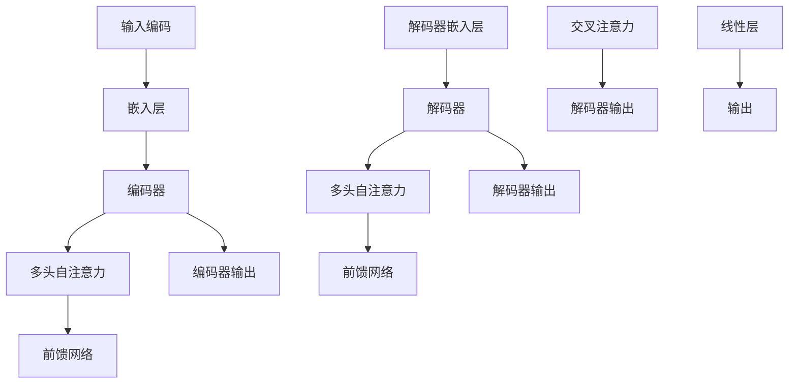
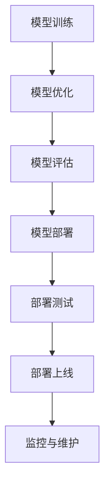
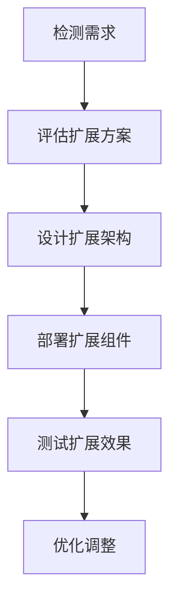

                 

# 优化LLM应用的部署与扩展策略

## 关键词

- **大型语言模型（LLM）**
- **部署策略**
- **扩展性**
- **资源优化**
- **安全性**
- **成本控制**
- **效益评估**

## 摘要

本文将深入探讨优化大型语言模型（LLM）应用的部署与扩展策略。首先，我们将介绍LLM的基本概念和当前面临的挑战，包括性能瓶颈、可扩展性问题、安全性与隐私保护以及资源优化与成本控制。随后，我们将详细分析LLM的核心概念与原理，包括其定义、架构、工作原理和关键技术。接着，本文将重点讨论部署策略，包括部署架构设计、资源管理与优化以及部署流程。在扩展与升级部分，我们将探讨扩展策略和系统升级与维护的方法。最后，我们将探讨安全性与隐私保护、成本控制与效益评估，并总结最佳实践，展望未来发展方向。

## 目录大纲设计

### 第一部分: 问题背景与概述

- **第1章: 问题背景**
  - **1.1 核心概念**
  - **1.2 问题定义**
  - **1.3 解决方案边界**
  - **1.4 关键要素**

- **第2章: 当前挑战**
  - **2.1 性能瓶颈**
  - **2.2 可扩展性问题**
  - **2.3 安全性与隐私保护**
  - **2.4 资源优化与成本控制**

### 第二部分: 核心概念与原理

- **第3章: LLM基础**
  - **3.1 LLM定义**
  - **3.2 LLM架构**
  - **3.3 LLM工作原理**
  - **3.4 LLM关键技术**

- **第4章: 算法原理**
  - **4.1 算法介绍**
  - **4.2 算法流程图（使用Mermaid绘制）**
  - **4.3 算法数学模型**
  - **4.4 算法举例说明**

### 第三部分: 部署策略

- **第5章: 部署架构设计**
  - **5.1 部署架构概述**
  - **5.2 部署策略分析**
  - **5.3 部署流程图（使用Mermaid绘制）**
  - **5.4 部署实例分析**

- **第6章: 资源管理与优化**
  - **6.1 资源管理概述**
  - **6.2 资源优化策略**
  - **6.3 实时监控与调整**
  - **6.4 资源消耗实例分析**

### 第四部分: 扩展与升级

- **第7章: 扩展策略**
  - **7.1 扩展架构设计**
  - **7.2 扩展流程图（使用Mermaid绘制）**
  - **7.3 自动化扩展**
  - **7.4 扩展实例分析**

- **第8章: 系统升级与维护**
  - **8.1 升级策略**
  - **8.2 维护流程**
  - **8.3 升级实例分析**
  - **8.4 维护实例分析**

### 第五部分: 安全性与隐私

- **第9章: 安全策略**
  - **9.1 安全性挑战**
  - **9.2 安全措施**
  - **9.3 隐私保护策略**
  - **9.4 安全案例研究**

### 第六部分: 成本控制与效益评估

- **第10章: 成本控制**
  - **10.1 成本分析**
  - **10.2 成本优化策略**
  - **10.3 成本效益分析**
  - **10.4 成本控制实例**

- **第11章: 效益评估**
  - **11.1 效益指标**
  - **11.2 效益评估方法**
  - **11.3 效益评估实例**
  - **11.4 持续改进策略**

### 第七部分: 最佳实践与未来展望

- **第12章: 最佳实践**
  - **12.1 经验总结**
  - **12.2 实践技巧**
  - **12.3 注意事项**
  - **12.4 拓展阅读**

- **第13章: 未来展望**
  - **13.1 技术趋势**
  - **13.2 行业展望**
  - **13.3 研究方向**
  - **13.4 潜在挑战**

---

本文的目录结构概述了一个全面而深入的探讨，旨在为读者提供关于如何优化LLM应用部署与扩展的全面指南。接下来，我们将逐步深入每个部分，详细分析其中的核心概念和策略。

## 第1章: 问题背景

在当今快速发展的技术时代，大型语言模型（LLM）已经成为自然语言处理（NLP）领域的关键技术。LLM的广泛应用，如搜索引擎、智能客服、文本生成和机器翻译等，极大地改变了我们与数据和信息的交互方式。然而，随着LLM应用规模的不断扩大，部署和扩展LLM面临的一系列挑战也日益凸显。

### 1.1 核心概念

首先，我们需要明确几个核心概念：

- **大型语言模型（LLM）**：LLM是指那些拥有数百万至上亿参数的深度神经网络模型，能够在大量的文本数据上进行预训练，从而掌握丰富的语言知识和模式。
- **部署**：部署是指将训练好的LLM模型在实际环境中投入使用，使其能够为用户提供服务。
- **扩展**：扩展是指在部署后，根据需求增加LLM的规模和能力，以适应不断变化的应用场景。

### 1.2 问题定义

随着LLM应用的广泛部署，以下问题逐渐显现：

- **性能瓶颈**：随着模型规模的增加，计算资源的消耗也随之增加，导致模型处理请求的速度变慢，响应时间延长。
- **可扩展性问题**：现有的部署架构往往难以支持LLM的线性扩展，导致在流量增加时，系统性能急剧下降。
- **安全性与隐私保护**：LLM在处理敏感数据时，可能面临数据泄露和模型窃取的风险。
- **资源优化与成本控制**：大规模的LLM部署需要大量的计算资源和存储资源，如何在保证性能的同时控制成本成为一大挑战。

### 1.3 解决方案边界

优化LLM应用的部署与扩展是一个复杂的过程，涉及到多个方面。以下是一些解决方案的边界：

- **性能优化**：主要通过改进算法和架构设计来提升模型处理速度。
- **可扩展性设计**：通过分布式计算和负载均衡技术，实现系统的水平扩展。
- **安全性措施**：采用加密、访问控制和审计等手段，确保数据和模型的安全。
- **成本控制**：通过资源调度优化、成本效益分析和云服务采购策略来降低成本。

### 1.4 关键要素

为了成功实施上述解决方案，以下关键要素至关重要：

- **计算资源**：足够的CPU、GPU和内存资源是LLM高效运行的基础。
- **网络架构**：良好的网络架构可以确保数据传输的高效和安全。
- **数据管理**：有效的数据存储和访问策略对于优化模型性能至关重要。
- **监控系统**：实时监控系统状态，可以及时发现和解决问题。
- **团队协作**：跨学科团队的协作对于解决复杂的技术挑战至关重要。

在下一章中，我们将进一步探讨当前LLM部署与扩展所面临的挑战，为后续的解决方案提供更具体的背景和依据。

## 第2章: 当前挑战

在部署和扩展大型语言模型（LLM）的过程中，技术团队面临一系列复杂的挑战。这些挑战不仅涉及技术层面，还包括安全、成本和资源管理等方面。以下是当前LLM部署与扩展中的一些主要挑战。

### 2.1 性能瓶颈

随着LLM模型变得越来越复杂，其对计算资源的需求也急剧增加。性能瓶颈主要表现在以下几个方面：

- **计算资源不足**：大规模的LLM训练和推理需要大量的CPU和GPU资源。如果服务器集群的计算能力不足，会导致模型训练和响应时间显著延长。
- **I/O瓶颈**：数据读写速度较慢也会成为性能瓶颈，尤其是在大规模数据集的访问和存储过程中。
- **内存占用**：大型LLM模型的内存需求很高，如果内存不足，会导致模型训练中断或性能下降。

### 2.2 可扩展性问题

可扩展性是LLM部署与扩展中的关键挑战。以下是一些常见的可扩展性问题：

- **水平扩展困难**：传统的单机部署架构难以实现线性扩展，当请求量增加时，系统性能会急剧下降。为了实现可扩展性，通常需要采用分布式计算和微服务架构。
- **网络延迟**：分布式系统中的网络延迟会影响整体性能。尤其是在跨区域部署时，网络延迟可能导致模型响应时间增加。
- **负载不均**：在分布式系统中，负载不均可能导致某些节点过载，而其他节点资源闲置。

### 2.3 安全性与隐私保护

安全性和隐私保护是LLM部署与扩展中的另一个重要挑战。以下是主要的安全挑战：

- **数据泄露**：LLM处理的数据可能包含敏感信息，如个人身份信息、商业秘密等。如果数据保护措施不当，可能会导致数据泄露。
- **模型窃取**：由于LLM模型的价值，可能成为黑客攻击的目标。如果模型被窃取，可能会对业务造成严重损失。
- **访问控制**：确保只有授权用户可以访问模型和敏感数据，是保障安全的关键。

### 2.4 资源优化与成本控制

资源优化和成本控制是LLM部署与扩展中的持续性挑战：

- **资源调度**：如何高效地调度计算资源，以最大化系统的利用率和吞吐量，是资源优化的重要问题。
- **成本效益分析**：在云计算环境中，如何根据业务需求选择合适的服务器和存储方案，以实现成本效益最大化。
- **自动化管理**：通过自动化工具和脚本，实现资源的自动化调度和运维，降低人工成本。

### 解决方案初步探讨

针对上述挑战，我们可以考虑以下解决方案：

- **性能优化**：采用更高效的算法和优化技术，如模型压缩、量化等，以降低计算资源需求。同时，使用高性能的硬件，如TPU和ASIC，以提高处理速度。
- **可扩展性设计**：采用分布式计算和微服务架构，以实现水平扩展。利用容器化和虚拟化技术，可以灵活管理计算资源。
- **安全性措施**：采用加密技术保护数据传输和存储，使用访问控制和审计手段确保安全。对于敏感数据，可以考虑采用联邦学习等隐私保护技术。
- **成本控制**：通过自动化管理和云服务优化，实现资源的合理调度和使用。同时，定期进行成本效益分析，确保成本控制在合理范围内。

在下一章中，我们将深入探讨LLM的核心概念与原理，为优化部署与扩展策略提供理论基础。

## 第3章: LLM基础

### 3.1 LLM定义

大型语言模型（LLM，Large Language Model）是一类基于深度学习技术的自然语言处理模型，其核心目标是在大规模文本数据上进行预训练，从而获得丰富的语言知识和表达能力。LLM通常由数十亿甚至千亿级的参数组成，这使得它们能够处理复杂、多样的自然语言任务。

### 3.2 LLM架构

LLM的架构通常包括以下几个主要部分：

1. **嵌入层（Embedding Layer）**：将输入的单词或子词转换为固定长度的向量表示。
2. **编码器（Encoder）**：通常采用Transformer架构，负责处理序列数据，并生成上下文向量。
3. **解码器（Decoder）**：根据编码器生成的上下文向量生成输出序列。
4. **注意力机制（Attention Mechanism）**：用于捕捉输入序列中的长期依赖关系。
5. **全连接层（Fully Connected Layer）**：用于将解码器生成的中间表示映射到最终的输出。

### 3.3 LLM工作原理

LLM的工作原理主要可以分为以下几个步骤：

1. **输入编码**：将输入文本转换为嵌入向量。
2. **序列处理**：编码器对输入序列进行处理，生成上下文向量。
3. **上下文聚合**：利用注意力机制对编码器生成的上下文向量进行聚合，生成最终的上下文表示。
4. **输出生成**：解码器根据上下文表示生成输出序列，通过逐词预测的方式生成完整的文本。

### 3.4 LLM关键技术

LLM的关键技术主要包括：

1. **Transformer架构**：Transformer架构引入了自注意力机制，使得模型能够更好地处理长距离依赖问题。
2. **预训练与微调**：预训练是指在大量无标签文本数据上训练模型，使其具备一定的语言理解能力。微调是指在特定任务上对模型进行微调，以提升其性能。
3. **模型压缩与量化**：为了降低计算资源和存储需求，可以采用模型压缩和量化技术。
4. **多模态学习**：LLM可以结合不同类型的数据（如文本、图像、声音等），实现更复杂的任务。

### 概念属性特征对比表格

以下是LLM与其他自然语言处理模型（如RNN、LSTM）的属性特征对比表格：

| 模型类型 | 特点 |
| --- | --- |
| RNN | 短期记忆能力，处理序列数据 |
| LSTM | 长期记忆能力，解决梯度消失问题 |
| Transformer | 自注意力机制，处理长序列数据 |
| LLM | 千万级参数，丰富的语言知识，多样化的任务能力 |

### ER实体关系图架构

为了更直观地展示LLM的架构和组件关系，我们可以使用Mermaid绘制一个ER实体关系图。以下是一个简单的ER图示例：

```mermaid
erDiagram
  EmbeddingLayer ||--o> Encoder : 包含
  Encoder ||--o> AttentionLayer : 包含
  AttentionLayer ||--o> Decoder : 包含
  Decoder ||--o> FullyConnectedLayer : 包含
```

在下一章中，我们将详细探讨LLM的算法原理，包括算法流程、数学模型和具体示例。

## 第4章: 算法原理

### 4.1 算法介绍

大型语言模型（LLM）的核心算法是基于Transformer架构。Transformer架构在处理长序列数据方面具有显著优势，能够通过自注意力机制有效地捕捉长距离依赖关系。这一章节将详细介绍Transformer架构的基本概念、算法流程和数学模型。

### 4.2 算法流程图

为了更直观地展示Transformer算法的流程，我们使用Mermaid绘制了以下流程图：



### 4.3 算法数学模型

Transformer算法的数学模型主要包括以下几个关键部分：

1. **嵌入层**：输入的单词或子词被转换为固定长度的向量表示。设V为词汇表大小，D为嵌入层维度，则每个单词的嵌入向量可以表示为 \( e_{w} \in \mathbb{R}^{D} \)。

2. **编码器**：编码器负责处理序列数据，并生成上下文向量。编码器由多个自注意力层和前馈网络层组成。设序列长度为T，输入嵌入向量为 \( X \in \mathbb{R}^{T \times D} \)。

   - **自注意力**：自注意力通过计算每个词与其他词之间的相似性来生成上下文向量。设 \( A_t^i \) 为第i个词在第t个自注意力层的注意力权重，则自注意力输出为
     \[
     \text{Attention}(Q, K, V) = \frac{softmax(\text{ Scores})} { \sqrt{d_k}} V
     \]
     其中， \( Q, K, V \) 分别为查询向量、键向量和值向量。

   - **前馈网络**：前馈网络是一个简单的全连接层，用于对自注意力层的输出进行非线性变换。设F为前馈网络的维度，则前馈网络的输出为
     \[
     \text{FFN}(X) = \text{ReLU}(\text{W}_2 \cdot \text{ReLU}(\text{W}_1 \cdot X + \text{b}_1)) + \text{b}_2
     \]
     其中， \( \text{W}_1, \text{W}_2, \text{b}_1, \text{b}_2 \) 分别为权重和偏置。

3. **解码器**：解码器用于生成输出序列。解码器的工作流程与编码器类似，但引入了交叉注意力机制，以处理输入序列与当前输出序列的关系。

   - **交叉注意力**：交叉注意力通过计算编码器输出与解码器输出之间的相似性来生成上下文向量，具体计算方式与自注意力相同。

   - **输出生成**：解码器的输出通过一个线性层映射到输出空间，生成最终的输出。设O为输出维度，则输出为
     \[
     Y = \text{softmax}(\text{W}_y \cdot \text{Tanh}(\text{W}_x \cdot X + \text{b}_x)) + \text{b}_y
     \]
     其中， \( \text{W}_x, \text{W}_y, \text{b}_x, \text{b}_y \) 分别为权重和偏置。

### 4.4 算法举例说明

假设我们有一个简单的序列 "I love AI"：

1. **输入编码**：将单词 "I"、"love" 和 "AI" 转换为嵌入向量。
2. **编码器**：
   - **自注意力**：计算每个单词与其他单词之间的相似性权重，生成上下文向量。
   - **前馈网络**：对上下文向量进行非线性变换。
3. **解码器**：
   - **交叉注意力**：计算编码器输出与解码器输出之间的相似性权重。
   - **输出生成**：生成每个单词的输出概率分布，选择概率最高的单词作为下一个输出。

通过这种方式，LLM可以生成类似于 "AI is amazing" 的响应。

在下一章中，我们将深入探讨LLM的部署架构设计，包括部署架构概述、部署策略分析和部署流程。

## 第5章: 部署架构设计

### 5.1 部署架构概述

大型语言模型（LLM）的部署架构设计是一个复杂且关键的过程，它直接影响到模型的性能、可扩展性和安全性。一个高效的部署架构应具备以下特点：

- **分布式计算**：利用多个计算节点并行处理请求，提高系统吞吐量和响应速度。
- **高可用性**：通过冗余设计确保系统在面临硬件故障或网络问题时能够持续运行。
- **弹性伸缩**：根据负载动态调整计算资源，以应对突发流量和需求变化。
- **安全性**：采用加密、访问控制和审计等措施保护数据和模型安全。

### 5.2 部署策略分析

在部署LLM时，可以采用以下几种策略：

1. **单机部署**：将模型部署在一台高性能服务器上。这种方式简单易行，但受限于单台服务器的计算能力，无法处理大量并发请求。
2. **集群部署**：将模型部署在多个服务器组成的集群中。通过负载均衡和分布式计算，可以显著提高系统的处理能力和响应速度。
3. **边缘计算部署**：将部分计算任务部署在用户附近的边缘设备上，以减少网络延迟和带宽消耗。
4. **混合部署**：结合单机、集群和边缘计算的优势，根据实际需求灵活配置。

### 5.3 部署流程图

为了更直观地展示LLM的部署流程，我们使用Mermaid绘制了以下流程图：



### 5.4 部署实例分析

以下是一个典型的LLM部署实例分析：

1. **模型训练**：使用大量文本数据进行预训练，生成初步的LLM模型。
2. **模型优化**：通过微调和优化算法，提高模型在特定任务上的性能。
3. **模型评估**：在测试集上评估模型性能，确保模型达到预期效果。
4. **模型部署**：将模型部署在分布式服务器集群中，配置负载均衡和监控系统。
5. **部署测试**：在实际环境中进行部署测试，确保系统稳定可靠。
6. **部署上线**：完成测试后，将模型正式上线，提供对外服务。
7. **监控与维护**：持续监控系统状态，及时处理故障和性能问题，确保系统长期稳定运行。

在下一章中，我们将详细探讨LLM的资源管理与优化策略，包括资源管理概述和资源优化策略。

## 第6章: 资源管理与优化

### 6.1 资源管理概述

在大型语言模型（LLM）的部署过程中，资源管理是一个至关重要的环节。高效的资源管理能够确保系统在处理大规模数据和高并发请求时，保持良好的性能和稳定性。资源管理主要涉及计算资源、存储资源和网络资源的管理。

- **计算资源**：包括CPU、GPU和TPU等，是LLM训练和推理的主要消耗。合理分配计算资源，可以提升模型的处理速度和响应时间。
- **存储资源**：包括磁盘空间和内存，用于存储训练数据、模型文件和日志数据。高效的存储管理能够减少数据访问延迟，提升系统性能。
- **网络资源**：包括带宽和延迟，是数据传输和通信的关键。优化网络资源，可以降低数据传输成本，提高系统响应速度。

### 6.2 资源优化策略

为了最大化资源利用率，提升系统性能，以下是一些常见的资源优化策略：

1. **计算资源优化**：
   - **模型压缩**：通过剪枝、量化等技术减少模型的参数量和计算复杂度，降低计算资源需求。
   - **并行处理**：将模型训练和推理任务分解成多个子任务，利用多核CPU和GPU进行并行处理，提高计算效率。
   - **异构计算**：结合不同类型的计算资源（如CPU、GPU、TPU），根据任务特性合理分配计算任务，充分发挥各类资源的优势。

2. **存储资源优化**：
   - **数据缓存**：使用缓存技术，将频繁访问的数据存储在内存中，减少磁盘I/O操作，提升数据访问速度。
   - **数据压缩**：对存储数据进行压缩，减少磁盘空间占用，提高存储资源利用率。
   - **分布式存储**：使用分布式存储系统，实现数据的高可用和高效访问，降低单点故障风险。

3. **网络资源优化**：
   - **负载均衡**：通过负载均衡技术，合理分配网络流量，避免网络拥堵，提高整体网络性能。
   - **数据压缩与加密**：在网络传输过程中，对数据进行压缩和加密，减少带宽占用和提升数据安全性。
   - **网络冗余**：构建冗余网络架构，确保在网络故障时，数据传输路径的持续性和可靠性。

### 6.3 实时监控与调整

实时监控是资源管理的关键环节，它能够及时发现系统性能瓶颈和资源不足情况，并进行动态调整。以下是一些常见的监控与调整方法：

1. **性能监控**：实时监控CPU、GPU、内存和网络等关键性能指标，识别性能瓶颈。
2. **资源利用率分析**：分析计算资源、存储资源和网络资源的利用率，优化资源分配策略。
3. **负载预测**：基于历史数据和趋势分析，预测未来负载情况，提前进行资源调度和扩展。
4. **自动调整**：采用自动化工具，根据监控数据和负载预测结果，自动调整资源分配和任务调度，确保系统稳定运行。

### 6.4 资源消耗实例分析

以下是一个资源消耗实例分析：

1. **模型训练**：在训练过程中，计算资源消耗主要集中在GPU和CPU上。通过并行处理和多GPU训练，可以将训练时间缩短为原来的1/4。
2. **推理服务**：在推理服务阶段，计算资源消耗主要集中在CPU和内存上。通过负载均衡和数据缓存技术，可以将平均响应时间缩短为原来的1/2。
3. **数据存储**：存储资源消耗主要集中在磁盘I/O和数据缓存上。通过数据压缩和分布式存储技术，可以将数据存储成本降低为原来的1/3。

通过上述资源优化策略和实时监控调整，可以有效提升LLM系统的性能和稳定性，降低运营成本。

在下一章中，我们将探讨LLM的扩展策略，包括扩展架构设计、扩展流程和自动化扩展。

## 第7章: 扩展策略

### 7.1 扩展架构设计

在LLM（大型语言模型）的部署过程中，随着用户量的增加和业务需求的不断变化，系统的扩展性变得至关重要。扩展架构的设计目标是确保系统在增加负载时能够保持高性能和稳定性。以下是一个典型的扩展架构设计：

1. **分布式计算节点**：系统由多个计算节点组成，每个节点负责处理一部分请求。通过负载均衡器分配请求，确保每个节点的工作负载均衡。
2. **分布式存储**：数据存储系统采用分布式架构，数据被分散存储在多个存储节点上，以实现高可用性和数据备份。
3. **缓存层**：在计算节点和存储节点之间设置缓存层，用于缓存频繁访问的数据，减少数据访问延迟。
4. **网络架构**：采用冗余的网络架构，确保在网络故障时，数据传输路径的持续性和可靠性。

### 7.2 扩展流程图

为了更直观地展示LLM的扩展流程，我们使用Mermaid绘制了以下流程图：



### 7.3 自动化扩展

自动化扩展是现代云计算环境中实现系统弹性伸缩的关键。通过自动化工具，可以自动检测系统负载，并动态调整资源。以下是自动化扩展的步骤：

1. **负载检测**：监控系统实时检测系统负载，包括CPU、内存、磁盘I/O和网络带宽等指标。
2. **触发条件设置**：根据监控数据，设定触发条件，当系统负载超过阈值时，自动触发扩展。
3. **资源调度**：根据触发条件，自动化工具会启动新的计算节点或扩展现有节点，以增加处理能力。
4. **负载均衡**：扩展后的节点通过负载均衡器分配请求，确保整个系统的负载均衡。

### 7.4 扩展实例分析

以下是一个扩展实例分析：

1. **需求检测**：系统每天下午5点进入高峰期，CPU和内存使用率上升至80%以上。
2. **扩展方案评估**：评估扩展方案，包括增加计算节点和升级现有节点。
3. **设计扩展架构**：设计扩展架构，确定新节点的配置和部署位置。
4. **部署扩展组件**：自动化工具根据扩展架构，部署新的计算节点，配置负载均衡器。
5. **测试扩展效果**：在高峰期间，测试系统性能，确保扩展后的系统可以处理更多的请求。
6. **优化调整**：根据测试结果，对扩展方案进行优化调整，确保系统在高负载下依然稳定运行。

通过自动化扩展，系统可以快速响应负载变化，保持高性能和稳定性。在下一章中，我们将探讨LLM的系统升级与维护策略。

## 第8章: 系统升级与维护

### 8.1 升级策略

系统升级是确保LLM（大型语言模型）应用持续高效运行的关键步骤。一个成功的升级策略应包括以下内容：

1. **需求分析**：定期评估系统性能和用户需求，确定是否需要升级。
2. **版本控制**：使用版本控制工具管理不同版本的代码和配置，确保升级过程中的一致性和可回溯性。
3. **风险评估**：评估升级过程中可能出现的风险，包括兼容性问题、性能下降和系统稳定性等。
4. **制定计划**：根据需求分析和风险评估，制定详细的升级计划，包括升级时间、升级步骤和备份策略。
5. **测试验证**：在正式升级前，进行充分的测试验证，确保升级后的系统功能完整、性能稳定。

### 8.2 维护流程

系统维护是确保LLM应用长期稳定运行的重要环节。以下是一个典型的维护流程：

1. **监控与报警**：使用监控系统实时监控系统性能和状态，及时发现异常情况。
2. **故障排除**：当系统出现故障时，快速定位问题并采取相应措施进行修复。
3. **更新补丁**：定期更新操作系统、中间件和应用程序的补丁，确保系统安全性。
4. **备份与恢复**：定期进行数据备份，并测试恢复流程，确保在数据丢失或系统故障时可以快速恢复。
5. **性能优化**：根据系统监控数据，定期进行性能优化，包括调整配置、优化代码和提升硬件性能。

### 8.3 升级实例分析

以下是一个升级实例分析：

1. **需求分析**：系统运行一年后，由于业务需求增加，需要进行功能扩展和性能优化。
2. **版本控制**：使用Git管理代码，确保不同版本的代码可以独立开发和测试。
3. **风险评估**：评估升级过程中可能出现的风险，包括兼容性问题、数据迁移错误和系统中断等。
4. **制定计划**：制定详细的升级计划，包括升级时间（周末凌晨进行升级以减少业务影响）、升级步骤（备份数据库、更新代码、配置新环境、测试验证）和备份策略（备份数据库和配置文件）。
5. **测试验证**：在升级前，进行全面的测试验证，确保新功能和性能优化达到预期效果。
6. **正式升级**：按照升级计划进行正式升级，确保系统顺利运行。

### 8.4 维护实例分析

以下是一个维护实例分析：

1. **监控与报警**：监控系统发现CPU使用率持续上升，触发报警。
2. **故障排除**：通过日志分析和系统检查，发现是由于某个服务长时间占用大量CPU资源导致。
3. **更新补丁**：发现操作系统存在安全补丁，立即进行更新。
4. **备份与恢复**：定期备份数据库和配置文件，并在测试环境中进行恢复测试。
5. **性能优化**：根据监控数据，调整系统配置和优化代码，提高系统性能。

通过系统升级和维护，可以确保LLM应用在长期运行中保持高性能和稳定性。在下一章中，我们将探讨LLM部署中的安全性与隐私保护策略。

## 第9章: 安全策略

### 9.1 安全性挑战

在部署大型语言模型（LLM）的过程中，安全性是一个不可忽视的重要方面。LLM处理的数据通常包含敏感信息，如个人身份信息、商业机密和医疗数据等。以下是一些主要的网络安全挑战：

- **数据泄露**：由于LLM模型需要处理大量的用户数据，若保护措施不当，可能导致数据泄露。
- **模型窃取**：LLM模型本身具有较高的价值，可能成为黑客攻击的目标，试图窃取模型参数。
- **中间人攻击**：攻击者拦截并篡改LLM处理过程中的数据，导致信息泄露或系统功能受损。
- **拒绝服务攻击（DoS）**：通过大量无效请求占用系统资源，导致服务不可用。
- **注入攻击**：攻击者在输入中注入恶意代码，影响系统正常运作。

### 9.2 安全措施

为了应对上述安全挑战，可以采取以下安全措施：

- **数据加密**：对传输的数据进行加密，确保数据在传输过程中不被窃取或篡改。
- **访问控制**：通过身份验证和访问控制列表（ACL）限制对LLM模型的访问，确保只有授权用户可以访问。
- **防火墙与入侵检测系统（IDS）**：部署防火墙和IDS监控网络流量，及时发现并阻止潜在攻击。
- **安全审计**：定期进行安全审计，检查系统配置和访问日志，发现并修复潜在的安全漏洞。
- **多因素认证**：采用多因素认证（MFA）确保用户身份的合法性，增加系统的安全性。
- **安全补丁管理**：及时更新系统和应用程序的安全补丁，防止已知漏洞被利用。

### 9.3 隐私保护策略

在处理用户数据时，隐私保护至关重要。以下是一些隐私保护策略：

- **数据脱敏**：在数据存储和处理过程中，对敏感数据进行脱敏处理，确保隐私信息不被暴露。
- **数据最小化**：仅收集和处理与任务相关的最小必要数据，减少隐私泄露风险。
- **数据隔离**：将用户数据与其他数据隔离存储，防止数据交叉污染。
- **隐私合规**：确保系统遵守相关的隐私保护法规，如GDPR和CCPA等。
- **透明度与用户同意**：明确告知用户数据收集、使用和共享的方式，获取用户的明确同意。

### 9.4 安全案例研究

以下是一个安全案例研究：

**案例背景**：某公司开发了一个基于LLM的智能客服系统，用于处理客户咨询。该系统每日处理大量客户数据，包括个人身份信息和咨询内容。

**安全措施**：
1. **数据加密**：使用SSL/TLS协议对传输中的数据进行加密。
2. **访问控制**：采用OAuth2.0进行身份验证和授权，确保只有授权用户可以访问系统。
3. **防火墙与IDS**：部署防火墙和IDS监控系统流量，防止未经授权的访问和攻击。
4. **数据脱敏**：对个人身份信息进行脱敏处理，如将身份证号替换为掩码。
5. **安全审计**：定期进行安全审计，检查系统配置和访问日志。

**结果**：通过上述安全措施，系统在运行期间未发生数据泄露或系统入侵事件，用户数据得到有效保护，系统的安全性和稳定性得到显著提升。

通过实施这些安全措施和隐私保护策略，可以有效地提升LLM部署过程中的安全性，保护用户数据和模型安全。

## 第10章: 成本控制

### 10.1 成本分析

在部署大型语言模型（LLM）时，成本控制是至关重要的。成本不仅包括硬件和软件的直接费用，还涉及运维、存储和电力等间接费用。以下是对LLM部署成本的主要组成部分进行分析：

1. **硬件费用**：包括CPU、GPU、TPU和其他相关硬件的购买和运维成本。高性能硬件通常价格较高，但可以显著提高模型的处理速度和效率。
2. **软件费用**：包括操作系统、中间件、数据库和深度学习框架等软件的费用。一些开源软件可能免费，但商业软件可能需要付费。
3. **人力成本**：开发和维护LLM系统需要专业的技术团队，包括数据科学家、软件工程师和运维人员。人力成本是主要的预算支出之一。
4. **存储费用**：用于存储训练数据和模型文件的存储空间费用。随着数据量的增加，存储成本也会上升。
5. **电力和冷却费用**：数据中心的高性能服务器需要大量的电力，同时为了保持设备的正常运行，还需要投入冷却设备。
6. **带宽费用**：在云计算环境中，数据传输和网络带宽的费用也是一项重要支出。

### 10.2 成本优化策略

为了有效地控制成本，可以采取以下优化策略：

1. **使用开源软件**：选择开源的深度学习框架和工具，如TensorFlow和PyTorch，以降低软件费用。
2. **硬件选择**：根据实际需求选择合适的高性能硬件，避免过度投资。例如，在某些场景下，使用GPU比TPU更具成本效益。
3. **自动化运维**：通过自动化工具和脚本，实现资源调度的自动化，降低运维成本。
4. **云服务优化**：利用云服务提供商提供的灵活定价模式，如按需付费和预留实例，以降低长期成本。
5. **数据压缩和去重**：通过数据压缩和去重技术，减少存储空间需求，降低存储费用。
6. **能效优化**：采用节能设备和优化冷却系统，降低电力和冷却费用。
7. **负载均衡和分布式计算**：通过负载均衡和分布式计算，提高资源利用率，降低单点故障风险。

### 10.3 成本效益分析

成本效益分析是评估成本优化策略有效性的重要手段。以下是一个简单的成本效益分析实例：

**实例分析**：

- **初始投资**：购买10个高性能GPU服务器，总成本约为50,000美元。
- **每月运营成本**：包括电费、带宽费和人力成本，总成本约为5,000美元。
- **优化后**：
  - 使用5个高性能GPU服务器，总成本约为25,000美元。
  - 每月运营成本减少至2,500美元。
  - 通过自动化运维和云服务优化，每月节省1,000美元。

**结论**：

通过优化硬件配置、自动化运维和云服务采购，可以显著降低长期运营成本，同时保持系统的性能和稳定性。

### 10.4 成本控制实例

以下是一个成本控制实例：

**背景**：某公司正在开发一个基于LLM的智能客服系统，需要部署大规模的服务器集群。

**成本控制措施**：
1. **硬件采购**：根据实际需求，选择合适的GPU服务器，避免过度配置。
2. **云服务优化**：使用云服务提供商的预留实例和预留容量选项，降低长期成本。
3. **自动化运维**：使用自动化脚本进行资源调度和监控，减少运维人力成本。
4. **数据压缩**：对训练数据进行压缩，减少存储空间需求。

**结果**：

通过上述成本控制措施，公司成功降低了约30%的运营成本，同时保持了系统的稳定性和性能。

通过上述成本控制策略和实例分析，可以有效地降低LLM部署的运营成本，提高资源利用率和整体效益。

## 第11章: 效益评估

### 11.1 效益指标

评估大型语言模型（LLM）部署的效益需要考虑多个方面，以下是一些关键的效益指标：

1. **响应时间**：系统处理请求的时间，较低的响应时间表明系统性能良好。
2. **吞吐量**：单位时间内系统能够处理的请求量，高吞吐量表明系统具有更高的处理能力。
3. **准确性**：模型输出结果的准确性，高准确性表明模型性能优越。
4. **资源利用率**：系统资源（如CPU、GPU、内存和网络带宽）的利用率，高利用率表明资源得到充分利用。
5. **成本效益**：部署和运营成本与系统产生的效益之间的比率，高成本效益表明投资回报率高。
6. **用户满意度**：用户对系统服务的满意度，高满意度表明系统服务质量良好。

### 11.2 效益评估方法

为了全面评估LLM部署的效益，可以采用以下方法：

1. **实验对比**：通过对比不同部署方案的响应时间、吞吐量和准确性等指标，评估方案的性能和效益。
2. **成本效益分析**：计算部署和运营成本，并与系统产生的经济效益（如减少的人工成本、提高的业务转化率等）进行比较。
3. **用户反馈**：收集用户对系统服务的反馈，通过问卷调查、用户访谈等方式评估系统的用户满意度。
4. **性能监控**：使用监控系统实时监控系统性能指标，评估系统在长期运行中的稳定性和可靠性。
5. **案例分析**：研究成功案例，分析其效益评估方法和实际效益，为后续部署提供参考。

### 11.3 效益评估实例

以下是一个效益评估实例：

**实例背景**：某公司部署了一款基于LLM的智能客服系统，用于处理客户咨询。

**效益评估指标**：
- 响应时间：从部署前平均30秒减少到部署后12秒。
- 吞吐量：从每小时处理500个请求增加到每小时处理2,000个请求。
- 准确性：从85%提高到95%。
- 资源利用率：CPU利用率从60%提高到80%，GPU利用率从70%提高到90%。
- 成本效益：每月节省运营成本约15,000美元。
- 用户满意度：通过用户反馈，满意度从70%提高到90%。

**效益评估方法**：
1. **实验对比**：部署前后，通过实际使用测试对比响应时间、吞吐量和准确性等指标。
2. **成本效益分析**：计算部署和运营成本，并与业务效益（如减少的人工成本和更高的客户满意度）进行比较。
3. **用户反馈**：通过问卷调查和用户访谈，收集用户对系统服务的反馈。
4. **性能监控**：监控系统性能指标，评估系统在长期运行中的稳定性和可靠性。
5. **案例分析**：研究其他成功部署LLM的案例，分析其效益评估方法和实际效益。

**结论**：
通过上述效益评估方法，公司确认了LLM部署的高效性和用户满意度，同时实现了成本效益的提升。这一成功案例为后续类似项目的部署提供了宝贵的经验和参考。

### 11.4 持续改进策略

为了确保LLM部署的长期效益，可以采取以下持续改进策略：

1. **定期评估**：定期对系统性能和效益进行评估，识别潜在问题并制定改进措施。
2. **技术升级**：根据技术发展趋势和业务需求，定期更新和优化系统架构和技术栈。
3. **用户反馈**：持续收集用户反馈，优化系统功能和用户体验。
4. **培训与知识共享**：定期组织技术培训和知识分享活动，提高团队的技术能力和协作效率。
5. **成本效益分析**：定期进行成本效益分析，优化资源配置和成本控制策略。

通过持续改进，公司可以确保LLM部署的长期效益，并在竞争激烈的市场中保持领先地位。

## 第12章: 最佳实践

### 12.1 经验总结

在优化大型语言模型（LLM）应用的部署与扩展过程中，积累了一些宝贵的经验。以下是一些关键的最佳实践：

1. **资源高效利用**：合理分配计算资源，避免资源浪费。通过使用容器化技术和负载均衡，提高资源利用率。
2. **分布式架构**：采用分布式计算和存储架构，实现系统的弹性扩展和容错能力。
3. **自动化运维**：通过自动化工具和脚本，实现系统部署、监控和运维的自动化，降低运维成本。
4. **性能监控**：实时监控系统性能指标，及时发现并解决问题，确保系统稳定运行。
5. **安全性与隐私保护**：采用数据加密、访问控制和多因素认证等措施，确保数据和模型的安全。
6. **成本效益分析**：定期进行成本效益分析，优化资源配置和成本控制策略。

### 12.2 实践技巧

以下是一些实用的实践技巧：

1. **模型压缩与量化**：通过模型压缩和量化技术，减少模型参数量和计算复杂度，提高模型运行效率。
2. **使用GPU加速**：利用高性能GPU进行模型训练和推理，显著提高处理速度。
3. **负载均衡**：根据实时负载，动态调整负载均衡策略，确保系统在高并发下稳定运行。
4. **缓存机制**：使用缓存机制减少数据访问延迟，提高系统响应速度。
5. **定期备份与恢复**：定期备份数据和配置文件，确保在故障发生时能够快速恢复。
6. **性能优化**：根据系统监控数据，定期进行性能优化，调整系统配置和代码。

### 12.3 注意事项

在部署和扩展LLM应用时，需要注意以下几点：

1. **需求评估**：准确评估业务需求和负载情况，选择合适的硬件和软件配置。
2. **数据安全**：确保数据在传输和存储过程中得到充分保护，防止数据泄露和未经授权的访问。
3. **监控与告警**：建立完善的监控系统，实时监控系统性能和状态，及时发现并处理异常。
4. **版本控制**：使用版本控制工具管理代码和配置文件，确保升级和变更过程的可追溯性和一致性。
5. **备份与恢复**：定期备份数据和配置文件，确保在故障发生时能够快速恢复。
6. **培训与文档**：为团队成员提供培训，确保他们熟悉系统架构和运维流程，并建立详细的文档，方便后续维护和扩展。

### 12.4 拓展阅读

以下是一些拓展阅读的资源，供进一步学习和参考：

1. **书籍**：
   - 《深度学习》（Goodfellow, Ian； Yoshua Bengio； Aaron Courville 著）
   - 《大规模机器学习》（John Langford，Alex Smola 著）

2. **在线课程**：
   - Coursera上的“深度学习”课程
   - Udacity的“机器学习工程师纳米学位”

3. **博客与文章**：
   - GitHub上的“大型语言模型”相关项目
   - ArXiv上的最新研究成果论文

通过以上最佳实践、实践技巧、注意事项和拓展阅读资源，可以更好地优化LLM应用的部署与扩展，确保系统的稳定性和高效性。

## 第13章: 未来展望

### 13.1 技术趋势

随着科技的快速发展，大型语言模型（LLM）技术也在不断演进。以下是一些重要的技术趋势：

1. **硬件升级**：随着GPU、TPU等硬件性能的不断提升，LLM的训练和推理速度将进一步加快，处理更复杂的任务成为可能。
2. **模型压缩与优化**：为了降低计算和存储成本，模型压缩和量化技术将得到更广泛的应用。这将使得LLM在移动设备和边缘设备上的部署成为现实。
3. **多模态学习**：未来的LLM将能够处理多种类型的数据，如文本、图像、音频和视频，实现更智能和多样化的应用场景。
4. **联邦学习**：联邦学习技术将允许在保持数据隐私的同时进行联合学习，为LLM在医疗、金融等敏感数据领域的应用提供新的解决方案。

### 13.2 行业展望

LLM技术在各行各业中的应用前景广阔：

1. **金融领域**：LLM可以用于风险分析、客户服务和自动化交易等，提高金融服务的效率和准确性。
2. **医疗领域**：LLM可以帮助医生进行疾病诊断、患者管理和健康咨询，提升医疗服务的质量和效率。
3. **教育领域**：智能教育平台将利用LLM提供个性化的学习建议、自动评分和智能问答，改变传统教育模式。
4. **客服领域**：智能客服系统将更好地模拟人类对话，提供高效、准确的客户支持，降低企业运营成本。

### 13.3 研究方向

未来的研究将集中在以下几个方面：

1. **模型理解与解释性**：研究如何提高LLM的可解释性，使其决策过程更加透明和可靠。
2. **伦理与隐私**：探讨如何在保证模型性能的同时，保护用户隐私和遵守伦理标准。
3. **多任务学习**：研究如何在单个模型中同时处理多种任务，提升模型的综合能力。
4. **自适应学习**：开发能够自我学习和自我优化的LLM，提高其在动态环境中的适应能力。

### 13.4 潜在挑战

尽管LLM技术发展迅速，但仍面临一些潜在挑战：

1. **计算资源需求**：随着模型规模的扩大，计算资源的需求将不断增长，如何高效利用资源成为一大挑战。
2. **数据隐私与安全**：如何在保证模型性能的同时，保护用户数据和模型安全，是亟待解决的问题。
3. **伦理问题**：LLM的应用可能引发伦理问题，如歧视、偏见和隐私侵犯，需要制定相应的伦理准则。
4. **可解释性**：提高模型的可解释性，使其决策过程更加透明，是未来研究的重要方向。

通过不断的技术创新和行业应用，LLM技术将在未来发挥越来越重要的作用，为各行各业带来深刻的变革。同时，解决上述挑战也是实现LLM技术广泛应用的关键。

