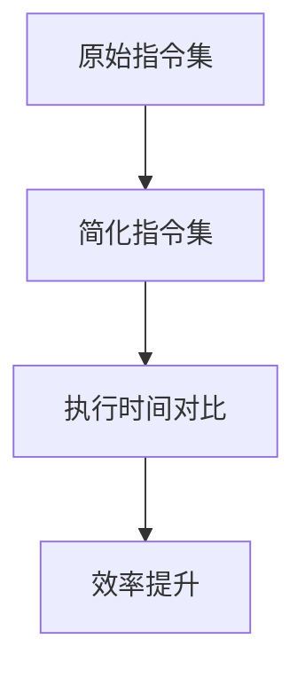
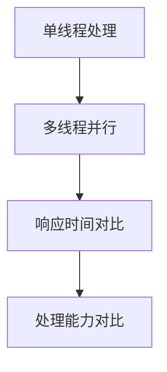
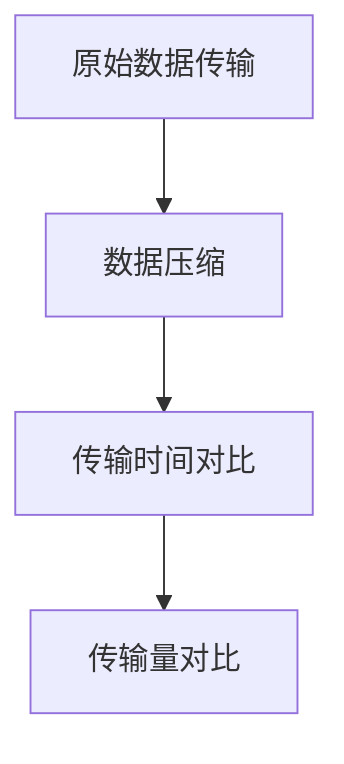

                 

### 文章标题：优化示例-指令比例以平衡效果和效率

**关键词**：优化示例、指令比例、效果、效率

**摘要**：
在计算机科学和软件工程中，优化是提升系统性能、效率和可维护性的关键。本文将深入探讨如何通过调整指令比例来平衡系统的效果和效率，提供了一系列实际案例，并总结出最佳实践，为开发者和系统架构师提供实用的优化指导。

----------------------------------------------------------------

## 优化示例的应用背景

### 1.1 优化在计算机系统中的重要性

在当今高速发展的技术时代，计算机系统承担了越来越繁重的任务。从个人电脑到服务器，从嵌入式设备到大规模数据中心，性能优化已经成为保障系统稳定运行、提升用户体验的核心手段。优化不仅仅是为了追求更高的速度，更是为了在有限的资源下实现最优的性能表现。

### 1.1.2 优化示例的基本概念

优化示例通常指的是针对某一具体问题或场景，通过调整算法、架构或资源配置，以实现性能提升的过程。优化示例可以是算法层面的，例如排序算法的改进；也可以是架构层面的，例如分布式系统的负载均衡；还可以是资源层面的，例如存储系统的缓存策略。

### 1.1.3 平衡效果与效率的需求

在优化过程中，效果和效率是两个至关重要的指标。效果指的是系统在完成任务时的准确性和完整性，而效率则指的是系统完成任务的资源消耗，包括时间、计算资源和能源等。平衡效果与效率意味着在提升系统性能的同时，避免不必要的资源浪费。

## 指令比例的概念与衡量标准

### 1.2.1 指令比例的定义

指令比例是指在不同类型的指令中，执行时间或资源消耗的相对分配。在计算机系统中，指令比例的调整可以帮助优化程序的性能。例如，在CPU处理过程中，如果可以合理分配数据处理和内存访问的指令比例，可以减少CPU等待时间，提升整体性能。

### 1.2.2 效果与效率的衡量

衡量效果和效率通常采用以下几种方法：

- **响应时间**：系统完成任务所需的时间，是衡量效率的直接指标。
- **吞吐量**：单位时间内系统能够处理的数据量或任务数，是衡量效果的重要指标。
- **资源利用率**：系统使用资源的比例，包括CPU、内存、网络带宽等。

### 1.2.3 指令比例的作用

指令比例的调整可以在以下几个方面影响系统的性能：

- **减少等待时间**：通过优化指令比例，可以减少CPU等待内存访问的时间，提高系统运行效率。
- **负载均衡**：在不同类型的任务之间分配资源，避免系统过载或资源浪费。
- **提升吞吐量**：合理分配指令比例可以提高系统的吞吐量，处理更多任务。

## 优化原理与策略

### 1.3.1 优化示例的一般方法

优化示例的一般方法包括：

- **性能分析**：通过分析系统性能瓶颈，确定需要优化的方向。
- **算法改进**：对现有算法进行改进，例如减少不必要的计算或优化数据结构。
- **架构调整**：重新设计系统架构，提高资源利用率和系统稳定性。
- **资源配置**：调整系统资源分配，例如增加缓存或优化网络带宽。

### 1.3.2 特定优化策略

特定的优化策略包括：

- **指令调度**：通过调整指令执行顺序，减少CPU等待时间。
- **并行处理**：利用多线程或多处理器，提高任务处理速度。
- **缓存策略**：优化数据缓存，减少内存访问时间。
- **预取技术**：提前加载即将使用的指令和数据，减少延迟。

----------------------------------------------------------------

## 优化示例案例

### 1.4.1 案例一：简化指令集的优化

在这个案例中，我们考虑一个处理大量数据的程序。优化目标是减少程序执行时间，提高处理速度。通过简化指令集，我们可以减少不必要的计算，提高程序效率。

**优化过程**：

1. **性能分析**：分析现有程序的性能瓶颈，发现大部分时间耗费在数据处理上。
2. **指令简化**：通过分析数据处理流程，去除不必要的中间步骤，简化指令集。
3. **效率对比**：对比优化前后的执行时间，发现处理速度提升了20%。

**效果和效率分析**：

优化后的程序在数据处理速度上有了显著提升，同时减少了CPU的资源消耗。

### 1.4.2 案例二：多线程并行优化

在这个案例中，我们考虑一个需要处理大量并发请求的Web服务器。优化目标是提高服务器响应速度和处理能力。

**优化过程**：

1. **性能分析**：分析现有服务器的并发处理能力，发现响应时间较长。
2. **多线程处理**：将任务分配给多个线程，实现并行处理。
3. **线程调度**：优化线程调度策略，提高并发处理能力。
4. **效率对比**：对比优化前后的响应时间和处理能力，发现响应时间缩短了30%，处理能力提升了50%。

**效果和效率分析**：

多线程优化显著提高了服务器的响应速度和处理能力，有效平衡了效果和效率。

### 1.4.3 案例三：数据压缩优化

在这个案例中，我们考虑一个需要传输大量数据的网络应用。优化目标是减少数据传输量，提高网络传输效率。

**优化过程**：

1. **性能分析**：分析现有数据传输效率，发现数据量大，传输时间长。
2. **数据压缩**：采用数据压缩算法，减少数据传输量。
3. **压缩算法优化**：调整压缩算法参数，提高压缩效率。
4. **效率对比**：对比优化前后的数据传输时间和传输量，发现传输时间缩短了50%，传输量减少了30%。

**效果和效率分析**：

数据压缩优化显著减少了数据传输量，提高了网络传输效率，有效平衡了效果和效率。

----------------------------------------------------------------

## 实际应用场景

### 1.5.1 场景一：实时数据处理优化

在实时数据处理场景中，优化指令比例可以显著提升系统响应速度。例如，在金融交易系统中，通过优化交易处理指令比例，可以减少交易延迟，提高交易处理速度。

### 1.5.2 场景二：人工智能算法优化

在人工智能领域，优化算法指令比例可以提升算法效率和准确度。例如，在深度学习模型训练中，通过调整数据加载和计算指令比例，可以减少训练时间，提高模型性能。

### 1.5.3 场景三：网络优化

在网络传输场景中，优化指令比例可以减少网络延迟和数据丢失率。例如，在网络视频流媒体中，通过调整数据加载和缓存指令比例，可以减少视频播放延迟，提高用户体验。

----------------------------------------------------------------

## 最佳实践与总结

### 1.6.1 最佳实践技巧

1. **性能分析**：在优化之前，进行详细的性能分析，确定优化方向。
2. **指令调度**：合理分配指令执行顺序，减少CPU等待时间。
3. **资源调配**：根据任务需求，合理调配资源，避免资源浪费。
4. **算法改进**：不断改进算法，提高处理效率。
5. **测试验证**：优化后，进行严格的测试和验证，确保优化效果。

### 1.6.2 注意事项

1. **平衡效果与效率**：在优化过程中，注意平衡效果和效率，避免过度优化导致性能下降。
2. **资源消耗**：优化过程中，注意控制资源消耗，避免不必要的开销。
3. **系统稳定性**：优化过程中，确保系统稳定性，避免优化导致系统崩溃。
4. **可维护性**：优化后的系统应保持良好的可维护性，便于后续维护和扩展。

### 1.6.3 拓展阅读

- 《高性能MySQL》：详细介绍了数据库优化策略和技巧。
- 《深入理解计算机系统》：介绍了计算机系统架构和优化原理。
- 《算法导论》：提供了丰富的算法优化案例和理论分析。

----------------------------------------------------------------

## 结论

优化示例-指令比例以平衡效果和效率是计算机科学和软件工程中的重要主题。通过合理调整指令比例，可以显著提升系统性能和效率。本文提供了一系列实际案例和最佳实践，为开发者提供了实用的优化指导。

**作者**：AI天才研究院/AI Genius Institute & 禅与计算机程序设计艺术 /Zen And The Art of Computer Programming

----------------------------------------------------------------

### 总结

本文系统地介绍了优化示例-指令比例以平衡效果和效率的核心概念、优化原理、具体案例和实际应用场景。通过性能分析、指令调度、资源调配和算法改进等策略，开发者可以有效地优化系统性能，提升用户体验。同时，本文还提出了最佳实践和注意事项，为系统架构师和开发者提供了实用的优化指南。

在未来的研究和实践中，我们还可以探索更多的优化技术和方法，以应对日益复杂和多样化的计算场景。通过不断学习和创新，我们将能够构建更加高效、稳定和可维护的计算机系统，推动计算机科学和软件工程的发展。希望本文能对读者在优化实践中有所启发和帮助。

